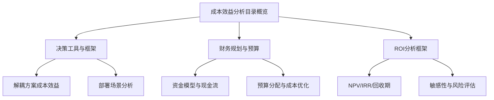
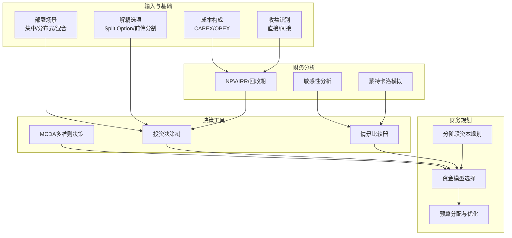
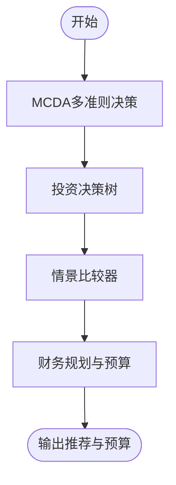
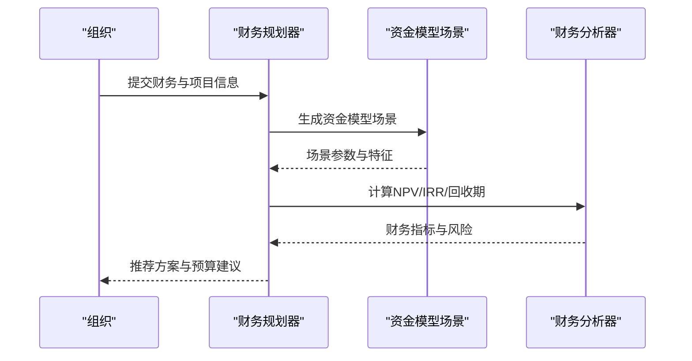
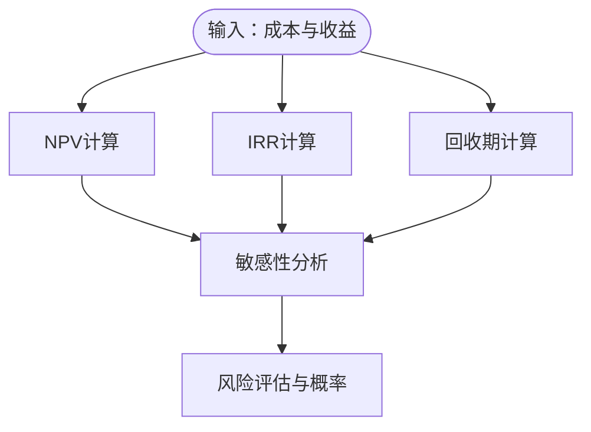
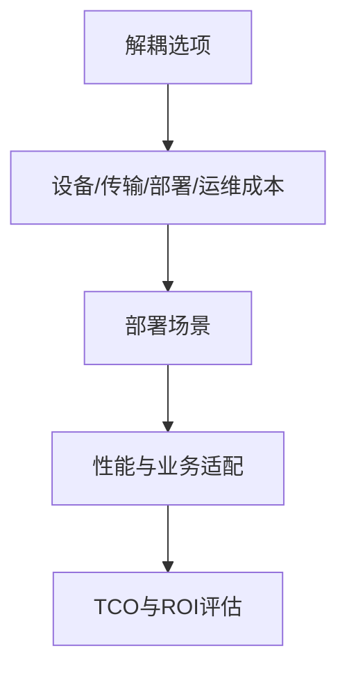
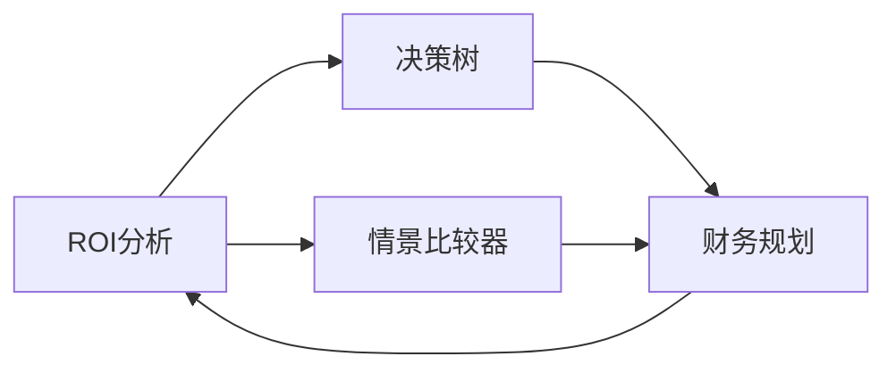

# 成本效益分析

<cite>
**本文引用的文件**
- [成本效益分析目录概览](file://18-cost-benefit-analysis/readme.md)
- [O-RAN成本效益分析决策工具](file://18-cost-benefit-analysis/decision-tools/oran-decision-frameworks.md)
- [O-RAN财务规划与预算](file://18-cost-benefit-analysis/financial-planning/oran-financial-planning.md)
- [O-RAN投资回报分析框架](file://18-cost-benefit-analysis/roi-analysis/o-ran-roi-analysis.md)
- [解耦方案的成本效益分析](file://04-disaggregation-options/cost-benefit-analysis.md)
- [部署场景分析](file://04-disaggregation-options/deployment-scenarios.md)
</cite>

## 目录
1. [引言](#引言)
2. [项目结构](#项目结构)
3. [核心组件](#核心组件)
4. [架构总览](#架构总览)
5. [详细组件分析](#详细组件分析)
6. [依赖关系分析](#依赖关系分析)
7. [性能与财务考量](#性能与财务考量)
8. [故障排查与风险应对](#故障排查与风险应对)
9. [结论](#结论)
10. [附录](#附录)

## 引言
本文件面向O-RAN项目的商业与工程决策者，系统化梳理成本建模、ROI分析、财务规划与风险管控方法论，并结合不同部署场景与解耦选项给出可落地的决策工具与最佳实践。目标是帮助组织在明确成本构成与收益潜力的基础上，制定稳健的投资路线图与预算安排，实现长期价值最大化。

## 项目结构
围绕成本效益分析，相关知识与工具分布在如下主题域：
- 决策工具与框架：多准则决策分析、投资决策树、情景比较与敏感性分析
- 财务规划与预算：分阶段资本规划、资金模型、预算分配与成本优化
- ROI分析：NPV/IRR/回收期等指标计算与敏感性矩阵
- 部署与解耦：不同解耦选项与部署场景的成本效益评估
- 实践案例：集中式/分布式/混合部署的案例与推荐

图表来源
- [成本效益分析目录概览](file://18-cost-benefit-analysis/readme.md#L1-L62)
- [O-RAN成本效益分析决策工具](file://18-cost-benefit-analysis/decision-tools/oran-decision-frameworks.md#L1-L726)
- [O-RAN财务规划与预算](file://18-cost-benefit-analysis/financial-planning/oran-financial-planning.md#L1-L773)
- [O-RAN投资回报分析框架](file://18-cost-benefit-analysis/roi-analysis/o-ran-roi-analysis.md#L1-L181)
- [解耦方案的成本效益分析](file://04-disaggregation-options/cost-benefit-analysis.md#L1-L418)
- [部署场景分析](file://04-disaggregation-options/deployment-scenarios.md#L1-L563)

章节来源
- [成本效益分析目录概览](file://18-cost-benefit-analysis/readme.md#L1-L62)

## 核心组件
- 决策框架与工具
  - 多准则决策分析（MCDA）：财务/技术/战略三维度权重与评价方法
  - 投资决策树：技术路径与部署场景的概率化期望值计算
  - 情景比较器：多指标加权评分与推荐生成
- 财务规划与预算
  - 分阶段资本规划：试点、扩展、全面转型的阶段性目标与预算
  - 资金模型：传统/运营支出/服务化/联合体/渐进迁移等模式
  - 预算分配与成本优化：组合式预算、偏差分析与优化建议
- ROI分析
  - CAPEX/OPEX构成与直接/间接收益量化
  - NPV/IRR/回收期计算与敏感性矩阵
  - 蒙特卡洛模拟与风险评估
- 部署与解耦
  - 解耦选项与传输/部署/运营成本权衡
  - 不同业务场景（eMBB/URLLC/mMTC）与地理场景（核心/边缘/混合）的成本效益
- 实践与案例
  - 集中式/边缘/混合部署的案例效果与推荐

章节来源
- [O-RAN成本效益分析决策工具](file://18-cost-benefit-analysis/decision-tools/oran-decision-frameworks.md#L1-L726)
- [O-RAN财务规划与预算](file://18-cost-benefit-analysis/financial-planning/oran-financial-planning.md#L1-L773)
- [O-RAN投资回报分析框架](file://18-cost-benefit-analysis/roi-analysis/o-ran-roi-analysis.md#L1-L181)
- [解耦方案的成本效益分析](file://04-disaggregation-options/cost-benefit-analysis.md#L1-L418)
- [部署场景分析](file://04-disaggregation-options/deployment-scenarios.md#L1-L563)

## 架构总览
下图展示成本效益分析的总体架构：从成本构成与收益识别出发，经由财务指标与风险评估，形成决策树与情景比较，最终指导分阶段预算与资金模型选择。

图表来源
- [O-RAN成本效益分析决策工具](file://18-cost-benefit-analysis/decision-tools/oran-decision-frameworks.md#L1-L726)
- [O-RAN财务规划与预算](file://18-cost-benefit-analysis/financial-planning/oran-financial-planning.md#L1-L773)
- [O-RAN投资回报分析框架](file://18-cost-benefit-analysis/roi-analysis/o-ran-roi-analysis.md#L1-L181)
- [解耦方案的成本效益分析](file://04-disaggregation-options/cost-benefit-analysis.md#L1-L418)
- [部署场景分析](file://04-disaggregation-options/deployment-scenarios.md#L1-L563)

## 详细组件分析

### 决策框架与工具
- 多准则决策分析（MCDA）
  - 三维度：财务（CAPEX/OPEX/TCO/ROI）、技术（性能/可扩展性/互操作性/未来适应）、战略（上市速度/竞争优势/风险缓解/创新）
  - 权重来自不同视角（CTO/CFO/CIO），采用层次分析法、TOPSIS、加权求和等方法
- 投资决策树
  - 根节点为“技术选择”，分支包含传统RAN/O-RAN/混合架构
  - 每个场景节点包含初始投资、年运营成本、年收益、时间线、风险调整因子
  - 计算期望成本与收益，支持参数敏感性分析与盈亏平衡点识别
- 情景比较器
  - 多指标加权评分：成本效率、时间到价值、风险缓解、灵活性、未来就绪度
  - 输出推荐场景、关键指标与权衡分析

图表来源
- [O-RAN成本效益分析决策工具](file://18-cost-benefit-analysis/decision-tools/oran-decision-frameworks.md#L8-L664)

章节来源
- [O-RAN成本效益分析决策工具](file://18-cost-benefit-analysis/decision-tools/oran-decision-frameworks.md#L8-L664)

### 财务规划与预算
- 分阶段资本规划
  - 试点部署：验证可行性、降低风险、积累能力
  - 扩张部署：规模化复制、流程优化、供应商关系建立
  - 全面转型：网络重塑、运营成熟、业务转型
- 资金模型
  - 传统CapEx、运营支出、O-RAN as a Service、联合体、渐进迁移
  - 评估对资产负债表、现金流与风险的影响，给出推荐等级
- 预算分配与成本优化
  - 组合式预算：战略性投资、运营增强、维持性投入
  - 偏差分析与优化机会识别，提出分阶段优化行动计划与风险提示

图表来源
- [O-RAN财务规划与预算](file://18-cost-benefit-analysis/financial-planning/oran-financial-planning.md#L70-L306)

章节来源
- [O-RAN财务规划与预算](file://18-cost-benefit-analysis/financial-planning/oran-financial-planning.md#L1-L773)

### ROI分析与财务指标
- 成本构成
  - CAPEX：硬件、软件许可、集成、培训、基础设施
  - OPEX：人力、软件维护、硬件维护、能耗、管理工具
- 收益识别
  - 直接收益：硬件成本节约、运营效率提升、快速部署收入、灵活性价值
  - 间接收益：竞争优势、运营效率、客户体验、生态价值
- 财务指标
  - NPV：贴现现金流净值
  - IRR：内部收益率
  - 回收期：累计现金流转正时间
  - 敏感性矩阵：CAPEX/OPEX/收入变化对NPV/IRR的影响
  - 蒙特卡洛模拟：参数波动下的置信区间与概率

图表来源
- [O-RAN投资回报分析框架](file://18-cost-benefit-analysis/roi-analysis/o-ran-roi-analysis.md#L50-L181)

章节来源
- [O-RAN投资回报分析框架](file://18-cost-benefit-analysis/roi-analysis/o-ran-roi-analysis.md#L1-L181)

### 部署与解耦的成本效益
- 解耦选项与成本
  - CU/DU分割点与RU形态对设备、传输、部署、运维、能耗的影响
  - 传输成本随带宽需求上升而增加，需结合业务密度与覆盖场景权衡
- 部署场景
  - 集中式：覆盖广、管理简，但传输成本高、延迟大
  - 分布式：低延迟、贴近用户，但站点多、部署成本高
  - 混合：平衡成本与性能，管理复杂度较高
- 场景推荐
  - 密集城区：分布式部署+合适分割点，满足URLLC
  - 一般城区：混合部署，平衡TCO与性能
  - 郊区：集中式部署，降低初期投资
  - 工业物联网：超低延迟场景，倾向高度解耦与边缘部署

图表来源
- [解耦方案的成本效益分析](file://04-disaggregation-options/cost-benefit-analysis.md#L1-L418)
- [部署场景分析](file://04-disaggregation-options/deployment-scenarios.md#L1-L563)

章节来源
- [解耦方案的成本效益分析](file://04-disaggregation-options/cost-benefit-analysis.md#L1-L418)
- [部署场景分析](file://04-disaggregation-options/deployment-scenarios.md#L1-L563)

## 依赖关系分析
- 决策工具依赖于ROI财务指标与部署/解耦成本数据
- 财务规划依赖于决策工具的推荐与ROI敏感性结果
- ROI分析依赖于成本与收益的量化输入与风险参数

图表来源
- [O-RAN成本效益分析决策工具](file://18-cost-benefit-analysis/decision-tools/oran-decision-frameworks.md#L1-L726)
- [O-RAN财务规划与预算](file://18-cost-benefit-analysis/financial-planning/oran-financial-planning.md#L1-L773)
- [O-RAN投资回报分析框架](file://18-cost-benefit-analysis/roi-analysis/o-ran-roi-analysis.md#L1-L181)

章节来源
- [O-RAN成本效益分析决策工具](file://18-cost-benefit-analysis/decision-tools/oran-decision-frameworks.md#L1-L726)
- [O-RAN财务规划与预算](file://18-cost-benefit-analysis/financial-planning/oran-financial-planning.md#L1-L773)
- [O-RAN投资回报分析框架](file://18-cost-benefit-analysis/roi-analysis/o-ran-roi-analysis.md#L1-L181)

## 性能与财务考量
- ROI与TCO
  - 关注长期TCO与收益曲线，避免仅看初期成本
  - 使用NPV/IRR/回收期综合判断，辅以敏感性分析
- 风险与不确定性
  - 建立风险矩阵与VaR分析，量化市场/技术/财务/运营风险
  - 通过蒙特卡洛模拟评估不同参数波动下的收益分布
- 部署与解耦的权衡
  - 结合业务类型（eMBB/URLLC/mMTC）与地理密度，选择最优解耦与部署组合
  - 重视传输成本与延迟性能对URLLC场景的影响

章节来源
- [O-RAN投资回报分析框架](file://18-cost-benefit-analysis/roi-analysis/o-ran-roi-analysis.md#L90-L181)
- [O-RAN财务规划与预算](file://18-cost-benefit-analysis/financial-planning/oran-financial-planning.md#L558-L771)
- [解耦方案的成本效益分析](file://04-disaggregation-options/cost-benefit-analysis.md#L145-L418)

## 故障排查与风险应对
- 常见问题
  - 低估传输成本或运维复杂度导致TCO超支
  - 忽视延迟与可靠性对URLLC场景的致命影响
  - 未进行敏感性分析，对成本/收入波动准备不足
- 建议措施
  - 建立分阶段验证与迭代机制，降低一次性失败风险
  - 引入风险缓解与保险机制，控制关键风险敞口
  - 采用自动化与标准化工具，降低执行偏差与管理复杂度

章节来源
- [O-RAN财务规划与预算](file://18-cost-benefit-analysis/financial-planning/oran-financial-planning.md#L558-L771)
- [部署场景分析](file://04-disaggregation-options/deployment-scenarios.md#L436-L563)

## 结论
通过将成本构成、ROI指标、部署与解耦策略、财务规划与风险评估有机结合，组织可在不同业务与地理场景下做出更科学的投资决策。建议以分阶段实施与持续优化为核心路径，配合工具化的决策与财务分析，确保在可控风险下实现长期价值最大化。

## 附录
- 关键术语
  - CAPEX：资本性支出
  - OPEX：运营性支出
  - TCO：总拥有成本
  - NPV：净现值
  - IRR：内部收益率
  - ROI：投资回报率
  - VaR：风险价值
- 参考流程
  - 成本与收益量化 → 财务指标计算 → 敏感性与风险评估 → 决策树与情景比较 → 资金模型与预算 → 分阶段实施与优化