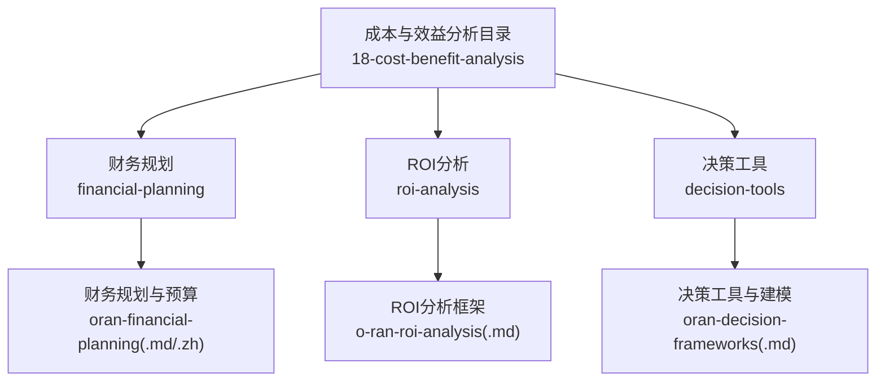
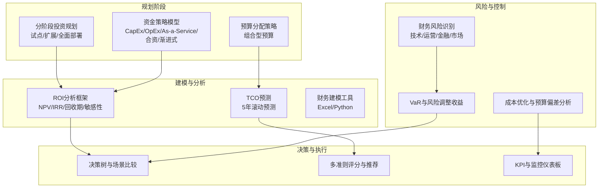
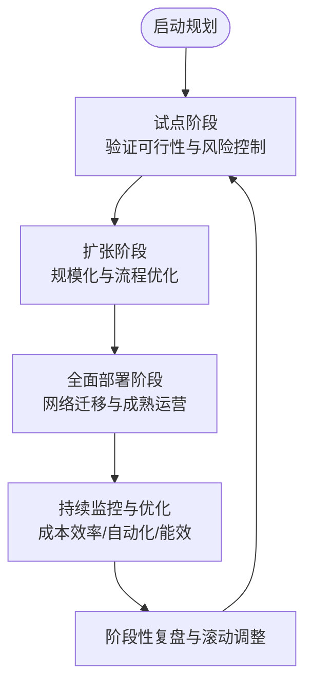
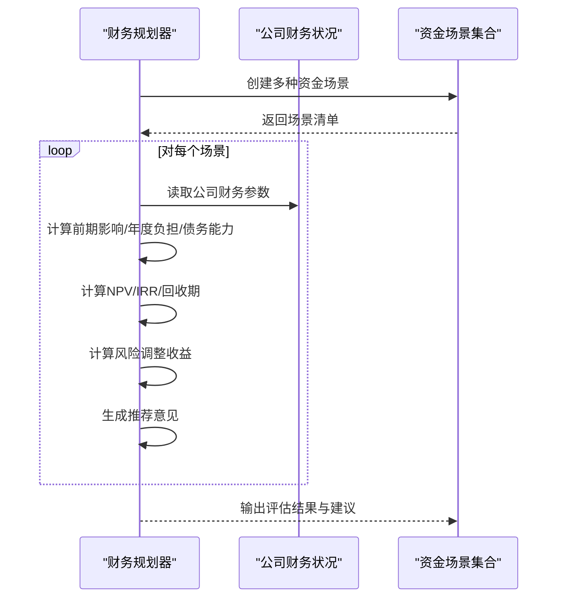
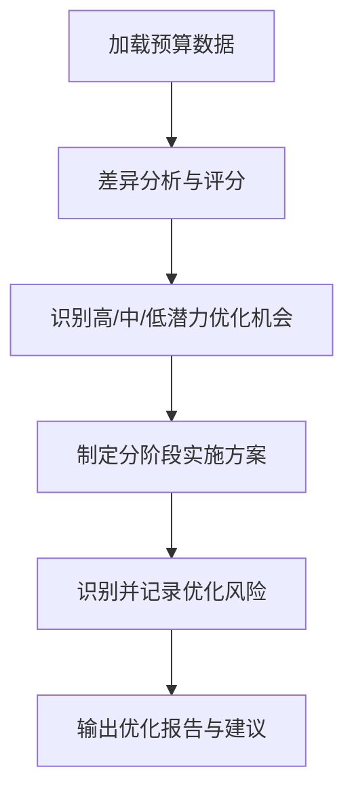
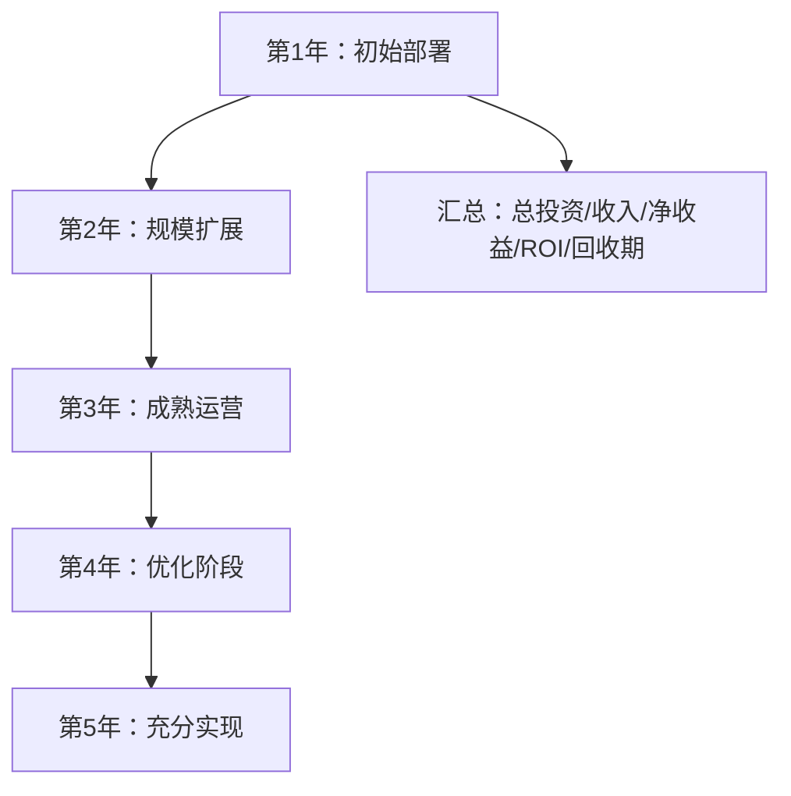
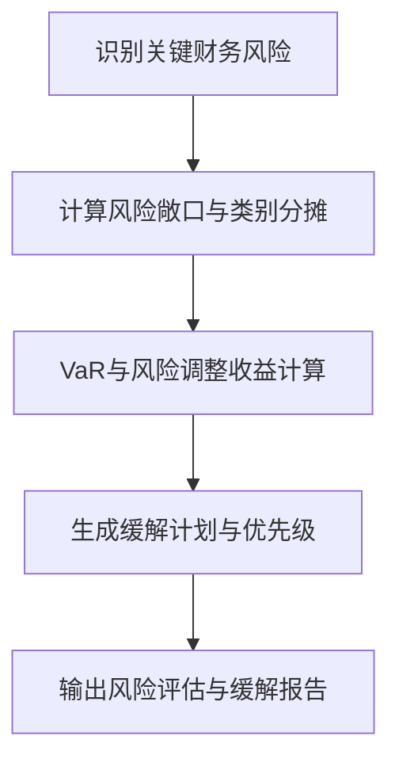
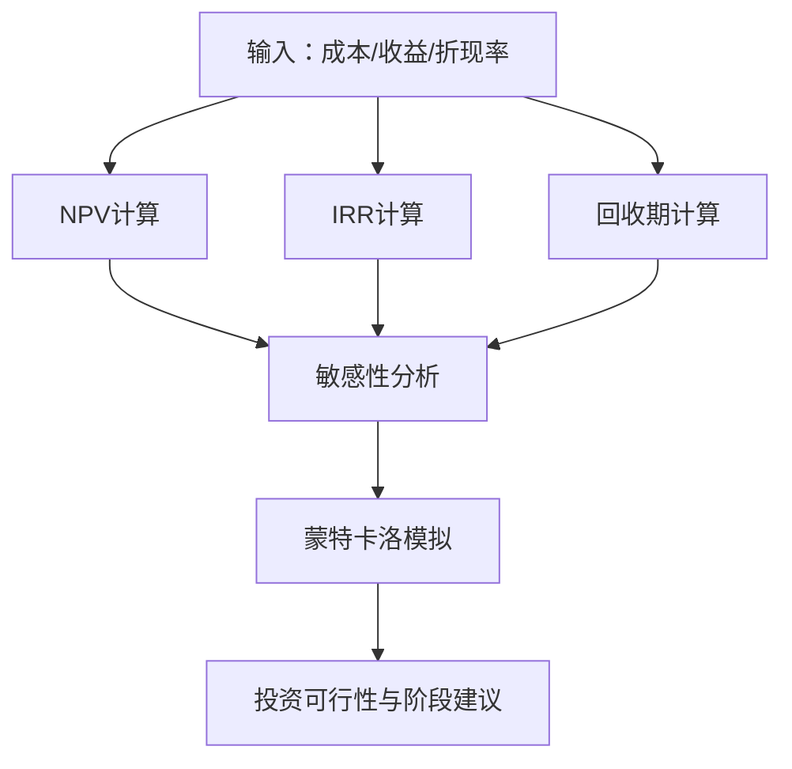
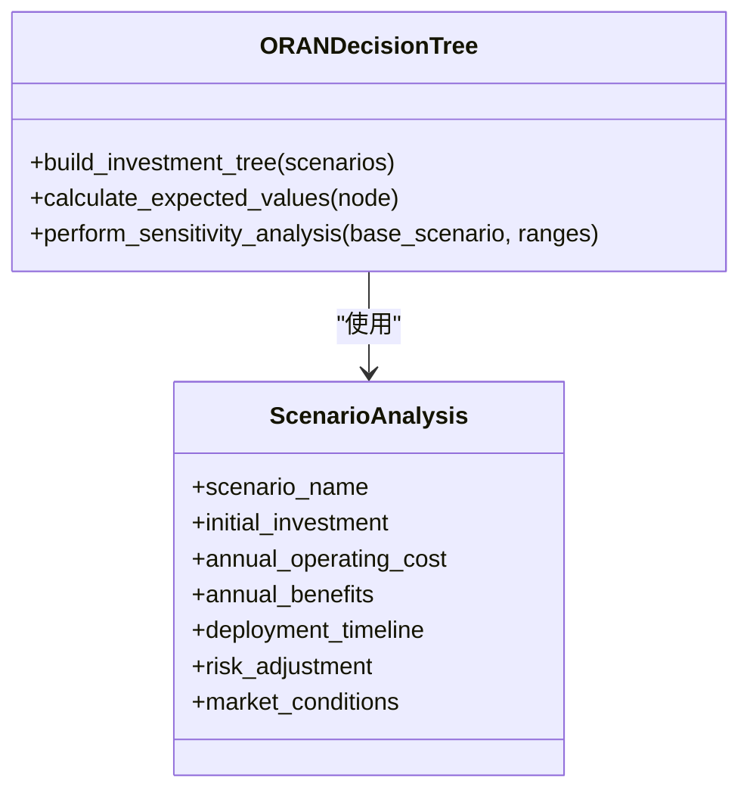
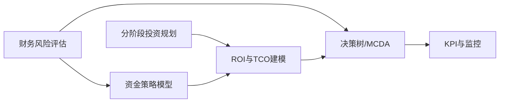

# 财务规划

<cite>
**本文引用的文件**
- [O-RAN财务规划和预算（英文）](file://18-cost-benefit-analysis/financial-planning/oran-financial-planning.md)
- [O-RAN财务规划和预算（中文）](file://18-cost-benefit-analysis/financial-planning/oran-financial-planning-zh.md)
- [O-RAN部署ROI分析框架（英文）](file://18-cost-benefit-analysis/roi-analysis/o-ran-roi-analysis.md)
- [O-RAN成本效益分析决策工具（英文）](file://18-cost-benefit-analysis/decision-tools/oran-decision-frameworks.md)
- [O-RAN成本效益分析（英文）](file://18-cost-benefit-analysis/readme.md)
</cite>

## 目录
1. [引言](#引言)
2. [项目结构](#项目结构)
3. [核心组件](#核心组件)
4. [架构总览](#架构总览)
5. [详细组件分析](#详细组件分析)
6. [依赖关系分析](#依赖关系分析)
7. [性能考量](#性能考量)
8. [故障排查指南](#故障排查指南)
9. [结论](#结论)
10. [附录](#附录)

## 引言
本文件面向O-RAN项目的财务规划与管理，系统化梳理从预算编制、成本控制、资金管理到财务风险与预测分析的全生命周期方法论，并结合项目不同阶段（前期投资、建设期、运营期、退出结算）提出财务控制要点与实践建议。文档以仓库中“成本与效益分析”目录下的财务规划、ROI分析与决策工具为核心素材，辅以财务建模与风险评估方法，帮助读者建立可落地的财务管理框架。

## 项目结构
围绕O-RAN财务主题，仓库中相关资源主要集中在“18-cost-benefit-analysis”目录下，包含财务规划、ROI分析与决策工具三大板块，形成“规划—量化—决策—风险”的闭环支撑。

图表来源
- [O-RAN财务规划和预算（英文）](file://18-cost-benefit-analysis/financial-planning/oran-financial-planning.md#L1-L773)
- [O-RAN部署ROI分析框架（英文）](file://18-cost-benefit-analysis/roi-analysis/o-ran-roi-analysis.md#L1-L181)
- [O-RAN成本效益分析决策工具（英文）](file://18-cost-benefit-analysis/decision-tools/oran-decision-frameworks.md#L1-L726)

章节来源
- [O-RAN成本效益分析（英文）](file://18-cost-benefit-analysis/readme.md#L1-L62)

## 核心组件
- 资本规划与分阶段投资：提供三阶段（试点、扩展、全面部署）的预算分配、目标与成功度量标准，覆盖设备、集成、培训、测试与应急储备等关键要素。
- 资金策略模型：对比传统CapEx、运营费用、即服务、合资与渐进式迁移等五种资金模型，从前期投入、年度支付、风险等级、灵活性与供应商锁定角度进行综合评估。
- 预算优化与成本控制：基于成本分类与差异分析，识别高潜力优化机会，制定分阶段优化方案与风险缓释措施。
- 总拥有成本（TCO）与长期可持续性：给出五年的TCO预测与收益情况，汇总投资、收入与净收益，计算ROI与回收期。
- 财务风险管理：识别技术、运营、金融与市场四类风险，计算风险敞口、VaR与风险调整收益，生成缓解优先级与成本效益矩阵。
- ROI分析与财务指标：明确NPV、IRR、回收期与敏感性分析方法，提供参数矩阵与情景推演，支撑投资可行性判断。
- 决策树与多准则评估：构建技术路径与部署场景的决策树，进行期望值与敏感性分析；提供多准则权重评分与推荐结果。

章节来源
- [O-RAN财务规划和预算（英文）](file://18-cost-benefit-analysis/financial-planning/oran-financial-planning.md#L6-L771)
- [O-RAN部署ROI分析框架（英文）](file://18-cost-benefit-analysis/roi-analysis/o-ran-roi-analysis.md#L1-L181)
- [O-RAN成本效益分析决策工具（英文）](file://18-cost-benefit-analysis/decision-tools/oran-decision-frameworks.md#L1-L726)

## 架构总览
财务规划的系统化架构由“规划—建模—评估—风控—决策—执行监控”构成，贯穿项目全生命周期。

图表来源
- [O-RAN财务规划和预算（英文）](file://18-cost-benefit-analysis/financial-planning/oran-financial-planning.md#L6-L771)
- [O-RAN部署ROI分析框架（英文）](file://18-cost-benefit-analysis/roi-analysis/o-ran-roi-analysis.md#L1-L181)
- [O-RAN成本效益分析决策工具（英文）](file://18-cost-benefit-analysis/decision-tools/oran-decision-frameworks.md#L1-L726)

## 详细组件分析

### 组件A：分阶段投资规划与预算分配
- 投资阶段划分与目标
  - 试点阶段：验证可行性、降低风险、培养能力，预算包含试点设备、集成服务、培训、测试与应急储备。
  - 扩张阶段：规模化部署、流程优化、建立优选供应商协议，体现规模效应与效率提升。
  - 全面部署阶段：完成网络迁移、成熟运营、实现战略收益，强调采购谈判、自动化与能效优化。
- 预算分配策略
  - 组合型预算：战略性投资（40%）、运营增强（35%）、维持性投资（25%），覆盖核心网络改造、边缘计算、AI能力、网络优化、自动化、监控系统、维护支持、人员发展与应急储备。
- 成功度量与滚动优化
  - 关键指标：技术性能、成本效率、运营就绪度；随阶段迭代优化，逐步降低单位成本、提升自动化水平与能效。

图表来源
- [O-RAN财务规划和预算（英文）](file://18-cost-benefit-analysis/financial-planning/oran-financial-planning.md#L8-L66)

章节来源
- [O-RAN财务规划和预算（英文）](file://18-cost-benefit-analysis/financial-planning/oran-financial-planning.md#L6-L66)

### 组件B：资金策略模型与财务影响评估
- 资金模型对比
  - 传统CapEx：一次性大额投入，中等风险，供应商锁定高，灵活性低。
  - 运营费用模型：前期小、后续年付，低风险，灵活性高，供应商锁定中等。
  - 即服务：服务溢价最高，低风险，灵活性最高，供应商锁定最低。
  - 合伙模式：共同投资，中等风险，灵活性中等，供应商锁定中等。
  - 渐进式迁移：分年递增支付，低风险，灵活性较高，供应商锁定中等。
- 财务影响评估维度
  - 前期影响（占年收入比例）、年度负担（占运营利润倍数）、债务能力校验、NPV/IRR/回收期、风险调整收益、推荐意见。
- 决策建议
  - 在公司债务能力范围内，综合风险等级与灵活性得分，给出强推、有条件推或考虑替代方案的结论。

图表来源
- [O-RAN财务规划和预算（英文）](file://18-cost-benefit-analysis/financial-planning/oran-financial-planning.md#L70-L307)

章节来源
- [O-RAN财务规划和预算（英文）](file://18-cost-benefit-analysis/financial-planning/oran-financial-planning.md#L68-L307)

### 组件C：预算优化与成本控制
- 成本分类与差异分析
  - 将预算细分为硬件设备、软件许可、专业服务、员工培训、设施升级、测试验证与应急储备等类别，计算计划/实际/差异与优化潜力。
- 绩效评级与优化建议
  - 基于差异率进行“优秀/良好/可接受/需关注”评级；汇总整体节流潜力与各品类优化机会，制定分阶段实施方案与风险提示。
- 风险识别与缓解
  - 针对高潜力优化项识别质量、知识转移、技能缺口等风险，提出相应缓解措施。

图表来源
- [O-RAN财务规划和预算（英文）](file://18-cost-benefit-analysis/financial-planning/oran-financial-planning.md#L343-L507)

章节来源
- [O-RAN财务规划和预算（英文）](file://18-cost-benefit-analysis/financial-planning/oran-financial-planning.md#L309-L507)

### 组件D：总拥有成本（TCO）与长期可持续性
- 五年度TCO预测
  - 列示每年资本支出、运营支出、总成本、收入影响、净成本与累计收益，汇总总投资、总收入、净收益、ROI与回收期。
- 长期可持续性
  - 通过TCO与收益曲线展示项目在成熟期转为正向现金流，实现财务自持与持续增长。

图表来源
- [O-RAN财务规划和预算（英文）](file://18-cost-benefit-analysis/financial-planning/oran-financial-planning.md#L509-L556)

章节来源
- [O-RAN财务规划和预算（英文）](file://18-cost-benefit-analysis/financial-planning/oran-financial-planning.md#L509-L556)

### 组件E：财务风险管理与VaR分析
- 风险识别与分类
  - 技术风险（供应商方案成熟度）、运营风险（部署延期）、金融风险（利率上升）、市场风险（竞品采用）与技能短缺影响。
- 风险暴露与VaR
  - 计算总风险敞口、按类别分摊、风险调整收益与风险容忍度；通过蒙特卡洛模拟计算不同置信水平的VaR与预期损失。
- 缓解优先级
  - 基于缓解成本与效果计算净收益，区分高/中/低优先级，形成缓解计划与总成本与预期降低额度。

图表来源
- [O-RAN财务规划和预算（英文）](file://18-cost-benefit-analysis/financial-planning/oran-financial-planning.md#L558-L771)

章节来源
- [O-RAN财务规划和预算（英文）](file://18-cost-benefit-analysis/financial-planning/oran-financial-planning.md#L558-L771)

### 组件F：ROI分析与财务指标
- 投资与成本构成
  - CAPEX：硬件基础设施、软件许可、集成服务、培训认证、基础设施设置。
  - OPEX：人力资源、软件维护、硬件维护、能耗、管理工具。
- 收益与价值
  - 直接收益：硬件成本节约、运营效率、快速部署收入、灵活性价值；间接收益：竞争优势、运营效率、客户体验、生态价值。
- 财务指标与敏感性
  - 明确NPV、IRR、回收期计算公式；提供成本敏感性矩阵与时间跨度分析；引入蒙特卡洛模拟与风险评估。
- 决策框架
  - 提供分阶段投资建议与合作伙伴策略；设定KPI与基准对比，形成持续监控与优化闭环。

图表来源
- [O-RAN部署ROI分析框架（英文）](file://18-cost-benefit-analysis/roi-analysis/o-ran-roi-analysis.md#L50-L181)

章节来源
- [O-RAN部署ROI分析框架（英文）](file://18-cost-benefit-analysis/roi-analysis/o-ran-roi-analysis.md#L1-L181)

### 组件G：决策树与多准则评估
- 投资决策树
  - 技术路径：传统RAN、O-RAN部署、混合架构；部署场景：绿地、棕地、混合；构建节点与子分支，计算期望成本与收益，进行敏感性分析与盈亏平衡点求解。
- 多准则评估（MCDA）
  - 财务、技术、战略三维度权重，结合层次分析法、TOPSIS、加权求和等方法，形成综合评分与推荐。
- 场景比较
  - 基于成本效率、时间到价值、风险、灵活性与未来适应性进行评分，生成推荐与关键指标摘要。

图表来源
- [O-RAN成本效益分析决策工具（英文）](file://18-cost-benefit-analysis/decision-tools/oran-decision-frameworks.md#L55-L304)

章节来源
- [O-RAN成本效益分析决策工具（英文）](file://18-cost-benefit-analysis/decision-tools/oran-decision-frameworks.md#L55-L304)

## 依赖关系分析
- 规划与建模的耦合
  - 分阶段投资规划为ROI与TCO建模提供参数输入；资金策略模型为NPV/IRR/回收期计算提供现金流假设。
- 风险与决策的联动
  - 财务风险评估结果影响资金模型选择与决策树权重；缓解计划为预算优化与成本控制提供约束条件。
- 工具链协同
  - Python脚本（财务分析、风险建模、场景比较）与Excel模板（TCO计算器）互补，形成从数据采集到可视化呈现的完整工具链。

图表来源
- [O-RAN财务规划和预算（英文）](file://18-cost-benefit-analysis/financial-planning/oran-financial-planning.md#L6-L771)
- [O-RAN部署ROI分析框架（英文）](file://18-cost-benefit-analysis/roi-analysis/o-ran-roi-analysis.md#L1-L181)
- [O-RAN成本效益分析决策工具（英文）](file://18-cost-benefit-analysis/decision-tools/oran-decision-frameworks.md#L1-L726)

## 性能考量
- 计算复杂度与可扩展性
  - 财务分析（NPV/IRR/蒙特卡洛）与风险建模（VaR）均具备良好的可扩展性，可通过增加迭代次数与参数维度提升稳健性。
- 实时监控与反馈
  - 建议将关键财务指标纳入实时监控仪表板，结合预算执行跟踪与KPI对比，形成闭环反馈机制。
- 成本控制效率
  - 通过成本分类与差异分析，快速定位高潜力优化项，配合分阶段实施方案与风险提示，确保优化收益最大化且可控。

## 故障排查指南
- 预算偏差异常
  - 若某品类出现超支或结余显著偏离，优先核查合同条款、变更流程与验收标准，确认是否存在未纳入预算的隐性成本。
- 资金模型不匹配
  - 当债务能力校验不通过或风险调整收益偏低时，重新审视前期投入比例、支付节奏与供应商锁定程度，必要时切换至更灵活的资金模型。
- ROI与TCO不一致
  - 检查折现率、收入增长假设与成本通胀参数是否合理；对敏感性分析进行压力测试，识别关键变量波动对结果的影响。
- 风险缓解无效
  - 若缓解成本过高或效果不佳，重新评估缓解策略的有效性与优先级，必要时调整预算与时间安排，确保风险容忍度可控。

## 结论
O-RAN财务规划应以分阶段投资规划为基础，结合资金策略模型与ROI/TCO建模，系统化开展成本控制与风险管理工作。通过多准则评估与决策树工具，形成可量化的投资建议与实施路径；在运营期持续监控关键财务指标，确保项目在财务上可持续、可扩展并可退出。

## 附录
- 财务报告与分析工具使用建议
  - 建立月度/季度预算执行跟踪表，对照成本分类与差异分析，及时预警偏差。
  - 设定KPI看板（ROI、回收期、NPV增长、成本效率等），定期与行业基准对比，识别改进空间。
  - 在项目关键节点（试点完成、扩展完成、全面上线）进行财务复盘，滚动调整后续阶段预算与资源分配。
- 不同项目阶段的财务控制要点
  - 前期投资控制：严格控制试点预算与应急储备，聚焦验证目标与风险缓释。
  - 建设期成本管理：强化合同与变更管理，推进标准化与自动化以降低成本。
  - 运营期财务监控：持续优化运营成本，提升自动化水平与能效，确保现金流健康。
  - 项目退出财务结算：评估资产处置与剩余价值，完成最终财务决算与经验总结。