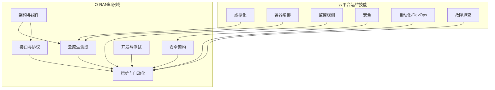
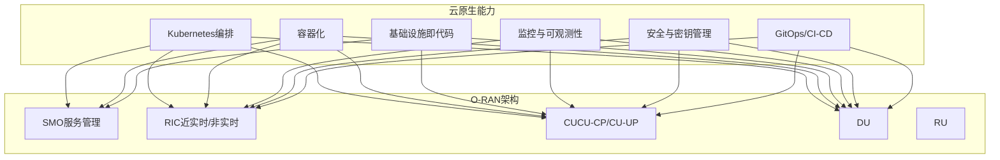
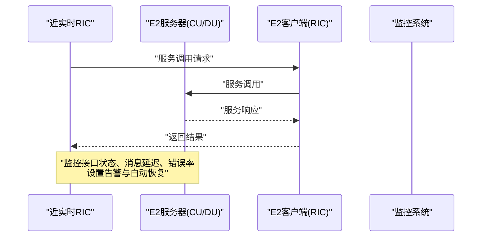
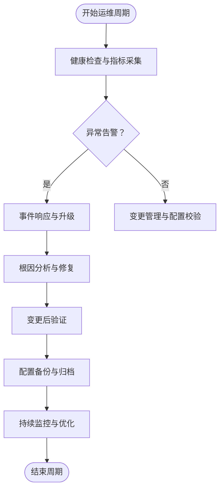
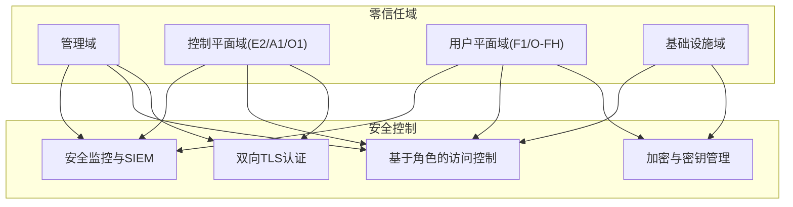
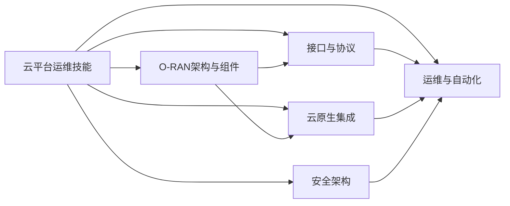

# 技能迁移指南

<cite>
**本文引用的文件**
- [云平台到O-RAN专家转型指南](file://transition-guide/readme-zh.md)
- [O-RAN学习路径](file://19-talent-development/learning-paths/o-ran-learning-roadmaps-zh.md)
- [O-RAN职业发展框架](file://19-talent-development/career-development/o-ran-career-pathways-zh.md)
- [O-RAN人才认证体系](file://19-talent-development/certification-system/oran-certification-program.md)
- [云原生架构与 O-RAN 集成](file://05-cloud-integration/cloud-native-architecture.md)
- [E2 接口](file://03-interface-standards/e2-interface.md)
- [O-RAN 日常运维程序](file://14-operations-management/daily-operations/daily-operation-procedures-zh.md)
- [O-RAN 安全架构参考](file://12-security-privacy/security-architecture/security-reference-architecture-zh.md)
- [O-RAN开发工具包](file://22-tool-platforms/development-tools/o-ran-development-toolkit-zh.md)
- [O-RAN 故障诊断与排除](file://27-troubleshooting-diagnosis/readme-zh.md)
- [O-CU](file://02-core-components/o-cu.md)
</cite>

## 目录
1. [引言](#引言)
2. [项目结构](#项目结构)
3. [核心组件](#核心组件)
4. [架构总览](#架构总览)
5. [详细组件分析](#详细组件分析)
6. [依赖分析](#依赖分析)
7. [性能考虑](#性能考虑)
8. [故障排查指南](#故障排查指南)
9. [结论](#结论)
10. [附录](#附录)

## 引言
本指南面向云平台运维专家，系统梳理从云技能到O-RAN领域的迁移路径，明确现有技能与O-RAN知识的映射关系，给出可落地的学习阶段、资源分配与认证建议，并提供常见障碍的解决方案与成功案例参考。目标是帮助具备虚拟化、容器编排、监控观测、安全、自动化、DevOps、故障排查等能力的专业人士，高效转型为O-RAN专家。

## 项目结构
该知识库围绕O-RAN生态的关键维度构建，涵盖架构演进、核心组件、接口标准、云原生集成、运维管理、安全架构、开发工具与测试验证等主题。对于技能迁移而言，以下主题尤为关键：
- 云原生与O-RAN集成：容器化、微服务、编排、基础设施即代码、监控与可观测性
- 接口与协议：E2、A1、O1、F1、O-FH等接口的协议栈与运维要点
- 运维与自动化：日常运维程序、变更管理、事件响应、性能监控与告警
- 安全架构：零信任、加密与密钥管理、认证授权、安全监控与合规
- 开发工具与测试：IDE与Git工作流、仿真与协议分析、容器与Kubernetes、API与测试框架、CI/CD流水线

**章节来源**
- [云平台到O-RAN专家转型指南](file://transition-guide/readme-zh.md#L1-L116)

## 核心组件
本节聚焦云平台运维专家最易迁移的技能与O-RAN知识的对应关系，给出“现有技能—O-RAN映射—新增能力”的对照表与迁移要点。

- 虚拟化 → CU/DU虚拟化与实时处理要求
  - 迁移要点：将虚拟化资源池管理经验迁移到CU/DU的资源调度；关注实时性约束与硬件加速（如SR-IOV、DPDK）对虚拟化的影响。
  - 新增能力：理解RAN实时处理、时钟同步、前传网络延迟与抖动控制。

- 容器编排 → O-RAN服务管理与SMO集成
  - 迁移要点：将Kubernetes部署、扩缩容、滚动升级经验迁移到RIC、CU、DU等组件的编排；关注近实时与非实时RIC的差异化部署策略。
  - 新增能力：掌握E2接口、A1接口、O1接口的编排与集成。

- 监控与可观测性 → O-RAN运维与接口监控
  - 迁移要点：将Prometheus/Grafana、日志聚合、分布式追踪经验迁移到O-RAN指标采集与告警；关注RAN特定KPI与端到端业务监控。
  - 新增能力：掌握E2、F1、O-FH等接口的协议级监控与性能分析。

- 安全 → O-RAN安全与多厂商环境
  - 迁移要点：将零信任、加密、访问控制、审计经验迁移到O-RAN多域安全；关注mTLS、RBAC、密钥管理与合规。
  - 新增能力：理解3GPP、ETSI标准下的安全要求与威胁建模。

- 自动化与DevOps → RIC与xApps开发、CI/CD
  - 迁移要点：将CI/CD流水线、GitOps、IaC经验迁移到xApps/rApps的开发与部署；关注GitOps与Helm/Kustomize在O-RAN中的应用。
  - 新增能力：掌握E2接口的自动化闭环、xApp生命周期管理与测试框架。

- 故障排查 → O-RAN问题定位与事件响应
  - 迁移要点：将系统性故障排查方法迁移到O-RAN；建立按域（管理、控制、用户平面、基础设施）的故障定位流程。
  - 新增能力：掌握协议分析、接口状态与性能指标的联合诊断。

**章节来源**
- [云平台到O-RAN专家转型指南](file://transition-guide/readme-zh.md#L10-L40)

## 架构总览
O-RAN将传统BBU集中化处理拆分为CU-CP/CU-UP与DU/RU，结合云原生技术实现灵活部署与弹性扩展。云平台运维专家可将容器化、微服务、编排与基础设施即代码等能力直接复用到O-RAN的SMO、RIC、CU、DU等组件。

**章节来源**
- [云原生架构与 O-RAN 集成](file://05-cloud-integration/cloud-native-architecture.md#L1-L120)

## 详细组件分析

### E2接口：从云监控到RAN控制闭环
E2接口是RIC与CU/DU之间的服务化控制面接口，基于SCTP/STREAMS，支持服务发现、调用、事件通知与订阅管理。云平台运维专家可将“接口可用性、吞吐量、延迟”等监控经验迁移到E2接口的运维与优化。

- 迁移要点
  - 将Kubernetes服务发现与负载均衡经验迁移到E2接口的多流与多路径配置。
  - 将Prometheus/Grafana的指标采集与告警经验迁移到E2接口的性能与可用性监控。
  - 将GitOps与CI/CD经验迁移到E2接口的配置管理与版本升级。

- 新增能力
  - 掌握E2AP/E2SM消息格式、订阅生命周期与事件过滤。
  - 理解SCTP参数优化、消息压缩与缓存机制对性能的影响。
  - 熟悉跨厂商互操作与mTLS认证在E2接口中的应用。

**章节来源**
- [E2 接口](file://03-interface-standards/e2-interface.md#L1-L120)
- [E2 接口](file://03-interface-standards/e2-interface.md#L120-L240)
- [E2 接口](file://03-interface-standards/e2-interface.md#L240-L337)

### O-RAN日常运维：从系统健康检查到变更管理
O-RAN日常运维强调“自动化健康检查、配置备份与恢复、变更管理流程、事件响应与故障处理”。云平台运维专家可将IaC、CI/CD与自动化脚本经验直接复用到O-RAN运维。

- 迁移要点
  - 将Shell/Python脚本自动化经验迁移到O-RAN组件健康检查与网络接口监控。
  - 将GitOps与CI/CD经验迁移到配置变更的自动化与回滚。
  - 将Prometheus/Grafana经验迁移到O-RAN关键KPI仪表板与告警规则。

- 新增能力
  - 掌握O-RAN组件（RIC、CU、DU、SMO）的健康检查与性能基线。
  - 理解变更管理流程（请求、评估、审批、实施、验证、回滚）。
  - 熟悉事件分级与沟通协议，建立SLA驱动的响应时间线。

**章节来源**
- [O-RAN 日常运维程序](file://14-operations-management/daily-operations/daily-operation-procedures-zh.md#L1-L120)
- [O-RAN 日常运维程序](file://14-operations-management/daily-operations/daily-operation-procedures-zh.md#L120-L280)
- [O-RAN 日常运维程序](file://14-operations-management/daily-operations/daily-operation-procedures-zh.md#L280-L419)

### 安全架构：从零信任到O-RAN多域安全
O-RAN安全采用零信任与纵深防御策略，划分管理域、控制平面域、用户平面域与基础设施域，分别实施mTLS、RBAC、加密与密钥管理。云平台运维专家可将云安全最佳实践迁移到O-RAN多厂商、多域环境。

- 迁移要点
  - 将mTLS与证书管理经验迁移到O-RAN接口的双向认证与吊销检查。
  - 将RBAC与最小权限原则迁移到O-RAN角色与权限映射。
  - 将密钥管理与轮换经验迁移到O-RAN组件的密钥派生与加密存储。

- 新增能力
  - 理解3GPP、ETSI与ISO/IEC 27001在O-RAN中的合规要求。
  - 掌握威胁建模与安全事件检测、响应与恢复流程。

**章节来源**
- [O-RAN 安全架构参考](file://12-security-privacy/security-architecture/security-reference-architecture-zh.md#L1-L120)
- [O-RAN 安全架构参考](file://12-security-privacy/security-architecture/security-reference-architecture-zh.md#L120-L260)
- [O-RAN 安全架构参考](file://12-security-privacy/security-architecture/security-reference-architecture-zh.md#L260-L480)

### 开发工具与测试：从CI/CD到xApps/rApps
O-RAN开发工具包涵盖IDE扩展、Git工作流、仿真与协议分析、容器与Kubernetes、API与测试框架、CI/CD流水线等。云平台运维专家可将DevOps与测试经验迁移到O-RAN应用开发与部署。

- 迁移要点
  - 将Git工作流与代码质量工具迁移到O-RAN项目协作与合规性检查。
  - 将容器与Kubernetes经验迁移到xApps/rApps的本地开发与集群部署。
  - 将API测试与契约测试经验迁移到E2/O1等接口的自动化测试。

- 新增能力
  - 掌握Wireshark/E2AP/eCPRI/O1解析器的协议分析。
  - 熟悉Helm/Kustomize与ArgoCD在GitOps中的应用。
  - 了解NS-3仿真与Kubernetes集成的测试环境管理。

**章节来源**
- [O-RAN开发工具包](file://22-tool-platforms/development-tools/o-ran-development-toolkit-zh.md#L1-L120)
- [O-RAN开发工具包](file://22-tool-platforms/development-tools/o-ran-development-toolkit-zh.md#L120-L260)
- [O-RAN开发工具包](file://22-tool-platforms/development-tools/o-ran-development-toolkit-zh.md#L260-L420)
- [O-RAN开发工具包](file://22-tool-platforms/development-tools/o-ran-development-toolkit-zh.md#L420-L488)

### O-CU：从云资源到RAN控制与用户面
O-CU将高层协议处理集中在CU-CP/CU-UP，支持与DU/RU的分离部署与弹性扩展。云平台运维专家可将容器化与编排经验迁移到O-CU的部署与运维。

- 迁移要点
  - 将容器镜像构建与安全扫描经验迁移到O-CU组件的镜像管理。
  - 将Kubernetes部署与扩缩容经验迁移到CU-CP/CU-UP的弹性伸缩。
  - 将监控与告警经验迁移到O-CU的信令与用户面性能指标。

- 新增能力
  - 理解F1、E1、NG接口的协议与性能要求。
  - 掌握CU-CP/CU-UP分离部署与跨域资源协调。
  - 熟悉容量规划与网络优化（带宽、延迟、QoS）。

**章节来源**
- [O-CU](file://02-core-components/o-cu.md#L1-L120)
- [O-CU](file://02-core-components/o-cu.md#L120-L240)
- [O-CU](file://02-core-components/o-cu.md#L240-L360)
- [O-CU](file://02-core-components/o-cu.md#L360-L419)

## 依赖分析
云平台运维专家在O-RAN领域的技能迁移呈现“强耦合、弱依赖”的特点：容器编排、监控观测、自动化与安全等能力与O-RAN运维高度契合；而无线协议、RAN优化、接口细节等则需要系统学习与实践验证。

**章节来源**
- [云平台到O-RAN专家转型指南](file://transition-guide/readme-zh.md#L10-L40)
- [云原生架构与 O-RAN 集成](file://05-cloud-integration/cloud-native-architecture.md#L1-L120)

## 性能考虑
- 实时性与延迟：近实时RIC与前传网络对延迟极为敏感，需结合SR-IOV、DPDK、容器资源预留等技术优化。
- 可靠性与可用性：电信级5个9的可用性要求，需通过多副本、自动故障转移、健康检查与自愈机制保障。
- 可观测性：统一监控（日志、指标、追踪）与智能告警，结合AI驱动的异常检测与根因分析。
- 安全性：多域隔离、mTLS、RBAC、密钥管理与安全扫描，满足合规与威胁防护。

**章节来源**
- [云原生架构与 O-RAN 集成](file://05-cloud-integration/cloud-native-architecture.md#L120-L240)
- [O-RAN 安全架构参考](file://12-security-privacy/security-architecture/security-reference-architecture-zh.md#L120-L260)

## 故障排查指南
- 故障分类：硬件、软件、网络、协议等；建立按域（管理、控制、用户平面、基础设施）的故障定位流程。
- 诊断方法：现象收集、影响评估、初步排查、深入分析、根因确定、解决方案。
- 工具箱：系统诊断（dmesg、journalctl、sar、vmstat）、网络诊断（ping、traceroute、ss）、应用诊断（jstack、gdb）、专用工具（协议分析器、O-RAN诊断软件）。
- 预防与演练：定期巡检、配置基线、备份与回滚、故障演练与流程review。

**章节来源**
- [O-RAN 故障诊断与排除](file://27-troubleshooting-diagnosis/readme-zh.md#L1-L40)
- [O-RAN 日常运维程序](file://14-operations-management/daily-operations/daily-operation-procedures-zh.md#L280-L419)

## 结论
云平台运维专家具备的容器化、编排、监控观测、安全、自动化与故障排查能力，与O-RAN的云原生部署、接口控制、运维自动化与安全架构高度契合。通过系统化的学习路径与认证体系，结合实践项目与案例复盘，可在6-12个月内完成从云运维到O-RAN专家的转型，并在O-RAN生态中发挥独特价值。

## 附录

### 系统化学习路径（6阶段）
- 阶段一：O-RAN基础（1-2周）
  - 重点：O-RAN参考架构、核心组件、接口标准
  - 活动：研读WG1架构规范，理解O-Cloud、O-RIC、O-CU、O-DU、O-RU层次关系
  - 资源：O-RAN联盟官方架构概览、术语表

- 阶段二：技术架构与接口（2-3周）
  - 重点：服务层/控制层/管理层分层、E2/A1/O1/O-FH协议栈
  - 活动：分析接口消息格式与流程，评估解耦方案性能影响
  - 资源：WG4接口规范、E2AP/A1/O1文档

- 阶段三：O-RAN实施（3-4周）
  - 重点：部署架构设计、硬件与网络规划、集成测试策略
  - 活动：制定IaC与CI/CD方案，建立运维监控体系
  - 资源：部署指南、集成测试规范、运维最佳实践

- 阶段四：高级技术（4-6周）
  - 重点：RIC架构、xApps/rApps开发、AI/ML优化
  - 活动：搭建开发环境，实现示例xApp与性能优化
  - 资源：WG2 RIC规范、xApps开发指南、AI/ML框架

- 阶段五：标准与行业实践（2-3周）
  - 重点：O-RAN、ETSI、3GPP标准与Plugfest
  - 活动：研究合规测试、参与多厂商集成与测试
  - 资源：合规测试程序、ETSI标准、Plugfest报告

- 阶段六：认证与职业发展（持续）
  - 重点：O-RAN联盟认证、ETSI/厂商认证、职业路径
  - 活动：准备考试、参与社区、贡献开源、持续学习
  - 资源：认证体系、学习路径、职业发展框架

**章节来源**
- [云平台到O-RAN专家转型指南](file://transition-guide/readme-zh.md#L41-L67)
- [O-RAN学习路径](file://19-talent-development/learning-paths/o-ran-learning-roadmaps-zh.md#L1-L120)

### 认证与职业发展
- 认证体系
  - O-RAN联盟认证（助理/专业/专家）
  - ETSI O-RAN培训与认证
  - 3GPP RAN规范理解
  - 厂商特定认证（Ericsson/Nokia/Samsung/ZTE/Huawei）

- 职业路径
  - O-RAN部署专家、运维专家、RIC应用开发者、解决方案架构师、标准贡献者
  - 持续发展：加入O-RAN联盟、参加会议、贡献开源、建立专业网络

**章节来源**
- [O-RAN人才认证体系](file://19-talent-development/certification-system/oran-certification-program.md#L1-L114)
- [O-RAN职业发展框架](file://19-talent-development/career-development/o-ran-career-pathways-zh.md#L1-L120)

### 常见学习障碍与解决方案
- 障碍：无线协议与RAN优化缺乏背景
  - 解决：通过仿真平台（NS-3）与协议分析器（Wireshark）建立感性认识
- 障碍：接口复杂、跨厂商互操作困难
  - 解决：以E2接口为切入点，结合GitOps与CI/CD流程管理接口版本与配置
- 障碍：实时性与云原生弹性冲突
  - 解决：学习容器性能优化、网络与存储优化、资源预留与QoS策略
- 障碍：安全与合规压力大
  - 解决：采用零信任与纵深防御，建立mTLS、RBAC与密钥管理流程

**章节来源**
- [O-RAN开发工具包](file://22-tool-platforms/development-tools/o-ran-development-toolkit-zh.md#L120-L260)
- [云原生架构与 O-RAN 集成](file://05-cloud-integration/cloud-native-architecture.md#L120-L240)
- [O-RAN 安全架构参考](file://12-security-privacy/security-architecture/security-reference-architecture-zh.md#L120-L260)