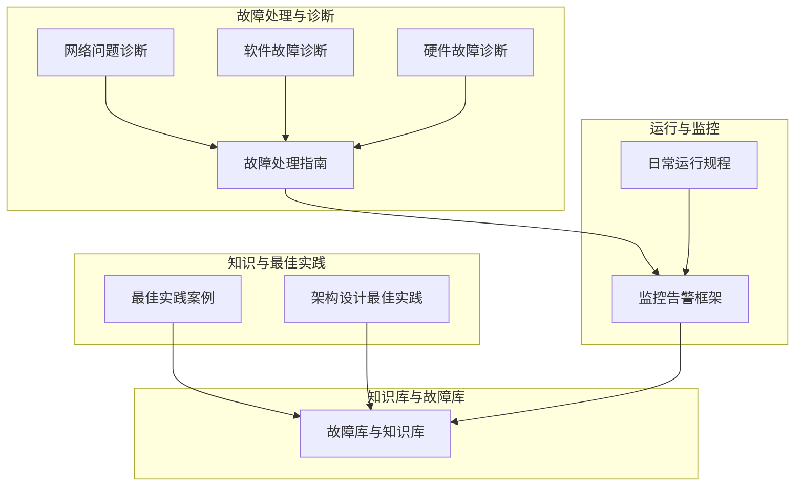
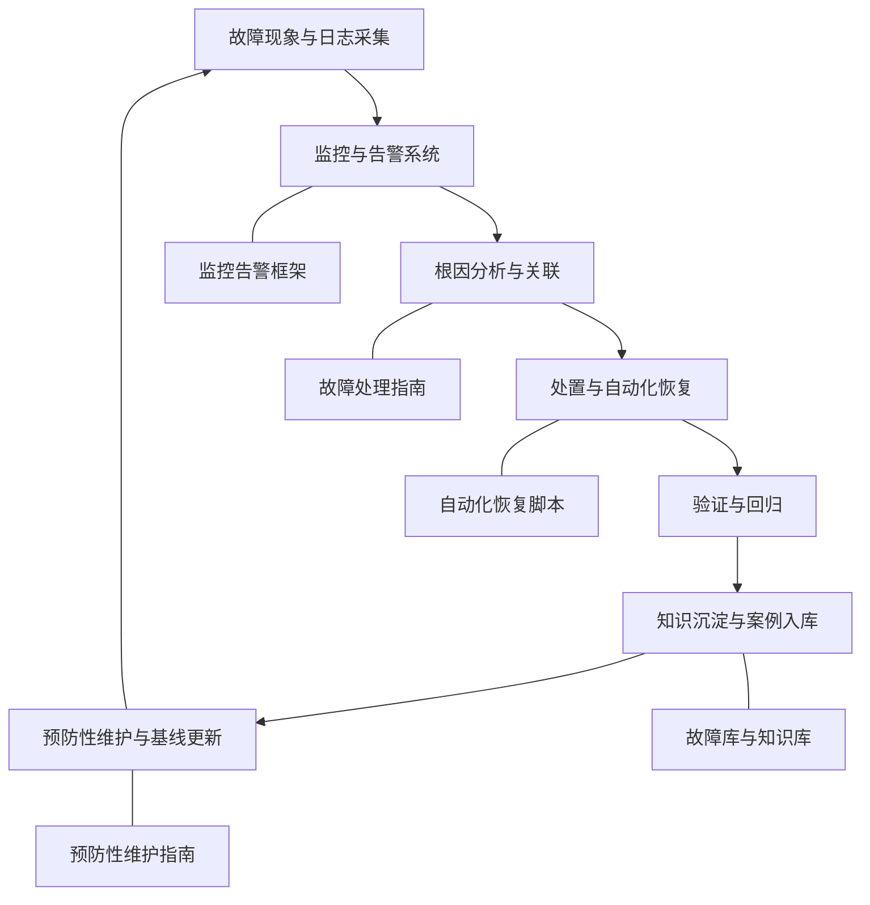
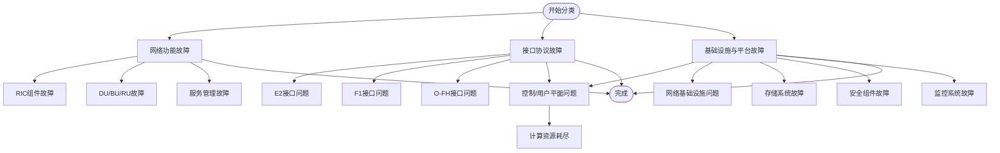
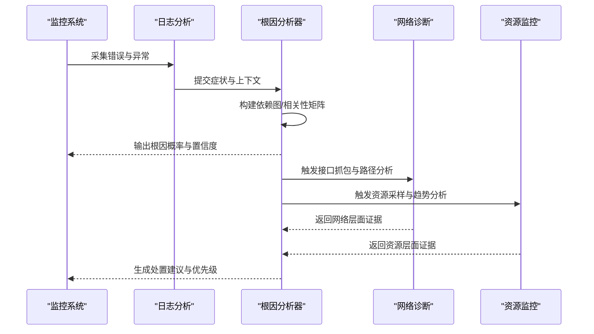
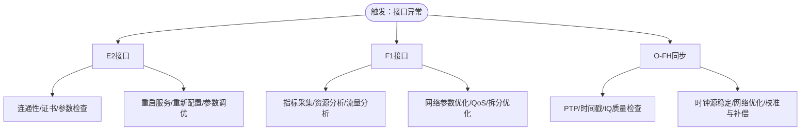
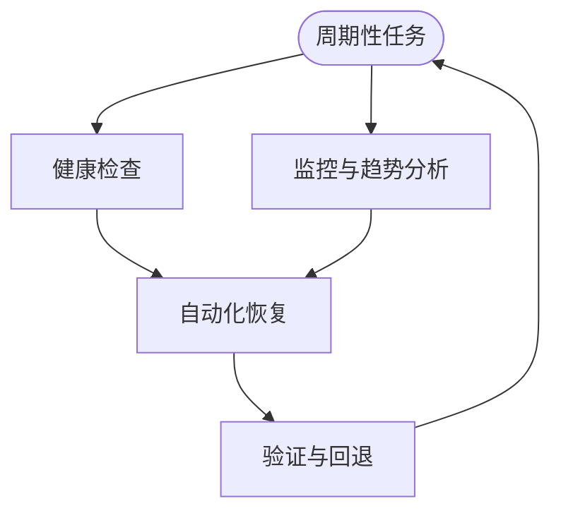
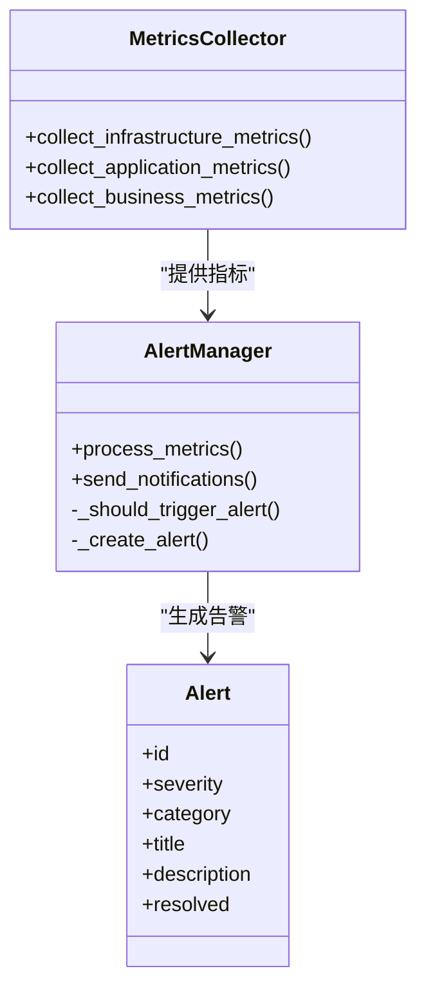
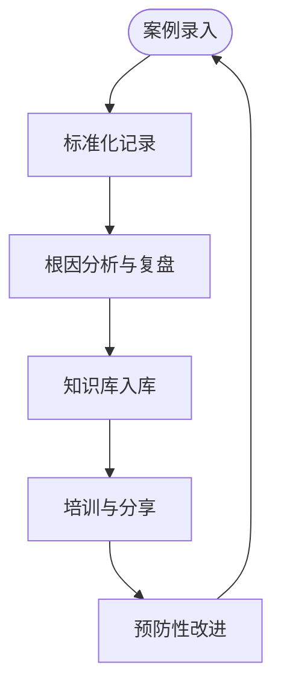
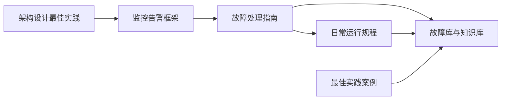
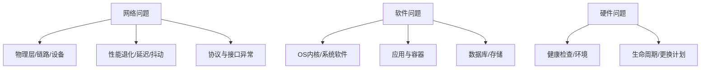

# 故障库

<cite>
**本文引用的文件**
- [故障处理指南（英文）](file://14-operations-management/fault-handling/fault-troubleshooting-guide.md)
- [故障处理指南（中文）](file://14-operations-management/fault-handling/fault-troubleshooting-guide-zh.md)
- [网络问题诊断（英文）](file://27-troubleshooting-diagnosis/network-issues/o-ran-network-troubleshooting.md)
- [网络问题诊断（中文）](file://27-troubleshooting-diagnosis/network-issues/o-ran-network-troubleshooting-zh.md)
- [软件故障诊断（英文）](file://27-troubleshooting-diagnosis/software-faults/o-ran-software-troubleshooting.md)
- [软件故障诊断（中文）](file://27-troubleshooting-diagnosis/software-faults/o-ran-software-troubleshooting-zh.md)
- [硬件故障诊断（英文）](file://27-troubleshooting-diagnosis/hardware-faults/hardware-troubleshooting-guide.md)
- [日常运行规程](file://14-operations-management/daily-operations/daily-operation-procedures.md)
- [监控告警框架（英文）](file://14-operations-management/monitoring-alerting/operations-monitoring-framework.md)
- [监控告警框架（中文）](file://14-operations-management/monitoring-alerting/operations-monitoring-framework-zh.md)
- [最佳实践案例（英文）](file://21-case-studies/best-practices/o-ran-best-practice-cases.md)
- [最佳实践案例（中文）](file://21-case-studies/best-practices/o-ran-best-practice-cases-zh.md)
- [架构设计最佳实践（英文）](file://30-best-practices/architecture-practices/architecture-design-best-practices.md)
- [架构设计最佳实践（中文）](file://30-best-practices/architecture-practices/architecture-design-best-practices-zh.md)
- [故障库与知识库（英文）](file://27-troubleshooting-diagnosis/fault-library/o-ran-fault-case-database.md)
- [故障库与知识库（中文）](file://27-troubleshooting-diagnosis/fault-library/o-ran-fault-case-database-zh.md)
</cite>

## 目录
1. [引言](#引言)
2. [项目结构](#项目结构)
3. [核心组件](#核心组件)
4. [架构总览](#架构总览)
5. [详细组件分析](#详细组件分析)
6. [依赖关系分析](#依赖关系分析)
7. [性能考量](#性能考量)
8. [故障排查指南](#故障排查指南)
9. [结论](#结论)
10. [附录](#附录)

## 引言
本文件面向O-RAN故障库建设，系统化梳理故障案例库的构建方法、故障分类体系、经验总结与知识共享机制、以及故障库的维护更新流程。内容基于仓库中现有的故障处理、监控告警、网络/软件/硬件诊断、日常运行规程、最佳实践与架构设计等文档，形成可落地的指导与图示。

## 项目结构
围绕“故障库”主题，相关知识主要分布在以下模块：
- 故障处理与诊断：故障处理指南、网络/软件/硬件问题诊断
- 运行与监控：日常运行规程、监控告警框架
- 知识与最佳实践：最佳实践案例、架构设计最佳实践
- 知识库与故障库：故障库与知识库文档

**图表来源**
- [故障处理指南（英文）](file://14-operations-management/fault-handling/fault-troubleshooting-guide.md#L1-L633)
- [网络问题诊断（英文）](file://27-troubleshooting-diagnosis/network-issues/o-ran-network-troubleshooting.md#L1-L278)
- [软件故障诊断（英文）](file://27-troubleshooting-diagnosis/software-faults/o-ran-software-troubleshooting.md#L1-L278)
- [硬件故障诊断（英文）](file://27-troubleshooting-diagnosis/hardware-faults/hardware-troubleshooting-guide.md)
- [日常运行规程](file://14-operations-management/daily-operations/daily-operation-procedures.md#L1-L443)
- [监控告警框架（英文）](file://14-operations-management/monitoring-alerting/operations-monitoring-framework.md#L1-L909)
- [最佳实践案例（英文）](file://21-case-studies/best-practices/o-ran-best-practice-cases.md#L1-L210)
- [架构设计最佳实践（英文）](file://30-best-practices/architecture-practices/architecture-design-best-practices.md#L1-L300)
- [故障库与知识库（英文）](file://27-troubleshooting-diagnosis/fault-library/o-ran-fault-case-database.md#L171-L225)

**章节来源**
- [故障处理指南（英文）](file://14-operations-management/fault-handling/fault-troubleshooting-guide.md#L1-L633)
- [监控告警框架（英文）](file://14-operations-management/monitoring-alerting/operations-monitoring-framework.md#L1-L909)

## 核心组件
- 故障分类与影响评估：涵盖网络功能、接口协议、基础设施与平台三大类故障，用于快速定位与分级。
- 诊断方法论：包含系统化故障诊断流程、根因分析框架、网络追踪与资源监控工具。
- 常见场景与处置：E2/F1/O-FH接口问题、同步与时钟问题、性能与资源瓶颈等。
- 预防性维护与自动化恢复：健康检查、预测性分析、自动化恢复脚本。
- 监控与告警：多层监控体系、阈值规则、告警关联与去重、通知通道。
- 日常运行与变更流程：每日健康检查、配置备份与回滚、变更管理与应急响应矩阵。
- 知识库与最佳实践：故障案例文档化、最佳实践沉淀、专家支持与培训体系。

**章节来源**
- [故障处理指南（英文）](file://14-operations-management/fault-handling/fault-troubleshooting-guide.md#L6-L30)
- [故障处理指南（英文）](file://14-operations-management/fault-handling/fault-troubleshooting-guide.md#L100-L180)
- [故障处理指南（英文）](file://14-operations-management/fault-handling/fault-troubleshooting-guide.md#L264-L537)
- [故障处理指南（英文）](file://14-operations-management/fault-handling/fault-troubleshooting-guide.md#L539-L631)
- [监控告警框架（英文）](file://14-operations-management/monitoring-alerting/operations-monitoring-framework.md#L8-L44)
- [监控告警框架（英文）](file://14-operations-management/monitoring-alerting/operations-monitoring-framework.md#L262-L486)
- [日常运行规程](file://14-operations-management/daily-operations/daily-operation-procedures.md#L6-L66)
- [日常运行规程](file://14-operations-management/daily-operations/daily-operation-procedures.md#L283-L307)
- [最佳实践案例（英文）](file://21-case-studies/best-practices/o-ran-best-practice-cases.md#L130-L177)
- [架构设计最佳实践（英文）](file://30-best-practices/architecture-practices/architecture-design-best-practices.md#L6-L41)

## 架构总览
下图展示从“故障发现—诊断—处置—预防—知识沉淀”的闭环流程，映射到仓库中的实际文档与组件。

**图表来源**
- [监控告警框架（英文）](file://14-operations-management/monitoring-alerting/operations-monitoring-framework.md#L262-L486)
- [故障处理指南（英文）](file://14-operations-management/fault-handling/fault-troubleshooting-guide.md#L100-L180)
- [故障处理指南（英文）](file://14-operations-management/fault-handling/fault-troubleshooting-guide.md#L572-L631)
- [故障库与知识库（英文）](file://27-troubleshooting-diagnosis/fault-library/o-ran-fault-case-database.md#L171-L225)

## 详细组件分析

### 组件A：故障分类与影响评估
- 分类维度：网络功能故障、接口协议故障、基础设施与平台故障
- 影响评估：结合组件依赖图与告警类别，进行严重级别判定与影响范围估算
- 编码建议：以“故障类型-子类-关键组件-严重等级”四级编码，便于检索与统计

**图表来源**
- [故障处理指南（英文）](file://14-operations-management/fault-handling/fault-troubleshooting-guide.md#L8-L30)

**章节来源**
- [故障处理指南（英文）](file://14-operations-management/fault-handling/fault-troubleshooting-guide.md#L6-L30)

### 组件B：诊断方法论与根因分析
- 系统化诊断步骤：问题识别、日志分析、依赖建模、症状关联
- 根因分析框架：依赖图构建、症状模式匹配、相关性评分、时间聚类与严重度评估
- 工具链：日志采集与报告生成、网络抓包与流量分析、资源监控脚本

**图表来源**
- [故障处理指南（英文）](file://14-operations-management/fault-handling/fault-troubleshooting-guide.md#L35-L98)
- [故障处理指南（英文）](file://14-operations-management/fault-handling/fault-troubleshooting-guide.md#L100-L180)
- [故障处理指南（英文）](file://14-operations-management/fault-handling/fault-troubleshooting-guide.md#L182-L262)

**章节来源**
- [故障处理指南（英文）](file://14-operations-management/fault-handling/fault-troubleshooting-guide.md#L31-L180)

### 组件C：常见故障场景与处置
- E2接口连接失败：连通性验证、证书与安全校验、参数校验、重启与参数调整
- F1接口性能问题：指标采集、资源分析、流量分析、网络与QoS优化、拆分选项优化
- O-FH同步问题：PTP校验、硬件时间戳、IQ质量分析、时钟源稳定化、网络优化与校准

**图表来源**
- [故障处理指南（英文）](file://14-operations-management/fault-handling/fault-troubleshooting-guide.md#L266-L537)

**章节来源**
- [故障处理指南（英文）](file://14-operations-management/fault-handling/fault-troubleshooting-guide.md#L264-L537)

### 组件D：预防性维护与自动化恢复
- 预防性维护：健康检查、预测性分析、阈值与基线管理
- 自动化恢复：按组件与故障类型触发恢复动作，带重试与超时控制

**图表来源**
- [故障处理指南（英文）](file://14-operations-management/fault-handling/fault-troubleshooting-guide.md#L539-L631)
- [日常运行规程](file://14-operations-management/daily-operations/daily-operation-procedures.md#L6-L66)

**章节来源**
- [故障处理指南（英文）](file://14-operations-management/fault-handling/fault-troubleshooting-guide.md#L539-L631)
- [日常运行规程](file://14-operations-management/daily-operations/daily-operation-procedures.md#L6-L66)

### 组件E：监控与告警
- 多层监控：基础设施/应用/业务三层指标
- 智能告警：阈值规则、告警关联与去重、通知通道
- 可视化：仪表盘与趋势图

**图表来源**
- [监控告警框架（英文）](file://14-operations-management/monitoring-alerting/operations-monitoring-framework.md#L48-L260)
- [监控告警框架（英文）](file://14-operations-management/monitoring-alerting/operations-monitoring-framework.md#L266-L486)

**章节来源**
- [监控告警框架（英文）](file://14-operations-management/monitoring-alerting/operations-monitoring-framework.md#L8-L44)
- [监控告警框架（英文）](file://14-operations-management/monitoring-alerting/operations-monitoring-framework.md#L262-L486)

### 组件F：知识库与最佳实践
- 故障案例文档化：标准格式、根因分析、处置步骤、结果与复盘
- 预防性维护：定期巡检、环境监测、生命周期管理、配置审计与基线维护
- 知识共享与培训：案例评审、经验分享、课程与认证、技能评估

**图表来源**
- [故障库与知识库（英文）](file://27-troubleshooting-diagnosis/fault-library/o-ran-fault-case-database.md#L171-L225)
- [最佳实践案例（英文）](file://21-case-studies/best-practices/o-ran-best-practice-cases.md#L130-L177)

**章节来源**
- [故障库与知识库（英文）](file://27-troubleshooting-diagnosis/fault-library/o-ran-fault-case-database.md#L171-L225)
- [最佳实践案例（英文）](file://21-case-studies/best-practices/o-ran-best-practice-cases.md#L130-L177)

## 依赖关系分析
- 组件耦合：监控告警为诊断与处置提供输入；故障处理指南为处置提供方法论；日常运行规程提供例行检查与变更流程；知识库沉淀为预防与培训提供素材。
- 外部依赖：接口协议（E2/F1/O-FH）、操作系统与容器平台、数据库与缓存、网络与安全设施。

**图表来源**
- [监控告警框架（英文）](file://14-operations-management/monitoring-alerting/operations-monitoring-framework.md#L1-L909)
- [故障处理指南（英文）](file://14-operations-management/fault-handling/fault-troubleshooting-guide.md#L1-L633)
- [日常运行规程](file://14-operations-management/daily-operations/daily-operation-procedures.md#L1-L443)
- [架构设计最佳实践（英文）](file://30-best-practices/architecture-practices/architecture-design-best-practices.md#L1-L300)
- [最佳实践案例（英文）](file://21-case-studies/best-practices/o-ran-best-practice-cases.md#L1-L210)

**章节来源**
- [监控告警框架（英文）](file://14-operations-management/monitoring-alerting/operations-monitoring-framework.md#L1-L909)
- [故障处理指南（英文）](file://14-operations-management/fault-handling/fault-troubleshooting-guide.md#L1-L633)
- [日常运行规程](file://14-operations-management/daily-operations/daily-operation-procedures.md#L1-L443)
- [架构设计最佳实践（英文）](file://30-best-practices/architecture-practices/architecture-design-best-practices.md#L1-L300)
- [最佳实践案例（英文）](file://21-case-studies/best-practices/o-ran-best-practice-cases.md#L1-L210)

## 性能考量
- 低时延与高可靠：接口时延、抖动、丢包率、吞吐量、连接数等KPI应纳入监控与告警阈值。
- 资源利用率：CPU、内存、磁盘I/O、网络带宽与错误计数，结合历史基线进行趋势分析。
- 自动化与自愈：通过阈值与规则驱动的自动化恢复，减少MTTR；通过预测性分析降低MTBF风险。

**章节来源**
- [监控告警框架（英文）](file://14-operations-management/monitoring-alerting/operations-monitoring-framework.md#L190-L242)
- [架构设计最佳实践（英文）](file://30-best-practices/architecture-practices/architecture-design-best-practices.md#L164-L208)

## 故障排查指南
- 网络问题：物理层、链路与设备、环境与外部因素、协议与接口问题
- 软件问题：操作系统内核与系统软件、应用与容器、数据库与存储
- 硬件问题：硬件健康、环境条件、生命周期管理

**图表来源**
- [网络问题诊断（英文）](file://27-troubleshooting-diagnosis/network-issues/o-ran-network-troubleshooting.md#L1-L278)
- [软件故障诊断（英文）](file://27-troubleshooting-diagnosis/software-faults/o-ran-software-troubleshooting.md#L1-L278)
- [硬件故障诊断（英文）](file://27-troubleshooting-diagnosis/hardware-faults/hardware-troubleshooting-guide.md)

**章节来源**
- [网络问题诊断（英文）](file://27-troubleshooting-diagnosis/network-issues/o-ran-network-troubleshooting.md#L1-L278)
- [软件故障诊断（英文）](file://27-troubleshooting-diagnosis/software-faults/o-ran-software-troubleshooting.md#L1-L278)
- [硬件故障诊断（英文）](file://27-troubleshooting-diagnosis/hardware-faults/hardware-troubleshooting-guide.md)

## 结论
通过将监控告警、故障处理、预防性维护、知识沉淀与最佳实践有机结合，可构建一个高效、可追溯、可持续演进的O-RAN故障库。建议以“标准化记录—根因分析—自动化处置—预防改进—知识共享”为主线，持续完善故障库与知识库，提升整体运维效率与系统可靠性。

## 附录
- 维护更新流程建议
  - 案例录入：标准化模板（现象、原因、处置、结果、编码）
  - 审核发布：分级审核、关联根因与相似案例
  - 版本管理：语义化版本、变更日志、向后兼容
  - 知识传承：定期复盘、案例评审、培训与认证

**章节来源**
- [故障库与知识库（英文）](file://27-troubleshooting-diagnosis/fault-library/o-ran-fault-case-database.md#L171-L225)
- [最佳实践案例（英文）](file://21-case-studies/best-practices/o-ran-best-practice-cases.md#L130-L177)