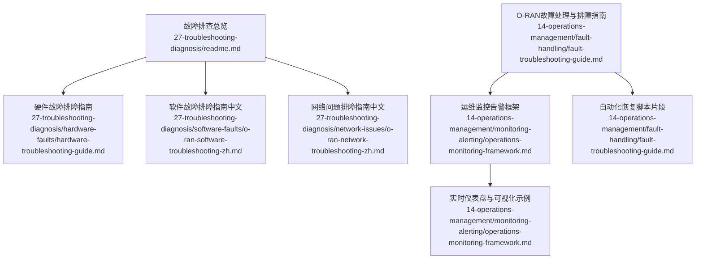
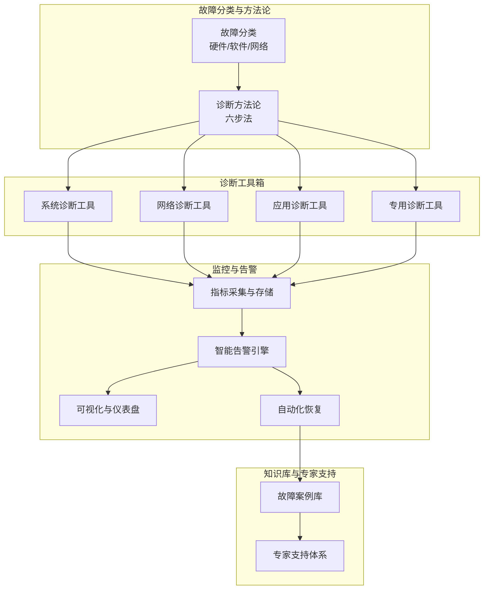
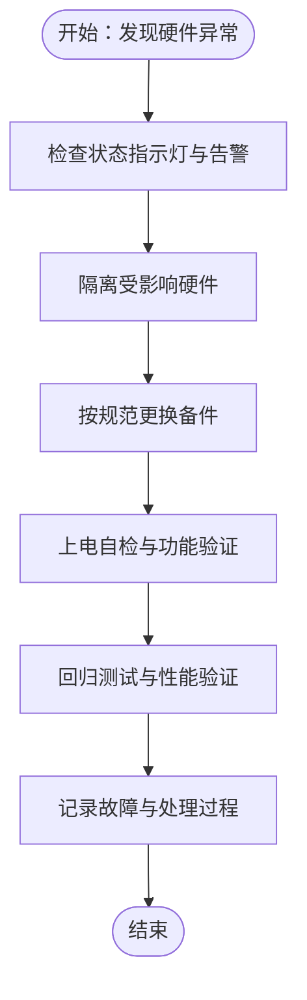
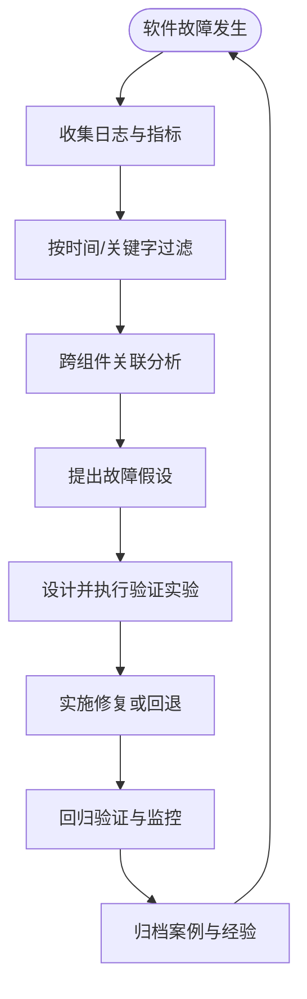
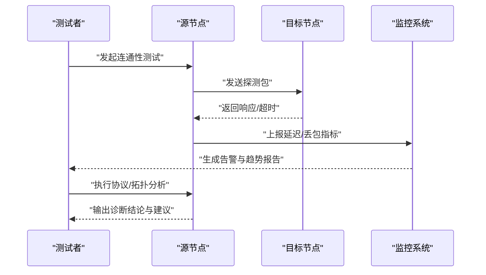
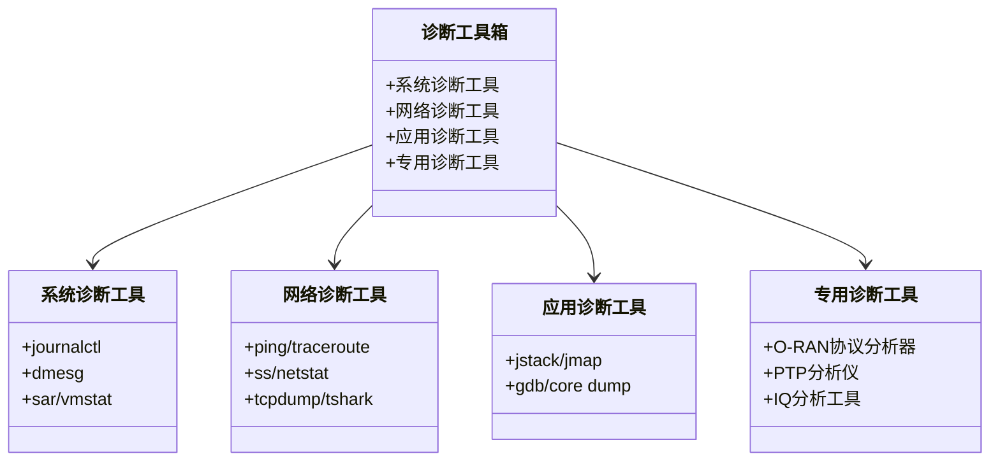
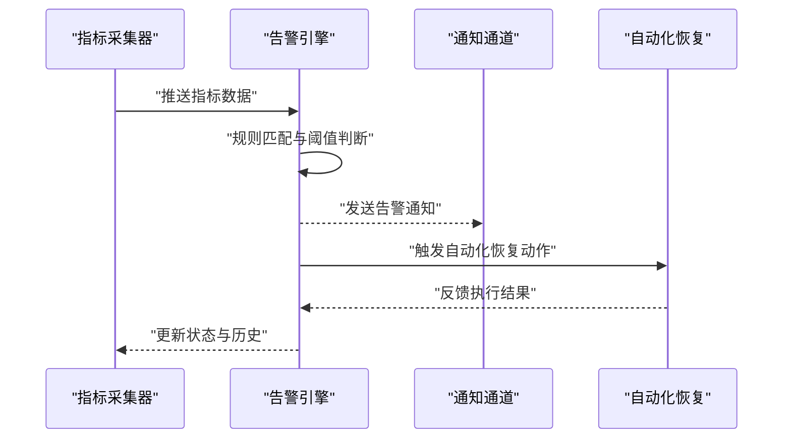
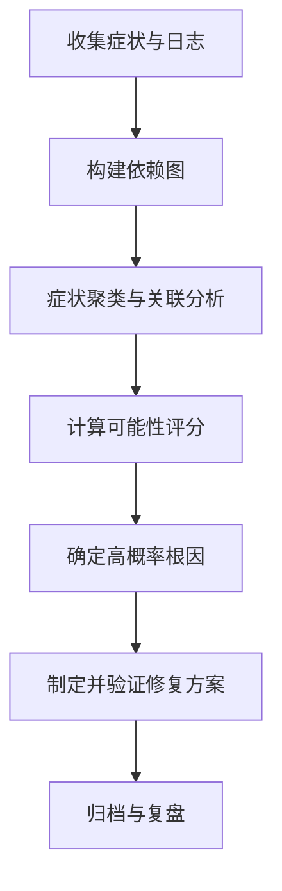
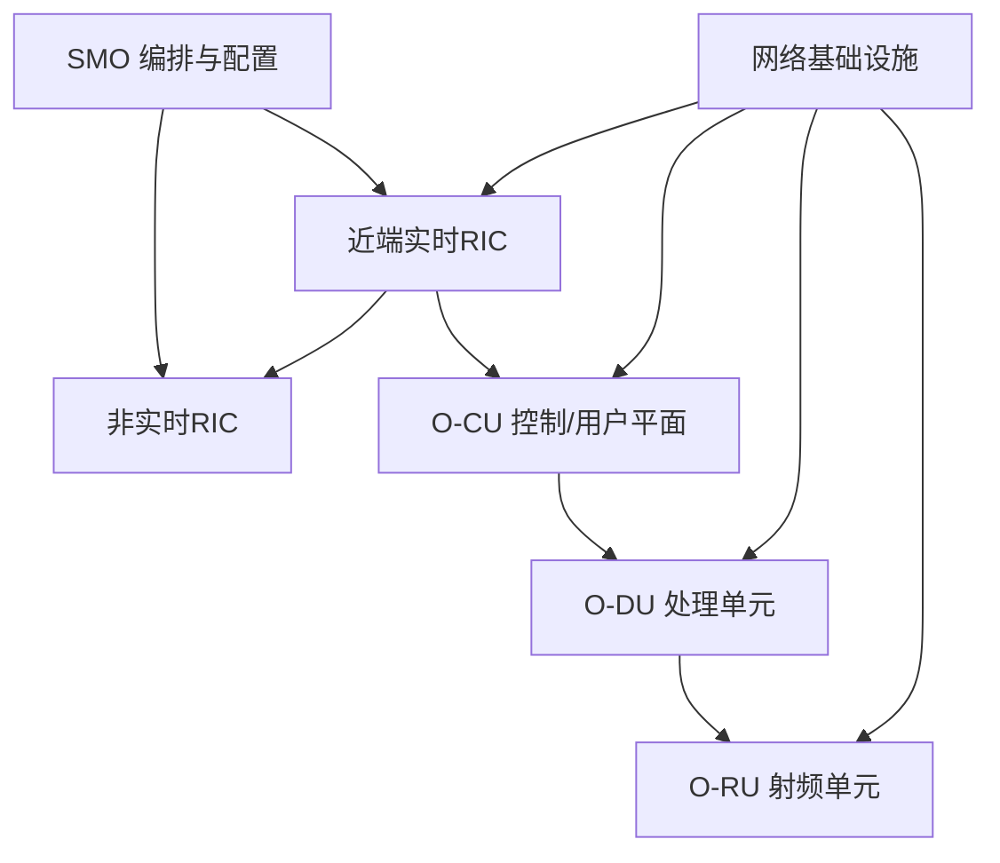

# 故障排查

<cite>
**本文引用的文件**
- [故障排查总览](file://27-troubleshooting-diagnosis/readme.md)
- [O-RAN故障处理与排障指南](file://14-operations-management/fault-handling/fault-troubleshooting-guide.md)
- [运维监控告警框架](file://14-operations-management/monitoring-alerting/operations-monitoring-framework.md)
- [硬件故障排障指南](file://27-troubleshooting-diagnosis/hardware-faults/hardware-troubleshooting-guide.md)
- [软件故障排障指南（中文）](file://27-troubleshooting-diagnosis/software-faults/o-ran-software-troubleshooting-zh.md)
- [网络问题排障指南（中文）](file://27-troubleshooting-diagnosis/network-issues/o-ran-network-troubleshooting-zh.md)
</cite>

## 目录
1. [简介](#简介)
2. [项目结构](#项目结构)
3. [核心组件](#核心组件)
4. [架构总览](#架构总览)
5. [详细组件分析](#详细组件分析)
6. [依赖关系分析](#依赖关系分析)
7. [性能考量](#性能考量)
8. [故障排查指南](#故障排查指南)
9. [结论](#结论)
10. [附录](#附录)

## 简介
本文件面向O-RAN系统的故障排查与诊断，围绕故障分类、排查流程、诊断工具使用与根因分析技术，系统化梳理硬件、软件与网络三类故障的识别、定位、修复与预防策略，并结合监控告警体系与自动化恢复机制，形成可执行、可复用、可持续的知识与实践体系。

## 项目结构
本仓库中与“故障排查”直接相关的内容主要分布在以下位置：
- 27-troubleshooting-diagnosis：故障排查总览与分项指南（硬件、软件、网络）
- 14-operations-management：包含故障处理与排障指南、监控告警框架
- 14-operations-management/monitoring-alerting：监控指标采集、告警规则与可视化

**图示来源**
- [故障排查总览](file://27-troubleshooting-diagnosis/readme.md#L1-L105)
- [O-RAN故障处理与排障指南](file://14-operations-management/fault-handling/fault-troubleshooting-guide.md#L1-L633)
- [运维监控告警框架](file://14-operations-management/monitoring-alerting/operations-monitoring-framework.md#L1-L909)

**章节来源**
- [故障排查总览](file://27-troubleshooting-diagnosis/readme.md#L1-L105)
- [O-RAN故障处理与排障指南](file://14-operations-management/fault-handling/fault-troubleshooting-guide.md#L1-L633)
- [运维监控告警框架](file://14-operations-management/monitoring-alerting/operations-monitoring-framework.md#L1-L909)

## 核心组件
- 故障分类与影响评估：覆盖硬件、软件、网络三大类，明确关键故障类别与影响范围。
- 诊断方法论：从现象收集、影响评估、初步调查到深入分析、根因确认与解决方案实施的闭环流程。
- 诊断工具箱：系统诊断、网络诊断、应用诊断与专用诊断工具的清单与使用建议。
- 常见故障处理：包含启动失败、网络连通性、性能异常等典型场景的步骤化处理方案。
- 预防性维护：定期巡检、自动化监控、预测性分析与自动修复脚本。
- 知识库建设：故障案例库、专家支持体系与知识传承机制。

**章节来源**
- [故障排查总览](file://27-troubleshooting-diagnosis/readme.md#L6-L105)

## 架构总览
下图展示O-RAN故障排查的整体架构：以“故障分类与方法论”为入口，通过“诊断工具箱”进行现场取证，结合“监控告警框架”实现可观测性与自动化响应，并在“知识库”沉淀经验，形成持续改进闭环。

**图示来源**
- [故障排查总览](file://27-troubleshooting-diagnosis/readme.md#L6-L105)
- [运维监控告警框架](file://14-operations-management/monitoring-alerting/operations-monitoring-framework.md#L1-L909)
- [O-RAN故障处理与排障指南](file://14-operations-management/fault-handling/fault-troubleshooting-guide.md#L1-L633)

## 详细组件分析

### 硬件故障排障
- 识别要点：服务器、网络设备、射频设备、电源系统等硬件状态指示灯、日志与告警。
- 定位方法：最小化变更法、替换法、隔离法；结合系统日志、硬件管理接口与物理检查。
- 更换流程：断电下电、标签与记录、按规范安装、上电验证、回归测试。
- 预防措施：定期健康巡检、温度/风扇/冗余检查、固件与驱动更新、环境控制。

**图示来源**
- [硬件故障排障指南](file://27-troubleshooting-diagnosis/hardware-faults/hardware-troubleshooting-guide.md)

**章节来源**
- [硬件故障排障指南](file://27-troubleshooting-diagnosis/hardware-faults/hardware-troubleshooting-guide.md)

### 软件故障排障
- 识别要点：系统级崩溃、服务异常、配置错误、数据异常等。
- 调试技巧：日志聚合与模式匹配、进程与线程分析、堆栈与内存快照、核心转储分析。
- 日志分析：时间窗口筛选、关键字过滤、错误计数与趋势分析、组件间关联分析。
- 修复方法：回滚配置、重启服务、补丁升级、数据库修复与一致性校验。

**图示来源**
- [O-RAN故障处理与排障指南](file://14-operations-management/fault-handling/fault-troubleshooting-guide.md#L35-L98)

**章节来源**
- [O-RAN故障处理与排障指南](file://14-operations-management/fault-handling/fault-troubleshooting-guide.md#L35-L98)
- [软件故障排障指南（中文）](file://27-troubleshooting-diagnosis/software-faults/o-ran-software-troubleshooting-zh.md)

### 网络问题诊断
- 连通性测试：基础ping、路由追踪、端口可达性、DNS解析。
- 性能问题：延迟、抖动、丢包、带宽利用率、队列与缓冲区统计。
- 协议问题：接口层协议一致性、消息格式与序列化、时序与时钟同步。
- 拓扑问题：链路状态、VLAN与QoS、PTP时钟域划分、跨域互操作。

**图示来源**
- [网络问题排障指南（中文）](file://27-troubleshooting-diagnosis/network-issues/o-ran-network-troubleshooting-zh.md)

**章节来源**
- [网络问题排障指南（中文）](file://27-troubleshooting-diagnosis/network-issues/o-ran-network-troubleshooting-zh.md)

### 诊断工具使用指南
- 系统诊断：内核环形缓冲、系统日志、资源使用率、进程状态。
- 网络诊断：连通性、路由、防火墙、DNS、接口状态与统计。
- 应用诊断：线程堆栈、内存映像、调试器与核心转储分析。
- 专用诊断：O-RAN专用工具、协议分析器、PTP质量分析、IQ样本分析。

**图示来源**
- [故障排查总览](file://27-troubleshooting-diagnosis/readme.md#L36-L40)

**章节来源**
- [故障排查总览](file://27-troubleshooting-diagnosis/readme.md#L36-L40)

### 监控与告警体系
- 多层监控：基础设施、应用、业务三层指标采集与存储。
- 智能告警：阈值触发、规则匹配、告警关联与去重、通知通道。
- 可视化：实时仪表盘、趋势图表、告警列表与系统状态指示。
- 自动化恢复：基于告警的自动处置动作与历史记录。

**图示来源**
- [运维监控告警框架](file://14-operations-management/monitoring-alerting/operations-monitoring-framework.md#L48-L260)
- [运维监控告警框架](file://14-operations-management/monitoring-alerting/operations-monitoring-framework.md#L266-L486)
- [运维监控告警框架](file://14-operations-management/monitoring-alerting/operations-monitoring-framework.md#L534-L692)
- [运维监控告警框架](file://14-operations-management/monitoring-alerting/operations-monitoring-framework.md#L698-L803)

**章节来源**
- [运维监控告警框架](file://14-operations-management/monitoring-alerting/operations-monitoring-framework.md#L1-L909)

### 根因分析（RCA）方法
- 依赖模型：构建O-RAN组件依赖图，识别传播路径与瓶颈。
- 症状关联：对症状进行聚类与相关性分析，计算可能性评分。
- 时间与频率：关注症状出现的时间聚集性与重复频率，辅助判定根因。

**图示来源**
- [O-RAN故障处理与排障指南](file://14-operations-management/fault-handling/fault-troubleshooting-guide.md#L100-L180)

**章节来源**
- [O-RAN故障处理与排障指南](file://14-operations-management/fault-handling/fault-troubleshooting-guide.md#L100-L180)

## 依赖关系分析
- 组件耦合：近端实时RIC、非实时RIC、CU、DU、RU之间存在强依赖链；SMO负责编排与配置，是故障传播的关键节点。
- 数据流：E2/F1/O-FH接口承载控制面与用户面数据，网络质量直接影响系统性能。
- 外部依赖：证书与TLS、PTP时钟同步、操作系统内核与驱动、容器/集群平台。

**图示来源**
- [O-RAN故障处理与排障指南](file://14-operations-management/fault-handling/fault-troubleshooting-guide.md#L113-L126)

**章节来源**
- [O-RAN故障处理与排障指南](file://14-operations-management/fault-handling/fault-troubleshooting-guide.md#L113-L126)

## 性能考量
- 资源瓶颈：CPU、内存、磁盘I/O与网络带宽的峰值与趋势分析。
- 接口性能：E2/F1/O-FH接口的吞吐、延迟、抖动与丢包率。
- 时钟同步：PTP精度与漂移控制，避免IQ数据异常与RU-DU通信问题。
- 自动化与容量：通过自动化恢复与容量规划降低MTTR与MTBF风险。

[本节为通用指导，无需引用具体文件]

## 故障排查指南

### 通用排查流程
- 现象收集：记录故障时间、影响范围、严重程度与先兆。
- 影响评估：确定是否涉及SLA、业务影响面与紧急度分级。
- 初步调查：执行快速验证（连通性、服务状态、基本配置）。
- 深入分析：使用诊断工具采集日志、抓包与指标，进行根因分析。
- 根因确认：通过最小实验验证假设，确保修复针对性。
- 解决实施：执行修复或回退，验证效果并更新知识库。

**章节来源**
- [故障排查总览](file://27-troubleshooting-diagnosis/readme.md#L28-L35)

### 典型场景处理
- 启动失败：检查硬件指示灯、BIOS/UEFI日志、引导加载器、文件系统与关键服务依赖。
- 网络连通性：基础ping、路由追踪、防火墙规则、DNS解析、接口状态与配置。
- 性能异常：系统资源监控、进程/线程分析、网络流量与连接数、数据库查询性能、应用日志。

**章节来源**
- [故障排查总览](file://27-troubleshooting-diagnosis/readme.md#L44-L75)

### 自动化与预防
- 自动化监控：关键指标实时监控、异常自动告警、预测性分析与自动修复脚本。
- 预防性维护：定期健康巡检、日志审查、配置备份与版本管理、安全补丁更新、性能基线维护。

**章节来源**
- [故障排查总览](file://27-troubleshooting-diagnosis/readme.md#L77-L91)

### 知识库建设
- 案例库：典型故障案例、标准化解决方案、经验总结与最佳实践分享。
- 专家支持：分层级技术支持流程、专家诊断机制、第三方协作与知识传承。

**章节来源**
- [故障排查总览](file://27-troubleshooting-diagnosis/readme.md#L93-L105)

## 结论
通过系统化的故障分类、严谨的诊断流程、完备的诊断工具与可观测性体系，O-RAN系统可以显著缩短故障定位与修复时间，提升系统稳定性与可靠性。结合知识库与自动化恢复机制，能够实现从“被动救火”向“主动治理”的转变，支撑大规模部署下的持续运营。

[本节为总结性内容，无需引用具体文件]

## 附录

### 关键接口与参数参考
- E2接口：端口、TLS证书、重试间隔、超时与订阅管理。
- F1接口：吞吐、延迟、丢包、QoS与缓冲区配置、压缩与分片选项。
- O-FH接口：PTP时钟同步、硬件时间戳、IQ样本质量与相位校准。

**章节来源**
- [O-RAN故障处理与排障指南](file://14-operations-management/fault-handling/fault-troubleshooting-guide.md#L266-L537)