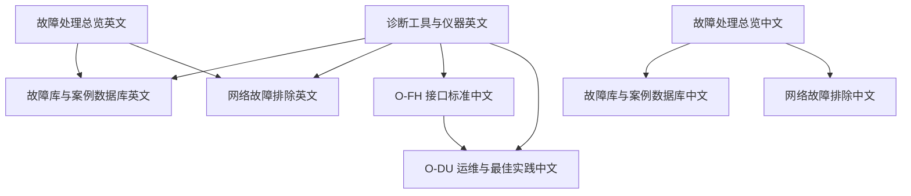
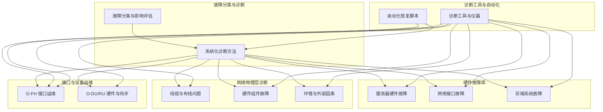
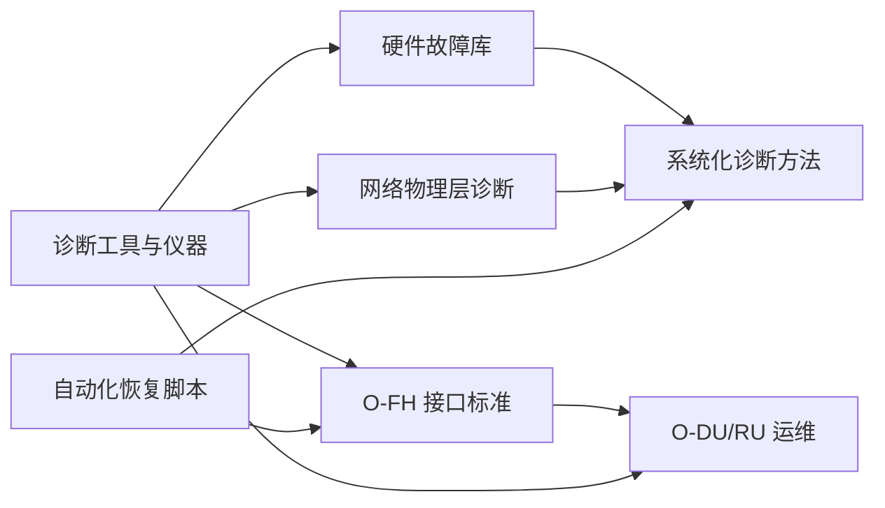
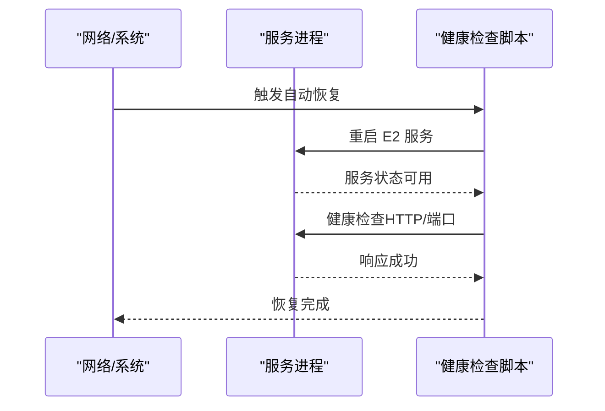
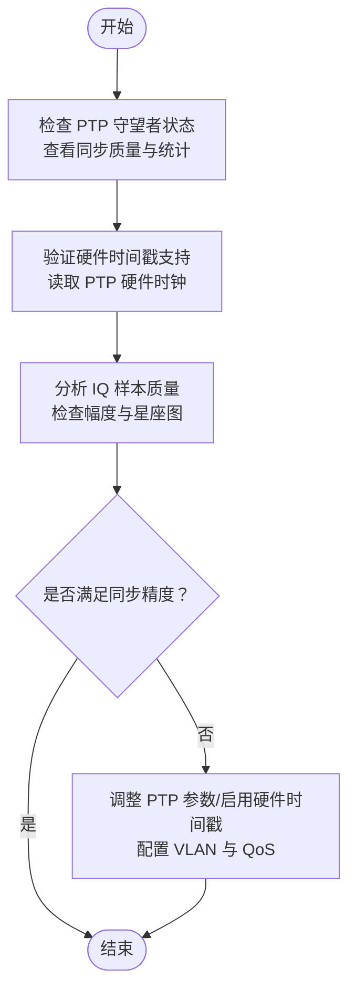

# 硬件故障

<cite>
**本文引用的文件**
- [故障处理总览（英文）](file://14-operations-management/fault-handling/fault-troubleshooting-guide.md)
- [故障处理总览（中文）](file://14-operations-management/fault-handling/fault-troubleshooting-guide-zh.md)
- [故障库与案例数据库（英文）](file://27-troubleshooting-diagnosis/fault-library/o-ran-fault-case-database.md)
- [故障库与案例数据库（中文）](file://27-troubleshooting-diagnosis/fault-library/o-ran-fault-case-database-zh.md)
- [网络故障排除（英文）](file://27-troubleshooting-diagnosis/network-issues/o-ran-network-troubleshooting.md)
- [网络故障排除（中文）](file://27-troubleshooting-diagnosis/network-issues/o-ran-network-troubleshooting-zh.md)
- [O-FH 接口标准（中文）](file://03-interface-standards/o-fh-interface.md)
- [O-DU 运维与最佳实践（中文）](file://02-core-components/o-du.md)
- [诊断工具与仪器（英文）](file://27-troubleshooting-diagnosis/diagnostic-tools/o-ran-diagnostic-instrumentation.md)
- [故障排除总览（英文）](file://27-troubleshooting-diagnosis/readme.md)
</cite>

## 目录
1. [简介](#简介)
2. [项目结构](#项目结构)
3. [核心组件](#核心组件)
4. [架构总览](#架构总览)
5. [详细组件分析](#详细组件分析)
6. [依赖关系分析](#依赖关系分析)
7. [性能考虑](#性能考虑)
8. [故障排除指南](#故障排除指南)
9. [结论](#结论)
10. [附录](#附录)

## 简介
本指南面向 O-RAN 环境中的硬件故障处理，系统梳理服务器硬件、网络设备、射频设备与电源系统的故障特征与检测方法，给出状态指示灯检查、硬件自检、替换测试与隔离测试等定位技术，并规范故障确认、备件准备、更换程序、测试验证与预防措施的处理流程。同时总结预防性维护策略与定期检查要点，帮助降低停机时间并提升整体可靠性。

## 项目结构
本仓库围绕“故障处理”“故障库”“网络问题”“接口标准”“诊断工具”等主题形成知识体系，硬件故障相关内容主要分布在以下位置：
- 故障处理总览：提供系统化故障分类、诊断方法与自动化恢复脚本
- 故障库与案例数据库：按硬件类别归档常见故障模式与处置步骤
- 网络故障排除：覆盖物理层连接、硬件组件与环境因素
- O-FH 接口标准：明确 RU/DU 侧硬件与同步要求
- O-DU 运维与最佳实践：提供硬件与同步相关的监控与告警要点
- 诊断工具与仪器：列举硬件测试与环境监测工具

图表来源
- [故障处理总览（英文）](file://14-operations-management/fault-handling/fault-troubleshooting-guide.md#L1-L633)
- [故障库与案例数据库（英文）](file://27-troubleshooting-diagnosis/fault-library/o-ran-fault-case-database.md#L1-L225)
- [网络故障排除（英文）](file://27-troubleshooting-diagnosis/network-issues/o-ran-network-troubleshooting.md#L1-L95)
- [故障处理总览（中文）](file://14-operations-management/fault-handling/fault-troubleshooting-guide-zh.md#L1-L633)
- [故障库与案例数据库（中文）](file://27-troubleshooting-diagnosis/fault-library/o-ran-fault-case-database-zh.md#L1-L225)
- [网络故障排除（中文）](file://27-troubleshooting-diagnosis/network-issues/o-ran-network-troubleshooting-zh.md#L1-L95)
- [O-FH 接口标准（中文）](file://03-interface-standards/o-fh-interface.md#L1-L287)
- [O-DU 运维与最佳实践（中文）](file://02-core-components/o-du.md#L224-L348)
- [诊断工具与仪器（英文）](file://27-troubleshooting-diagnosis/diagnostic-tools/o-ran-diagnostic-instrumentation.md#L1-L64)

章节来源
- [故障处理总览（英文）](file://14-operations-management/fault-handling/fault-troubleshooting-guide.md#L1-L633)
- [故障处理总览（中文）](file://14-operations-management/fault-handling/fault-troubleshooting-guide-zh.md#L1-L633)
- [故障库与案例数据库（英文）](file://27-troubleshooting-diagnosis/fault-library/o-ran-fault-case-database.md#L1-L225)
- [故障库与案例数据库（中文）](file://27-troubleshooting-diagnosis/fault-library/o-ran-fault-case-database-zh.md#L1-L225)
- [网络故障排除（英文）](file://27-troubleshooting-diagnosis/network-issues/o-ran-network-troubleshooting.md#L1-L95)
- [网络故障排除（中文）](file://27-troubleshooting-diagnosis/network-issues/o-ran-network-troubleshooting-zh.md#L1-L95)
- [O-FH 接口标准（中文）](file://03-interface-standards/o-fh-interface.md#L1-L287)
- [O-DU 运维与最佳实践（中文）](file://02-core-components/o-du.md#L224-L348)
- [诊断工具与仪器（英文）](file://27-troubleshooting-diagnosis/diagnostic-tools/o-ran-diagnostic-instrumentation.md#L1-L64)

## 核心组件
- 系统化故障分类与诊断方法：涵盖硬件、软件、网络与协议层面的故障类别与诊断流程
- 自动化恢复脚本：针对 E2/F1/O-FH 等关键接口的自动恢复流程
- 硬件故障库：服务器硬件、存储系统、网络接口的典型故障模式与处置步骤
- 网络物理层诊断：线缆、光模块、交换机/路由器、电源与环境因素
- O-FH 接口运维：RU/DU 硬件与同步要求、监控告警与故障处理
- 诊断工具与仪器：CPU/内存/存储/电源/外围设备/环境监测工具清单

章节来源
- [故障处理总览（英文）](file://14-operations-management/fault-handling/fault-troubleshooting-guide.md#L6-L30)
- [故障处理总览（英文）](file://14-operations-management/fault-handling/fault-troubleshooting-guide.md#L31-L180)
- [故障处理总览（英文）](file://14-operations-management/fault-handling/fault-troubleshooting-guide.md#L572-L631)
- [故障库与案例数据库（英文）](file://27-troubleshooting-diagnosis/fault-library/o-ran-fault-case-database.md#L6-L59)
- [网络故障排除（英文）](file://27-troubleshooting-diagnosis/network-issues/o-ran-network-troubleshooting.md#L8-L95)
- [O-FH 接口标准（中文）](file://03-interface-standards/o-fh-interface.md#L247-L287)
- [O-DU 运维与最佳实践（中文）](file://02-core-components/o-du.md#L224-L348)
- [诊断工具与仪器（英文）](file://27-troubleshooting-diagnosis/diagnostic-tools/o-ran-diagnostic-instrumentation.md#L6-L64)

## 架构总览
下图展示 O-RAN 硬件故障处理的知识架构：从故障分类与诊断方法出发，结合硬件故障库、网络物理层诊断、接口运维与诊断工具，最终形成自动化恢复与预防性维护闭环。

图表来源
- [故障处理总览（英文）](file://14-operations-management/fault-handling/fault-troubleshooting-guide.md#L6-L30)
- [故障处理总览（英文）](file://14-operations-management/fault-handling/fault-troubleshooting-guide.md#L31-L180)
- [故障处理总览（英文）](file://14-operations-management/fault-handling/fault-troubleshooting-guide.md#L572-L631)
- [故障库与案例数据库（英文）](file://27-troubleshooting-diagnosis/fault-library/o-ran-fault-case-database.md#L6-L59)
- [网络故障排除（英文）](file://27-troubleshooting-diagnosis/network-issues/o-ran-network-troubleshooting.md#L8-L95)
- [O-FH 接口标准（中文）](file://03-interface-standards/o-fh-interface.md#L247-L287)
- [O-DU 运维与最佳实践（中文）](file://02-core-components/o-du.md#L224-L348)
- [诊断工具与仪器（英文）](file://27-troubleshooting-diagnosis/diagnostic-tools/o-ran-diagnostic-instrumentation.md#L6-L64)

## 详细组件分析

### 服务器硬件故障
- CPU 相关：热节流、风扇故障、散热不足；诊断步骤包括温度传感器检查与风扇运行验证；处理包括清洁冷却系统、更换风扇、改善风道
- 内存模块：系统崩溃、蓝屏、内存错误；诊断使用 memtest86+、ECC 错误日志；处理为更换故障模块、验证兼容性
- 电源问题：意外关机、电源 LED 异常；诊断使用万用表、检查电源线缆；处理为更换 PSU、核验功耗需求
- 存储系统：硬盘退化（SMART 错误）、SSD 磨损（TRIM 错误）、RAID 降级；诊断使用 SMART、系统日志与 RAID 管理界面；处理为备份数据、更换驱动器、重建阵列、验证配置
- 网络接口：NIC 硬件故障、线缆与连接器问题、交换机/路由器问题；诊断使用 LED、不同线缆测试、交换机状态与路由表；处理为更换 NIC、更新驱动、更换线缆、重启设备、更新固件、修正配置

章节来源
- [故障库与案例数据库（英文）](file://27-troubleshooting-diagnosis/fault-library/o-ran-fault-case-database.md#L8-L59)
- [故障库与案例数据库（中文）](file://27-troubleshooting-diagnosis/fault-library/o-ran-fault-case-database-zh.md#L8-L59)
- [网络故障排除（英文）](file://27-troubleshooting-diagnosis/network-issues/o-ran-network-troubleshooting.md#L39-L58)
- [网络故障排除（中文）](file://27-troubleshooting-diagnosis/network-issues/o-ran-network-troubleshooting-zh.md#L39-L58)

### 网络设备故障
- 物理层连接问题：铜线缆故障（衰减、端接）、光纤问题（OTDR 分析、连接器清洁）、无线连接（干扰、多径）
- 硬件组件故障：网卡驱动/固件问题、交换机/路由器端口/背板/电源问题、冗余路径测试
- 环境与外部因素：电磁干扰（频谱分析、屏蔽）、物理损坏与磨损、安装与配置错误

章节来源
- [网络故障排除（英文）](file://27-troubleshooting-diagnosis/network-issues/o-ran-network-troubleshooting.md#L8-L95)
- [网络故障排除（中文）](file://27-troubleshooting-diagnosis/network-issues/o-ran-network-troubleshooting-zh.md#L8-L95)

### 射频设备故障（O-RU、天线、馈线系统）
- O-FH 接口常见故障：连接断开（光纤/接口）、同步丢失（PTP/SyncE）、性能劣化（延迟/误码）、硬件故障（功率放大器/天线）
- 故障定位：告警分析、日志分析、接口测试（ping/traceroute）、同步测试（PTP 状态、硬件时间戳）
- 故障恢复：修复传输（光纤/设备）、修复同步源/调整配置、更换硬件、修正配置

章节来源
- [O-FH 接口标准（中文）](file://03-interface-standards/o-fh-interface.md#L247-L287)
- [O-DU 运维与最佳实践（中文）](file://02-core-components/o-du.md#L268-L288)

### 电源系统故障（UPS、配电柜、供电线路）
- 电源质量与冗余：电压/电流测量、电源冗余验证、温度/湿度监控、接地与电气安全检查
- UPS 电池健康：电池状态检查、负载切换测试、充电/放电特性评估
- 预防性维护：HVAC 优化、电源调节、冗余系统配置

章节来源
- [网络故障排除（英文）](file://27-troubleshooting-diagnosis/network-issues/o-ran-network-troubleshooting.md#L58-L66)
- [网络故障排除（中文）](file://27-troubleshooting-diagnosis/network-issues/o-ran-network-troubleshooting-zh.md#L58-L66)
- [诊断工具与仪器（英文）](file://27-troubleshooting-diagnosis/diagnostic-tools/o-ran-diagnostic-instrumentation.md#L27-L31)

### 状态指示灯检查、硬件自检、替换测试与隔离测试
- 状态指示灯检查：服务器/网络设备/电源设备的 LED 状态解读与初步判断
- 硬件自检：CPU/内存/存储/电源/外围设备的专用诊断工具与流程
- 替换测试：在确认故障部件后，使用已知良好部件进行替换验证
- 隔离测试：通过断开/隔离可疑路径，缩小故障范围（如断开某段链路、切换至备用路径）

章节来源
- [网络故障排除（英文）](file://27-troubleshooting-diagnosis/network-issues/o-ran-network-troubleshooting.md#L40-L48)
- [网络故障排除（中文）](file://27-troubleshooting-diagnosis/network-issues/o-ran-network-troubleshooting-zh.md#L40-L48)
- [诊断工具与仪器（英文）](file://27-troubleshooting-diagnosis/diagnostic-tools/o-ran-diagnostic-instrumentation.md#L9-L64)

## 依赖关系分析
- 硬件故障库与网络物理层诊断相互印证：前者提供故障模式，后者提供定位手段
- O-FH 接口标准与 O-DU 运维：RU/DU 硬件与同步要求是接口稳定性的基础
- 诊断工具与仪器：为各类硬件与网络故障提供量化检测手段
- 自动化恢复脚本：在确认接口类故障后，快速执行恢复动作，缩短恢复时间

图表来源
- [故障库与案例数据库（英文）](file://27-troubleshooting-diagnosis/fault-library/o-ran-fault-case-database.md#L6-L59)
- [网络故障排除（英文）](file://27-troubleshooting-diagnosis/network-issues/o-ran-network-troubleshooting.md#L8-L95)
- [O-FH 接口标准（中文）](file://03-interface-standards/o-fh-interface.md#L247-L287)
- [O-DU 运维与最佳实践（中文）](file://02-core-components/o-du.md#L224-L348)
- [诊断工具与仪器（英文）](file://27-troubleshooting-diagnosis/diagnostic-tools/o-ran-diagnostic-instrumentation.md#L6-L64)
- [故障处理总览（英文）](file://14-operations-management/fault-handling/fault-troubleshooting-guide.md#L572-L631)

## 性能考虑
- 通过自动化恢复脚本与接口运维最佳实践，降低故障恢复时间
- 在 O-FH 接口层面，优化带宽、延迟与同步精度，有助于减少硬件与同步相关故障的发生概率
- 预防性维护与环境监控（温度、湿度、电源质量）可显著降低硬件故障率

章节来源
- [故障处理总览（英文）](file://14-operations-management/fault-handling/fault-troubleshooting-guide.md#L539-L571)
- [O-FH 接口标准（中文）](file://03-interface-standards/o-fh-interface.md#L267-L287)
- [O-DU 运维与最佳实践（中文）](file://02-core-components/o-du.md#L309-L348)

## 故障排除指南

### 一、识别与分类
- 现象收集与影响评估：记录故障现象、影响范围与严重程度
- 初步调查：基本检查与简单测试（如状态指示灯、基础连通性）
- 深入分析：使用专业工具与日志分析，确认根因
- 解决实施：针对性修复与验证

章节来源
- [故障排除总览（英文）](file://27-troubleshooting-diagnosis/readme.md#L26-L36)

### 二、定位技术
- 状态指示灯检查：依据设备 LED 状态进行初步判断
- 硬件自检：使用诊断工具对 CPU/内存/存储/电源/外围设备进行检测
- 替换测试法：在确认故障部件后，用已知良好部件替换验证
- 隔离测试法：断开/隔离可疑路径，缩小故障范围

章节来源
- [网络故障排除（英文）](file://27-troubleshooting-diagnosis/network-issues/o-ran-network-troubleshooting.md#L40-L48)
- [网络故障排除（中文）](file://27-troubleshooting-diagnosis/network-issues/o-ran-network-troubleshooting-zh.md#L40-L48)
- [诊断工具与仪器（英文）](file://27-troubleshooting-diagnosis/diagnostic-tools/o-ran-diagnostic-instrumentation.md#L9-L64)

### 三、处理流程
- 故障确认：告警分析、日志分析、接口测试、同步测试
- 备件准备：确认部件兼容性、准备替换件与工具
- 更换程序：断电/下电、拆卸、更换、装配、上电
- 测试验证：功能测试、性能测试、稳定性测试
- 预防措施：完善配置基线、更新知识库、加强巡检与监控

章节来源
- [O-FH 接口标准（中文）](file://03-interface-standards/o-fh-interface.md#L247-L287)
- [O-DU 运维与最佳实践（中文）](file://02-core-components/o-du.md#L268-L288)
- [故障处理总览（英文）](file://14-operations-management/fault-handling/fault-troubleshooting-guide.md#L539-L571)

### 四、预防维护策略与定期检查要点
- 硬件健康监控：定期物理检查、深度清洁、连接验证、组件测试
- 环境条件监控：温度、湿度、空气质量、电源质量；HVAC 优化、环境控制、电源调节
- 组件生命周期管理：跟踪保修到期、预期寿命、性能退化；制定更换计划、预算与供应商协调
- 软件与配置审计：季度配置审计、补丁与更新管理、性能基线维护
- 知识库与文档：标准化案例格式、根因分析、解决程序；定期更新与知识分享

章节来源
- [故障库与案例数据库（英文）](file://27-troubleshooting-diagnosis/fault-library/o-ran-fault-case-database.md#L171-L225)
- [故障库与案例数据库（中文）](file://27-troubleshooting-diagnosis/fault-library/o-ran-fault-case-database-zh.md#L171-L225)

## 结论
通过系统化的故障分类、诊断方法、定位技术与处理流程，结合 O-FH 接口与 RU/DU 硬件运维要求，以及完善的预防性维护策略，可有效降低 O-RAN 硬件故障对业务的影响。建议在日常运维中严格执行状态指示灯检查、硬件自检与隔离测试，配合自动化恢复脚本与知识库沉淀，持续提升系统可靠性与故障响应效率。

## 附录

### A. 关键流程图：自动化恢复（以 E2 接口为例）

图表来源
- [故障处理总览（英文）](file://14-operations-management/fault-handling/fault-troubleshooting-guide.md#L572-L631)

### B. 关键流程图：O-FH 同步故障定位

图表来源
- [故障处理总览（英文）](file://14-operations-management/fault-handling/fault-troubleshooting-guide.md#L436-L537)