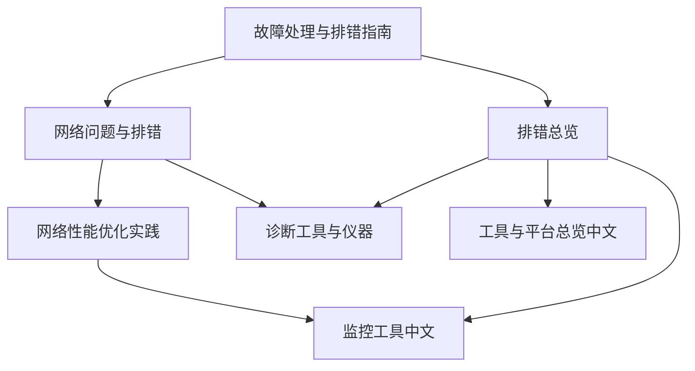
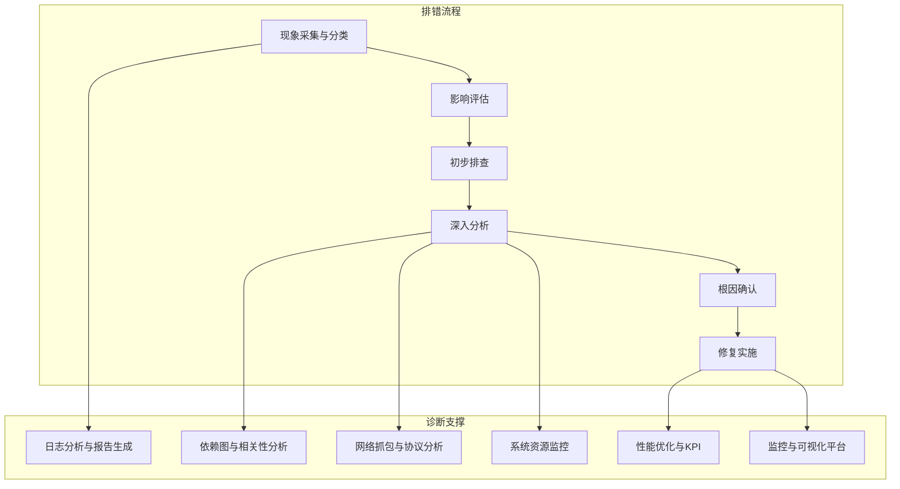
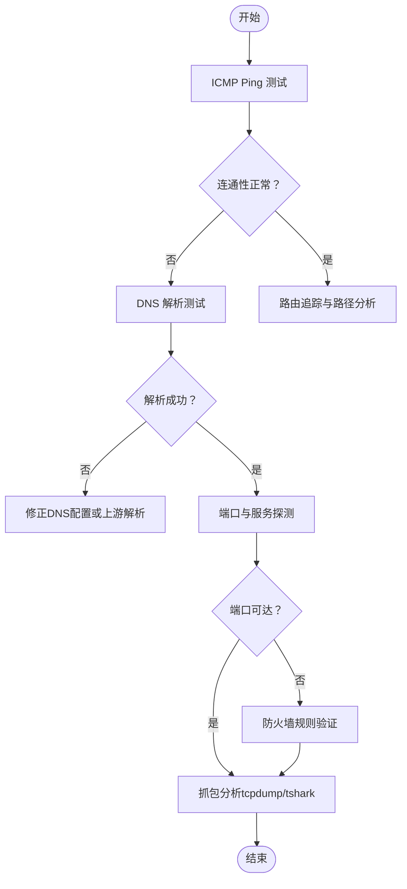
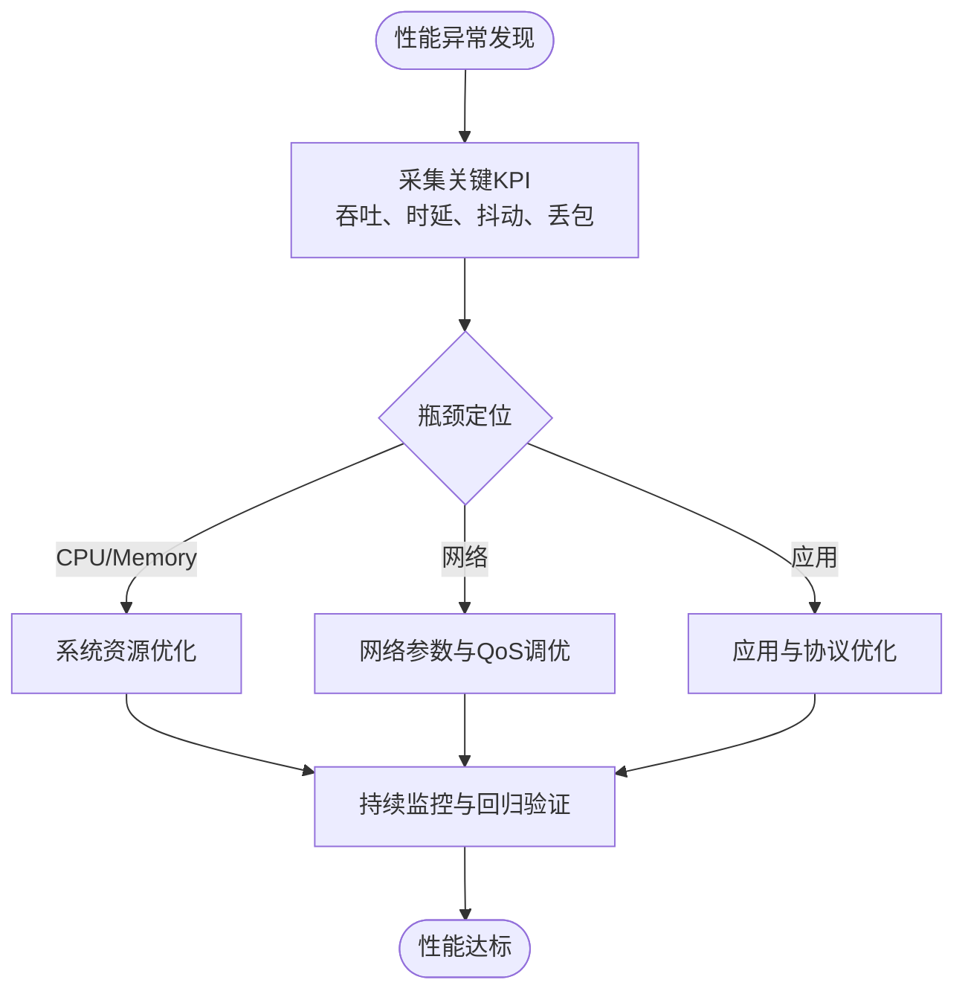
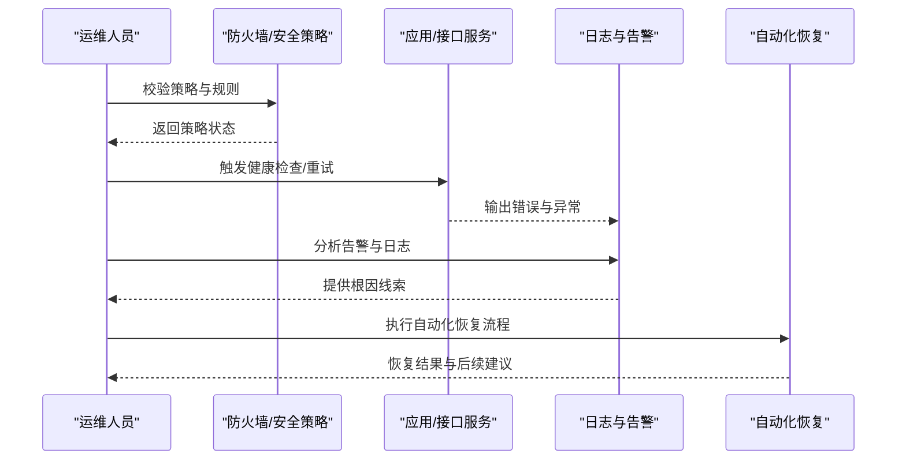
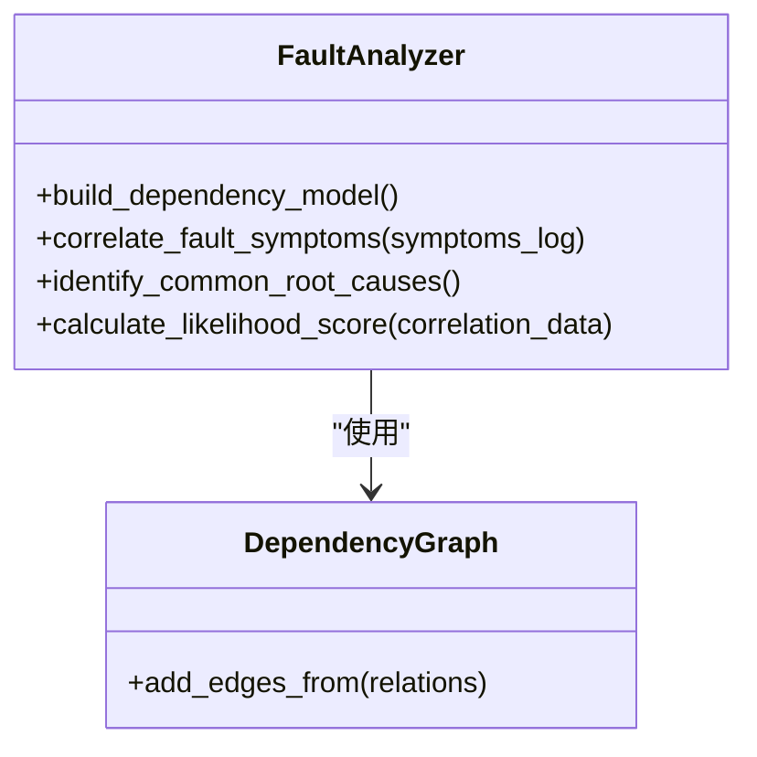
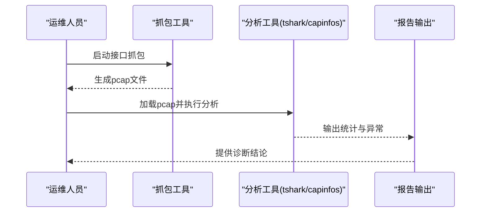
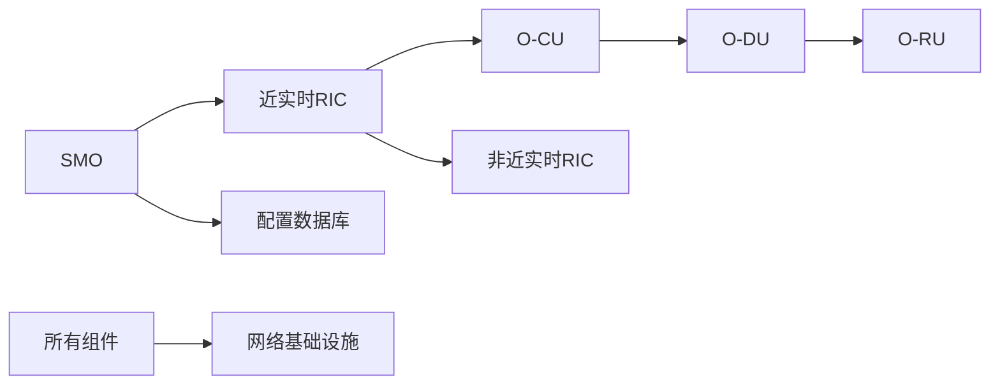

# 网络问题

<cite>
**本文引用的文件**
- [O-RAN 故障处理与排错指南](file://14-operations-management/fault-handling/fault-troubleshooting-guide.md)
- [O-RAN 网络问题与排错](file://27-troubleshooting-diagnosis/network-issues/o-ran-network-troubleshooting.md)
- [O-RAN 故障排错总览](file://27-troubleshooting-diagnosis/readme.md)
- [O-RAN 网络性能优化实践](file://26-performance-optimization/network-optimization/network-performance-tuning.md)
- [O-RAN 诊断工具与仪器](file://27-troubleshooting-diagnosis/diagnostic-tools/o-ran-diagnostic-instrumentation.md)
- [O-RAN 监控工具（中文）](file://26-performance-optimization/monitoring-tools/o-ran-monitoring-tools-zh.md)
- [O-RAN 工具与平台总览（中文）](file://22-tool-platforms/readme-zh.md)
</cite>

## 目录
1. [引言](#引言)
2. [项目结构](#项目结构)
3. [核心组件](#核心组件)
4. [架构总览](#架构总览)
5. [详细组件分析](#详细组件分析)
6. [依赖关系分析](#依赖关系分析)
7. [性能考量](#性能考量)
8. [故障排查指南](#故障排查指南)
9. [结论](#结论)
10. [附录](#附录)

## 引言
本文件面向O-RAN网络问题诊断，围绕“连通性故障、性能故障、安全故障、协议故障”四类故障进行系统化排错指导，并结合仓库中的排错指南、网络问题诊断、性能优化与监控工具等资料，形成可执行的诊断流程与最佳实践。读者无需深入底层即可按步骤完成从现象采集到根因定位再到修复闭环的全过程。

## 项目结构
本仓库中与网络问题诊断直接相关的内容主要分布在以下目录：
- 14-operations-management/fault-handling：包含系统化的故障分类、日志分析、根因分析框架与自动化恢复脚本
- 27-troubleshooting-diagnosis：包含网络问题专项排错、诊断工具箱与通用排错流程
- 26-performance-optimization：包含网络性能优化与监控工具清单
- 22-tool-platforms：包含监控与分析系统的总体说明

**图示来源**
- [O-RAN 故障处理与排错指南](file://14-operations-management/fault-handling/fault-troubleshooting-guide.md#L1-L633)
- [O-RAN 网络问题与排错](file://27-troubleshooting-diagnosis/network-issues/o-ran-network-troubleshooting.md#L1-L278)
- [O-RAN 故障排错总览](file://27-troubleshooting-diagnosis/readme.md#L1-L105)
- [O-RAN 网络性能优化实践](file://26-performance-optimization/network-optimization/network-performance-tuning.md#L1-L98)
- [O-RAN 诊断工具与仪器](file://27-troubleshooting-diagnosis/diagnostic-tools/o-ran-diagnostic-instrumentation.md#L134-L272)
- [O-RAN 监控工具（中文）](file://26-performance-optimization/monitoring-tools/o-ran-monitoring-tools-zh.md#L6-L74)
- [O-RAN 工具与平台总览（中文）](file://22-tool-platforms/readme-zh.md#L46-L78)

**章节来源**
- [O-RAN 故障处理与排错指南](file://14-operations-management/fault-handling/fault-troubleshooting-guide.md#L1-L633)
- [O-RAN 网络问题与排错](file://27-troubleshooting-diagnosis/network-issues/o-ran-network-troubleshooting.md#L1-L278)
- [O-RAN 故障排错总览](file://27-troubleshooting-diagnosis/readme.md#L1-L105)
- [O-RAN 网络性能优化实践](file://26-performance-optimization/network-optimization/network-performance-tuning.md#L1-L98)
- [O-RAN 诊断工具与仪器](file://27-troubleshooting-diagnosis/diagnostic-tools/o-ran-diagnostic-instrumentation.md#L134-L272)
- [O-RAN 监控工具（中文）](file://26-performance-optimization/monitoring-tools/o-ran-monitoring-tools-zh.md#L6-L74)
- [O-RAN 工具与平台总览（中文）](file://22-tool-platforms/readme-zh.md#L46-L78)

## 核心组件
- 故障分类与影响评估：涵盖网络功能、接口协议、基础设施与平台等故障类别，提供系统化识别与分级思路
- 诊断方法学：包含初始问题识别、根因分析框架（含依赖图与相关性矩阵）、高级诊断工具（网络抓包、资源监控）
- 网络问题专项：覆盖物理层、性能退化、协议与接口问题的诊断流程与处置建议
- 性能优化与监控：提供无线资源、传输效率、QoS参数、负载均衡等优化实践与可观测性框架
- 诊断工具箱：列举基础与高级网络诊断命令、抓包与分析工具、应用调试工具与监控平台

**章节来源**
- [O-RAN 故障处理与排错指南](file://14-operations-management/fault-handling/fault-troubleshooting-guide.md#L6-L31)
- [O-RAN 故障处理与排错指南](file://14-operations-management/fault-handling/fault-troubleshooting-guide.md#L100-L180)
- [O-RAN 故障处理与排错指南](file://14-operations-management/fault-handling/fault-troubleshooting-guide.md#L182-L262)
- [O-RAN 网络问题与排错](file://27-troubleshooting-diagnosis/network-issues/o-ran-network-troubleshooting.md#L6-L186)
- [O-RAN 网络性能优化实践](file://26-performance-optimization/network-optimization/network-performance-tuning.md#L1-L98)
- [O-RAN 诊断工具与仪器](file://27-troubleshooting-diagnosis/diagnostic-tools/o-ran-diagnostic-instrumentation.md#L134-L272)

## 架构总览
下图展示了O-RAN网络排错的整体架构：从“现象采集—影响评估—初步排查—深入分析—根因确认—修复实施”的闭环流程；同时结合“日志分析、依赖建模、抓包分析、资源监控、性能优化与可观测性平台”等手段，形成端到端的诊断能力。

**图示来源**
- [O-RAN 故障处理与排错指南](file://14-operations-management/fault-handling/fault-troubleshooting-guide.md#L31-L180)
- [O-RAN 故障处理与排错指南](file://14-operations-management/fault-handling/fault-troubleshooting-guide.md#L182-L262)
- [O-RAN 网络性能优化实践](file://26-performance-optimization/network-optimization/network-performance-tuning.md#L84-L98)
- [O-RAN 监控工具（中文）](file://26-performance-optimization/monitoring-tools/o-ran-monitoring-tools-zh.md#L6-L74)

## 详细组件分析

### 连通性故障诊断与处理
- 物理层与链路问题：涵盖铜缆、光纤、无线链路的检测方法与工具，包括OTDR、光功率计、频谱仪等
- 硬件组件与环境因素：网卡、交换机/路由器、电源与环境监测，以及EMI、机械损伤、安装配置错误的排查
- 基础连通性测试：ICMP Ping、ARP表分析、DNS解析、端口与服务探测
- 高级分析：路由追踪（traceroute、mtr、tcptraceroute）、带宽与性能测试（iperf3等）、抓包分析（tcpdump/tshark）

**图示来源**
- [O-RAN 网络问题与排错](file://27-troubleshooting-diagnosis/network-issues/o-ran-network-troubleshooting.md#L8-L95)
- [O-RAN 诊断工具与仪器](file://27-troubleshooting-diagnosis/diagnostic-tools/o-ran-diagnostic-instrumentation.md#L134-L202)

**章节来源**
- [O-RAN 网络问题与排错](file://27-troubleshooting-diagnosis/network-issues/o-ran-network-troubleshooting.md#L8-L95)
- [O-RAN 诊断工具与仪器](file://27-troubleshooting-diagnosis/diagnostic-tools/o-ran-diagnostic-instrumentation.md#L134-L202)

### 性能故障分析与优化
- 网络性能问题：带宽/吞吐、QoS退化、应用性能差异、延迟与时钟同步、抖动与报文时序
- 资源瓶颈：CPU、内存、存储与网络资源的利用与压力分析
- 优化策略：无线资源（载波聚合、MCS、干扰协调）、传输效率（头部压缩、协议优化、QoS参数）、负载均衡（移动性、资源池、容量规划）
- 监控与KPI：建立基线、对比优化前后、长期趋势与ROI评估

**图示来源**
- [O-RAN 网络性能优化实践](file://26-performance-optimization/network-optimization/network-performance-tuning.md#L84-L98)
- [O-RAN 网络性能优化实践](file://26-performance-optimization/network-optimization/network-performance-tuning.md#L6-L83)

**章节来源**
- [O-RAN 网络性能优化实践](file://26-performance-optimization/network-optimization/network-performance-tuning.md#L1-L98)

### 安全故障与协议故障
- 安全策略阻断与攻击防护误判：通过防火墙规则、入侵检测与访问控制策略核查，结合日志与告警收敛进行定位
- 协议故障：针对E2、A1、O1等接口的协议消息流、订阅/指示、策略分发、NETCONF/YANG配置等问题，采用专用协议分析与状态机校验
- 自动化恢复：对常见接口故障提供自动重启、健康检查与恢复流程

**图示来源**
- [O-RAN 故障处理与排错指南](file://14-operations-management/fault-handling/fault-troubleshooting-guide.md#L572-L631)
- [O-RAN 网络问题与排错](file://27-troubleshooting-diagnosis/network-issues/o-ran-network-troubleshooting.md#L188-L277)

**章节来源**
- [O-RAN 故障处理与排错指南](file://14-operations-management/fault-handling/fault-troubleshooting-guide.md#L572-L631)
- [O-RAN 网络问题与排错](file://27-troubleshooting-diagnosis/network-issues/o-ran-network-troubleshooting.md#L188-L277)

### 根因分析与依赖建模
- 依赖图构建：以SMO、近实时RIC、O-CU、O-DU、O-RU等组件之间的依赖关系为依据，建立有向图
- 相关性分析：基于症状日志的时间戳与症状集合，计算出现频率、时间聚类与严重程度，输出高概率根因列表

**图示来源**
- [O-RAN 故障处理与排错指南](file://14-operations-management/fault-handling/fault-troubleshooting-guide.md#L100-L180)

**章节来源**
- [O-RAN 故障处理与排错指南](file://14-operations-management/fault-handling/fault-troubleshooting-guide.md#L100-L180)

### 网络抓包与接口分析
- 接口监控：对E2（典型端口）、F1（典型端口）、O-FH（eCPRI）进行抓包并分析
- 抓包分析：统计IO、会话、TCP重传、协议过程码等，辅助定位消息格式、订阅与指示问题

**图示来源**
- [O-RAN 故障处理与排错指南](file://14-operations-management/fault-handling/fault-troubleshooting-guide.md#L184-L235)

**章节来源**
- [O-RAN 故障处理与排错指南](file://14-operations-management/fault-handling/fault-troubleshooting-guide.md#L184-L235)

## 依赖关系分析
- 组件耦合：SMO对近实时RIC、O-CU、配置数据库的依赖；近实时RIC对非近实时RIC与O-CU的依赖；O-CU对O-DU、O-DU对O-RU的依赖
- 外部依赖：所有组件均依赖网络基础设施的稳定运行
- 影响传播：任一上游组件故障可能引发下游级联失效，需通过依赖图与相关性分析快速定位

**图示来源**
- [O-RAN 故障处理与排错指南](file://14-operations-management/fault-handling/fault-troubleshooting-guide.md#L113-L126)

**章节来源**
- [O-RAN 故障处理与排错指南](file://14-operations-management/fault-handling/fault-troubleshooting-guide.md#L113-L126)

## 性能考量
- 建立性能基线与KPI：吞吐、时延、抖动、丢包率、资源利用率
- 优化方向：无线资源、传输效率、QoS参数与时钟同步、负载均衡与容量规划
- 可观测性：指标采集、APM、分布式跟踪、数据库性能监控、API网关监控、网络与安全监控集成

**章节来源**
- [O-RAN 网络性能优化实践](file://26-performance-optimization/network-optimization/network-performance-tuning.md#L84-L98)
- [O-RAN 监控工具（中文）](file://26-performance-optimization/monitoring-tools/o-ran-monitoring-tools-zh.md#L6-L74)

## 故障排查指南

### 连通性故障排查流程
- 基础连通性测试：Ping、ARP、DNS解析、端口与服务探测
- 路由追踪：traceroute、mtr、tcptraceroute、paris-traceroute
- 防火墙规则验证：iptables/nftables、NetworkManager配置核查
- DNS解析测试：nslookup、dig、host、DNSSEC验证
- 接口状态检查：ifconfig/ip、route、接口统计与错误计数

**章节来源**
- [O-RAN 网络问题与排错](file://27-troubleshooting-diagnosis/network-issues/o-ran-network-troubleshooting.md#L8-L95)
- [O-RAN 诊断工具与仪器](file://27-troubleshooting-diagnosis/diagnostic-tools/o-ran-diagnostic-instrumentation.md#L134-L202)

### 性能问题分析方法
- 流量分析：iperf3、nuttcp、qperf、ttcp
- 连接数统计：ss、netstat、连接追踪
- 数据库查询性能分析：pg_stat_statements、MySQL性能模式、MongoDB分析器、Redis性能指标
- 应用日志审查：集中式日志（ELK/Splunk/Graylog）、实时分析与可视化

**章节来源**
- [O-RAN 诊断工具与仪器](file://27-troubleshooting-diagnosis/diagnostic-tools/o-ran-diagnostic-instrumentation.md#L204-L272)
- [O-RAN 监控工具（中文）](file://26-performance-optimization/monitoring-tools/o-ran-monitoring-tools-zh.md#L43-L74)

### 安全与协议故障处理
- 安全策略阻断：核查防火墙规则、访问控制策略、IDS/IPS告警
- 攻击防护误判：结合日志与告警收敛，定位误报与漏报
- 协议故障：E2/A1/O1接口的消息流、订阅/指示、策略分发、NETCONF/YANG配置一致性校验
- 自动化恢复：对常见接口故障执行自动重启、健康检查与恢复流程

**章节来源**
- [O-RAN 故障处理与排错指南](file://14-operations-management/fault-handling/fault-troubleshooting-guide.md#L572-L631)
- [O-RAN 网络问题与排错](file://27-troubleshooting-diagnosis/network-issues/o-ran-network-troubleshooting.md#L188-L277)

## 结论
通过系统化的故障分类、依赖建模与相关性分析、抓包与资源监控、性能优化与可观测性平台，O-RAN网络问题可被高效定位与解决。建议在日常运维中固化“现象采集—影响评估—初步排查—深入分析—根因确认—修复实施—持续监控”的闭环流程，并结合自动化恢复与知识库建设，持续降低故障影响与平均修复时间。

## 附录
- 术语与缩写：E2、F1、O-FH、A1、O1、PTP、1588、eCPRI、RMR、NETCONF、YANG、KPI、APM、ELK、Splunk、Graylog
- 工具清单：ping、traceroute、mtr、tcptraceroute、iperf3、tcpdump、tshark、ss、netstat、iftop、nethogs、nmap、dig、nslookup、host、iptables、nftables、ethtool、sar、vmstat、journalctl、dmesg、jstack、jmap、gdb、perf、iostat、free、vmstat、glances、apport、crash、valgrind、massif、memcheck、dhhat、jps、jconsole、flamegraph、wireshark、ngrep、wavemon、kismet、airodump-ng、nessus、openvas、nikto、sqlmap、snmpwalk、snmpget、curl、wget、ftp、sftp、lftp、smtp、swaks、HTTP/HTTPS、FTP、SMTP、SNMP