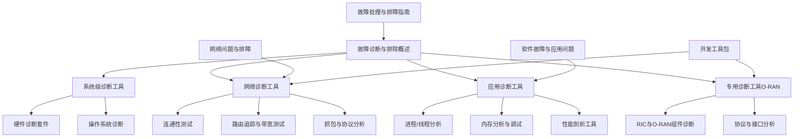
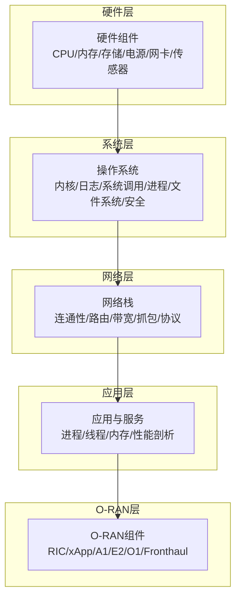
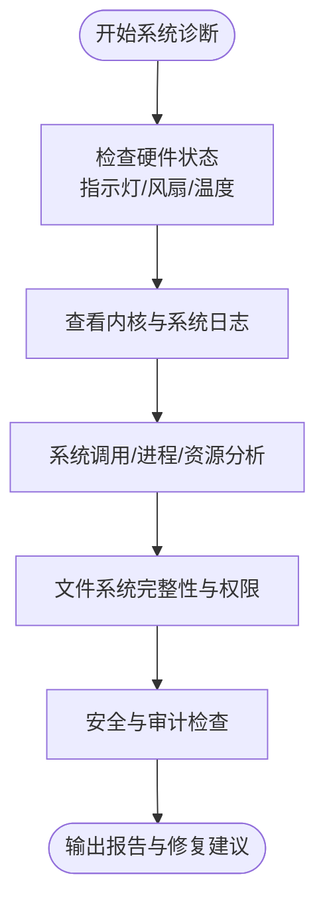
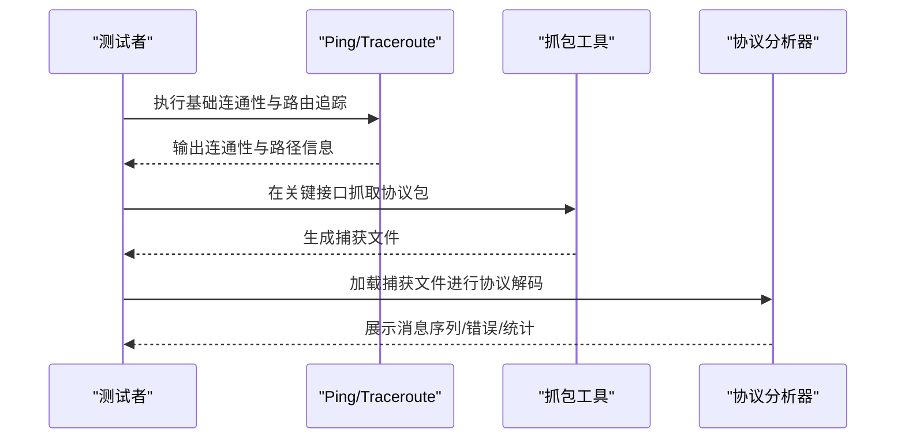
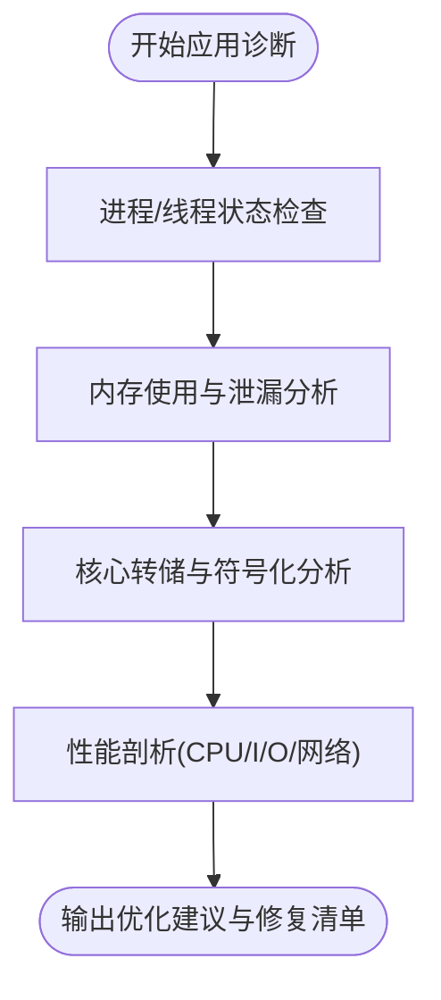
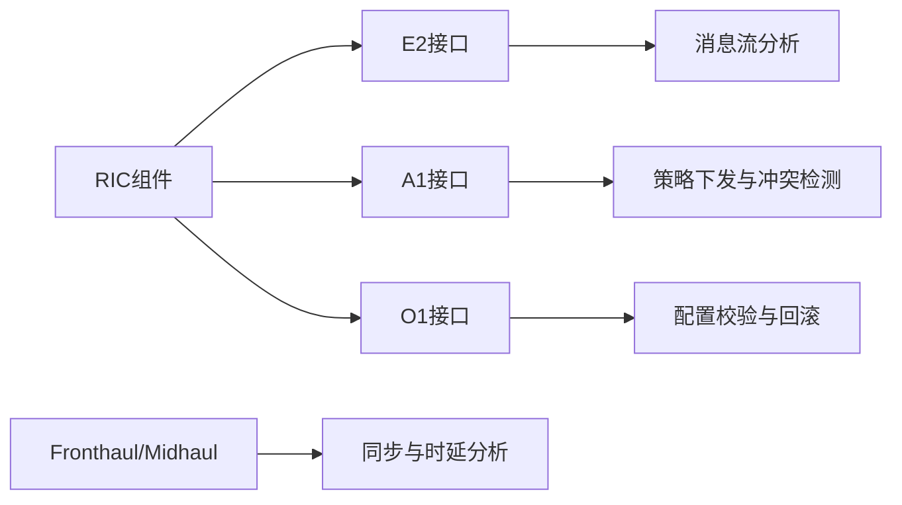
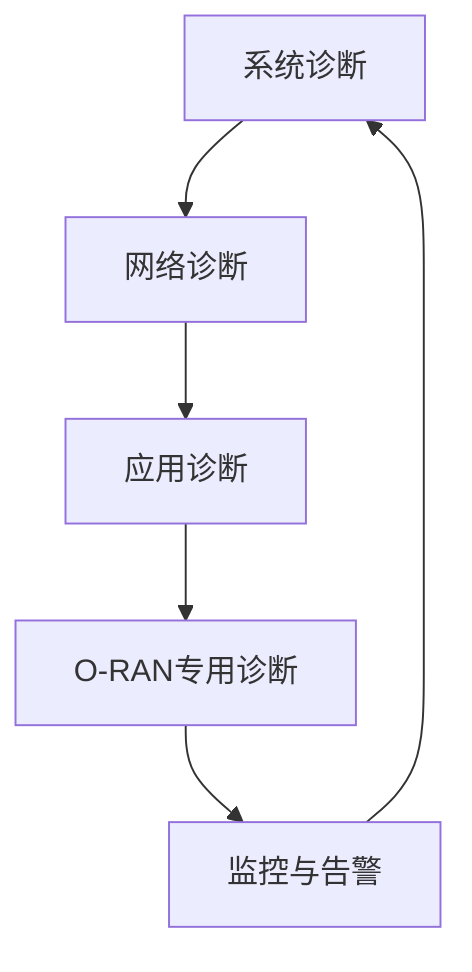
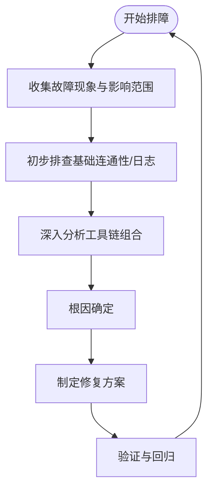

# 诊断工具

<cite>
**本文引用的文件**
- [O-RAN 故障诊断与排除（概述）](file://27-troubleshooting-diagnosis/readme-zh.md)
- [O-RAN 诊断工具与仪器（系统级/网络/应用/专用）](file://27-troubleshooting-diagnosis/diagnostic-tools/o-ran-diagnostic-instrumentation.md)
- [O-RAN 网络问题与排障](file://27-troubleshooting-diagnosis/network-issues/o-ran-network-troubleshooting.md)
- [O-RAN 软件故障与应用问题](file://27-troubleshooting-diagnosis/software-faults/o-ran-software-troubleshooting.md)
- [O-RAN 故障处理与排障指南](file://14-operations-management/fault-handling/fault-troubleshooting-guide.md)
- [O-RAN 开发工具包](file://22-tool-platforms/development-tools/o-ran-development-toolkit.md)
</cite>

## 目录
1. [简介](#简介)
2. [项目结构](#项目结构)
3. [核心组件](#核心组件)
4. [架构总览](#架构总览)
5. [详细组件分析](#详细组件分析)
6. [依赖分析](#依赖分析)
7. [性能考虑](#性能考虑)
8. [故障排查指南](#故障排查指南)
9. [结论](#结论)
10. [附录](#附录)

## 简介
本指南面向O-RAN系统的运维与工程人员，围绕“系统诊断工具、网络诊断工具、应用诊断工具、专用诊断工具”四大类，系统讲解功能特性、适用场景与操作方法；并结合“故障分类体系、诊断方法论、工具组合使用最佳实践”，帮助快速定位与解决复杂问题。同时提供安装配置要点、参数设置建议与结果解读技巧，便于在真实环境中高效落地。

## 项目结构
本仓库以主题域划分文档，诊断相关的内容主要集中在“故障诊断与排除”“网络问题”“软件故障”“故障处理与排障”等专题下，辅以“开发工具包”中的仿真、协议分析与容器化工具，形成从“问题发现—定位—修复—预防”的闭环。

图示来源
- [O-RAN 故障诊断与排除（概述）](file://27-troubleshooting-diagnosis/readme-zh.md#L1-L105)
- [O-RAN 诊断工具与仪器（系统级/网络/应用/专用）](file://27-troubleshooting-diagnosis/diagnostic-tools/o-ran-diagnostic-instrumentation.md#L1-L343)
- [O-RAN 网络问题与排障](file://27-troubleshooting-diagnosis/network-issues/o-ran-network-troubleshooting.md#L1-L278)
- [O-RAN 软件故障与应用问题](file://27-troubleshooting-diagnosis/software-faults/o-ran-software-troubleshooting.md#L1-L278)
- [O-RAN 故障处理与排障指南](file://14-operations-management/fault-handling/fault-troubleshooting-guide.md#L1-L633)
- [O-RAN 开发工具包](file://22-tool-platforms/development-tools/o-ran-development-toolkit.md#L1-L488)

章节来源
- [O-RAN 故障诊断与排除（概述）](file://27-troubleshooting-diagnosis/readme-zh.md#L1-L105)
- [O-RAN 诊断工具与仪器（系统级/网络/应用/专用）](file://27-troubleshooting-diagnosis/diagnostic-tools/o-ran-diagnostic-instrumentation.md#L1-L343)

## 核心组件
- 系统诊断工具
  - 硬件诊断套件：CPU/内存/存储/电源/网卡/显卡/USB/环境监测等
  - 操作系统诊断：内核日志、系统调用跟踪、进程与资源监控、文件系统与权限、审计与安全
- 网络诊断工具
  - 基础连通性与ARP/DNS/端口测试
  - 路由追踪、带宽与性能测试、抓包与协议分析、无线与安全扫描、QoS分析
- 应用诊断工具
  - 进程/线程状态、资源使用、信号与优先级、调度与cgroup
  - 内存监控/泄漏检测、核心转储与分析、Java应用诊断、性能剖析（CPU/I/O/网络）
- 专用诊断工具（O-RAN）
  - RIC与O-RAN组件健康监控、消息流分析、数据库与状态管理、容器与编排诊断
  - E2/A1/O1接口协议分析、Fronthaul/Midhaul链路分析（含eCPRI）

章节来源
- [O-RAN 诊断工具与仪器（系统级/网络/应用/专用）](file://27-troubleshooting-diagnosis/diagnostic-tools/o-ran-diagnostic-instrumentation.md#L6-L343)

## 架构总览
下图展示O-RAN诊断工具在系统中的角色与交互关系：从底层硬件到操作系统、网络栈、应用层，再到O-RAN特有接口与协议，形成分层诊断能力。

图示来源
- [O-RAN 诊断工具与仪器（系统级/网络/应用/专用）](file://27-troubleshooting-diagnosis/diagnostic-tools/o-ran-diagnostic-instrumentation.md#L6-L343)

## 详细组件分析

### 系统诊断工具
- 硬件诊断套件
  - 功能：覆盖服务器硬件、外围设备与环境监控，包含CPU压力测试、内存测试、磁盘SMART与性能、RAID诊断、温度/功耗/物理安全等
  - 适用场景：新装机验收、硬件故障初筛、预防性巡检
  - 操作要点：按层级进行，先基础连通性与指示灯，再逐步深入到固件/驱动/电源/散热
- 操作系统诊断
  - 功能：内核日志(dmesg/journalctl)、系统调用跟踪(strace/ltrace/ftrace/perf)、进程与资源(vmstat/iotop/top/htop)、文件系统(fsck/tune2fs/ncdu)、权限与审计(Audit/SELinux/AppArmor)
  - 适用场景：系统崩溃、内核恐慌、OOM、驱动问题、文件系统损坏、权限与访问控制异常
  - 操作要点：结合日志时间窗与关键关键字，定位硬件初始化、驱动加载、内存与I/O瓶颈

图示来源
- [O-RAN 诊断工具与仪器（系统级/网络/应用/专用）](file://27-troubleshooting-diagnosis/diagnostic-tools/o-ran-diagnostic-instrumentation.md#L66-L132)

章节来源
- [O-RAN 诊断工具与仪器（系统级/网络/应用/专用）](file://27-troubleshooting-diagnosis/diagnostic-tools/o-ran-diagnostic-instrumentation.md#L6-L132)

### 网络诊断工具
- 基础连通性与ARP/DNS/端口测试
  - 功能：ICMP/Ping、ARP表、DNS解析、端口/服务探测（telnet/netcat/nmap）、路由与防火墙规则核查
  - 适用场景：跨网段/跨域连通性、DNS解析失败、服务不可达、防火墙策略阻断
- 路由追踪与带宽测试
  - 功能：traceroute/mtr/tcptraceroute、iperf3/nuttcp/qperf/ttcp、Jitter/时延/丢包测量
  - 适用场景：路径异常、高时延/抖动、带宽不足、QoS异常
- 抓包与协议分析
  - 功能：tcpdump/wireshark/tshark/ngrep、无线分析(iw/iwconfig/wavemon)、安全扫描(nessus/openvas/nikto/sqlmap)
  - 适用场景：协议异常、消息格式错误、安全事件、无线干扰
- 协议与业务测试
  - 功能：HTTP/HTTPS、FTP/SFTP、SMTP、SNMP等
  - 适用场景：业务接口可用性、配置管理接口测试

图示来源
- [O-RAN 诊断工具与仪器（系统级/网络/应用/专用）](file://27-troubleshooting-diagnosis/diagnostic-tools/o-ran-diagnostic-instrumentation.md#L134-L202)
- [O-RAN 网络问题与排障](file://27-troubleshooting-diagnosis/network-issues/o-ran-network-troubleshooting.md#L1-L278)

章节来源
- [O-RAN 诊断工具与仪器（系统级/网络/应用/专用）](file://27-troubleshooting-diagnosis/diagnostic-tools/o-ran-diagnostic-instrumentation.md#L134-L202)
- [O-RAN 网络问题与排障](file://27-troubleshooting-diagnosis/network-issues/o-ran-network-troubleshooting.md#L1-L278)

### 应用诊断工具
- 进程/线程与资源
  - 功能：进程状态、树形关系、优先级与调度、cgroup资源限制、实时监控(top/htop/atop/glances)
  - 适用场景：僵尸进程、资源耗尽、调度异常
- 内存分析与调试
  - 功能：内存使用概览、泄漏检测(valgrind/massif/memcheck)、核心转储与分析(gdb/crash/apport)、Java诊断(jps/jstack/jmap/jconsole)
  - 适用场景：内存泄漏、OOM、GC与堆异常、线程死锁
- 性能剖析
  - 功能：CPU(perf/gprof/callgrind/flamegraph)、I/O(iostat/iotop/blktrace)、网络(nethogs/iftop/bmon/slurm)
  - 适用场景：热点函数、慢查询、I/O瓶颈、带宽占用异常

图示来源
- [O-RAN 诊断工具与仪器（系统级/网络/应用/专用）](file://27-troubleshooting-diagnosis/diagnostic-tools/o-ran-diagnostic-instrumentation.md#L204-L272)

章节来源
- [O-RAN 诊断工具与仪器（系统级/网络/应用/专用）](file://27-troubleshooting-diagnosis/diagnostic-tools/o-ran-diagnostic-instrumentation.md#L204-L272)

### 专用诊断工具（O-RAN）
- RIC与O-RAN组件
  - 功能：xApp/rApp健康监控、E2/A1/O1接口状态、消息流与队列、数据库/缓存/时序/键值存储、容器与编排
  - 适用场景：E2订阅失败、A1策略下发异常、O1配置不一致、容器重启风暴
- 协议与接口分析
  - 功能：E2AP消息结构验证、RMR消息路由、Fronthaul(eCPRI)/Midhaul同步、时延/抖动测量
  - 适用场景：控制回路延迟高、消息丢失、时钟同步漂移

图示来源
- [O-RAN 诊断工具与仪器（系统级/网络/应用/专用）](file://27-troubleshooting-diagnosis/diagnostic-tools/o-ran-diagnostic-instrumentation.md#L274-L343)

章节来源
- [O-RAN 诊断工具与仪器（系统级/网络/应用/专用）](file://27-troubleshooting-diagnosis/diagnostic-tools/o-ran-diagnostic-instrumentation.md#L274-L343)

## 依赖分析
- 工具耦合与协作
  - 系统层工具为上层网络与应用诊断提供基础数据（日志、进程、资源），网络工具为应用与O-RAN接口诊断提供连通性与协议证据，专用工具聚焦O-RAN特有协议与组件
- 外部依赖与集成
  - 协议分析依赖Wireshark/TShark等生态；容器与编排依赖Kubernetes/Helm；数据库与缓存依赖PostgreSQL/Redis/InfluxDB/Etcd等
- 可能的循环依赖
  - 诊断流程为单向推进，避免直接循环依赖；若出现“先有鸡先有蛋”问题，可采用“最小化样本”与“隔离变量法”

图示来源
- [O-RAN 诊断工具与仪器（系统级/网络/应用/专用）](file://27-troubleshooting-diagnosis/diagnostic-tools/o-ran-diagnostic-instrumentation.md#L1-L343)

章节来源
- [O-RAN 诊断工具与仪器（系统级/网络/应用/专用）](file://27-troubleshooting-diagnosis/diagnostic-tools/o-ran-diagnostic-instrumentation.md#L1-L343)

## 性能考虑
- 采集开销与采样窗口
  - 抓包与系统采样会带来CPU/IO开销，应限定时间窗口与过滤条件，避免对生产造成二次影响
- 并发与顺序
  - 先做无侵入性检查（连通性/路由/日志），再进行重负载测试（iperf/压力测试），最后进行核心转储与深度剖析
- 结果解读
  - 关注趋势与对比基线，区分瞬时异常与持续性问题；结合业务时段特征与容量规划进行综合判断

## 故障排查指南
- 故障分类与定位流程
  - 现象收集→影响评估→初步排查→深入分析→根因确定→解决方案
  - 工具箱：系统(dmesg/journalctl/sar/vmstat)、网络(ping/traceroute/netstat/ss)、应用(jstack/jmap/gdb/core dump)、专用(O-RAN诊断软件/协议分析器)
- 常见场景
  - 启动故障：硬件指示灯、BIOS/UEFI日志、引导配置、文件系统、关键服务依赖
  - 网络连通性：ping/路由/traceroute/防火墙/DNS/接口状态
  - 性能异常：资源使用率、进程/线程、网络流量/连接数、数据库查询、应用日志
- 预防性维护
  - 定期检查硬件健康、系统日志审查、配置备份与版本管理、安全补丁、性能基线维护
  - 自动化监控：关键指标实时监控、异常自动告警、故障预测、自动化修复脚本、知识库更新

图示来源
- [O-RAN 故障诊断与排除（概述）](file://27-troubleshooting-diagnosis/readme-zh.md#L26-L105)

章节来源
- [O-RAN 故障诊断与排除（概述）](file://27-troubleshooting-diagnosis/readme-zh.md#L1-L105)

## 结论
通过系统化的工具链与方法论，O-RAN运维团队可以实现从硬件到协议的全栈诊断，快速定位并解决问题。建议将“工具箱”与“流程”固化为标准作业程序(SOP)，配合自动化监控与告警，持续提升系统的稳定性与可维护性。

## 附录

### 工具组合使用最佳实践
- 多工具协同诊断
  - 网络连通性→路由追踪→抓包→协议分析→应用侧日志→数据库/缓存状态→容器/编排状态→O-RAN接口消息流
- 工具选择决策标准
  - 无侵入性优先（先ping/traceroute/journalctl），再重负载测试（iperf/压力测试），最后核心转储与深度剖析
  - 根据故障现象选择工具：连通性问题选网络工具，性能问题选系统/应用工具，协议问题选专用工具
- 安装与配置要点
  - 系统工具：确保日志轮转与权限、内核参数与模块加载；网络工具：抓包过滤器与接口权限；应用工具：调试符号与core dump配置；专用工具：证书/密钥/配置模板
- 结果解读技巧
  - 对比历史基线与阈值，关注异常模式与时间窗口；结合业务高峰/低谷时段，避免误判；必要时扩大采样范围与时间跨度

章节来源
- [O-RAN 故障处理与排障指南](file://14-operations-management/fault-handling/fault-troubleshooting-guide.md#L1-L633)
- [O-RAN 开发工具包](file://22-tool-platforms/development-tools/o-ran-development-toolkit.md#L1-L488)