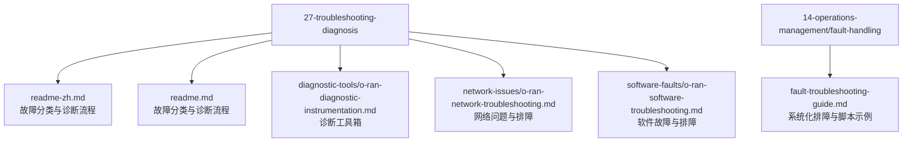
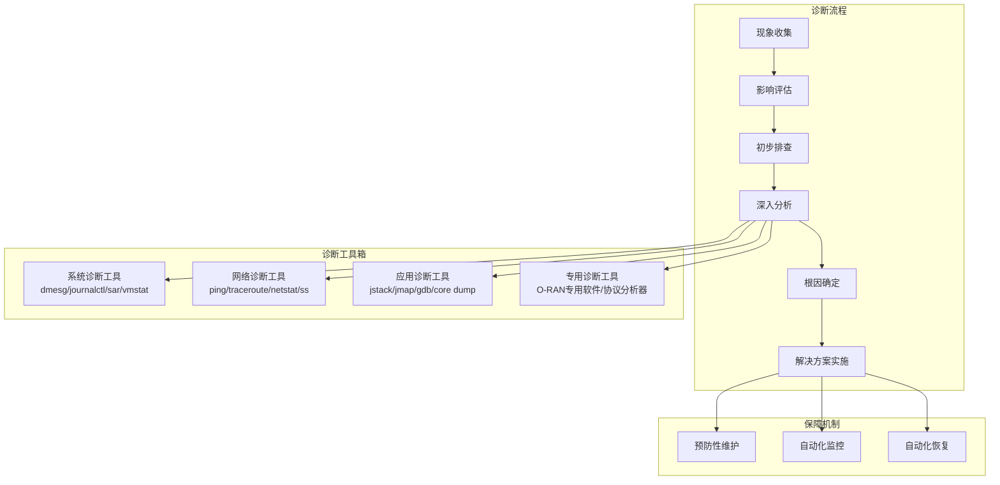
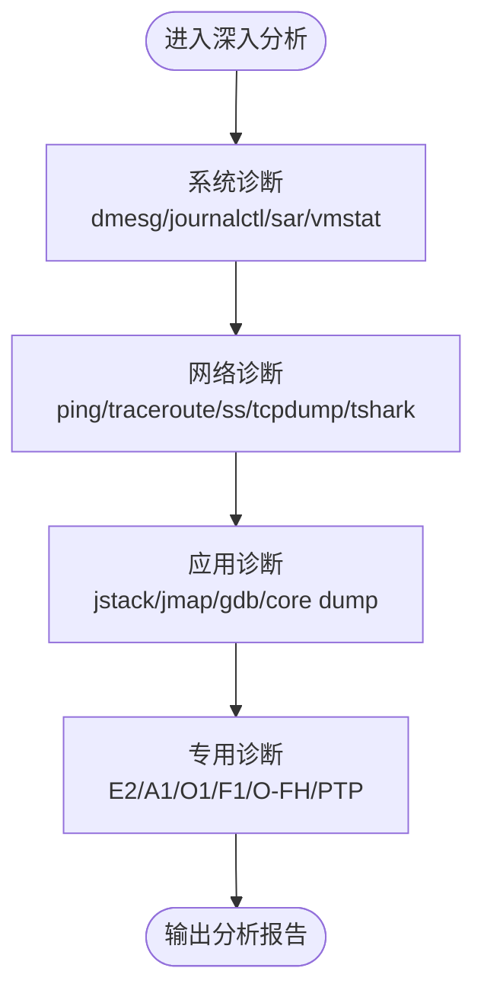
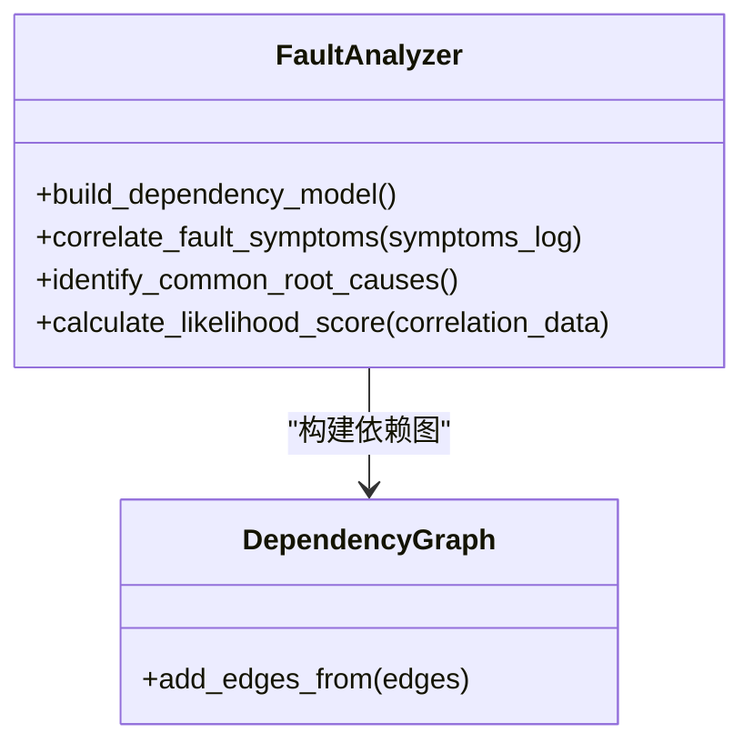
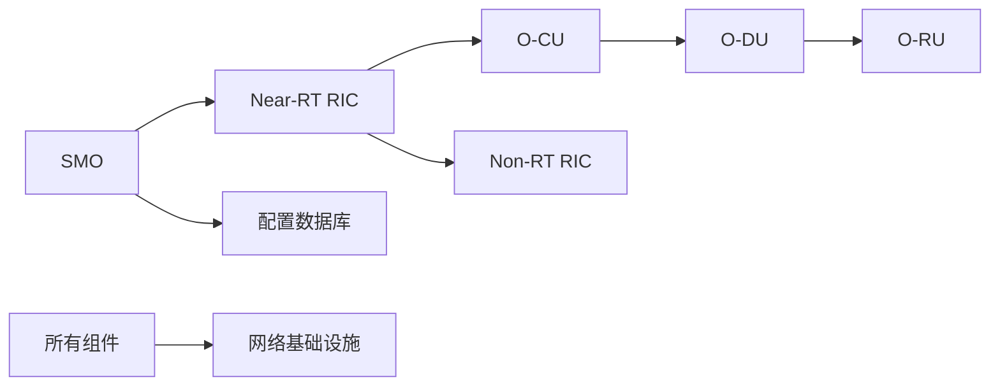

# 诊断方法论

<cite>
**本文引用的文件**
- [O-RAN 故障诊断与排除（中文）](file://27-troubleshooting-diagnosis/readme-zh.md)
- [O-RAN 故障诊断与排除（英文）](file://27-troubleshooting-diagnosis/readme.md)
- [O-RAN 诊断工具与仪器（英文）](file://27-troubleshooting-diagnosis/diagnostic-tools/o-ran-diagnostic-instrumentation.md)
- [O-RAN 网络问题和故障排除（英文）](file://27-troubleshooting-diagnosis/network-issues/o-ran-network-troubleshooting.md)
- [O-RAN 网络问题和故障排除（中文）](file://27-troubleshooting-diagnosis/network-issues/o-ran-network-troubleshooting-zh.md)
- [O-RAN 软件故障和应用问题（英文）](file://27-troubleshooting-diagnosis/software-faults/o-ran-software-troubleshooting.md)
- [O-RAN 故障处理与诊断指南（英文）](file://14-operations-management/fault-handling/fault-troubleshooting-guide.md)
</cite>

## 目录
1. [引言](#引言)
2. [项目结构](#项目结构)
3. [核心组件](#核心组件)
4. [架构总览](#架构总览)
5. [详细组件分析](#详细组件分析)
6. [依赖分析](#依赖分析)
7. [性能考虑](#性能考虑)
8. [故障排除指南](#故障排除指南)
9. [结论](#结论)
10. [附录](#附录)

## 引言
本文件面向O-RAN系统的运维与工程团队，提供一套系统化的“诊断方法论”。该方法论以“现象收集—影响评估—初步排查—深入分析—根因确定—解决方案”为主线，结合系统、网络、应用与专用工具的诊断工具箱，形成可复用、可落地的故障定位与处置流程。同时，配套常见故障（启动失败、网络连通性、性能异常）的标准化处理步骤与检查要点，帮助快速恢复业务连续性并降低平均修复时间。

## 项目结构
本仓库中与“诊断方法论”直接相关的核心资料主要分布在以下位置：
- 27-troubleshooting-diagnosis：包含通用故障分类、诊断流程、诊断工具箱、网络与软件故障专题
- 14-operations-management/fault-handling：包含系统化故障处理与诊断指南，含脚本与工具使用建议

**图表来源**
- [O-RAN 故障诊断与排除（中文）](file://27-troubleshooting-diagnosis/readme-zh.md#L1-L105)
- [O-RAN 故障诊断与排除（英文）](file://27-troubleshooting-diagnosis/readme.md#L1-L105)
- [O-RAN 诊断工具与仪器（英文）](file://27-troubleshooting-diagnosis/diagnostic-tools/o-ran-diagnostic-instrumentation.md#L1-L343)
- [O-RAN 网络问题和故障排除（英文）](file://27-troubleshooting-diagnosis/network-issues/o-ran-network-troubleshooting.md#L1-L278)
- [O-RAN 软件故障和应用问题（英文）](file://27-troubleshooting-diagnosis/software-faults/o-ran-software-troubleshooting.md#L1-L278)
- [O-RAN 故障处理与诊断指南（英文）](file://14-operations-management/fault-handling/fault-troubleshooting-guide.md#L1-L633)

**章节来源**
- [O-RAN 故障诊断与排除（中文）](file://27-troubleshooting-diagnosis/readme-zh.md#L1-L105)
- [O-RAN 故障诊断与排除（英文）](file://27-troubleshooting-diagnosis/readme.md#L1-L105)
- [O-RAN 诊断工具与仪器（英文）](file://27-troubleshooting-diagnosis/diagnostic-tools/o-ran-diagnostic-instrumentation.md#L1-L343)
- [O-RAN 网络问题和故障排除（英文）](file://27-troubleshooting-diagnosis/network-issues/o-ran-network-troubleshooting.md#L1-L278)
- [O-RAN 软件故障和应用问题（英文）](file://27-troubleshooting-diagnosis/software-faults/o-ran-software-troubleshooting.md#L1-L278)
- [O-RAN 故障处理与诊断指南（英文）](file://14-operations-management/fault-handling/fault-troubleshooting-guide.md#L1-L633)

## 核心组件
- 故障分类体系：按硬件、软件、网络三大类划分，便于快速定位与分工协作
- 诊断流程：六步法（现象收集、影响评估、初步排查、深入分析、根因确定、解决方案）
- 诊断工具箱：系统诊断、网络诊断、应用诊断、专用诊断四类工具清单与使用场景
- 常见故障处理：启动失败、网络连通性、性能异常三类场景的标准化步骤

**章节来源**
- [O-RAN 故障诊断与排除（中文）](file://27-troubleshooting-diagnosis/readme-zh.md#L6-L41)
- [O-RAN 故障诊断与排除（英文）](file://27-troubleshooting-diagnosis/readme.md#L6-L41)
- [O-RAN 诊断工具与仪器（英文）](file://27-troubleshooting-diagnosis/diagnostic-tools/o-ran-diagnostic-instrumentation.md#L6-L343)

## 架构总览
下图展示“诊断方法论”的整体架构：从现象收集开始，经由影响评估与初步排查，进入深入分析阶段（系统/网络/应用/专用工具），最终完成根因确定与解决方案实施，并辅以预防性维护与自动化恢复能力。

**图表来源**
- [O-RAN 故障诊断与排除（中文）](file://27-troubleshooting-diagnosis/readme-zh.md#L26-L41)
- [O-RAN 故障诊断与排除（英文）](file://27-troubleshooting-diagnosis/readme.md#L26-L41)
- [O-RAN 诊断工具与仪器（英文）](file://27-troubleshooting-diagnosis/diagnostic-tools/o-ran-diagnostic-instrumentation.md#L6-L343)
- [O-RAN 故障处理与诊断指南（英文）](file://14-operations-management/fault-handling/fault-troubleshooting-guide.md#L539-L631)

## 详细组件分析

### 现象收集与影响评估
- 现象收集：记录故障发生时间、频率、影响范围、用户可见症状、告警信息等
- 影响评估：分级（轻微/一般/严重/灾难）、业务影响面、SLA偏离情况、是否涉及安全与合规

**章节来源**
- [O-RAN 故障诊断与排除（中文）](file://27-troubleshooting-diagnosis/readme-zh.md#L28-L34)
- [O-RAN 故障诊断与排除（英文）](file://27-troubleshooting-diagnosis/readme.md#L28-L34)

### 初步排查
- 快速验证：电源/风扇/指示灯、基础连通性（ping）、路由与防火墙、服务状态
- 日志初筛：系统日志、应用日志、关键组件日志，提取错误关键字与时间窗口

**章节来源**
- [O-RAN 故障诊断与排除（中文）](file://27-troubleshooting-diagnosis/readme-zh.md#L31-L34)
- [O-RAN 故障诊断与排除（英文）](file://27-troubleshooting-diagnosis/readme.md#L31-L34)
- [O-RAN 故障处理与诊断指南（英文）](file://14-operations-management/fault-handling/fault-troubleshooting-guide.md#L62-L97)

### 深入分析
- 系统诊断：内核消息、服务状态、进程与资源、文件系统与权限、审计与日志轮转
- 网络诊断：连通性与路由、带宽与延迟、抓包与协议分析、QoS与安全策略
- 应用诊断：进程与线程、内存与堆栈、核心转储与调试、性能剖析
- 专用诊断：O-RAN组件（E2/A1/O1/F1/O-FH）协议与接口分析、时钟与同步校准

**图表来源**
- [O-RAN 诊断工具与仪器（英文）](file://27-troubleshooting-diagnosis/diagnostic-tools/o-ran-diagnostic-instrumentation.md#L6-L343)
- [O-RAN 网络问题和故障排除（英文）](file://27-troubleshooting-diagnosis/network-issues/o-ran-network-troubleshooting.md#L1-L278)
- [O-RAN 软件故障和应用问题（英文）](file://27-troubleshooting-diagnosis/software-faults/o-ran-software-troubleshooting.md#L1-L278)

**章节来源**
- [O-RAN 诊断工具与仪器（英文）](file://27-troubleshooting-diagnosis/diagnostic-tools/o-ran-diagnostic-instrumentation.md#L6-L343)
- [O-RAN 网络问题和故障排除（英文）](file://27-troubleshooting-diagnosis/network-issues/o-ran-network-troubleshooting.md#L1-L278)
- [O-RAN 软件故障和应用问题（英文）](file://27-troubleshooting-diagnosis/software-faults/o-ran-software-troubleshooting.md#L1-L278)

### 根因确定
- 依赖建模：基于O-RAN组件关系构建依赖图，辅助定位跨层影响
- 关联分析：基于时间窗与症状聚类，计算可能性评分，识别高频/高相关性模式
- 证据汇总：将日志、抓包、指标与历史案例进行交叉验证

**图表来源**
- [O-RAN 故障处理与诊断指南（英文）](file://14-operations-management/fault-handling/fault-troubleshooting-guide.md#L100-L180)

**章节来源**
- [O-RAN 故障处理与诊断指南（英文）](file://14-operations-management/fault-handling/fault-troubleshooting-guide.md#L100-L180)

### 解决方案实施与闭环
- 临时措施：隔离故障域、降级服务、切换备用路径
- 永久修复：参数修正、配置回滚、补丁与版本升级、硬件更换
- 验证与回归：功能验证、性能回归、监控回归、用户验收
- 知识沉淀：案例归档、流程优化、培训与演练

**章节来源**
- [O-RAN 故障诊断与排除（中文）](file://27-troubleshooting-diagnosis/readme-zh.md#L34-L35)
- [O-RAN 故障诊断与排除（英文）](file://27-troubleshooting-diagnosis/readme.md#L34-L35)

## 依赖分析
O-RAN系统组件之间存在明确的依赖关系，故障传播具有方向性与层级性。下图展示了典型依赖链路，有助于在根因分析时判断故障传播路径与影响范围。

**图表来源**
- [O-RAN 故障处理与诊断指南（英文）](file://14-operations-management/fault-handling/fault-troubleshooting-guide.md#L113-L126)

**章节来源**
- [O-RAN 故障处理与诊断指南（英文）](file://14-operations-management/fault-handling/fault-troubleshooting-guide.md#L113-L126)

## 性能考虑
- 资源监控：CPU、内存、磁盘I/O、网络带宽与延迟，建议采用周期性采样与阈值告警
- 业务指标：吞吐量、请求时延、错误率、连接数、队列长度，关注尾部延迟与抖动
- 压力测试：在变更前后进行对比测试，确保容量与性能基线稳定
- 优化策略：网络参数调优、QoS与缓冲区配置、拆分选项与压缩策略、时钟同步与补偿

**章节来源**
- [O-RAN 网络问题和故障排除（英文）](file://27-troubleshooting-diagnosis/network-issues/o-ran-network-troubleshooting.md#L97-L186)
- [O-RAN 软件故障和应用问题（英文）](file://27-troubleshooting-diagnosis/software-faults/o-ran-software-troubleshooting.md#L188-L278)

## 故障排除指南

### 启动失败处理
- 步骤要点：检查硬件指示灯、BIOS/UEFI启动日志、引导加载程序配置、文件系统完整性、关键服务依赖
- 检查要点：电源与散热、内存与磁盘自检、引导分区与内核镜像、服务依赖链

**章节来源**
- [O-RAN 故障诊断与排除（中文）](file://27-troubleshooting-diagnosis/readme-zh.md#L44-L53)
- [O-RAN 故障诊断与排除（英文）](file://27-troubleshooting-diagnosis/readme.md#L44-L53)

### 网络连通性故障处理
- 步骤要点：基础连通性测试（ping）、路由表检查与traceroute、防火墙规则验证、DNS解析测试、接口状态与配置检查
- 检查要点：物理层（线缆/光模块/交换机）、链路层（ARP/MTU）、网络层（路由/ACL）、传输层（端口/协议）

**章节来源**
- [O-RAN 故障诊断与排除（中文）](file://27-troubleshooting-diagnosis/readme-zh.md#L55-L64)
- [O-RAN 故障诊断与排除（英文）](file://27-troubleshooting-diagnosis/readme.md#L55-L64)
- [O-RAN 网络问题和故障排除（英文）](file://27-troubleshooting-diagnosis/network-issues/o-ran-network-troubleshooting.md#L6-L95)

### 性能异常故障处理
- 步骤要点：系统资源使用率监控、进程与线程状态分析、网络流量与连接数检查、数据库查询性能分析、应用程序日志审查
- 检查要点：CPU/内存/IO瓶颈、队列积压与丢包、慢查询与锁等待、缓存命中率与失效

**章节来源**
- [O-RAN 故障诊断与排除（中文）](file://27-troubleshooting-diagnosis/readme-zh.md#L66-L75)
- [O-RAN 故障诊断与排除（英文）](file://27-troubleshooting-diagnosis/readme.md#L66-L75)
- [O-RAN 软件故障和应用问题（英文）](file://27-troubleshooting-diagnosis/software-faults/o-ran-software-troubleshooting.md#L97-L186)

### 专用场景与接口排障
- E2接口：连接建立失败、证书与安全验证、配置参数校验、重试与超时调整、服务重启与配置生效
- F1接口：性能指标采集、资源利用分析、流量与重传分析、网络与QoS调优、拆分选项优化
- O-FH同步：PTP同步验证、硬件时间戳校验、IQ质量分析、时钟源稳定与补偿、网络与硬件优化

**章节来源**
- [O-RAN 故障处理与诊断指南（英文）](file://14-operations-management/fault-handling/fault-troubleshooting-guide.md#L266-L537)
- [O-RAN 网络问题和故障排除（英文）](file://27-troubleshooting-diagnosis/network-issues/o-ran-network-troubleshooting.md#L188-L278)

## 结论
本方法论以“流程标准化+工具体系化+场景模板化”为核心，配合自动化监控与恢复机制，能够有效缩短故障定位时间、提升修复成功率，并推动知识沉淀与团队能力提升。建议在实际运维中结合本指南形成SOP，并定期演练与迭代优化。

## 附录

### 诊断工具箱使用指南
- 系统诊断工具：dmesg用于内核消息与硬件初始化追踪；journalctl用于服务日志与事件关联；sar/vmstat用于资源统计与趋势分析
- 网络诊断工具：ping/traceroute用于连通性与路径分析；ss/netstat用于套接字与连接状态；tcpdump/tshark用于抓包与协议分析
- 应用诊断工具：jstack/jmap用于Java堆栈与内存快照；gdb/core dump用于C/C++崩溃分析与函数调用链
- 专用诊断工具：O-RAN专用诊断软件与协议分析器用于E2/A1/O1/F1/O-FH接口与协议层面的深度分析

**章节来源**
- [O-RAN 诊断工具与仪器（英文）](file://27-troubleshooting-diagnosis/diagnostic-tools/o-ran-diagnostic-instrumentation.md#L6-L343)
- [O-RAN 故障处理与诊断指南（英文）](file://14-operations-management/fault-handling/fault-troubleshooting-guide.md#L184-L262)