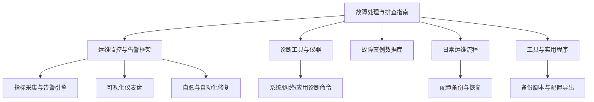
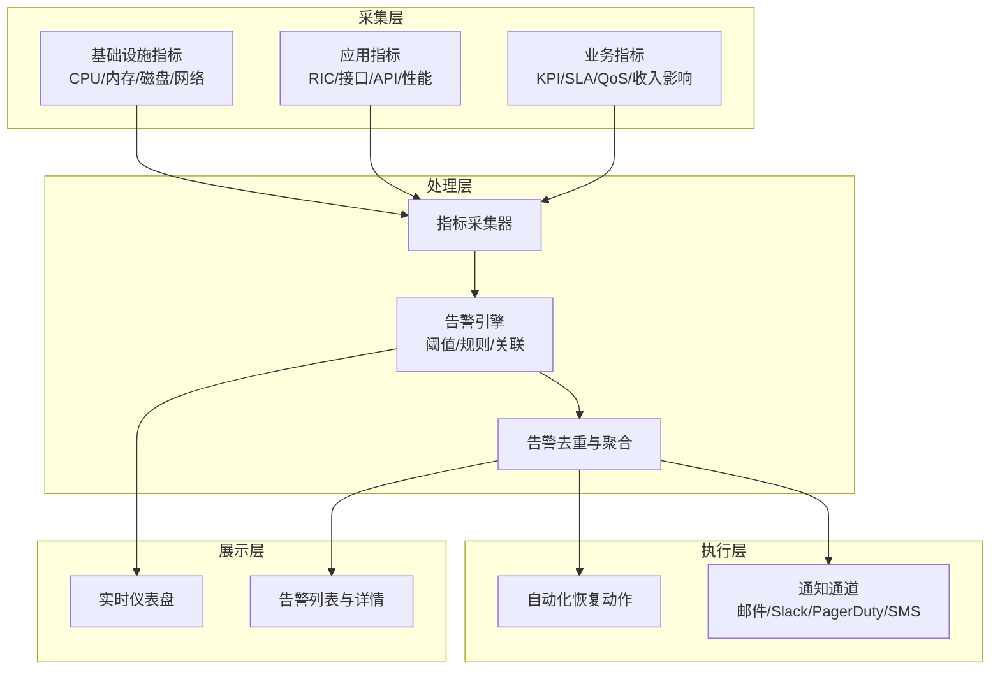
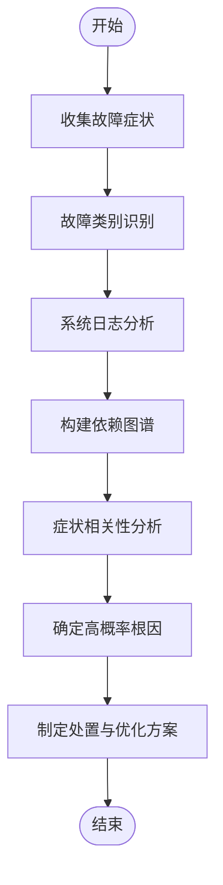
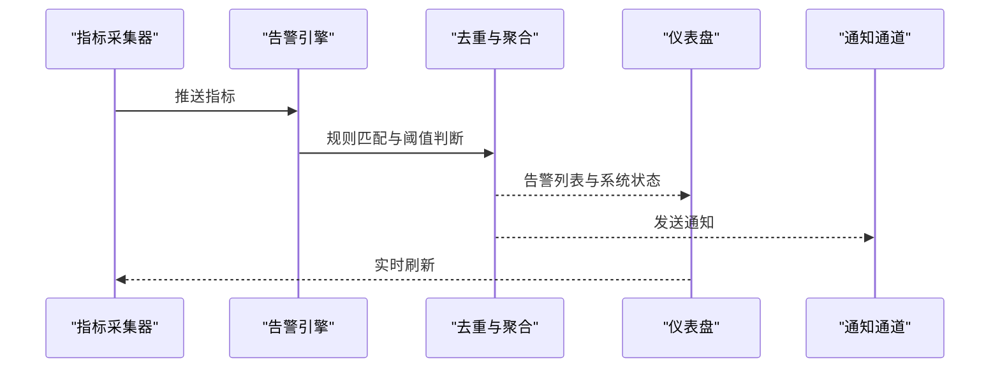
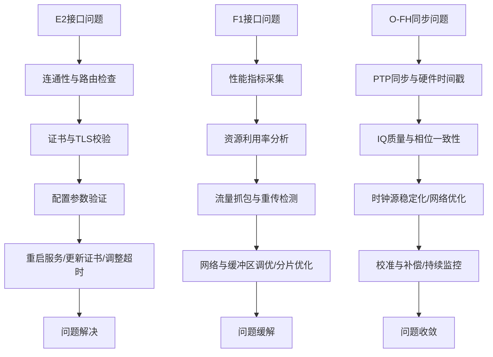
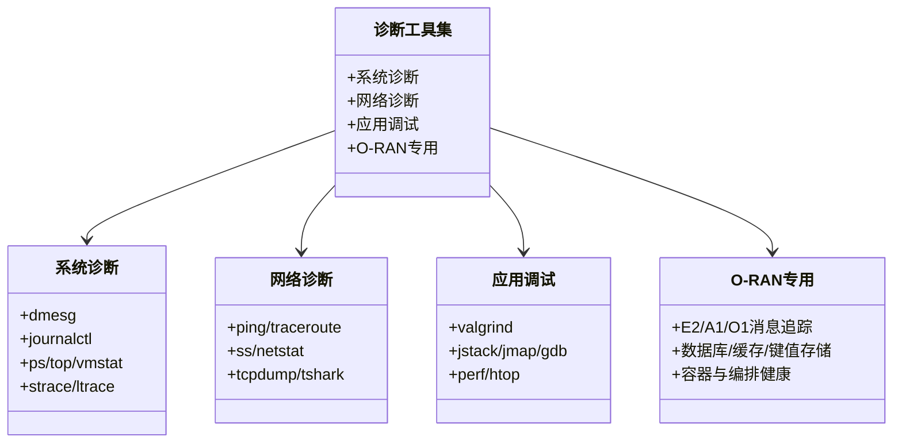
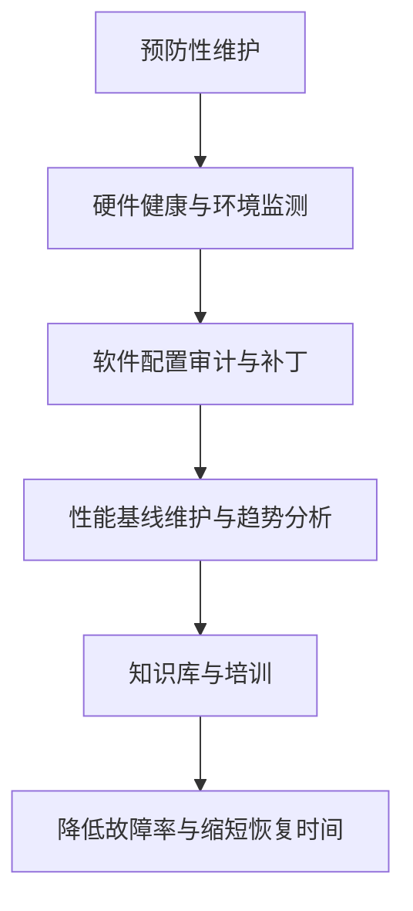
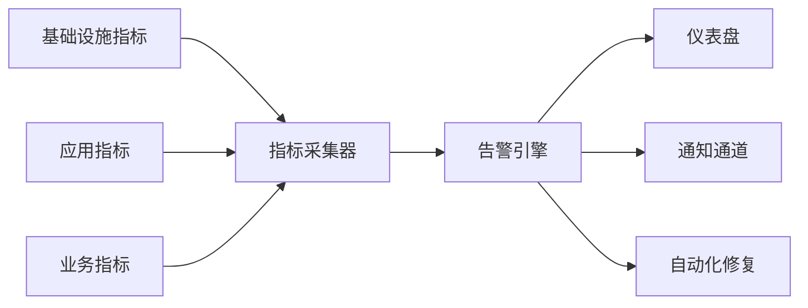

# 软件故障

<cite>
**本文引用的文件**   
- [故障排除指南.md](file://14-operations-management/fault-handling/fault-troubleshooting-guide.md)
- [运维监控框架.md](file://14-operations-management/monitoring-alerting/operations-monitoring-framework.md)
- [诊断工具与仪器.md](file://27-troubleshooting-diagnosis/diagnostic-tools/o-ran-diagnostic-instrumentation.md)
- [故障案例数据库.md](file://27-troubleshooting-diagnosis/fault-library/o-ran-fault-case-database.md)
- [每日运维流程.md](file://14-operations-management/daily-operations/daily-operation-procedures.md)
- [每日运维流程（中文）.md](file://14-operations-management/daily-operations/daily-operation-procedures-zh.md)
- [O-RAN工具与实用程序.md](file://22-tool-platforms/utility-programs/o-ran-utility-programs.md)
- [O-RAN工具与实用程序（中文）.md](file://22-tool-platforms/utility-programs/o-ran-utility-programs-zh.md)
- [计算优化.md](file://26-performance-optimization/compute-optimization/o-ran-compute-optimization.md)
</cite>

## 目录
1. 引言
2. 项目结构
3. 核心组件
4. 架构总览
5. 详细组件分析
6. 依赖关系分析
7. 性能考量
8. 故障排查指南
9. 结论
10. 附录

## 引言
本指南面向O-RAN软件故障处理，聚焦系统级、应用级、配置与数据类故障的识别与处置，并提供日志分析、进程状态检查、内存泄漏检测与核心转储分析等调试技巧；同时给出预防性维护策略，包括定期备份、版本管理、安全补丁更新与性能基线维护的具体实施要点。

## 项目结构
围绕“故障处理”主题，仓库中相关文档主要分布在以下模块：
- 运维与故障处理：包含故障分类、诊断方法、常见场景与自动恢复流程
- 运维监控与告警：涵盖指标采集、智能告警、仪表盘与自愈动作
- 诊断工具与仪器：系统/网络/应用层面的诊断命令与工具清单
- 故障案例数据库：软件故障分类、症状、根因与处置步骤
- 日常运维流程：配置备份与恢复、版本与补丁管理
- 工具与实用程序：备份脚本、配置导出与恢复
- 性能优化：CPU/内存分析与泄漏检测工具链

**章节来源**
- file://14-operations-management/fault-handling/fault-troubleshooting-guide.md#L1-L633
- file://14-operations-management/monitoring-alerting/operations-monitoring-framework.md#L1-L909
- file://27-troubleshooting-diagnosis/diagnostic-tools/o-ran-diagnostic-instrumentation.md#L1-L343
- file://27-troubleshooting-diagnosis/fault-library/o-ran-fault-case-database.md#L61-L225
- file://14-operations-management/daily-operations/daily-operation-procedures.md#L163-L217
- file://22-tool-platforms/utility-programs/o-ran-utility-programs.md#L563-L626

## 核心组件
- 故障分类与影响评估：覆盖网络功能、接口协议、基础设施与平台三类关键故障
- 系统化诊断方法：从初步识别到根因分析，结合日志与依赖图谱进行关联分析
- 先进诊断工具：网络抓包与分析、资源监控、接口健康检查
- 常见故障场景：E2/F1/O-FH接口问题与同步问题的诊断与优化
- 预防性维护：主动监控、预测性分析、自动化恢复与告警关联规则

**章节来源**
- file://14-operations-management/fault-handling/fault-troubleshooting-guide.md#L6-L31
- file://14-operations-management/fault-handling/fault-troubleshooting-guide.md#L31-L180
- file://14-operations-management/fault-handling/fault-troubleshooting-guide.md#L182-L262

## 架构总览
下图展示O-RAN软件故障处理的整体架构：从“系统/应用/业务”三层指标采集，到“智能告警与通知”，再到“可视化看板与自愈动作”的闭环。

**图表来源**
- [运维监控框架.md](file://14-operations-management/monitoring-alerting/operations-monitoring-framework.md#L10-L44)
- [运维监控框架.md](file://14-operations-management/monitoring-alerting/operations-monitoring-framework.md#L48-L260)
- [运维监控框架.md](file://14-operations-management/monitoring-alerting/operations-monitoring-framework.md#L264-L486)
- [运维监控框架.md](file://14-operations-management/monitoring-alerting/operations-monitoring-framework.md#L488-L528)
- [运维监控框架.md](file://14-operations-management/monitoring-alerting/operations-monitoring-framework.md#L530-L692)
- [运维监控框架.md](file://14-operations-management/monitoring-alerting/operations-monitoring-framework.md#L694-L800)

**章节来源**
- file://14-operations-management/monitoring-alerting/operations-monitoring-framework.md#L1-L909

## 详细组件分析

### 组件A：故障分类与诊断方法
- 故障分类：网络功能、接口协议、基础设施与平台三大类，覆盖RIC、DU/CU、RU、SMO等组件
- 诊断方法：从症状识别、日志分析、依赖建模到根因关联，形成可量化的判定流程
- 关键工具：journalctl、日志模式匹配、故障报告生成、依赖图构建与相关性分析

**章节来源**
- file://14-operations-management/fault-handling/fault-troubleshooting-guide.md#L31-L180

### 组件B：智能告警与通知
- 告警规则：基于阈值与持续时间，覆盖CPU/内存/RIC响应/接口可用性/KPI等
- 告警去重：避免重复与相似告警风暴
- 通知通道：邮件、Slack、PagerDuty等多通道联动
- 可视化：仪表盘展示系统状态、指标趋势与活跃告警

**章节来源**
- file://14-operations-management/monitoring-alerting/operations-monitoring-framework.md#L264-L486
- file://14-operations-management/monitoring-alerting/operations-monitoring-framework.md#L530-L692

### 组件C：接口与网络诊断
- E2接口：连接建立失败、证书与安全校验、配置参数验证与重启、证书更新、时延参数调整
- F1接口：吞吐与延迟问题、资源利用率分析、流量抓包与重传检测、网络与缓冲区调优、分片选项优化
- O-FH同步：PTP同步质量、硬件时间戳、IQ质量分析、时钟源稳定化、网络基础设施优化、校准补偿

**章节来源**
- file://14-operations-management/fault-handling/fault-troubleshooting-guide.md#L266-L537

### 组件D：诊断工具与仪器
- 系统级：dmesg、journalctl、strace/ltrace、ps/top/vmstat/iotop等
- 网络级：ping/traceroute、ss/netstat、tcpdump/tshark等
- 应用级：ps/pstree/pgrep/pkill、top/htop/atop/glances、valgrind、jstack/jmap/gdb等
- O-RAN专用：E2/A1/O1接口消息流、数据库/缓存/键值存储、容器与编排健康检查

**章节来源**
- file://27-troubleshooting-diagnosis/diagnostic-tools/o-ran-diagnostic-instrumentation.md#L6-L132
- file://27-troubleshooting-diagnosis/diagnostic-tools/o-ran-diagnostic-instrumentation.md#L134-L202
- file://27-troubleshooting-diagnosis/diagnostic-tools/o-ran-diagnostic-instrumentation.md#L204-L272
- file://27-troubleshooting-diagnosis/diagnostic-tools/o-ran-diagnostic-instrumentation.md#L274-L343

### 组件E：故障案例与预防性维护
- 软件故障分类：内核级问题、服务与守护进程、数据库/Web/容器编排、认证/防火墙/恶意软件
- 预防性维护：硬件健康监控、环境条件监测、配置审计、安全补丁与更新、性能基线维护、知识库与培训

**章节来源**
- file://27-troubleshooting-diagnosis/fault-library/o-ran-fault-case-database.md#L61-L114
- file://27-troubleshooting-diagnosis/fault-library/o-ran-fault-case-database.md#L171-L225

## 依赖关系分析
- 指标采集器依赖系统/应用/业务层指标源，输出给告警引擎
- 告警引擎依赖规则与阈值配置，输出给可视化与通知通道
- 可视化依赖实时数据流，驱动运营决策
- 自愈动作依赖告警结果与预置动作清单，实现自动化恢复

**图表来源**
- [运维监控框架.md](file://14-operations-management/monitoring-alerting/operations-monitoring-framework.md#L48-L260)
- [运维监控框架.md](file://14-operations-management/monitoring-alerting/operations-monitoring-framework.md#L264-L486)
- [运维监控框架.md](file://14-operations-management/monitoring-alerting/operations-monitoring-framework.md#L530-L692)
- [运维监控框架.md](file://14-operations-management/monitoring-alerting/operations-monitoring-framework.md#L694-L800)

**章节来源**
- file://14-operations-management/monitoring-alerting/operations-monitoring-framework.md#L1-L909

## 性能考量
- CPU性能分析：top/htop/vmstat/sar、pidstat/perf、/proc/cpuinfo与ftrace
- 内存池与泄漏：jemalloc/tcmalloc、GC调优、Valgrind/Memcheck、AddressSanitizer/LeakSanitizer
- I/O与网络：iostat/iotop/blktrace、iftop/nethogs/bmon
- 容器与编排：K8s节点状态、Pod重启次数、资源配额与亲和性

**章节来源**
- file://26-performance-optimization/compute-optimization/o-ran-compute-optimization.md#L61-L220

## 故障排查指南

### 系统级故障
- 操作系统崩溃/内核恐慌
  - 步骤：查看内核消息与日志、分析崩溃转储、确认最近变更与硬件状态
  - 工具：dmesg、journalctl、内核转储分析工具
- 服务异常
  - 步骤：检查服务状态、日志、资源占用、依赖关系
  - 工具：systemctl/status、journalctl、ps/top、strace
- 文件系统损坏
  - 步骤：运行文件系统检查、SMART诊断、审查系统日志
  - 工具：fsck、smartctl、df/du

**章节来源**
- file://27-troubleshooting-diagnosis/fault-library/o-ran-fault-case-database.md#L63-L114
- file://27-troubleshooting-diagnosis/diagnostic-tools/o-ran-diagnostic-instrumentation.md#L66-L132

### 应用级故障
- RIC应用异常
  - 步骤：检查E2接口连通性、A1/O1策略下发、数据库/缓存状态、容器健康
  - 工具：E2AP消息追踪、数据库/缓存监控、容器编排健康检查
- 接口服务不可用
  - 步骤：连通性测试、端口可达性、路由与防火墙、证书与TLS握手
  - 工具：ping/traceroute、telnet/nc、iptables/nftables、openssl

**章节来源**
- file://14-operations-management/fault-handling/fault-troubleshooting-guide.md#L266-L537
- file://27-troubleshooting-diagnosis/diagnostic-tools/o-ran-diagnostic-instrumentation.md#L274-L343

### 配置故障
- 参数配置错误
  - 步骤：比对基线配置、逐项验证接口参数、检查证书与安全设置
  - 工具：配置对比、证书校验、接口参数验证
- 版本不兼容
  - 步骤：核对组件版本矩阵、回滚至兼容版本、更新依赖
  - 工具：版本管理与升级脚本

**章节来源**
- file://14-operations-management/fault-handling/fault-troubleshooting-guide.md#L266-L537
- file://14-operations-management/daily-operations/daily-operation-procedures.md#L163-L217
- file://14-operations-management/daily-operations/daily-operation-procedures-zh.md#L163-L217

### 数据故障
- 数据库异常
  - 步骤：检查数据库日志、连接池与慢查询、备份与恢复链路
  - 工具：数据库客户端工具、备份/恢复脚本
- 文件系统损坏
  - 步骤：文件系统一致性检查、磁盘与RAID诊断、日志与事件回溯
  - 工具：fsck、smartctl、journalctl

**章节来源**
- file://27-troubleshooting-diagnosis/fault-library/o-ran-fault-case-database.md#L83-L97
- file://27-troubleshooting-diagnosis/diagnostic-tools/o-ran-diagnostic-instrumentation.md#L90-L132
- file://22-tool-platforms/utility-programs/o-ran-utility-programs.md#L563-L626
- file://22-tool-platforms/utility-programs/o-ran-utility-programs-zh.md#L563-L626

### 调试技巧
- 日志分析
  - 使用journalctl按严重级别筛选、按组件聚合错误、生成故障报告
- 进程状态检查
  - 使用ps/pstree/pgrep定位进程树、使用top/htop/atop观察资源占用
- 内存泄漏检测
  - 使用Valgrind/Memcheck、Massif、ASan/LSan、JVM GC调优
- 核心转储分析
  - 使用ulimit配置core dump、gdb/crash/apport分析内核/用户态转储

**章节来源**
- file://14-operations-management/fault-handling/fault-troubleshooting-guide.md#L31-L98
- file://27-troubleshooting-diagnosis/diagnostic-tools/o-ran-diagnostic-instrumentation.md#L204-L272
- file://26-performance-optimization/compute-optimization/o-ran-compute-optimization.md#L169-L220

### 预防措施
- 定期备份
  - 配置备份与归档、数据库与持久卷快照、灾难恢复演练
- 版本管理
  - 组件版本矩阵、灰度发布与回滚、变更审批与验证
- 安全补丁更新
  - 漏洞扫描、补丁测试、部署与回滚流程
- 性能基线维护
  - 建立正常基线、持续监控与趋势分析、容量规划

**章节来源**
- file://27-troubleshooting-diagnosis/fault-library/o-ran-fault-case-database.md#L171-L225
- file://14-operations-management/daily-operations/daily-operation-procedures.md#L163-L217
- file://14-operations-management/daily-operations/daily-operation-procedures-zh.md#L163-L217
- file://22-tool-platforms/utility-programs/o-ran-utility-programs.md#L563-L626
- file://22-tool-platforms/utility-programs/o-ran-utility-programs-zh.md#L563-L626

## 结论
通过系统化的故障分类、智能化的监控告警与可视化展示、完善的诊断工具链以及严格的预防性维护策略，O-RAN软件故障可以被高效识别、快速定位并可靠恢复，从而显著提升系统的稳定性与可维护性。

## 附录
- 快速参考
  - 系统日志：journalctl --since="1h" -p crit
  - 连接性：ping/traceroute/telnet/nc
  - 进程：ps/pstree/top/htop
  - 内存：free/vmstat/smem/valgrind
  - 核心转储：ulimit -c、gdb
  - 备份：oran-backup脚本、配置导出与归档