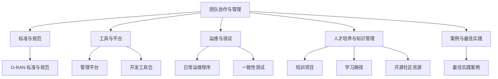
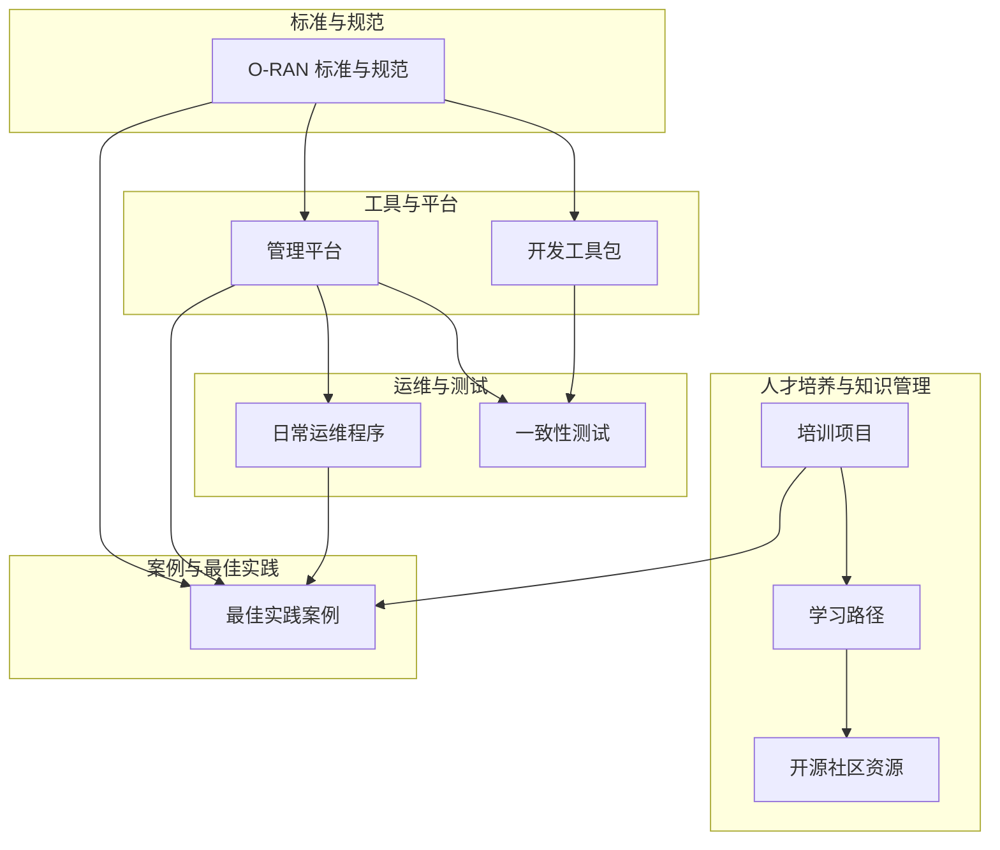
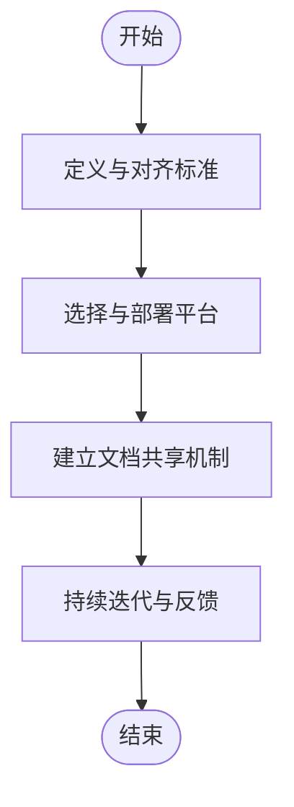
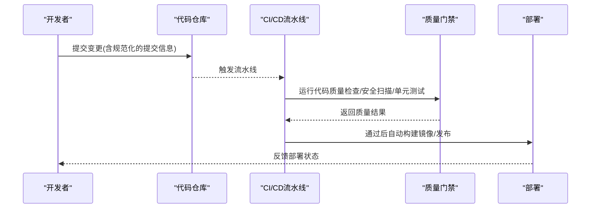
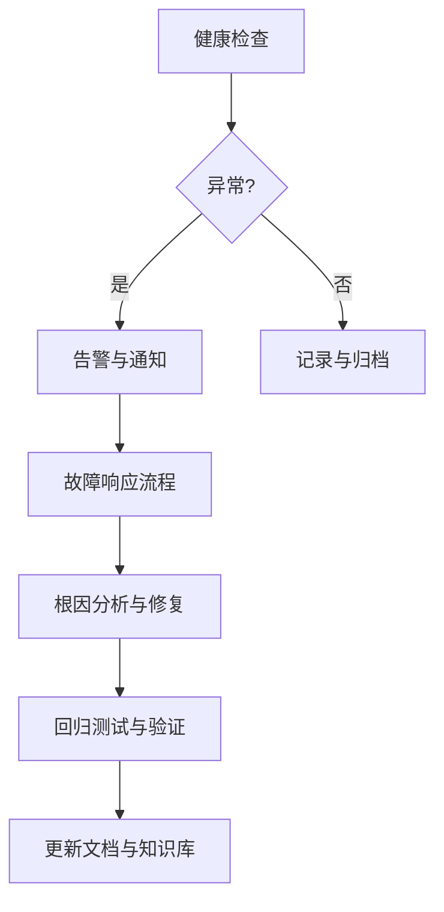
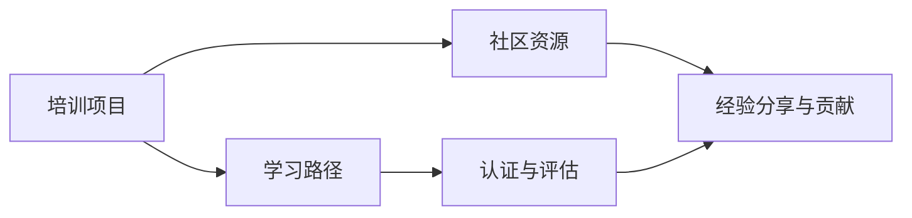
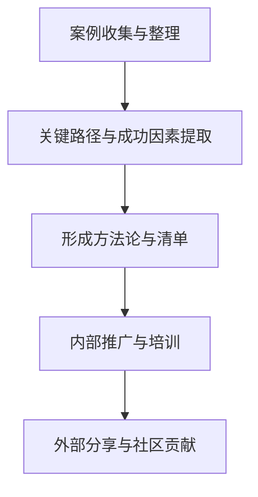
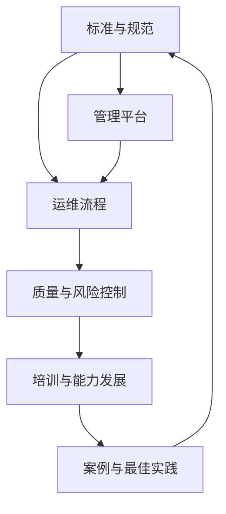

# 团队协作最佳实践

<cite>
**本文引用的文件**
- [O-RAN 培训项目](file://19-talent-development/training-programs/o-ran-training-framework.md)
- [O-RAN 学习路径](file://19-talent-development/learning-paths/o-ran-learning-roadmaps.md)
- [O-RAN 管理平台](file://22-tool-platforms/management-platforms/o-ran-management-platforms.md)
- [O-RAN 日常运维程序](file://14-operations-management/daily-operations/daily-operation-procedures.md)
- [O-RAN 开发工具包](file://22-tool-platforms/development-tools/o-ran-development-toolkit.md)
- [O-RAN 开源社区资源指南](file://17-open-source-ecosystem/community-resources/open-source-community-guide.md)
- [O-RAN 标准与规范](file://09-standards-compliance/readme.md)
- [O-RAN 最佳实践案例](file://21-case-studies/best-practices/o-ran-best-practice-cases.md)
- [O-RAN 一致性测试](file://13-testing-validation/conformance-testing/o-ran-conformance-testing.md)
</cite>

## 目录
1. [引言](#引言)
2. [项目结构](#项目结构)
3. [核心组件](#核心组件)
4. [架构总览](#架构总览)
5. [详细组件分析](#详细组件分析)
6. [依赖关系分析](#依赖关系分析)
7. [性能考量](#性能考量)
8. [故障排查指南](#故障排查指南)
9. [结论](#结论)
10. [附录](#附录)

## 引言
本文件面向O-RAN团队协作与管理，基于仓库中现有的标准规范、平台工具、运维流程与最佳实践案例，系统梳理团队在沟通协作、文档共享、代码审查与版本管理、持续改进、团队建设与知识管理等方面的最佳实践，并结合实际部署案例总结可复制的协作模式与管理方法，帮助建立高效协作的团队文化与工作机制。

## 项目结构
该仓库以主题域划分，涵盖架构设计、核心组件、接口标准、解耦选项、云原生集成、工作组职责、RIC开发、部署实施、标准合规、应用场景、学术论文、入门读物、安全隐私、测试验证、运营管理、未来规划、产业生态、成本效益、人才发展、生态合作、案例研究、工具平台、国际部署、可持续发展、法律法规、性能优化、故障诊断、监控告警、安全威胁、最佳实践等模块。这些模块共同构成O-RAN技术与工程实践的知识体系，为团队协作提供基础支撑。

**章节来源**
- [O-RAN 标准与规范](file://09-standards-compliance/readme.md#L1-L371)
- [O-RAN 管理平台](file://22-tool-platforms/management-platforms/o-ran-management-platforms.md#L1-L711)
- [O-RAN 日常运维程序](file://14-operations-management/daily-operations/daily-operation-procedures.md#L1-L443)
- [O-RAN 开发工具包](file://22-tool-platforms/development-tools/o-ran-development-toolkit.md#L1-L488)
- [O-RAN 培训项目](file://19-talent-development/training-programs/o-ran-training-framework.md#L1-L329)
- [O-RAN 学习路径](file://19-talent-development/learning-paths/o-ran-learning-roadmaps.md#L1-L297)
- [O-RAN 开源社区资源指南](file://17-open-source-ecosystem/community-resources/open-source-community-guide.md#L1-L494)
- [O-RAN 最佳实践案例](file://21-case-studies/best-practices/o-ran-best-practice-cases.md#L1-L210)
- [O-RAN 一致性测试](file://13-testing-validation/conformance-testing/o-ran-conformance-testing.md#L1-L67)

## 核心组件
围绕团队协作，本仓库提供了以下关键支撑：
- 标准与规范：明确O-RAN架构、接口、硬件、软件、安全与测试规范，确保跨团队与跨厂商协同遵循统一标准。
- 管理平台：提供网络管理、编排自动化、RIC管理与CI/CD等平台能力，支撑规模化运营与自动化交付。
- 运维与测试：提供日常健康检查、配置管理、变更流程、故障响应、性能监控与一致性测试等流程与工具。
- 人才培养与知识管理：提供系统化的培训课程、学习路径、认证体系与社区资源，保障团队能力持续提升。
- 案例与最佳实践：总结运营商与产业伙伴的成功经验，提炼可复用的方法论与协作模式。

**章节来源**
- [O-RAN 标准与规范](file://09-standards-compliance/readme.md#L1-L371)
- [O-RAN 管理平台](file://22-tool-platforms/management-platforms/o-ran-management-platforms.md#L1-L711)
- [O-RAN 日常运维程序](file://14-operations-management/daily-operations/daily-operation-procedures.md#L1-L443)
- [O-RAN 一致性测试](file://13-testing-validation/conformance-testing/o-ran-conformance-testing.md#L1-L67)
- [O-RAN 培训项目](file://19-talent-development/training-programs/o-ran-training-framework.md#L1-L329)
- [O-RAN 学习路径](file://19-talent-development/learning-paths/o-ran-learning-roadmaps.md#L1-L297)
- [O-RAN 开源社区资源指南](file://17-open-source-ecosystem/community-resources/open-source-community-guide.md#L1-L494)

## 架构总览
下图从“标准—平台—流程—能力—案例”的维度展示团队协作的总体架构，体现标准驱动、平台支撑、流程保障、能力培养与案例沉淀的闭环。

**图表来源**
- [O-RAN 标准与规范](file://09-standards-compliance/readme.md#L1-L371)
- [O-RAN 管理平台](file://22-tool-platforms/management-platforms/o-ran-management-platforms.md#L1-L711)
- [O-RAN 日常运维程序](file://14-operations-management/daily-operations/daily-operation-procedures.md#L1-L443)
- [O-RAN 开发工具包](file://22-tool-platforms/development-tools/o-ran-development-toolkit.md#L1-L488)
- [O-RAN 培训项目](file://19-talent-development/training-programs/o-ran-training-framework.md#L1-L329)
- [O-RAN 学习路径](file://19-talent-development/learning-paths/o-ran-learning-roadmaps.md#L1-L297)
- [O-RAN 开源社区资源指南](file://17-open-source-ecosystem/community-resources/open-source-community-guide.md#L1-L494)
- [O-RAN 最佳实践案例](file://21-case-studies/best-practices/o-ran-best-practice-cases.md#L1-L210)

## 详细组件分析

### 组件A：沟通协作与文档共享（标准与平台）
- 标准驱动：通过O-RAN标准与规范确保跨团队、跨厂商的接口一致与流程统一，降低沟通成本与集成风险。
- 平台支撑：管理平台提供集中化编排、自动化运维与可观测性，减少重复劳动，提升协作效率。
- 文档共享：以模块化文档形式沉淀知识，便于检索与复用；建议配合统一的文档索引与版本控制，确保信息一致性。

**章节来源**
- [O-RAN 标准与规范](file://09-standards-compliance/readme.md#L1-L371)
- [O-RAN 管理平台](file://22-tool-platforms/management-platforms/o-ran-management-platforms.md#L1-L711)

### 组件B：代码审查与版本管理（开发工具与流程）
- 版本控制：采用分支策略与提交规范，确保变更可追溯、可回滚。
- 代码质量：静态分析、安全扫描、覆盖率与合规检查贯穿开发流程。
- 自动化流水线：CI/CD自动触发测试与构建，减少人工干预，提高交付质量。

**图表来源**
- [O-RAN 开发工具包](file://22-tool-platforms/development-tools/o-ran-development-toolkit.md#L66-L109)

**章节来源**
- [O-RAN 开发工具包](file://22-tool-platforms/development-tools/o-ran-development-toolkit.md#L66-L109)

### 组件C：持续改进（运维流程与测试）
- 日常健康检查：自动化脚本定期巡检，异常快速告警。
- 变更管理：标准化变更请求、审批、实施与验证流程，降低风险。
- 故障响应：分级响应矩阵、故障手册与演练，缩短恢复时间。
- 一致性测试：按规范进行接口与功能一致性验证，确保质量基线。

**图表来源**
- [O-RAN 日常运维程序](file://14-operations-management/daily-operations/daily-operation-procedures.md#L8-L66)
- [O-RAN 一致性测试](file://13-testing-validation/conformance-testing/o-ran-conformance-testing.md#L1-L67)

**章节来源**
- [O-RAN 日常运维程序](file://14-operations-management/daily-operations/daily-operation-procedures.md#L1-L443)
- [O-RAN 一致性测试](file://13-testing-validation/conformance-testing/o-ran-conformance-testing.md#L1-L67)

### 组件D：团队建设与知识管理（培训与社区）
- 培训体系：分层次、分角色的培训课程与认证，覆盖战略、技术与实操。
- 学习路径：阶段性目标明确的学习路线，配套资源与评估机制。
- 社区参与：通过开源社区、论坛与会议促进知识共享与外部协作。

**图表来源**
- [O-RAN 培训项目](file://19-talent-development/training-programs/o-ran-training-framework.md#L1-L329)
- [O-RAN 学习路径](file://19-talent-development/learning-paths/o-ran-learning-roadmaps.md#L1-L297)
- [O-RAN 开源社区资源指南](file://17-open-source-ecosystem/community-resources/open-source-community-guide.md#L1-L494)

**章节来源**
- [O-RAN 培训项目](file://19-talent-development/training-programs/o-ran-training-framework.md#L1-L329)
- [O-RAN 学习路径](file://19-talent-development/learning-paths/o-ran-learning-roadmaps.md#L1-L297)
- [O-RAN 开源社区资源指南](file://17-open-source-ecosystem/community-resources/open-source-community-guide.md#L1-L494)

### 组件E：案例与最佳实践（可复制的协作模式）
- 案例拆解：从项目背景、实施路径到成果与教训，形成可复用的方法论。
- 关键因素：成功要素矩阵与推荐清单，帮助团队规避常见陷阱。
- 跨案例提炼：总结通用模式与关键成功因素，指导新项目启动与演进。

**图表来源**
- [O-RAN 最佳实践案例](file://21-case-studies/best-practices/o-ran-best-practice-cases.md#L1-L210)

**章节来源**
- [O-RAN 最佳实践案例](file://21-case-studies/best-practices/o-ran-best-practice-cases.md#L1-L210)

## 依赖关系分析
团队协作的依赖关系体现在“标准—平台—流程—能力—案例”之间的相互支撑与反馈：
- 标准为平台与流程提供约束与方向；
- 平台承载流程自动化与可观测性；
- 流程保障质量与风险控制；
- 能力（培训与社区）推动组织适应与创新；
- 案例沉淀为后续项目提供经验借鉴。

**图表来源**
- [O-RAN 标准与规范](file://09-standards-compliance/readme.md#L1-L371)
- [O-RAN 管理平台](file://22-tool-platforms/management-platforms/o-ran-management-platforms.md#L1-L711)
- [O-RAN 日常运维程序](file://14-operations-management/daily-operations/daily-operation-procedures.md#L1-L443)
- [O-RAN 培训项目](file://19-talent-development/training-programs/o-ran-training-framework.md#L1-L329)
- [O-RAN 最佳实践案例](file://21-case-studies/best-practices/o-ran-best-practice-cases.md#L1-L210)

**章节来源**
- [O-RAN 标准与规范](file://09-standards-compliance/readme.md#L1-L371)
- [O-RAN 管理平台](file://22-tool-platforms/management-platforms/o-ran-management-platforms.md#L1-L711)
- [O-RAN 日常运维程序](file://14-operations-management/daily-operations/daily-operation-procedures.md#L1-L443)
- [O-RAN 培训项目](file://19-talent-development/training-programs/o-ran-training-framework.md#L1-L329)
- [O-RAN 最佳实践案例](file://21-case-studies/best-practices/o-ran-best-practice-cases.md#L1-L210)

## 性能考量
- 标准一致性：严格遵循标准可降低集成与测试成本，提升整体性能与稳定性。
- 平台自动化：通过自动化编排与CI/CD减少人为错误，提升交付效率与质量。
- 运维监控：建立KPI仪表盘与告警规则，及时发现性能瓶颈并优化。
- 能力发展：持续培训与认证提升团队技术水平，支撑复杂场景下的性能优化。

[本节为通用指导，无需特定文件来源]

## 故障排查指南
- 健康检查：使用脚本或工具定期巡检核心组件状态，异常时立即告警。
- 网络监控：关注接口带宽利用率、延迟与丢包率，定位网络问题。
- 配置备份与变更：严格执行备份与变更流程，必要时快速回滚。
- 故障响应：依据严重级别与升级矩阵快速响应，使用故障手册与演练提升处置效率。
- 一致性测试：在修复后进行一致性测试，确保接口与功能符合规范。

**章节来源**
- [O-RAN 日常运维程序](file://14-operations-management/daily-operations/daily-operation-procedures.md#L1-L443)
- [O-RAN 一致性测试](file://13-testing-validation/conformance-testing/o-ran-conformance-testing.md#L1-L67)

## 结论
通过标准驱动、平台支撑、流程保障、能力培养与案例沉淀的闭环，O-RAN团队可以建立起高效协作的文化与机制。建议优先落实标准化与平台化，再以流程与测试固化质量基线，同时通过培训与社区建设持续提升团队能力，并以案例复用加速新项目的成功落地。

[本节为总结性内容，无需特定文件来源]

## 附录
- 推荐阅读顺序：先通读标准与规范，再学习管理平台与开发工具，最后结合运维流程与案例实践。
- 工具与平台清单：管理平台、开发工具包、运维脚本、测试框架、社区资源与认证体系。
- 关键检查点：标准对齐、平台可用性、流程执行、质量门禁、变更与回滚、故障响应与复盘、知识沉淀与分享。

[本节为补充说明，无需特定文件来源]