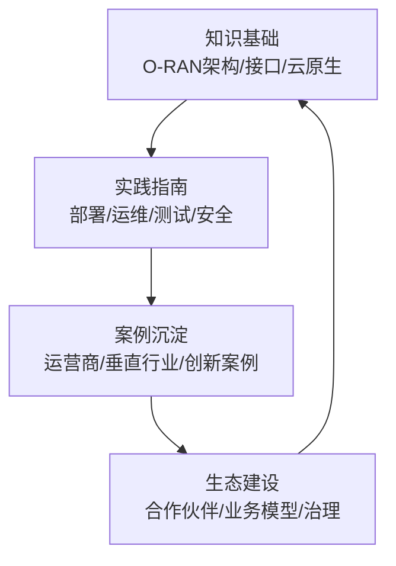
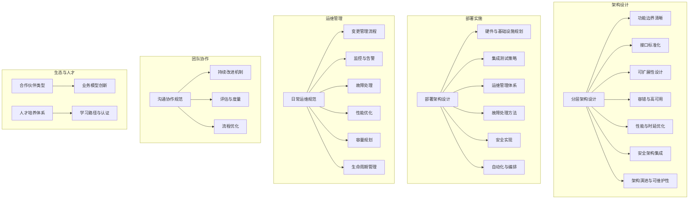
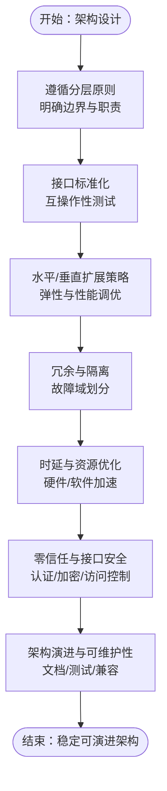
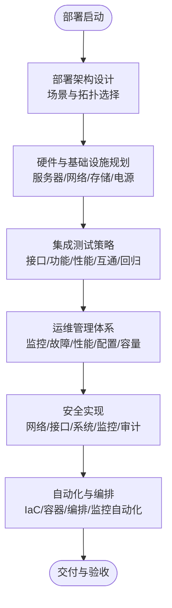
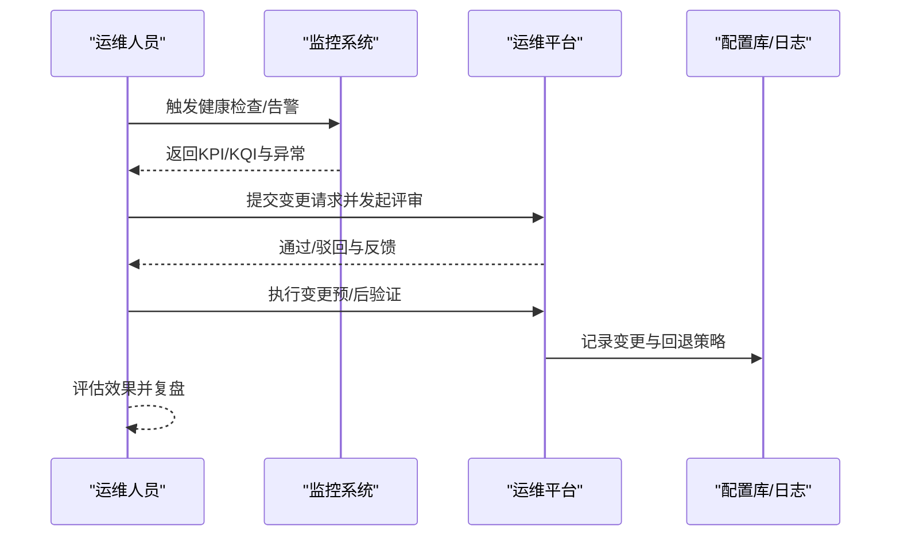
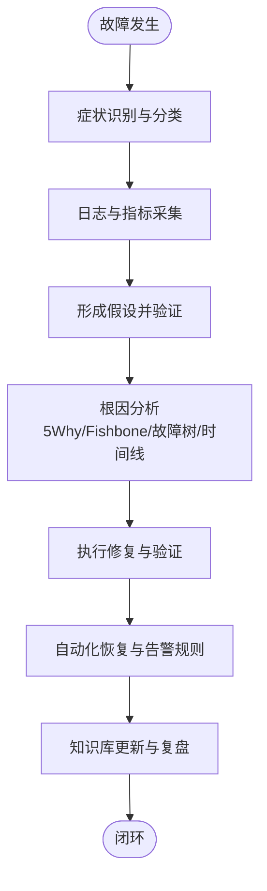
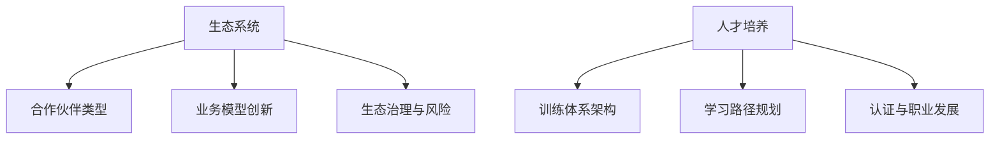
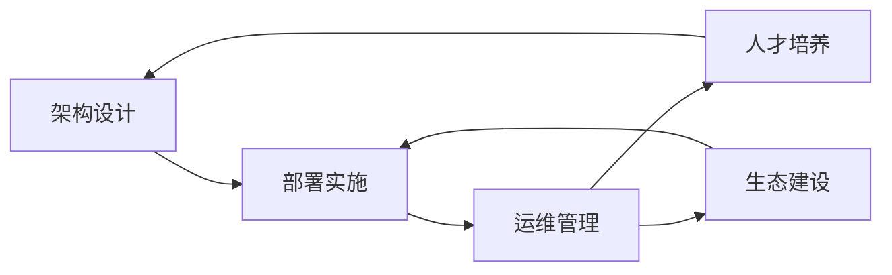

# 最佳实践

<cite>
**本文引用的文件**
- [最佳实践汇总](file://30-best-practices/readme.md)
- [最佳实践汇总（中文）](file://30-best-practices/readme-zh.md)
- [架构设计最佳实践](file://30-best-practices/architecture-practices/architecture-design-best-practices.md)
- [O-RAN 基础知识](file://01-architecture-system/readme.md)
- [部署实施](file://08-deployment-implementation/readme.md)
- [运维与管理](file://14-operations-management/readme.md)
- [日常运维规范](file://14-operations-management/daily-operations/daily-operation-procedures.md)
- [故障处理指南](file://14-operations-management/fault-handling/fault-troubleshooting-guide.md)
- [案例研究](file://21-case-studies/readme.md)
- [最佳实践案例](file://21-case-studies/best-practices/o-ran-best-practice-cases.md)
- [人才培养](file://19-talent-development/readme.md)
- [培训框架](file://19-talent-development/training-programs/o-ran-training-framework.md)
- [学习路径](file://19-talent-development/learning-paths/o-ran-learning-roadmaps.md)
- [生态系统与合作](file://20-ecosystem-partnership/readme.md)
- [生态系统战略](file://20-ecosystem-partnership/ecosystem-strategy/o-ran-ecosystem-strategy.md)
</cite>

## 目录
1. [引言](#引言)
2. [项目结构](#项目结构)
3. [核心组件](#核心组件)
4. [架构总览](#架构总览)
5. [详细组件分析](#详细组件分析)
6. [依赖关系分析](#依赖关系分析)
7. [性能考量](#性能考量)
8. [故障排查指南](#故障排查指南)
9. [结论](#结论)
10. [附录](#附录)

## 引言
本文件面向O-RAN最佳实践的系统化总结与推广，围绕架构设计、部署实施、运维管理、团队协作与生态建设五大维度，结合仓库中的权威文档，形成可落地、可复制、可持续改进的实践指南。内容既覆盖高层策略与标准，也包含一线操作与故障处理方法，帮助组织在技术选型、工程实施、运营优化与人才发展等方面建立成熟体系。

## 项目结构
本仓库以主题域划分，形成“知识—实践—案例—生态”的有机闭环：
- 知识基础：O-RAN架构、接口、云原生等基础知识
- 实践指南：部署、运维、测试、安全等实施标准
- 案例沉淀：运营商与垂直行业成功经验与失败教训
- 生态建设：合作伙伴类型、商业模式与组织治理

## 核心组件
- 架构设计最佳实践：分层架构、接口标准化、可扩展性、容错与高可用、性能与时延优化、安全架构、架构演进与可维护性
- 部署实施最佳实践：部署架构设计、硬件与基础设施规划、集成测试策略、运维管理体系、故障处理方法、安全实现、自动化与编排
- 运维管理最佳实践：日常运维规范、变更管理流程、监控与告警、故障处理、性能优化、容量规划、生命周期管理
- 团队协作最佳实践：沟通协作规范、持续改进机制、评估与度量、流程优化
- 生态与人才：合作伙伴分类、业务模型创新、人才培养体系、学习路径与认证

**章节来源**
- file://30-best-practices/readme-zh.md#L1-L113
- file://30-best-practices/readme.md#L1-L113
- file://30-best-practices/architecture-practices/architecture-design-best-practices.md#L1-L300
- file://08-deployment-implementation/readme.md#L1-L353
- file://14-operations-management/readme.md#L1-L126

## 架构总览
下图展示O-RAN关键组件与其最佳实践要点之间的映射关系，帮助在设计阶段即融入标准与约束。

**图表来源**
- file://30-best-practices/architecture-practices/architecture-design-best-practices.md#L6-L300
- file://08-deployment-implementation/readme.md#L8-L196
- file://14-operations-management/readme.md#L6-L126
- file://20-ecosystem-partnership/readme.md#L26-L64
- file://19-talent-development/readme.md#L6-L71

## 详细组件分析

### 架构设计最佳实践
- 分层架构设计：严格遵循参考架构分层原则，明确CU/DU/RU职责边界，采用标准化接口协议，兼顾未来扩展性与兼容性；避免功能耦合、接口私有化、忽视性能与冗余设计等陷阱
- 接口标准化：E2/A1/O1等接口协议与服务模型，强调互操作性测试、接口文档标准化与版本兼容性
- 可扩展性：无状态设计、数据库分片、微服务拆分与API网关统一入口；垂直扩展的自动扩缩容、性能调优与渐进式架构升级
- 容错与高可用：硬件/软件/地理多层冗余，微服务/网络/数据隔离，故障域划分与快速恢复
- 性能与时延优化：DPDK、SR-IOV、FPGA、智能网卡卸载等硬件加速，用户态协议栈、零拷贝、NUMA感知调度等软件优化，边缘计算与短路径优化
- 安全架构：零信任模型、分层防护与安全监控，接口安全机制（认证、数据保护、访问控制）
- 架构演进与可维护性：模块化设计、完备文档、可测试性与向后兼容

**图表来源**
- file://30-best-practices/architecture-practices/architecture-design-best-practices.md#L6-L300

**章节来源**
- file://30-best-practices/architecture-practices/architecture-design-best-practices.md#L6-L300
- file://30-best-practices/readme-zh.md#L6-L28

### 部署实施最佳实践
- 部署架构设计：集中式、分布式、混合式、边缘式、多云式部署策略，强调拓扑优化、带宽与时延预算、跨站点一致性与协同
- 硬件与基础设施：服务器（CPU/内存/存储/网卡）、网络设备（交换/路由/防火墙）、存储与供电冷却规划
- 集成测试：接口（E2/A1/O1/O-FH/F1）、功能、性能、互通与回归测试，CI/CD与自动化
- 运维管理：监控（Prometheus/Grafana）、故障管理（自动检测/隔离/恢复/根因分析/预防）、性能管理（KPI/KQI、容量预测与优化）、配置管理（CMDB/版本控制/自动化/审计）
- 故障处理：问题定义、信息收集、假设验证、根因分析（5 Why/Fishbone/故障树/时间线/关联分析）、标准作业流程（SOP）
- 安全实现：网络分段、访问控制、加密传输、DDoS防护、接口认证授权、系统加固、容器与应用安全、安全监控与合规审计
- 自动化与编排：IaC（Terraform/Ansible）、容器编排（Kubernetes/Helm）、GitOps（ArgoCD）、监控自动化（Prometheus Operator）

**图表来源**
- file://08-deployment-implementation/readme.md#L8-L196

**章节来源**
- file://08-deployment-implementation/readme.md#L1-L353
- file://30-best-practices/readme-zh.md#L29-L85

### 运维管理最佳实践
- 日常运维：系统健康检查、配置变更流程、软件升级、补丁与安全更新、备份与恢复
- 变更管理：变更申请、方案评审、测试验证、分批实施、效果评估与回退
- 监控与告警：实时监控、阈值设定、异常检测、分级告警与通知、根因分析工具
- 故障处理：快速定位、应急响应、恢复与复盘、知识库建设
- 性能优化：网络/计算/存储优化策略与参数调优
- 容量规划：负载预测、可扩展性设计、成本优化与资源利用率提升
- 生命周期管理：设计/部署/运行/维护/退役全周期管理，配置版本控制与回滚机制，文档与知识传承

**图表来源**
- file://14-operations-management/daily-operations/daily-operation-procedures.md#L219-L281
- file://14-operations-management/readme.md#L6-L126

**章节来源**
- file://14-operations-management/readme.md#L1-L126
- file://14-operations-management/daily-operations/daily-operation-procedures.md#L1-L443

### 故障排查指南
- 故障分类：网络功能、接口协议、基础设施与平台、性能与可用性、配置与兼容性
- 诊断方法：系统化故障诊断流程、日志分析、根因分析框架（依赖图/相关性矩阵/时间序列聚类）
- 工具链：网络抓包与分析（tcpdump/tshark）、系统资源监控（CPU/内存/磁盘/网络）、性能分析（perf/火焰图）
- 典型场景：E2接口连接建立失败、F1接口吞吐与时延问题、O-FH同步与时钟对齐问题
- 预防与自愈：主动监控、预测性分析、自动化恢复脚本与分级告警

**图表来源**
- file://14-operations-management/fault-handling/fault-troubleshooting-guide.md#L31-L180

**章节来源**
- file://14-operations-management/fault-handling/fault-troubleshooting-guide.md#L1-L633

### 团队协作最佳实践
- 沟通协作：每日站会、文档共享、代码评审、版本管理
- 持续改进：回顾总结、指标监控、技术创新、流程优化
- 评估与度量：关键绩效指标、质量测量、技术成熟度评估
- 流程优化：效率提升、成本控制、标准化与自动化

**章节来源**
- file://30-best-practices/readme-zh.md#L101-L113
- file://30-best-practices/readme.md#L101-L113

### 生态与人才最佳实践
- 合作伙伴类型：战略伙伴（技术/产业/学术/国际）、业务伙伴（渠道/技术/服务/投资）
- 业务模型：Servitization（NaaS/SlaaS/PaaS/AaaS）与开放生态（平台/商店/社区/联盟）
- 生态建设：开放合作原则（技术/市场/治理开放）、价值共创（分工协作/共享收益/可持续发展）
- 人才培养：训练体系架构（基础/专业/高级）、认证体系、学习路径规划、职业发展通道
- 学习路径：网络工程师、RIC开发者、安全专家、云基础设施、无线电优化等角色路径
- 培训框架：企业内训、专题模块、大学合作、定制化方案、效果评估与资源投入

**图表来源**
- file://20-ecosystem-partnership/readme.md#L26-L64
- file://20-ecosystem-partnership/ecosystem-strategy/o-ran-ecosystem-strategy.md#L50-L189
- file://19-talent-development/readme.md#L6-L71
- file://19-talent-development/training-programs/o-ran-training-framework.md#L1-L329
- file://19-talent-development/learning-paths/o-ran-learning-roadmaps.md#L1-L297

**章节来源**
- file://20-ecosystem-partnership/readme.md#L1-L64
- file://20-ecosystem-partnership/ecosystem-strategy/o-ran-ecosystem-strategy.md#L1-L189
- file://19-talent-development/readme.md#L1-L71
- file://19-talent-development/training-programs/o-ran-training-framework.md#L1-L329
- file://19-talent-development/learning-paths/o-ran-learning-roadmaps.md#L1-L297

### 成功案例与失败教训
- 成功案例：欧洲运营商大规模商用部署、日韩绿地云原生网络、美企边缘计算融合、运营商农村覆盖扩展
- 关键成功因素：明确业务目标、技术选型成熟、资源投入保障、有效项目管理、持续优化改进
- 常见挑战与对策：技术复杂性（分阶段、专家支持）、成本控制（预算与ROI）、人员能力（培训与招聘）、集成难度（标准化与兼容测试）、运维转型（自动化与流程重塑）
- 失败案例分析：架构设计缺陷、接口兼容性差、安全漏洞、性能不达标、需求不清、资源不足、项目管理混乱、组织变革阻力

**章节来源**
- file://21-case-studies/readme.md#L1-L74
- file://21-case-studies/best-practices/o-ran-best-practice-cases.md#L1-L210

## 依赖关系分析
- 组件耦合与协作：架构设计决定部署策略与运维复杂度；部署质量直接影响故障频率与恢复效率；运维流程与工具支撑自动化与安全；人才与生态为持续改进提供组织保障
- 外部依赖：O-RAN联盟标准、3GPP规范、ETSI标准、开源社区与工具链
- 风险点：接口互操作性、安全合规、性能基线、变更回退、人员技能缺口

**图表来源**
- file://30-best-practices/architecture-practices/architecture-design-best-practices.md#L6-L300
- file://08-deployment-implementation/readme.md#L1-L353
- file://14-operations-management/readme.md#L1-L126
- file://19-talent-development/readme.md#L1-L71
- file://20-ecosystem-partnership/readme.md#L1-L64

**章节来源**
- file://30-best-practices/architecture-practices/architecture-design-best-practices.md#L1-L300
- file://08-deployment-implementation/readme.md#L1-L353
- file://14-operations-management/readme.md#L1-L126
- file://19-talent-development/readme.md#L1-L71
- file://20-ecosystem-partnership/readme.md#L1-L64

## 性能考量
- 时延敏感设计：DPDK、SR-IOV、FPGA、智能网卡卸载、用户态协议栈、零拷贝、NUMA感知调度
- 资源效率：大页内存、内存池、缓存预热、带宽动态分配、QoS策略、网络切片
- 测试与基线：端到端时延、吞吐、抖动、丢包率、稳定性与压力测试，建立性能基线与回归测试

**章节来源**
- file://30-best-practices/architecture-practices/architecture-design-best-practices.md#L164-L208
- file://08-deployment-implementation/readme.md#L75-L86

## 故障排查指南
- 快速定位：分层排查、对比分析、替换验证、日志关联分析
- 知识管理：故障案例库、经验分享机制、文档标准化、培训体系
- 工具与流程：Wireshark/tcpdump、Prometheus/Grafana、ELK/Splunk、5WHY/Fishbone/FT/时间线/关联分析

**章节来源**
- file://30-best-practices/readme-zh.md#L87-L100
- file://14-operations-management/fault-handling/fault-troubleshooting-guide.md#L1-L633

## 结论
通过将架构设计、部署实施、运维管理、团队协作与生态建设系统化整合，组织可在O-RAN实践中形成“设计—实施—运行—优化—演进”的闭环能力。建议以标准为纲、以流程为基、以工具为器、以人才为本、以生态为要，持续迭代最佳实践，推动组织在技术先进性、工程可靠性与商业价值之间取得平衡。

## 附录
- 术语与参考：O-RAN参考架构、接口标准（E2/A1/O1/O-FH/F1）、云原生与容器编排、监控与可观测性、安全与合规、自动化与DevOps
- 评估与改进：KPI/KQI、变更成功率、MTTR/MTBF、培训效果与认证通过率、生态伙伴数量与收入规模、客户满意度与NPS