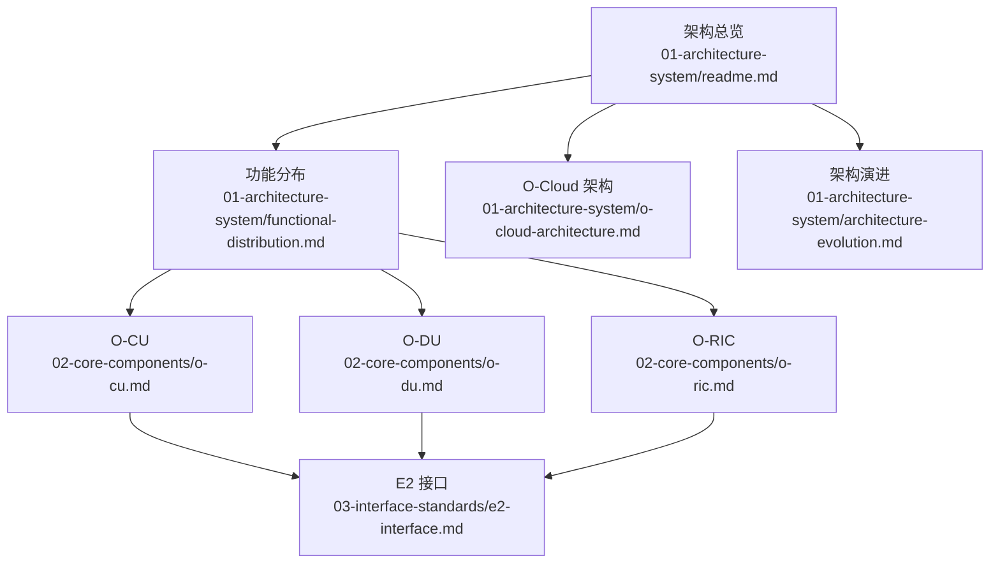
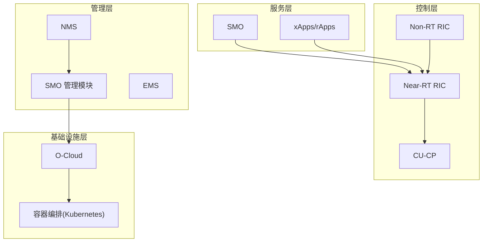
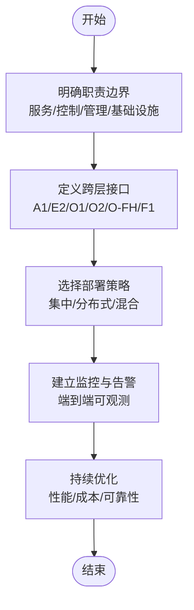
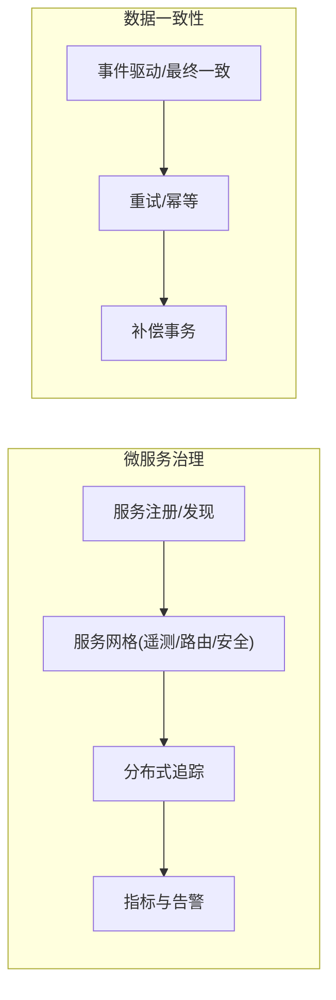
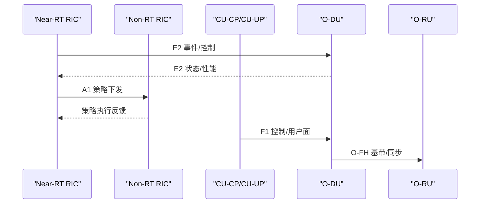
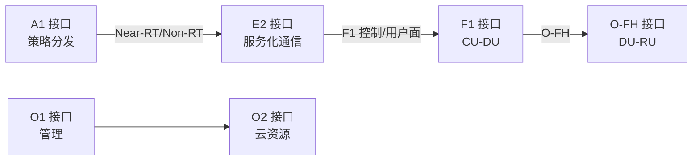
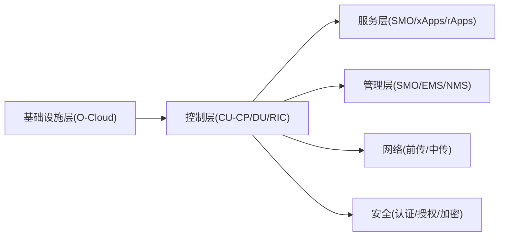

# 架构设计最佳实践

<cite>
**本文引用的文件**
- [O-RAN 基础知识](file://01-architecture-system/readme.md)
- [功能分布](file://01-architecture-system/functional-distribution.md)
- [O-Cloud 架构](file://01-architecture-system/o-cloud-architecture.md)
- [架构演进](file://01-architecture-system/architecture-evolution.md)
- [集中式单元 O-CU](file://02-core-components/o-cu.md)
- [分布式单元 O-DU](file://02-core-components/o-du.md)
- [RAN 智能控制器 O-RIC](file://02-core-components/o-ric.md)
- [E2 接口](file://03-interface-standards/e2-interface.md)
</cite>

## 目录
1. [引言](#引言)
2. [项目结构](#项目结构)
3. [核心组件](#核心组件)
4. [架构总览](#架构总览)
5. [详细组件分析](#详细组件分析)
6. [依赖分析](#依赖分析)
7. [性能考虑](#性能考虑)
8. [故障排查指南](#故障排查指南)
9. [结论](#结论)
10. [附录](#附录)

## 引言
本文件面向云平台运维与网络工程人员，系统化梳理 O-RAN 参考架构的设计理念与最佳实践，围绕分层架构、CU/DU/RU 功能边界、微服务在 O-RAN 中的应用、接口标准化、性能与容错、可扩展性与监控运维等方面，提供可落地的实施指南与案例启示，帮助读者建立正确的架构设计思维与实践方法。

## 项目结构
本仓库以主题域组织 O-RAN 知识体系，涵盖架构演进、功能分布、核心组件、接口标准、云原生与运维等关键领域。本文重点引用如下文件：
- 架构总览与工作分组：01-architecture-system/readme.md
- 分层与功能分布：01-architecture-system/functional-distribution.md
- O-Cloud 基础设施：01-architecture-system/o-cloud-architecture.md
- 架构演进与挑战：01-architecture-system/architecture-evolution.md
- 核心网元：O-CU、O-DU、O-RIC
- 关键接口：E2 接口

**图示来源**
- [O-RAN 基础知识](file://01-architecture-system/readme.md#L1-L161)
- [功能分布](file://01-architecture-system/functional-distribution.md#L1-L325)
- [O-Cloud 架构](file://01-architecture-system/o-cloud-architecture.md#L1-L238)
- [架构演进](file://01-architecture-system/architecture-evolution.md#L1-L183)
- [集中式单元 O-CU](file://02-core-components/o-cu.md#L1-L419)
- [分布式单元 O-DU](file://02-core-components/o-du.md#L1-L415)
- [RAN 智能控制器 O-RIC](file://02-core-components/o-ric.md#L1-L437)
- [E2 接口](file://03-interface-standards/e2-interface.md#L1-L337)

**章节来源**
- [O-RAN 基础知识](file://01-architecture-system/readme.md#L1-L161)

## 核心组件
- 服务层：面向网络服务生命周期管理、服务编排与暴露，典型实体为 SMO 与应用层（xApps/rApps），通过 A1 接口与控制层交互，通过 O1/O2 接口与基础设施层交互。
- 控制层：负责网络控制、策略管理、资源调度与故障处理，典型实体为 Near-RT RIC（毫秒级）、Non-RT RIC（秒至分钟级）、CU-CP（RRC/NG 控制面）等。
- 管理层：负责配置、故障、性能、安全与资产管理，典型实体为 SMO 管理模块、EMS/NMS 与安全管理系统。
- 基础设施层：O-Cloud 提供计算、存储、网络与容器编排能力，支撑上层功能弹性与可靠性。

**章节来源**
- [功能分布](file://01-architecture-system/functional-distribution.md#L1-L325)
- [O-Cloud 架构](file://01-architecture-system/o-cloud-architecture.md#L1-L238)

## 架构总览
O-RAN 以“服务-控制-管理-基础设施”四层解耦为核心，配合开放接口（E2/A1/O1/O2）与云原生能力，实现灵活部署、智能优化与高效运维。架构演进强调从传统封闭 RAN 向开放、智能、虚拟化的方向转变。

**图示来源**
- [O-RAN 基础知识](file://01-architecture-system/readme.md#L8-L34)
- [功能分布](file://01-architecture-system/functional-distribution.md#L34-L136)
- [O-Cloud 架构](file://01-architecture-system/o-cloud-architecture.md#L9-L30)

**章节来源**
- [O-RAN 基础知识](file://01-architecture-system/readme.md#L8-L34)
- [架构演进](file://01-architecture-system/architecture-evolution.md#L39-L74)

## 详细组件分析

### 分层与功能边界最佳实践
- 服务层：聚焦业务与服务编排，不直接管理资源；通过标准化接口向上反馈状态与结果。
- 控制层：聚焦实时控制与策略执行，承担 CU/DU/RIC 的控制面职责，确保低延迟闭环。
- 管理层：聚焦配置、监控与维护，保障全生命周期管理与合规。
- 基础设施层：提供虚拟化、容器化与自动化能力，支撑弹性与高可用。

**图示来源**
- [功能分布](file://01-architecture-system/functional-distribution.md#L197-L246)
- [O-Cloud 架构](file://01-architecture-system/o-cloud-architecture.md#L142-L194)

**章节来源**
- [功能分布](file://01-architecture-system/functional-distribution.md#L197-L246)

### 微服务在 O-RAN 中的应用
- 服务分解原则：按控制面/用户面、近实时/非实时、策略/执行等维度拆分，确保高内聚、低耦合。
- 服务治理策略：容器化与编排、服务网格、服务发现与注册、限流熔断与降级、灰度发布与回滚。
- 数据一致性：通过事件驱动与最终一致模型，结合补偿事务与重试机制；对强一致需求采用分布式锁或两阶段提交（谨慎使用）。
- 监控运维：Prometheus/Grafana、分布式追踪、日志聚合、告警分级与自动化处置。

**图示来源**
- [O-RIC](file://02-core-components/o-ric.md#L77-L116)
- [O-Cloud 架构](file://01-architecture-system/o-cloud-architecture.md#L151-L171)

**章节来源**
- [O-RIC](file://02-core-components/o-ric.md#L77-L116)
- [O-Cloud 架构](file://01-architecture-system/o-cloud-architecture.md#L151-L171)

### CU/DU/RU 功能边界与实施要点
- O-CU：控制面（CU-CP）与用户面（CU-UP）分离，支持集中/分布式/混合部署；关注 NG/F1/E1 接口与 QoS/容量规划。
- O-DU：物理层与 MAC 层处理，对实时性与同步要求高；关注前传/中传网络、PTP 同步与边缘部署。
- O-RIC：Near-RT（毫秒级）与 Non-RT（秒至分钟级）协同；关注 xApps/rApps 生命周期与策略分发。

**图示来源**
- [E2 接口](file://03-interface-standards/e2-interface.md#L74-L89)
- [集中式单元 O-CU](file://02-core-components/o-cu.md#L101-L121)
- [分布式单元 O-DU](file://02-core-components/o-du.md#L68-L86)
- [RAN 智能控制器 O-RIC](file://02-core-components/o-ric.md#L59-L72)

**章节来源**
- [集中式单元 O-CU](file://02-core-components/o-cu.md#L49-L121)
- [分布式单元 O-DU](file://02-core-components/o-du.md#L51-L86)
- [RAN 智能控制器 O-RIC](file://02-core-components/o-ric.md#L59-L72)

### 接口标准化与跨层交互
- E2 接口：基于 SCTP/STREAMS 的服务化接口，支持订阅/通知/调用；强调低延迟与可靠性。
- A1 接口：Near-RT 与 Non-RT RIC 之间的策略管理接口。
- O1/O2：SMO 与网络元素/云资源的管理接口。
- O-FH/F1：DU 与 RU 的前传接口与 CU-DU 控制/用户面接口。

**图示来源**
- [O-RAN 基础知识](file://01-architecture-system/readme.md#L27-L34)
- [E2 接口](file://03-interface-standards/e2-interface.md#L33-L62)

**章节来源**
- [O-RAN 基础知识](file://01-architecture-system/readme.md#L27-L34)
- [E2 接口](file://03-interface-standards/e2-interface.md#L90-L130)

### 性能、容错与可扩展性规划
- 性能：针对实时性（毫秒级）与吞吐量（用户面）分别优化；结合 SR-IOV/DPDK、NUMA/亲和、存储分层与网络 QoS。
- 容错：硬件冗余、软件冗余与自动故障转移；严格的配置基线与回滚机制。
- 可扩展：水平扩展（Kubernetes 自动扩缩容）、垂直扩展与模块化设计；容量预测与动态资源调整。

**章节来源**
- [O-Cloud 架构](file://01-architecture-system/o-cloud-architecture.md#L41-L115)
- [集中式单元 O-CU](file://02-core-components/o-cu.md#L180-L196)
- [分布式单元 O-DU](file://02-core-components/o-du.md#L207-L223)

### 监控运维与自动化
- 监控：端到端覆盖（接口、服务、资源、应用），设置分级告警与关联分析。
- 自动化：CI/CD、GitOps、自动化测试与故障恢复、容量与性能优化流程。
- 灾备：异地备份、灾难恢复演练与快速恢复能力。

**章节来源**
- [O-Cloud 架构](file://01-architecture-system/o-cloud-architecture.md#L151-L194)
- [集中式单元 O-CU](file://02-core-components/o-cu.md#L197-L321)
- [分布式单元 O-DU](file://02-core-components/o-du.md#L224-L350)
- [RAN 智能控制器 O-RIC](file://02-core-components/o-ric.md#L214-L362)

## 依赖分析
- 层间依赖：服务层依赖控制层策略与能力，控制层依赖管理层配置与资源，基础设施层提供计算/存储/网络与编排能力。
- 组件间依赖：O-CU 与 O-DU 通过 F1 接口耦合，O-DU 与 O-RU 通过 O-FH 接口耦合，O-RIC 通过 E2 接口与 CU/DU 交互，Non-RT RIC 通过 A1 接口与 Near-RT RIC 协作。
- 外部依赖：标准协议（SCTP/STREAMS/PTP）、云原生技术栈（Kubernetes、服务网格、监控）。

**图示来源**
- [功能分布](file://01-architecture-system/functional-distribution.md#L197-L246)
- [O-Cloud 架构](file://01-architecture-system/o-cloud-architecture.md#L9-L30)

**章节来源**
- [功能分布](file://01-architecture-system/functional-distribution.md#L197-L246)
- [O-Cloud 架构](file://01-architecture-system/o-cloud-architecture.md#L9-L30)

## 性能考虑
- 实时性保障：Near-RT RIC 与 O-DU 的毫秒级闭环，需结合网络拓扑优化、SCTP 参数与多路径、硬件直通与 DPDK。
- 吞吐量优化：CU-UP 用户面加速、负载均衡与 QoS，结合存储分层与网络带宽规划。
- 同步精度：PTP v2 部署与测试，边界/透明时钟模式优化，同步冗余与恢复。
- 资源池化与弹性：容器编排与自动扩缩容，结合容量预测与动态调度。

**章节来源**
- [E2 接口](file://03-interface-standards/e2-interface.md#L131-L147)
- [分布式单元 O-DU](file://02-core-components/o-du.md#L51-L67)
- [O-Cloud 架构](file://01-architecture-system/o-cloud-architecture.md#L41-L63)

## 故障排查指南
- 告警分级与关联：基于严重程度与影响面进行分级，结合关联分析定位根因。
- 常见故障类型：接口断连、性能劣化、配置错误、资源不足、同步异常、应用崩溃。
- 处置流程：告警确认→根因分析→处置执行→验证恢复→复盘总结。
- 预防与演练：健康检查、预防性维护、定期故障演练与预案更新。

**章节来源**
- [集中式单元 O-CU](file://02-core-components/o-cu.md#L244-L282)
- [分布式单元 O-DU](file://02-core-components/o-du.md#L268-L288)
- [RAN 智能控制器 O-RIC](file://02-core-components/o-ric.md#L261-L282)

## 结论
O-RAN 以分层解耦与开放接口为基础，结合云原生与智能控制，为运营商提供灵活、高效、可扩展的无线接入网络。通过明确的功能边界、微服务化治理、标准化接口与全栈监控运维，可在保证实时性与可靠性的前提下，实现业务敏捷与成本优化。建议以渐进式部署与标准化兼容为抓手，持续迭代优化，构建面向未来的网络能力。

## 附录
- 案例参考：运营商 O-RAN 试点与融合部署，验证成本降低、功能上线效率提升与性能达标。
- 未来方向：6G 演进、边缘计算融合、网络切片增强与绿色低碳。

**章节来源**
- [架构演进](file://01-architecture-system/architecture-evolution.md#L150-L178)