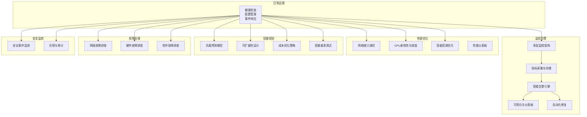
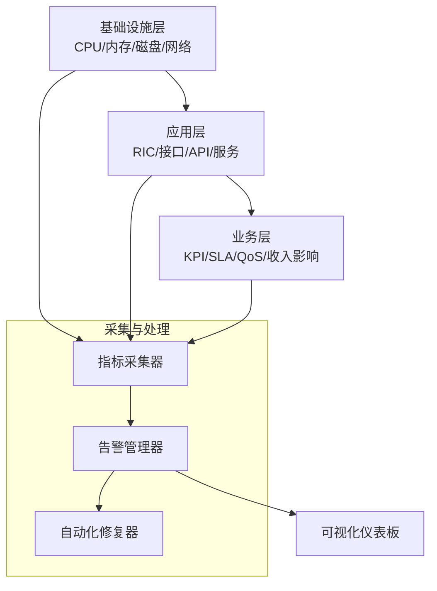
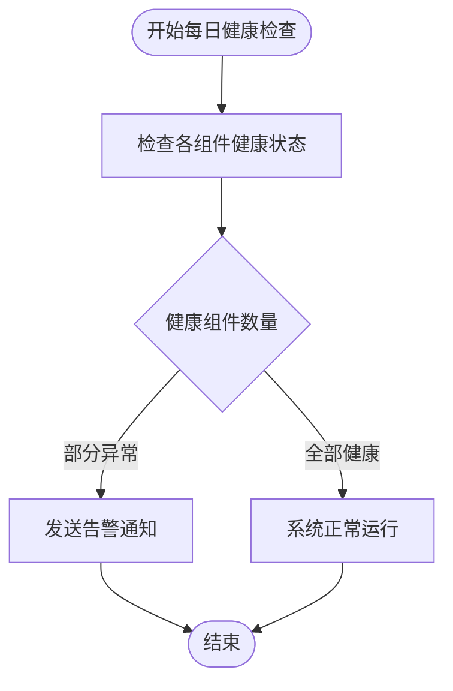
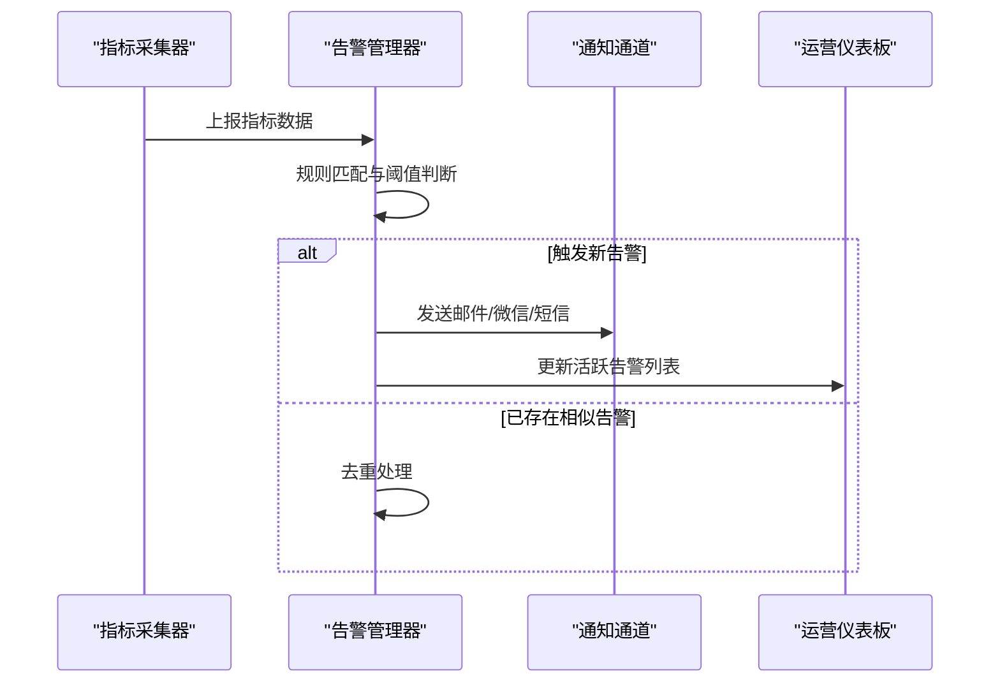
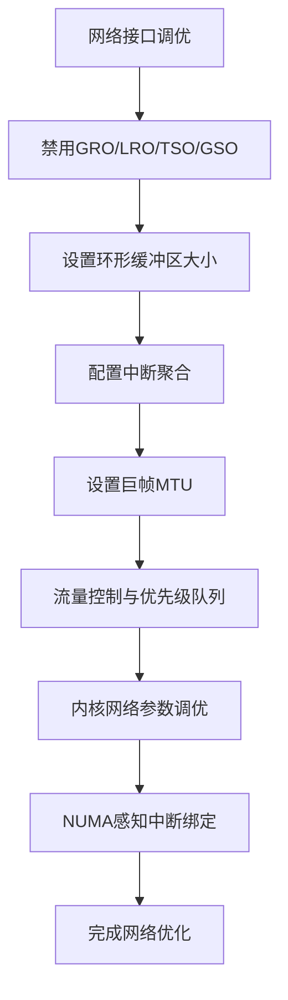
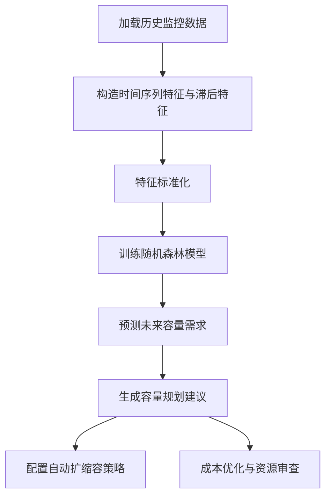
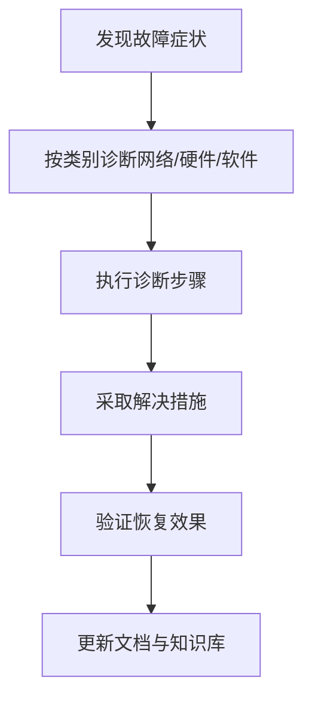
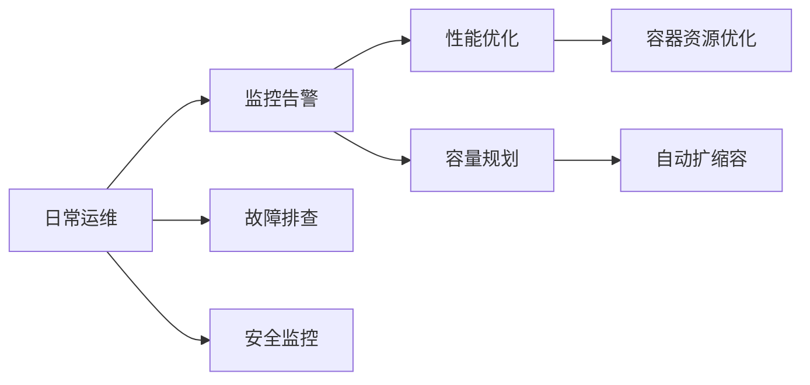

# 运维管理最佳实践

<cite>
**本文引用的文件**
- [O-RAN 日常运维程序](file://14-operations-management/daily-operations/daily-operation-procedures-zh.md)
- [O-RAN 运营监控告警系统](file://14-operations-management/monitoring-alerting/operations-monitoring-framework-zh.md)
- [O-RAN 性能优化框架](file://14-operations-management/performance-optimization/performance-optimization-framework-zh.md)
- [O-RAN 容量规划框架](file://14-operations-management/capacity-planning/capacity-planning-framework-zh.md)
- [O-RAN 容量规划框架（性能优化）](file://26-performance-optimization/capacity-planning/o-ran-capacity-planning-zh.md)
- [O-RAN 监控指标体系](file://28-monitoring-alerting/metric-system/monitoring-metrics-framework-zh.md)
- [O-RAN 监控可视化](file://28-monitoring-alerting/visualization/o-ran-monitoring-visualization-zh.md)
- [O-RAN 告警策略](file://28-monitoring-alerting/alert-strategy/o-ran-alert-strategy-zh.md)
- [O-RAN 监控工具](file://28-monitoring-alerting/monitoring-tools/o-ran-monitoring-tools-zh.md)
- [O-RAN 故障排查指南](file://14-operations-management/fault-handling/fault-troubleshooting-guide-zh.md)
- [O-RAN 网络故障排查](file://27-troubleshooting-diagnosis/network-issues/o-ran-network-troubleshooting-zh.md)
- [O-RAN 硬件故障排查](file://27-troubleshooting-diagnosis/hardware-faults/hardware-troubleshooting-guide.md)
- [O-RAN 软件故障排查](file://27-troubleshooting-diagnosis/software-faults/o-ran-software-troubleshooting-zh.md)
- [O-RAN 安全监控框架](file://12-security-privacy/monitoring-alerting/security-monitoring-framework-zh.md)
- [O-RAN 性能优化工具](file://26-performance-optimization/monitoring-tools/o-ran-monitoring-tools-zh.md)
</cite>

## 目录
1. [引言](#引言)
2. [项目结构](#项目结构)
3. [核心组件](#核心组件)
4. [架构总览](#架构总览)
5. [详细组件分析](#详细组件分析)
6. [依赖关系分析](#依赖关系分析)
7. [性能考量](#性能考量)
8. [故障排查指南](#故障排查指南)
9. [结论](#结论)
10. [附录](#附录)

## 引言
本文件面向O-RAN运维团队，系统化梳理日常运维流程、监控告警、性能优化、容量规划与故障处理的最佳实践，结合仓库中的运维框架与工具，形成可落地的运维管理体系。内容覆盖系统资源监控、核心服务状态检查、网络连通性测试、安全日志审查，以及变更管理的完整流程（变更请求、计划评审、测试验证、批量实施、效果评估），并提供运维工具与方法的实操建议与案例总结。

## 项目结构
该仓库围绕“运维管理”主题构建了多层次、模块化的知识体系：
- 日常运维：健康检查、配置管理、事件响应与故障排查
- 监控告警：多层监控架构、指标采集、智能告警、可视化与自动化修复
- 性能优化：网络与计算层优化、容器资源优化、性能仪表板
- 容量规划：负载预测、可扩展性设计、成本优化与容量基准测试
- 故障处理：网络、硬件、软件三类故障排查指南
- 安全监控：安全事件监测与审计框架

**章节来源**
- file://14-operations-management/daily-operations/daily-operation-procedures-zh.md#L1-L419
- file://14-operations-management/monitoring-alerting/operations-monitoring-framework-zh.md#L1-L909
- file://14-operations-management/performance-optimization/performance-optimization-framework-zh.md#L1-L342
- file://14-operations-management/capacity-planning/capacity-planning-framework-zh.md#L1-L505

## 核心组件
- 日常健康检查：包含组件健康状态检查、网络接口监控与告警、配置备份与恢复、变更管理流程、事件响应与故障排查手册、性能监控与KPI仪表板、自动化性能告警规则等。
- 监控告警：多层监控架构（基础设施/应用/业务）、指标采集框架、智能告警引擎、告警关联与去重、实时运营仪表板、自动化修复。
- 性能优化：网络接口调优（巨帧、队列、优先级）、内核网络参数、NUMA感知绑定；CPU亲和性与调度器调优；容器资源请求/限制与探针；性能仪表板配置。
- 容量规划：流量增长预测模型（时间序列特征、随机森林）、可扩展性设计（水平/垂直扩展对比与自动扩缩容）、成本优化（资源利用分析与优化建议）、容量基准测试（吞吐、延迟、错误率）。
- 故障处理：网络、硬件、软件三类故障排查流程与常见问题定位方法。
- 安全监控：安全事件监测与合规审计框架。

**章节来源**
- file://14-operations-management/daily-operations/daily-operation-procedures-zh.md#L6-L419
- file://14-operations-management/monitoring-alerting/operations-monitoring-framework-zh.md#L6-L909
- file://14-operations-management/performance-optimization/performance-optimization-framework-zh.md#L1-L342
- file://14-operations-management/capacity-planning/capacity-planning-framework-zh.md#L1-L505

## 架构总览
运维体系采用“三层监控+多维告警+自动化修复”的架构，支撑日常运维的闭环管理。

**图表来源**
- file://14-operations-management/monitoring-alerting/operations-monitoring-framework-zh.md#L10-L44

**章节来源**
- file://14-operations-management/monitoring-alerting/operations-monitoring-framework-zh.md#L1-L909

## 详细组件分析

### 日常健康检查与配置管理
- 组件健康检查：通过HTTP健康端点轮询各组件状态，统计健康数量并触发告警。
- 网络接口监控：基于psutil监控接口状态、错误率、带宽利用率，设定阈值并邮件告警。
- 配置备份与恢复：制定全量/增量/归档备份策略，统一备份位置与恢复流程。
- 变更管理：标准化变更请求、技术与业务影响评估、审批与排期、实施前后验证、回滚程序与文档更新。
- 事件响应：分级与升级矩阵、沟通协议（内部/外部/利益相关者）。
- 故障排查：E2/F1/O-FH接口问题、网络性能下降、同步问题的诊断与解决步骤。
- 性能监控与KPI：仪表板与告警规则，保障系统可用性、吞吐量、延迟与丢包率等关键指标。

**图表来源**
- file://14-operations-management/daily-operations/daily-operation-procedures-zh.md#L9-L66

**章节来源**
- file://14-operations-management/daily-operations/daily-operation-procedures-zh.md#L6-L419

### 监控告警系统
- 多层监控：基础设施、应用、业务三层指标体系，覆盖节点、K8s、存储、网络、RIC、接口、服务、性能、KPI、SLA、QoS、业务影响等。
- 指标采集：Python采集器按层收集指标，支持REST API与本地系统调用。
- 智能告警：阈值规则、持续时间、严重级别与类别映射，支持去重与关联规则。
- 可视化：实时运营仪表板，展示系统状态、指标与活跃告警。
- 自动化修复：根据告警类型匹配修复动作，记录执行历史与成功率。

**图表来源**
- file://14-operations-management/monitoring-alerting/operations-monitoring-framework-zh.md#L48-L486

**章节来源**
- file://14-operations-management/monitoring-alerting/operations-monitoring-framework-zh.md#L1-L909

### 性能优化
- 网络优化：禁用特定网络卸载、设置环形缓冲区、中断聚合、巨帧MTU、流量控制与优先级队列，针对E2/F1/O-FH端口进行标记。
- 内核参数：增大TCP收发缓冲、启用BBR、减少FIN超时与保活时间、低延迟模式。
- NUMA绑定：将网络中断绑定到特定CPU核心，降低跨NUMA开销。
- CPU亲和性与调度：为近端RT RIC、O-DU、O-CU、SMO等进程设置CPU亲和性与优先级，调优内核调度器参数。
- 容器资源：合理设置requests/limits、探针、环境变量（如GC、并发数），提升容器性能与稳定性。
- 性能仪表板：按组件展示CPU利用率、内存使用、吞吐与延迟等关键指标。

**图表来源**
- file://14-operations-management/performance-optimization/performance-optimization-framework-zh.md#L9-L101

**章节来源**
- file://14-operations-management/performance-optimization/performance-optimization-framework-zh.md#L1-L342

### 容量规划
- 负载预测：基于时间特征（小时、星期、月份、周末）、滞后特征（1/24/168小时）、滚动统计（24/168小时），使用随机森林模型预测吞吐与用户数。
- 可扩展性设计：对比水平扩展与垂直扩展的优劣势，给出O-RAN典型场景的应用与权衡。
- 自动扩缩容：针对近端RT RIC、O-DU集群、CU池，定义指标、阈值、扩展/缩减因子、冷却期与实例上下限。
- 成本优化：资源利用分析（CPU/内存/存储/IOPS），生成优化建议与成本影响分析。
- 容量基准测试：并发用户扫描、吞吐、延迟、错误率统计，生成容量报告与扩展建议。

**图表来源**
- file://14-operations-management/capacity-planning/capacity-planning-framework-zh.md#L18-L151

**章节来源**
- file://14-operations-management/capacity-planning/capacity-planning-framework-zh.md#L1-L505
- file://26-performance-optimization/capacity-planning/o-ran-capacity-planning-zh.md#L1-L200

### 故障排查指南
- 网络故障：E2接口连接问题、F1接口性能下降、O-FH同步问题，提供症状、诊断步骤、解决措施。
- 硬件故障：硬件故障排查流程与定位方法。
- 软件故障：软件层面的故障排查步骤与常见问题。

**图表来源**
- file://14-operations-management/daily-operations/daily-operation-procedures-zh.md#L309-L359

**章节来源**
- file://14-operations-management/daily-operations/daily-operation-procedures-zh.md#L309-L359
- file://27-troubleshooting-diagnosis/network-issues/o-ran-network-troubleshooting-zh.md#L1-L200
- file://27-troubleshooting-diagnosis/hardware-faults/hardware-troubleshooting-guide.md#L1-L200
- file://27-troubleshooting-diagnosis/software-faults/o-ran-software-troubleshooting-zh.md#L1-L200

### 安全监控与合规
- 安全监控：建立安全事件监测与审计框架，覆盖认证、网络安全、数据保护等维度。
- 合规与审计：制定合规与审计流程，确保运维活动满足法规与内部政策要求。

**章节来源**
- file://12-security-privacy/monitoring-alerting/security-monitoring-framework-zh.md#L1-L200

## 依赖关系分析
- 日常运维依赖监控告警系统提供的指标与告警能力，形成“发现问题—通知—处置—验证”的闭环。
- 性能优化与容量规划依赖监控系统的历史数据与实时指标，驱动容量预测与自动扩缩容策略。
- 故障排查依赖监控告警的可视化与告警关联，辅助快速定位根因。
- 安全监控贯穿运维全流程，保障变更与操作的可追溯与合规。

**图表来源**
- file://14-operations-management/daily-operations/daily-operation-procedures-zh.md#L1-L419
- file://14-operations-management/monitoring-alerting/operations-monitoring-framework-zh.md#L1-L909
- file://14-operations-management/performance-optimization/performance-optimization-framework-zh.md#L1-L342
- file://14-operations-management/capacity-planning/capacity-planning-framework-zh.md#L1-L505

**章节来源**
- file://14-operations-management/daily-operations/daily-operation-procedures-zh.md#L1-L419
- file://14-operations-management/monitoring-alerting/operations-monitoring-framework-zh.md#L1-L909
- file://14-operations-management/performance-optimization/performance-optimization-framework-zh.md#L1-L342
- file://14-operations-management/capacity-planning/capacity-planning-framework-zh.md#L1-L505

## 性能考量
- 网络层面：巨帧、队列与优先级、NUMA绑定、内核参数调优，显著降低延迟与抖动，提升吞吐。
- 计算层面：CPU亲和性与调度器参数，避免迁移抖动，提升实时性与稳定性。
- 容器层面：合理的requests/limits与探针，防止资源争抢与频繁驱逐。
- 监控层面：KPI仪表板与性能告警，持续跟踪关键指标，及时预警与干预。

**章节来源**
- file://14-operations-management/performance-optimization/performance-optimization-framework-zh.md#L1-L342
- file://28-monitoring-alerting/metric-system/monitoring-metrics-framework-zh.md#L1-L200
- file://28-monitoring-alerting/visualization/o-ran-monitoring-visualization-zh.md#L1-L200

## 故障排查指南
- 网络故障：优先检查物理链路、接口状态、丢包与错误率、路由与PTP同步，再逐步缩小到服务与配置。
- 硬件故障：关注硬件告警、温度/风扇、电源与存储I/O，必要时隔离与替换。
- 软件故障：查看服务日志、探针状态、容器重启与资源限制，定位异常进程与配置问题。
- 变更引发的问题：回滚变更、对比配置差异、验证基线指标，确保变更可控与可逆。

**章节来源**
- file://14-operations-management/daily-operations/daily-operation-procedures-zh.md#L309-L359
- file://27-troubleshooting-diagnosis/network-issues/o-ran-network-troubleshooting-zh.md#L1-L200
- file://27-troubleshooting-diagnosis/hardware-faults/hardware-troubleshooting-guide.md#L1-L200
- file://27-troubleshooting-diagnosis/software-faults/o-ran-software-troubleshooting-zh.md#L1-L200

## 结论
通过将日常运维、监控告警、性能优化、容量规划与故障处理有机整合，O-RAN运维体系能够实现“可观测—可预警—可处置—可优化”的闭环管理。建议在实践中持续完善变更管理流程、强化自动化修复与自愈能力、深化容量预测与成本优化，并将安全监控与合规审计融入全生命周期，从而构建高效、可靠、可扩展的运维管理体系。

## 附录
- 运维工具与方法
  - 监控告警：指标采集、智能告警、可视化与自动化修复
  - 性能优化：网络与计算层调优、容器资源优化、性能仪表板
  - 容量规划：负载预测、自动扩缩容、成本优化与容量基准测试
  - 故障处理：网络/硬件/软件三类排查流程
  - 安全监控：安全事件监测与合规审计

**章节来源**
- file://28-monitoring-alerting/alert-strategy/o-ran-alert-strategy-zh.md#L1-L200
- file://28-monitoring-alerting/monitoring-tools/o-ran-monitoring-tools-zh.md#L1-L200
- file://26-performance-optimization/monitoring-tools/o-ran-monitoring-tools-zh.md#L1-L200
- file://14-operations-management/fault-handling/fault-troubleshooting-guide-zh.md#L1-L200
- file://12-security-privacy/monitoring-alerting/security-monitoring-framework-zh.md#L1-L200