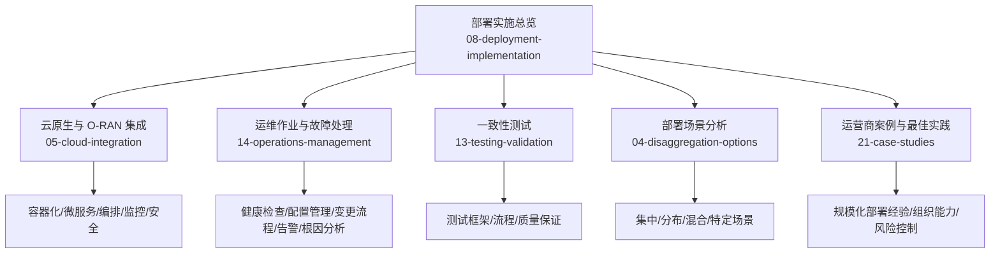
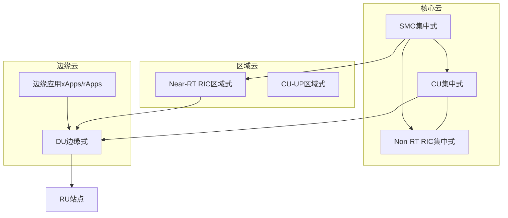
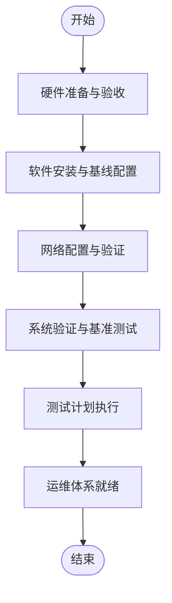
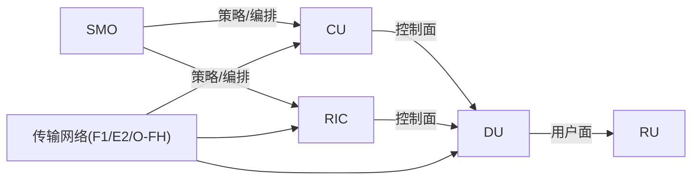
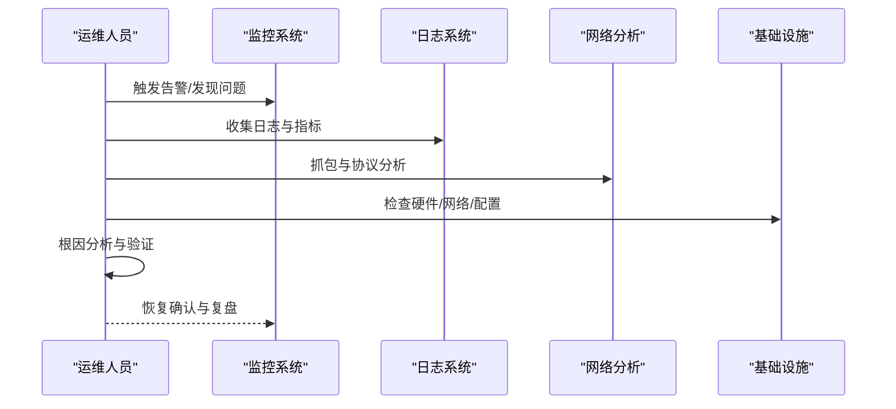

# 部署实施最佳实践

<cite>
**本文引用的文件**
- [O-RAN 实施](file://08-deployment-implementation/readme.md)
- [云原生架构与 O-RAN 集成](file://05-cloud-integration/cloud-native-architecture.md)
- [日常运维作业程序](file://14-operations-management/daily-operations/daily-operation-procedures.md)
- [故障处理与排查指南](file://14-operations-management/fault-handling/fault-troubleshooting-guide.md)
- [O-RAN 最佳实践案例](file://21-case-studies/best-practices/o-ran-best-practice-cases.md)
- [运营商 O-RAN 部署案例](file://21-case-studies/operator-cases/carrier-o-ran-deployment-cases.md)
- [O-RAN 一致性测试](file://13-testing-validation/conformance-testing/o-ran-conformance-testing.md)
- [解耦选项与部署场景](file://04-disaggregation-options/deployment-scenarios.md)
</cite>

## 目录
1. [引言](#引言)
2. [项目结构](#项目结构)
3. [核心组件](#核心组件)
4. [架构总览](#架构总览)
5. [详细组件分析](#详细组件分析)
6. [依赖分析](#依赖分析)
7. [性能考虑](#性能考虑)
8. [故障排查指南](#故障排查指南)
9. [结论](#结论)
10. [附录](#附录)

## 引言
本文件面向 O-RAN 部署实施的专业读者，围绕“硬件选择、环境配置、标准化流程、质量控制”四个方面，系统梳理 O-RAN 的部署最佳实践。内容来源于仓库中的部署实施、云原生集成、运维作业、故障处理、一致性测试以及部署场景等文档，并结合运营商规模化案例提炼可复用的方法论与流程模板，帮助读者建立高效、稳健、可扩展的 O-RAN 部署与运维体系。

## 项目结构
本仓库以主题域划分，部署实施相关内容主要集中在以下目录：
- 08-deployment-implementation：部署实施总览，包含架构设计、硬件与基础设施规划、测试策略、运维体系、故障处理、安全与自动化等
- 05-cloud-integration：云原生与 O-RAN 集成，涵盖容器化、微服务、编排、基础设施即代码、监控与安全等
- 14-operations-management：运维作业与故障处理，提供日常健康检查、配置管理、变更流程、告警与根因分析等
- 13-testing-validation：一致性测试，给出测试框架、测试流程与质量保证要点
- 21-case-studies：运营商与行业最佳实践案例，总结规模化部署经验与教训
- 04-disaggregation-options：部署场景分析，覆盖集中式、分布式、混合式及特定场景的选型与优化

**图表来源**
- [O-RAN 实施](file://08-deployment-implementation/readme.md#L1-L353)
- [云原生架构与 O-RAN 集成](file://05-cloud-integration/cloud-native-architecture.md#L1-L481)
- [日常运维作业程序](file://14-operations-management/daily-operations/daily-operation-procedures.md#L1-L443)
- [故障处理与排查指南](file://14-operations-management/fault-handling/fault-troubleshooting-guide.md#L1-L633)
- [O-RAN 一致性测试](file://13-testing-validation/conformance-testing/o-ran-conformance-testing.md#L1-L67)
- [部署场景分析](file://04-disaggregation-options/deployment-scenarios.md#L1-L563)
- [O-RAN 最佳实践案例](file://21-case-studies/best-practices/o-ran-best-practice-cases.md#L1-L210)
- [运营商 O-RAN 部署案例](file://21-case-studies/operator-cases/carrier-o-ran-deployment-cases.md#L1-L401)

**章节来源**
- [O-RAN 实施](file://08-deployment-implementation/readme.md#L1-L353)
- [云原生架构与 O-RAN 集成](file://05-cloud-integration/cloud-native-architecture.md#L1-L481)

## 核心组件
- 部署架构设计：集中式、分布式、混合式、边缘式、多云式
- 硬件与基础设施：服务器规格、网络基础设施、存储架构、电源与制冷
- 测试体系：接口测试、功能测试、性能测试、互操作性测试、回归测试
- 运维体系：监控、故障管理、性能管理、配置管理、容量管理
- 故障处理：问题分类、排查流程、诊断工具、根因分析、SOP
- 安全与自动化：网络与接口安全、系统安全、监控与审计、IaC 与编排
- 一致性验证：测试框架、测试环境、测试流程、质量保证

**章节来源**
- [O-RAN 实施](file://08-deployment-implementation/readme.md#L8-L196)
- [云原生架构与 O-RAN 集成](file://05-cloud-integration/cloud-native-architecture.md#L65-L234)

## 架构总览
下图展示了 O-RAN 在云原生环境下的典型部署形态与关键交互面，涵盖 CU/DU/RU、RIC、SMO 以及边缘与核心的协同关系。

**图表来源**
- [云原生架构与 O-RAN 集成](file://05-cloud-integration/cloud-native-architecture.md#L237-L296)
- [O-RAN 实施](file://08-deployment-implementation/readme.md#L8-L39)

## 详细组件分析

### 硬件与基础设施规划
- 服务器规格
  - CU：高吞吐、低延迟、高可靠性，建议 NUMA 架构、高速互联、SSD 存储
  - DU：实时处理能力、可选加速卡（FPGA/DPDK），网络侧低延迟
  - RIC：AI/ML 加速（GPU/FPGA）、高并发接口处理
  - SMO：管理与数据库、高可用与灾备
- 网络基础设施
  - Fronthaul：光纤/直连、交换机、带宽与抖动预算
  - Midhaul：IP 传输、QoS、带宽与时延预算
  - Backhaul：核心互联、路由策略、冗余与弹性
  - 数据中心网络：Spine-Leaf、VXLAN、超低时延互联
- 存储架构
  - 分布式存储、持久化策略、备份与恢复、性能与容量规划
- 电力与制冷
  - 数据中心电力设计、UPS/柴油机、冷却系统、能耗优化

**章节来源**
- [O-RAN 实施](file://08-deployment-implementation/readme.md#L40-L61)
- [部署场景分析](file://04-disaggregation-options/deployment-scenarios.md#L296-L365)

### 环境配置与云原生集成
- 操作系统与容器平台
  - 选择稳定内核版本、启用实时补丁（如需 RT 要求）、容器运行时（containerd/docker）、内核参数优化
- 容器与编排
  - 容器镜像管理、特权容器与资源预留、健康检查、优雅启停
  - Kubernetes 集群拓扑、节点角色、CNI/CSI 选择、HPA/VPA
- 网络插件与 SR-IOV/DPDK
  - CNI 插件（Calico/Flannel/ovn）与 VXLAN/叠加网络权衡
  - SR-IOV/DPDK 用于低时延与高吞吐场景
- 存储方案
  - 本地盘/高性能网络存储、CSI 插件、快照与备份策略

**章节来源**
- [云原生架构与 O-RAN 集成](file://05-cloud-integration/cloud-native-architecture.md#L123-L176)
- [云原生架构与 O-RAN 集成](file://05-cloud-integration/cloud-native-architecture.md#L207-L234)

### 部署流程标准化
- 硬件准备
  - 机房与供电、机柜与布线、设备上架与标签、光模块与线缆测试
- 软件安装
  - 操作系统基线、内核与驱动、容器运行时、Kubernetes 组件安装
- 网络配置
  - 网络拓扑、VLAN/子网、SR-IOV/DPDK、QoS、PTP
- 系统验证
  - 接口连通性、时钟同步、性能基准、安全策略生效

**图表来源**
- [O-RAN 实施](file://08-deployment-implementation/readme.md#L62-L92)

**章节来源**
- [O-RAN 实施](file://08-deployment-implementation/readme.md#L62-L92)

### 测试策略与一致性验证
- 接口测试：E2/A1/O1/O-FH/F1 的消息流、错误处理、订阅与同步
- 功能测试：端到端业务、切换与重选、承载与 QoS
- 性能测试：并发用户、压力、端到端时延、吞吐、稳定性
- 互操作性测试：多厂商兼容、协议一致性、Plugfest
- 回归测试：升级、配置变更、补丁后的自动化回归
- 一致性验证：O-RAN 联盟测试套件、3GPP 规范验证、自动化测试平台

**章节来源**
- [O-RAN 实施](file://08-deployment-implementation/readme.md#L62-L92)
- [O-RAN 一致性测试](file://13-testing-validation/conformance-testing/o-ran-conformance-testing.md#L1-L67)

### 运维体系与自动化
- 监控体系：Prometheus/Grafana、多维监控、可视化仪表板、日志管理（ELK/Splunk）
- 故障管理：自动告警、分级处置、根因分析、预防性维护
- 性能管理：KPI/KQI 收集、趋势分析、瓶颈定位、容量规划
- 配置管理：CMDB、Git/版本控制、Ansible/Terraform、审计与回滚
- 容量管理：资源使用监控、预测模型、弹性与成本优化

**章节来源**
- [O-RAN 实施](file://08-deployment-implementation/readme.md#L94-L125)
- [日常运维作业程序](file://14-operations-management/daily-operations/daily-operation-procedures.md#L1-L443)

### 安全与合规
- 网络安全：VLAN/VXLAN/切片、ACL/防火墙、TLS/IPsec、DDoS 防护
- 接口安全：OAuth/mTLS、RBAC/ABAC、API 限流与输入校验、消息完整性
- 系统安全：OS 硬化、镜像扫描、运行时保护、应用安全审计、数据加密
- 安全监控：SIEM/IDS/IPS、UEBA、漏洞扫描、合规审计

**章节来源**
- [O-RAN 实施](file://08-deployment-implementation/readme.md#L158-L179)
- [云原生架构与 O-RAN 集成](file://05-cloud-integration/cloud-native-architecture.md#L342-L377)

### 部署场景与选型
- 集中式：核心区域集中部署 CU/SMO/Non-RT RIC，适合高管理效率与广覆盖
- 分布式：边缘部署 DU/CU-UP/Near-RT RIC，适合低时延与边缘计算
- 混合式：核心集中+边缘分布，平衡管理与性能
- 特定场景：工业园区（工业控制、低时延）、交通枢纽（高密度）、偏远地区（低成本覆盖）

**章节来源**
- [部署场景分析](file://04-disaggregation-options/deployment-scenarios.md#L7-L563)

### 实战案例与最佳实践
- 德国电信：分阶段部署、自动化测试、AI 优化、可观测性驱动
- Rakuten Mobile：端到端云原生、零接触部署、DevOps、多云
- Verizon：边缘计算集成、超低时延、企业专网
- Vodafone：欧洲多国标准化、区域适配、工业 4.0
- Reliance Jio：大规模部署、成本优化、远程运维、社区赋能

**章节来源**
- [O-RAN 最佳实践案例](file://21-case-studies/best-practices/o-ran-best-practice-cases.md#L1-L210)
- [运营商 O-RAN 部署案例](file://21-case-studies/operator-cases/carrier-o-ran-deployment-cases.md#L1-L401)

## 依赖分析
- 组件耦合与内聚
  - CU/DU/RU 之间通过 F1 接口耦合，E2/RIC 通过 E2 接口耦合，SMO 提供统一编排与策略下发
- 外部依赖
  - 3GPP/ETSI/O-RAN 标准；多厂商设备互操作；容器平台与云原生工具链
- 风险与缓解
  - 供应商锁定、标准滞后、运维复杂度、时钟同步与网络抖动

**图表来源**
- [O-RAN 实施](file://08-deployment-implementation/readme.md#L8-L39)

**章节来源**
- [O-RAN 实施](file://08-deployment-implementation/readme.md#L8-L39)

## 性能考虑
- 实时性与低时延
  - 容器性能优化、SR-IOV/DPDK、CPU 亲和与隔离、资源预留
- 可靠性与可用性
  - 多副本、自动故障转移、状态管理、备份与恢复
- 可观测性
  - 统一日志/指标/追踪、分布式追踪、智能告警聚合、可视化
- 成本与弹性
  - 弹性伸缩、容量预测、资源利用率优化、多云与边缘协同

**章节来源**
- [云原生架构与 O-RAN 集成](file://05-cloud-integration/cloud-native-architecture.md#L123-L176)
- [云原生架构与 O-RAN 集成](file://05-cloud-integration/cloud-native-architecture.md#L297-L341)

## 故障排查指南
- 问题分类
  - 接口故障（E2/F1/O-FH）、性能问题（时延/吞吐/丢包）、可用性问题、配置冲突、兼容性问题
- 排查流程
  - 问题定义与范围界定、信息收集（日志/指标/配置）、假设验证、根因分析（5 个为什么/鱼骨图/故障树）、方案实施与验证
- 诊断工具
  - 网络分析（Wireshark/tcpdump）、协议分析（E2/A1/O1）、日志分析（ELK/Splunk）、性能分析（Perf/火焰图）、网络监控（Ping/Traceroute/MTR）
- SOP
  - 故障响应、升级、沟通、复盘、知识库更新

**图表来源**
- [日常运维作业程序](file://14-operations-management/daily-operations/daily-operation-procedures.md#L126-L161)
- [故障处理与排查指南](file://14-operations-management/fault-handling/fault-troubleshooting-guide.md#L31-L98)

**章节来源**
- [日常运维作业程序](file://14-operations-management/daily-operations/daily-operation-procedures.md#L126-L161)
- [故障处理与排查指南](file://14-operations-management/fault-handling/fault-troubleshooting-guide.md#L31-L98)

## 结论
通过将部署架构设计、硬件与基础设施规划、云原生集成、测试与一致性验证、运维与自动化、安全与合规、以及规模化案例经验系统化整合，可以形成一套可落地、可复用、可持续的 O-RAN 部署实施最佳实践。建议在项目启动阶段明确场景与目标，在设计阶段完成架构与测试方案评审，在交付阶段落实自动化与可观测性，在运营阶段坚持持续优化与知识沉淀。

## 附录
- 关键流程模板
  - 健康检查脚本与仪表板、配置备份与变更流程、故障响应与升级矩阵、自动化测试与回归流程
- 常见问题与解决方案
  - E2/F1/O-FH 接口问题、时钟同步与相位对齐、网络抖动与时延、配置冲突与兼容性、性能瓶颈与容量规划

**章节来源**
- [日常运维作业程序](file://14-operations-management/daily-operations/daily-operation-procedures.md#L68-L161)
- [故障处理与排查指南](file://14-operations-management/fault-handling/fault-troubleshooting-guide.md#L264-L537)
- [O-RAN 实施](file://08-deployment-implementation/readme.md#L126-L196)