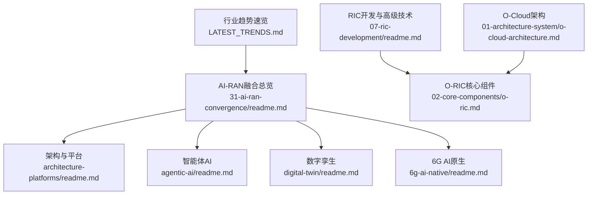
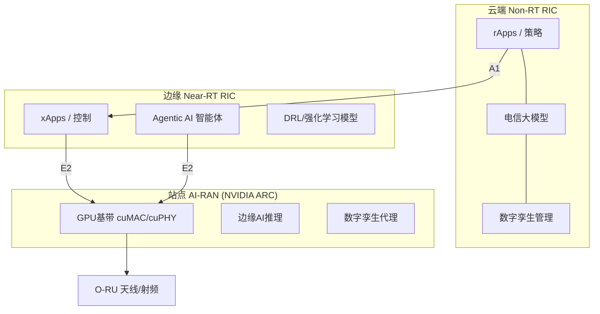
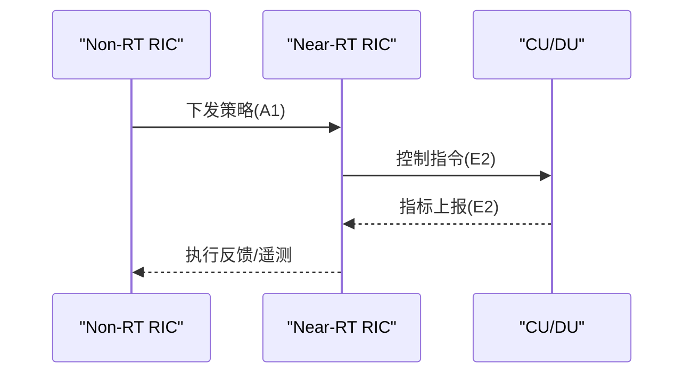
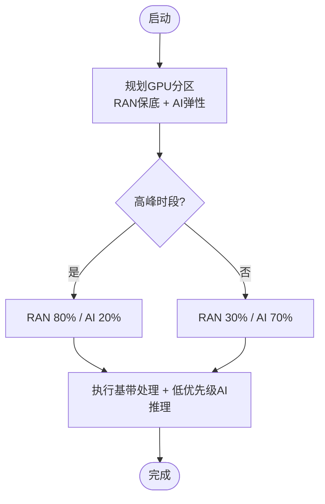
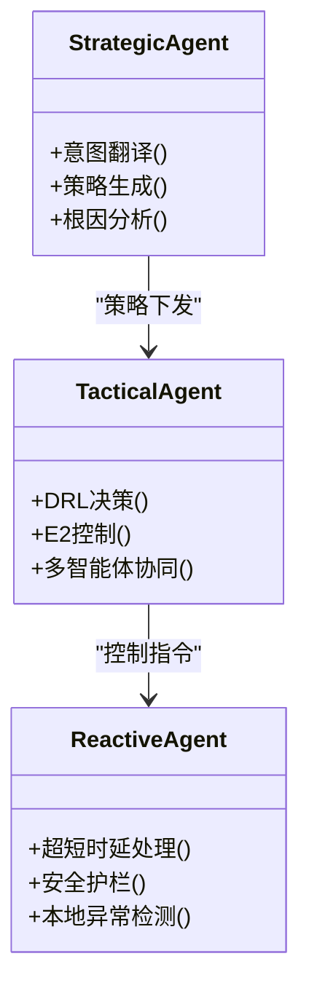
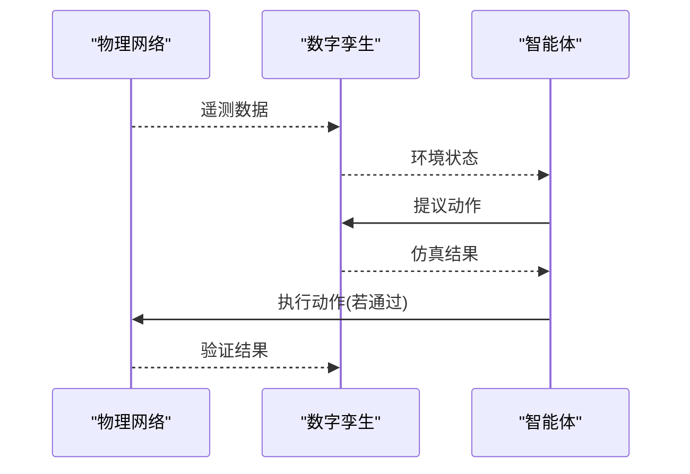
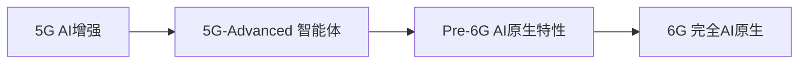
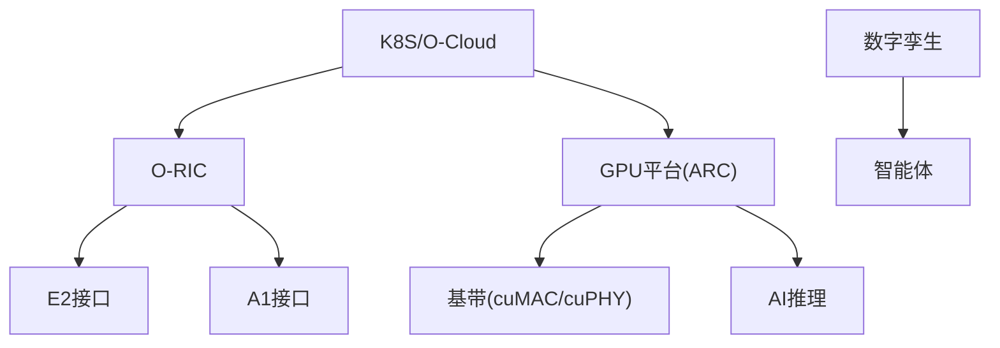

# AI-RAN融合

<cite>
**本文引用的文件**
- [README.md](file://README.md)
- [LATEST_TRENDS.md](file://LATEST_TRENDS.md)
- [31-ai-ran-convergence/readme.md](file://31-ai-ran-convergence/readme.md)
- [31-ai-ran-convergence/architecture-platforms/readme.md](file://31-ai-ran-convergence/architecture-platforms/readme.md)
- [31-ai-ran-convergence/agentic-ai/readme.md](file://31-ai-ran-convergence/agentic-ai/readme.md)
- [31-ai-ran-convergence/digital-twin/readme.md](file://31-ai-ran-convergence/digital-twin/readme.md)
- [31-ai-ran-convergence/6g-ai-native/readme.md](file://31-ai-ran-convergence/6g-ai-native/readme.md)
- [07-ric-development/readme.md](file://07-ric-development/readme.md)
- [02-core-components/o-ric.md](file://02-core-components/o-ric.md)
- [01-architecture-system/o-cloud-architecture.md](file://01-architecture-system/o-cloud-architecture.md)
</cite>

## 目录
1. [引言](#引言)
2. [项目结构](#项目结构)
3. [核心组件](#核心组件)
4. [架构总览](#架构总览)
5. [详细组件分析](#详细组件分析)
6. [依赖关系分析](#依赖关系分析)
7. [性能考量](#性能考量)
8. [故障排查指南](#故障排查指南)
9. [结论](#结论)
10. [附录](#附录)

## 引言
本文件聚焦“AI-RAN融合”主题，基于仓库中2026年最新资料，系统梳理AI与RAN的融合范式、平台架构、智能体（Agentic AI）体系、数字孪生闭环以及面向6G的AI原生演进路径。文档同时结合O-RAN RIC与O-Cloud基础设施，为云平台工程师提供从Kubernetes编排到GPU资源调度、从xApp/rApp到自治Agent的完整技术视角。

## 项目结构
该知识库围绕O-RAN全栈知识组织，其中与AI-RAN融合直接相关的章节集中在：
- 31-ai-ran-convergence：AI-RAN融合全景（联盟生态、架构平台、智能体、数字孪生、6G AI原生）
- 07-ric-development：RIC开发、E2/A1接口、智能算法与安全
- 02-core-components/o-ric.md：Near-RT RIC与Non-RT RIC职责、部署与运维要点
- 01-architecture-system/o-cloud-architecture.md：O-Cloud云原生基础设施层
- LATEST_TRENDS.md：2025-2026行业趋势速览（AI-RAN联盟、GPU加速基带、GPUaaS等）

**图表来源**
- [31-ai-ran-convergence/readme.md:1-177](file://31-ai-ran-convergence/readme.md#L1-L177)
- [31-ai-ran-convergence/architecture-platforms/readme.md:1-318](file://31-ai-ran-convergence/architecture-platforms/readme.md#L1-L318)
- [31-ai-ran-convergence/agentic-ai/readme.md:1-327](file://31-ai-ran-convergence/agentic-ai/readme.md#L1-L327)
- [31-ai-ran-convergence/digital-twin/readme.md:1-240](file://31-ai-ran-convergence/digital-twin/readme.md#L1-L240)
- [31-ai-ran-convergence/6g-ai-native/readme.md:1-298](file://31-ai-ran-convergence/6g-ai-native/readme.md#L1-L298)
- [07-ric-development/readme.md:1-474](file://07-ric-development/readme.md#L1-L474)
- [02-core-components/o-ric.md:1-437](file://02-core-components/o-ric.md#L1-L437)
- [01-architecture-system/o-cloud-architecture.md:1-238](file://01-architecture-system/o-cloud-architecture.md#L1-L238)
- [LATEST_TRENDS.md:1-107](file://LATEST_TRENDS.md#L1-L107)

**章节来源**
- [README.md:247-480](file://README.md#L247-L480)
- [LATEST_TRENDS.md:9-107](file://LATEST_TRENDS.md#L9-L107)

## 核心组件
- O-RIC（近实时与非实时）：负责策略下发、实时控制、数据分析与模型集成，是AI-RAN的控制中枢。
- GPU加速基带与平台：NVIDIA ARC/ARC-Compact + Aerial SDK（cuMAC/cuPHY/pyAerial），实现RAN与AI共享算力。
- 智能体（Agentic AI）：三层分级（战略/战术/反应），LLM推理+工具调用+安全护栏，替代传统规则型xApp/rApp。
- 数字孪生：城市级仿真与实时同步，用于行动预验证、训练环境与回归测试。
- O-Cloud：云原生基础设施，支撑容器化网络功能与GPU工作负载编排。

**章节来源**
- [02-core-components/o-ric.md:1-117](file://02-core-components/o-ric.md#L1-L117)
- [31-ai-ran-convergence/architecture-platforms/readme.md:48-141](file://31-ai-ran-convergence/architecture-platforms/readme.md#L48-L141)
- [31-ai-ran-convergence/agentic-ai/readme.md:27-73](file://31-ai-ran-convergence/agentic-ai/readme.md#L27-L73)
- [31-ai-ran-convergence/digital-twin/readme.md:5-26](file://31-ai-ran-convergence/digital-twin/readme.md#L5-L26)
- [01-architecture-system/o-cloud-architecture.md:1-38](file://01-architecture-system/o-cloud-architecture.md#L1-L38)

## 架构总览
AI-RAN在2026年的典型分层如下：
- 云端Non-RT RIC：rApps/Telecom LLM/数字孪生管理
- 边缘Near-RT RIC：xApps/Agentic AI/DRL模型
- 站点AI-RAN：GPU基带（cuMAC/cuPHY）、边缘AI推理、数字孪生代理
- 空口O-RU：天线与射频前端

**图表来源**
- [31-ai-ran-convergence/readme.md:120-147](file://31-ai-ran-convergence/readme.md#L120-L147)
- [31-ai-ran-convergence/architecture-platforms/readme.md:144-195](file://31-ai-ran-convergence/architecture-platforms/readme.md#L144-L195)

## 详细组件分析

### O-RIC（近实时与非实时）
- 近实时RIC：毫秒级控制闭环，通过E2接口与CU/DU交互，执行策略并动态分配资源。
- 非实时RIC：秒至分钟级策略管理，通过A1接口分发策略，进行数据建模与预测。
- 协调机制：跨RIC状态同步、负载均衡、故障隔离与恢复。

**图表来源**
- [02-core-components/o-ric.md:7-58](file://02-core-components/o-ric.md#L7-L58)
- [07-ric-development/readme.md:69-107](file://07-ric-development/readme.md#L69-L107)

**章节来源**
- [02-core-components/o-ric.md:1-117](file://02-core-components/o-ric.md#L1-L117)
- [07-ric-development/readme.md:17-107](file://07-ric-development/readme.md#L17-L107)

### GPU加速基带与平台（NVIDIA ARC/Aerial SDK）
- 硬件平台：ARC（宏站高容量）与ARC-Compact（站点功耗受限场景）。
- 软件栈：Aerial SDK包含cuMAC（L2调度）、cuPHY（物理层处理）、pyAerial（Python API）。
- 资源共享：同一GPU上动态划分RAN与AI工作负载，保障RAN时延SLO的同时利用闲时算力服务B2B AI。

**图表来源**
- [31-ai-ran-convergence/architecture-platforms/readme.md:197-215](file://31-ai-ran-convergence/architecture-platforms/readme.md#L197-L215)

**章节来源**
- [31-ai-ran-convergence/architecture-platforms/readme.md:48-141](file://31-ai-ran-convergence/architecture-platforms/readme.md#L48-L141)
- [31-ai-ran-convergence/architecture-platforms/readme.md:218-233](file://31-ai-ran-convergence/architecture-platforms/readme.md#L218-L233)

### 智能体（Agentic AI）在RAN中的三层架构
- 战略层（Non-RT RIC）：LLM推理、意图翻译、跨网策略规划、根因分析。
- 战术层（Near-RT RIC）：DRL决策、E2控制、多智能体协同。
- 反应层（O-DU/ARC）：超低时延信号处理、安全护栏、本地异常检测。

**图表来源**
- [31-ai-ran-convergence/agentic-ai/readme.md:31-64](file://31-ai-ran-convergence/agentic-ai/readme.md#L31-L64)
- [07-ric-development/readme.md:372-406](file://07-ric-development/readme.md#L372-L406)

**章节来源**
- [31-ai-ran-convergence/agentic-ai/readme.md:1-73](file://31-ai-ran-convergence/agentic-ai/readme.md#L1-L73)
- [07-ric-development/readme.md:372-427](file://07-ric-development/readme.md#L372-L427)

### 数字孪生（Digital Twin）闭环
- 能力成熟度：从描述性到自主优化（L1-L5），2026达到L4-L5。
- 与RIC控制环：遥测→孪生更新→智能体提议→孪生仿真→评估→执行→验证。
- 平台与集成：NVIDIA AODT、VIAVI联合验证、IEEE SA 6G-TWIN标准化。

**图表来源**
- [31-ai-ran-convergence/digital-twin/readme.md:83-108](file://31-ai-ran-convergence/digital-twin/readme.md#L83-L108)

**章节来源**
- [31-ai-ran-convergence/digital-twin/readme.md:5-26](file://31-ai-ran-convergence/digital-twin/readme.md#L5-L26)
- [31-ai-ran-convergence/digital-twin/readme.md:29-80](file://31-ai-ran-convergence/digital-twin/readme.md#L29-L80)

### 6G AI原生架构
- 范式转变：从AI增强到AI原生，AI内生于每一层设计。
- 关键方向：AI设计的物理层、自组织智能、语义通信、全息波束赋形、太赫兹AI、联邦学习。
- 路线图：5G→5G-Advanced（智能体）→Pre-6G（AI原生特性）→6G（完全自主演进）。

**图表来源**
- [31-ai-ran-convergence/6g-ai-native/readme.md:5-24](file://31-ai-ran-convergence/6g-ai-native/readme.md#L5-L24)
- [31-ai-ran-convergence/6g-ai-native/readme.md:253-281](file://31-ai-ran-convergence/6g-ai-native/readme.md#L253-L281)

**章节来源**
- [31-ai-ran-convergence/6g-ai-native/readme.md:27-117](file://31-ai-ran-convergence/6g-ai-native/readme.md#L27-L117)
- [31-ai-ran-convergence/6g-ai-native/readme.md:169-189](file://31-ai-ran-convergence/6g-ai-native/readme.md#L169-L189)

## 依赖关系分析
- O-RIC依赖E2/A1接口与CU/DU、SMO协作；xApp/rApp运行于RIC平台。
- GPU基带与AI推理共享同一GPU资源，需严格隔离与时序保障。
- 数字孪生依赖实时数据管道与仿真引擎，为智能体提供行动预验证。
- O-Cloud提供容器编排、GPU调度、可观测性与自动化运维能力。

**图表来源**
- [02-core-components/o-ric.md:73-117](file://02-core-components/o-ric.md#L73-L117)
- [31-ai-ran-convergence/architecture-platforms/readme.md:144-195](file://31-ai-ran-convergence/architecture-platforms/readme.md#L144-L195)
- [31-ai-ran-convergence/digital-twin/readme.md:83-119](file://31-ai-ran-convergence/digital-twin/readme.md#L83-L119)
- [01-architecture-system/o-cloud-architecture.md:19-38](file://01-architecture-system/o-cloud-architecture.md#L19-L38)

**章节来源**
- [07-ric-development/readme.md:17-42](file://07-ric-development/readme.md#L17-L42)
- [31-ai-ran-convergence/architecture-platforms/readme.md:269-305](file://31-ai-ran-convergence/architecture-platforms/readme.md#L269-L305)

## 性能考量
- 近实时控制闭环时延要求：<10ms（Near-RT RIC到CU/DU）。
- GPU资源分区：RAN保底+AI弹性，确保SLO与收益最大化。
- 数字孪生同步延迟：事件驱动/流式/快照模式，目标亚秒级。
- O-Cloud性能：NUMA感知、SR-IOV/DPDK、GPU MIG隔离、DCGM监控。

**章节来源**
- [02-core-components/o-ric.md:155-161](file://02-core-components/o-ric.md#L155-L161)
- [31-ai-ran-convergence/architecture-platforms/readme.md:197-215](file://31-ai-ran-convergence/architecture-platforms/readme.md#L197-L215)
- [31-ai-ran-convergence/digital-twin/readme.md:159-194](file://31-ai-ran-convergence/digital-twin/readme.md#L159-L194)
- [01-architecture-system/o-cloud-architecture.md:41-63](file://01-architecture-system/o-cloud-architecture.md#L41-L63)

## 故障排查指南
- 接口故障：E2/A1断连或消息堆积，检查连接池、重试与路由。
- 应用故障：xApp/rApp崩溃或异常，查看日志、健康探针与回滚策略。
- 资源不足：CPU/内存/GPU过载，调整配额与扩缩容策略。
- 数字孪生偏差：仿真与物理不一致，校准RF模型与同步链路。
- 智能体越界：触发安全护栏，立即回滚并人工介入。

**章节来源**
- [02-core-components/o-ric.md:214-301](file://02-core-components/o-ric.md#L214-L301)
- [31-ai-ran-convergence/agentic-ai/readme.md:212-256](file://31-ai-ran-convergence/agentic-ai/readme.md#L212-L256)
- [31-ai-ran-convergence/digital-twin/readme.md:197-228](file://31-ai-ran-convergence/digital-twin/readme.md#L197-L228)

## 结论
AI-RAN融合在2026已从概念走向商业验证，形成“AI-for/on/with RAN”三范式并存格局。以NVIDIA ARC为代表的GPU加速基带、三层智能体架构与数字孪生闭环，使RAN成为分布式智能平台。对云平台工程师而言，掌握K8S+GPU调度、RIC应用开发与智能体安全护栏，是进入AI-RAN的关键技能迁移点。未来向6G AI原生演进将强调内生AI、语义通信与自组织智能。

## 附录
- 学习路径建议：先理解联盟生态与平台，再深入智能体与数字孪生，最后展望6G AI原生。
- 实践建议：在K8S上部署Near-RT RIC与xApp，接入E2/A1；引入数字孪生进行行动预验证；逐步引入智能体与安全护栏。

**章节来源**
- [31-ai-ran-convergence/readme.md:151-157](file://31-ai-ran-convergence/readme.md#L151-L157)
- [31-ai-ran-convergence/agentic-ai/readme.md:290-313](file://31-ai-ran-convergence/agentic-ai/readme.md#L290-L313)