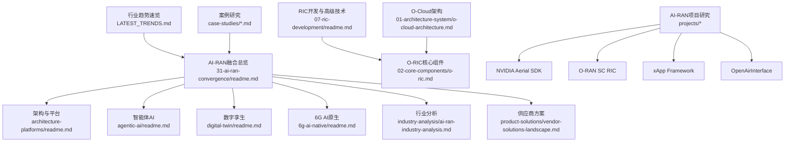
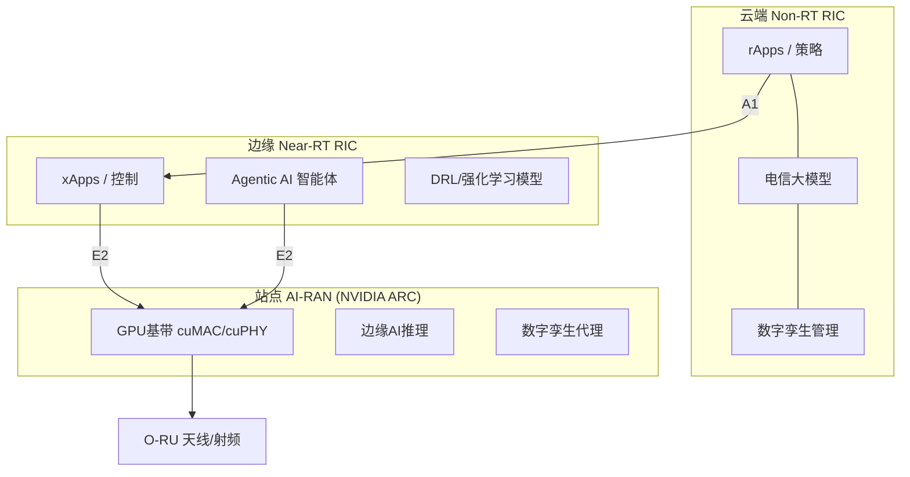
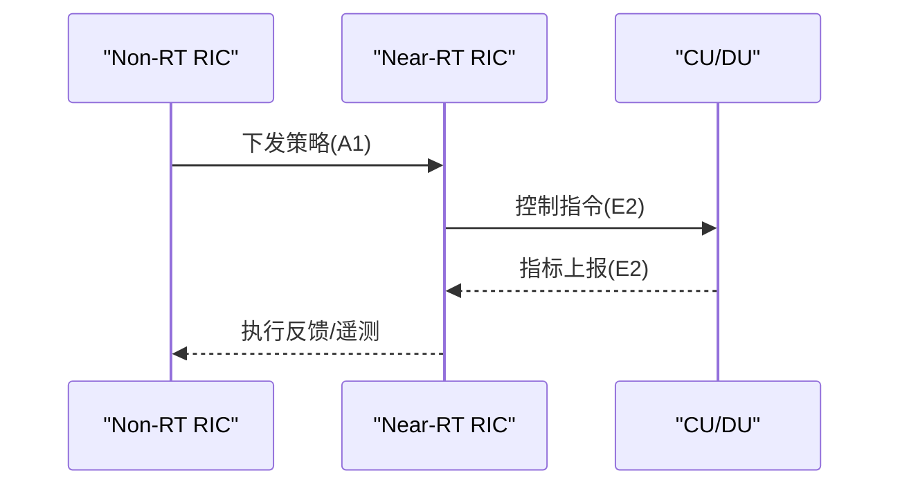
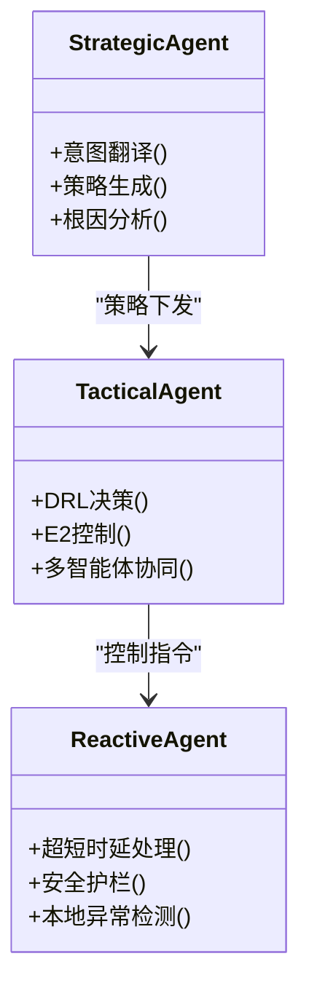
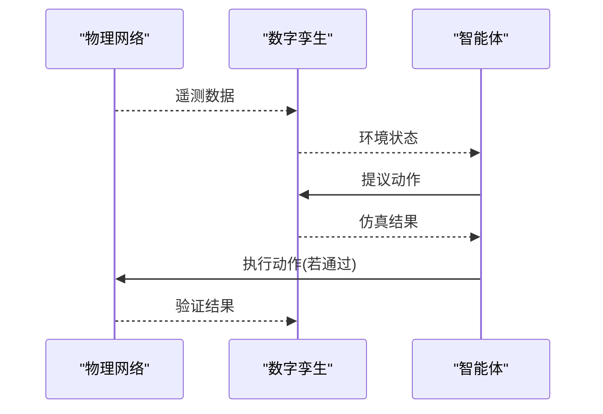
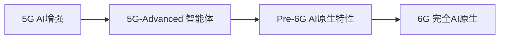
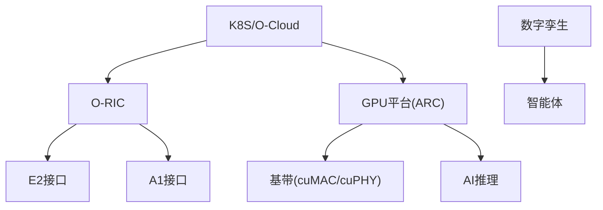

# AI-RAN融合

<cite>
**本文引用的文件**
- [README.md](file://README.md)
- [LATEST_TRENDS.md](file://LATEST_TRENDS.md)
- [31-ai-ran-convergence/readme.md](file://31-ai-ran-convergence/readme.md)
- [31-ai-ran-convergence/architecture-platforms/readme.md](file://31-ai-ran-convergence/architecture-platforms/readme.md)
- [31-ai-ran-convergence/agentic-ai/readme.md](file://31-ai-ran-convergence/agentic-ai/readme.md)
- [31-ai-ran-convergence/digital-twin/readme.md](file://31-ai-ran-convergence/digital-twin/readme.md)
- [31-ai-ran-convergence/6g-ai-native/readme.md](file://31-ai-ran-convergence/6g-ai-native/readme.md)
- [31-ai-ran-convergence/industry-analysis/ai-ran-industry-analysis.md](file://31-ai-ran-convergence/industry-analysis/ai-ran-industry-analysis.md)
- [31-ai-ran-convergence/product-solutions/vendor-solutions-landscape.md](file://31-ai-ran-convergence/product-solutions/vendor-solutions-landscape.md)
- [31-ai-ran-convergence/case-studies/nokia-nvidia-mwc.md](file://31-ai-ran-convergence/case-studies/nokia-nvidia-mwc.md)
- [31-ai-ran-convergence/case-studies/softbank.md](file://31-ai-ran-convergence/case-studies/softbank.md)
- [31-ai-ran-convergence/projects/readme.md](file://31-ai-ran-convergence/projects/readme.md)
- [31-ai-ran-convergence/projects/nvidia-aerial-cuda-accelerated-ran.md](file://31-ai-ran-convergence/projects/nvidia-aerial-cuda-accelerated-ran.md)
- [31-ai-ran-convergence/projects/oran-sc-ric-platform.md](file://31-ai-ran-convergence/projects/oran-sc-ric-platform.md)
- [31-ai-ran-convergence/projects/oran-sc-xapp-framework.md](file://31-ai-ran-convergence/projects/oran-sc-xapp-framework.md)
- [31-ai-ran-convergence/projects/openairinterface.md](file://31-ai-ran-convergence/projects/openairinterface.md)
- [07-ric-development/readme.md](file://07-ric-development/readme.md)
- [02-core-components/o-ric.md](file://02-core-components/o-ric.md)
- [01-architecture-system/o-cloud-architecture.md](file://01-architecture-system/o-cloud-architecture.md)
</cite>

## 更新摘要
**所做更改**
- 新增AI-RAN项目研究目录章节，包含NVIDIA Aerial CUDA-Accelerated RAN、O-RAN SC RIC Platform、xApp Framework、OpenAirInterface等核心项目的详细分析
- 增强实践指导部分，提供从概念到部署的完整技术路径
- 扩展开源生态系统分析，涵盖主要开源项目和社区生态
- 增加创业和职业发展指导，为从业者提供实用建议
- 完善学习路径规划，支持不同层次的技术人员需求

## 目录
1. [引言](#引言)
2. [项目结构](#项目结构)
3. [核心组件](#核心组件)
4. [架构总览](#架构总览)
5. [详细组件分析](#详细组件分析)
6. [AI-RAN项目研究](#ai-ran项目研究)
7. [行业分析与市场展望](#行业分析与市场展望)
8. [供应商解决方案全景](#供应商解决方案全景)
9. [实际部署案例](#实际部署案例)
10. [依赖关系分析](#依赖关系分析)
11. [性能考量](#性能考量)
12. [故障排查指南](#故障排查指南)
13. [结论](#结论)
14. [附录](#附录)

## 引言
本文件聚焦"AI-RAN融合"主题，基于仓库中2026年最新资料，系统梳理AI与RAN的融合范式、平台架构、智能体（Agentic AI）体系、数字孪生闭环以及面向6G的AI原生演进路径。文档同时结合O-RAN RIC与O-Cloud基础设施，为云平台工程师提供从Kubernetes编排到GPU资源调度、从xApp/rApp到自治Agent的完整技术视角。

**更新** 新增全面的AI-RAN项目研究目录，包含NVIDIA Aerial、O-RAN SC、xApp Framework、OpenAirInterface等核心开源项目的深度分析，为开发者提供从理论到实践的完整技术路线。

## 项目结构
该知识库围绕O-RAN全栈知识组织，其中与AI-RAN融合直接相关的章节集中在：
- 31-ai-ran-convergence：AI-RAN融合全景（联盟生态、架构平台、智能体、数字孪生、6G AI原生）
- 31-ai-ran-convergence/projects：**新增** AI-RAN项目研究（核心开源项目、创业机会、学习路径）
- 31-ai-ran-convergence/industry-analysis：AI-RAN行业分析（市场预测、价值链、竞争格局）
- 31-ai-ran-convergence/product-solutions：供应商解决方案全景（厂商产品对比、选型指南）
- 31-ai-ran-convergence/case-studies：实际部署案例（运营商试验、商业验证）
- 07-ric-development：RIC开发、E2/A1接口、智能算法与安全
- 02-core-components/o-ric.md：Near-RT RIC与Non-RT RIC职责、部署与运维要点
- 01-architecture-system/o-cloud-architecture.md：O-Cloud云原生基础设施层
- LATEST_TRENDS.md：2025-2026行业趋势速览（AI-RAN联盟、GPU加速基带、GPUaaS等）



**图表来源**
- [31-ai-ran-convergence/readme.md:1-199](file://31-ai-ran-convergence/readme.md#L1-L199)
- [31-ai-ran-convergence/projects/readme.md:15-26](file://31-ai-ran-convergence/projects/readme.md#L15-L26)

**章节来源**
- [README.md:247-480](file://README.md#L247-L480)
- [LATEST_TRENDS.md:9-107](file://LATEST_TRENDS.md#L9-L107)

## 核心组件
- O-RIC（近实时与非实时）：负责策略下发、实时控制、数据分析与模型集成，是AI-RAN的控制中枢。
- GPU加速基带与平台：NVIDIA ARC/ARC-Compact + Aerial SDK（cuMAC/cuPHY/pyAerial），实现RAN与AI共享算力。
- 智能体（Agentic AI）：三层分级（战略/战术/反应），LLM推理+工具调用+安全护栏，替代传统规则型xApp/rApp。
- 数字孪生：城市级仿真与实时同步，用于行动预验证、训练环境与回归测试。
- O-Cloud：云原生基础设施，支撑容器化网络功能与GPU工作负载编排。

**章节来源**
- [02-core-components/o-ric.md:1-117](file://02-core-components/o-ric.md#L1-L117)
- [31-ai-ran-convergence/architecture-platforms/readme.md:48-141](file://31-ai-ran-convergence/architecture-platforms/readme.md#L48-L141)
- [31-ai-ran-convergence/agentic-ai/readme.md:27-73](file://31-ai-ran-convergence/agentic-ai/readme.md#L27-L73)
- [31-ai-ran-convergence/digital-twin/readme.md:5-26](file://31-ai-ran-convergence/digital-twin/readme.md#L5-L26)
- [01-architecture-system/o-cloud-architecture.md:1-38](file://01-architecture-system/o-cloud-architecture.md#L1-L38)

## 架构总览
AI-RAN在2026年的典型分层如下：
- 云端Non-RT RIC：rApps/Telecom LLM/数字孪生管理
- 边缘Near-RT RIC：xApps/Agentic AI/DRL模型
- 站点AI-RAN：GPU基带（cuMAC/cuPHY）、边缘AI推理、数字孪生代理
- 空口O-RU：天线与射频前端



**图表来源**
- [31-ai-ran-convergence/readme.md:120-147](file://31-ai-ran-convergence/readme.md#L120-L147)
- [31-ai-ran-convergence/architecture-platforms/readme.md:144-195](file://31-ai-ran-convergence/architecture-platforms/readme.md#L144-L195)

## 详细组件分析

### O-RIC（近实时与非实时）
- 近实时RIC：毫秒级控制闭环，通过E2接口与CU/DU交互，执行策略并动态分配资源。
- 非实时RIC：秒至分钟级策略管理，通过A1接口分发策略，进行数据建模与预测。
- 协调机制：跨RIC状态同步、负载均衡、故障隔离与恢复。



**图表来源**
- [02-core-components/o-ric.md:7-58](file://02-core-components/o-ric.md#L7-L58)
- [07-ric-development/readme.md:69-107](file://07-ric-development/readme.md#L69-L107)

**章节来源**
- [02-core-components/o-ric.md:1-117](file://02-core-components/o-ric.md#L1-L117)
- [07-ric-development/readme.md:17-107](file://07-ric-development/readme.md#L17-L107)

### GPU加速基带与平台（NVIDIA ARC/Aerial SDK）
- 硬件平台：ARC（宏站高容量）与ARC-Compact（站点功耗受限场景）。
- 软件栈：Aerial SDK包含cuMAC（L2调度）、cuPHY（物理层处理）、pyAerial（Python API）。
- 资源共享：同一GPU上动态划分RAN与AI工作负载，保障RAN时延SLO的同时利用闲时算力服务B2B AI。


**图表来源**
- [31-ai-ran-convergence/architecture-platforms/readme.md:197-215](file://31-ai-ran-convergence/architecture-platforms/readme.md#L197-L215)

**章节来源**
- [31-ai-ran-convergence/architecture-platforms/readme.md:48-141](file://31-ai-ran-convergence/architecture-platforms/readme.md#L48-L141)
- [31-ai-ran-convergence/architecture-platforms/readme.md:218-233](file://31-ai-ran-convergence/architecture-platforms/readme.md#L218-L233)

### 智能体（Agentic AI）在RAN中的三层架构
- 战略层（Non-RT RIC）：LLM推理、意图翻译、跨网策略规划、根因分析。
- 战术层（Near-RT RIC）：DRL决策、E2控制、多智能体协同。
- 反应层（O-DU/ARC）：超低时延信号处理、安全护栏、本地异常检测。



**图表来源**
- [31-ai-ran-convergence/agentic-ai/readme.md:31-64](file://31-ai-ran-convergence/agentic-ai/readme.md#L31-L64)
- [07-ric-development/readme.md:372-406](file://07-ric-development/readme.md#L372-L406)

**章节来源**
- [31-ai-ran-convergence/agentic-ai/readme.md:1-73](file://31-ai-ran-convergence/agentic-ai/readme.md#L1-L73)
- [07-ric-development/readme.md:372-427](file://07-ric-development/readme.md#L372-L427)

### 数字孪生（Digital Twin）闭环
- 能力成熟度：从描述性到自主优化（L1-L5），2026达到L4-L5。
- 与RIC控制环：遥测→孪生更新→智能体提议→孪生仿真→评估→执行→验证。
- 平台与集成：NVIDIA AODT、VIAVI联合验证、IEEE SA 6G-TWIN标准化。



**图表来源**
- [31-ai-ran-convergence/digital-twin/readme.md:83-108](file://31-ai-ran-convergence/digital-twin/readme.md#L83-L108)

**章节来源**
- [31-ai-ran-convergence/digital-twin/readme.md:5-26](file://31-ai-ran-convergence/digital-twin/readme.md#L5-L26)
- [31-ai-ran-convergence/digital-twin/readme.md:29-80](file://31-ai-ran-convergence/digital-twin/readme.md#L29-L80)

### 6G AI原生架构
- 范式转变：从AI增强到AI原生，AI内生于每一层设计。
- 关键方向：AI设计的物理层、自组织智能、语义通信、全息波束赋形、太赫兹AI、联邦学习。
- 路线图：5G→5G-Advanced（智能体）→Pre-6G（AI原生特性）→6G（完全自主演进）。



**图表来源**
- [31-ai-ran-convergence/6g-ai-native/readme.md:5-24](file://31-ai-ran-convergence/6g-ai-native/readme.md#L5-L24)
- [31-ai-ran-convergence/6g-ai-native/readme.md:253-281](file://31-ai-ran-convergence/6g-ai-native/readme.md#L253-L281)

**章节来源**
- [31-ai-ran-convergence/6g-ai-native/readme.md:27-117](file://31-ai-ran-convergence/6g-ai-native/readme.md#L27-L117)
- [31-ai-ran-convergence/6g-ai-native/readme.md:169-189](file://31-ai-ran-convergence/6g-ai-native/readme.md#L169-L189)

## AI-RAN项目研究

### NVIDIA Aerial CUDA-Accelerated RAN
NVIDIA Aerial™ CUDA-Accelerated RAN是AI-RAN领域的核心开源SDK，提供完整的GPU加速5G/6G基站实现。

**核心特性：**
- **GPU加速物理层**：cuPHY实现LDPC/Polar编解码、MIMO处理、FFT/IFFT
- **GPU加速MAC层**：cuMAC提供亚毫秒级调度决策，支持1000+ UE并发
- **Python API**：pyAerial支持ML模型集成和AI增强调度
- **容器化部署**：支持Docker和Kubernetes环境
- **O-RAN兼容**：完整支持E2/A1/O1接口

**应用场景：**
- 5G基站基带处理（宏站、微站、室内小站）
- AI-with-RAN模式（RAN与AI共享GPU资源）
- 边缘AI推理（视频分析、自然语言处理）
- 数字孪生（网络仿真与优化）

**技术栈：**
```
应用层: xApps/rApps/AI工作负载
控制层: cuMAC-CP/cuPHY-CP
数据层: GPU加速处理单元
硬件层: NVIDIA GPU (L4, A100, H100)
射频层: O-RU (eCPRI接口)
```

**章节来源**
- [31-ai-ran-convergence/projects/nvidia-aerial-cuda-accelerated-ran.md:34-119](file://31-ai-ran-convergence/projects/nvidia-aerial-cuda-accelerated-ran.md#L34-L119)
- [31-ai-ran-convergence/projects/nvidia-aerial-cuda-accelerated-ran.md:122-452](file://31-ai-ran-convergence/projects/nvidia-aerial-cuda-accelerated-ran.md#L122-L452)

### O-RAN Software Community (OSC) RIC Platform
O-RAN SC RIC Platform是O-RAN联盟主导的开源RIC实现，提供完整的RAN智能控制框架。

**架构组成：**
- **Near-RT RIC**：近实时控制（10ms-1s响应），支持E2接口和xApp管理
- **Non-RT RIC**：非实时策略管理（>1s响应），支持A1接口和rApp环境
- **E2接口实现**：标准E2AP协议，支持多种服务模型
- **A1接口实现**：策略管理和分发机制
- **xApp/rApp框架**：应用程序开发和生命周期管理

**核心功能：**
- **消息路由**：RMR（RIC Message Router）提供可靠的消息传递
- **策略管理**：QoS优化、负载均衡、干扰管理、节能策略
- **数据管理**：性能数据收集、时间序列存储、数据分析
- **AI/ML集成**：模型训练、部署、监控和版本管理

**开发环境：**
```yaml
开发工具链:
  - 编程语言: Python, C++, Go
  - SDK: xApp SDK (Python), xApp C++ SDK
  - 构建工具: CMake, Make, Docker
  - 测试框架: pytest, Google Test
  - 调试工具: gdb, dlv, 日志系统
```

**章节来源**
- [31-ai-ran-convergence/projects/oran-sc-ric-platform.md:32-65](file://31-ai-ran-convergence/projects/oran-sc-ric-platform.md#L32-L65)
- [31-ai-ran-convergence/projects/oran-sc-ric-platform.md:68-227](file://31-ai-ran-convergence/projects/oran-sc-ric-platform.md#L68-L227)

### O-RAN SC xApp Framework
xApp Framework是O-RAN SC提供的xApp开发框架，简化RIC应用程序开发流程。

**框架架构：**
```
xApp 应用程序
    ↓
xApp Framework Core
    ↓
┌─────────────────────────────┐
│ RMR 消息路由               │
│ REST API 服务              │
│ SDL 数据层                 │
│ 配置管理                   │
│ 日志与监控                 │
│ ASN.1 编解码               │
└─────────────────────────────┘
```

**核心特性：**
- **RMR消息路由**：支持E2AP消息、RIC指示、控制消息、A1策略消息
- **REST API服务**：健康检查、配置管理、统计信息、控制命令、监控数据
- **Shared Data Layer**：统一的数据访问接口，支持Redis、PostgreSQL等后端
- **ASN.1编解码**：支持E2SM-KPM、E2SM-RC、E2AP等协议
- **安全特性**：认证、授权、加密、审计日志

**开发示例：**
```go
// xApp Framework 核心架构
type XAppFramework struct {
    RmrClient      *RMRClient      // RMR 消息路由客户端
    RestServer     *RestServer     // REST API 服务器
    SdlClient      *SDLClient      // Shared Data Layer 客户端
    ConfigManager  *ConfigManager  // 配置管理器
    MetricsManager *MetricsManager // 指标管理器
    Logger         *Logger         // 日志记录器
}
```

**章节来源**
- [31-ai-ran-convergence/projects/oran-sc-xapp-framework.md:13-82](file://31-ai-ran-convergence/projects/oran-sc-xapp-framework.md#L13-L82)
- [31-ai-ran-convergence/projects/oran-sc-xapp-framework.md:84-386](file://31-ai-ran-convergence/projects/oran-sc-xapp-framework.md#L84-L386)

### OpenAirInterface (OAI)
OpenAirInterface是由EURECOM创立的开源无线通信平台，提供完整的4G/5G RAN和核心网络软件。

**项目特点：**
- **完整协议栈**：支持4G LTE和5G NR的完整实现
- **O-RAN兼容**：支持F1、E1、E2等O-RAN接口
- **硬件无关**：支持多种SDR硬件平台（USRP、BladeRF、LimeSDR）
- **学术研究**：广泛用于无线通信研究和教育
- **AI集成**：支持NVIDIA Aerial GPU加速和AI驱动的网络优化

**技术架构：**
```
应用层 (Application)
    ↓
SDAP 层
    ↓
PDCP 层
    ↓
RLC 层
    ↓
MAC 层
    ↓
物理层 (PHY)
```

**核心功能：**
- **5G NR支持**：FR1/FR2频段、MIMO、双工模式
- **O-RAN实现**：RU/DU/CU分离架构、前传接口
- **仿真工具**：L1仿真器、信道仿真器、测试工具
- **UE实现**：完整的用户设备协议栈

**章节来源**
- [31-ai-ran-convergence/projects/openairinterface.md:32-72](file://31-ai-ran-convergence/projects/openairinterface.md#L32-L72)
- [31-ai-ran-convergence/projects/openairinterface.md:74-215](file://31-ai-ran-convergence/projects/openairinterface.md#L74-L215)

### 学习路径与职业发展

#### 初学者路径
1. **了解基础**：先阅读AI-RAN融合概览了解行业背景
2. **选择方向**：根据兴趣选择1-2个开源项目深入学习
3. **动手实践**：按照项目文档搭建开发环境，运行示例代码
4. **参与贡献**：从简单的bug修复或文档改进开始参与开源社区

#### 开发者路径
1. **技术深入**：深入研究选定项目的技术架构和代码实现
2. **技能提升**：掌握相关技术栈（CUDA、Go、Python、Kubernetes等）
3. **项目实战**：开发自己的xApp或AI-RAN应用
4. **社区参与**：参与O-RAN SC或OpenAirInterface社区贡献

#### 创业者路径
1. **市场研究**：阅读创业项目思路了解市场机会
2. **技术验证**：基于开源项目构建技术原型
3. **商业设计**：设计商业模式、制定商业计划
4. **团队组建**：寻找技术合伙人、组建核心团队

**章节来源**
- [31-ai-ran-convergence/projects/readme.md:33-52](file://31-ai-ran-convergence/projects/readme.md#L33-L52)

## 行业分析与市场展望

### 市场定义与边界
AI-RAN与Open RAN的区别在于核心目标、架构焦点和关键硬件的不同。AI-RAN是Open RAN的演进方向，在此基础上引入"智能内生"能力。两者互补而非替代。

**AI-RAN三大支柱：**
- **AI-for-RAN**：利用AI优化RAN功能，成熟度高，已在生产环境广泛部署
- **AI-on-RAN**：基站基础设施承载第三方AI工作负载，成熟度中等，新收入模式
- **AI-with-RAN**：AI与RAN动态共享同一GPU计算资源，成熟度低，技术突破期

### 市场规模与增长预测（2024-2030）
| 年份 | 市场规模（亿美元） | 同比增长率 | 关键驱动事件 |
|:---|:---|:---|:---|
| **2024** | 15-20 | — | 概念验证期，NVIDIA投资Nokia |
| **2025** | 30-40 | ~100% | AI-RAN Alliance成立，首批试点 |
| **2026E** | 60-80 | ~80% | MWC/GTC产品发布，SoftBank商用 |
| **2027E** | 120-150 | ~90% | 多运营商规模部署 |
| **2030E** | 150-200 | — | Dell'Oro：AI-RAN成为RAN主流架构 |

### 价值链分析
AI-RAN价值链从上游芯片到下游运营服务，各环节价值分布清晰：
- **芯片（GPU/SoC）**：~25%价值占比，利润率60-70%，主要玩家NVIDIA、Qualcomm
- **基础软件**：~15%价值占比，利润率70-80%，NVIDIA Aerial SDK主导
- **平台**：~20%价值占比，利润率40-50%，NVIDIA ARC、云服务商
- **应用（xApp/rApp）**：~10%价值占比，利润率50-60%，ISV、运营商自研
- **系统集成**：~20%价值占比，利润率20-30%，Ericsson、Nokia、Accenture
- **运营服务**：~10%价值占比，利润率15-25%，运营商、MSP

### 主要厂商市场份额与竞争格局
| 厂商 | 传统RAN份额 | AI-RAN份额 | 2026 AI-RAN策略 |
|:---|:---|:---|:---|
| **Ericsson** | ~28% | ~20% | 与NVIDIA合作，RAN Compute平台 |
| **Nokia** | ~22% | ~30% | 全面拥抱GPU RAN，NVIDIA $1B投资 |
| **Samsung** | ~15% | ~15% | vRAN 3.0 + AI-RAN解决方案 |
| **华为** | ~30% | — | 受限于地缘政治，聚焦国内市场 |
| **中兴** | ~8% | ~10% | AIR RAN Agentic AI架构 |
| **Mavenir** | ~3% | ~10% | Open RAN AI先锋 |
| **NEC/Fujitsu** | ~5% | ~10% | 日本市场主导 + 海外扩张 |

**章节来源**
- [31-ai-ran-convergence/industry-analysis/ai-ran-industry-analysis.md:7-45](file://31-ai-ran-convergence/industry-analysis/ai-ran-industry-analysis.md#L7-L45)
- [31-ai-ran-convergence/industry-analysis/ai-ran-industry-analysis.md:47-83](file://31-ai-ran-convergence/industry-analysis/ai-ran-industry-analysis.md#L47-L83)
- [31-ai-ran-convergence/industry-analysis/ai-ran-industry-analysis.md:85-142](file://31-ai-ran-convergence/industry-analysis/ai-ran-industry-analysis.md#L85-L142)

## 供应商解决方案全景

### NVIDIA生态系统
NVIDIA是AI-RAN基础设施的核心推动者，其ARC（Aerial RAN Computer）平台是当前AI-RAN硬件的事实标准。

**NVIDIA ARC平台家族：**
- **NVIDIA ARC（全尺寸版）**：Grace CPU + L40S/H100 GPU，支持最高100 MHz × 4扇区
- **NVIDIA ARC-Compact**：针对典型基站优化的低功耗平台，72W TDP，适配300W基站功耗预算

**核心组件：**
- **cuMAC**：GPU加速L2调度器，亚毫秒级调度决策，支持数百个UE
- **Aerial SDK**：GPU加速RAN软件开发套件，包含cuMAC、cuPHY、pyAerial
- **AODT**：AI开放数字孪生，城市级6G网络仿真

### Ericsson
Ericsson采取"混合AI/RAN"策略，将AI能力逐步集成到传统RAN产品中。

**主要产品组合：**
- **Ericsson RAN Compute**：基带处理平台，支持AI辅助调度
- **Ericsson Intelligent Network**：网络自动化平台，AI驱动的网络优化
- **Ericsson AI Engine**：AI/ML推理引擎，实时网络数据分析

### Samsung
Samsung的虚拟化RAN平台已演进至支持AI-RAN，与NVIDIA深度合作。

**vRAN 3.0特性：**
- 纯软件vRAN，运行在通用服务器上
- 内置AI/ML推理引擎
- 完整的Near-RT RIC和Non-RT RIC支持
- 与NVIDIA ARC平台集成

### Nokia
Nokia是NVIDIA在AI-RAN领域最重要的合作伙伴，$10亿投资建立深度合作关系。

**AirScale产品线：**
- **AirScale Baseband**：基带处理单元，集成NVIDIA ARC GPU
- **AirScale Radio**：射频单元，支持AI辅助射频优化
- **MantaRay NM**：AI驱动的网络管理平台

### Mavenir
Mavenir是Open RAN软件的纯正玩家，其AI-RAN方案聚焦于软件层面。

**差异化优势：**
- 纯软件路线，不依赖特定硬件
- Open RAN原生设计
- 云原生架构，基于Kubernetes
- 成本优势，软件许可模式降低运营商CAPEX

### 云服务商方案
**AWS Wavelength**：边缘计算平台，支持NVIDIA GPU实例和AWS SageMaker边缘推理
**Azure Private 5G**：微软私有5G + 边缘AI平台，集成Azure AI服务
**Google Distributed Cloud**：谷歌分布式云平台，支持Vertex AI边缘推理

**章节来源**
- [31-ai-ran-convergence/product-solutions/vendor-solutions-landscape.md:13-91](file://31-ai-ran-convergence/product-solutions/vendor-solutions-landscape.md#L13-L91)
- [31-ai-ran-convergence/product-solutions/vendor-solutions-landscape.md:93-131](file://31-ai-ran-convergence/product-solutions/vendor-solutions-landscape.md#L93-L131)
- [31-ai-ran-convergence/product-solutions/vendor-solutions-landscape.md:133-167](file://31-ai-ran-convergence/product-solutions/vendor-solutions-landscape.md#L133-L167)
- [31-ai-ran-convergence/product-solutions/vendor-solutions-landscape.md:169-209](file://31-ai-ran-convergence/product-solutions/vendor-solutions-landscape.md#L169-L209)
- [31-ai-ran-convergence/product-solutions/vendor-solutions-landscape.md:211-240](file://31-ai-ran-convergence/product-solutions/vendor-solutions-landscape.md#L211-L240)
- [31-ai-ran-convergence/product-solutions/vendor-solutions-landscape.md:277-325](file://31-ai-ran-convergence/product-solutions/vendor-solutions-landscape.md#L277-L325)

## 实际部署案例

### Nokia + NVIDIA MWC 2026现场演示
在MWC巴塞罗那2026上，Nokia和NVIDIA展示了首个公开的AI-with-RAN演示，在同一GPU上同时运行5G基带处理和AI推理工作负载。

**演示规格：**
- **硬件**：NVIDIA ARC-Compact（L4 GPU + Grace CPU）
- **软件**：NVIDIA Aerial SDK（cuMAC + cuPHY）、Triton Inference Server
- **场景**：正常操作（60% RAN, 40% AI）、流量尖峰（85% RAN, 15% AI）、低谷期（30% RAN, 70% AI）

**关键结果：**
- RAN延迟保持在2.8ms（目标<5ms）✓
- GPU利用率从45%提升到92%
- 功率效率提升30%
- 收入潜力提升130%（含AI服务）

### SoftBank商业AI-RAN启动
SoftBank是首家宣布计划于2026年推出商业AI-RAN服务的主要运营商。该计划将基站重新构想为多功能AI + RAN +边缘计算平台。

**商业模式：**
- **传统连接**：现有5G数据套餐
- **边缘AI即服务**：B2B客户在SoftBank基站上部署AI推理工作负载
- **数字孪生服务**：企业订阅城市级数字孪生数据

**技术实现：**
- 时间感知GPU分区模型，确保RAN始终有保证的资源
- Kubernetes集群，每个租户命名空间隔离
- MIG（Multi-Instance GPU）隔离技术

**章节来源**
- [31-ai-ran-convergence/case-studies/nokia-nvidia-mwc.md:1-228](file://31-ai-ran-convergence/case-studies/nokia-nvidia-mwc.md#L1-L228)
- [31-ai-ran-convergence/case-studies/softbank.md:1-198](file://31-ai-ran-convergence/case-studies/softbank.md#L1-L198)

## 依赖关系分析
- O-RIC依赖E2/A1接口与CU/DU、SMO协作；xApp/rApp运行于RIC平台。
- GPU基带与AI推理共享同一GPU资源，需严格隔离与时序保障。
- 数字孪生依赖实时数据管道与仿真引擎，为智能体提供行动预验证。
- O-Cloud提供容器编排、GPU调度、可观测性与自动化运维能力。



**图表来源**
- [02-core-components/o-ric.md:73-117](file://02-core-components/o-ric.md#L73-L117)
- [31-ai-ran-convergence/architecture-platforms/readme.md:144-195](file://31-ai-ran-convergence/architecture-platforms/readme.md#L144-L195)
- [31-ai-ran-convergence/digital-twin/readme.md:83-119](file://31-ai-ran-convergence/digital-twin/readme.md#L83-L119)
- [01-architecture-system/o-cloud-architecture.md:19-38](file://01-architecture-system/o-cloud-architecture.md#L19-L38)

**章节来源**
- [07-ric-development/readme.md:17-42](file://07-ric-development/readme.md#L17-L42)
- [31-ai-ran-convergence/architecture-platforms/readme.md:269-305](file://31-ai-ran-convergence/architecture-platforms/readme.md#L269-L305)

## 性能考量
- 近实时控制闭环时延要求：<10ms（Near-RT RIC到CU/DU）。
- GPU资源分区：RAN保底+AI弹性，确保SLO与收益最大化。
- 数字孪生同步延迟：事件驱动/流式/快照模式，目标亚秒级。
- O-Cloud性能：NUMA感知、SR-IOV/DPDK、GPU MIG隔离、DCGM监控。

**章节来源**
- [02-core-components/o-ric.md:155-161](file://02-core-components/o-ric.md#L155-L161)
- [31-ai-ran-convergence/architecture-platforms/readme.md:197-215](file://31-ai-ran-convergence/architecture-platforms/readme.md#L197-L215)
- [31-ai-ran-convergence/digital-twin/readme.md:159-194](file://31-ai-ran-convergence/digital-twin/readme.md#L159-L194)
- [01-architecture-system/o-cloud-architecture.md:41-63](file://01-architecture-system/o-cloud-architecture.md#L41-L63)

## 故障排查指南
- 接口故障：E2/A1断连或消息堆积，检查连接池、重试与路由。
- 应用故障：xApp/rApp崩溃或异常，查看日志、健康探针与回滚策略。
- 资源不足：CPU/内存/GPU过载，调整配额与扩缩容策略。
- 数字孪生偏差：仿真与物理不一致，校准RF模型与同步链路。
- 智能体越界：触发安全护栏，立即回滚并人工介入。

**章节来源**
- [02-core-components/o-ric.md:214-301](file://02-core-components/o-ric.md#L214-L301)
- [31-ai-ran-convergence/agentic-ai/readme.md:212-256](file://31-ai-ran-convergence/agentic-ai/readme.md#L212-L256)
- [31-ai-ran-convergence/digital-twin/readme.md:197-228](file://31-ai-ran-convergence/digital-twin/readme.md#L197-L228)

## 结论
AI-RAN融合在2026已从概念走向商业验证，形成"AI-for/on/with RAN"三范式并存格局。以NVIDIA ARC为代表的GPU加速基带、三层智能体架构与数字孪生闭环，使RAN成为分布式智能平台。对云平台工程师而言，掌握K8S+GPU调度、RIC应用开发与智能体安全护栏，是进入AI-RAN的关键技能迁移点。未来向6G AI原生演进将强调内生AI、语义通信与自组织智能。

**更新** 新增的行业分析和供应商解决方案评估显示，AI-RAN市场正处于快速增长期，预计2030年将达到150-200亿美元规模。NVIDIA、Nokia、Ericsson等主要厂商都在积极布局，SoftBank等运营商已开始商业部署。对于技术决策者而言，理解市场格局、技术成熟度和投资回报至关重要。

**新增项目研究价值** 新添加的AI-RAN项目研究目录为开发者提供了从理论到实践的完整技术路线，包括NVIDIA Aerial、O-RAN SC、xApp Framework、OpenAirInterface等核心开源项目的深度分析，涵盖了学习路径、创业指导和职业发展建议，大大增强了文档的实用性和指导性。

## 附录
- 学习路径建议：先理解联盟生态与平台，再深入智能体与数字孪生，最后展望6G AI原生。
- 实践建议：在K8S上部署Near-RT RIC与xApp，接入E2/A1；引入数字孪生进行行动预验证；逐步引入智能体与安全护栏。
- 投资决策：关注GPU基带芯片、AI-RAN软件平台、边缘AI应用等领域的投资机会。

**章节来源**
- [31-ai-ran-convergence/readme.md:151-157](file://31-ai-ran-convergence/readme.md#L151-L157)
- [31-ai-ran-convergence/agentic-ai/readme.md:290-313](file://31-ai-ran-convergence/agentic-ai/readme.md#L290-L313)
- [31-ai-ran-convergence/industry-analysis/ai-ran-industry-analysis.md:238-270](file://31-ai-ran-convergence/industry-analysis/ai-ran-industry-analysis.md#L238-L270)