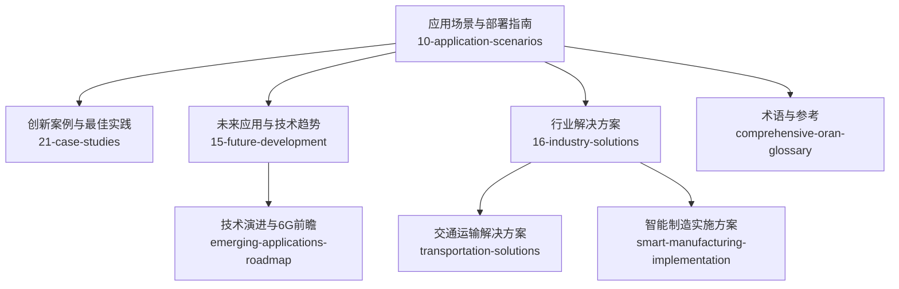
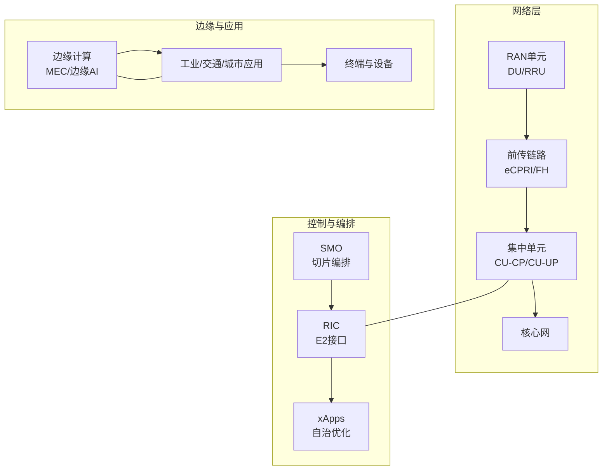
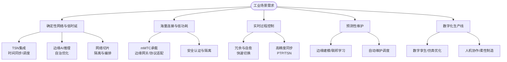
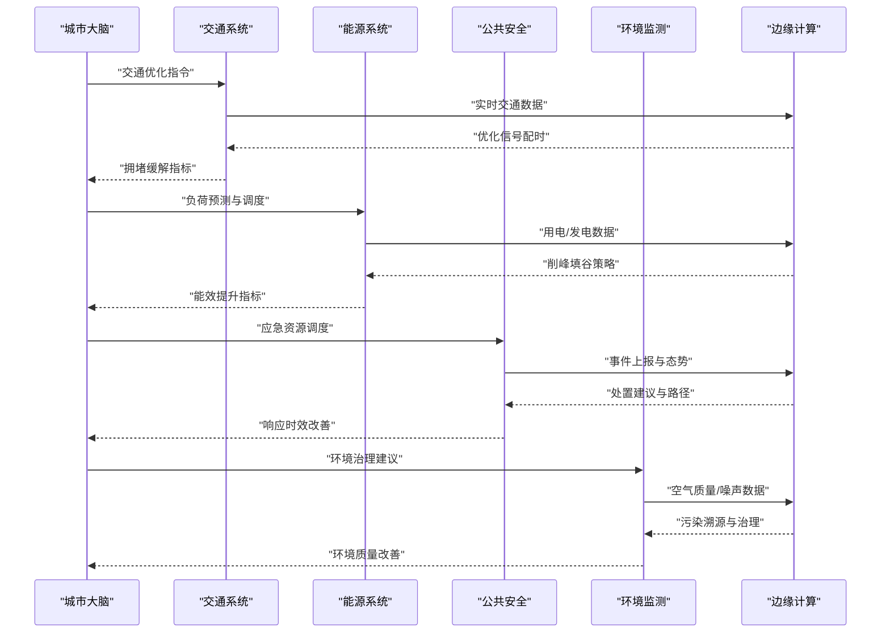
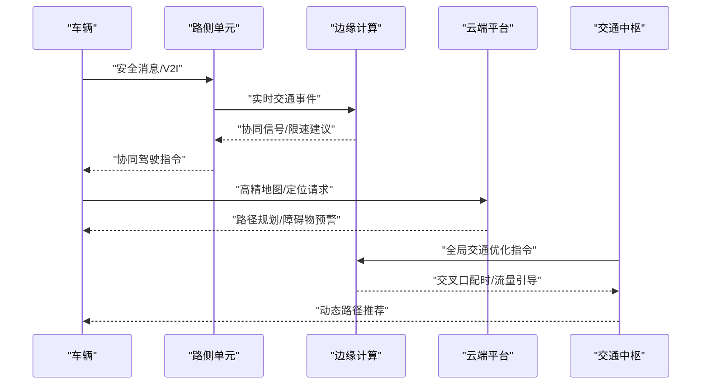
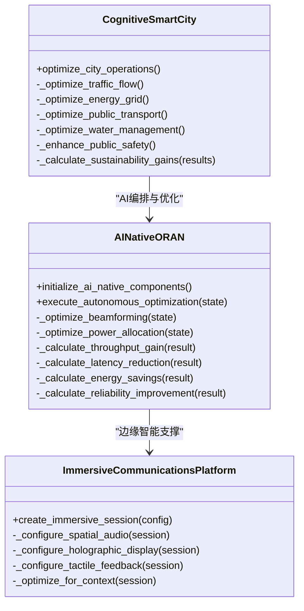
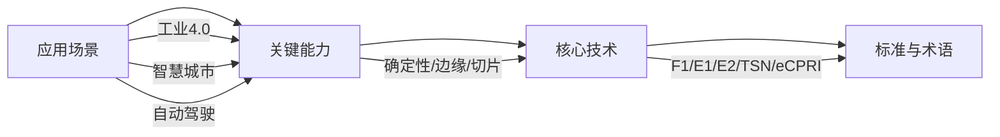

# 创新应用案例

<cite>
**本文引用的文件**
- [O-RAN 应用场景](file://10-application-scenarios/readme.md)
- [O-RAN 创新案例（中文）](file://21-case-studies/innovation-cases/o-ran-innovation-cases-zh.md)
- [O-RAN 最佳实践案例（中文）](file://21-case-studies/best-practices/o-ran-best-practice-cases-zh.md)
- [O-RAN 未来应用与趋势](file://15-future-development/emerging-applications/emerging-applications-roadmap.md)
- [O-RAN 技术发展趋势分析](file://15-future-development/technology-trends/technology-evolution-roadmap.md)
- [O-RAN 交通运输解决方案](file://16-industry-solutions/transportation/o-ran-transportation-solutions.md)
- [O-RAN 全面术语表](file://comprehensive-oran-glossary.md)
- [O-RAN 智能制造实施方案](file://16-industry-solutions/manufacturing-4.0/smart-manufacturing-implementation.md)
</cite>

## 目录
1. [引言](#引言)
2. [项目结构](#项目结构)
3. [核心组件](#核心组件)
4. [架构总览](#架构总览)
5. [详细组件分析](#详细组件分析)
6. [依赖关系分析](#依赖关系分析)
7. [性能考量](#性能考量)
8. [故障排查指南](#故障排查指南)
9. [结论](#结论)
10. [附录](#附录)

## 引言
本文件面向O-RAN创新应用案例，聚焦以下三大方向：
- 工业4.0集成应用：智能制造网络、工业物联网连接、实时过程控制、预测性维护系统、数字化生产线
- 智慧城市建设：智能交通管理、环境监测网络、公共安全通信、智能能源管理、城市数字服务
- 自动驾驶技术：V2X通信优化、实时路况感知、协同驾驶支持、交通流优化、应急响应系统

我们将结合仓库中的应用场景、创新案例、最佳实践与技术趋势文档，系统梳理O-RAN在上述场景中的技术要求、架构适配、关键能力与落地路径，并给出面向未来的演进方向与实施建议。

## 项目结构
本仓库围绕O-RAN的架构、组件、接口、解耦、云化、工作组、RIC发展、部署实施、标准合规、应用案例、学术论文、安全隐私、测试验证、运维管理、未来趋势、行业解决方案、开源生态、成本效益、人才发展、生态合作、工具平台、国际部署、可持续发展、法律监管、性能优化、故障诊断、监控告警、安全威胁、最佳实践等维度形成体系化知识库。与本文件主题直接相关的内容主要分布在：
- 应用场景与部署指南：10-application-scenarios
- 创新案例与最佳实践：21-case-studies
- 未来应用与技术趋势：15-future-development
- 行业解决方案：16-industry-solutions
- 术语与参考：comprehensive-oran-glossary

**图表来源**
- [O-RAN 应用场景](file://10-application-scenarios/readme.md#L1-L470)
- [O-RAN 创新案例（中文）](file://21-case-studies/innovation-cases/o-ran-innovation-cases-zh.md#L1-L322)
- [O-RAN 最佳实践案例（中文）](file://21-case-studies/best-practices/o-ran-best-practice-cases-zh.md#L1-L210)
- [O-RAN 未来应用与趋势](file://15-future-development/emerging-applications/emerging-applications-roadmap.md#L1-L879)
- [O-RAN 交通运输解决方案](file://16-industry-solutions/transportation/o-ran-transportation-solutions.md#L1-L194)
- [O-RAN 智能制造实施方案](file://16-industry-solutions/manufacturing-4.0/smart-manufacturing-implementation.md#L1-L200)
- [O-RAN 全面术语表](file://comprehensive-oran-glossary.md#L1-L200)

**章节来源**
- [O-RAN 应用场景](file://10-application-scenarios/readme.md#L1-L470)
- [O-RAN 未来应用与趋势](file://15-future-development/emerging-applications/emerging-applications-roadmap.md#L1-L879)

## 核心组件
- 工业4.0集成应用
  - 智能制造网络：确定性网络、边缘AI推理、工业协议对接、安全隔离
  - 工业物联网连接：海量连接、低功耗、边缘网关、协议适配
  - 实时过程控制：低延迟、高可靠、时间敏感、冗余与自愈
  - 预测性维护系统：边缘建模、联邦学习、异常检测、自动维护调度
  - 数字化生产线：数字孪生、仿真优化、人机协作、柔性制造
- 智慧城市建设
  - 智能交通管理：V2X、边缘协同、多系统联动、应急通信
  - 环境监测网络：广覆盖、低功耗、数据融合、可视化平台
  - 公共安全通信：高可用、跨部门协同、灾备与临时扩容
  - 智能能源管理：配网自动化、需求响应、分布式能源接入
  - 城市数字服务：统一平台、多业务切片、按需编排
- 自动驾驶技术
  - V2X通信优化：直连与蜂窝融合、消息可靠性、时延与覆盖
  - 实时路况感知：边缘AI、传感器融合、高精度定位
  - 协同驾驶支持：车路协同、队列行驶、群体智能
  - 交通流优化：AI编排、动态信号、路径与运力调度
  - 应急响应系统：优先保障、快速恢复、跨域协同

**章节来源**
- [O-RAN 应用场景](file://10-application-scenarios/readme.md#L81-L153)
- [O-RAN 交通运输解决方案](file://16-industry-solutions/transportation/o-ran-transportation-solutions.md#L1-L194)
- [O-RAN 未来应用与趋势](file://15-future-development/emerging-applications/emerging-applications-roadmap.md#L588-L877)

## 架构总览
O-RAN在上述创新应用中的架构适配要点：
- 云化与解耦：CU/DU/RU解耦、前传接口、弹性扩缩容
- 边缘计算：MEC/边缘AI、就近处理、低时延推理
- 网络切片：差异化SLA、资源隔离、按需编排
- RIC与xApps：策略下发、自治优化、安全与合规
- 安全与零信任：端到端加密、微分段、持续认证与审计

**图表来源**
- [O-RAN 应用场景](file://10-application-scenarios/readme.md#L45-L80)
- [O-RAN 未来应用与趋势](file://15-future-development/emerging-applications/emerging-applications-roadmap.md#L288-L337)

**章节来源**
- [O-RAN 应用场景](file://10-application-scenarios/readme.md#L45-L80)
- [O-RAN 未来应用与趋势](file://15-future-development/emerging-applications/emerging-applications-roadmap.md#L288-L337)

## 详细组件分析

### 工业4.0集成应用
- 智能制造网络
  - 要求：确定性时延、零抖动、高可靠、跨域隔离
  - 能力：TSN集成、边缘AI、切片隔离、自治优化
  - 案例：私有网络部署、IT/OT融合、预测性维护
- 工业物联网连接
  - 要求：百万级连接、低功耗、边缘聚合、协议适配
  - 能力：mMTC承载、边缘网关、安全认证、数据预处理
- 实时过程控制
  - 要求：<1ms端到端时延、99.999%可靠性、冗余与自愈
  - 能力：确定性网络、边缘控制、快速故障切换
- 预测性维护系统
  - 能力：边缘建模、联邦学习、异常检测、自动维护调度
- 数字化生产线
  - 能力：数字孪生、仿真优化、人机协作、柔性制造

**图表来源**
- [O-RAN 应用场景](file://10-application-scenarios/readme.md#L81-L116)
- [O-RAN 创新案例（中文）](file://21-case-studies/innovation-cases/o-ran-innovation-cases-zh.md#L84-L95)

**章节来源**
- [O-RAN 应用场景](file://10-application-scenarios/readme.md#L81-L116)
- [O-RAN 创新案例（中文）](file://21-case-studies/innovation-cases/o-ran-innovation-cases-zh.md#L84-L95)

### 智慧城市建设
- 智能交通管理
  - 能力：V2X直连与蜂窝融合、边缘AI、多系统协同、应急通信
- 环境监测网络
  - 能力：广覆盖、低功耗、数据融合、可视化平台
- 公共安全通信
  - 能力：高可用、跨部门协同、灾备与临时扩容
- 智能能源管理
  - 能力：配网自动化、需求响应、分布式能源接入
- 城市数字服务
  - 能力：统一平台、多业务切片、按需编排

**图表来源**
- [O-RAN 未来应用与趋势](file://15-future-development/emerging-applications/emerging-applications-roadmap.md#L588-L877)

**章节来源**
- [O-RAN 未来应用与趋势](file://15-future-development/emerging-applications/emerging-applications-roadmap.md#L588-L877)

### 自动驾驶技术
- V2X通信优化
  - 能力：PC5直连与Uu蜂窝融合、消息可靠性、时延与覆盖
- 实时路况感知
  - 能力：边缘AI、传感器融合、高精度定位
- 协同驾驶支持
  - 能力：车路协同、队列行驶、群体智能
- 交通流优化
  - 能力：AI编排、动态信号、路径与运力调度
- 应急响应系统
  - 能力：优先保障、快速恢复、跨域协同

**图表来源**
- [O-RAN 应用场景](file://10-application-scenarios/readme.md#L118-L153)
- [O-RAN 交通运输解决方案](file://16-industry-solutions/transportation/o-ran-transportation-solutions.md#L1-L194)

**章节来源**
- [O-RAN 应用场景](file://10-application-scenarios/readme.md#L118-L153)
- [O-RAN 交通运输解决方案](file://16-industry-solutions/transportation/o-ran-transportation-solutions.md#L1-L194)

### AI/ML原生架构与边缘智能
- AI原生网络
  - 能力：自学习/自适应、预测性分析、自然语言界面、自主决策
- 边缘智能
  - 能力：分布式训练/推理、联邦学习、模型压缩/加速、缓存策略
- 6G前瞻
  - 能力：太赫兹通信、全息通信、智能超表面、空天地一体化、语义通信

**图表来源**
- [O-RAN 未来应用与趋势](file://15-future-development/emerging-applications/emerging-applications-roadmap.md#L61-L282)
- [O-RAN 未来应用与趋势](file://15-future-development/emerging-applications/emerging-applications-roadmap.md#L588-L877)

**章节来源**
- [O-RAN 未来应用与趋势](file://15-future-development/emerging-applications/emerging-applications-roadmap.md#L61-L282)
- [O-RAN 未来应用与趋势](file://15-future-development/emerging-applications/emerging-applications-roadmap.md#L588-L877)

## 依赖关系分析
- 场景到能力
  - 工业4.0 → 确定性网络、边缘AI、切片隔离、自治优化
  - 智慧城市 → V2X、边缘协同、应急通信、数据融合
  - 自动驾驶 → V2X、边缘AI、高精度定位、协同控制
- 能力到技术
  - 边缘智能 → MEC/边缘AI、联邦学习、模型压缩
  - 网络切片 → SMO编排、资源隔离、差异化SLA
  - RIC/xApps → E2接口、自治优化、安全与合规
- 技术到标准与术语
  - F1/E1/E2接口、TSN、eCPRI、网络切片、零信任等

**图表来源**
- [O-RAN 应用场景](file://10-application-scenarios/readme.md#L1-L470)
- [O-RAN 全面术语表](file://comprehensive-oran-glossary.md#L1-L200)

**章节来源**
- [O-RAN 应用场景](file://10-application-scenarios/readme.md#L1-L470)
- [O-RAN 全面术语表](file://comprehensive-oran-glossary.md#L1-L200)

## 性能考量
- 时延与可靠性
  - 工业控制：<1ms端到端、99.999%可靠性
  - 自动驾驶：V2X<10ms、安全消息可靠传输
  - URLLC切片：确定性时延、零抖动、硬隔离
- 带宽与连接数
  - mMTC：百万级连接、低功耗、边缘聚合
  - eMBB：高带宽视频/AR/VR、边缘缓存
- 资源与能耗
  - 动态资源调度、AI节能、绿色网络
- 安全与合规
  - 零信任、端到端加密、合规审计、取证能力

**章节来源**
- [O-RAN 应用场景](file://10-application-scenarios/readme.md#L8-L43)
- [O-RAN 创新案例（中文）](file://21-case-studies/innovation-cases/o-ran-innovation-cases-zh.md#L148-L187)

## 故障排查指南
- 工业场景
  - 确认TSN同步与调度、边缘节点连通性、切片隔离有效性
  - 检查冗余路径与自愈切换、控制器与设备协议兼容性
- 智慧城市
  - 多系统联动测试、边缘节点负载与缓存一致性、灾备切换
- 自动驾驶
  - V2X消息时延与丢包、RSU部署密度与覆盖、边缘AI推理延迟
- 通用
  - RIC/xApps策略下发与执行、E2接口连通性、日志与可观测性

**章节来源**
- [O-RAN 应用场景](file://10-application-scenarios/readme.md#L352-L387)
- [O-RAN 最佳实践案例（中文）](file://21-case-studies/best-practices/o-ran-best-practice-cases-zh.md#L130-L177)

## 结论
O-RAN为工业4.0、智慧城市与自动驾驶提供了开放、灵活、可扩展的网络底座。通过确定性网络、边缘智能、网络切片与自治优化，可在制造、交通、城市治理与出行等场景实现低时延、高可靠、智能化与绿色化。面向未来，6G、AI原生、量子安全与空天地一体化将带来更强大的联接能力与智能水平。建议以场景驱动、能力导向、技术融合的方式推进部署与创新。

## 附录
- 术语参考：F1/E1/E2接口、TSN、eCPRI、网络切片、零信任、边缘AI、联邦学习、RIC/xApps
- 案例参考：AT&T认知RAN平台、Orange自组织网络、SK电讯多接入边缘计算、中国移动垂直行业切片、威瑞森零信任安全、NTT DoCoMo 6G研究网络
- 实践参考：分阶段部署、自动化测试、性能基线、持续优化、知识管理

**章节来源**
- [O-RAN 全面术语表](file://comprehensive-oran-glossary.md#L1-L200)
- [O-RAN 创新案例（中文）](file://21-case-studies/innovation-cases/o-ran-innovation-cases-zh.md#L1-L322)
- [O-RAN 最佳实践案例（中文）](file://21-case-studies/best-practices/o-ran-best-practice-cases-zh.md#L1-L210)