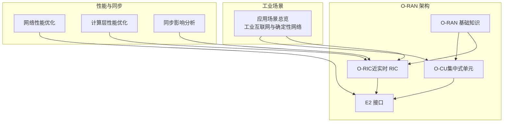
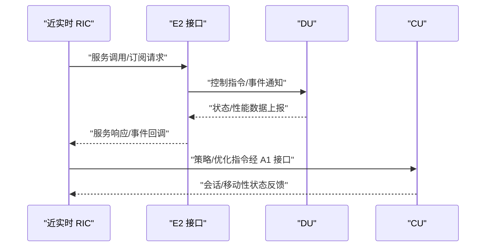
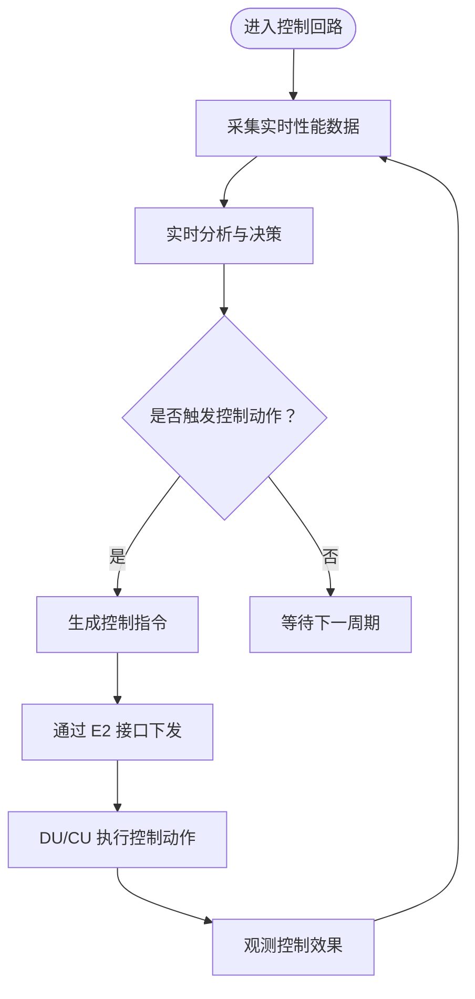
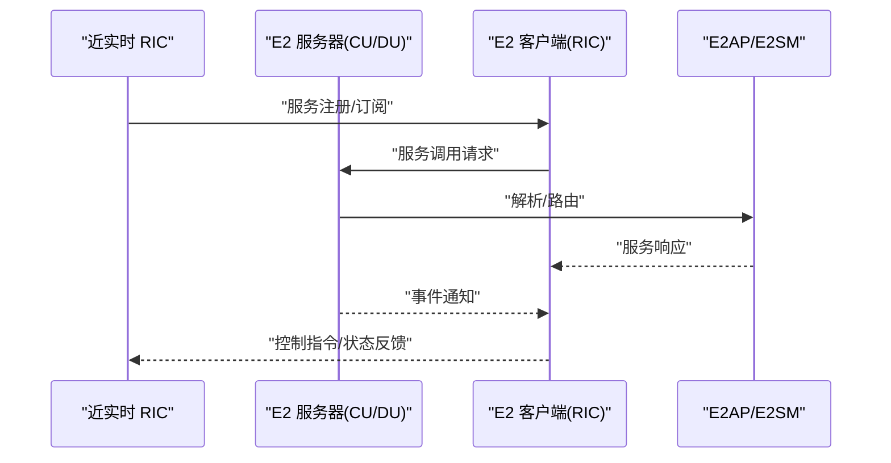
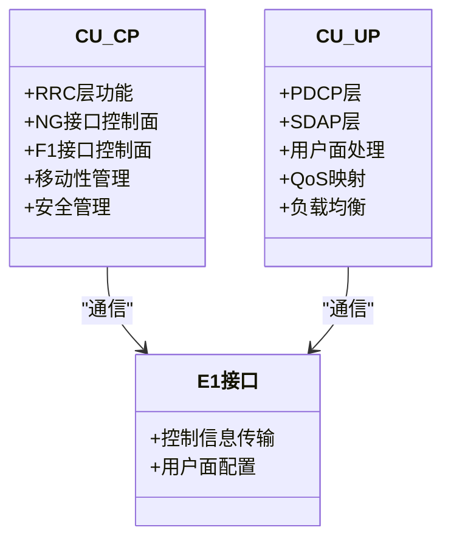
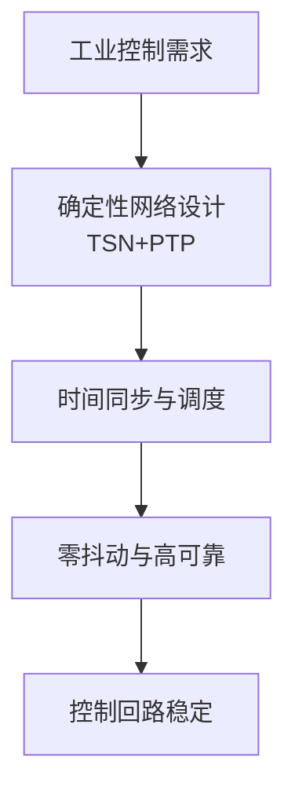
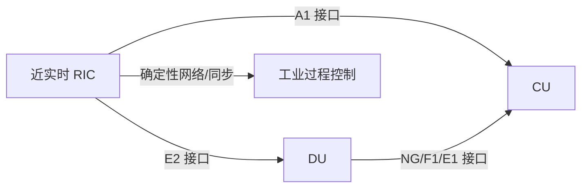
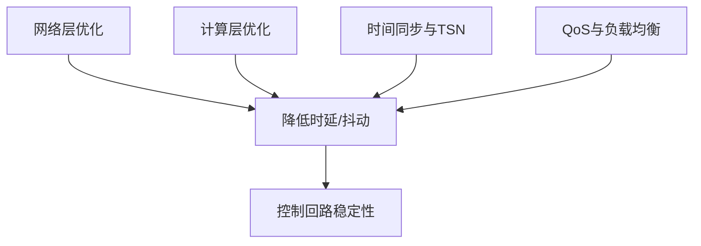
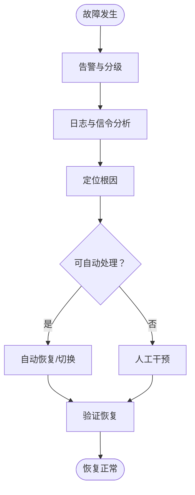

# 实时过程控制

<cite>
**本文引用的文件**
- [O-RAN 基础知识](file://01-architecture-system/readme.md)
- [O-RIC（RAN 智能控制器）](file://02-core-components/o-ric.md)
- [E2 接口](file://03-interface-standards/e2-interface.md)
- [O-CU（集中式单元）](file://02-core-components/o-cu.md)
- [应用场景总览](file://10-application-scenarios/readme.md)
- [性能优化框架（网络层）](file://26-performance-optimization/network-optimization/network-performance-tuning.md)
- [性能优化框架（计算层）](file://14-operations-management/performance-optimization/performance-optimization-framework-zh.md)
- [同步影响分析（性能影响）](file://04-disaggregation-options/performance-impact.md)
</cite>

## 目录
1. [引言](#引言)
2. [项目结构](#项目结构)
3. [核心组件](#核心组件)
4. [架构总览](#架构总览)
5. [详细组件分析](#详细组件分析)
6. [依赖关系分析](#依赖关系分析)
7. [性能考虑](#性能考虑)
8. [故障处理指南](#故障处理指南)
9. [结论](#结论)
10. [附录](#附录)

## 引言
本文件面向“实时过程控制”主题，围绕 O-RAN 在工业过程控制中的应用，系统梳理控制回路设计、实时数据采集、控制算法实现与执行器驱动机制，明确控制延迟要求、确定性网络保障、控制逻辑编程与安全联锁系统，并给出控制策略设计、参数调节方法与故障处理机制。文档以 O-RAN 架构中的 RIC、CU/DU、接口与性能优化实践为基础，结合工业互联网对低时延、高可靠与确定性的严格要求，形成可落地的技术方案与运维指南。

## 项目结构
本仓库提供了 O-RAN 架构、核心组件、接口标准、应用场景与性能优化等方面的系统化资料。与实时过程控制直接相关的内容主要集中在：
- 架构与核心组件：O-RAN 基础知识、O-RIC、O-CU
- 接口与实时通信：E2 接口
- 工业场景与确定性网络：应用场景总览
- 性能与同步：网络性能优化、计算层优化、同步影响分析

**图示来源**
- [O-RAN 基础知识](file://01-architecture-system/readme.md#L1-L161)
- [O-RIC（RAN 智能控制器）](file://02-core-components/o-ric.md#L1-L437)
- [E2 接口](file://03-interface-standards/e2-interface.md#L1-L337)
- [O-CU（集中式单元）](file://02-core-components/o-cu.md#L1-L419)
- [应用场景总览](file://10-application-scenarios/readme.md#L1-L470)
- [性能优化框架（网络层）](file://26-performance-optimization/network-optimization/network-performance-tuning.md#L1-L98)
- [性能优化框架（计算层）](file://14-operations-management/performance-optimization/performance-optimization-framework-zh.md#L1-L342)
- [同步影响分析（性能影响）](file://04-disaggregation-options/performance-impact.md#L119-L166)

**章节来源**
- [O-RAN 基础知识](file://01-architecture-system/readme.md#L1-L161)
- [O-RIC（RAN 智能控制器）](file://02-core-components/o-ric.md#L1-L437)
- [E2 接口](file://03-interface-standards/e2-interface.md#L1-L337)
- [O-CU（集中式单元）](file://02-core-components/o-cu.md#L1-L419)
- [应用场景总览](file://10-application-scenarios/readme.md#L1-L470)
- [性能优化框架（网络层）](file://26-performance-optimization/network-optimization/network-performance-tuning.md#L1-L98)
- [性能优化框架（计算层）](file://14-operations-management/performance-optimization/performance-optimization-framework-zh.md#L1-L342)
- [同步影响分析（性能影响）](file://04-disaggregation-options/performance-impact.md#L119-L166)

## 核心组件
- O-RIC（近实时 RIC）：毫秒级控制闭环，基于 E2 接口与 CU/DU 实时交互，执行策略与优化指令，提供 xApps 部署环境，支撑工业控制的实时性与智能化。
- O-CU（集中式单元）：负责高层协议栈功能，控制面与用户面分离，提供 NG/F1/E1 接口，支撑业务会话、移动性与 QoS 管理。
- E2 接口：基于 SCTP/STREAMS 的服务化接口，支持服务发现、调用、事件通知与订阅管理，是 RIC 与 CU/DU 通信的关键通道。
- 工业场景与确定性网络：强调工业互联网的低时延、零抖动与高可靠，提出 TSNTSN 集成、时间同步与调度机制。

**章节来源**
- [O-RIC（RAN 智能控制器）](file://02-core-components/o-ric.md#L7-L32)
- [O-CU（集中式单元）](file://02-core-components/o-cu.md#L7-L61)
- [E2 接口](file://03-interface-standards/e2-interface.md#L9-L32)
- [应用场景总览](file://10-application-scenarios/readme.md#L81-L116)

## 架构总览
O-RIC 作为智能化核心，通过 E2 接口与 CU/DU 交互，完成实时控制闭环；O-CU 承担高层协议与 QoS 管理，二者共同满足工业过程控制对低时延与高可靠的要求。工业场景强调确定性网络与时间同步，以保障控制回路的稳定与安全。

**图示来源**
- [O-RIC（RAN 智能控制器）](file://02-core-components/o-ric.md#L21-L31)
- [E2 接口](file://03-interface-standards/e2-interface.md#L11-L32)
- [O-CU（集中式单元）](file://02-core-components/o-cu.md#L17-L27)

**章节来源**
- [O-RIC（RAN 智能控制器）](file://02-core-components/o-ric.md#L73-L117)
- [E2 接口](file://03-interface-standards/e2-interface.md#L63-L90)
- [O-CU（集中式单元）](file://02-core-components/o-cu.md#L101-L121)

## 详细组件分析

### 近实时 RIC 的控制回路设计
- 实时网络控制：毫秒级闭环，响应时间小于 10ms，基于 E2 接口与 CU/DU 交互，执行策略与优化指令。
- 实时数据处理：收集 CU/DU 的实时性能数据，执行实时分析与决策，生成控制指令并下发。
- xApps 部署环境：提供统一服务接口与开发框架，支持第三方应用部署与协作。

**图示来源**
- [O-RIC（RAN 智能控制器）](file://02-core-components/o-ric.md#L9-L31)

**章节来源**
- [O-RIC（RAN 智能控制器）](file://02-core-components/o-ric.md#L7-L32)

### E2 接口的实时数据采集与控制指令下发
- 服务化架构：支持服务发现、调用、事件通知与订阅管理。
- 协议栈：基于 SCTP/STREAMS，提供可靠传输与多流分离。
- 部署与优化：集中式/分布式/混合部署，结合网络优化与 QoS 保障。

**图示来源**
- [E2 接口](file://03-interface-standards/e2-interface.md#L9-L32)
- [E2 接口](file://03-interface-standards/e2-interface.md#L65-L90)

**章节来源**
- [E2 接口](file://03-interface-standards/e2-interface.md#L90-L147)

### O-CU 的高层协议与 QoS 管理
- CU-CP：RRC、NG 接口控制面、F1 接口控制面、移动性与安全管理。
- CU-UP：PDCP/SDAP 层、用户面处理、QoS 映射与端到端保障。
- 接口：NG/F1/E1/Xn，支持控制面与用户面分离。

**图示来源**
- [O-CU（集中式单元）](file://02-core-components/o-cu.md#L7-L61)
- [O-CU（集中式单元）](file://02-core-components/o-cu.md#L101-L121)

**章节来源**
- [O-CU（集中式单元）](file://02-core-components/o-cu.md#L1-L419)

### 工业过程控制的确定性网络与时间同步
- 网络指标：可靠性 >99.999%，时延 <1ms；TSN 集成、时间同步（IEEE 1588 PTP）、时间感知调度与流量整形。
- 集成点：SCADA/DCS/PLC/MES 系统，协议转换与安全隔离。

**图示来源**
- [应用场景总览](file://10-application-scenarios/readme.md#L81-L116)

**章节来源**
- [应用场景总览](file://10-application-scenarios/readme.md#L81-L116)

## 依赖关系分析
- O-RIC 依赖 E2 接口与 CU/DU 的服务模型与事件通知，实现毫秒级控制闭环。
- O-CU 通过 NG/F1/E1 接口与 RIC 协作，提供高层协议与 QoS 管理。
- 工业场景对确定性网络与时间同步提出更高要求，影响接口与传输网络的部署与优化。

**图示来源**
- [O-RIC（RAN 智能控制器）](file://02-core-components/o-ric.md#L21-L51)
- [O-CU（集中式单元）](file://02-core-components/o-cu.md#L101-L121)
- [应用场景总览](file://10-application-scenarios/readme.md#L81-L116)

**章节来源**
- [O-RIC（RAN 智能控制器）](file://02-core-components/o-ric.md#L118-L192)
- [O-CU（集中式单元）](file://02-core-components/o-cu.md#L162-L195)
- [应用场景总览](file://10-application-scenarios/readme.md#L81-L116)

## 性能考虑
- 网络层优化：巨帧、队列调度、优先级标记、NUMA 绑定、内核参数与 BBR 拥塞控制，降低时延与抖动。
- 计算层优化：CPU 亲和性、进程优先级、内核调度器参数、容器资源请求/限制与探针配置。
- 同步与确定性：PTP/SyncE 同步、分层/混合同步架构、TSN 调度与流量整形，满足工业控制的零抖动与高可靠。
- QoS 与负载均衡：DRB/5QI 参数、WFQ/SP 调度、负载预测与动态资源池，保障关键控制流量。

**图示来源**
- [性能优化框架（网络层）](file://26-performance-optimization/network-optimization/network-performance-tuning.md#L1-L98)
- [性能优化框架（计算层）](file://14-operations-management/performance-optimization/performance-optimization-framework-zh.md#L1-L342)
- [同步影响分析（性能影响）](file://04-disaggregation-options/performance-impact.md#L119-L166)

**章节来源**
- [性能优化框架（网络层）](file://26-performance-optimization/network-optimization/network-performance-tuning.md#L1-L98)
- [性能优化框架（计算层）](file://14-operations-management/performance-optimization/performance-optimization-framework-zh.md#L1-L342)
- [同步影响分析（性能影响）](file://04-disaggregation-options/performance-impact.md#L119-L166)

## 故障处理指南
- 常见故障：E2 接口连接断连、消息传输失败、服务调用失败、性能劣化、资源不足、配置错误。
- 定位方法：告警分析、日志分析、信令分析、测试验证。
- 恢复手段：重启服务、调整配置、资源扩容、接口修复、应用重启。
- 安全加固：网络分段、访问控制、加密传输、身份认证与授权、定期安全扫描与审计。

**图示来源**
- [E2 接口](file://03-interface-standards/e2-interface.md#L170-L189)
- [O-RIC（RAN 智能控制器）](file://02-core-components/o-ric.md#L261-L282)

**章节来源**
- [E2 接口](file://03-interface-standards/e2-interface.md#L148-L240)
- [O-RIC（RAN 智能控制器）](file://02-core-components/o-ric.md#L214-L301)

## 结论
O-RAN 通过 O-RIC 的近实时控制与 E2 接口的低时延通信，结合 O-CU 的高层协议与 QoS 管理，为工业过程控制提供了可扩展、智能化与确定性的网络基础。配合 TSN/PTP 同步、网络与计算层性能优化，以及完善的监控与故障处理机制，可满足工业控制对精度、响应速度与系统稳定性的关键性能指标。

## 附录
- 控制策略设计建议
  - 采用分层控制：上层策略由 Non-RT RIC 生成，下层执行由 Near-RT RIC 保障，E2 接口承载闭环指令。
  - 参数调节方法：基于 KPI（时延/抖动/吞吐量/可靠性）进行闭环调节，结合 QoS 与负载均衡策略。
  - 安全联锁系统：在 RIC 侧实现 xApps 的访问控制与异常检测，在网络侧实施分段与加密，确保控制指令与数据安全。
- 工业控制关键指标
  - 精度：控制回路稳态误差与跟踪精度满足工艺要求。
  - 响应速度：端到端时延 <1ms，抖动 <2ms，可靠性 >99.999%。
  - 稳定性：具备抗干扰、自愈与预测性维护能力，支持故障演练与恢复测试。