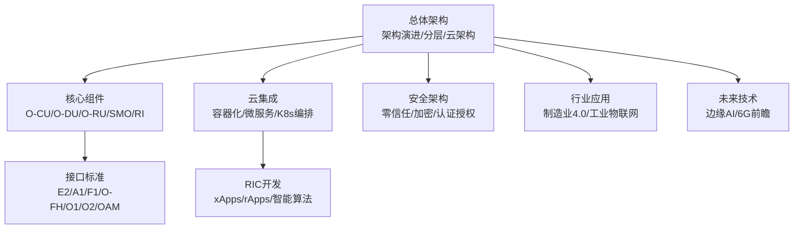
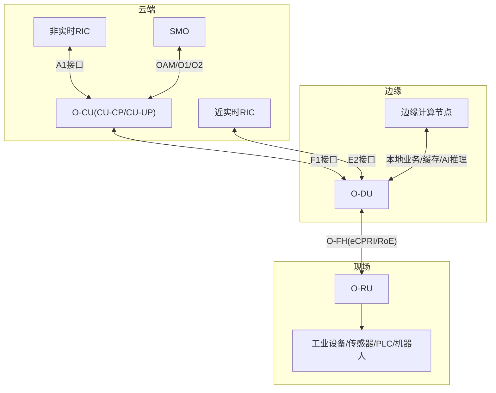
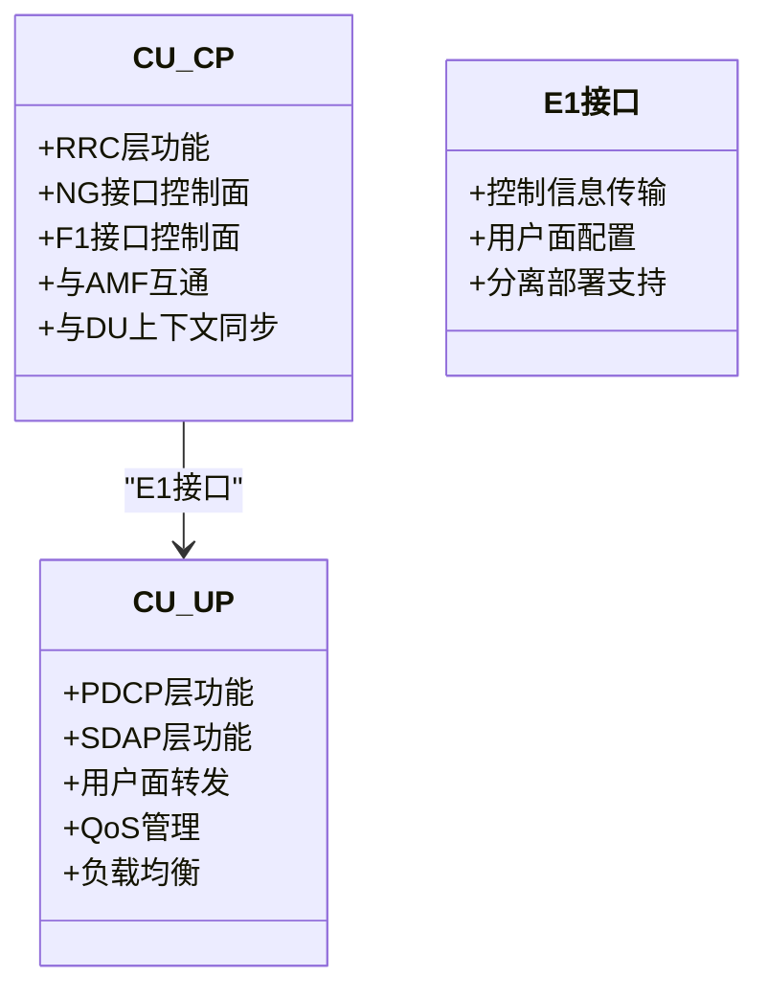
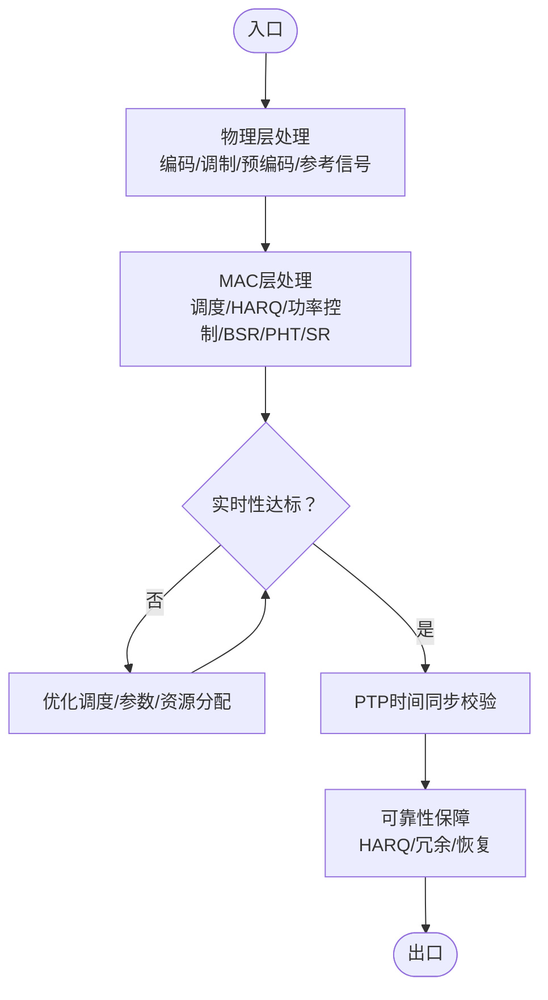
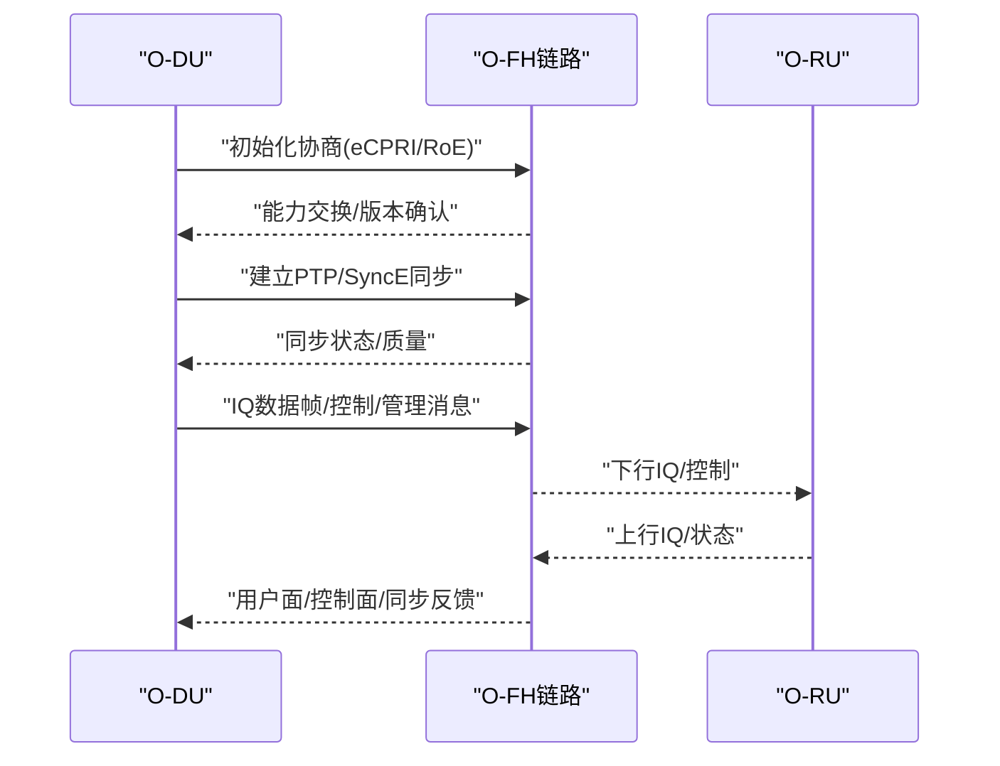
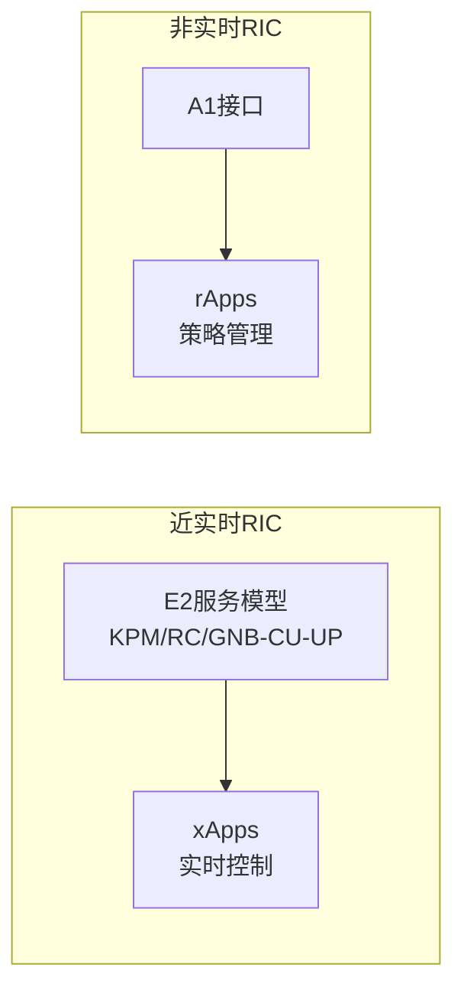
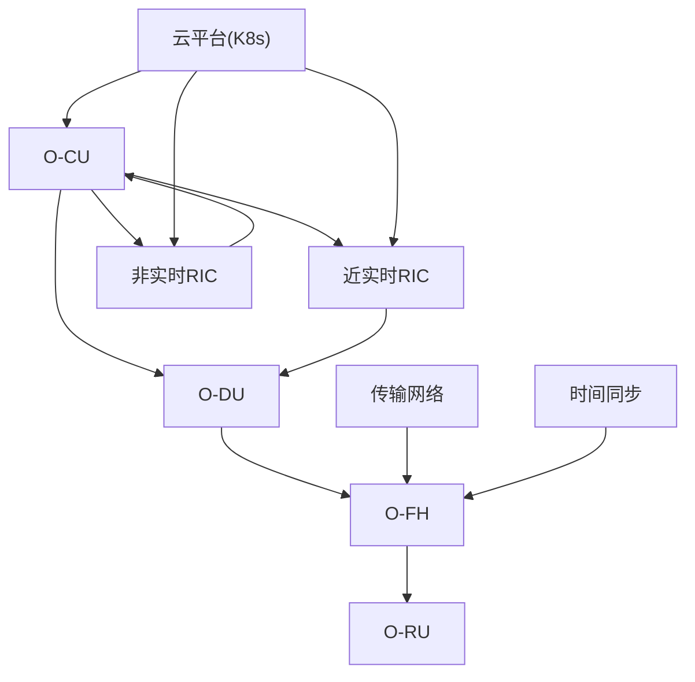
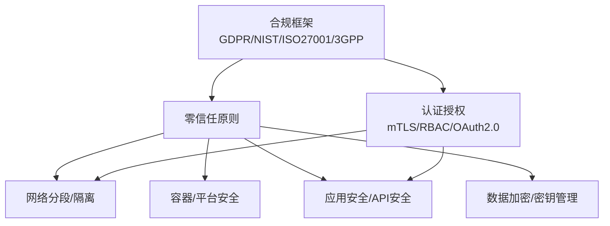

# 工业4.0集成应用

<cite>
**本文引用的文件**
- [O-RAN架构演进](file://01-architecture-system/architecture-evolution.md)
- [O-RAN分层架构](file://01-architecture-system/layered-architecture.md)
- [O-RAN云架构](file://01-architecture-system/o-cloud-architecture.md)
- [O-RAN核心组件：集中式单元(O-CU)](file://02-core-components/o-cu.md)
- [O-RAN核心组件：分布式单元(O-DU)](file://02-core-components/o-du.md)
- [O-RAN接口标准：开放前传接口(O-FH)](file://03-interface-standards/o-fh-interface.md)
- [O-RAN接口标准：E2接口](file://03-interface-standards/e2-interface.md)
- [O-RAN接口标准：A1接口](file://03-interface-standards/a1-interface.md)
- [O-RAN接口标准：F1接口](file://03-interface-standards/f1-interface.md)
- [O-RAN接口标准：O1接口](file://03-interface-standards/o1-interface.md)
- [O-RAN接口标准：O2接口](file://03-interface-standards/o2-interface.md)
- [O-RAN接口标准：OAM接口](file://03-interface-standards/oam-interface.md)
- [O-RAN解耦选项：部署场景](file://04-disaggregation-options/deployment-scenarios.md)
- [O-RAN云集成：云原生架构](file://05-cloud-integration/cloud-native-architecture.md)
- [O-RANRIC开发：高级技术](file://07-ric-development/readme-zh.md)
- [O-RAN安全架构参考](file://12-security-privacy/security-architecture/security-reference-architecture.md)
- [O-RAN行业解决方案：制造业4.0](file://16-industry-solutions/manufacturing-4.0/smart-manufacturing-implementation.md)
- [O-RAN行业解决方案：制造业4.0概览](file://16-industry-solutions/readme.md)
- [O-RAN未来技术路线图](file://15-future-development/technology-trends/technology-evolution-roadmap.md)
- [O-RAN专利总表](file://comprehensive-oran-patent-table.md)
</cite>

## 目录
1. [引言](#引言)
2. [项目结构](#项目结构)
3. [核心组件](#核心组件)
4. [架构总览](#架构总览)
5. [详细组件分析](#详细组件分析)
6. [依赖关系分析](#依赖关系分析)
7. [性能与可靠性考量](#性能与可靠性考量)
8. [安全与合规](#安全与合规)
9. [实施案例与部署策略](#实施案例与部署策略)
10. [技术选型与最佳实践](#技术选型与最佳实践)
11. [故障排查与运维](#故障排查与运维)
12. [结论](#结论)
13. [附录](#附录)

## 引言
本文件面向工业4.0集成应用，系统阐述O-RAN在智能制造中的落地方法论，覆盖网络架构设计、工业物联网连接、实时过程控制、预测性维护与数字化生产线建设等关键技术，并给出工业环境下的网络需求、可靠性要求、实时性保障与安全防护建议。文档以O-RAN核心组件与接口标准为基础，结合云原生与RIC（RIC近实时/非实时）能力，提供可操作的实施路径与部署策略。

## 项目结构
该知识库围绕O-RAN架构、核心组件、接口标准、解耦与部署、云集成、RIC开发、安全与合规、行业应用、未来技术等多个维度组织内容，形成“总体架构—关键组件—接口协议—云原生—智能算法—安全合规—行业应用—未来演进”的完整知识体系。

## 核心组件
- 集中式单元（O-CU）：负责非实时高层协议栈，控制面（CU-CP）与用户面（CU-UP）分离，支持集中或分布式部署，提供高可用与弹性扩缩容能力。
- 分布式单元（O-DU）：负责物理层与部分MAC层处理，强调低延迟与高可靠性，支持边缘部署与确定性网络。
- 开放前传接口（O-FH）：标准化DU与RU通信，支持eCPRI/RoE协议，提供高带宽、低延迟与高精度同步能力。
- 近实时RIC（Near-RT RIC）与非实时RIC（Non-RT RIC）：前者支撑毫秒级控制闭环，后者负责策略管理与长期优化，二者协同实现闭环智能优化。

章节来源
- file://02-core-components/o-cu.md#L1-L419
- file://02-core-components/o-du.md#L1-L415
- file://03-interface-standards/o-fh-interface.md#L1-L397
- file://07-ric-development/readme-zh.md#L1-L340

## 架构总览
O-RAN在工业4.0中的网络架构应遵循“云-边-端”协同，结合云原生弹性与边缘计算低延迟，实现控制面集中、用户面就近的部署形态。核心网络由O-CU/O-DU/O-RU构成，通过O-FH连接RU，借助E2/A1接口与RIC完成智能控制与策略管理。

图表来源
- [O-RAN核心组件：集中式单元(O-CU)](file://02-core-components/o-cu.md#L1-L419)
- [O-RAN核心组件：分布式单元(O-DU)](file://02-core-components/o-du.md#L1-L415)
- [O-RAN接口标准：开放前传接口(O-FH)](file://03-interface-standards/o-fh-interface.md#L1-L397)
- [O-RAN接口标准：E2接口](file://03-interface-standards/e2-interface.md)
- [O-RAN接口标准：A1接口](file://03-interface-standards/a1-interface.md)
- [O-RAN接口标准：F1接口](file://03-interface-standards/f1-interface.md)
- [O-RAN接口标准：O1/O2/OAM接口](file://03-interface-standards/o1-interface.md)
- [O-RAN接口标准：O1/O2/OAM接口](file://03-interface-standards/o2-interface.md)
- [O-RAN接口标准：OAM接口](file://03-interface-standards/oam-interface.md)

## 详细组件分析

### O-CU：集中式控制与用户面处理
- 功能分层：CU-CP（RRC/NG/F1控制面）、CU-UP（PDCP/SDAP/用户面转发），E1接口连接。
- 部署形态：集成/分离/分布式/多租户，结合Kubernetes实现弹性扩缩容与高可用。
- 运维要点：监控信令延迟、连接数、切换成功率、资源利用率；配置一致性与变更管理；性能优化（缓存、QoS、负载均衡）。

图表来源
- [O-RAN核心组件：集中式单元(O-CU)](file://02-core-components/o-cu.md#L1-L120)

章节来源
- file://02-core-components/o-cu.md#L1-L419

### O-DU：物理层与MAC层实时处理
- 物理层：传输信道编码、调制映射、层映射/预编码、参考信号生成、物理信道生成。
- MAC层：随机接入、调度、HARQ、功率控制、逻辑信道优先级。
- 实时性与可靠性：端到端延迟≤3ms，可用性≥99.999%，PTP时间同步精度≤1μs。
- 部署：集中/分布式/混合部署，结合边缘计算降低前传延迟。

图表来源
- [O-RAN核心组件：分布式单元(O-DU)](file://02-core-components/o-du.md#L1-L120)

章节来源
- file://02-core-components/o-du.md#L1-L415

### O-FH：开放前传接口与同步
- 用户面：IQ数据传输、压缩、采样率适配；控制面：RU配置/状态/故障管理；同步：PTP/SyncE，边界时钟/透明时钟。
- 部署：光纤/无线/混合传输，链路聚合与冗余；QoS优先保障同步与控制流量。
- 运维：接口状态/带宽/延迟/误码监控；RU状态/温度/功率/同步状态；故障定位与恢复。

图表来源
- [O-RAN接口标准：开放前传接口(O-FH)](file://03-interface-standards/o-fh-interface.md#L1-L120)

章节来源
- file://03-interface-standards/o-fh-interface.md#L1-L397

### RIC：近实时控制与非实时策略
- 近实时RIC：E2接口服务模型（KPM/RC/GNB-CU-UP），订阅/指示机制，毫秒级控制闭环。
- 非实时RIC：A1接口策略管理，rApps实现策略生成与分发，机器学习与预测优化。
- 部署：容器化/K8s编排，微服务架构，服务网格与消息队列支撑高可用与弹性。

图表来源
- [O-RANRIC开发：高级技术](file://07-ric-development/readme-zh.md#L1-L120)

章节来源
- file://07-ric-development/readme-zh.md#L1-L340

## 依赖关系分析
- 组件耦合：O-DU与O-FH强耦合（带宽、延迟、同步），O-CU与O-DU通过F1接口耦合，RIC通过E2/A1接口与DU/CU交互。
- 外部依赖：传输网络（光/无线）、时间同步（PTP/SyncE）、云平台（Kubernetes、容器编排、监控告警）。
- 风险点：前传带宽不足、同步精度不达标、控制面/用户面QoS缺失、边缘与核心协同不畅。

图表来源
- [O-RAN核心组件：分布式单元(O-DU)](file://02-core-components/o-du.md#L68-L86)
- [O-RAN接口标准：开放前传接口(O-FH)](file://03-interface-standards/o-fh-interface.md#L117-L140)
- [O-RAN接口标准：E2接口](file://03-interface-standards/e2-interface.md)
- [O-RAN接口标准：A1接口](file://03-interface-standards/a1-interface.md)
- [O-RAN云集成：云原生架构](file://05-cloud-integration/cloud-native-architecture.md#L65-L122)

章节来源
- file://02-core-components/o-du.md#L68-L86
- file://03-interface-standards/o-fh-interface.md#L117-L140
- file://05-cloud-integration/cloud-native-architecture.md#L65-L122

## 性能与可靠性考量
- 网络需求：前传带宽按MIMO/带宽/用户数计算，延迟≤3ms（端到端），同步精度≤100ns（时间）。
- 可靠性：系统可用性≥99.999%，故障恢复时间≤50ms，HARQ保障数据传输。
- 实时性保障：边缘部署、确定性网络、QoS优先级、PTP优化。
- 弹性与扩展：Kubernetes自动扩缩容、HPA/VPA、多副本与故障转移。

章节来源
- file://02-core-components/o-du.md#L51-L67
- file://03-interface-standards/o-fh-interface.md#L117-L140
- file://05-cloud-integration/cloud-native-architecture.md#L123-L176

## 安全与合规
- 零信任模型：网络分段、最小权限、持续验证、微分段。
- 多层防护：物理安全、网络隔离、容器与平台安全、应用安全、数据加密与密钥管理。
- 认证与授权：mTLS相互认证、RBAC、OAuth2.0/OIDC、API网关安全。
- 合规框架：GDPR、NIST、ISO27001、3GPP安全要求。

图表来源
- [O-RAN安全架构参考](file://12-security-privacy/security-architecture/security-reference-architecture.md#L8-L71)

章节来源
- file://12-security-privacy/security-architecture/security-reference-architecture.md#L1-L559

## 实施案例与部署策略
- 边缘工业场景：O-DU分布式部署于工厂边缘，与边缘计算平台集成，实现低延迟（<1ms）、高可靠（99.999%）与海量IoT连接（5000+）。
- 混合云部署：核心云部署SMO/Non-RT RIC，区域云部署CU/Near-RT RIC，边缘云部署DU/部分CU，统一K8s编排，平衡集中管理与边缘性能。
- 大型运营商案例：CU-CP集中、CU-UP分布式，传输网络冗余与QoS保障，实现大规模用户接入与多业务支持。

章节来源
- file://02-core-components/o-du.md#L370-L410
- file://05-cloud-integration/cloud-native-architecture.md#L235-L296
- file://02-core-components/o-cu.md#L362-L414

## 技术选型与最佳实践
- 硬件选型：O-DU需高性能CPU/DSP/FPGA，O-CU采用通用服务器+加速能力；O-FH采用10G/25G/100G以太网与PTP/SyncE。
- 部署形态：集中式/分布式/混合云，结合业务SLA与传输条件选择。
- 云原生：容器化、微服务、K8s编排、HPA/VPA、服务网格、消息队列、统一监控与告警。
- RIC应用：xApps实现近实时控制，rApps实现策略管理；AI/ML用于异常检测、预测性维护、资源优化。
- 安全：mTLS、RBAC、加密、审计、威胁检测与自动响应。

章节来源
- file://03-interface-standards/o-fh-interface.md#L179-L198
- file://02-core-components/o-cu.md#L124-L161
- file://02-core-components/o-du.md#L150-L170
- file://05-cloud-integration/cloud-native-architecture.md#L177-L234
- file://07-ric-development/readme-zh.md#L34-L98
- file://12-security-privacy/security-architecture/security-reference-architecture.md#L247-L337

## 故障排查与运维
- 监控体系：指标/日志/追踪一体化，分层监控（基础设施/容器/服务/业务），告警分级与关联分析。
- 告警处理：告警抑制、自动处理、根因分析与恢复；建立标准化流程与演练机制。
- 配置管理：配置模板化、一致性校验、变更流程与回滚；定期备份与基线对比。
- 性能优化：接口带宽/延迟优化、同步精度提升、资源分配与负载均衡、容量规划与预测。

章节来源
- file://03-interface-standards/o-fh-interface.md#L199-L288
- file://02-core-components/o-du.md#L224-L308
- file://02-core-components/o-cu.md#L197-L282

## 结论
O-RAN为工业4.0提供了开放、灵活、可扩展的网络底座。通过O-CU/O-DU/O-FH的协同与云原生、RIC智能能力的融合，可在工业场景中实现低延迟、高可靠、可预测的网络服务。结合安全与合规框架，可满足制造业对实时性、可靠性与安全性的严苛要求，支撑智能制造、工业物联网、预测性维护与数字化生产线建设。

## 附录

### 工业4.0应用要点
- 智能制造网络架构：控制面集中、用户面边缘化，结合确定性网络与QoS保障。
- 工业物联网连接：O-FH标准化前传，支持高密度IoT设备接入与低功耗广覆盖。
- 实时过程控制：近实时RIC与xApps实现毫秒级闭环控制。
- 预测性维护：基于AI/ML的异常检测与故障预测，结合A1策略实现维护优化。
- 数字化生产线：边缘AI推理与仿真优化，结合数字孪生实现虚实映射与优化。

章节来源
- file://16-industry-solutions/readme.md#L8-L12
- file://16-industry-solutions/manufacturing-4.0/smart-manufacturing-implementation.md
- file://07-ric-development/readme-zh.md#L99-L150

### 未来技术与专利
- 边缘AI推理优化、分布式机器学习、实时智能决策等前沿技术专利布局。
- 6G太赫兹通信、空天地海一体化网络等未来演进方向。

章节来源
- file://comprehensive-oran-patent-table.md#L87-L174
- file://15-future-development/technology-trends/technology-evolution-roadmap.md#L50-L68