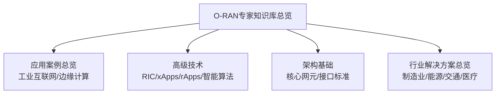
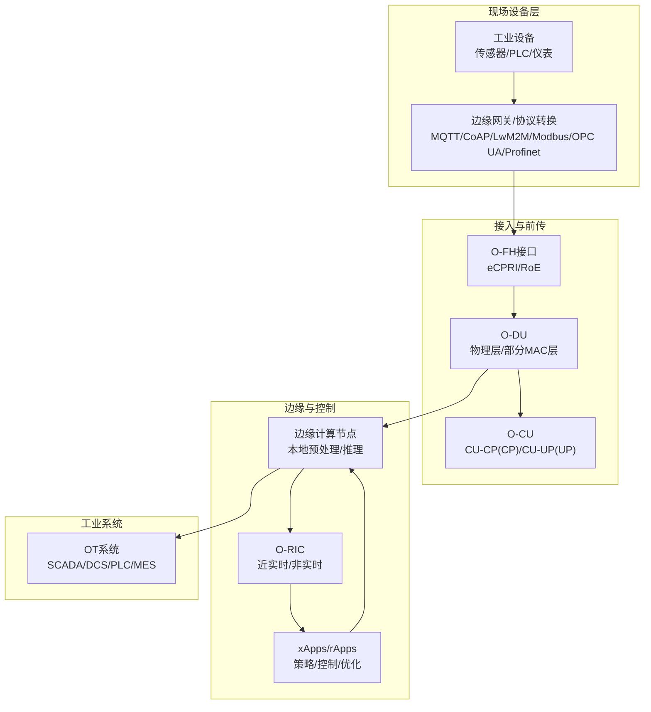
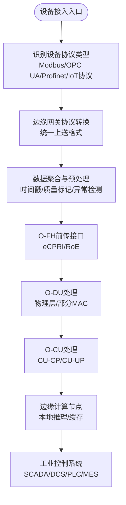
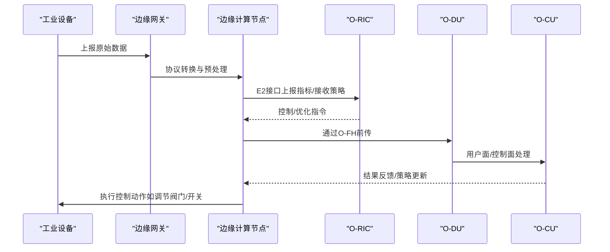
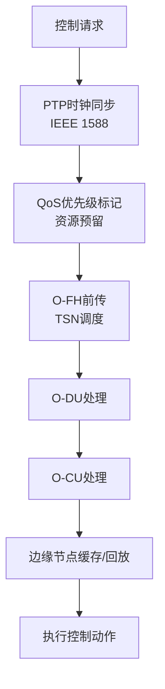
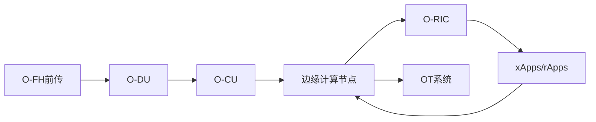

# 工业物联网连接

<cite>
**本文引用的文件**
- [O-RAN专家知识库总览](file://README.md)
- [O-RAN应用案例总览](file://10-application-scenarios/readme.md)
- [O-RAN高级技术](file://07-ric-development/readme.md)
- [O-RAN架构基础](file://01-architecture-system/readme.md)
- [O-RAN行业解决方案总览](file://16-industry-solutions/readme.md)
</cite>

## 目录
1. [引言](#引言)
2. [项目结构](#项目结构)
3. [核心组件](#核心组件)
4. [架构总览](#架构总览)
5. [详细组件分析](#详细组件分析)
6. [依赖分析](#依赖分析)
7. [性能考虑](#性能考虑)
8. [故障排查指南](#故障排查指南)
9. [结论](#结论)
10. [附录](#附录)

## 引言
本文件面向工业物联网（IIoT）连接场景，围绕O-RAN在工业领域的应用进行系统化技术阐述。重点覆盖传感器网络集成、设备协议转换、数据采集与传输机制，以及工业协议兼容性（如Modbus、OPC UA、Profinet等）。同时结合边缘计算节点部署、数据预处理与实时数据同步策略，给出可落地的连接方案设计、设备接入配置与数据流管理建议，并总结工业环境下通信距离、抗干扰能力与功耗优化等关键技术要点。

## 项目结构
该知识库以主题域划分，便于按需检索O-RAN在工业场景中的架构、接口、应用与最佳实践。与工业物联网连接直接相关的内容主要分布在以下目录：
- 应用场景：包含工业互联网、边缘计算、网络切片、确定性网络等章节，提供工业场景的网络指标、部署策略与挑战
- 高级技术：包含RIC架构、xApps/rApps、智能算法与性能优化，支撑边缘智能与实时控制
- 架构基础：提供O-RU/O-DU/O-CU、O-FH/E2/A1等接口与功能边界，奠定工业连接的底层能力
- 行业解决方案：提供制造业、能源、交通、医疗等垂直行业的定制化方案要素与成功因素

**图示来源**
- [O-RAN专家知识库总览](file://README.md#L1-L472)
- [O-RAN应用案例总览](file://10-application-scenarios/readme.md#L1-L470)
- [O-RAN高级技术](file://07-ric-development/readme.md#L1-L368)
- [O-RAN架构基础](file://01-architecture-system/readme.md#L1-L161)
- [O-RAN行业解决方案总览](file://16-industry-solutions/readme.md#L1-L58)

**章节来源**
- [O-RAN专家知识库总览](file://README.md#L1-L472)

## 核心组件
- 工业连接的“端侧”能力由O-RU/O-DU负责，其中O-DU承担物理层与部分MAC层功能，满足工业控制对低时延与确定性的要求
- “云侧”能力由O-CU（含CU-CP/CU-UP）与O-RIC协同提供，CU-CP负责RRC层与NG接口控制面，CU-UP负责PDCP/SDAP用户面，O-RIC（近实时/非实时）支撑策略下发与实时控制
- 边缘计算节点可与O-DU/O-CU共址或就近部署，通过E2接口与RIC协作，实现本地化数据预处理与实时决策
- O-FH接口（eCPRI/RoE）作为前传标准，为工业场景提供高带宽、低抖动的前传承载

**章节来源**
- [O-RAN架构基础](file://01-architecture-system/readme.md#L15-L26)
- [O-RAN应用案例总览](file://10-application-scenarios/readme.md#L81-L117)
- [O-RAN高级技术](file://07-ric-development/readme.md#L8-L33)

## 架构总览
下图展示工业物联网连接在O-RAN体系中的端到端架构：工业设备经边缘网关/协议转换接入，通过O-FH前传至DU/CU，边缘计算节点在DU/CU附近或独立部署，实现数据预处理与实时控制闭环，最终与工业控制系统（如SCADA/DCS/PLC/MES）对接。

**图示来源**
- [O-RAN架构基础](file://01-architecture-system/readme.md#L27-L34)
- [O-RAN应用案例总览](file://10-application-scenarios/readme.md#L45-L80)
- [O-RAN高级技术](file://07-ric-development/readme.md#L21-L33)

## 详细组件分析

### 工业协议兼容与设备接入
- Modbus：适用于传统工业设备的串口/以太网接入，可通过边缘网关进行协议转换与汇聚，再经O-FH上传至DU/CU
- OPC UA：面向工业自动化与信息系统的统一通信框架，支持跨厂商互操作，适合与MES/SCADA系统对接
- Profinet：实时工业以太网协议，强调确定性与时钟同步，适合高精度控制场景
- 其他协议：MQTT/CoAP/LwM2M等物联网协议用于低功耗与广覆盖场景，边缘网关负责协议适配与数据聚合

**图示来源**
- [O-RAN应用案例总览](file://10-application-scenarios/readme.md#L66-L72)
- [O-RAN应用案例总览](file://10-application-scenarios/readme.md#L110-L116)
- [O-RAN架构基础](file://01-architecture-system/readme.md#L27-L34)

**章节来源**
- [O-RAN应用案例总览](file://10-application-scenarios/readme.md#L66-L72)
- [O-RAN应用案例总览](file://10-application-scenarios/readme.md#L110-L116)

### 边缘计算节点部署与数据预处理
- 部署位置：与O-DU/O-CU共址或就近部署，减少前传与空口时延
- 预处理能力：时间同步校正、异常检测、数据压缩与聚合、轻量模型推理
- 与RIC协作：通过E2接口上报指标与接收控制指令，形成闭环控制
- 资源管理：基于业务需求动态调度CPU/内存/存储，结合容器编排实现弹性伸缩

**图示来源**
- [O-RAN应用案例总览](file://10-application-scenarios/readme.md#L45-L58)
- [O-RAN高级技术](file://07-ric-development/readme.md#L60-L78)
- [O-RAN高级技术](file://07-ric-development/readme.md#L15-L26)

**章节来源**
- [O-RAN应用案例总览](file://10-application-scenarios/readme.md#L45-L58)
- [O-RAN高级技术](file://07-ric-development/readme.md#L60-L78)
- [O-RAN高级技术](file://07-ric-development/readme.md#L15-L26)

### 实时数据同步与确定性网络
- 工业控制对确定性有严格要求：低延迟、零抖动、高可靠
- O-RAN通过TSN（时间敏感网络）与O-FH协同，结合IEEE 1588高精度时钟同步，保障端到端确定性
- QoS机制：区分关键控制流量与一般监测流量，实施优先级标记与资源预留
- 边缘缓存与回放：在边缘节点建立缓存与回放缓冲，提升系统鲁棒性与可恢复性

**图示来源**
- [O-RAN应用案例总览](file://10-application-scenarios/readme.md#L103-L109)
- [O-RAN应用案例总览](file://10-application-scenarios/readme.md#L96-L102)

**章节来源**
- [O-RAN应用案例总览](file://10-application-scenarios/readme.md#L103-L109)
- [O-RAN应用案例总览](file://10-application-scenarios/readme.md#L96-L102)

### 工业协议兼容性与系统集成
- 协议适配：边缘网关负责协议转换与语义映射，确保与MES/SCADA/PLC等系统互通
- 安全隔离：采用多层防护（工业防火墙、DMZ、访问控制），保障OT网络安全
- 互操作性：遵循IEC 61850、ISA-95/97等工业标准，提升跨厂商系统集成能力

**章节来源**
- [O-RAN应用案例总览](file://10-application-scenarios/readme.md#L110-L116)
- [O-RAN行业解决方案总览](file://16-industry-solutions/readme.md#L8-L12)

## 依赖分析
- O-FH接口是前传承载的关键，其性能直接影响端到端时延与抖动
- O-RIC与xApps/rApps构成智能控制闭环，依赖E2接口的消息处理与策略下发
- 边缘计算与DU/CU紧密耦合，需要在资源调度与容错方面协同设计
- 工业系统（OT）与O-RAN的对接需兼顾实时性与安全性

**图示来源**
- [O-RAN架构基础](file://01-architecture-system/readme.md#L27-L34)
- [O-RAN高级技术](file://07-ric-development/readme.md#L21-L33)
- [O-RAN应用案例总览](file://10-application-scenarios/readme.md#L45-L80)

**章节来源**
- [O-RAN架构基础](file://01-architecture-system/readme.md#L27-L34)
- [O-RAN高级技术](file://07-ric-development/readme.md#L21-L33)
- [O-RAN应用案例总览](file://10-application-scenarios/readme.md#L45-L80)

## 性能考虑
- 时延与抖动：通过边缘前置、TSN调度、QoS预留与确定性网络技术，满足工业控制毫秒级时延与零抖动要求
- 带宽与可靠性：针对海量传感器与高分辨率视频监控，采用前传带宽规划与冗余设计，结合多路径与自愈保护
- 能耗优化：在设备侧采用休眠与批量上报，在网络侧采用动态睡眠与功率控制，在边缘侧采用模型压缩与缓存策略
- 可靠性：N+1冗余、快速故障检测与自动恢复、多路径路由与负载均衡

**章节来源**
- [O-RAN应用案例总览](file://10-application-scenarios/readme.md#L16-L22)
- [O-RAN应用案例总览](file://10-application-scenarios/readme.md#L81-L88)
- [O-RAN高级技术](file://07-ric-development/readme.md#L151-L169)

## 故障排查指南
- 端到端时延异常：检查边缘节点部署位置、O-FH前传质量、DU/CU资源占用与调度策略
- 协议互通失败：核查边缘网关协议映射规则、消息格式与字段一致性、系统间版本兼容性
- 实时控制失真：确认PTP时钟同步精度、TSN调度配置、QoS策略执行与缓冲区拥塞
- 安全事件：启用零信任访问控制、mTLS与API网关安全、审计日志与威胁检测联动

**章节来源**
- [O-RAN应用案例总览](file://10-application-scenarios/readme.md#L314-L351)
- [O-RAN高级技术](file://07-ric-development/readme.md#L171-L196)

## 结论
O-RAN为工业物联网连接提供了开放、灵活且可扩展的架构基础。通过O-FH前传、边缘计算与O-RIC智能控制闭环，结合确定性网络与QoS保障，可有效满足工业场景对低时延、高可靠与强安全的要求。配合边缘网关的协议适配与数据预处理，可实现从设备层到工业控制系统的无缝贯通，支撑智能制造、能源与交通等垂直行业的数字化转型。

## 附录
- 工业场景网络指标参考：可靠性>99.999%，端到端时延<1ms，确定性抖动接近零
- 部署建议：优先采用私有化O-RAN网络，结合边缘节点与TSN，实现端到端确定性
- 标准与规范：参考3GPP/ETSI/O-RAN联盟相关标准，确保互操作与合规

**章节来源**
- [O-RAN应用案例总览](file://10-application-scenarios/readme.md#L81-L117)
- [O-RAN专家知识库总览](file://README.md#L48-L58)