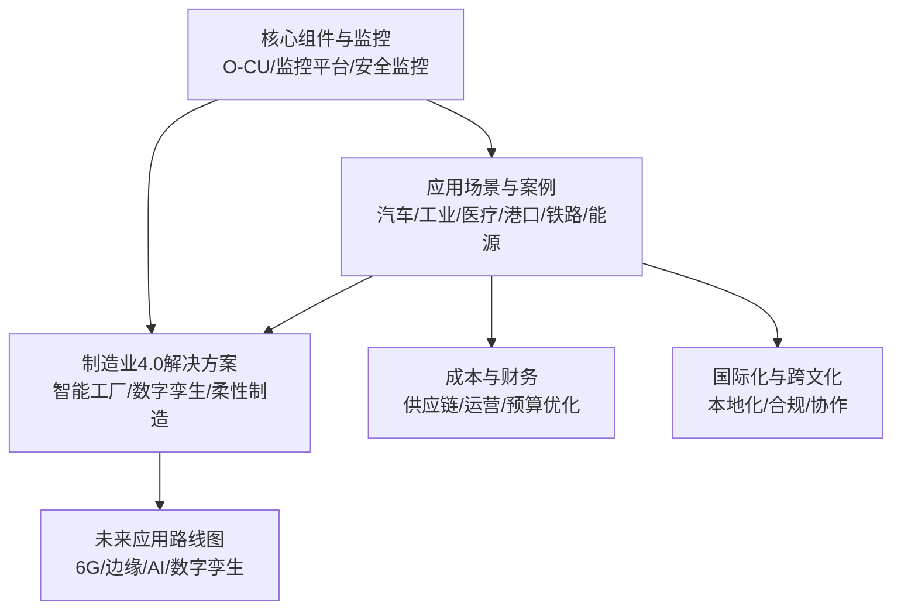
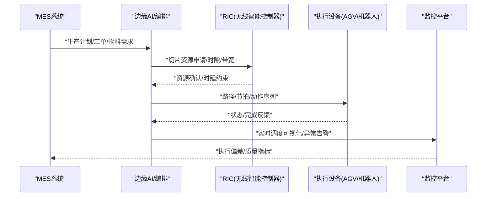
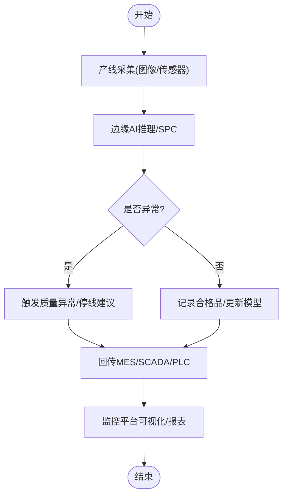
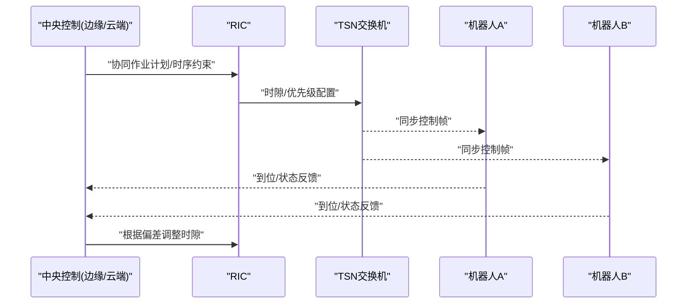
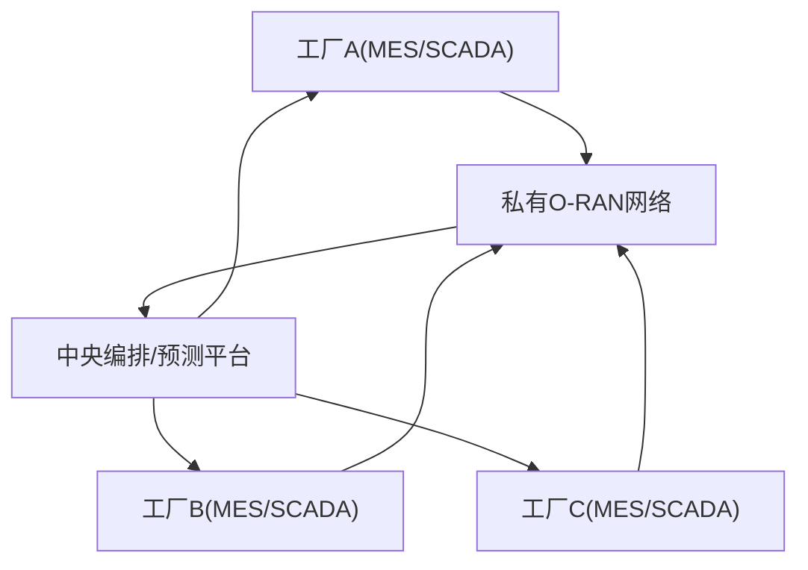
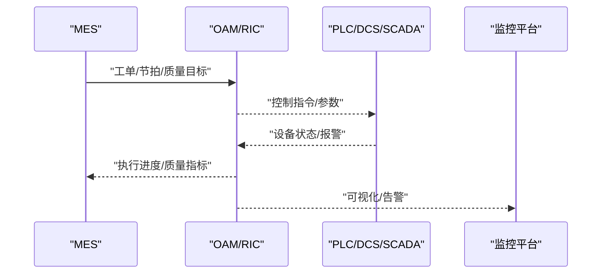
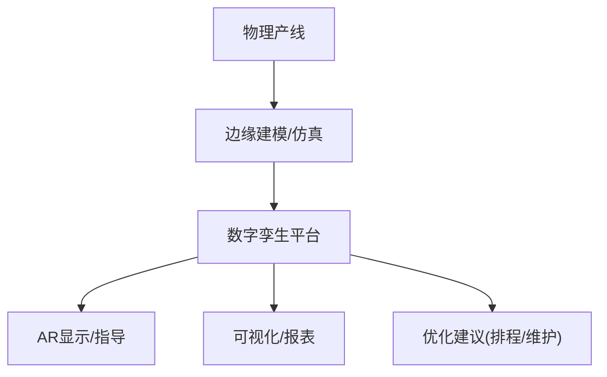
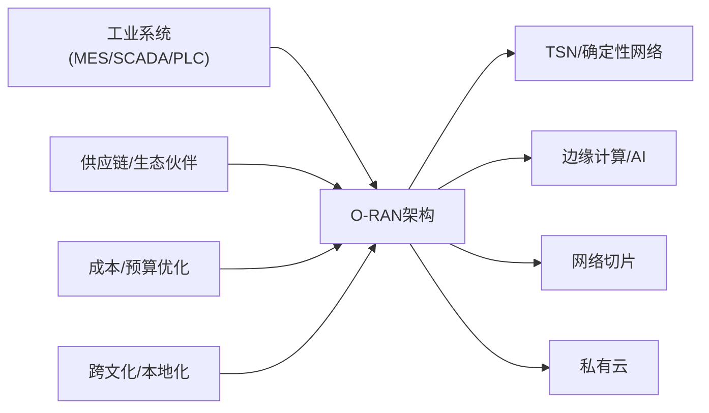

# 数字化生产线

<cite>
**本文引用的文件**
- [应用案例：垂直行业O-RAN应用](file://21-case-studies/industry-applications/vertical-industry-o-ran-cases.md)
- [应用场景总览](file://10-application-scenarios/readme.md)
- [制造业4.0解决方案](file://16-industry-solutions/manufacturing-4.0/smart-manufacturing-implementation.md)
- [未来应用路线图（含数字孪生）](file://15-future-development/emerging-applications/emerging-applications-roadmap.md)
- [成本效益分析（供应链与运营风险）](file://04-disaggregation-options/cost-benefit-analysis.md)
- [财务规划与预算优化](file://18-cost-benefit-analysis/financial-planning/oran-financial-planning.md)
- [国际部署与本地化策略](file://23-international-deployment/international-operations/international-operations-framework.md)
- [跨文化管理](file://23-international-deployment/cross-cultural-management/o-ran-cross-cultural-management.md)
- [核心组件：O-CU最佳实践](file://02-core-components/o-cu.md)
- [监控与可视化平台](file://22-tool-platforms/monitoring-systems/o-ran-monitoring-systems.md)
- [安全监控框架](file://12-security-privacy/monitoring-alerting/security-monitoring-framework.md)
</cite>

## 目录
1. [引言](#引言)
2. [项目结构](#项目结构)
3. [核心组件](#核心组件)
4. [架构总览](#架构总览)
5. [详细组件分析](#详细组件分析)
6. [依赖分析](#依赖分析)
7. [性能考量](#性能考量)
8. [故障排查指南](#故障排查指南)
9. [结论](#结论)
10. [附录](#附录)

## 引言
本文件面向“数字化生产线”的工程与管理需求，系统阐述O-RAN在智能制造中的集成应用，覆盖生产调度优化、质量控制管理、设备协同作业与供应链协调机制；并结合MES系统集成、SCADA监控、数字孪生与AR辅助装配等关键技术，给出可落地的生产流程设计、资源配置方案与效率提升策略。同时，针对柔性制造、个性化定制与快速换线等现代制造业核心诉求，提供基于O-RAN的端到端参考方案。

## 项目结构
围绕O-RAN在工业互联网中的应用，本仓库的关键资料分布如下：
- 应用场景与案例：提供不同行业（汽车、工业、医疗、港口、铁路、能源）的O-RAN部署经验与指标结果
- 制造业4.0解决方案：聚焦智能工厂、工业物联网、数字孪生与柔性制造
- 未来应用路线图：展望6G、AI原生架构、边缘计算与数字孪生等前沿方向
- 成本与财务：提供供应链风险、运营风险与预算优化方法论
- 国际化与跨文化：指导本地化适配、合规与团队协作
- 核心组件与监控：提供O-CU最佳实践、监控与可视化平台、安全监控框架



**章节来源**
- file://10-application-scenarios/readme.md#L1-L470
- file://16-industry-solutions/manufacturing-4.0/smart-manufacturing-implementation.md#L1-L200
- file://15-future-development/emerging-applications/emerging-applications-roadmap.md#L1-L800
- file://04-disaggregation-options/cost-benefit-analysis.md#L255-L303
- file://18-cost-benefit-analysis/financial-planning/oran-financial-planning.md#L343-L507
- file://23-international-deployment/international-operations/international-operations-framework.md#L92-L372
- file://23-international-deployment/cross-cultural-management/o-ran-cross-cultural-management.md#L255-L316
- file://02-core-components/o-cu.md#L283-L320
- file://22-tool-platforms/monitoring-systems/o-ran-monitoring-systems.md#L1-L200
- file://12-security-privacy/monitoring-alerting/security-monitoring-framework.md#L1-L400

## 核心组件
- O-RAN私有网络与确定性网络：满足工业控制低时延、高可靠与TSN集成要求
- 边缘计算与RIC：实现超低时延控制、AI优化与实时决策
- 私有云与网络切片：为不同生产区域提供差异化服务保障
- 工业系统集成：与SCADA、DCS、PLC、MES等系统打通，实现IT/OT融合
- 数字孪生与AR：构建虚拟工厂镜像与AR辅助装配，支撑预测性维护与远程专家支持

**章节来源**
- file://10-application-scenarios/readme.md#L81-L116
- file://21-case-studies/industry-applications/vertical-industry-o-ran-cases.md#L14-L26
- file://16-industry-solutions/manufacturing-4.0/smart-manufacturing-implementation.md#L1-L120
- file://15-future-development/emerging-applications/emerging-applications-roadmap.md#L306-L337

## 架构总览
下图展示O-RAN在数字化生产线中的总体架构：核心网与RAN通过O-CU/O-DU分离实现灵活部署；边缘计算节点就近处理控制与分析任务；与MES/SCADA/PLC/DCS集成；配合数字孪生与AR实现虚实协同。

```mermaid
graph TB
subgraph "工厂侧"
PL["PLC/DCS/SCADA"]
MES["MES系统"]
AGV["AGV/物流小车"]
ROB["机器人/执行器"]
SENS["传感器/执行器网络"]
end
subgraph "O-RAN网络"
CORE["核心网(5GC/NG-RAN)"]
OCU["O-CU(集中式编排)"]
ODU["O-DU(分布式处理)"]
RIC["RIC(无线智能控制器)"]
EDGE["边缘计算节点"]
end
subgraph "上层应用"
DT["数字孪生"]
AR["AR辅助装配"]
MON["监控与可视化平台"]
SEC["安全监控框架"]
end
PL --> |协议转换/接口适配| ODU
MES --> |MES接口| ODU
AGV --> |低时延控制| RIC
ROB --> |反馈/控制| RIC
SENS --> |感知数据| EDGE
OCU < --> CORE
ODU < --> RIC
EDGE < --> DT
EDGE < --> AR
EDGE < --> MON
EDGE < --> SEC
```

**图表来源**
- [应用案例：垂直行业O-RAN应用](file://21-case-studies/industry-applications/vertical-industry-o-ran-cases.md#L14-L26)
- [应用场景总览](file://10-application-scenarios/readme.md#L81-L116)
- [核心组件：O-CU最佳实践](file://02-core-components/o-cu.md#L283-L320)
- [监控与可视化平台](file://22-tool-platforms/monitoring-systems/o-ran-monitoring-systems.md#L1-L200)
- [安全监控框架](file://12-security-privacy/monitoring-alerting/security-monitoring-framework.md#L1-L400)

**章节来源**
- file://10-application-scenarios/readme.md#L81-L116
- file://21-case-studies/industry-applications/vertical-industry-o-ran-cases.md#L14-L26
- file://02-core-components/o-cu.md#L283-L320
- file://22-tool-platforms/monitoring-systems/o-ran-monitoring-systems.md#L1-L200
- file://12-security-privacy/monitoring-alerting/security-monitoring-framework.md#L1-L400

## 详细组件分析

### 组件A：生产调度优化（基于O-RAN与边缘AI）
- 关键能力
  - 网络切片隔离不同产线/业务域，保障关键控制时延与可靠性
  - 边缘AI进行实时排程与路径优化，降低主干网压力
  - AGV/机器人与控制系统通过低时延通道协同，实现动态重配置
- 典型流程
  - 计划下发至MES → O-RAN切片调度 → 边缘AI生成最优路径/节拍 → 控制指令下发至执行层 → 实时反馈闭环



**图表来源**
- [应用案例：垂直行业O-RAN应用](file://21-case-studies/industry-applications/vertical-industry-o-ran-cases.md#L28-L41)
- [应用场景总览](file://10-application-scenarios/readme.md#L103-L116)
- [监控与可视化平台](file://22-tool-platforms/monitoring-systems/o-ran-monitoring-systems.md#L1-L200)

**章节来源**
- file://21-case-studies/industry-applications/vertical-industry-o-ran-cases.md#L28-L41
- file://10-application-scenarios/readme.md#L103-L116
- file://22-tool-platforms/monitoring-systems/o-ran-monitoring-systems.md#L1-L200

### 组件B：质量控制管理（视觉检测与预测性维护）
- 关键能力
  - 高清视频/图像数据通过边缘计算就近处理，降低回传带宽
  - AI视觉检测与统计过程控制(SPC)结合，实现缺陷自动分类与根因分析
  - 预测性维护：基于设备状态与历史数据，提前识别潜在故障
- 典型流程
  - 产线采集 → 边缘推理/存储 → 结果回传MES/SCADA → 质量报表/预警



**图表来源**
- [应用案例：垂直行业O-RAN应用](file://21-case-studies/industry-applications/vertical-industry-o-ran-cases.md#L75-L88)
- [应用场景总览](file://10-application-scenarios/readme.md#L103-L116)
- [监控与可视化平台](file://22-tool-platforms/monitoring-systems/o-ran-monitoring-systems.md#L1-L200)

**章节来源**
- file://21-case-studies/industry-applications/vertical-industry-o-ran-cases.md#L75-L88
- file://10-application-scenarios/readme.md#L103-L116
- file://22-tool-platforms/monitoring-systems/o-ran-monitoring-systems.md#L1-L200

### 组件C：设备协同作业（TSN与低时延控制）
- 关键能力
  - TSN集成实现确定性时延与时钟同步，保障多机器人/AGV协同
  - RIC与边缘节点联合进行控制面优化，降低空口时延
- 典型流程
  - 协同任务规划 → TSN时隙分配 → RIC下发控制指令 → 实时反馈与自适应调整



**图表来源**
- [应用案例：垂直行业O-RAN应用](file://21-case-studies/industry-applications/vertical-industry-o-ran-cases.md#L14-L26)
- [应用场景总览](file://10-application-scenarios/readme.md#L103-L109)

**章节来源**
- file://21-case-studies/industry-applications/vertical-industry-o-ran-cases.md#L14-L26
- file://10-application-scenarios/readme.md#L103-L109

### 组件D：供应链协调机制（跨站点/跨工厂）
- 关键能力
  - 多站点统一O-RAN架构与集中管理，保障跨厂数据聚合与协同
  - 网络切片隔离不同业务域，确保关键物流/排程数据的SLA
- 典型流程
  - 各工厂MES/SCADA → 私有网络汇聚 → 中央编排/预测 → 下发至各站点执行



**图表来源**
- [应用案例：垂直行业O-RAN应用](file://21-case-studies/industry-applications/vertical-industry-o-ran-cases.md#L57-L73)

**章节来源**
- file://21-case-studies/industry-applications/vertical-industry-o-ran-cases.md#L57-L73

### 组件E：MES系统集成与SCADA监控
- 集成要点
  - MES与O-RAN通过标准接口对接，实现工单、节拍、质量与设备状态联动
  - SCADA/PLC/DCS通过协议适配接入O-RAN，形成IT/OT融合
- 典型流程
  - MES下发工单 → O-RAN切片/时延保障 → 执行层反馈 → SCADA/PLC闭环控制



**图表来源**
- [应用场景总览](file://10-application-scenarios/readme.md#L110-L116)
- [制造业4.0解决方案](file://16-industry-solutions/manufacturing-4.0/smart-manufacturing-implementation.md#L1-L120)

**章节来源**
- file://10-application-scenarios/readme.md#L110-L116
- file://16-industry-solutions/manufacturing-4.0/smart-manufacturing-implementation.md#L1-L120

### 组件F：数字孪生与AR辅助装配
- 数字孪生
  - 实时镜像工厂物理状态，支持仿真/优化/培训
- AR辅助装配
  - 低时延AR叠加装配指引，提升精度与效率
- 典型流程
  - 物理产线数据 → 边缘/云端建模 → 数字孪生镜像 → AR显示/指导



**图表来源**
- [应用场景总览](file://10-application-scenarios/readme.md#L110-L116)
- [未来应用路线图（含数字孪生）](file://15-future-development/emerging-applications/emerging-applications-roadmap.md#L306-L337)

**章节来源**
- file://10-application-scenarios/readme.md#L110-L116
- file://15-future-development/emerging-applications/emerging-applications-roadmap.md#L306-L337

## 依赖分析
- 技术依赖
  - O-RAN与TSN/边缘AI/网络切片/私有云构成核心技术栈
  - 工业系统集成依赖协议适配与安全隔离
- 组织与生态依赖
  - 供应链多厂商协同、本地化适配与跨文化协作
  - 预算与成本优化贯穿全生命周期



**图表来源**
- [应用场景总览](file://10-application-scenarios/readme.md#L81-L116)
- [成本效益分析（供应链与运营风险）](file://04-disaggregation-options/cost-benefit-analysis.md#L255-L303)
- [财务规划与预算优化](file://18-cost-benefit-analysis/financial-planning/oran-financial-planning.md#L343-L507)
- [国际部署与本地化策略](file://23-international-deployment/international-operations/international-operations-framework.md#L92-L372)
- [跨文化管理](file://23-international-deployment/cross-cultural-management/o-ran-cross-cultural-management.md#L255-L316)

**章节来源**
- file://10-application-scenarios/readme.md#L81-L116
- file://04-disaggregation-options/cost-benefit-analysis.md#L255-L303
- file://18-cost-benefit-analysis/financial-planning/oran-financial-planning.md#L343-L507
- file://23-international-deployment/international-operations/international-operations-framework.md#L92-L372
- file://23-international-deployment/cross-cultural-management/o-ran-cross-cultural-management.md#L255-L316

## 性能考量
- 时延与可靠性
  - 关键控制时延<1ms，端到端可靠性≥99.999%，通过TSN、边缘部署与切片保障
- 吞吐与覆盖
  - 高清视频/海量传感器数据峰值吞吐可达Gbps级，确保工厂全域覆盖与无缝切换
- 可扩展性与弹性
  - O-CU/O-DU解耦、边缘AI与网络切片支持按需扩容与弹性调度

**章节来源**
- file://21-case-studies/industry-applications/vertical-industry-o-ran-cases.md#L43-L47
- file://02-core-components/o-cu.md#L283-L320
- file://10-application-scenarios/readme.md#L81-L116

## 故障排查指南
- 监控与可视化
  - 使用统一监控平台对网络、设备、业务进行可视化监控与告警
- 安全监控
  - 建立零信任与多层防护，完善日志审计与事件响应
- 运维最佳实践
  - 自动化部署、高可用设计、灾难恢复与容量管理

**章节来源**
- file://22-tool-platforms/monitoring-systems/o-ran-monitoring-systems.md#L1-L200
- file://12-security-privacy/monitoring-alerting/security-monitoring-framework.md#L1-L400
- file://02-core-components/o-cu.md#L283-L320

## 结论
O-RAN为数字化生产线提供了确定性、低时延、可切片、可扩展的网络底座，结合边缘AI、数字孪生与AR，能够实现从生产调度、质量控制到设备协同与供应链协调的全流程优化。通过标准化的MES/SCADA集成、严格的安全部署与持续的成本优化，企业可在保证可靠性与安全性的同时，显著提升效率、质量和柔性生产能力。

## 附录
- 柔性制造与快速换线
  - 借助网络切片与边缘AI，实现产线快速重构与自适应调度
- 个性化定制
  - 通过MES与O-RAN协同，实现小批量、多品种的高效生产
- 国际化与本地化
  - 基于区域化部署框架与跨文化管理策略，支撑全球工厂统一运营

**章节来源**
- file://16-industry-solutions/manufacturing-4.0/smart-manufacturing-implementation.md#L1-L120
- file://23-international-deployment/international-operations/international-operations-framework.md#L92-L372
- file://23-international-deployment/cross-cultural-management/o-ran-cross-cultural-management.md#L255-L316
- file://15-future-development/emerging-applications/emerging-applications-roadmap.md#L306-L337