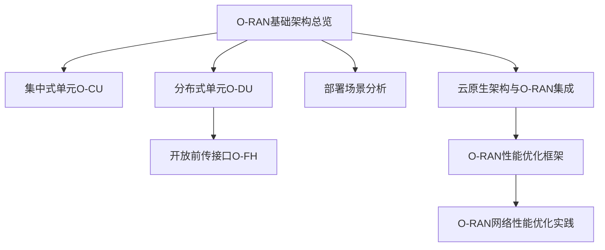
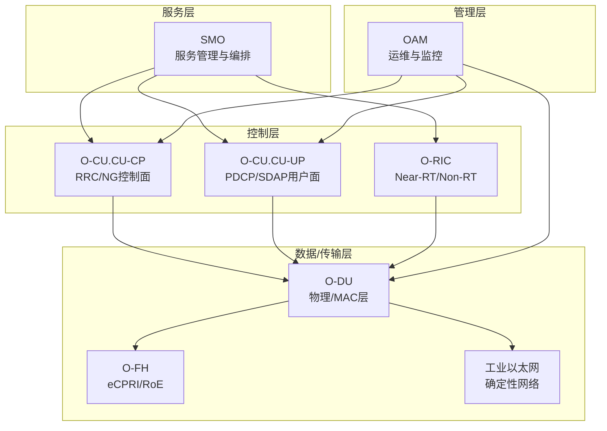
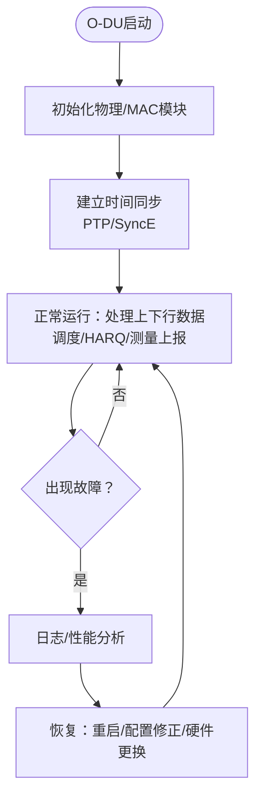
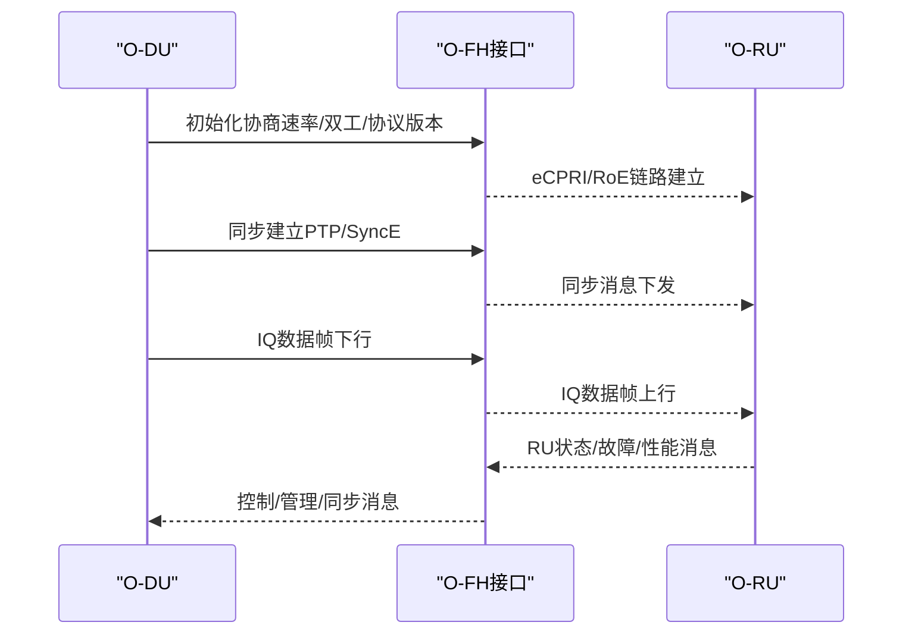
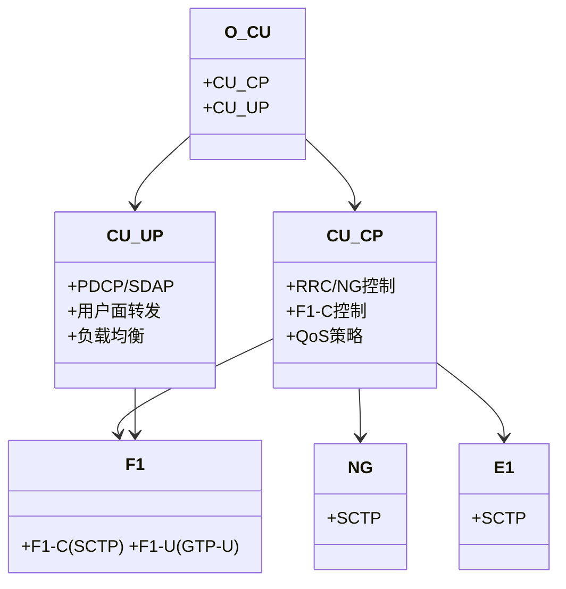
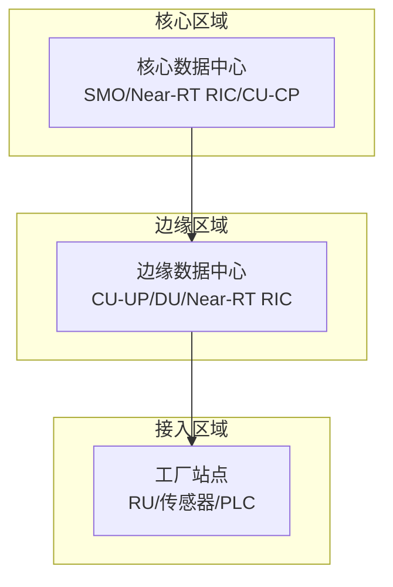
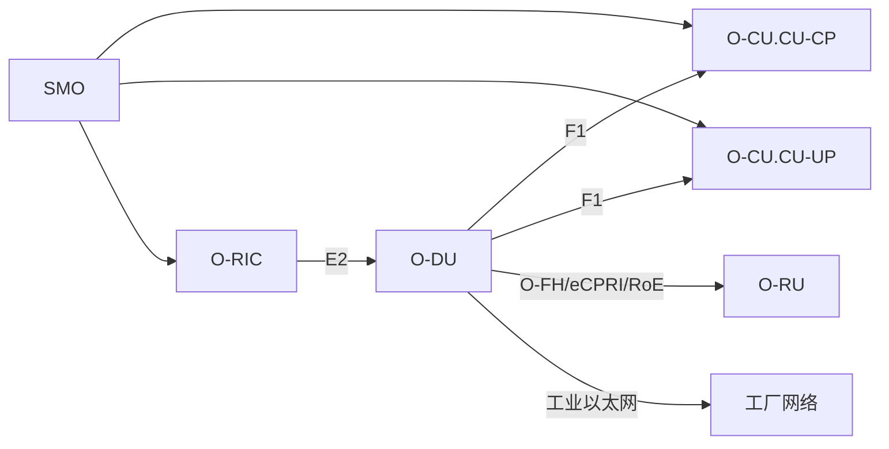
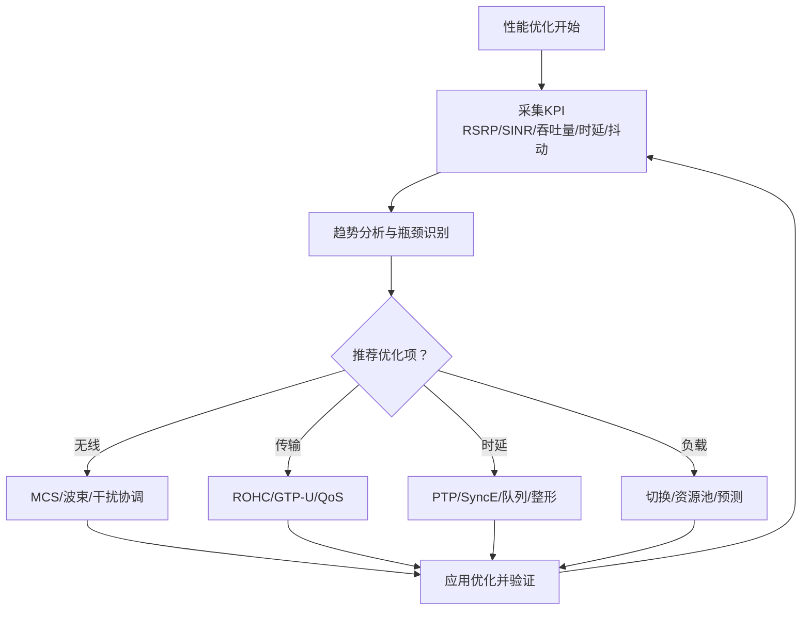

# 智能制造网络架构

<cite>
**本文引用的文件**
- [O-RAN基础架构总览](file://01-architecture-system/readme.md)
- [集中式单元（O-CU）](file://02-core-components/o-cu.md)
- [分布式单元（O-DU）](file://02-core-components/o-du.md)
- [开放前传接口（O-FH）](file://03-interface-standards/o-fh-interface.md)
- [部署场景分析](file://04-disaggregation-options/deployment-scenarios.md)
- [云原生架构与O-RAN集成](file://05-cloud-integration/cloud-native-architecture.md)
- [O-RAN网络性能优化实践](file://26-performance-optimization/network-optimization/network-performance-tuning.md)
- [O-RAN性能优化框架](file://14-operations-management/performance-optimization/performance-optimization-framework.md)
</cite>

## 目录
1. [引言](#引言)
2. [项目结构](#项目结构)
3. [核心组件](#核心组件)
4. [架构总览](#架构总览)
5. [详细组件分析](#详细组件分析)
6. [依赖关系分析](#依赖关系分析)
7. [性能考量](#性能考量)
8. [故障排查指南](#故障排查指南)
9. [结论](#结论)
10. [附录](#附录)

## 引言
本文件面向智能制造网络设计，系统阐述O-RAN在工业制造场景中的网络架构与落地要点，覆盖工厂网络拓扑、设备连接方案、分层架构与QoS保障、工业以太网与O-RAN融合、实时通信协议、网络冗余与带宽分配策略，并提供网络规划实例、设备选型建议与部署配置指南，同时补充工业环境下的电磁兼容、温度湿度与防爆等特殊要求。

## 项目结构
围绕O-RAN在智能制造中的应用，本仓库提供了从总体架构到核心网元、接口标准、部署场景、云原生集成以及性能优化的完整知识体系。下图给出与智能制造网络相关的主要模块与文件映射：

图表来源
- [O-RAN基础架构总览](file://01-architecture-system/readme.md#L1-L161)
- [集中式单元（O-CU）](file://02-core-components/o-cu.md#L1-L419)
- [分布式单元（O-DU）](file://02-core-components/o-du.md#L1-L415)
- [开放前传接口（O-FH）](file://03-interface-standards/o-fh-interface.md#L1-L397)
- [部署场景分析](file://04-disaggregation-options/deployment-scenarios.md#L1-L563)
- [云原生架构与O-RAN集成](file://05-cloud-integration/cloud-native-architecture.md#L1-L481)
- [O-RAN性能优化框架](file://14-operations-management/performance-optimization/performance-optimization-framework.md#L1-L650)
- [O-RAN网络性能优化实践](file://26-performance-optimization/network-optimization/network-performance-tuning.md#L1-L98)

章节来源
- [O-RAN基础架构总览](file://01-architecture-system/readme.md#L1-L161)
- [部署场景分析](file://04-disaggregation-options/deployment-scenarios.md#L1-L563)

## 核心组件
- O-RU（无线单元）：射频处理、数字前端、天线连接与同步功能
- O-DU（分布式单元）：物理层处理、部分MAC层功能，强调低延迟与高实时性
- O-CU（集中式单元）：CU-CP（RRC/NG接口控制面）、CU-UP（PDCP/SDAP用户面），实现控制面与用户面分离
- O-RIC（RAN智能控制器）：Near-RT RIC（毫秒级闭环）、Non-RT RIC（秒至分钟级策略）
- SMO（服务管理与编排）：网络服务生命周期、配置与故障管理
- O-CUCP/O-CUUP：跨厂商协调与管理功能

章节来源
- [O-RAN基础架构总览](file://01-architecture-system/readme.md#L15-L26)
- [集中式单元（O-CU）](file://02-core-components/o-cu.md#L3-L48)
- [分布式单元（O-DU）](file://02-core-components/o-du.md#L3-L67)

## 架构总览
O-RAN在智能制造中的典型分层架构如下：
- 服务层：SMO与业务编排
- 控制层：O-CU（CU-CP/CU-UP）、O-RIC（Near-RT/Non-RT）
- 数据/传输层：O-DU、O-FH前传接口、工业以太网
- 管理层：OAM与运维监控

图表来源
- [O-RAN基础架构总览](file://01-architecture-system/readme.md#L8-L34)
- [集中式单元（O-CU）](file://02-core-components/o-cu.md#L101-L121)
- [分布式单元（O-DU）](file://02-core-components/o-du.md#L68-L86)
- [开放前传接口（O-FH）](file://03-interface-standards/o-fh-interface.md#L59-L97)

## 详细组件分析

### O-DU：工厂边缘的实时枢纽
- 功能职责：物理层处理（下行编码/调制、上行接收/解调）、MAC层调度与HARQ、CSI/RSRP/RSRQ/SINR/TA测量
- 实时性要求：物理层处理延迟<1ms；MAC层<0.5ms；端到端<3ms；时间同步<100ns（O-RU侧）/1μs（O-CU侧）
- 接口能力：F1（控制面/F1-C、用户面/F1-U）、O-FH（eCPRI/RoE）、E2（与RIC）
- 部署形态：集中式/分布式/混合部署，边缘部署有利于降低工厂内端到端时延

图表来源
- [分布式单元（O-DU）](file://02-core-components/o-du.md#L51-L66)
- [分布式单元（O-DU）](file://02-core-components/o-du.md#L171-L206)

章节来源
- [分布式单元（O-DU）](file://02-core-components/o-du.md#L7-L67)
- [分布式单元（O-DU）](file://02-core-components/o-du.md#L131-L147)
- [分布式单元（O-DU）](file://02-core-components/o-du.md#L224-L247)

### O-FH：工厂前传的确定性通道
- 协议支持：eCPRI与RoE，标准化DU与RU之间的用户面/控制面/同步消息
- 同步能力：PTP v2纳秒级时间同步、SyncE频率同步、同步冗余与切换
- 传输路径：光纤（首选）、无线（备选）、混合路径；链路聚合与QoS保障
- 工业场景：在工业园区/工厂车间部署RU，O-DU就近部署，降低前传时延

图表来源
- [开放前传接口（O-FH）](file://03-interface-standards/o-fh-interface.md#L82-L116)
- [开放前传接口（O-FH）](file://03-interface-standards/o-fh-interface.md#L117-L178)

章节来源
- [开放前传接口（O-FH）](file://03-interface-standards/o-fh-interface.md#L7-L58)
- [开放前传接口（O-FH）](file://03-interface-standards/o-fh-interface.md#L117-L178)

### O-CU：集中编排与用户面处理
- CU-CP：RRC/NG接口控制面、F1-C控制面、QoS策略与会话管理
- CU-UP：PDCP/SDAP用户面、数据转发/流量管理/负载均衡/统计计费
- 接口：NG（SCTP）、F1（F1-C/SCTP、F1-U/GTP-U）、E1（SCTP）
- 部署：集中式/分布式/混合部署；多租户与弹性扩缩容

图表来源
- [集中式单元（O-CU）](file://02-core-components/o-cu.md#L7-L61)
- [集中式单元（O-CU）](file://02-core-components/o-cu.md#L101-L121)

章节来源
- [集中式单元（O-CU）](file://02-core-components/o-cu.md#L7-L61)
- [集中式单元（O-CU）](file://02-core-components/o-cu.md#L122-L196)

### 部署场景与工厂拓扑
- 集中式：核心数据中心集中部署，适合广覆盖与集中管理
- 分布式/边缘：O-DU靠近RU与工厂，满足低时延与确定性
- 混合：核心（SMO/Near-RT RIC/CU-CP）+边缘（CU-UP/DU）协同
- 工业园区场景：端到端时延<1ms、可靠性99.999%、支持海量IoT连接

图表来源
- [部署场景分析](file://04-disaggregation-options/deployment-scenarios.md#L162-L189)
- [部署场景分析](file://04-disaggregation-options/deployment-scenarios.md#L216-L243)

章节来源
- [部署场景分析](file://04-disaggregation-options/deployment-scenarios.md#L9-L58)
- [部署场景分析](file://04-disaggregation-options/deployment-scenarios.md#L110-L161)
- [部署场景分析](file://04-disaggregation-options/deployment-scenarios.md#L216-L243)

## 依赖关系分析
- O-DU依赖O-FH与工业以太网实现RU连接与同步；对PTP/SyncE的依赖决定时延与抖动
- O-CU通过F1接口与O-DU交互，E1接口与自身CU-CP/CU-UP互通；NG接口与核心网互通
- O-RIC通过E2接口与O-DU/O-CU交互，实现近实时闭环控制
- SMO负责端到端服务编排与生命周期管理，贯穿各层

图表来源
- [集中式单元（O-CU）](file://02-core-components/o-cu.md#L101-L121)
- [分布式单元（O-DU）](file://02-core-components/o-du.md#L68-L86)
- [开放前传接口（O-FH）](file://03-interface-standards/o-fh-interface.md#L59-L97)

章节来源
- [集中式单元（O-CU）](file://02-core-components/o-cu.md#L101-L121)
- [分布式单元（O-DU）](file://02-core-components/o-du.md#L68-L86)
- [开放前传接口（O-FH）](file://03-interface-standards/o-fh-interface.md#L59-L97)

## 性能考量
- 无线资源优化：MCS自适应、HARQ重传优化、波束赋形、干扰协调
- 传输效率优化：ROHC头部压缩、GTP-U协议简化、QoS参数精细化（5QI）
- 时延与抖动控制：时间同步（PTP/SyncE）、WFQ/SP队列、自适应缓冲、令牌桶整形
- 负载均衡：移动性参数调优、动态资源池、负载预测与容量规划
- 网络接口优化：Jumbo帧、NUMA绑定、中断亲和、优先级队列标记（E2/F1/O-FH端口）

图表来源
- [O-RAN网络性能优化实践](file://26-performance-optimization/network-optimization/network-performance-tuning.md#L6-L44)
- [O-RAN网络性能优化实践](file://26-performance-optimization/network-optimization/network-performance-tuning.md#L45-L83)
- [O-RAN性能优化框架](file://14-operations-management/performance-optimization/performance-optimization-framework.md#L8-L101)

章节来源
- [O-RAN网络性能优化实践](file://26-performance-optimization/network-optimization/network-performance-tuning.md#L6-L98)
- [O-RAN性能优化框架](file://14-operations-management/performance-optimization/performance-optimization-framework.md#L6-L101)

## 故障排查指南
- O-FH接口：连接断开、同步丢失、性能劣化、RU硬件故障；通过告警关联、日志分析、接口/同步测试定位，修复传输/同步/硬件/配置
- O-DU：物理层/ MAC层故障、同步异常、接口故障、性能劣化；通过监控与日志定位，执行重启/配置/硬件更换/传输修复
- O-CU：信令/接口/性能/资源故障；通过监控与日志定位，执行重启/配置/扩容/接口修复

章节来源
- [开放前传接口（O-FH）](file://03-interface-standards/o-fh-interface.md#L199-L266)
- [分布式单元（O-DU）](file://02-core-components/o-du.md#L224-L288)
- [集中式单元（O-CU）](file://02-core-components/o-cu.md#L197-L263)

## 结论
O-RAN在智能制造中的应用，应以“边缘实时处理+核心集中编排”为核心思路，通过O-DU就近部署、O-FH标准化前传、O-CU控制/用户面分离与O-RIC近实时闭环，配合云原生自动化与性能优化框架，实现低时延、高可靠、可扩展的工业网络。部署场景应结合业务类型（eMBB/URLLC/mMTC）与传输条件，选择集中式/分布式/混合部署，并在工业环境下强化确定性网络、冗余与安全。

## 附录

### 工厂网络规划实例（示例步骤）
- 场景：工业园区部署，支持工业控制（URLLC，<1ms）、大量IoT（mMTC）与视频监控（eMBB）
- 步骤：
  1) 业务与时延需求评估：URLLC优先，设定端到端<1ms；IoT按连接密度估算带宽
  2) 部署方案：核心（SMO/Near-RT RIC/CU-CP）+边缘（CU-UP/DU）+接入（RU/传感器）
  3) 前传与同步：O-FH采用eCPRI/RoE，光纤链路+PTP/SyncE，链路聚合与QoS
  4) 工业以太网：确定性网络（TSN/时间触发）、冗余路径（环网/双归）
  5) QoS策略：URLLC最高优先级、IoT尽力而为、eMBB中优先级
  6) 容量与弹性：按峰值流量预留冗余，结合自动扩缩容与负载均衡
  7) 运维：统一监控与告警、自动化巡检与故障演练

章节来源
- [部署场景分析](file://04-disaggregation-options/deployment-scenarios.md#L216-L243)
- [开放前传接口（O-FH）](file://03-interface-standards/o-fh-interface.md#L117-L178)
- [O-RAN性能优化框架](file://14-operations-management/performance-optimization/performance-optimization-framework.md#L8-L101)

### 设备选型建议（示例要点）
- O-DU：多核CPU+DSP+FPGA/加速卡，支持100G以太网，满足物理层与MAC层实时处理
- O-RU：10G/25G以太网接口，支持eCPRI/RoE，内置同步处理能力
- 传输：10G/25G/100G光模块，支持PTP透传与SyncE
- 工业以太网：支持TSN/时间触发、冗余与环网保护
- O-CU：通用服务器（CU-CP）+高性能服务器（CU-UP），支持容器化与Kubernetes编排

章节来源
- [分布式单元（O-DU）](file://02-core-components/o-du.md#L89-L110)
- [开放前传接口（O-FH）](file://03-interface-standards/o-fh-interface.md#L179-L198)
- [集中式单元（O-CU）](file://02-core-components/o-cu.md#L64-L81)
- [云原生架构与O-RAN集成](file://05-cloud-integration/cloud-native-architecture.md#L1-L64)

### 部署配置指南（示例要点）
- O-FH：带宽计算与冗余、PTP/SyncE同步配置、QoS优先级（E2/F1/O-FH端口）、链路聚合
- O-DU：同步精度测试、接口与RU状态监控、故障定位与恢复流程
- O-CU：接口状态/吞吐量/延迟/丢包监控，配置一致性与变更管理
- 工业以太网：TSN参数、环网保护倒换、冗余链路与故障隔离

章节来源
- [开放前传接口（O-FH）](file://03-interface-standards/o-fh-interface.md#L117-L178)
- [分布式单元（O-DU）](file://02-core-components/o-du.md#L224-L288)
- [集中式单元（O-CU）](file://02-core-components/o-cu.md#L197-L263)

### 工业环境特殊考量（示例要点）
- 电磁兼容（EMC）：屏蔽与滤波、接地与隔离、工业级设备认证
- 环境条件：温度（-40°C~+70°C）、湿度（5%~95%RH）、防护等级（IP54/IP65）
- 防爆安全：本质安全型或隔爆型设备、本安关联设备、危险区域分区与选型
- 网络确定性：TSN/时间触发、冗余路径、故障自愈、带宽预留

章节来源
- [部署场景分析](file://04-disaggregation-options/deployment-scenarios.md#L238-L242)