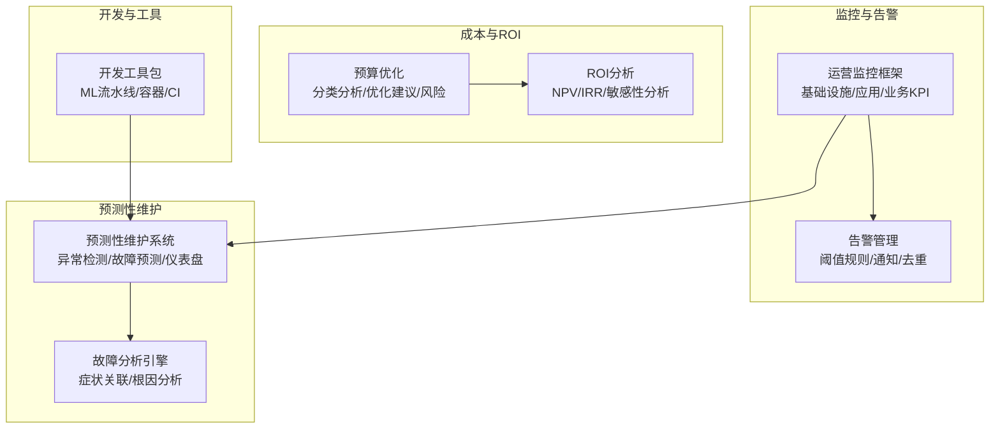
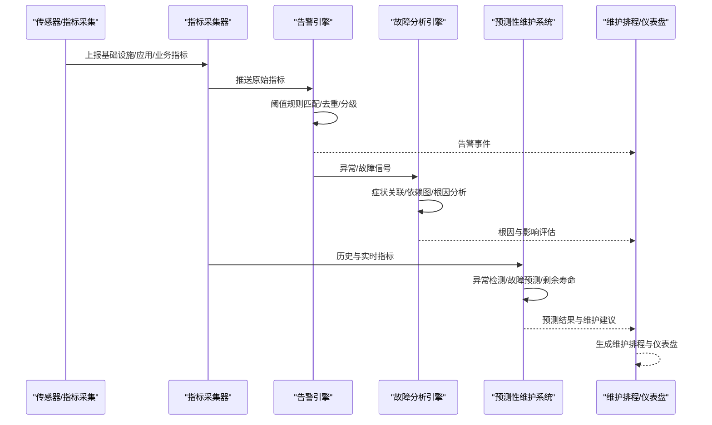
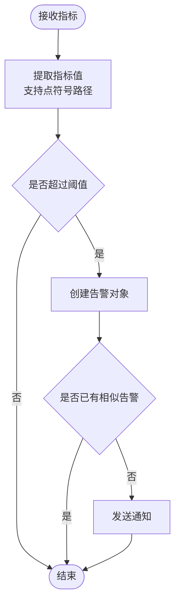
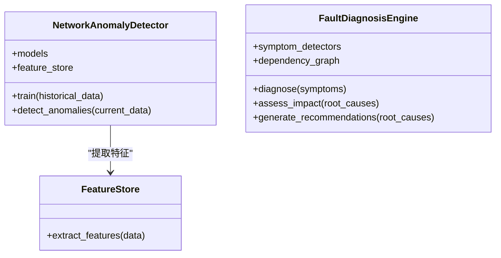
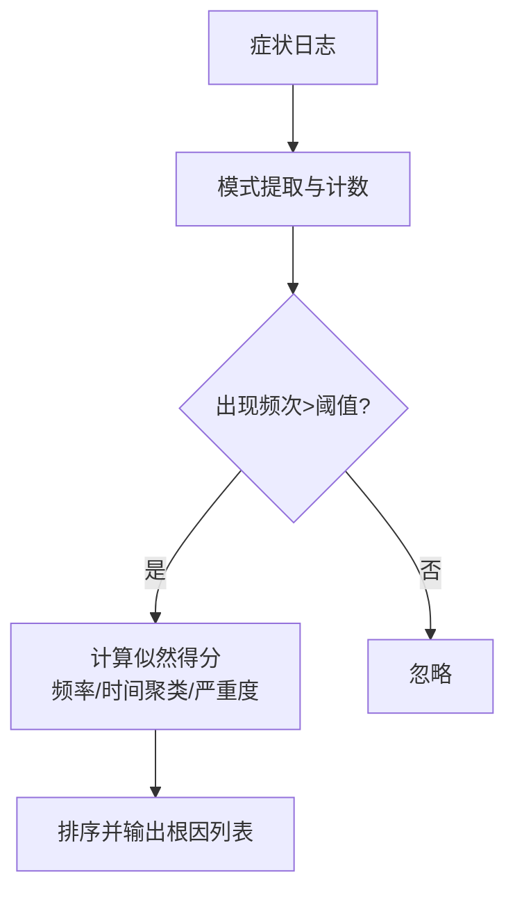
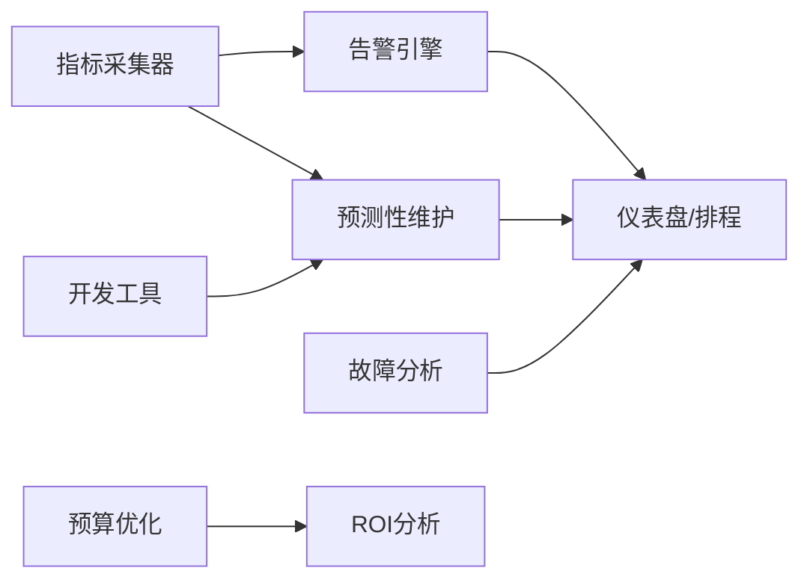
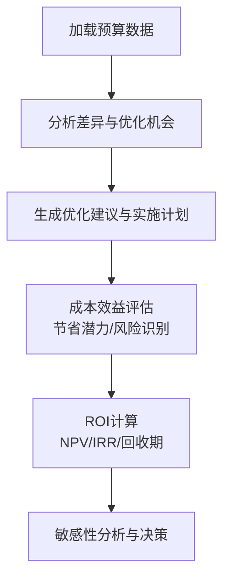

# 预测性维护系统

<cite>
**本文引用的文件**
- [O-RAN 运营监控告警系统（中文）](file://14-operations-management/monitoring-alerting/operations-monitoring-framework-zh.md)
- [O-RAN 运营监控告警系统（英文）](file://14-operations-management/monitoring-alerting/operations-monitoring-framework.md)
- [O-RAN 预测性维护与监控系统（英文）](file://22-tool-platforms/monitoring-systems/o-ran-monitoring-systems.md)
- [O-RAN 预防性维护指南（中文）](file://27-troubleshooting-diagnosis/fault-library/o-ran-fault-case-database-zh.md)
- [O-RAN 预防性维护指南（英文）](file://27-troubleshooting-diagnosis/fault-library/o-ran-fault-case-database.md)
- [O-RAN 故障排查指南（英文）](file://14-operations-management/fault-handling/fault-troubleshooting-guide.md)
- [O-RAN 成本优化与预算管理（中文）](file://18-cost-benefit-analysis/financial-planning/oran-financial-planning-zh.md)
- [O-RAN 成本优化与预算管理（英文）](file://18-cost-benefit-analysis/financial-planning/oran-financial-planning.md)
- [O-RAN 投资回报分析框架（英文）](file://18-cost-benefit-analysis/roi-analysis/o-ran-roi-analysis.md)
- [O-RAN 开发工具包（英文）](file://22-tool-platforms/development-tools/o-ran-development-toolkit.md)
</cite>

## 目录
1. [引言](#引言)
2. [项目结构](#项目结构)
3. [核心组件](#核心组件)
4. [架构总览](#架构总览)
5. [详细组件分析](#详细组件分析)
6. [依赖关系分析](#依赖关系分析)
7. [性能考量](#性能考量)
8. [故障排查与维护指南](#故障排查与维护指南)
9. [经济效益分析](#经济效益分析)
10. [结论](#结论)
11. [附录](#附录)

## 引言
本文件面向O-RAN网络的预测性维护系统，围绕设备状态监测与故障预测展开，覆盖传感器数据采集、设备健康状态评估、故障预测算法与维护决策支持，并结合振动监测、温度监控、油液分析与声发射检测等手段，给出机器学习模型选择、特征工程方法与预警阈值设定建议。同时，提供维护成本优化、停机时间降低与设备寿命延长的经济效益分析方法与工具。

## 项目结构
该仓库提供了与预测性维护密切相关的多类文档与工具，主要分布在以下主题域：
- 运营监控与告警：基础设施、应用与业务KPI的采集与阈值告警
- 预测性维护与监控：异常检测、故障预测、仪表盘与维护排程
- 故障排查与预防性维护：根因分析、维护框架与知识库
- 成本与ROI：预算优化、成本建模与投资回报分析
- 开发工具：ML流水线、容器与CI/CD、API规范与测试

**图表来源**
- [O-RAN 运营监控告警系统（中文）](file://14-operations-management/monitoring-alerting/operations-monitoring-framework-zh.md#L1-L909)
- [O-RAN 运营监控告警系统（英文）](file://14-operations-management/monitoring-alerting/operations-monitoring-framework.md#L262-L486)
- [O-RAN 预测性维护与监控系统（英文）](file://22-tool-platforms/monitoring-systems/o-ran-monitoring-systems.md#L415-L543)
- [O-RAN 故障排查指南（英文）](file://14-operations-management/fault-handling/fault-troubleshooting-guide.md#L100-L180)
- [O-RAN 成本优化与预算管理（中文）](file://18-cost-benefit-analysis/financial-planning/oran-financial-planning-zh.md#L343-L507)
- [O-RAN 投资回报分析框架（英文）](file://18-cost-benefit-analysis/roi-analysis/o-ran-roi-analysis.md#L1-L181)
- [O-RAN 开发工具包（英文）](file://22-tool-platforms/development-tools/o-ran-development-toolkit.md#L368-L415)

**章节来源**
- [O-RAN 运营监控告警系统（中文）](file://14-operations-management/monitoring-alerting/operations-monitoring-framework-zh.md#L1-L909)
- [O-RAN 运营监控告警系统（英文）](file://14-operations-management/monitoring-alerting/operations-monitoring-framework.md#L262-L486)
- [O-RAN 预测性维护与监控系统（英文）](file://22-tool-platforms/monitoring-systems/o-ran-monitoring-systems.md#L415-L543)

## 核心组件
- 指标采集与存储：多层指标（基础设施、应用、业务）采集与存储，支撑后续分析与告警
- 智能告警引擎：基于阈值规则与指标路径提取，生成并去重告警，支持多通道通知
- 预测性维护系统：异常检测与故障预测模型、剩余寿命估计与维护排程建议
- 故障分析引擎：症状关联、依赖图与根因分析，辅助快速定位与处置
- 成本与ROI：预算差异分析、优化建议与风险识别；ROI计算与敏感性分析
- 开发与部署：ML流水线、容器化与CI/CD，保障模型训练与上线的稳定性

**章节来源**
- [O-RAN 运营监控告警系统（英文）](file://14-operations-management/monitoring-alerting/operations-monitoring-framework.md#L262-L486)
- [O-RAN 预测性维护与监控系统（英文）](file://22-tool-platforms/monitoring-systems/o-ran-monitoring-systems.md#L415-L543)
- [O-RAN 故障排查指南（英文）](file://14-operations-management/fault-handling/fault-troubleshooting-guide.md#L100-L180)
- [O-RAN 成本优化与预算管理（中文）](file://18-cost-benefit-analysis/financial-planning/oran-financial-planning-zh.md#L343-L507)
- [O-RAN 投资回报分析框架（英文）](file://18-cost-benefit-analysis/roi-analysis/o-ran-roi-analysis.md#L1-L181)
- [O-RAN 开发工具包（英文）](file://22-tool-platforms/development-tools/o-ran-development-toolkit.md#L368-L415)

## 架构总览
预测性维护系统以“采集—分析—预警—处置—优化”闭环为核心，结合传统阈值告警与机器学习预测，形成多层次保障。

**图表来源**
- [O-RAN 运营监控告警系统（英文）](file://14-operations-management/monitoring-alerting/operations-monitoring-framework.md#L262-L486)
- [O-RAN 预测性维护与监控系统（英文）](file://22-tool-platforms/monitoring-systems/o-ran-monitoring-systems.md#L415-L543)
- [O-RAN 故障排查指南（英文）](file://14-operations-management/fault-handling/fault-troubleshooting-guide.md#L100-L180)

## 详细组件分析

### 指标采集与阈值告警
- 多层指标体系：基础设施（CPU/内存/磁盘/网络）、应用（RIC/接口/服务）、业务（KPI/SLA/QoS）
- 阈值规则：按指标类型定义阈值、持续时间与严重级别，支持点符号路径提取嵌套字段
- 通知与去重：多通道通知（邮件/Slack/PagerDuty/短信），避免重复与抖动

**图表来源**
- [O-RAN 运营监控告警系统（英文）](file://14-operations-management/monitoring-alerting/operations-monitoring-framework.md#L348-L428)

**章节来源**
- [O-RAN 运营监控告警系统（中文）](file://14-operations-management/monitoring-alerting/operations-monitoring-framework-zh.md#L48-L260)
- [O-RAN 运营监控告警系统（英文）](file://14-operations-management/monitoring-alerting/operations-monitoring-framework.md#L262-L486)

### 预测性维护系统
- 异常检测：统计与时间序列方法（控制图、Z-score、EWMA、PCA、Mahalanobis、ARIMA、Prophet、LSTM、集成方法）
- 故障预测：趋势分析、错误率上升、资源利用率预测、环境因素关联
- 剩余寿命估计与维护排程：组件磨损建模、失效概率、置信区间与维护调度优化
- 仪表盘：设备健康状态、预测失效时间、推荐动作与维护计划

**图表来源**
- [O-RAN 预测性维护与监控系统（英文）](file://22-tool-platforms/monitoring-systems/o-ran-monitoring-systems.md#L438-L484)
- [O-RAN 预测性维护与监控系统（英文）](file://22-tool-platforms/monitoring-systems/o-ran-monitoring-systems.md#L288-L353)

**章节来源**
- [O-RAN 预测性维护与监控系统（英文）](file://22-tool-platforms/monitoring-systems/o-ran-monitoring-systems.md#L415-L543)

### 故障分析与根因定位
- 依赖图构建：SMO、近实时RIC、O-CU、O-DU、O-RU、配置数据库与网络基础设施
- 症状关联：统计显著性、时间聚类与严重度加权，识别高可能性根因
- 影响评估：服务中断范围、客户影响量化、业务连续性与恢复时间估算

**图表来源**
- [O-RAN 故障排查指南（英文）](file://14-operations-management/fault-handling/fault-troubleshooting-guide.md#L107-L179)

**章节来源**
- [O-RAN 故障排查指南（英文）](file://14-operations-management/fault-handling/fault-troubleshooting-guide.md#L100-L180)

### 预防性维护框架
- 硬件健康监控：定期物理检查、深度清洁、热成像/万用表/诊断软件、环境温湿度/电源质量
- 组件生命周期管理：保修到期、预期寿命、性能退化跟踪与主动更换
- 软件与配置审计：季度配置审计、补丁与更新管理、性能基线维护
- 知识库与文档：标准化案例格式、最佳实践、培训与技能发展

**章节来源**
- [O-RAN 预防性维护指南（中文）](file://27-troubleshooting-diagnosis/fault-library/o-ran-fault-case-database-zh.md#L171-L225)
- [O-RAN 预防性维护指南（英文）](file://27-troubleshooting-diagnosis/fault-library/o-ran-fault-case-database.md#L171-L225)

### 开发与部署支持
- ML流水线：数据采集、特征工程、模型训练与部署（TensorFlow Serving、ONNX转换、A/B测试）
- 容器与本地集群：kind/minikube/k3d、Helm Chart、安全扫描与最佳实践
- API设计与测试：OpenAPI规范、Postman/Newman、契约测试与性能测试

**章节来源**
- [O-RAN 开发工具包（英文）](file://22-tool-platforms/development-tools/o-ran-development-toolkit.md#L368-L415)
- [O-RAN 开发工具包（英文）](file://22-tool-platforms/development-tools/o-ran-development-toolkit.md#L214-L257)

## 依赖关系分析
- 数据流依赖：采集器向告警引擎与预测性维护系统提供数据
- 逻辑依赖：预测性维护依赖历史数据与特征工程；故障分析依赖症状与依赖图
- 运维依赖：成本与ROI分析依赖预算与财务数据；开发工具链支撑模型迭代与上线

**图表来源**
- [O-RAN 运营监控告警系统（英文）](file://14-operations-management/monitoring-alerting/operations-monitoring-framework.md#L262-L486)
- [O-RAN 预测性维护与监控系统（英文）](file://22-tool-platforms/monitoring-systems/o-ran-monitoring-systems.md#L415-L543)
- [O-RAN 成本优化与预算管理（中文）](file://18-cost-benefit-analysis/financial-planning/oran-financial-planning-zh.md#L343-L507)
- [O-RAN 投资回报分析框架（英文）](file://18-cost-benefit-analysis/roi-analysis/o-ran-roi-analysis.md#L1-L181)
- [O-RAN 开发工具包（英文）](file://22-tool-platforms/development-tools/o-ran-development-toolkit.md#L368-L415)

**章节来源**
- [O-RAN 运营监控告警系统（英文）](file://14-operations-management/monitoring-alerting/operations-monitoring-framework.md#L262-L486)
- [O-RAN 预测性维护与监控系统（英文）](file://22-tool-platforms/monitoring-systems/o-ran-monitoring-systems.md#L415-L543)
- [O-RAN 成本优化与预算管理（中文）](file://18-cost-benefit-analysis/financial-planning/oran-financial-planning-zh.md#L343-L507)
- [O-RAN 投资回报分析框架（英文）](file://18-cost-benefit-analysis/roi-analysis/o-ran-roi-analysis.md#L1-L181)
- [O-RAN 开发工具包（英文）](file://22-tool-platforms/development-tools/o-ran-development-toolkit.md#L368-L415)

## 性能考量
- 指标采集频率与存储：平衡实时性与系统开销，合理设置抓取间隔与保留策略
- 告警风暴抑制：阈值滞后、去重与聚合，避免噪声干扰
- 模型推理延迟：特征工程与模型压缩，满足近实时预测需求
- 资源隔离与弹性：容器与Kubernetes资源限制与自动扩缩容

[本节为通用指导，不直接分析具体文件]

## 故障排查与维护指南
- 快速定位：基于症状与依赖图，优先检查上游组件与共享资源
- 处置建议：结合预测性维护仪表盘的推荐动作与维护排程
- 知识沉淀：标准化案例格式、定期评审与知识分享，提升团队能力

**章节来源**
- [O-RAN 故障排查指南（英文）](file://14-operations-management/fault-handling/fault-troubleshooting-guide.md#L100-L180)
- [O-RAN 预防性维护指南（中文）](file://27-troubleshooting-diagnosis/fault-library/o-ran-fault-case-database-zh.md#L171-L225)
- [O-RAN 预防性维护指南（英文）](file://27-troubleshooting-diagnosis/fault-library/o-ran-fault-case-database.md#L171-L225)

## 经济效益分析
- 预算优化：分类分析预算差异与优化机会，生成阶段化实施计划与风险缓解
- ROI建模：NPV/IRR/回收期计算与敏感性分析，支持分阶段投资决策
- 成本驱动：硬件/软件/运维/能耗/管理工具等成本要素与优化策略

**图表来源**
- [O-RAN 成本优化与预算管理（中文）](file://18-cost-benefit-analysis/financial-planning/oran-financial-planning-zh.md#L343-L507)
- [O-RAN 投资回报分析框架（英文）](file://18-cost-benefit-analysis/roi-analysis/o-ran-roi-analysis.md#L50-L110)

**章节来源**
- [O-RAN 成本优化与预算管理（中文）](file://18-cost-benefit-analysis/financial-planning/oran-financial-planning-zh.md#L343-L507)
- [O-RAN 成本优化与预算管理（英文）](file://18-cost-benefit-analysis/financial-planning/oran-financial-planning.md#L343-L507)
- [O-RAN 投资回报分析框架（英文）](file://18-cost-benefit-analysis/roi-analysis/o-ran-roi-analysis.md#L1-L181)

## 结论
通过多层监控与阈值告警实现早期发现，结合异常检测与故障预测模型实现预测性维护，辅以根因分析与预防性维护框架，可显著降低停机时间、优化维护成本并延长设备寿命。配合预算优化与ROI分析，可在全生命周期内实现成本与收益的动态平衡。

[本节为总结性内容，不直接分析具体文件]

## 附录

### 传感器与监测技术要点
- 振动监测：用于轴承/齿轮/转子健康状态评估，关注幅值与频谱变化
- 温度监控：关键器件与环境温度阈值设定，结合散热与负载调整
- 油液分析：颗粒度、水分、粘度与添加剂衰减，预测润滑与密封件寿命
- 声发射检测：早期裂纹与放电活动监测，适合不可接近或危险区域

[本节为通用指导，不直接分析具体文件]

### 机器学习模型与特征工程建议
- 模型选择：时间序列（Prophet/LSTM）、异常检测（Isolation Forest/PCA/Mahalanobis）、回归/分类（XGBoost/LightGBM）
- 特征工程：滑动窗口统计、傅里叶变换/小波能量、趋势与差分、滞后特征、上下文变量（天气/负载）
- 预警阈值：基于历史分布（Z-score/分位数）、控制图限值、业务SLA目标与MTTR约束

[本节为通用指导，不直接分析具体文件]