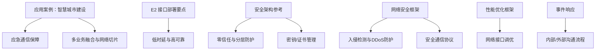
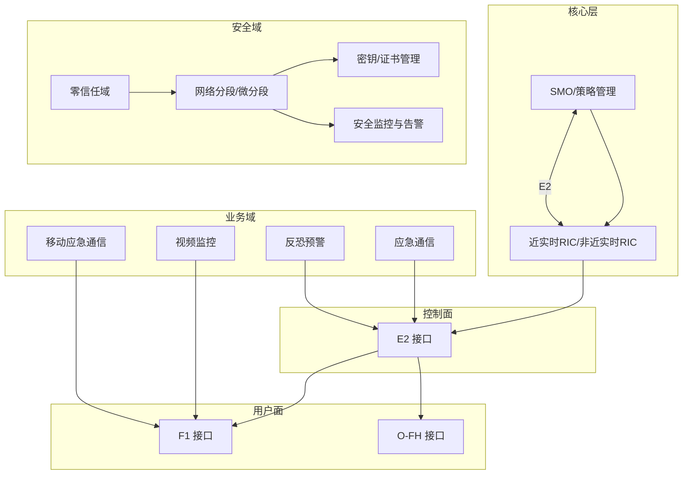
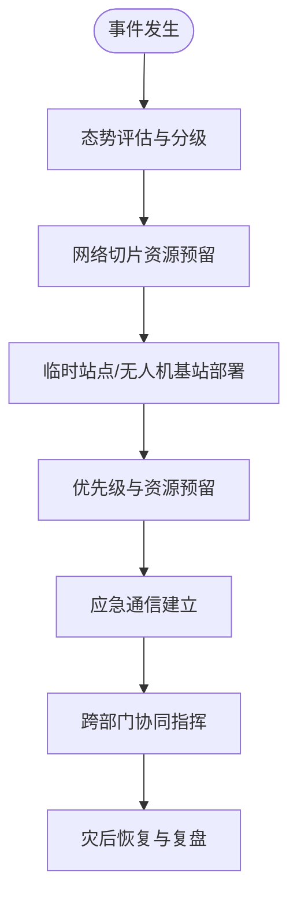
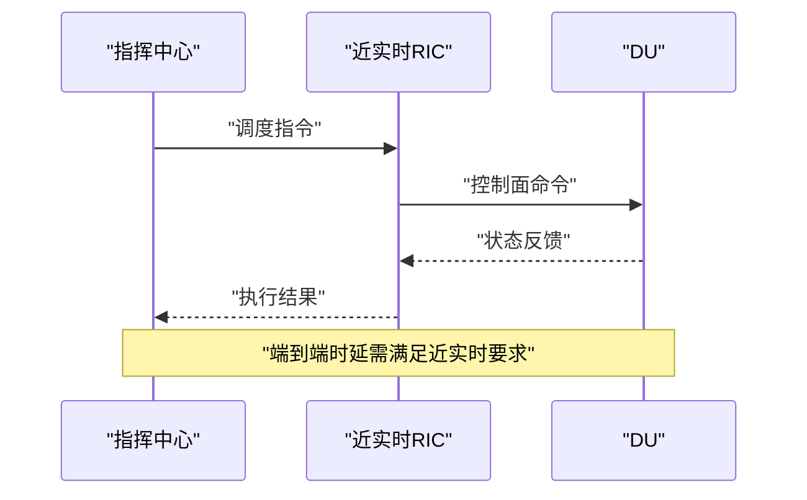
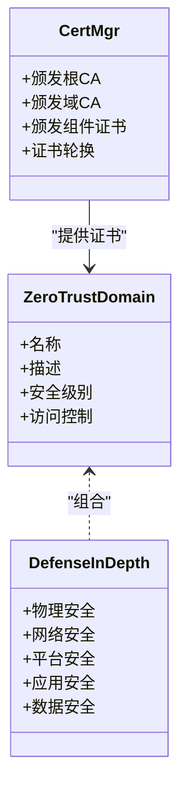
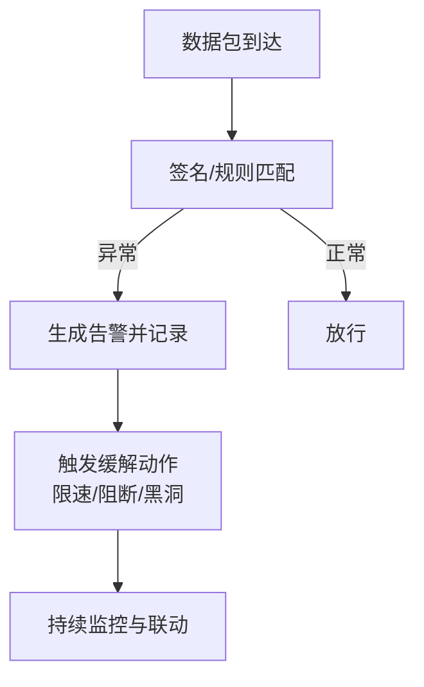
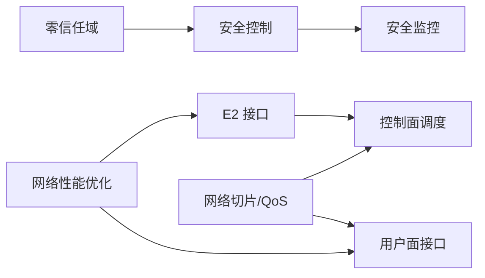

# 公共安全通信

<cite>
**本文引用的文件**
- [README.md](file://README.md)
- [应用案例：智慧城市建设](file://10-application-scenarios/readme.md)
- [E2 接口部署要点](file://03-interface-standards/e2-interface.md)
- [部署场景技术要求](file://04-disaggregation-options/deployment-scenarios.md)
- [网络性能优化框架](file://14-operations-management/performance-optimization/performance-optimization-framework.md)
- [安全架构参考](file://12-security-privacy/security-architecture/security-reference-architecture-zh.md)
- [网络安全框架](file://12-security-privacy/network-security/network-security-framework-zh.md)
- [认证框架](file://12-security-privacy/authentication/authentication-framework-zh.md)
- [安全监控与告警框架](file://12-security-privacy/monitoring-alerting/security-monitoring-framework.md)
- [安全事件响应](file://29-security-threats/incident-response/o-ran-incident-response-zh.md)
- [安全威胁防护](file://29-security-threats/attack-protection/o-ran-attack-protection.md)
- [未来应用路线图](file://15-future-development/emerging-applications/emerging-applications-roadmap.md)
- [最佳实践：架构设计](file://30-best-practices/architecture-practices/architecture-design-best-practices-zh.md)
</cite>

## 目录
1. [引言](#引言)
2. [项目结构](#项目结构)
3. [核心组件](#核心组件)
4. [架构总览](#架构总览)
5. [详细组件分析](#详细组件分析)
6. [依赖关系分析](#依赖关系分析)
7. [性能考量](#性能考量)
8. [故障排查指南](#故障排查指南)
9. [结论](#结论)
10. [附录](#附录)

## 引言
本文件面向公共安全通信系统建设，结合 O-RAN 在城市公共安全领域的典型应用场景，系统阐述应急指挥调度、灾难救援通信、重点区域监控与反恐预警等关键能力的网络设计与运行保障方案。内容覆盖专用通信网络设计、多层级指挥体系、跨部门协调机制以及紧急状态下的网络韧性与安全保障，旨在为城市级公共安全通信提供可落地的架构蓝图与实施建议。

## 项目结构
本知识库围绕 O-RAN 的架构、接口、安全、性能与应用展开，形成“架构—接口—安全—性能—应用”的完整知识谱系。与公共安全通信直接相关的内容主要集中在以下主题域：
- 应用场景：智慧城市建设中的应急通信保障与多业务融合
- 接口标准：E2 接口的低时延、高可靠部署要点
- 安全架构：零信任、分层防护与密钥/证书管理
- 网络安全：入侵检测、DDoS 防护与安全通信协议
- 性能优化：网络接口调优与资源效率提升
- 事件响应：内部/外部沟通流程与取证调查

章节来源
- [README.md](file://README.md#L1-L472)

## 核心组件
- 应急通信保障：面向自然灾害、大型活动、恐怖袭击等突发场景，提供抗毁、快速恢复、优先级保障的通信能力，支撑跨部门协同与现场指挥。
- 多业务融合与网络切片：按业务 SLA 切分网络资源，实现语音调度、视频监控、移动应急通信等差异化承载。
- E2 接口与 RIC：在近实时控制面实现低时延闭环，保障调度指令下发与状态反馈的确定性。
- 安全架构与零信任：通过域内分段、双向 TLS、RBAC、密钥管理与 SIEM 集成，构建纵深防御与持续验证。
- 网络安全与防护：基于 IDS/IPS、DDoS 缓解与速率限制，抵御网络层面威胁。
- 性能优化：通过内核参数、队列调度、NUMA 绑定与接口优先级映射，降低时延并提升吞吐。
- 事件响应：规范内部沟通、外部通知与取证流程，确保事件处置闭环。

章节来源
- [应用案例：智慧城市建设](file://10-application-scenarios/readme.md#L155-L183)
- [E2 接口部署要点](file://03-interface-standards/e2-interface.md#L90-L129)
- [安全架构参考](file://12-security-privacy/security-architecture/security-reference-architecture-zh.md#L8-L71)
- [网络安全框架](file://12-security-privacy/network-security/network-security-framework-zh.md#L1-L40)
- [网络性能优化框架](file://14-operations-management/performance-optimization/performance-optimization-framework.md#L6-L101)
- [安全事件响应](file://29-security-threats/incident-response/o-ran-incident-response-zh.md#L107-L154)

## 架构总览
公共安全通信系统采用“核心—汇聚—接入”分层架构，结合边缘计算与网络切片，实现业务隔离与就近处理；在控制面通过 E2 接口与 RIC 协同，确保调度指令的低时延与高可靠；在安全域内实施零信任与微分段，配合密钥/证书体系与 SIEM，实现持续监控与自动响应。

图表来源
- [应用案例：智慧城市建设](file://10-application-scenarios/readme.md#L155-L183)
- [E2 接口部署要点](file://03-interface-standards/e2-interface.md#L90-L129)
- [安全架构参考](file://12-security-privacy/security-architecture/security-reference-architecture-zh.md#L8-L71)
- [网络安全框架](file://12-security-privacy/network-security/network-security-framework-zh.md#L1-L40)

## 详细组件分析

### 应用场景：应急指挥调度与灾难救援通信
- 需求特征：超低时延、超高可靠、快速部署、优先级保障、跨部门协同。
- 网络设计：采用“临时容量扩展 + 优先级策略”，在紧急事件下为应急通信保留带宽与资源；通过网络切片隔离关键业务。
- 运行保障：部署快速恢复机制与备用路由，确保在基础设施受损情况下维持指挥链路。

章节来源
- [应用案例：智慧城市建设](file://10-application-scenarios/readme.md#L155-L183)

### E2 接口与近实时控制面
- 低时延与高可靠：明确 E2 接口的带宽、延迟与可靠性要求，实施集中/分布式/混合部署策略，配合专用传输网络与 QoS。
- 部署要点：IP 规划、访问控制、加密与认证，以及大规模连接、跨厂商互操作与性能优化。

章节来源
- [E2 接口部署要点](file://03-interface-standards/e2-interface.md#L90-L129)
- [E2 接口部署要点](file://03-interface-standards/e2-interface.md#L267-L304)

### 安全架构与零信任
- 零信任域划分：管理域、控制平面域、用户平面域、基础设施域，分别实施双向 TLS、RBAC、速率限制与微分段。
- 深度防御：物理安全、网络安全、平台安全、应用安全、数据安全五层防护。
- 密钥/证书管理：根 CA—域 CA—组件证书的层次化签发与轮换，组件密钥派生与加密存储。

章节来源
- [安全架构参考](file://12-security-privacy/security-architecture/security-reference-architecture-zh.md#L8-L71)
- [安全架构参考](file://12-security-privacy/security-architecture/security-reference-architecture-zh.md#L339-L484)

### 网络安全与防护
- 网络分段与微分段：基于零信任原则划分安全域，使用 VLAN/命名空间实现逻辑隔离。
- 入侵检测与防护：基于签名的 IDS/IPS，检测 SYN 洪水、端口扫描、畸形包等；结合 NFTables/iptables 实施速率限制与连接限制。
- DDoS 缓解：全局限速、源限速、突发窗口、黑洞路由与地理过滤等策略。
- 安全通信协议：TLS 1.3、OCSP Stapling、安全头配置与速率限制。

章节来源
- [网络安全框架](file://12-security-privacy/network-security/network-security-framework-zh.md#L114-L259)
- [网络安全框架](file://12-security-privacy/network-security/network-security-framework-zh.md#L261-L426)
- [网络安全框架](file://12-security-privacy/network-security/network-security-framework-zh.md#L428-L473)

### 认证与授权
- 多因子认证（MFA）：用户名/口令 + 动态令牌/智能卡/生物识别 + HSM 硬件安全模块。
- 基于角色的访问控制（RBAC）：角色权限矩阵与 LDAP 映射，限定访问范围与作用域。
- 最佳实践：强口令策略、凭证加密存储、自动轮换、审计与合规。

章节来源
- [认证框架](file://12-security-privacy/authentication/authentication-framework-zh.md#L1-L208)

### 安全监控与告警
- SIEM 集成：统一采集认证日志、网络异常、配置变更与性能异常，进行威胁检测与告警。
- 可视化与仪表盘：实时展示威胁态势、合规评分与加密健康度。
- 自动化响应：与告警系统联动，触发自动处置流程。

章节来源
- [安全监控与告警框架](file://12-security-privacy/monitoring-alerting/security-monitoring-framework.md#L219-L733)

### 事件响应与取证
- 内部沟通：安全消息、会议桥、共享文档与状态更新，遵循“需知”原则与升级流程。
- 外部沟通：客户通知、监管报告、合作伙伴协调与公关口径。
- 取证调查：系统镜像、日志收集、网络抓包、配置备份与证据链管理。

章节来源
- [安全事件响应](file://29-security-threats/incident-response/o-ran-incident-response-zh.md#L107-L154)
- [安全事件响应](file://29-security-threats/incident-response/o-ran-incident-response-zh.md#L139-L154)

### 移动应急通信与视频监控
- 移动应急通信：车载/便携式基站、卫星回传、跨域漫游与无缝切换。
- 视频监控：边缘分析与缓存、视频流优先级调度、与指挥系统的联动。
- 反恐预警：基于 AI 的异常行为检测、威胁情报聚合与自动预警。

章节来源
- [应用案例：智慧城市建设](file://10-application-scenarios/readme.md#L155-L183)
- [未来应用路线图](file://15-future-development/emerging-applications/emerging-applications-roadmap.md#L588-L877)

## 依赖关系分析
- 控制面依赖：E2 接口是近实时控制的关键，其部署架构（集中/分布式/混合）直接影响整体时延与可靠性。
- 安全依赖：零信任域划分与微分段为各业务域提供隔离边界；证书与密钥管理体系保障端到端加密与身份可信。
- 性能依赖：网络接口调优、NUMA 绑定与队列调度决定端到端时延与吞吐；切片与 QoS 确保关键业务优先。
- 运维依赖：安全监控与告警系统、事件响应流程与取证工具构成运行保障闭环。

图表来源
- [E2 接口部署要点](file://03-interface-standards/e2-interface.md#L90-L129)
- [安全架构参考](file://12-security-privacy/security-architecture/security-reference-architecture-zh.md#L8-L71)
- [网络安全框架](file://12-security-privacy/network-security/network-security-framework-zh.md#L1-L40)
- [网络性能优化框架](file://14-operations-management/performance-optimization/performance-optimization-framework.md#L6-L101)

## 性能考量
- 时延敏感设计：硬件加速（DPDK/SR-IOV/FPGA）、软件优化（内核 bypass、用户态协议栈、零拷贝）、架构优化（边缘计算、短路径、批处理）。
- 资源效率：CPU 亲和性、大页内存、NUMA 感知调度；存储分层与压缩；网络带宽动态分配与 QoS。
- 接口调优：Jumbo 帧、中断合并、优先级队列、端口映射（E2/F1/O-FH），内核参数与队列调度策略。
- 部署场景：核心/边缘/存储的计算与存储要求，确保网络、核心与边缘协同与自治。

章节来源
- [最佳实践：架构设计](file://30-best-practices/architecture-practices/architecture-design-best-practices-zh.md#L164-L254)
- [网络性能优化框架](file://14-operations-management/performance-optimization/performance-optimization-framework.md#L6-L101)
- [部署场景技术要求](file://04-disaggregation-options/deployment-scenarios.md#L296-L344)

## 故障排查指南
- 常见问题分类：硬件故障、软件缺陷、网络问题、配置错误。
- 排查流程：问题分类、定位根因、工具使用、修复与回归验证。
- 诊断工具：日志采集、网络抓包、性能指标、告警关联与事件工作流。
- 故障库：积累典型故障案例与解决知识库，沉淀经验。

章节来源
- [安全威胁防护](file://29-security-threats/attack-protection/o-ran-attack-protection.md#L179-L209)

## 结论
公共安全通信系统应以“应急优先、业务融合、安全可控、性能可靠”为核心目标，依托 O-RAN 的开放架构与接口标准，构建专用网络与多层级指挥体系，强化跨部门协调与紧急状态下的网络韧性。通过零信任安全域划分、深度防御与自动化监控，结合 E2 接口的低时延控制面与网络切片的差异化承载，实现语音调度、视频监控、移动应急通信与反恐预警的全面支撑，并以完善的事件响应与取证流程保障闭环管理。

## 附录
- 术语与缩写：E2、F1、O-FH、SMO、RIC、SIEM、RBAC、MFA、NFTables、DPDK、SR-IOV、TLS 1.3、OCSP。
- 参考资料：O-RAN 应用案例、接口标准、安全架构、网络安全、性能优化与最佳实践。