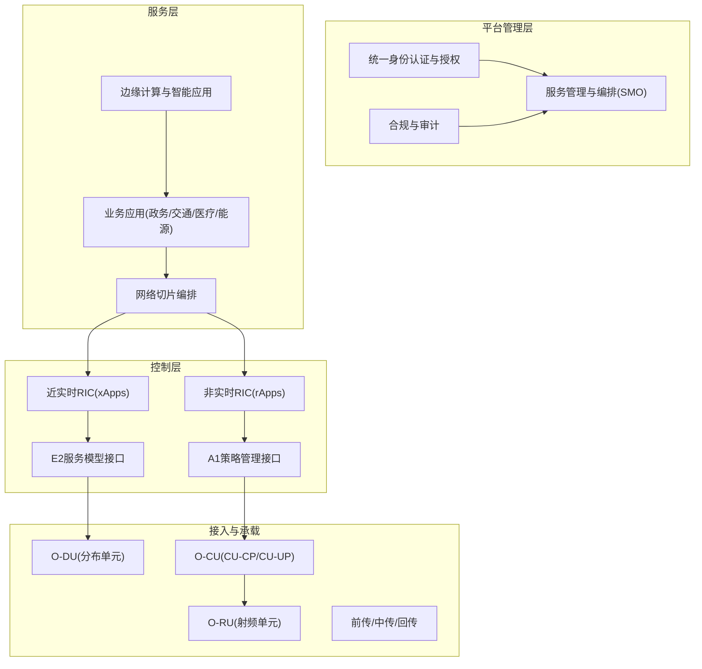
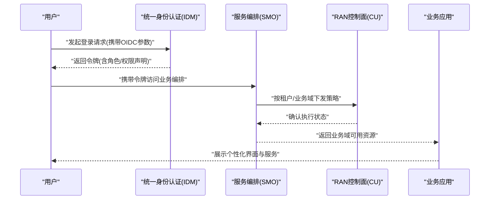
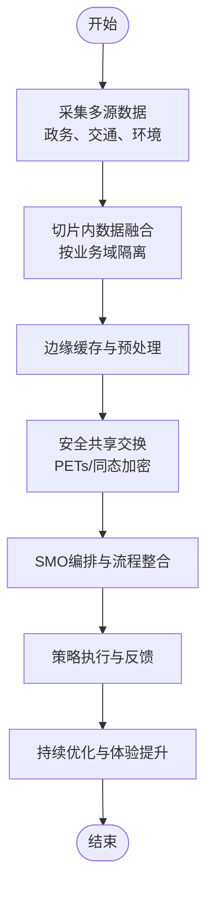
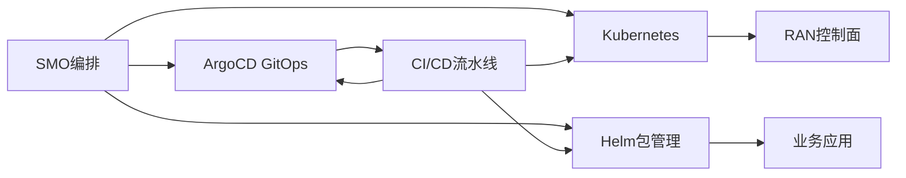
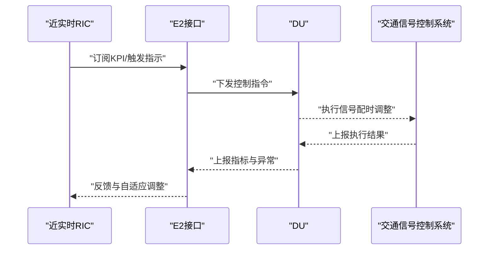
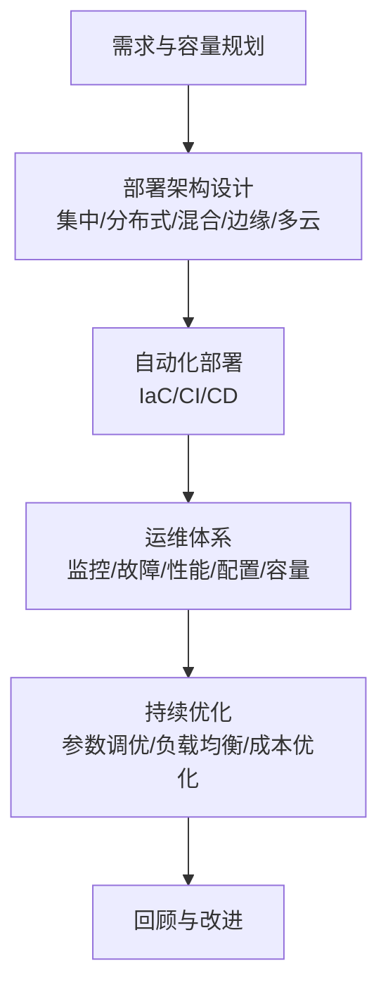
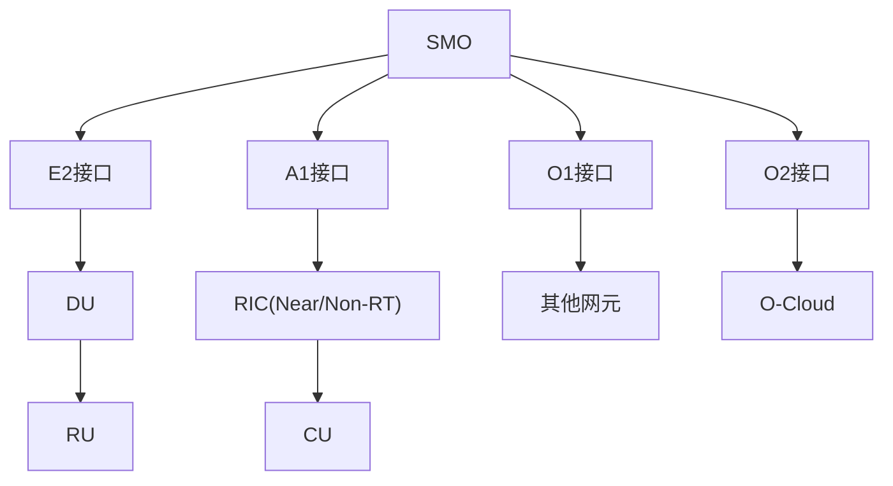

# 城市数字服务平台

<cite>
**本文引用的文件**
- [O-RAN知识库总览](file://README.md)
- [应用案例总览](file://10-application-scenarios/readme.md)
- [架构基础总览](file://01-architecture-system/readme.md)
- [RIC与智能算法总览](file://07-ric-development/readme.md)
- [部署实施总览](file://08-deployment-implementation/readme.md)
- [安全与隐私保护总览](file://12-security-privacy/readme.md)
</cite>

## 目录
1. [引言](#引言)
2. [项目结构](#项目结构)
3. [核心组件](#核心组件)
4. [架构总览](#架构总览)
5. [详细组件分析](#详细组件分析)
6. [依赖关系分析](#依赖关系分析)
7. [性能考量](#性能考量)
8. [故障排查指南](#故障排查指南)
9. [结论](#结论)
10. [附录](#附录)

## 引言
本文件面向“城市数字服务平台”的建设目标，系统化梳理O-RAN在智慧城市中的技术能力与实践路径，重点覆盖以下主题：
- 政务服务一体化：统一身份认证、跨部门数据共享、业务流程整合
- 市民信息服务：低时延V2X、视频监控、应急通信、智慧能源
- 城市运营管理：交通信号控制、环境监测、公共设施运维
- 数字治理平台：网络切片、边缘智能、安全与合规

同时，围绕统一身份认证、数据共享交换、业务流程整合与用户体验优化等关键诉求，给出平台架构、多租户管理、服务编排与安全保障机制的设计建议，并结合O-RAN在工业互联网、智慧交通、远程医疗等场景的成熟应用，支撑政府数字化转型、公共服务创新与城市治理现代化。

## 项目结构
该知识库以模块化方式组织，围绕O-RAN架构、接口标准、部署实施、应用案例、安全与隐私保护等维度构建，便于从不同视角理解O-RAN在智慧城市中的落地方法论。

```mermaid
graph TB
A["O-RAN知识库总览"] --> B["架构基础总览"]
A --> C["应用案例总览"]
A --> D["RIC与智能算法总览"]
A --> E["部署实施总览"]
A --> F["安全与隐私保护总览"]
B --> B1["参考架构与分层设计"]
B --> B2["核心网元与接口标准"]
B --> B3["云原生集成与弹性伸缩"]
C --> C1["5G网络应用(eMBB/URLLC/mMTC)"]
C --> C2["边缘计算与MEC集成"]
C --> C3["工业互联网与确定性网络"]
C --> C4["车联网与V2X通信"]
C --> C5["智慧城市与综合部署方案"]
C --> C6["远程医疗与医疗物联网"]
D --> D1["RIC架构与xApps/rApps开发"]
D --> D2["E2/A1接口深度应用"]
D --> D3["智能算法与机器学习优化"]
D --> D4["无线资源管理与能效优化"]
D --> D5["安全架构与威胁检测"]
E --> E1["部署架构设计(集中/分布式/混合/边缘/多云)"]
E --> E2["硬件与基础设施规划"]
E --> E3["集成测试策略"]
E --> E4["运维管理体系"]
E --> E5["自动化与编排"]
E --> E6["安全加固与监控"]
F --> F1["安全架构与零信任模型"]
F --> F2["身份认证与授权体系"]
F --> F3["数据保护与隐私增强"]
F --> F4["接口安全与合规审计"]
```

图表来源
- [O-RAN知识库总览](file://README.md#L1-L472)
- [应用案例总览](file://10-application-scenarios/readme.md#L1-L470)
- [架构基础总览](file://01-architecture-system/readme.md#L1-L161)
- [RIC与智能算法总览](file://07-ric-development/readme.md#L1-L368)
- [部署实施总览](file://08-deployment-implementation/readme.md#L1-L353)
- [安全与隐私保护总览](file://12-security-privacy/readme.md#L1-L67)

章节来源
- [O-RAN知识库总览](file://README.md#L1-L472)

## 核心组件
- 参考架构与分层设计：明确服务层、控制层、管理层的职责边界，以及O-Cloud基础设施的云原生定位与弹性伸缩能力。
- 核心网元与接口标准：O-RU、O-DU、O-CU（含CU-CP/CU-UP）、O-RIC（近实时/非实时）、SMO、O-CUCP/O-CUUP；接口包括F1、O-FH、E2、A1、O1、O2、OAM。
- 云原生集成与弹性伸缩：容器编排、微服务架构、自动化部署与弹性扩缩容。

章节来源
- [架构基础总览](file://01-architecture-system/readme.md#L1-L161)

## 架构总览
城市数字服务平台可基于O-RAN参考架构进行分层设计与功能分布，结合边缘计算与网络切片实现差异化服务保障。整体架构要点如下：
- 分层解耦：服务层负责业务编排与多租户管理；控制层负责资源调度与策略下发；管理层负责配置、计费与运维。
- 边缘协同：在交通、安防、能源等场景就近部署边缘节点，降低时延并提升可靠性。
- 网络切片：针对不同业务域（政务、交通、医疗、能源）划分独立切片，实现资源隔离与SLA保障。
- 安全与合规：采用零信任模型、端到端加密、细粒度访问控制与持续审计。

图表来源
- [架构基础总览](file://01-architecture-system/readme.md#L8-L35)
- [应用案例总览](file://10-application-scenarios/readme.md#L155-L183)
- [部署实施总览](file://08-deployment-implementation/readme.md#L8-L39)
- [安全与隐私保护总览](file://12-security-privacy/readme.md#L8-L27)

## 详细组件分析

### 组件A：统一身份认证与多租户管理
- 统一身份认证：基于OAuth 2.0/OpenID Connect与多因子认证（MFA），结合PKI证书与属性基加密（ABE），实现跨域单点登录与最小权限授权。
- 多租户管理：通过网络切片与业务域隔离，配合SMO的生命周期管理与配置管理，实现租户资源的动态分配与回收。
- 用户体验优化：简化注册与登录流程，提供移动端与PC端一致的服务入口，支持一键切换业务域。

图表来源
- [安全与隐私保护总览](file://12-security-privacy/readme.md#L14-L20)
- [部署实施总览](file://08-deployment-implementation/readme.md#L113-L124)
- [应用案例总览](file://10-application-scenarios/readme.md#L155-L183)

章节来源
- [安全与隐私保护总览](file://12-security-privacy/readme.md#L14-L27)
- [部署实施总览](file://08-deployment-implementation/readme.md#L113-L124)

### 组件B：数据共享交换与业务流程整合
- 数据共享交换：基于网络切片与边缘缓存策略，实现跨部门数据汇聚与分析；结合隐私增强技术（PETs）与同态加密，确保数据在传输与使用过程中的安全。
- 业务流程整合：利用SMO对业务域内的资源进行统一编排，结合E2接口的订阅/上报机制与A1接口的策略下发，形成闭环的流程编排与执行。
- 用户体验优化：通过统一门户聚合各业务域服务能力，提供“一网通办”与“一码通行”。

图表来源
- [应用案例总览](file://10-application-scenarios/readme.md#L155-L183)
- [部署实施总览](file://08-deployment-implementation/readme.md#L113-L124)
- [安全与隐私保护总览](file://12-security-privacy/readme.md#L21-L27)

章节来源
- [应用案例总览](file://10-application-scenarios/readme.md#L155-L183)
- [部署实施总览](file://08-deployment-implementation/readme.md#L113-L124)
- [安全与隐私保护总览](file://12-security-privacy/readme.md#L21-L27)

### 组件C：服务编排与安全保障机制
- 服务编排：基于SMO实现业务域的生命周期管理、配置管理与故障管理；结合Kubernetes/Helm/ArgoCD等工具实现GitOps式自动化交付。
- 安全保障：采用零信任模型、微分段、mTLS、API网关限流与签名校验；结合AI驱动的安全监控与威胁情报，建立自动化的响应闭环。

图表来源
- [部署实施总览](file://08-deployment-implementation/readme.md#L180-L196)
- [安全与隐私保护总览](file://12-security-privacy/readme.md#L8-L20)

章节来源
- [部署实施总览](file://08-deployment-implementation/readme.md#L180-L196)
- [安全与隐私保护总览](file://12-security-privacy/readme.md#L8-L20)

### 组件D：智能算法与边缘应用（以交通为例）
- RIC架构与xApps/rApps：近实时RIC用于毫秒级控制（如信号灯优先控制），非实时RIC用于分钟级策略（如流量预测与能耗优化）。
- E2接口服务模型：KPI订阅/上报、无线资源控制、CU-UP控制等；A1接口用于策略生成与分发。
- 智能算法：异常检测、预测性维护、自动优化；结合MEC实现本地化推理与决策。

图表来源
- [RIC与智能算法总览](file://07-ric-development/readme.md#L8-L33)
- [应用案例总览](file://10-application-scenarios/readme.md#L406-L420)

章节来源
- [RIC与智能算法总览](file://07-ric-development/readme.md#L8-L33)
- [应用案例总览](file://10-application-scenarios/readme.md#L406-L420)

### 组件E：部署架构与运维体系（以智慧交通为例）
- 部署架构：集中式（核心云）、分布式（区域边缘）、混合式（跨域编排）、边缘式（路侧RSU/MEC）、多云式（公私混合）。
- 运维体系：监控（Prometheus/Grafana）、故障管理（自动检测/隔离/恢复）、性能管理（KPI/KQI）、配置管理（CMDB/版本控制/自动化）、容量管理（预测/扩容/成本优化）。
- 自动化与编排：IaC（Terraform/Ansible）、CI/CD、自愈机制。

图表来源
- [部署实施总览](file://08-deployment-implementation/readme.md#L8-L39)
- [部署实施总览](file://08-deployment-implementation/readme.md#L94-L125)
- [部署实施总览](file://08-deployment-implementation/readme.md#L180-L196)

章节来源
- [部署实施总览](file://08-deployment-implementation/readme.md#L8-L39)
- [部署实施总览](file://08-deployment-implementation/readme.md#L94-L125)
- [部署实施总览](file://08-deployment-implementation/readme.md#L180-L196)

## 依赖关系分析
- 组件耦合与内聚：服务层与控制层通过E2/A1接口解耦；边缘应用与RAN控制通过近实时/非实时RIC协作；SMO作为编排中枢连接业务域与底层资源。
- 外部依赖与集成：与O-RAN联盟规范（WG1/WG2/WG3/WG5/WG6/WG7/WG8）、ETSI标准（TS 103 859/983/GS ORAN-005）及3GPP标准（NR/NG-RAN）保持一致。
- 接口契约：F1（CU-DU）、O-FH（前传）、E2（RIC-控制面）、A1（策略）、O1（管理）、O2（云资源）、OAM（整体运维）。

图表来源
- [架构基础总览](file://01-architecture-system/readme.md#L27-L35)
- [部署实施总览](file://08-deployment-implementation/readme.md#L158-L179)

章节来源
- [架构基础总览](file://01-architecture-system/readme.md#L27-L35)
- [部署实施总览](file://08-deployment-implementation/readme.md#L158-L179)

## 性能考量
- 低时延保障：边缘部署、优先调度、资源预留、空口参数优化。
- 高可靠设计：N+1冗余、快速故障检测与自动恢复、多路径路由与演练。
- 能效优化：负载感知动态开关、功率控制、休眠管理、绿色O-RAN实践。
- 智能运维：AI驱动监控、预测性维护、自动化故障处理、数字孪生仿真。

章节来源
- [应用案例总览](file://10-application-scenarios/readme.md#L316-L351)
- [部署实施总览](file://08-deployment-implementation/readme.md#L296-L321)

## 故障排查指南
- 问题分类：接口类（E2/A1/O1/O-FH/F1）、性能类（时延/吞吐/丢包）、可用性类（服务中断/退服）、配置类（参数错误/冲突）、兼容性类（多厂商对接）。
- 排查流程：问题定义与范围界定、信息收集（日志/指标/配置）、假设验证、根因分析（5 Why/鱼骨图/故障树/时间线/关联分析）、解决方案实施与验证、SOP固化与知识库更新。
- 诊断工具：Wireshark/tcpdump、协议分析器（E2/A1/O1）、ELK/Splunk、Perf/火焰图、Ping/Traceroute/MTR。

章节来源
- [部署实施总览](file://08-deployment-implementation/readme.md#L126-L157)

## 结论
O-RAN为城市数字服务平台提供了开放、智能、可编排的网络底座。通过统一身份认证与多租户管理、数据共享交换与业务流程整合、服务编排与安全保障机制，平台可在政务服务、市民服务、城市运营与数字治理等方面实现端到端的能力升级。结合边缘智能、网络切片与零信任安全，可有效支撑政府数字化转型、公共服务创新与城市治理现代化目标。

## 附录
- 应用场景参考：工业互联网（确定性网络/TSN）、智慧交通（V2X/低时延）、远程医疗（高带宽/高可靠）、智慧城市（综合部署/应急通信/能源管理）。
- 标准与规范：O-RAN联盟架构/WG1/WG2/WG3/WG5/WG6/WG7/WG8；ETSI TS 103 859/983/GS ORAN-005；3GPP NR/NG-RAN。

章节来源
- [应用案例总览](file://10-application-scenarios/readme.md#L389-L470)
- [架构基础总览](file://01-architecture-system/readme.md#L140-L161)
- [部署实施总览](file://08-deployment-implementation/readme.md#L251-L353)