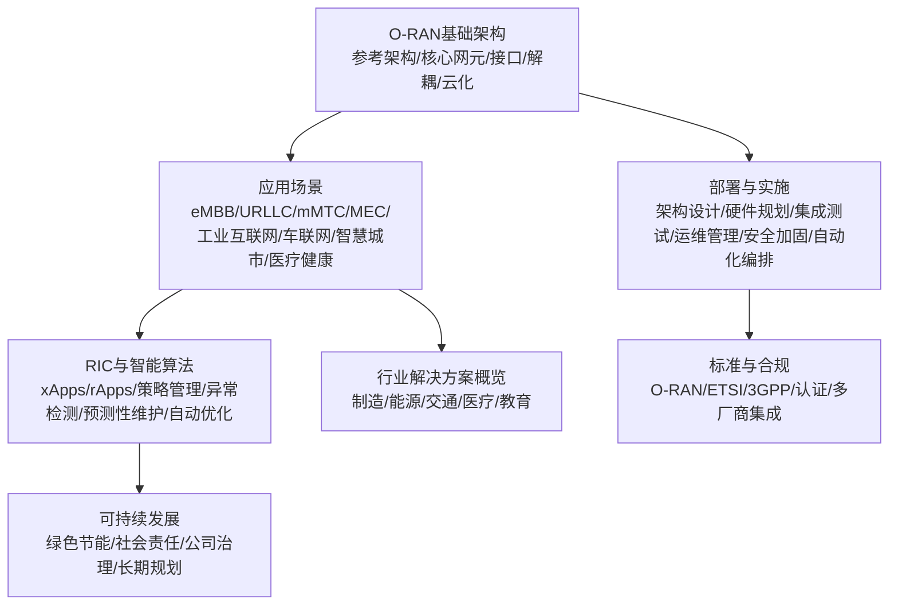
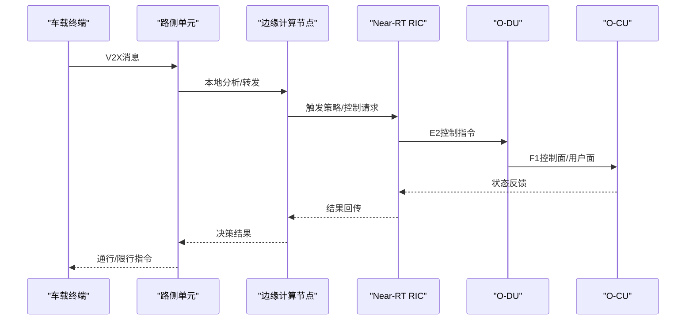
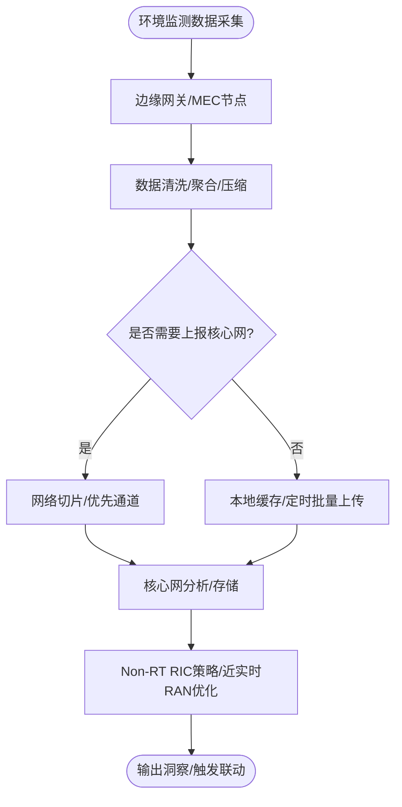
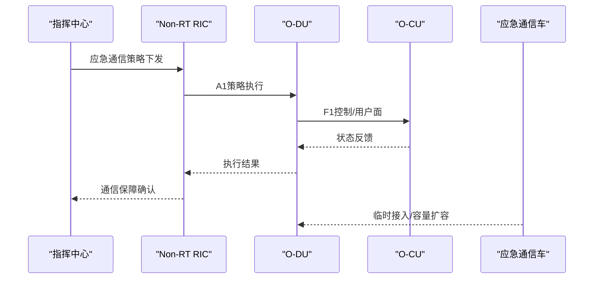
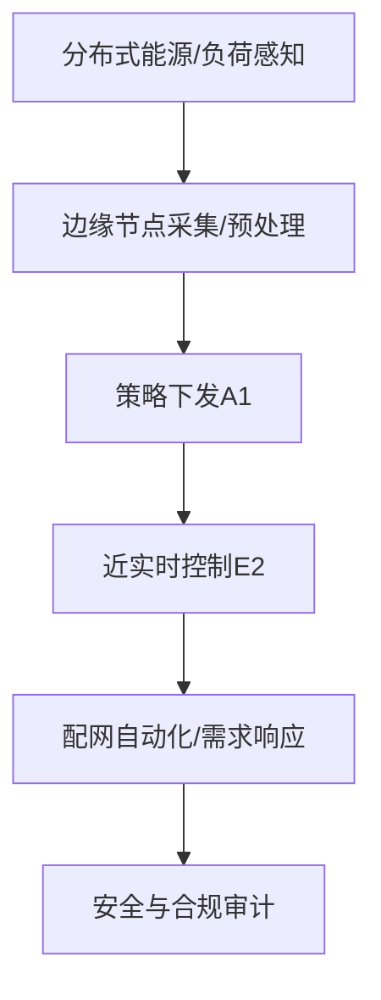
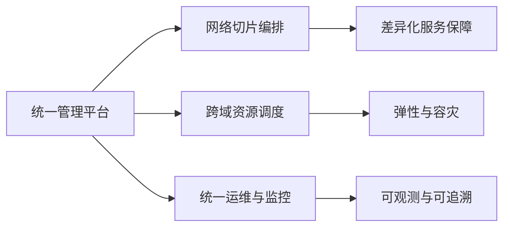
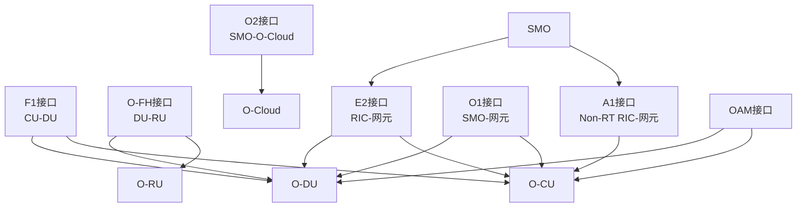

# 智慧城市建设应用

<cite>
**本文引用的文件**
- [O-RAN专家知识库总览](file://README.md)
- [应用案例与场景](file://10-application-scenarios/readme.md)
- [O-RAN基础架构](file://01-architecture-system/readme.md)
- [RIC与智能算法](file://07-ric-development/readme.md)
- [可持续发展](file://24-sustainable-development/readme.md)
- [部署与实施](file://08-deployment-implementation/readme.md)
- [标准与合规](file://09-standards-compliance/readme.md)
- [行业解决方案概览](file://16-industry-solutions/readme.md)
</cite>

## 目录
1. [引言](#引言)
2. [项目结构](#项目结构)
3. [核心组件](#核心组件)
4. [架构总览](#架构总览)
5. [详细组件分析](#详细组件分析)
6. [依赖关系分析](#依赖关系分析)
7. [性能考量](#性能考量)
8. [故障排查指南](#故障排查指南)
9. [结论](#结论)
10. [附录](#附录)

## 引言
本文件面向智慧城市（如交通、环境、公共安全、能源、数字服务）建设中的O-RAN综合应用，系统梳理O-RAN参考架构、关键接口、RIC智能能力、部署与运维体系、标准与合规要求，并给出城市级网络规划策略、技术标准制定与实施路径建议。内容来源于O-RAN专家知识库的权威文档与最佳实践，兼顾技术深度与工程落地。

## 项目结构
该知识库采用模块化组织，围绕“基础—核心—接口—解耦—云化—工作组—应用—安全—测试—运维—未来—生态—成本—人才—伙伴—案例—工具—国际—可持续—法律—性能—诊断—监控—安全威胁—最佳实践—过渡”等维度形成完整知识图谱。与智慧城市应用直接相关的模块包括：
- 基础架构与核心网元：明确CU/DU/RU、RIC、SMO等职责边界与接口
- 应用场景：覆盖eMBB/URLLC/mMTC、MEC、工业互联网、车联网、智慧城市、医疗健康等
- RIC与智能算法：提供xApps/rApps开发、策略管理、异常检测、预测性维护、自动优化等能力
- 部署与实施：涵盖架构设计、硬件规划、集成测试、运维管理、安全加固、自动化编排
- 标准与合规：O-RAN、ETSI、3GPP三大标准体系及认证流程
- 可持续发展：绿色节能、社会责任、公司治理、长期规划



章节来源
- [O-RAN专家知识库总览](file://README.md#L1-L472)

## 核心组件
- O-RAN参考架构：服务层、控制层、管理层三层划分，O-Cloud基础设施，弹性伸缩
- 核心网元：O-RU（射频）、O-DU（物理层/部分MAC）、O-CU（CU-CP/CP面；CU-UP/UP面）、O-RIC（Near-RT/Non-RT）、SMO（服务管理与编排）、O-CUCP/O-CUUP（跨厂商协调）
- 接口体系：F1（CU-DU）、O-FH（前传）、E2（RIC-网元）、A1（Non-RT RIC-NE）、O1（SMO-NE）、O2（SMO-O-Cloud）、OAM（整体网管）
- 解耦与云化：8种CU/DU拆分、前传拆分、部署场景、性能与成本权衡
- 工作组分工：WG1-8职责与标准制定

章节来源
- [O-RAN基础架构](file://01-architecture-system/readme.md#L1-L161)

## 架构总览
智慧城市应用的网络架构应遵循O-RAN参考架构，结合MEC边缘计算、网络切片、多厂商设备与跨域协同，实现“广覆盖、高容量、低功耗”的统一承载与差异化服务。

```mermaid
graph TB
subgraph "城市级网络"
U["终端设备<br/>车路协同/环境传感器/公共安全摄像头/智能电表"]
MEC["边缘计算节点<br/>MEC/边缘AI/缓存/网关"]
RAN["O-RAN RAN<br/>O-RU/O-DU/O-CU"]
CORE["核心网<br/>5GC/UPF/AMF/UDM等"]
SMO["SMO<br/>服务编排/配置/故障"]
RIC["O-RIC<br/>Near-RT/Non-RT"]
end
U --> MEC
MEC --> RAN
RAN --> CORE
SMO <- --> RAN
RIC <- --> RAN
SMO --> RIC
```

图表来源
- [O-RAN基础架构](file://01-architecture-system/readme.md#L8-L35)
- [应用案例与场景](file://10-application-scenarios/readme.md#L155-L183)

## 详细组件分析

### 智能交通管理系统
- 场景需求：V2X（车路协同）、低时延（<1ms）、高可靠（99.999%）、广覆盖（高速/隧道/城区）
- 关键能力：边缘计算就近处理、优先调度、冗余设计、确定性网络（TSN）
- RIC支撑：Near-RT RIC实现毫秒级闭环控制（xApps），Non-RT RIC进行策略下发与优化（rApps）
- 部署要点：RSU密度与位置优化、边缘节点与DU/CU协同、网络切片隔离



图表来源
- [应用案例与场景](file://10-application-scenarios/readme.md#L118-L153)
- [O-RAN基础架构](file://01-architecture-system/readme.md#L21-L34)
- [RIC与智能算法](file://07-ric-development/readme.md#L8-L26)

章节来源
- [应用案例与场景](file://10-application-scenarios/readme.md#L118-L153)
- [RIC与智能算法](file://07-ric-development/readme.md#L34-L78)

### 环境监测网络部署
- 场景需求：海量连接（mMTC）、低功耗、广覆盖、边缘预处理
- 关键能力：MEC边缘网关、协议转换、数据聚合、缓存与回传
- RIC支撑：Non-RT RIC进行策略管理（如采集频率、上报阈值），Near-RT RIC做异常检测与联动
- 部署要点：边缘节点密度、回传带宽、设备认证与安全



图表来源
- [应用案例与场景](file://10-application-scenarios/readme.md#L23-L29)
- [应用案例与场景](file://10-application-scenarios/readme.md#L177-L183)
- [部署与实施](file://08-deployment-implementation/readme.md#L27-L38)

章节来源
- [应用案例与场景](file://10-application-scenarios/readme.md#L23-L29)
- [部署与实施](file://08-deployment-implementation/readme.md#L40-L61)

### 公共安全通信保障
- 场景需求：应急通信、抗毁设计、临时扩容、优先级与资源预留
- 关键能力：多活/多域协同、快速部署（应急通信车/无人机基站）、端到端SLA
- RIC支撑：策略集中下发与执行（A1），近实时控制（E2）保障关键业务
- 部署要点：跨部门协调、频谱协调、电源与维护保障



图表来源
- [应用案例与场景](file://10-application-scenarios/readme.md#L170-L176)
- [O-RAN基础架构](file://01-architecture-system/readme.md#L27-L34)
- [部署与实施](file://08-deployment-implementation/readme.md#L158-L179)

章节来源
- [应用案例与场景](file://10-application-scenarios/readme.md#L170-L176)
- [部署与实施](file://08-deployment-implementation/readme.md#L158-L179)

### 智能能源管理
- 场景需求：配网自动化、需求响应、分布式能源（光伏/储能）、电动汽车充电
- 关键能力：低时延、高可靠、安全与实时性并重
- RIC支撑：策略管理（A1）与近实时控制（E2）协同，提升负荷预测与削峰填谷能力
- 部署要点：杆塔/管道布设、电磁环境与运维安全



图表来源
- [应用案例与场景](file://10-application-scenarios/readme.md#L177-L183)
- [RIC与智能算法](file://07-ric-development/readme.md#L79-L97)

章节来源
- [应用案例与场景](file://10-application-scenarios/readme.md#L177-L183)
- [RIC与智能算法](file://07-ric-development/readme.md#L79-L97)

### 城市数字服务
- 场景需求：多部门协同、统一平台、数据融合、服务可用性与快速响应
- 关键能力：网络切片隔离差异化服务、统一编排与运维、跨域资源调度
- RIC支撑：策略驱动的资源调度与优化，异常检测与自愈
- 部署要点：跨部门协调机制、标准统一、数据隐私与安全



图表来源
- [应用案例与场景](file://10-application-scenarios/readme.md#L155-L169)
- [部署与实施](file://08-deployment-implementation/readme.md#L94-L125)

章节来源
- [应用案例与场景](file://10-application-scenarios/readme.md#L155-L169)
- [部署与实施](file://08-deployment-implementation/readme.md#L94-L125)

## 依赖关系分析
- 组件耦合与内聚：O-RAN通过标准化接口（F1/O-FH/E2/A1/O1/O2/OAM）实现软硬解耦与跨厂商兼容
- 直接/间接依赖：DU/CU/RU之间通过F1/O-FH耦合；RIC作为中枢协调DU/CU与外部策略；SMO负责端到端编排
- 外部依赖：ETSI/3GPP标准约束接口与协议；合规与认证决定多厂商互通与商用许可
- 风险点：接口一致性、跨域同步、策略冲突、安全边界



图表来源
- [O-RAN基础架构](file://01-architecture-system/readme.md#L27-L34)
- [标准与合规](file://09-standards-compliance/readme.md#L15-L44)

章节来源
- [O-RAN基础架构](file://01-architecture-system/readme.md#L27-L34)
- [标准与合规](file://09-standards-compliance/readme.md#L15-L44)

## 性能考量
- 低时延：边缘下沉、优先调度、资源预留、空口参数优化
- 高可靠：N+1冗余、多路径路由、快速故障检测与恢复
- 高容量：载波聚合、网络切片、资源动态调度
- 能效：动态睡眠、功率控制、负载感知、绿色节能
- 可观测性：KPI/KQI监控、根因分析、预测性维护

章节来源
- [应用案例与场景](file://10-application-scenarios/readme.md#L314-L351)
- [部署与实施](file://08-deployment-implementation/readme.md#L94-L125)
- [可持续发展](file://24-sustainable-development/readme.md#L6-L18)

## 故障排查指南
- 分类与流程：接口故障、性能问题、可用性问题、配置问题、兼容性问题
- 工具链：Wireshark/tcpdump、协议分析、日志分析（ELK/Splunk）、性能分析（Perf/火焰图）、网络监控（Ping/Traceroute/MTR）
- 方法论：5 Why/Fishbone/故障树/时间线/关联分析
- SOP：故障响应、升级、沟通、复盘、知识库更新

章节来源
- [部署与实施](file://08-deployment-implementation/readme.md#L126-L156)

## 结论
O-RAN为智慧城市提供了开放、灵活、智能化的网络底座。通过标准化接口与云化架构，结合RIC智能能力与MEC边缘协同，可在交通、环境、公共安全、能源、数字服务等多场景实现差异化服务与统一管理。标准与合规贯穿始终，部署与运维体系保障稳定运行，可持续发展理念贯穿全生命周期。

## 附录

### 网络规划策略与实施路径
- 规划策略
  - 城市级分层架构：核心层（汇聚/核心网）、汇聚层（区域/边缘）、接入层（站点/边缘）
  - 异构网络：宏站/微站/皮站/飞站协同，满足不同覆盖与容量需求
  - 边缘计算：分布式边缘节点与边缘云，就近处理与缓存
  - 网络切片：按业务场景划分切片，实现资源隔离与差异化SLA
- 实施路径
  - 需求与场景识别→网络与边缘规划→设备选型与部署→接口与功能测试→集成与联调→运维与优化→安全与合规→持续演进

章节来源
- [应用案例与场景](file://10-application-scenarios/readme.md#L163-L169)
- [部署与实施](file://08-deployment-implementation/readme.md#L8-L39)

### 技术标准制定与合规
- 标准体系：O-RAN（WG1-8）、ETSI（Fronthaul/A1/安全）、3GPP（5G NR/NG-RAN）
- 合规流程：自评估→符合性测试→互操作测试→第三方认证→持续监控
- 多厂商集成：Plugfest参与、接口适配层、统一测试方案

章节来源
- [标准与合规](file://09-standards-compliance/readme.md#L8-L44)
- [标准与合规](file://09-standards-compliance/readme.md#L110-L135)
- [标准与合规](file://09-standards-compliance/readme.md#L136-L161)

### 跨部门协调与统一管理平台
- 统一平台：SMO编排、跨域资源调度、统一运维与监控
- 协调机制：跨部门标准统一、数据共享与隐私保护、应急联动预案
- 行业方案：制造业（智能工厂）、能源（智能电网）、交通（智慧交通）、医疗（远程医疗）、教育（智慧校园）

章节来源
- [应用案例与场景](file://10-application-scenarios/readme.md#L155-L169)
- [行业解决方案概览](file://16-industry-solutions/readme.md#L38-L52)