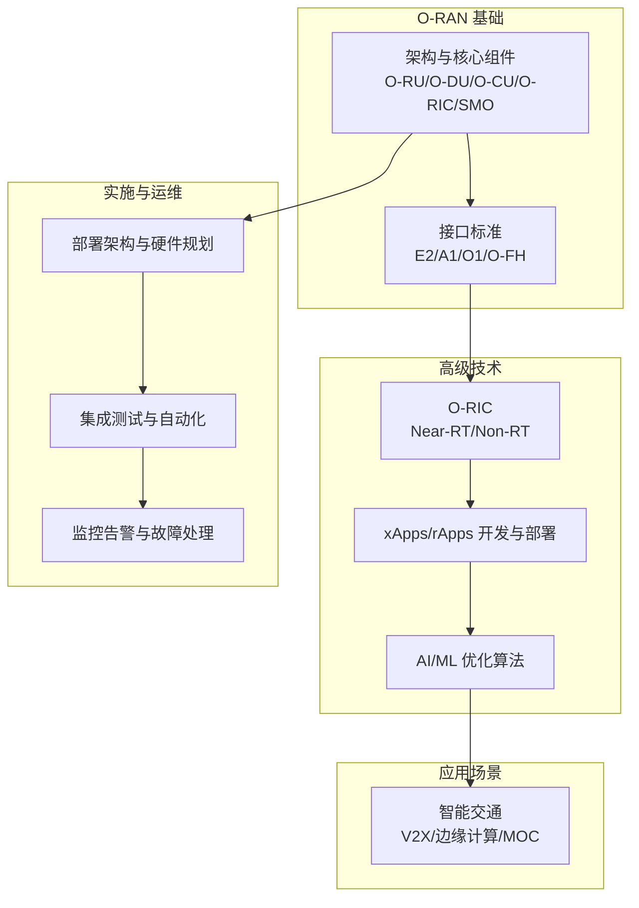
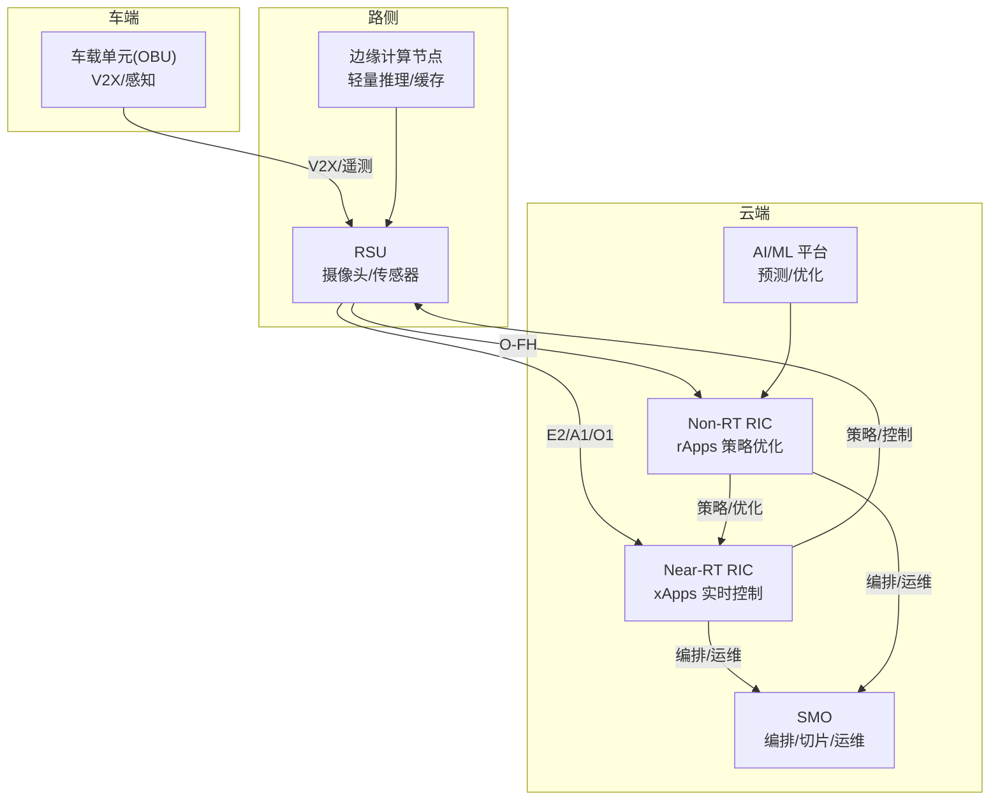
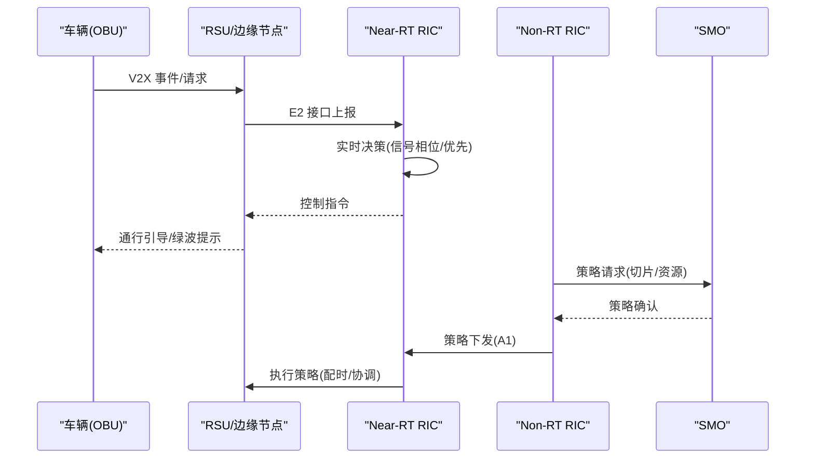
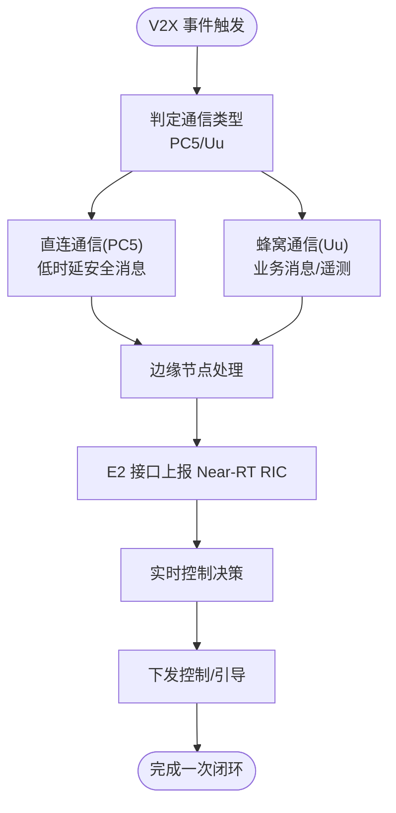
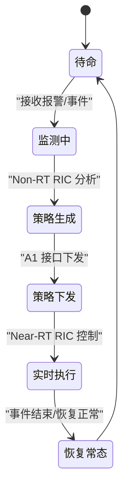
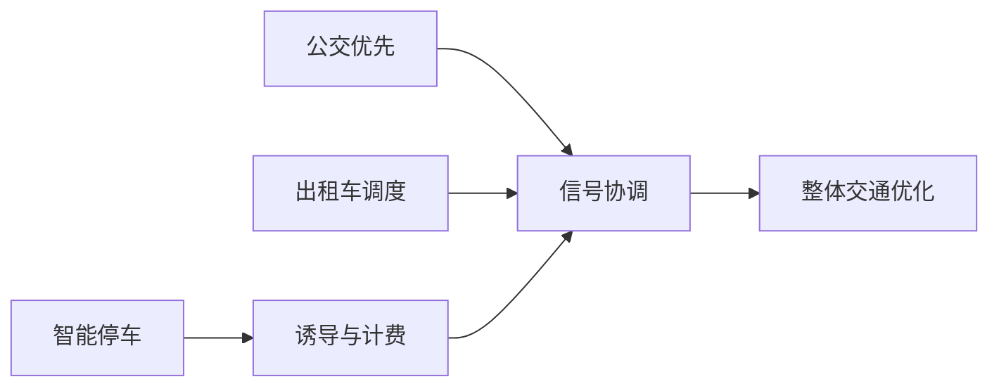
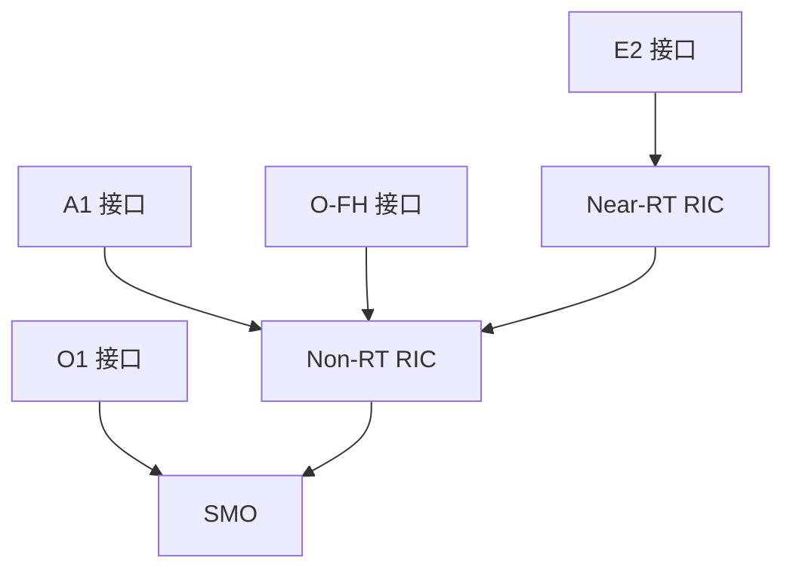

# 智能交通管理

<cite>
**本文引用的文件**
- [O-RAN 应用场景](file://10-application-scenarios/readme.md)
- [O-RAN 高级技术](file://07-ric-development/readme.md)
- [E2 接口](file://03-interface-standards/e2-interface.md)
- [O-RIC](file://02-core-components/o-ric.md)
- [O-RAN 实施](file://08-deployment-implementation/readme.md)
- [O-RAN 基础](file://01-architecture-system/readme.md)
- [O-FH 接口](file://03-interface-standards/o-fh-interface.md)
- [O-RAN 标准与合规](file://09-standards-compliance/readme.md)
- [O-RAN 运维管理](file://14-operations-management/readme.md)
</cite>

## 目录
1. [引言](#引言)
2. [项目结构](#项目结构)
3. [核心组件](#核心组件)
4. [架构总览](#架构总览)
5. [详细组件分析](#详细组件分析)
6. [依赖关系分析](#依赖关系分析)
7. [性能考虑](#性能考虑)
8. [故障排查指南](#故障排查指南)
9. [结论](#结论)
10. [附录](#附录)

## 引言
本文件面向智能交通管理场景，系统阐述如何基于 O-RAN 架构实现城市交通的“车-路-云”协同，覆盖交通流量监测、信号灯优化控制、拥堵缓解策略与智能停车管理，并给出车载通信系统、路侧设备部署、边缘计算节点配置与实时数据分析处理的工程化方案。文档同时提供交通信号控制系统架构、车路协同通信协议、紧急救援响应机制与多模式交通整合方案，以及交通管理需求分析、系统集成策略与运营维护流程的完整落地指南。

## 项目结构
围绕 O-RAN 在智能交通中的应用，本知识库提供了从基础架构到高级应用、从接口标准到实施运维的完整知识谱系。对于智能交通管理，以下目录与主题尤为关键：
- O-RAN 基础与核心组件：明确 O-RAN 的分层架构、核心网元（O-RU/O-DU/O-CU/O-RIC/SMO）及接口体系，奠定系统设计基础
- 接口标准：E2/A1/O1/O-FH 等接口的协议与实现要点，支撑车路协同与跨厂商互操作
- 高级技术：RAN 智能控制器（O-RIC）的近实时与非实时能力，xApps/rApps 的开发与部署，AI/ML 在交通优化中的应用
- 应用场景：智能交通、V2X、边缘计算与 MEC 的融合实践
- 实施与运维：部署架构、硬件与基础设施规划、集成测试、监控告警、故障处理、自动化与安全加固
- 标准与合规：O-RAN、ETSI、3GPP 标准的协同应用与多厂商互操作

**章节来源**
- [O-RAN 基础](file://01-architecture-system/readme.md#L1-L161)
- [O-RAN 应用场景](file://10-application-scenarios/readme.md#L1-L470)
- [O-RAN 高级技术](file://07-ric-development/readme.md#L1-L368)
- [O-RAN 实施](file://08-deployment-implementation/readme.md#L1-L353)

## 核心组件
- O-RU/O-DU/O-CU：承担无线接入与核心网功能，支撑车地通信与承载
- O-RIC：近实时 RIC（Near-RT）与非实时 RIC（Non-RT）协同，提供 xApps/rApps 的运行与管理环境，实现车路协同的实时控制与策略优化
- SMO：服务管理与编排，负责网络服务生命周期与跨域资源协调
- 接口标准：E2（RIC 与 CU/DU）、A1（策略管理）、O1（SMO 管理）、O-FH（前传）等，确保跨厂商互操作与端到端协同

这些组件共同构成智能交通系统的核心能力：感知（路侧与车载设备）、决策（O-RIC 与 AI/ML）、执行（信号控制与路径引导）、编排（SMO 与网络切片）。

**章节来源**
- [O-RAN 基础](file://01-architecture-system/readme.md#L15-L35)
- [O-RIC](file://02-core-components/o-ric.md#L1-L437)
- [O-FH 接口](file://03-interface-standards/o-fh-interface.md#L1-L397)

## 架构总览
智能交通 O-RAN 架构以“车-路-云”三层协同为核心：
- 车端：车载单元（OBU），支持 V2X 通信与本地感知
- 路侧：RSU（路侧单元），部署摄像头、传感器与边缘计算节点，实现本地数据汇聚与轻量推理
- 云端：O-RIC（Near-RT/Non-RT）、SMO、AI/ML 平台，实现全局优化与策略下发

**图示来源**
- [O-RIC](file://02-core-components/o-ric.md#L7-L133)
- [O-FH 接口](file://03-interface-standards/o-fh-interface.md#L59-L116)
- [O-RAN 应用场景](file://10-application-scenarios/readme.md#L118-L154)

**章节来源**
- [O-RAN 应用场景](file://10-application-scenarios/readme.md#L118-L154)
- [O-RIC](file://02-core-components/o-ric.md#L7-L133)
- [O-FH 接口](file://03-interface-standards/o-fh-interface.md#L59-L116)

## 详细组件分析

### 交通信号控制系统架构
- Near-RT RIC 通过 E2 接口与路侧 DU/RRU 通信，执行毫秒级控制闭环（如信号相位、绿波带宽、优先通行）
- Non-RT RIC 通过 A1 接口进行策略下发，结合历史与实时数据，生成长期优化策略（如多交叉口协同、分时段配时）
- SMO 负责网络切片与资源编排，保障交通控制的差异化 SLA

**图示来源**
- [E2 接口](file://03-interface-standards/e2-interface.md#L63-L90)
- [O-RIC](file://02-core-components/o-ric.md#L21-L58)
- [O-RAN 实施](file://08-deployment-implementation/readme.md#L8-L39)

**章节来源**
- [O-RIC](file://02-core-components/o-ric.md#L7-L133)
- [E2 接口](file://03-interface-standards/e2-interface.md#L63-L147)
- [O-RAN 实施](file://08-deployment-implementation/readme.md#L8-L39)

### 车路协同通信协议
- V2X 通信：PC5（直连）与 Uu（蜂窝）结合，满足安全消息与业务消息的差异化需求
- 低时延与高可靠：Near-RT RIC + 边缘计算 + E2 接口，确保毫秒级控制闭环
- 网络切片与 QoS：为交通控制、应急通信、高清视频等业务提供差异化保障

**图示来源**
- [O-RAN 应用场景](file://10-application-scenarios/readme.md#L118-L146)
- [E2 接口](file://03-interface-standards/e2-interface.md#L79-L90)

**章节来源**
- [O-RAN 应用场景](file://10-application-scenarios/readme.md#L118-L146)
- [E2 接口](file://03-interface-standards/e2-interface.md#L79-L147)

### 紧急救援响应机制
- 非实时策略：Non-RT RIC 基于历史与态势预测，生成优先通行与路径避让策略
- 实时执行：Near-RT RIC 通过 E2 接口快速调整信号配时，保障救援通道畅通
- 多部门协同：SMO 统筹交通、公安、医疗等资源，实现跨系统联动

**图示来源**
- [O-RIC](file://02-core-components/o-ric.md#L33-L72)
- [O-RAN 实施](file://08-deployment-implementation/readme.md#L94-L125)

**章节来源**
- [O-RIC](file://02-core-components/o-ric.md#L33-L72)
- [O-RAN 实施](file://08-deployment-implementation/readme.md#L94-L125)

### 多模式交通整合方案
- 公共交通优先：基于 O-RIC 的绿波协调与专用车道信号控制
- 智能停车：路内/路外车位状态采集与诱导，结合边缘与云端协同
- 出租车/网约车调度：基于车流预测与供需匹配，动态引导停靠与掉头

**图示来源**
- [O-RAN 应用场景](file://10-application-scenarios/readme.md#L155-L184)
- [O-RIC](file://02-core-components/o-ric.md#L15-L32)

**章节来源**
- [O-RAN 应用场景](file://10-application-scenarios/readme.md#L155-L184)
- [O-RIC](file://02-core-components/o-ric.md#L15-L32)

### 车载通信系统与路侧设备部署
- 车载通信：OBU 集成 V2X 收发模块，支持安全消息与业务消息；边缘节点提供本地缓存与轻推理
- 路侧部署：RSU 部署密度与位置需结合道路等级、交叉口分布与覆盖盲区；前传采用 O-FH（eCPRI/RoE），保障低时延与高可靠
- 边缘计算：就近处理热点数据，减少回传压力；与 O-RIC 协同，实现“边-管-云”三级联动

**章节来源**
- [O-FH 接口](file://03-interface-standards/o-fh-interface.md#L117-L198)
- [O-RAN 应用场景](file://10-application-scenarios/readme.md#L118-L154)

### 边缘计算节点配置与实时数据分析
- 节点选址：靠近 RSU/交叉口，满足 E2 接口时延预算；具备冗余供电与散热条件
- 资源规划：CPU/内存/存储按数据吞吐与模型推理需求配置；结合容器化与微服务架构
- 数据处理：边缘缓存热点数据，进行异常检测与短期预测；与云端 AI/ML 平台协同训练与推理

**章节来源**
- [O-RAN 高级技术](file://07-ric-development/readme.md#L52-L80)
- [O-RAN 实施](file://08-deployment-implementation/readme.md#L27-L39)

### 交通信号优化控制与拥堵缓解策略
- 实时控制：Near-RT RIC 基于 E2 接口的实时反馈，动态调整相位、绿波与优先通行
- 策略优化：Non-RT RIC 基于 A1 接口下发策略，结合历史与预测数据，实现多交叉口协同与分时段优化
- 拥堵缓解：基于车流/排队长度/速度的闭环控制，结合路径引导与限行策略

**章节来源**
- [O-RIC](file://02-core-components/o-ric.md#L7-L72)
- [E2 接口](file://03-interface-standards/e2-interface.md#L131-L147)
- [O-RAN 高级技术](file://07-ric-development/readme.md#L125-L170)

## 依赖关系分析
- 接口耦合：E2/A1/O1/O-FH 形成端到端依赖链，任一环节不兼容将影响车路协同
- 组件内聚：Near-RT RIC 与 Non-RT RIC 在控制与策略层面互补，SMO 负责编排与资源协调
- 外部依赖：3GPP/ETSI/O-RAN 标准约束接口与协议；多厂商设备互操作依赖 Plugfest 与一致性测试

**图示来源**
- [O-RIC](file://02-core-components/o-ric.md#L73-L133)
- [E2 接口](file://03-interface-standards/e2-interface.md#L63-L90)
- [O-FH 接口](file://03-interface-standards/o-fh-interface.md#L59-L98)

**章节来源**
- [O-RIC](file://02-core-components/o-ric.md#L73-L133)
- [E2 接口](file://03-interface-standards/e2-interface.md#L63-L90)
- [O-FH 接口](file://03-interface-standards/o-fh-interface.md#L59-L98)

## 性能考虑
- 时延与可靠性：Near-RT RIC 控制闭环应低于毫秒级；E2/A1/O-FH 网络需预留 QoS 与冗余
- 带宽与压缩：O-FH 传输带宽按天线数与调制方式计算，结合 IQ 数据压缩与链路聚合
- 资源利用率：容器化与微服务架构提升弹性；结合自动扩缩容与容量预测，避免过载
- AI/ML 推理：边缘侧轻量模型与云端联合训练，平衡延迟与精度

**章节来源**
- [E2 接口](file://03-interface-standards/e2-interface.md#L131-L197)
- [O-FH 接口](file://03-interface-standards/o-fh-interface.md#L117-L198)
- [O-RAN 高级技术](file://07-ric-development/readme.md#L151-L170)

## 故障排查指南
- 常见问题分类：接口故障（E2/A1/O1/O-FH）、性能劣化（时延/吞吐/抖动）、可用性问题（服务中断/退服）、配置问题（参数冲突/版本不一致）、兼容性问题（多厂商差异）
- 排查流程：问题定义与范围界定、信息收集（日志/指标/配置）、假设验证、根因分析（5 Why/鱼骨图/故障树）、修复与验证
- 诊断工具：Wireshark/tcpdump、协议分析器（E2/A1/O1）、日志分析（ELK/Splunk）、性能分析（Perf/火焰图）、网络连通性工具（Ping/Traceroute/MTR）
- SOP：故障响应、升级流程、沟通机制、复盘与知识库更新

**章节来源**
- [O-RAN 实施](file://08-deployment-implementation/readme.md#L126-L157)

## 结论
基于 O-RAN 的智能交通管理，以 O-RIC 为核心，依托 E2/A1/O1/O-FH 接口与边缘计算，形成“车-路-云”协同的闭环系统。通过 Near-RT 实时控制与 Non-RT 策略优化相结合，可实现交通信号的智能优化、拥堵缓解与应急救援的快速响应；配合 SMO 的编排与网络切片，满足多模式交通的差异化需求。在工程实践中，应重视标准合规、多厂商互操作、自动化运维与安全防护，确保系统稳定、高效、可演进。

## 附录
- 术语与缩写：O-RAN、O-RIC、Near-RT RIC、Non-RT RIC、E2/A1/O1/O-FH、V2X、RSU、OBU、SMO、MEC、AI/ML
- 参考资料：O-RAN 基础、接口标准、高级技术、应用场景、实施与运维、标准与合规、运维管理