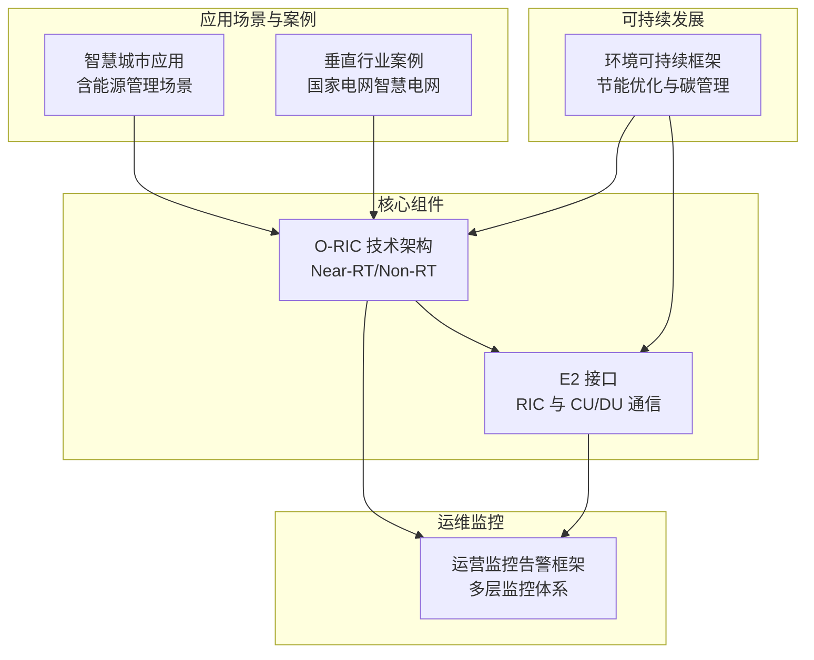
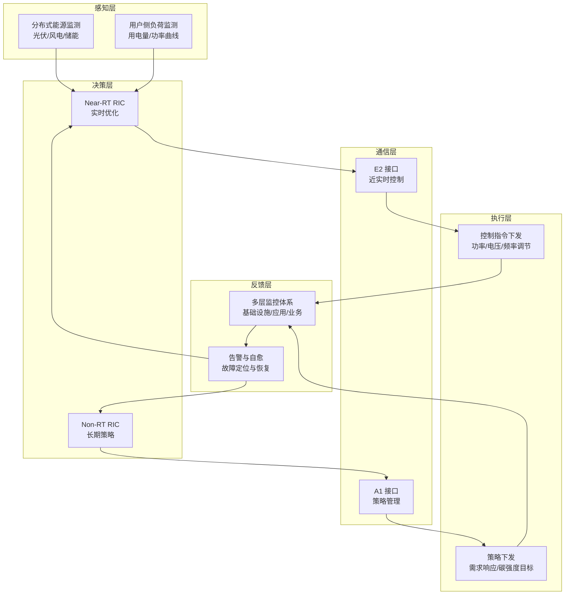
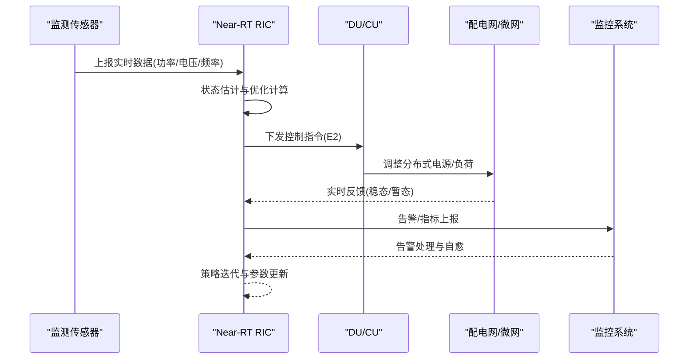
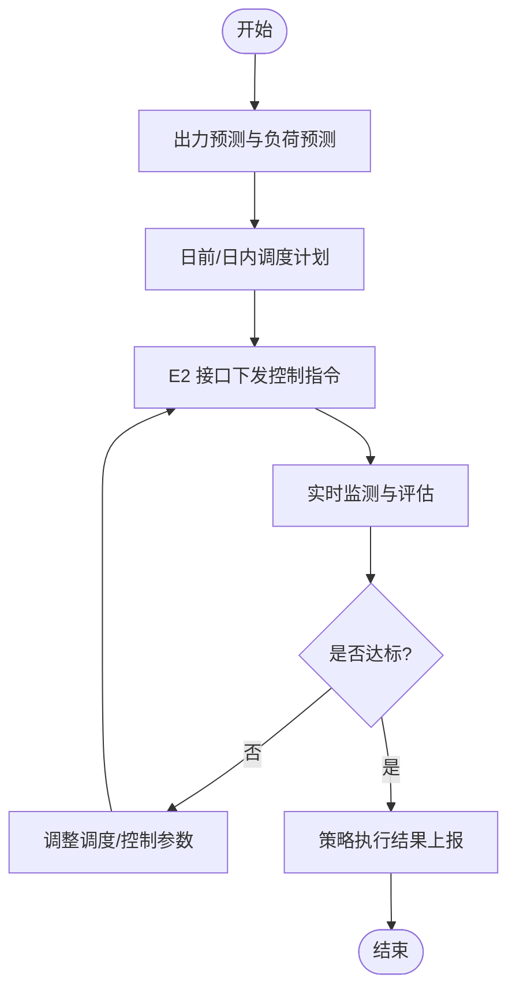
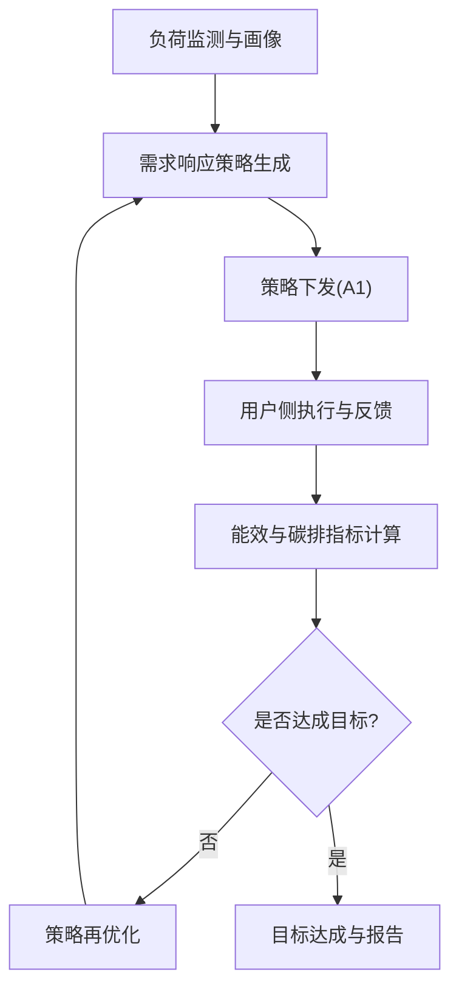
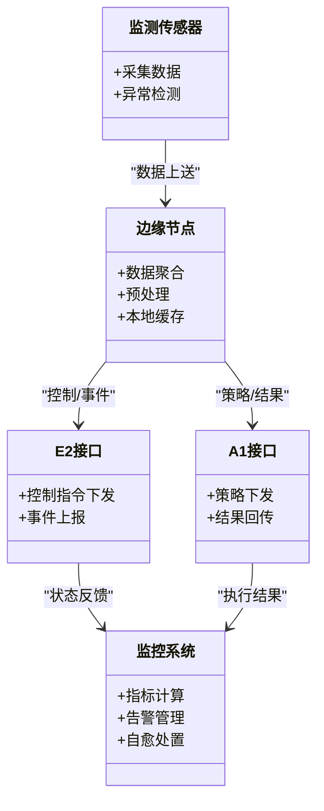
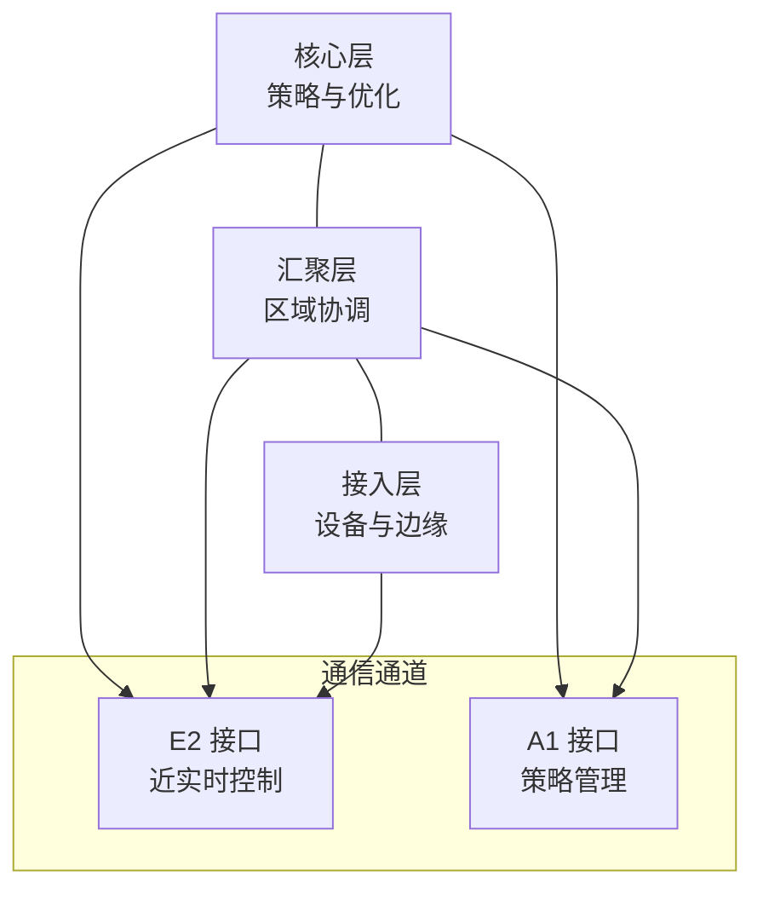
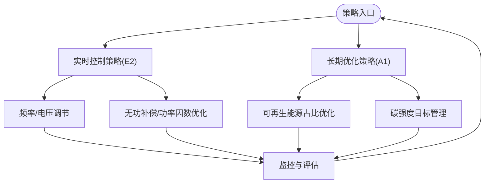
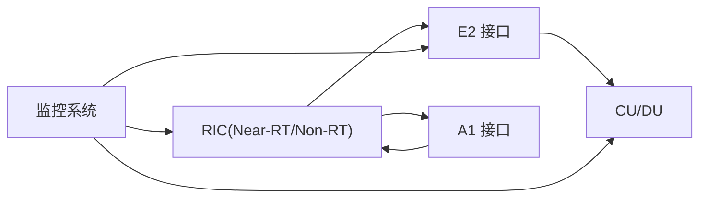

# 智能能源管理

<cite>
**本文引用的文件**
- [O-RAN 知识库总览](file://README.md)
- [可持续发展-环境治理](file://24-sustainable-development/environmental-protection/o-ran-environmental-sustainability.md)
- [应用案例-垂直行业案例](file://21-case-studies/industry-applications/vertical-industry-o-ran-cases.md)
- [应用场景-智慧城市应用](file://10-application-scenarios/readme.md)
- [O-RIC 技术架构](file://02-core-components/o-ric.md)
- [E2 接口](file://03-interface-standards/e2-interface.md)
- [运营监控告警框架](file://14-operations-management/monitoring-alerting/operations-monitoring-framework.md)
</cite>

## 目录
1. [引言](#引言)
2. [项目结构](#项目结构)
3. [核心组件](#核心组件)
4. [架构总览](#架构总览)
5. [详细组件分析](#详细组件分析)
6. [依赖关系分析](#依赖关系分析)
7. [性能考虑](#性能考虑)
8. [故障排查指南](#故障排查指南)
9. [结论](#结论)
10. [附录](#附录)

## 引言
本文件面向“智能能源管理系统”的工程与技术实践，围绕 O-RAN 在城市能源管理中的应用展开，重点覆盖以下主题：
- 智能电网监控与需求响应控制
- 分布式能源（风光储）接入与并网
- 用电负荷优化与碳排放管理
- 电力设备监测与能源数据采集
- 智能电网架构设计、双向通信机制、实时控制策略与能效优化方案
- 能源供需平衡、设备状态监测与绿色低碳发展要求

本文件以 O-RAN 的参考架构、接口标准、RIC 能力与可持续发展框架为基础，结合实际应用案例，形成可落地的技术路线与实施建议。

## 项目结构
该知识库按主题域组织，与智能能源管理直接相关的内容主要分布在以下区域：
- 应用场景与案例：智慧城市、能源与公用事业
- 核心组件：RIC（Near-RT/Non-RT）、接口标准（E2/A1/O1）
- 运维监控：多层监控体系与告警策略
- 可持续发展：绿色通信、节能优化与碳足迹管理
- 知识库总览：整体学习路径与知识映射

**图示来源**
- [应用场景-智慧城市应用](file://10-application-scenarios/readme.md#L155-L183)
- [应用案例-垂直行业案例](file://21-case-studies/industry-applications/vertical-industry-o-ran-cases.md#L237-L278)
- [O-RIC 技术架构](file://02-core-components/o-ric.md#L73-L116)
- [E2 接口](file://03-interface-standards/e2-interface.md#L1-L337)
- [运营监控告警框架](file://14-operations-management/monitoring-alerting/operations-monitoring-framework.md#L6-L44)
- [可持续发展-环境治理](file://24-sustainable-development/environmental-protection/o-ran-environmental-sustainability.md#L1-L285)

**章节来源**
- [O-RAN 知识库总览](file://README.md#L1-L472)

## 核心组件
- RIC（近实时与非实时控制器）：提供闭环控制与策略下发能力，支撑智能电网的实时优化与长期策略制定。
- E2 接口：RIC 与 CU/DU 的服务化通信通道，承载控制面指令与事件通知，满足低延迟与高可靠要求。
- 运维监控体系：覆盖基础设施、应用服务与业务质量的三层监控，支撑故障预警与自动化处置。
- 环境可持续框架：从节能优化、可再生能源集成到碳足迹监测与目标设定，形成绿色发展的闭环。

**章节来源**
- [O-RIC 技术架构](file://02-core-components/o-ric.md#L73-L116)
- [E2 接口](file://03-interface-standards/e2-interface.md#L1-L337)
- [运营监控告警框架](file://14-operations-management/monitoring-alerting/operations-monitoring-framework.md#L6-L44)
- [可持续发展-环境治理](file://24-sustainable-development/environmental-protection/o-ran-environmental-sustainability.md#L1-L285)

## 架构总览
智能能源管理的 O-RAN 架构由“感知—通信—决策—执行—反馈”构成闭环：
- 感知层：分布式能源（光伏、风电、储能）与用户侧负荷监测，采集电能量、功率、电压/频率等数据。
- 通信层：基于 E2 接口的近实时控制通道与 A1 接口的策略通道，实现 RIC 与 CU/DU 的服务化交互。
- 决策层：Near-RT RIC 实时优化（如功率调度、电压/频率调节），Non-RT RIC 制定长期策略（如需求响应、碳强度优化）。
- 执行层：通过 E2 接口下发控制指令，协调分布式电源与负荷；通过 A1 接口下发策略，驱动长期运行优化。
- 反馈层：监控系统持续采集运行状态与性能指标，触发告警与自愈机制，保障系统稳定性与能效。

**图示来源**
- [O-RIC 技术架构](file://02-core-components/o-ric.md#L73-L116)
- [E2 接口](file://03-interface-standards/e2-interface.md#L1-L337)
- [运营监控告警框架](file://14-operations-management/monitoring-alerting/operations-monitoring-framework.md#L6-L44)

## 详细组件分析

### 组件一：智能电网监控与需求响应控制
- 监控范围：覆盖分布式能源出力预测、电网频率/电压波动、用户侧负荷曲线、电能质量与设备健康状态。
- 控制策略：基于 Near-RT RIC 的实时控制，实现削峰填谷、旋转备用与黑启动预案；结合 Non-RT RIC 的长期策略，开展需求响应与能效优化。
- 通信机制：E2 接口承载控制指令与事件上报，满足毫秒级时延与高可靠要求；A1 接口承载策略下发与执行结果回传。
- 典型流程：监测采集→状态估计→优化调度→控制执行→性能评估→策略迭代。

**图示来源**
- [E2 接口](file://03-interface-standards/e2-interface.md#L1-L337)
- [运营监控告警框架](file://14-operations-management/monitoring-alerting/operations-monitoring-framework.md#L6-L44)

**章节来源**
- [应用场景-智慧城市应用](file://10-application-scenarios/readme.md#L155-L183)
- [应用案例-垂直行业案例](file://21-case-studies/industry-applications/vertical-industry-o-ran-cases.md#L237-L278)

### 组件二：分布式能源接入与可再生能源并网
- 并网控制：通过 E2 接口实现逆变器/储能的功率与电压控制，满足并网标准与电能质量要求。
- 预测与调度：利用历史与气象数据，结合机器学习进行出力预测，指导日前/日内调度。
- 绿色目标：结合可持续发展框架，设定可再生能源占比与碳强度目标，并通过策略通道持续优化。

**图示来源**
- [E2 接口](file://03-interface-standards/e2-interface.md#L1-L337)
- [可持续发展-环境治理](file://24-sustainable-development/environmental-protection/o-ran-environmental-sustainability.md#L1-L285)

**章节来源**
- [应用场景-智慧城市应用](file://10-application-scenarios/readme.md#L155-L183)
- [可持续发展-环境治理](file://24-sustainable-development/environmental-protection/o-ran-environmental-sustainability.md#L1-L285)

### 组件三：用电负荷优化与碳排放管理
- 负荷优化：通过需求响应与动态电价，引导用户侧负荷在高峰时段转移或削减，提升系统整体能效。
- 碳排放管理：基于碳强度与排放因子数据库，实时追踪碳足迹，设定减排目标与抵消路径，实现碳中和路线图。

**图示来源**
- [E2 接口](file://03-interface-standards/e2-interface.md#L1-L337)
- [可持续发展-环境治理](file://24-sustainable-development/environmental-protection/o-ran-environmental-sustainability.md#L1-L285)

**章节来源**
- [应用场景-智慧城市应用](file://10-application-scenarios/readme.md#L155-L183)
- [可持续发展-环境治理](file://24-sustainable-development/environmental-protection/o-ran-environmental-sustainability.md#L1-L285)

### 组件四：电力设备监测与能源数据采集
- 监测维度：设备温度、电流/电压、功率因数、谐波、电能质量、设备老化状态等。
- 采集方式：边缘计算节点就近汇聚，结合 E2 接口与 A1 接口实现数据上送与策略联动。
- 可视化与告警：通过多层监控体系，实现设备健康度评分、故障预警与自动处置。

**图示来源**
- [E2 接口](file://03-interface-standards/e2-interface.md#L1-L337)
- [运营监控告警框架](file://14-operations-management/monitoring-alerting/operations-monitoring-framework.md#L6-L44)

**章节来源**
- [运营监控告警框架](file://14-operations-management/monitoring-alerting/operations-monitoring-framework.md#L6-L44)

### 组件五：智能电网架构设计与双向通信机制
- 架构层次：核心层（策略与大数据）、汇聚层（区域控制与协调）、接入层（设备与边缘）。
- 通信机制：E2 接口负责近实时控制闭环，A1 接口负责策略管理与长期优化；两者协同实现“上通天下达”。

**图示来源**
- [O-RIC 技术架构](file://02-core-components/o-ric.md#L73-L116)
- [E2 接口](file://03-interface-standards/e2-interface.md#L1-L337)

**章节来源**
- [O-RIC 技术架构](file://02-core-components/o-ric.md#L73-L116)
- [E2 接口](file://03-interface-standards/e2-interface.md#L1-L337)

### 组件六：实时控制策略与能源效率优化
- 实时策略：基于 E2 接口的低时延控制，实现频率/电压调节、无功补偿、黑启动等。
- 能效优化：结合节能算法与可再生能源占比目标，动态调整运行方式与设备启停。
- 绿色路径：依据可持续发展框架，推进节能、可再生与碳中和目标。

**图示来源**
- [E2 接口](file://03-interface-standards/e2-interface.md#L1-L337)
- [可持续发展-环境治理](file://24-sustainable-development/environmental-protection/o-ran-environmental-sustainability.md#L1-L285)

**章节来源**
- [E2 接口](file://03-interface-standards/e2-interface.md#L1-L337)
- [可持续发展-环境治理](file://24-sustainable-development/environmental-protection/o-ran-environmental-sustainability.md#L1-L285)

## 依赖关系分析
- RIC 与 CU/DU 的耦合：通过 E2 接口实现强耦合的控制闭环，需关注时延、可靠性与一致性。
- 策略与控制的协同：A1 接口负责策略制定与下发，E2 接口负责执行与反馈，二者在时序与数据上存在依赖。
- 监控与告警：多层监控体系对 RIC、接口与业务质量进行全链路观测，支撑自动化运维与自愈。

**图示来源**
- [O-RIC 技术架构](file://02-core-components/o-ric.md#L73-L116)
- [E2 接口](file://03-interface-standards/e2-interface.md#L1-L337)
- [运营监控告警框架](file://14-operations-management/monitoring-alerting/operations-monitoring-framework.md#L6-L44)

**章节来源**
- [O-RIC 技术架构](file://02-core-components/o-ric.md#L73-L116)
- [E2 接口](file://03-interface-standards/e2-interface.md#L1-L337)
- [运营监控告警框架](file://14-operations-management/monitoring-alerting/operations-monitoring-framework.md#L6-L44)

## 性能考虑
- 时延与可靠性：Near-RT RIC 的控制闭环应满足毫秒级时延与高可用性，E2 接口需具备低抖动、高吞吐与故障恢复能力。
- 资源与能耗：结合节能优化策略，动态调整设备运行状态与网络资源分配，降低整体能耗。
- 可扩展性：采用云原生与容器化部署，支持弹性扩缩容与跨域协同。

[本节为通用性能讨论，不直接分析具体文件]

## 故障排查指南
- 告警分级与关联：基于多层监控体系，设置合理的阈值与关联规则，避免告警风暴并快速定位根因。
- 故障定位：结合接口日志、信令流程与设备状态，定位连接、消息、服务与性能类故障。
- 自动化恢复：通过自动化脚本与编排工具，实现快速切换、配置回滚与服务重启。

**章节来源**
- [运营监控告警框架](file://14-operations-management/monitoring-alerting/operations-monitoring-framework.md#L6-L44)
- [E2 接口](file://03-interface-standards/e2-interface.md#L148-L260)

## 结论
通过 O-RAN 的 RIC 能力与接口体系，智能能源管理系统可在城市尺度实现“可观测、可通信、可决策、可执行、可反馈”的闭环控制。结合可持续发展框架，系统可同时达成能效提升、可再生能源高渗透与碳中和目标，支撑绿色低碳的城市能源转型。

[本节为总结性内容，不直接分析具体文件]

## 附录
- 智慧城市与能源管理场景：覆盖配电网自动化、分布式光伏/风电、电动汽车充电优化与需求响应。
- 国家电网智慧电网案例：展示了 O-RAN 在广域互联、可再生能源并网与运行优化方面的实践成果。

**章节来源**
- [应用场景-智慧城市应用](file://10-application-scenarios/readme.md#L155-L183)
- [应用案例-垂直行业案例](file://21-case-studies/industry-applications/vertical-industry-o-ran-cases.md#L237-L278)