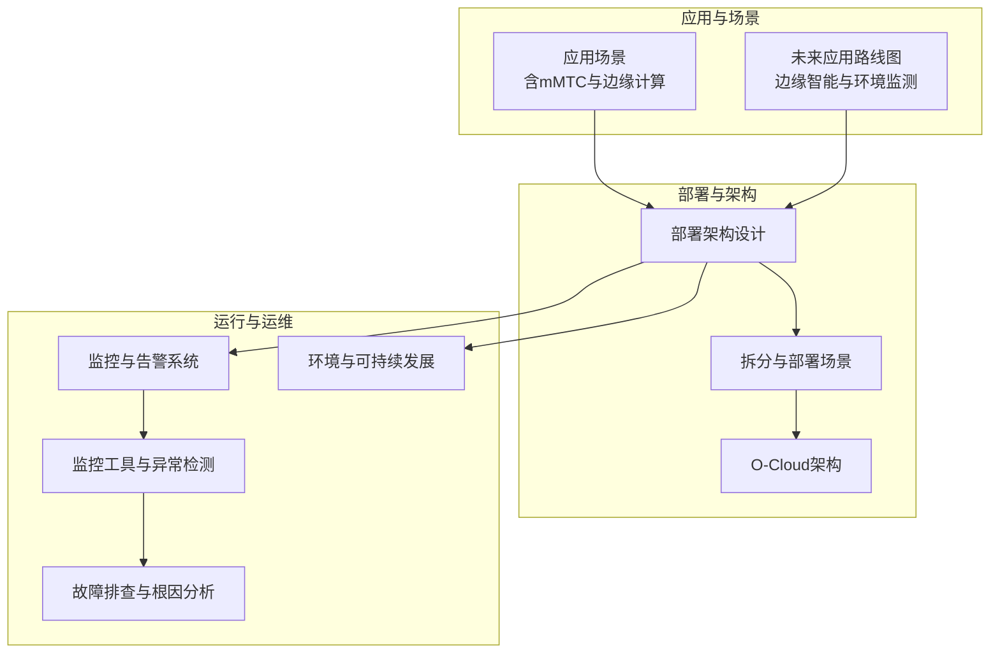
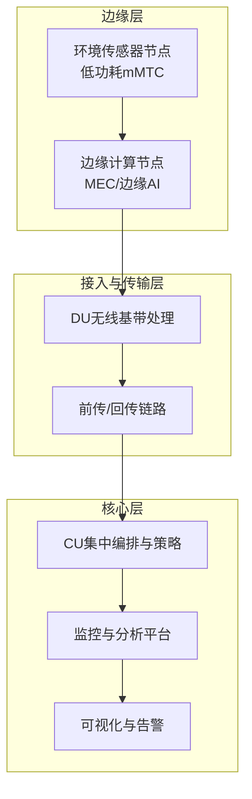
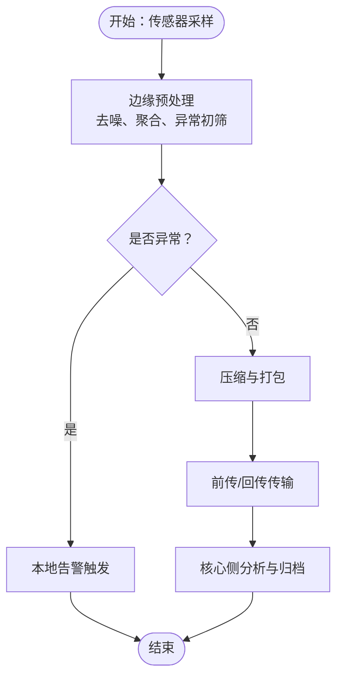
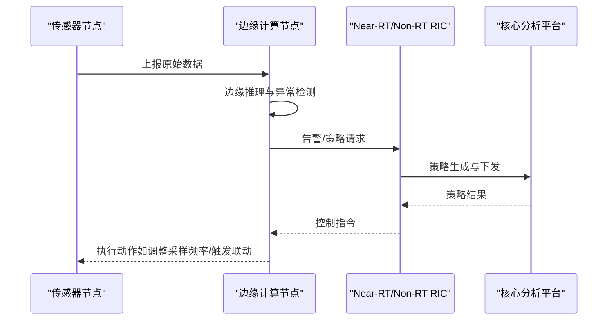
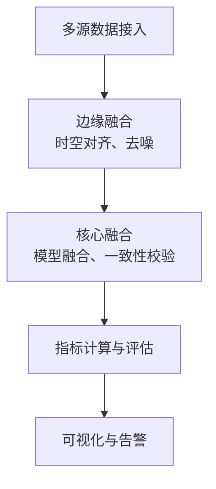
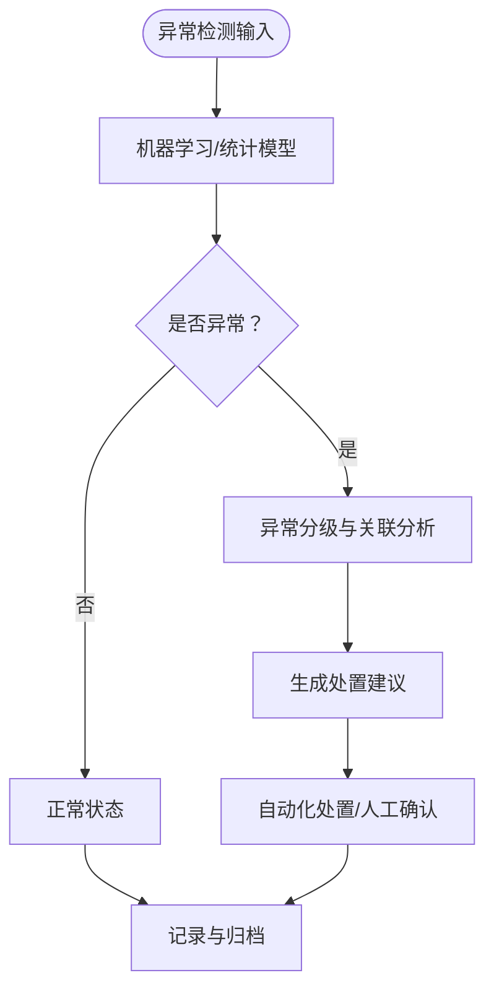
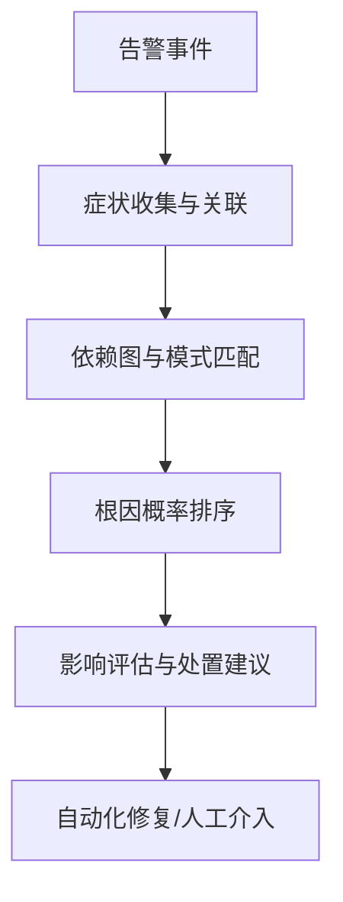

# 环境监测网络

<cite>
**本文引用的文件**
- [O-RAN专家知识库总览](file://README.md)
- [应用案例：O-RAN应用场景](file://10-application-scenarios/readme.md)
- [未来应用路线：新兴应用路线图](file://15-future-development/emerging-applications/emerging-applications-roadmap.md)
- [部署实施：部署架构设计](file://08-deployment-implementation/readme.md)
- [部署场景：拆分与部署场景](file://04-disaggregation-options/deployment-scenarios.md)
- [O-Cloud架构](file://01-architecture-system/o-cloud-architecture.md)
- [监控告警：监控与告警系统](file://28-monitoring-alerting/readme.md)
- [监控工具：O-RAN监控工具](file://28-monitoring-alerting/monitoring-tools/o-ran-monitoring-tools.md)
- [监控工具：O-RAN监控工具（中文）](file://28-monitoring-alerting/monitoring-tools/o-ran-monitoring-tools-zh.md)
- [环境与可持续发展：绿色通信技术](file://24-sustainable-development/environmental-protection/o-ran-environmental-sustainability.md)
- [故障处理：故障排查指南](file://14-operations-management/fault-handling/fault-troubleshooting-guide.md)
</cite>

## 目录
1. [引言](#引言)
2. [项目结构](#项目结构)
3. [核心组件](#核心组件)
4. [架构总览](#架构总览)
5. [详细组件分析](#详细组件分析)
6. [依赖关系分析](#依赖关系分析)
7. [性能与可靠性](#性能与可靠性)
8. [故障排查与运维](#故障排查与运维)
9. [结论](#结论)
10. [附录](#附录)

## 引言
本文件面向“环境监测网络”的工程化落地，围绕O-RAN在城市环境监测中的应用进行系统化技术说明，涵盖空气质量检测、水质监测、噪声污染控制、气象数据采集等多参数环境感知；并结合O-RAN的边缘计算、智能算法、接口协议与监控告警体系，给出部署架构、数据传输优化、边缘处理与可视化展示的完整方案。同时，针对环境治理需求、监测精度与系统可靠性提出可操作的设计与运维建议。

## 项目结构
该知识库以主题域划分，形成从架构到应用、从部署到运维的完整知识谱系。与环境监测网络直接相关的关键模块包括：
- 应用场景：明确mMTC与边缘计算在智慧城市与环境监测中的定位
- 部署实施：指导边缘侧与核心侧协同的部署策略
- 监控告警：提供指标体系、异常检测与可视化能力
- 绿色通信：面向能耗与碳排放的优化方向
- 故障处理：根因分析与自动化运维支撑

**图表来源**
- [应用案例：O-RAN应用场景](file://10-application-scenarios/readme.md#L1-L470)
- [未来应用路线：新兴应用路线图](file://15-future-development/emerging-applications/emerging-applications-roadmap.md#L284-L337)
- [部署实施：部署架构设计](file://08-deployment-implementation/readme.md#L1-L353)
- [部署场景：拆分与部署场景](file://04-disaggregation-options/deployment-scenarios.md#L1-L456)
- [O-Cloud架构](file://01-architecture-system/o-cloud-architecture.md#L31-L62)
- [监控告警：监控与告警系统](file://28-monitoring-alerting/readme.md#L1-L24)
- [监控工具：O-RAN监控工具](file://28-monitoring-alerting/monitoring-tools/o-ran-monitoring-tools.md#L187-L228)
- [监控工具：O-RAN监控工具（中文）](file://28-monitoring-alerting/monitoring-tools/o-ran-monitoring-tools-zh.md#L176-L228)
- [环境与可持续发展：绿色通信技术](file://24-sustainable-development/environmental-protection/o-ran-environmental-sustainability.md#L6-L258)
- [故障处理：故障排查指南](file://14-operations-management/fault-handling/fault-troubleshooting-guide.md#L100-L180)

**章节来源**
- [O-RAN专家知识库总览](file://README.md#L1-L472)

## 核心组件
- 环境传感器网络（mMTC）：基于O-RAN的海量连接能力，实现低功耗、广覆盖、低成本的大规模环境监测节点部署
- 边缘计算与MEC：在边缘侧进行数据预处理、异常检测与轻量推理，降低回传压力与端到端时延
- RIC与xApps/rApps：通过Near-RT RIC与Non-RT RIC实现闭环优化与策略下发，支撑环境治理的智能化决策
- 监控与告警：建立KPI/KQI指标体系，结合异常检测与可视化，实现环境质量的实时监控与预警
- 绿色节能：在设备与网络层面实施动态休眠、负载协同与可再生能源集成，降低环境监测系统的碳足迹

**章节来源**
- [应用案例：O-RAN应用场景](file://10-application-scenarios/readme.md#L23-L29)
- [监控告警：监控与告警系统](file://28-monitoring-alerting/readme.md#L1-L24)
- [监控工具：O-RAN监控工具](file://28-monitoring-alerting/monitoring-tools/o-ran-monitoring-tools.md#L187-L228)
- [环境与可持续发展：绿色通信技术](file://24-sustainable-development/environmental-protection/o-ran-environmental-sustainability.md#L6-L49)

## 架构总览
环境监测网络采用“边缘感知—边缘处理—核心分析—可视化呈现”的分层架构，结合O-RAN的CU/DU/RU功能拆分与MEC协同，实现低时延、高可靠、可扩展的环境监测系统。

**图表来源**
- [部署实施：部署架构设计](file://08-deployment-implementation/readme.md#L8-L38)
- [部署场景：拆分与部署场景](file://04-disaggregation-options/deployment-scenarios.md#L110-L160)
- [O-Cloud架构](file://01-architecture-system/o-cloud-architecture.md#L31-L62)
- [应用案例：O-RAN应用场景](file://10-application-scenarios/readme.md#L45-L80)

## 详细组件分析

### 环境传感器网络与数据采集
- 部署形态：基于mMTC的海量连接能力，实现城市级环境监测节点的广覆盖与低功耗运行
- 传输优化：利用窄带传输、睡眠机制与批处理策略，降低上行带宽与能耗
- 边缘预处理：在MEC侧完成数据清洗、聚合与异常初筛，减少回传数据量

**图表来源**
- [应用案例：O-RAN应用场景](file://10-application-scenarios/readme.md#L23-L29)
- [部署场景：拆分与部署场景](file://04-disaggregation-options/deployment-scenarios.md#L137-L160)

**章节来源**
- [应用案例：O-RAN应用场景](file://10-application-scenarios/readme.md#L23-L29)
- [部署场景：拆分与部署场景](file://04-disaggregation-options/deployment-scenarios.md#L110-L160)

### 边缘计算与智能算法
- 边缘节点：部署轻量模型进行实时异常检测与趋势预测，结合MEC实现就近推理
- 策略下发：Non-RT RIC负责长期策略与跨域协调，Near-RT RIC负责闭环控制与快速反馈
- xApps/rApps：通过E2/A1接口实现策略执行与控制指令下发，支撑环境治理的自动化与智能化

**图表来源**
- [监控工具：O-RAN监控工具](file://28-monitoring-alerting/monitoring-tools/o-ran-monitoring-tools.md#L187-L207)
- [监控工具：O-RAN监控工具（中文）](file://28-monitoring-alerting/monitoring-tools/o-ran-monitoring-tools-zh.md#L183-L214)
- [应用案例：O-RAN应用场景](file://10-application-scenarios/readme.md#L45-L80)

**章节来源**
- [监控工具：O-RAN监控工具](file://28-monitoring-alerting/monitoring-tools/o-ran-monitoring-tools.md#L187-L228)
- [监控工具：O-RAN监控工具（中文）](file://28-monitoring-alerting/monitoring-tools/o-ran-monitoring-tools-zh.md#L183-L228)
- [应用案例：O-RAN应用场景](file://10-application-scenarios/readme.md#L45-L80)

### 多参数数据融合与可视化
- 指标体系：构建覆盖空气质量、水体质量、噪声水平与气象要素的KPI/KQI指标
- 融合策略：在边缘与核心分别进行多源数据融合，结合时空插值与机器学习模型提升精度
- 可视化：通过仪表盘与告警看板实现多维度、多粒度的环境态势展示

**图表来源**
- [监控告警：监控与告警系统](file://28-monitoring-alerting/readme.md#L6-L24)
- [监控工具：O-RAN监控工具（中文）](file://28-monitoring-alerting/monitoring-tools/o-ran-monitoring-tools-zh.md#L215-L228)

**章节来源**
- [监控告警：监控与告警系统](file://28-monitoring-alerting/readme.md#L6-L24)
- [监控工具：O-RAN监控工具（中文）](file://28-monitoring-alerting/monitoring-tools/o-ran-monitoring-tools-zh.md#L215-L228)

### 异常预警机制与决策支持
- 异常检测：基于统计方法、无监督学习与时间序列预测，实现多参数异常识别与趋势预警
- 决策支持：结合历史数据与规则引擎，输出治理建议与处置优先级，辅助人工决策
- 自动化处置：在可控范围内通过xApps/rApps自动下发处置指令，缩短响应时间

**图表来源**
- [监控工具：O-RAN监控工具](file://28-monitoring-alerting/monitoring-tools/o-ran-monitoring-tools.md#L187-L207)
- [监控工具：O-RAN监控工具（中文）](file://28-monitoring-alerting/monitoring-tools/o-ran-monitoring-tools-zh.md#L183-L214)

**章节来源**
- [监控工具：O-RAN监控工具](file://28-monitoring-alerting/monitoring-tools/o-ran-monitoring-tools.md#L187-L228)
- [监控工具：O-RAN监控工具（中文）](file://28-monitoring-alerting/monitoring-tools/o-ran-monitoring-tools-zh.md#L183-L228)

### 系统可靠性与绿色节能
- 可靠性：采用N+1冗余、多路径路由与快速恢复机制，确保关键监测站点的持续运行
- 绿色节能：通过动态休眠、负载协同与可再生能源集成，降低系统能耗与碳排放
- 可持续运营：建立运维巡检与预测性维护流程，延长设备寿命并降低全生命周期成本

**章节来源**
- [部署实施：部署架构设计](file://08-deployment-implementation/readme.md#L322-L356)
- [环境与可持续发展：绿色通信技术](file://24-sustainable-development/environmental-protection/o-ran-environmental-sustainability.md#L6-L49)

## 依赖关系分析
环境监测网络的关键依赖关系如下：
- 传感器节点依赖MEC进行边缘处理
- MEC依赖DU/前传链路接入核心
- 核心侧依赖Non-RT RIC进行策略制定，Near-RT RIC进行闭环控制
- 监控与可视化依赖指标体系与异常检测算法

**图表来源**
- [部署实施：部署架构设计](file://08-deployment-implementation/readme.md#L8-L38)
- [O-Cloud架构](file://01-architecture-system/o-cloud-architecture.md#L31-L62)
- [监控告警：监控与告警系统](file://28-monitoring-alerting/readme.md#L1-L24)

**章节来源**
- [部署实施：部署架构设计](file://08-deployment-implementation/readme.md#L8-L38)
- [O-Cloud架构](file://01-architecture-system/o-cloud-architecture.md#L31-L62)
- [监控告警：监控与告警系统](file://28-monitoring-alerting/readme.md#L1-L24)

## 性能与可靠性
- 时延与吞吐：通过MEC下沉与边缘推理降低端到端时延，结合带宽规划与QoS保障关键业务
- 精度与稳定性：多源数据融合与模型校准提升监测精度；异常检测与根因分析提升系统稳定性
- 可扩展性：采用分层部署与弹性扩缩容，支持城市级环境监测网络的按需扩展
- 能耗与碳排：动态功率管理、可再生能源与节能算法降低整体能耗

**章节来源**
- [部署场景：拆分与部署场景](file://04-disaggregation-options/deployment-scenarios.md#L296-L344)
- [O-Cloud架构](file://01-architecture-system/o-cloud-architecture.md#L31-L62)
- [环境与可持续发展：绿色通信技术](file://24-sustainable-development/environmental-protection/o-ran-environmental-sustainability.md#L6-L49)

## 故障排查与运维
- 指标体系：建立基础设施、无线性能、应用服务与边缘节点的KPI/KQI指标
- 异常检测：结合统计与机器学习方法，实现异常早发现与误报抑制
- 根因分析：基于依赖图与症状聚类，量化根因概率并生成处置建议
- 自动化运维：通过CI/CD与自动化编排，降低变更风险并提升恢复效率

**图表来源**
- [监控告警：监控与告警系统](file://28-monitoring-alerting/readme.md#L1-L24)
- [监控工具：O-RAN监控工具（中文）](file://28-monitoring-alerting/monitoring-tools/o-ran-monitoring-tools-zh.md#L183-L214)
- [故障处理：故障排查指南](file://14-operations-management/fault-handling/fault-troubleshooting-guide.md#L100-L180)

**章节来源**
- [监控告警：监控与告警系统](file://28-monitoring-alerting/readme.md#L1-L24)
- [监控工具：O-RAN监控工具（中文）](file://28-monitoring-alerting/monitoring-tools/o-ran-monitoring-tools-zh.md#L183-L214)
- [故障处理：故障排查指南](file://14-operations-management/fault-handling/fault-troubleshooting-guide.md#L100-L180)

## 结论
依托O-RAN的边缘计算、智能算法与接口协议能力，环境监测网络可在城市尺度实现高覆盖、低时延、可扩展与可持续的多参数环境感知与治理。通过指标体系、异常检测与可视化平台，系统能够提供及时、准确的环境态势与预警；借助绿色节能与自动化运维，系统在保证可靠性的同时降低全生命周期成本。未来可进一步结合认知智能与生态感知，向更高级别的自适应治理迈进。

## 附录
- 知识库总览与学习路径：为从云平台背景转向O-RAN专家提供系统化知识地图与实践路径
- 应用场景与最佳实践：涵盖5G服务、边缘计算、工业互联网、车联网与智慧城市的部署要点与案例

**章节来源**
- [O-RAN专家知识库总览](file://README.md#L297-L472)
- [应用案例：O-RAN应用场景](file://10-application-scenarios/readme.md#L155-L470)