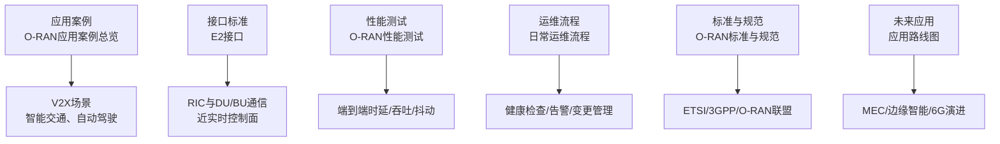
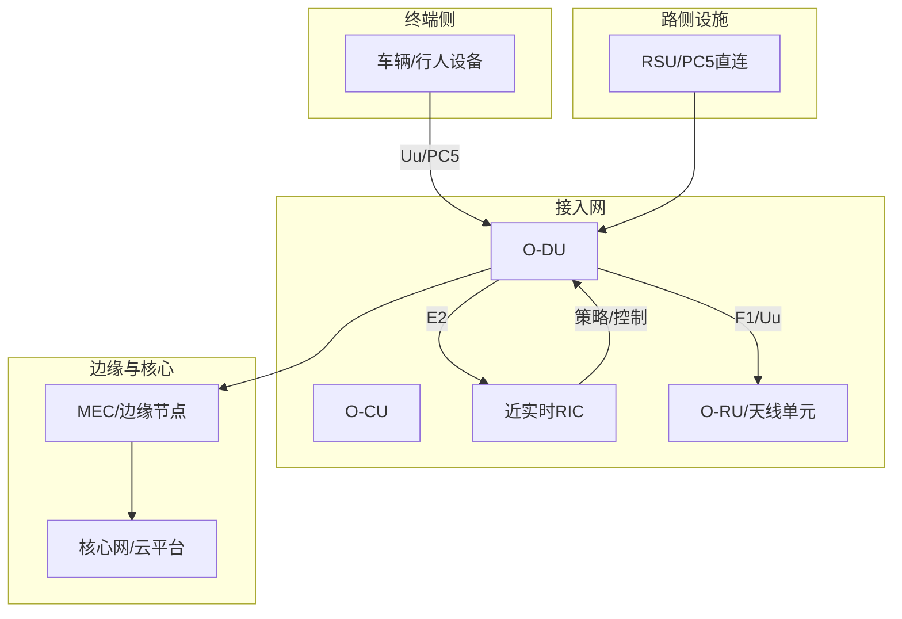
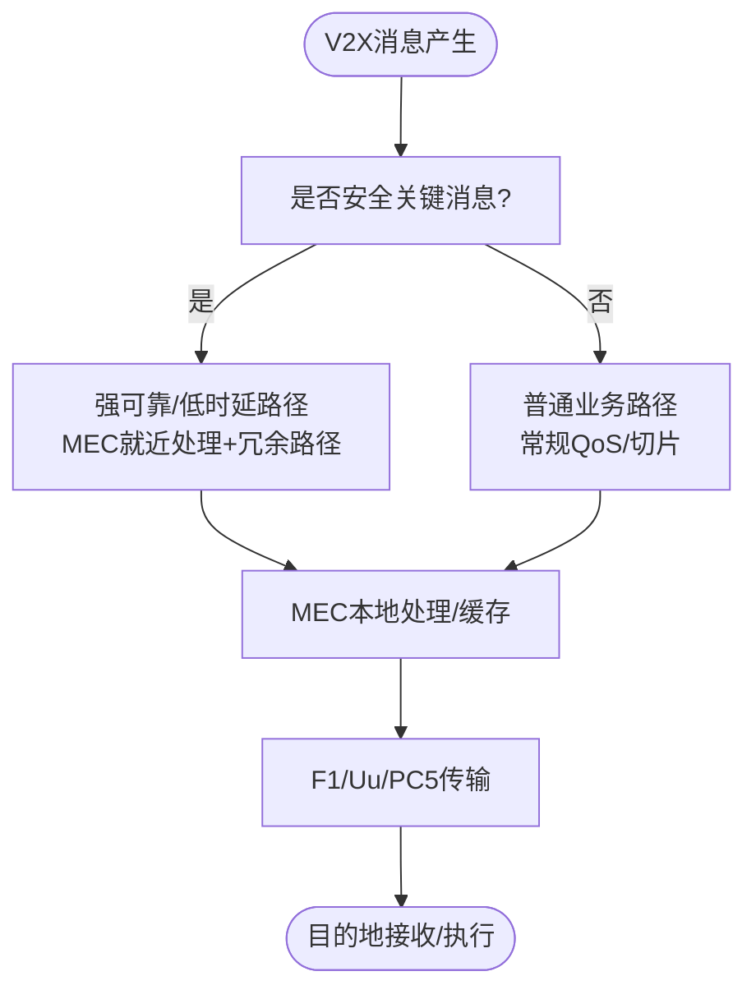
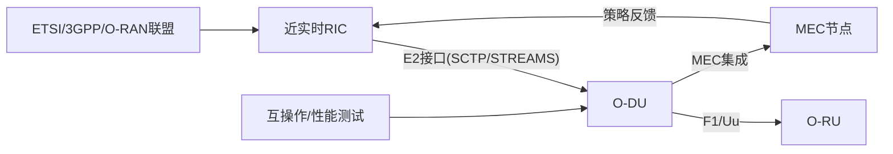
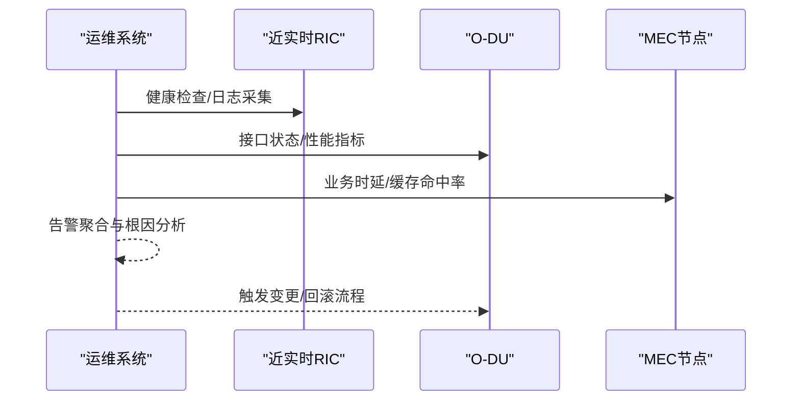

# V2X通信优化技术

<cite>
**本文引用的文件**
- [O-RAN应用案例总览](file://10-application-scenarios/readme.md)
- [O-RAN交通运输解决方案](file://16-industry-solutions/transportation/o-ran-transportation-solutions.md)
- [E2接口](file://03-interface-standards/e2-interface.md)
- [O-RAN性能测试](file://13-testing-validation/performance-testing/performance-testing.md)
- [O-RAN日常运维流程](file://14-operations-management/daily-operations/daily-operation-procedures.md)
- [O-RAN标准与规范](file://09-standards-compliance/readme.md)
- [O-RAN计算优化](file://26-performance-optimization/compute-optimization/o-ran-compute-optimization.md)
- [O-RAN未来应用路线图](file://15-future-development/emerging-applications/emerging-applications-roadmap.md)
- [O-RAN接口论文集合](file://11-academic-papers/interfaces/readme.md)
- [O-RAN交通运输解决方案（中文）](file://16-industry-solutions/transportation/o-ran-transportation-solutions-zh.md)
- [O-RAN性能测试（中文）](file://13-testing-validation/performance-testing/performance-testing-zh.md)
- [O-RAN日常运维流程（中文）](file://14-operations-management/daily-operations/daily-operation-procedures-zh.md)
- [O-RAN标准与规范（中文）](file://09-standards-compliance/readme-zh.md)
- [O-RAN计算优化（中文）](file://26-performance-optimization/compute-optimization/o-ran-compute-optimization-zh.md)
- [O-RAN未来应用路线图（中文）](file://15-future-development/emerging-applications/emerging-applications-roadmap-zh.md)
- [O-RAN接口论文集合（中文）](file://11-academic-papers/interfaces/readme-zh.md)
</cite>

## 目录
1. [引言](#引言)
2. [项目结构](#项目结构)
3. [核心组件](#核心组件)
4. [架构总览](#架构总览)
5. [详细组件分析](#详细组件分析)
6. [依赖关系分析](#依赖关系分析)
7. [性能考虑](#性能考虑)
8. [故障排除指南](#故障排除指南)
9. [结论](#结论)
10. [附录](#附录)

## 引言
本技术文档围绕车路协同（V2X）通信优化展开，系统梳理O-RAN在低时延、高可靠、大规模连接与边缘智能方面的关键技术与工程实践。重点覆盖：
- V2X消息传输机制与可靠性保障
- 时延优化策略与网络切片应用
- C-V2X与DSRC两类标准的技术特点与场景差异
- IEEE 1609系列与ETSI ITS-G5协议栈要点
- 通信质量评估指标、信道分配与干扰协调
- 边缘计算在V2X中的落地、缓存与实时处理
- 配置参数建议、性能测试方法与故障排除

## 项目结构
本知识库以主题域划分，与V2X优化密切相关的内容主要分布在“应用案例”“接口标准”“性能测试”“运维流程”“标准与规范”“未来应用”等领域，形成从场景到实现、从标准到运维的完整知识谱系。

**图表来源**
- [O-RAN应用案例总览](file://10-application-scenarios/readme.md#L118-L153)
- [E2接口](file://03-interface-standards/e2-interface.md#L1-L304)
- [O-RAN性能测试](file://13-testing-validation/performance-testing/performance-testing.md#L1-L320)
- [O-RAN日常运维流程](file://14-operations-management/daily-operations/daily-operation-procedures.md#L1-L443)
- [O-RAN标准与规范](file://09-standards-compliance/readme.md#L1-L371)
- [O-RAN未来应用路线图](file://15-future-development/emerging-applications/emerging-applications-roadmap.md#L284-L337)

**章节来源**
- [O-RAN应用案例总览](file://10-application-scenarios/readme.md#L1-L470)
- [O-RAN标准与规范](file://09-standards-compliance/readme.md#L1-L371)

## 核心组件
- RIC（近实时/非实时）与DU/CU的E2接口：支撑V2X业务的控制面与事件面交互，强调低时延与高可靠。
- 边缘计算（MEC）与O-DU/O-CU协同：就近处理V2X数据，降低空口与核心网时延。
- 网络切片：为安全、娱乐、遥测、应急等业务提供差异化SLA保障。
- 道路边设备（RSU）与直连PC5接口：支持V2V/V2I直通通信，提升安全性与实时性。
- 性能测试与运维：通过端到端时延、抖动、丢包与系统资源指标，保障V2X稳定运行。

**章节来源**
- [O-RAN应用案例总览](file://10-application-scenarios/readme.md#L118-L153)
- [O-RAN交通运输解决方案](file://16-industry-solutions/transportation/o-ran-transportation-solutions.md#L1-L211)
- [E2接口](file://03-interface-standards/e2-interface.md#L1-L304)

## 架构总览
V2X在O-RAN中的典型架构由“终端/车辆”“RSU/PC5直连”“无线接入网（DU/CU/天线单元）”“边缘计算节点（MEC）”“核心网与云平台”组成。控制面经E2接口由RIC下发策略，用户面通过F1/Uu/PC5实现低时延转发；MEC就近处理感知与决策数据，减少回传时延。

**图表来源**
- [O-RAN应用案例总览](file://10-application-scenarios/readme.md#L118-L153)
- [E2接口](file://03-interface-standards/e2-interface.md#L1-L304)
- [O-RAN交通运输解决方案](file://16-industry-solutions/transportation/o-ran-transportation-solutions.md#L1-L211)

## 详细组件分析

### V2X消息传输机制与可靠性保障
- 消息类型与场景
  - 安全消息（碰撞预警、紧急制动）、交通信息（信号灯状态、拥堵）、服务消息（导航、娱乐）。
  - 应用场景：紧急制动、自动变道、远程驾驶、智能红绿灯。
- 可靠性目标
  - 安全类业务端到端时延<1ms，可用性≥99.9999%。
  - 多路径/多连接/多频段冗余设计，快速故障检测与自动切换。
- 传输路径与分层
  - 空口时延（波束赋形、调度）、网络时延（MEC/核心网）、处理时延（感知/决策）。
  - 通过边缘前置、预缓存、优先调度降低端到端时延。

**图表来源**
- [O-RAN应用案例总览](file://10-application-scenarios/readme.md#L118-L153)
- [O-RAN交通运输解决方案](file://16-industry-solutions/transportation/o-ran-transportation-solutions.md#L1-L211)

**章节来源**
- [O-RAN应用案例总览](file://10-application-scenarios/readme.md#L118-L153)
- [O-RAN交通运输解决方案](file://16-industry-solutions/transportation/o-ran-transportation-solutions.md#L1-L211)

### 时延优化策略
- 边缘前置：MEC与O-DU/O-CU同址部署，缩短回传与核心网时延。
- 优先调度：为V2X业务设置高优先级队列与硬时延约束。
- 预缓存：热点地图、限速信息、信号配时等数据在MEC侧缓存。
- 波束赋形与多RAT协同：提升空口可靠性与时延稳定性。
- 端到端时延分解与瓶颈定位：空口、网络、处理三段式测量与优化。

**章节来源**
- [O-RAN应用案例总览](file://10-application-scenarios/readme.md#L118-L153)
- [O-RAN未来应用路线图](file://15-future-development/emerging-applications/emerging-applications-roadmap.md#L284-L337)

### 可靠性保障技术
- 冗余设计：多路径、多连接、多频段，确保关键业务不中断。
- 自愈机制：快速故障检测、自动切换、自修复。
- 极端场景仿真与注入测试：验证在高干扰、高移动性、高密度场景下的鲁棒性。

**章节来源**
- [O-RAN应用案例总览](file://10-application-scenarios/readme.md#L118-L153)

### 网络切片应用
- 安全切片：为关键控制信号提供专用资源与严格SLA。
- 娱乐切片：为乘客多媒体提供带宽保障。
- 遥测切片：为车队管理与诊断提供稳定通道。
- 应急切片：为紧急救援与临时指挥提供优先接入。

**章节来源**
- [O-RAN交通运输解决方案](file://16-industry-solutions/transportation/o-ran-transportation-solutions.md#L31-L36)

### C-V2X与DSRC对比及应用场景
- C-V2X（蜂窝V2X）
  - 基于蜂窝网络（Uu接口），具备广覆盖、高移动性、与5G生态融合的优势。
  - 适合高速公路、大规模车路协同、与MEC/云平台深度集成。
- DSRC（专用短程通信）
  - 基于IEEE 802.11p，低时延、无需蜂窝，适合低速、短距离、特定区域的直连通信。
  - 适合城市路口、停车场、低速场景的V2V/V2I直连。
- 协同部署：在城市复杂场景下，C-V2X负责广域与移动性，DSRC负责局部短距直连，两者互补。

**章节来源**
- [O-RAN应用案例总览](file://10-application-scenarios/readme.md#L118-L125)

### IEEE 1609系列与ETSI ITS-G5协议栈
- IEEE 1609系列
  - 1609.2：网络与传输（基于IEEE 802.11p的网络层与传输层）
  - 1609.3：安全管理（基于公钥基础设施的加密与签名）
  - 1609.4：应用支撑（基于服务的通信框架）
- ETSI ITS-G5
  - 将ITS应用映射到3GPP LTE/5G承载，提供端到端的V2X服务模型。
  - 关键点：消息封装、QoS映射、安全锚点、与E2/RIC的协同。

**章节来源**
- [O-RAN标准与规范](file://09-standards-compliance/readme.md#L46-L76)

### 通信质量评估指标
- 时延类：最小/平均/95百分位/峰值时延、抖动、抖动变化率。
- 可靠性类：丢包率、重传率、可用性、故障恢复时间。
- 吞吐类：用户面速率、资源利用率、调度公平性。
- 业务类：V2X消息送达率、业务时延达标率、边缘处理时延占比。

**章节来源**
- [O-RAN性能测试](file://13-testing-validation/performance-testing/performance-testing.md#L1-L320)

### 信道分配与干扰协调
- 信道分配
  - 基于负载与业务特性的动态调度（RB分配、MIMO复用）。
  - 为V2X设定专用时频资源或保护带宽。
- 干扰协调
  - 同频/邻频干扰抑制（波束隔离、功率控制、小区间协调）。
  - 移动性场景下的切换与负载均衡，避免拥塞引发的时延突增。

**章节来源**
- [O-RAN应用案例总览](file://10-application-scenarios/readme.md#L140-L146)

### 边缘计算在V2X中的应用
- 缓存策略
  - 热点地图/信号配时/限速信息预加载至MEC缓存，降低回传压力。
  - 基于历史与实时流量预测的动态缓存更新。
- 实时处理能力
  - 本地感知融合（雷达/摄像头/LiDAR）与轻量AI推理，缩短决策链路。
  - 与E2接口联动，将策略下发至DU/RRU，实现闭环控制。

**章节来源**
- [O-RAN应用案例总览](file://10-application-scenarios/readme.md#L45-L79)
- [O-RAN交通运输解决方案](file://16-industry-solutions/transportation/o-ran-transportation-solutions.md#L70-L83)

### 配置参数与性能测试方法
- 配置参数建议（示例维度）
  - E2接口：SCTP流数量、超时/重试参数、QoS优先级、TLS证书校验。
  - MEC/切片：资源预留、带宽保证、时延上限、故障切换阈值。
  - 空口：波束管理、调度周期、MIMO层数、功率控制步长。
- 性能测试方法
  - 吞吐/时延/抖动/丢包测试：多数据包尺寸、多负载因子压测。
  - 端到端时延测量：分段采集空口、网络、处理时延。
  - 回归与稳定性：长时间基准测试与异常注入测试。

**章节来源**
- [E2接口](file://03-interface-standards/e2-interface.md#L90-L304)
- [O-RAN性能测试](file://13-testing-validation/performance-testing/performance-testing.md#L60-L138)

## 依赖关系分析
- 组件耦合
  - RIC依赖E2接口与SCTP/STREAMS实现控制面可靠交互。
  - DU/CU依赖F1/Uu承载V2X用户面数据，MEC依赖O-DU/O-CU的资源调度与时延承诺。
- 外部依赖
  - 标准组织：ETSI/3GPP/O-RAN联盟定义的接口与协议。
  - 测试与认证：Plugfest与第三方实验室验证互操作与合规。

**图表来源**
- [E2接口](file://03-interface-standards/e2-interface.md#L1-L304)
- [O-RAN标准与规范](file://09-standards-compliance/readme.md#L1-L371)

**章节来源**
- [E2接口](file://03-interface-standards/e2-interface.md#L1-L304)
- [O-RAN标准与规范](file://09-standards-compliance/readme.md#L1-L371)

## 性能考虑
- 时延优化
  - 边缘前置、优先调度、预缓存、波束赋形。
- 可靠性保障
  - 冗余路径、快速切换、极端场景仿真。
- 资源利用
  - 切片隔离、QoS映射、负载均衡、容量规划。
- 可观测性
  - 端到端时延追踪、关键指标仪表盘、自动化告警。

**章节来源**
- [O-RAN应用案例总览](file://10-application-scenarios/readme.md#L118-L153)
- [O-RAN性能测试](file://13-testing-validation/performance-testing/performance-testing.md#L244-L320)

## 故障排除指南
- 健康检查
  - 组件状态巡检、接口连通性、证书有效性、QoS配置核对。
- 常见问题
  - E2接口连接失败：网络连通、端口可达、路由、证书链与TLS握手。
  - F1接口性能退化：资源占用、同步问题、流量拥塞、QoS设置。
  - O-FH同步异常：PTP配置、时钟源、前传质量。
- 变更管理
  - 标准化变更流程、备份与回滚、回归测试与验证。
- 自动化告警
  - 基于Prometheus/Grafana的KPI阈值告警与根因分析。

**图表来源**
- [O-RAN日常运维流程](file://14-operations-management/daily-operations/daily-operation-procedures.md#L1-L443)

**章节来源**
- [O-RAN日常运维流程](file://14-operations-management/daily-operations/daily-operation-procedures.md#L1-L443)

## 结论
V2X通信优化需在标准规范、接口协议、网络架构、边缘智能与运维体系五维协同推进。通过E2接口的低时延控制面、MEC的就近处理、网络切片的差异化SLA与严格的性能测试与运维流程，可实现安全关键业务的亚毫秒级时延与超高可靠性，支撑智能交通与自动驾驶的规模化商用。

## 附录
- 术语表
  - RIC：无线智能控制器；E2：RIC与DU/CU的控制面接口；MEC：多接入边缘计算；PC5：V2X直连接口；切片：网络功能隔离与资源预留。
- 参考资料
  - O-RAN应用案例、E2接口、性能测试、标准与规范、未来应用路线图。