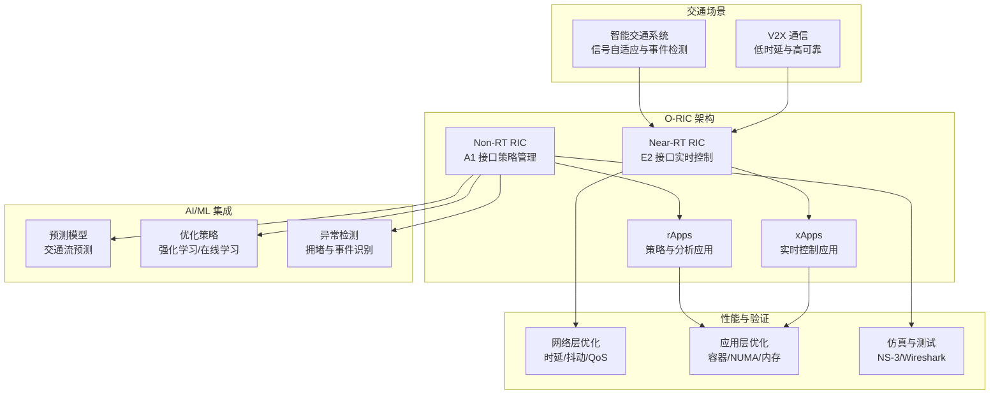
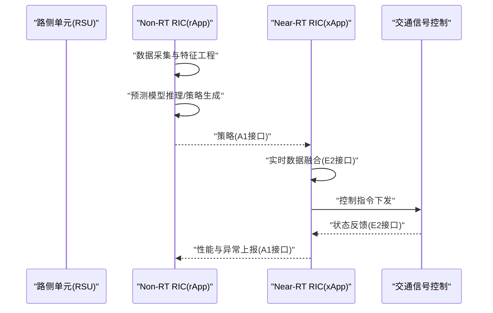
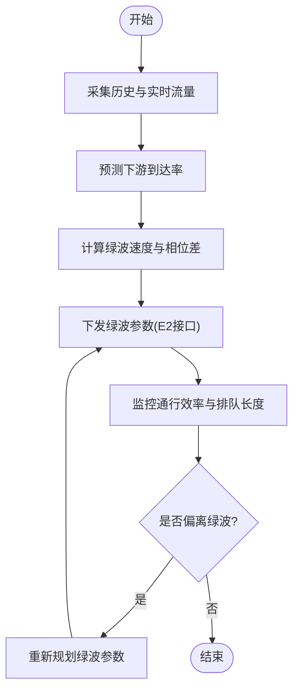
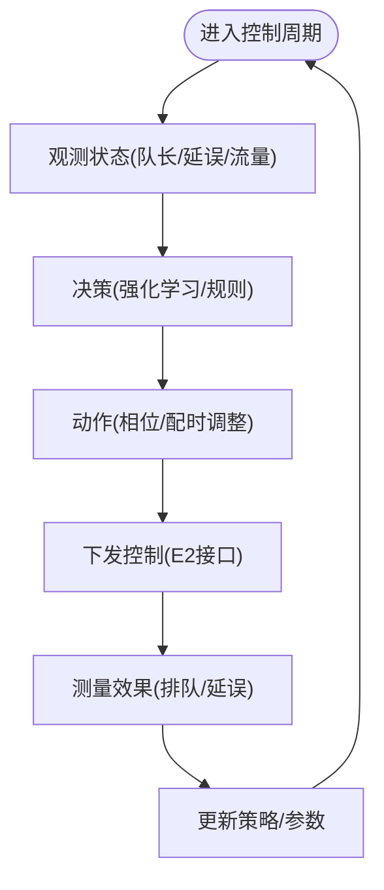
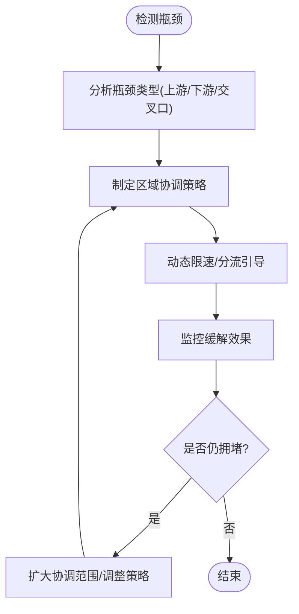
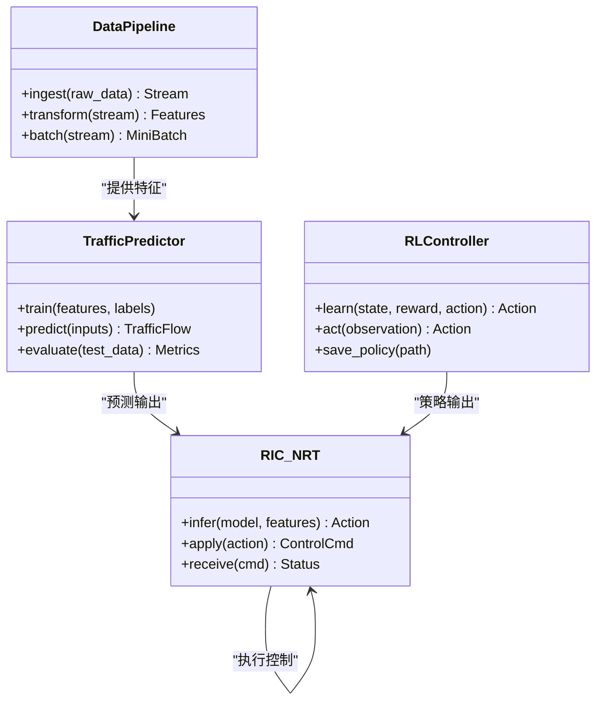
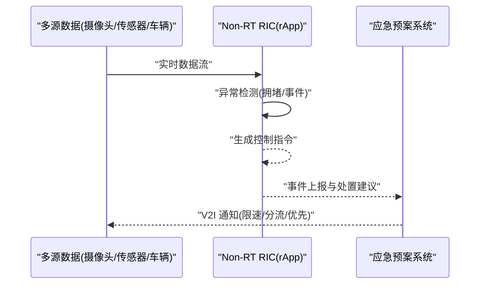
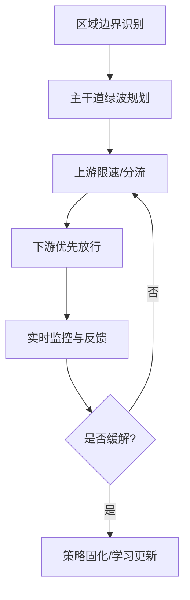
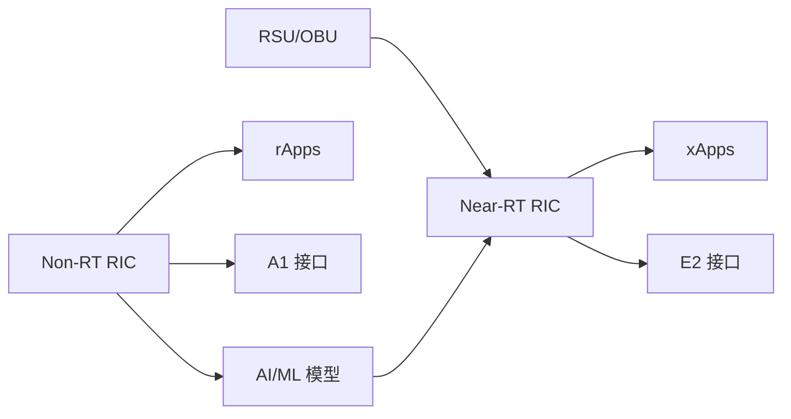

# 交通流优化算法

<cite>
**本文引用的文件列表**
- [O-RAN 交通解决方案](file://16-industry-solutions/transportation/o-ran-transportation-solutions.md)
- [O-RIC 智能控制器](file://02-core-components/o-ric.md)
- [O-RAN RIC 开发指南](file://07-ric-development/readme.md)
- [O-RAN 开发工具包](file://22-tool-platforms/development-tools/o-ran-development-toolkit.md)
- [O-RAN 网络性能优化](file://26-performance-optimization/network-optimization/network-performance-tuning.md)
- [O-RAN 性能优化框架](file://14-operations-management/performance-optimization/performance-optimization-framework.md)
- [O-RAN 应用性能调优](file://26-performance-optimization/application-tuning/o-ran-application-performance-tuning.md)
- [O-RAN 最佳实践案例](file://21-case-studies/best-practices/o-ran-best-practice-cases-zh.md)
- [O-RAN 交通案例研究](file://02-core-components/o-ric.md)
</cite>

## 目录
1. [引言](#引言)
2. [项目结构](#项目结构)
3. [核心组件](#核心组件)
4. [架构总览](#架构总览)
5. [详细组件分析](#详细组件分析)
6. [依赖关系分析](#依赖关系分析)
7. [性能考虑](#性能考虑)
8. [故障排查指南](#故障排查指南)
9. [结论](#结论)
10. [附录](#附录)

## 引言
本技术文档围绕基于 O-RAN 的智能交通信号控制系统，系统阐述绿波协调、自适应控制与瓶颈路段优化算法，并结合机器学习在交通预测、拥堵检测与应急预案生成中的应用，给出区域协调控制、动态限速与分流引导策略。同时，文档提供算法性能评估、仿真验证与实际应用效果分析方法，帮助读者在 O-RIC（近实时 RIC）与 rApp/xApp 的协同下，构建低延迟、高可靠、可扩展的智能交通优化系统。

## 项目结构
该仓库提供了 O-RAN 在交通领域的完整知识体系，涵盖：
- 交通场景的总体方案与需求（含 V2X、低时延、可靠性）
- RIC 架构与 xApp/rApp 开发框架
- 机器学习与 AI 算法在 RIC 中的集成路径
- 网络与应用层性能优化方法
- 仿真与测试框架
- 实际部署的最佳实践与案例

**图表来源**
- [O-RAN 交通解决方案](file://16-industry-solutions/transportation/o-ran-transportation-solutions.md#L8-L51)
- [O-RIC 智能控制器](file://02-core-components/o-ric.md#L7-L117)
- [O-RAN RIC 开发指南](file://07-ric-development/readme.md#L99-L123)
- [O-RAN 网络性能优化](file://26-performance-optimization/network-optimization/network-performance-tuning.md#L45-L98)
- [O-RAN 性能优化框架](file://14-operations-management/performance-optimization/performance-optimization-framework.md#L103-L234)

**章节来源**
- [O-RAN 交通解决方案](file://16-industry-solutions/transportation/o-ran-transportation-solutions.md#L1-L211)
- [O-RIC 智能控制器](file://02-core-components/o-ric.md#L1-L437)
- [O-RAN RIC 开发指南](file://07-ric-development/readme.md#L1-L368)

## 核心组件
- Near-RT RIC：负责毫秒级实时控制，承载 E2 接口与 xApps，支撑交通信号控制、事件响应等低时延任务。
- Non-RT RIC：负责秒级到分钟级策略管理，承载 A1 接口与 rApps，支撑交通预测、长期优化与区域协调。
- xApps：部署于 Near-RT RIC，面向实时控制，如信号配时优化、动态限速、分流引导。
- rApps：部署于 Non-RT RIC，面向策略与分析，如交通流预测、拥堵检测、应急预案生成。
- AI/ML：在 Non-RT RIC 中进行模型训练与策略生成，在 Near-RT RIC 中进行推理与闭环控制。

**章节来源**
- [O-RIC 智能控制器](file://02-core-components/o-ric.md#L7-L117)
- [O-RAN RIC 开发指南](file://07-ric-development/readme.md#L99-L123)

## 架构总览
基于 O-RAN 的智能交通系统采用“策略（rApp）—控制（xApp）—执行”的分层架构：
- 策略层（Non-RT RIC）：收集历史与实时数据，训练预测/优化模型，生成策略并下发至 Near-RT RIC。
- 控制层（Near-RT RIC）：接收策略与实时输入，通过 E2 接口下发控制指令，完成信号配时、限速与分流。
- 通信层：E2/A1 接口实现策略与控制的可靠、低时延交互；V2X 实现车路协同。

**图表来源**
- [O-RIC 智能控制器](file://02-core-components/o-ric.md#L33-L72)
- [O-RAN 交通解决方案](file://16-industry-solutions/transportation/o-ran-transportation-solutions.md#L8-L51)

**章节来源**
- [O-RIC 智能控制器](file://02-core-components/o-ric.md#L33-L72)
- [O-RAN 交通解决方案](file://16-industry-solutions/transportation/o-ran-transportation-solutions.md#L8-L51)

## 详细组件分析

### 绿波协调算法
- 目标：在主干道形成连续绿波带，减少停车次数与排队长度，提升通行效率。
- 方法：
  - 基于历史与实时流量，预测下游交叉口的到达率，确定绿波带速度与相位差。
  - 结合 V2I 通信，向接近交叉口的车辆广播绿波带速度，引导车速匹配。
  - 在 Near-RT RIC 中，通过 E2 接口下发信号配时参数，实现动态绿波带滚动。
- 关键约束：车速波动、交叉口间距变化、上游/下游流量突变。

**图表来源**
- [O-RAN 交通解决方案](file://16-industry-solutions/transportation/o-ran-transportation-solutions.md#L38-L51)
- [O-RIC 智能控制器](file://02-core-components/o-ric.md#L9-L32)

**章节来源**
- [O-RAN 交通解决方案](file://16-industry-solutions/transportation/o-ran-transportation-solutions.md#L38-L51)
- [O-RIC 智能控制器](file://02-core-components/o-ric.md#L9-L32)

### 自适应控制算法
- 目标：根据实时交通状态动态调整信号配时，最大化通行能力与最小化排队。
- 方法：
  - 基于队长、延误、等待车辆数等指标，构建在线学习模型（如强化学习）。
  - 在 Near-RT RIC 中，以短周期（秒级）进行策略迭代与参数更新。
  - 与 V2I/V2V 数据融合，识别行人过街、紧急车辆优先等场景。
- 性能保障：严格时延与可靠性约束，必要时降级为规则化控制。

**图表来源**
- [O-RAN RIC 开发指南](file://07-ric-development/readme.md#L118-L123)
- [O-RIC 智能控制器](file://02-core-components/o-ric.md#L9-L32)

**章节来源**
- [O-RAN RIC 开发指南](file://07-ric-development/readme.md#L118-L123)
- [O-RIC 智能控制器](file://02-core-components/o-ric.md#L9-L32)

### 瓶颈路段优化算法
- 目标：识别并缓解瓶颈，提升整体网络通行效率。
- 方法：
  - 基于流量密度、速度分布与排队长度识别瓶颈节点。
  - 通过区域协调控制，对上游交叉口实施限速/分流，对下游交叉口实施绿波或优先放行。
  - 在 Near-RT RIC 中，结合 V2I 与 V2V，向特定方向车辆广播限速/分流提示。
- 风险控制：避免局部优化导致其他方向拥堵加剧。

**图表来源**
- [O-RAN 交通解决方案](file://16-industry-solutions/transportation/o-ran-transportation-solutions.md#L38-L51)
- [O-RIC 智能控制器](file://02-core-components/o-ric.md#L33-L72)

**章节来源**
- [O-RAN 交通解决方案](file://16-industry-solutions/transportation/o-ran-transportation-solutions.md#L38-L51)
- [O-RIC 智能控制器](file://02-core-components/o-ric.md#L33-L72)

### 机器学习在交通预测中的应用
- 深度学习模型：
  - 时间序列模型（LSTM/GRU）用于短期交通流预测。
  - 图神经网络（GNN）用于路网拓扑下的多路口联合预测。
  - Transformer 用于捕捉长程依赖与多尺度时空模式。
- 强化学习策略：
  - 在线策略（如 DQN/Q-Learning）用于信号配时的实时决策。
  - 多智能体强化学习（MARL）用于区域协调。
- 大数据分析技术：
  - 特征工程：融合天气、事件、节假日等外部因子。
  - 实时流处理：结合 Kafka/Flink 进行流式特征提取与模型推理。
- 部署集成：在 Non-RT RIC 中训练与保存模型，Near-RT RIC 中进行推理与闭环控制。

**图表来源**
- [O-RAN RIC 开发指南](file://07-ric-development/readme.md#L99-L123)
- [O-RAN 开发工具包](file://22-tool-platforms/development-tools/o-ran-development-toolkit.md#L368-L415)
- [O-RIC 智能控制器](file://02-core-components/o-ric.md#L33-L72)

**章节来源**
- [O-RAN RIC 开发指南](file://07-ric-development/readme.md#L99-L123)
- [O-RAN 开发工具包](file://22-tool-platforms/development-tools/o-ran-development-toolkit.md#L368-L415)
- [O-RIC 智能控制器](file://02-core-components/o-ric.md#L33-L72)

### 交通流量预测、拥堵检测与应急预案生成
- 交通流量预测：基于历史与实时数据，结合天气、事件等外部特征，使用深度学习模型进行短期预测。
- 拥堵检测：基于队长、延误、速度分布等指标，采用统计/机器学习/深度学习方法进行异常检测。
- 应急预案生成：针对事故、恶劣天气、大型活动等场景，生成限速、分流、优先通行等策略，并通过 V2I 下发。

**图表来源**
- [O-RAN 交通解决方案](file://16-industry-solutions/transportation/o-ran-transportation-solutions.md#L85-L100)
- [O-RIC 智能控制器](file://02-core-components/o-ric.md#L33-L72)

**章节来源**
- [O-RAN 交通解决方案](file://16-industry-solutions/transportation/o-ran-transportation-solutions.md#L85-L100)
- [O-RIC 智能控制器](file://02-core-components/o-ric.md#L33-L72)

### 区域协调控制、动态限速与分流引导策略
- 区域协调：以主干道为核心，协调周边交叉口的信号配时，形成绿波带或优先通行序列。
- 动态限速：根据上游拥堵情况与下游通行能力，对特定路段实施限速，避免拥堵扩散。
- 分流引导：在瓶颈或事故点，引导车辆绕行，结合 V2I 向驾驶员提供导航建议。

**图表来源**
- [O-RAN 交通解决方案](file://16-industry-solutions/transportation/o-ran-transportation-solutions.md#L38-L51)
- [O-RIC 智能控制器](file://02-core-components/o-ric.md#L33-L72)

**章节来源**
- [O-RAN 交通解决方案](file://16-industry-solutions/transportation/o-ran-transportation-solutions.md#L38-L51)
- [O-RIC 智能控制器](file://02-core-components/o-ric.md#L33-L72)

## 依赖关系分析
- 组件耦合：
  - Near-RT RIC 与 xApps：强耦合，E2 接口决定时延与可靠性。
  - Non-RT RIC 与 rApps：策略与分析解耦，通过 A1 接口异步交互。
  - AI/ML：训练与推理分离，训练在 Non-RT RIC，推理在 Near-RT RIC。
- 外部依赖：
  - V2X 设备（RSU/OBU）提供实时感知数据。
  - 仿真与测试工具链（NS-3、Wireshark）用于验证与回归。

**图表来源**
- [O-RIC 智能控制器](file://02-core-components/o-ric.md#L7-L117)
- [O-RAN 交通解决方案](file://16-industry-solutions/transportation/o-ran-transportation-solutions.md#L8-L51)

**章节来源**
- [O-RIC 智能控制器](file://02-core-components/o-ric.md#L7-L117)
- [O-RAN 交通解决方案](file://16-industry-solutions/transportation/o-ran-transportation-solutions.md#L8-L51)

## 性能考虑
- 网络层优化：
  - 时延与抖动控制：QoS、队列调度、优先级标记。
  - 传输效率：头部压缩、协议优化、Jumbo Frames。
- 计算层优化：
  - NUMA 绑定、CPU 亲和性、内核调度器调优。
  - 容器资源请求/限制、垃圾回收与内存管理。
- 应用层优化：
  - 自动化性能调优与监控仪表盘，持续识别瓶颈并实施优化。

**章节来源**
- [O-RAN 网络性能优化](file://26-performance-optimization/network-optimization/network-performance-tuning.md#L45-L98)
- [O-RAN 性能优化框架](file://14-operations-management/performance-optimization/performance-optimization-framework.md#L103-L234)
- [O-RAN 性能优化框架](file://14-operations-management/performance-optimization/performance-optimization-framework.md#L236-L376)
- [O-RAN 性能优化框架](file://14-operations-management/performance-optimization/performance-optimization-framework.md#L378-L448)
- [O-RAN 性能优化框架](file://14-operations-management/performance-optimization/performance-optimization-framework.md#L450-L648)

## 故障排查指南
- 常见故障：
  - E2/A1 接口断连、xApps/rApps 异常、资源不足、性能劣化。
- 定位方法：
  - 告警关联、日志分析、性能分析、测试验证。
- 恢复措施：
  - 重启服务、调整配置、资源扩容、修复接口、应用重启。
- 监控与告警：
  - 建立全面监控体系，设置合理阈值，实现智能告警与自动化处理。

**章节来源**
- [O-RIC 智能控制器](file://02-core-components/o-ric.md#L261-L301)

## 结论
基于 O-RAN 的智能交通信号控制系统，通过 Near-RT RIC 与 Non-RT RIC 的协同，结合 xApps/rApps 与 AI/ML 能力，能够在低时延、高可靠的条件下实现绿波协调、自适应控制与瓶颈优化。配合区域协调、动态限速与分流引导策略，系统可有效缓解拥堵、提升通行效率并增强应急响应能力。通过完善的性能优化与仿真验证体系，可确保算法在真实场景中的稳定性与可扩展性。

## 附录
- 仿真与测试：
  - NS-3 O-RAN 扩展用于协议与 RIC 功能仿真。
  - Wireshark O-RAN 协议解析用于接口调试与验证。
- 部署与运维：
  - 分阶段部署、自动化测试、性能基线与持续优化。
- 实际应用效果：
  - 案例研究表明，O-RAN 可显著降低部署时间、运营成本与能耗，提升网络可用性与服务质量。

**章节来源**
- [O-RAN 应用性能调优](file://26-performance-optimization/application-tuning/o-ran-application-performance-tuning.md#L201-L264)
- [O-RAN 最佳实践案例](file://21-case-studies/best-practices/o-ran-best-practice-cases-zh.md#L1-L210)
- [O-RAN 交通案例研究](file://02-core-components/o-ric.md#L389-L431)