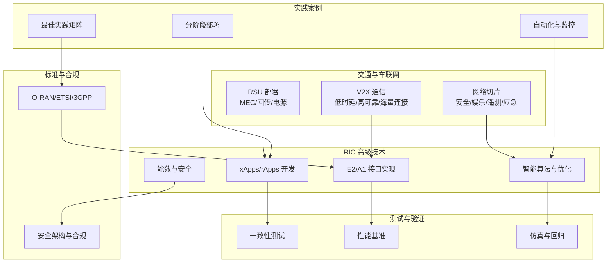
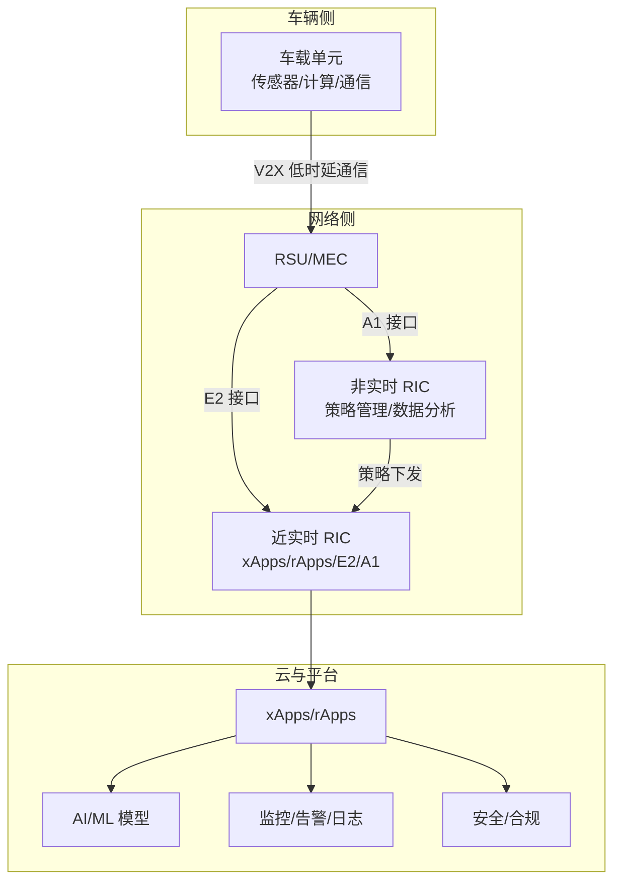
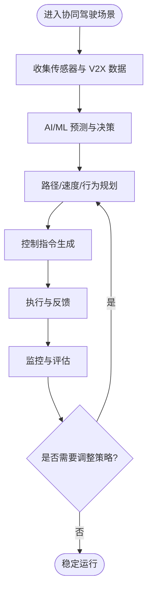
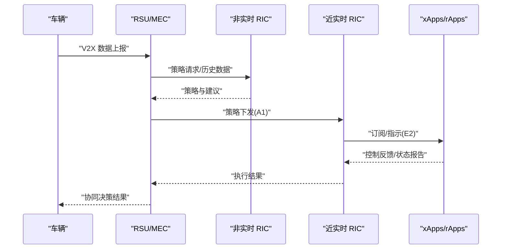
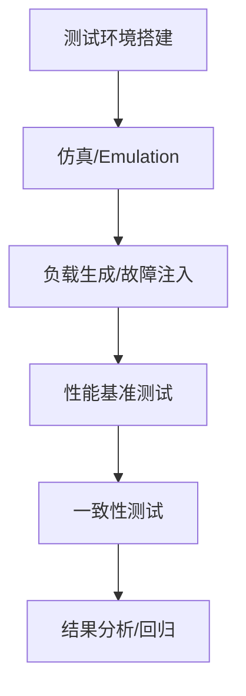
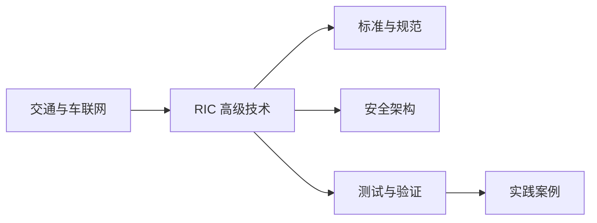

# 协同驾驶支持机制

<cite>
**本文引用的文件**
- [O-RAN 交通解决方案](file://16-industry-solutions/transportation/o-ran-transportation-solutions.md)
- [O-RAN 高级技术](file://07-ric-development/readme-zh.md)
- [O-RAN 技术发展趋势分析](file://15-future-development/technology-trends/technology-evolution-roadmap.md)
- [O-RAN 测试与验证](file://13-testing-validation/readme.md)
- [O-RAN 测试一致性验证](file://13-testing-validation/conformance-testing/o-ran-conformance-testing.md)
- [O-RAN 应用性能调优](file://26-performance-optimization/application-tuning/o-ran-application-performance-tuning.md)
- [O-RAN 开发工具包](file://22-tool-platforms/development-tools/o-ran-development-toolkit.md)
- [O-RAN 最佳实践案例](file://21-case-studies/best-practices/o-ran-best-practice-cases-zh.md)
- [O-RAN 标准与规范](file://09-standards-compliance/readme-zh.md)
- [O-RAN 安全架构参考](file://12-security-privacy/security-architecture/security-reference-architecture-zh.md)
</cite>

## 目录
1. [引言](#引言)
2. [项目结构](#项目结构)
3. [核心组件](#核心组件)
4. [架构总览](#架构总览)
5. [详细组件分析](#详细组件分析)
6. [依赖关系分析](#依赖关系分析)
7. [性能考虑](#性能考虑)
8. [故障排查指南](#故障排查指南)
9. [结论](#结论)
10. [附录](#附录)

## 引言
本文件面向协同驾驶支持机制，聚焦多车协同控制算法（车队编队、跟驰控制、变道协调、紧急避障）、分布式控制架构、通信协议与决策机制，并结合 O-RAN 的实时决策支持系统（路径规划、速度控制、行为预测），覆盖人机共驾模式、自动驾驶分级标准与安全冗余设计，同时提供仿真测试环境、性能验证方法与实际部署案例，帮助读者系统理解并落地协同驾驶的工程化实现。

## 项目结构
该仓库围绕 O-RAN 核心能力（RIC、接口、AI/ML、安全与合规）提供完整知识体系，协同驾驶作为典型垂直行业应用，可直接映射到以下模块：
- 交通与车联网应用：V2X、低时延、高可靠、网络切片
- RIC 高级技术：xApps/rApps、E2/A1 接口、智能算法与性能优化
- 测试与验证：一致性测试、性能基准、仿真与回归
- 标准与合规：O-RAN、ETSI、3GPP、安全与隐私
- 实践案例：部署方法、自动化、监控与持续优化

**章节来源**
- file://16-industry-solutions/transportation/o-ran-transportation-solutions.md#L1-L211
- file://07-ric-development/readme-zh.md#L1-L340
- file://13-testing-validation/readme.md#L1-L57
- file://09-standards-compliance/readme-zh.md#L1-L371
- file://21-case-studies/best-practices/o-ran-best-practice-cases-zh.md#L1-L210

## 核心组件
- 交通与车联网支撑
  - V2X 通信：V2V/V2I/V2P/V2N，满足安全关键应用的超低时延与高可靠
  - 网络切片：安全切片、娱乐切片、遥测切片、应急切片
  - RSU 部署：O-RU 集成、边缘计算节点、回传与电源
- RIC 高级技术
  - xApps/rApps：近实时与非实时 RIC 的应用开发与部署
  - E2/A1 接口：订阅/指示、策略生命周期、冲突检测与解决
  - 智能算法：异常检测、预测性维护、自动优化、强化学习
  - 能效与安全：节能算法、AI 驱动安全、零信任与纵深防御
- 测试与验证
  - 一致性测试：O-RAN 联盟测试套件、3GPP 规范验证
  - 性能测试：吞吐/时延/压力/可扩展性、故障恢复时间
  - 仿真与回归：RAN 网络仿真、协议栈仿真、负载生成、故障注入
- 标准与合规
  - O-RAN 联盟规范、ETSI 标准、3GPP 标准
  - 安全架构：零信任、mTLS、RBAC、SIEM 集成、合规审计
- 实践案例
  - 分阶段部署：试点—区域—全国
  - 自动化与监控：CI/CD、自动化测试、性能基线、预测性分析
  - 最佳实践矩阵：高层支持、技术专长、厂商管理、变革管理、流程标准化、持续优化

**章节来源**
- file://16-industry-solutions/transportation/o-ran-transportation-solutions.md#L8-L83
- file://07-ric-development/readme-zh.md#L8-L333
- file://13-testing-validation/readme.md#L6-L57
- file://09-standards-compliance/readme-zh.md#L8-L193
- file://12-security-privacy/security-architecture/security-reference-architecture-zh.md#L8-L71

## 架构总览
协同驾驶支持机制以 O-RAN 为基础，通过近实时 RIC（Near-RT RIC）与非实时 RIC（Non-RT RIC）协同，结合 xApps/rApps 实现车辆编队、跟驰、变道与紧急避障的实时决策与执行。网络侧通过 V2X 与网络切片提供低时延、高可靠与海量连接，边缘侧通过 MEC/RSU 实现本地化决策与缓存，安全与合规贯穿全链路。

**图表来源**
- [O-RAN 交通解决方案](file://16-industry-solutions/transportation/o-ran-transportation-solutions.md#L8-L83)
- [O-RAN 高级技术](file://07-ric-development/readme-zh.md#L8-L333)
- [O-RAN 安全架构参考](file://12-security-privacy/security-architecture/security-reference-architecture-zh.md#L8-L71)

## 详细组件分析

### 多车协同控制算法
- 车队编队
  - 通过 V2X 实时交换位置、速度与意图，结合网络切片保障安全切片的低时延与高可靠
  - 近实时 RIC 通过 xApps 实现编队一致性控制与冲突规避
- 跟驰控制
  - 利用 E2 接口订阅传感器与雷达数据，结合强化学习或模型预测控制（MPC）进行速度与纵向加速度优化
- 变道协调
  - 基于 A1 策略与近实时 RIC 的协同，实现跨车道的轨迹规划与冲突检测
- 紧急避障
  - 通过异常检测与预测性维护，提前识别潜在风险；在安全切片内实现毫秒级响应

**章节来源**
- file://16-industry-solutions/transportation/o-ran-transportation-solutions.md#L23-L51
- file://07-ric-development/readme-zh.md#L99-L124

### 分布式控制架构与通信协议
- 分布式控制
  - 近实时 RIC 负责低时延控制面，非实时 RIC 负责策略与长期优化，二者通过 A1 接口协调
  - xApps/rApps 在 RIC 上部署，实现按需扩展与弹性伸缩
- 通信协议
  - E2 接口：订阅/指示、报告、错误处理与重试
  - A1 接口：RESTful API、JSON、HTTP/HTTPS、策略生命周期管理
  - 前传接口：O-FH（eCPRI 等）与同步平面
- 网络切片
  - 安全切片：关键控制信号专用资源
  - 应急切片：紧急服务优先接入
  - 遥测切片：车辆诊断与车队管理
  - 娱乐切片：乘客服务与多媒体

**章节来源**
- file://07-ric-development/readme-zh.md#L60-L97
- file://09-standards-compliance/readme-zh.md#L46-L76

### 决策机制与实时推理
- 决策链路
  - 数据采集（传感器/V2X/遥测）→ 边缘推理（MEC/RSU）→ RIC 决策（xApps）→ 执行与反馈
- 实时性保障
  - E2 接口异步处理、批处理与连接池管理
  - 策略冲突检测与优先级机制
  - 负载均衡与故障隔离
- 行为预测与路径规划
  - 基于深度学习与强化学习的行为预测
  - 多目标优化与约束优化，兼顾安全、舒适与效率

**章节来源**
- file://07-ric-development/readme-zh.md#L60-L124
- file://15-future-development/technology-trends/technology-evolution-roadmap.md#L64-L68

### 人机共驾模式与自动驾驶分级
- 自动驾驶分级
  - Level 3-5：需要人类接管与监督的人机共驾模式，强调冗余与安全边界
- 安全冗余设计
  - 多网络路径与多 RIC 协同
  - 策略冲突解决与优先级
  - 安全切片与应急通道
- 功能安全与预期功能安全（SOTIF）
  - ISO 26262 功能安全与 SOTIF 的协同，覆盖设计缺陷与运行失效

**章节来源**
- file://16-industry-solutions/transportation/o-ran-transportation-solutions.md#L23-L36
- file://12-security-privacy/security-architecture/security-reference-architecture-zh.md#L486-L530

### 仿真测试环境与性能验证
- 仿真与测试框架
  - NS-3 O-RAN 扩展：PHY 层、前传网络、RIC 功能仿真
  - 协议栈仿真、负载生成、故障注入、网络拓扑仿真
- 性能基准
  - 合成负载测试、真实场景验证、混沌工程、持续监控
- 一致性与互操作性
  - O-RAN 联盟测试套件、3GPP 规范验证、Plugfest 验证

**章节来源**
- file://22-tool-platforms/development-tools/o-ran-development-toolkit.md#L111-L139
- file://13-testing-validation/conformance-testing/o-ran-conformance-testing.md#L1-L67
- file://26-performance-optimization/application-tuning/o-ran-application-performance-tuning.md#L201-L264

### 实际部署案例
- 分阶段方法：试点—区域扩展—全国部署，逐步降低风险
- 自动化与监控：CI/CD、自动化测试、性能基线、预测性分析
- 最佳实践矩阵：高层支持、技术专长、厂商管理、变革管理、流程标准化、持续优化

**章节来源**
- file://21-case-studies/best-practices/o-ran-best-practice-cases-zh.md#L6-L129

## 依赖关系分析
协同驾驶支持机制的关键依赖关系如下：
- 交通与车联网依赖 RIC 的 E2/A1 接口与 xApps/rApps
- RIC 依赖标准与规范（O-RAN、ETSI、3GPP）与安全架构
- 测试与验证依赖一致性测试、性能基准与仿真工具
- 实践案例依赖自动化与监控体系

**图表来源**
- [O-RAN 交通解决方案](file://16-industry-solutions/transportation/o-ran-transportation-solutions.md#L1-L211)
- [O-RAN 高级技术](file://07-ric-development/readme-zh.md#L1-L340)
- [O-RAN 标准与规范](file://09-standards-compliance/readme-zh.md#L1-L371)
- [O-RAN 安全架构参考](file://12-security-privacy/security-architecture/security-reference-architecture-zh.md#L1-L530)
- [O-RAN 测试与验证](file://13-testing-validation/readme.md#L1-L57)
- [O-RAN 最佳实践案例](file://21-case-studies/best-practices/o-ran-best-practice-cases-zh.md#L1-L210)

**章节来源**
- file://16-industry-solutions/transportation/o-ran-transportation-solutions.md#L1-L211
- file://07-ric-development/readme-zh.md#L1-L340
- file://09-standards-compliance/readme-zh.md#L1-L371
- file://12-security-privacy/security-architecture/security-reference-architecture-zh.md#L1-L530
- file://13-testing-validation/readme.md#L1-L57
- file://21-case-studies/best-practices/o-ran-best-practice-cases-zh.md#L1-L210

## 性能考虑
- 时延与可靠性
  - 通过网络切片与边缘计算降低端到端时延，保障安全切片的高可靠
- 资源调度与弹性
  - 基于 AI 的资源调度与负载均衡，结合金丝雀发布与自动扩缩容
- 持续优化
  - 建立性能基线与多目标优化，定期评估与渐进式优化

**章节来源**
- file://16-industry-solutions/transportation/o-ran-transportation-solutions.md#L70-L83
- file://07-ric-development/readme-zh.md#L305-L333
- file://26-performance-optimization/application-tuning/o-ran-application-performance-tuning.md#L201-L264

## 故障排查指南
- 接口与协议
  - E2/A1 接口的订阅/指示/报告处理与错误重试机制
- 安全与合规
  - mTLS 认证、RBAC、SIEM 集成与合规审计
- 测试与回归
  - 自动化测试平台、测试用例管理、回归测试与结果分析

**章节来源**
- file://07-ric-development/readme-zh.md#L60-L97
- file://12-security-privacy/security-architecture/security-reference-architecture-zh.md#L247-L337
- file://13-testing-validation/readme.md#L36-L57

## 结论
协同驾驶支持机制依托 O-RAN 的开放架构与先进能力，通过近实时与非实时 RIC 的协同、xApps/rApps 的灵活部署、AI/ML 的智能决策与严格的测试验证，实现多车协同控制的低时延、高可靠与可扩展。结合网络切片、安全架构与标准合规，可有效支撑人机共驾与自动驾驶分级场景，并通过分阶段部署与自动化运维实现规模化落地。

## 附录
- 相关文件索引
  - 交通与车联网：[O-RAN 交通解决方案](file://16-industry-solutions/transportation/o-ran-transportation-solutions.md#L1-L211)
  - RIC 高级技术：[O-RAN 高级技术](file://07-ric-development/readme-zh.md#L1-L340)
  - 技术趋势：[O-RAN 技术发展趋势分析](file://15-future-development/technology-trends/technology-evolution-roadmap.md#L1-L68)
  - 测试与验证：[O-RAN 测试与验证](file://13-testing-validation/readme.md#L1-L57)、[O-RAN 测试一致性验证](file://13-testing-validation/conformance-testing/o-ran-conformance-testing.md#L1-L67)、[O-RAN 应用性能调优](file://26-performance-optimization/application-tuning/o-ran-application-performance-tuning.md#L201-L264)、[O-RAN 开发工具包](file://22-tool-platforms/development-tools/o-ran-development-toolkit.md#L111-L139)
  - 标准与合规：[O-RAN 标准与规范](file://09-standards-compliance/readme-zh.md#L1-L371)、[O-RAN 安全架构参考](file://12-security-privacy/security-architecture/security-reference-architecture-zh.md#L1-L530)
  - 实践案例：[O-RAN 最佳实践案例](file://21-case-studies/best-practices/o-ran-best-practice-cases-zh.md#L1-L210)