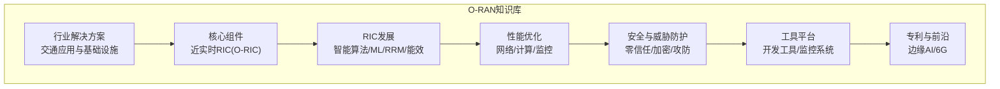
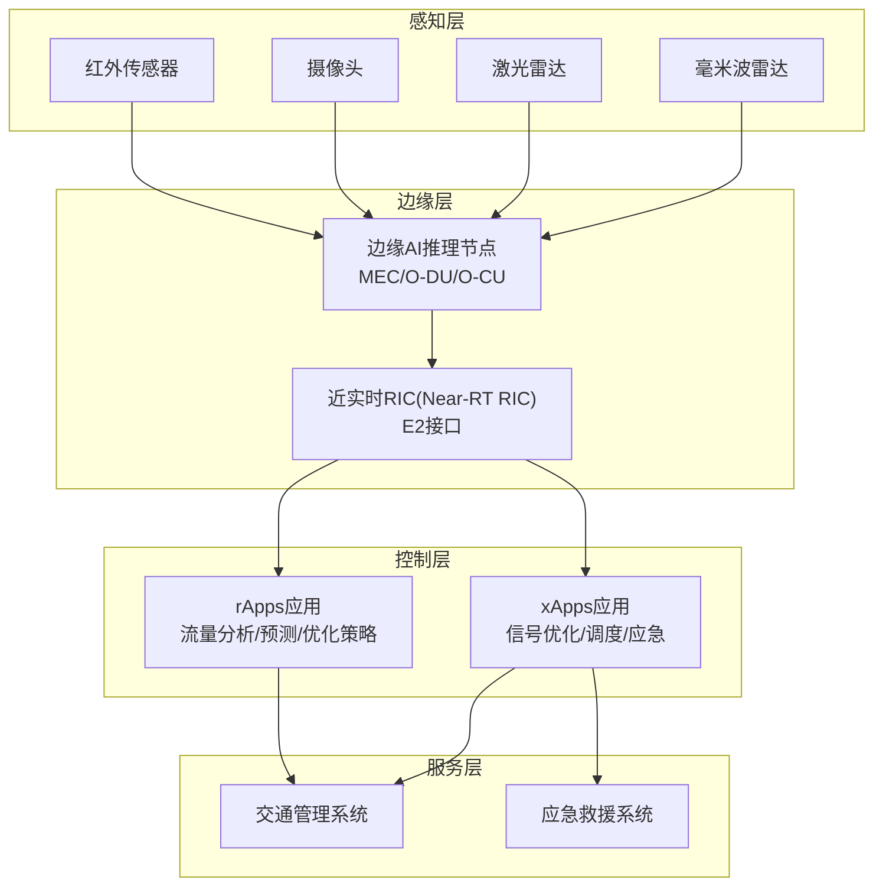
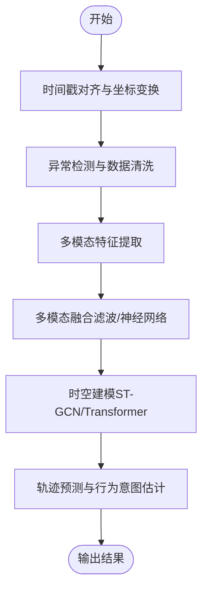
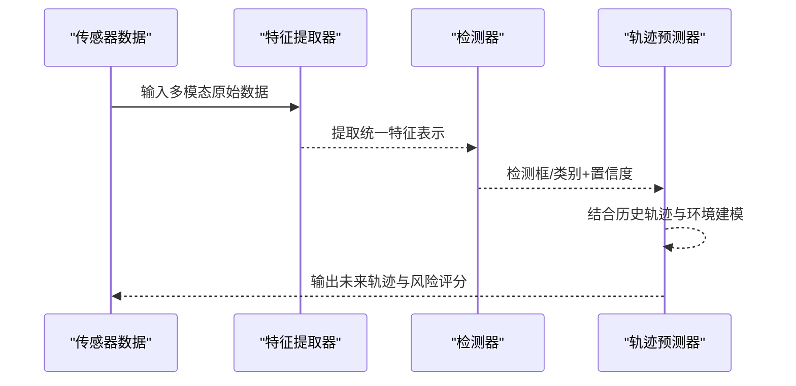
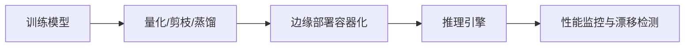
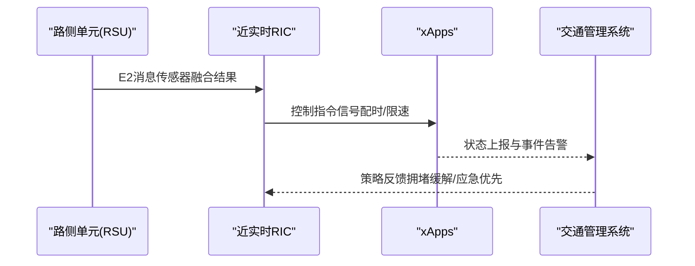
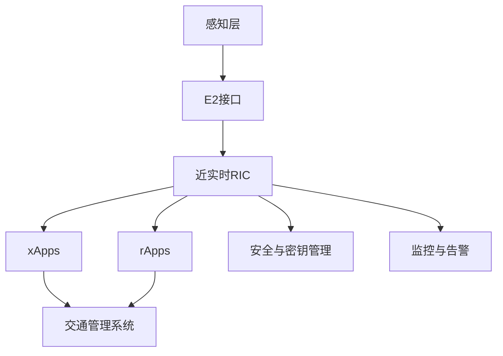
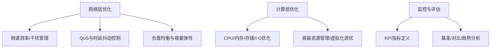
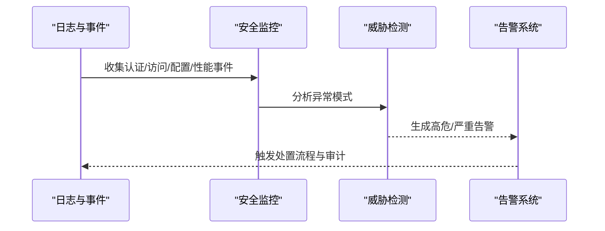

# 实时道路感知系统

<cite>
**本文引用的文件**
- [README.md](file://README.md)
- [o-ran-transportation-solutions.md](file://16-industry-solutions/transportation/o-ran-transportation-solutions.md)
- [o-ric.md](file://02-core-components/o-ric.md)
- [readme.md](file://07-ric-development/readme.md)
- [network-performance-tuning.md](file://26-performance-optimization/network-optimization/network-performance-tuning.md)
- [o-ran-compute-optimization.md](file://26-performance-optimization/compute-optimization/o-ran-compute-optimization.md)
- [o-ran-monitoring-systems.md](file://22-tool-platforms/monitoring-systems/o-ran-monitoring-systems.md)
- [o-ran-development-toolkit.md](file://22-tool-platforms/development-tools/o-ran-development-toolkit.md)
- [security-reference-architecture.md](file://12-security-privacy/security-architecture/security-reference-architecture.md)
- [o-ran-attack-protection.md](file://29-security-threats/attack-protection/o-ran-attack-protection.md)
- [comprehensive-oran-patent-table.md](file://comprehensive-oran-patent-table.md)
- [emerging-applications-roadmap.md](file://15-future-development/emerging-applications/emerging-applications-roadmap.md)
</cite>

## 目录
1. [引言](#引言)
2. [项目结构](#项目结构)
3. [核心组件](#核心组件)
4. [架构总览](#架构总览)
5. [详细组件分析](#详细组件分析)
6. [依赖关系分析](#依赖关系分析)
7. [性能考量](#性能考量)
8. [故障排查指南](#故障排查指南)
9. [结论](#结论)
10. [附录](#附录)

## 引言
本技术文档面向“实时道路感知系统”的工程落地，围绕基于O-RAN的多传感器融合感知体系，系统阐述毫米波雷达、激光雷达、摄像头与红外传感器的数据融合算法，时空数据处理、目标检测识别与轨迹预测技术，并给出边缘AI推理优化、模型压缩与实时计算框架的实施方案。同时覆盖交通标志识别、行人检测、车辆跟踪与天气适应性处理，以及感知精度评估、算法优化策略与系统集成方案。

该文档以O-RAN参考架构为载体，结合RAN智能化（近实时RIC/NR RIC）与边缘计算能力，构建从“感知—决策—执行”的闭环系统，支撑智能交通与自动驾驶场景下的低时延、高可靠与可扩展需求。

## 项目结构
本仓库是O-RAN专家知识库，按主题域组织内容，与实时道路感知系统直接相关的核心模块包括：
- 行业解决方案：交通领域应用与基础设施部署
- 核心组件：近实时RIC（O-RIC）与xApps/rApps开发
- RIC发展：智能算法与机器学习、无线电资源管理优化、能量效率优化
- 性能优化：网络层与计算层优化、监控与告警
- 安全与威胁防护：零信任架构、加密与密钥管理、攻击防护框架
- 工具平台：开发工具包、监控系统
- 专利与前沿：边缘AI推理优化、6G前沿技术

**章节来源**
- [README.md](file://README.md#L1-L472)

## 核心组件
- 近实时RIC（O-RIC）：在交通控制中心部署Near-RT RIC，实现毫秒级交通信号控制；在数据中心部署Non-RT RIC，进行交通流分析与长期优化。通过E2接口与RSU/OBU交互，支撑xApps/rApps开发与部署。
- xApps/rApps：开发交通信号优化、车辆调度、应急响应等应用，实现从感知到控制的闭环。
- 边缘计算：MEC与O-DU/O-CU协同部署，实现分布式AI/ML推理、视频分析与预测维护。
- 安全架构：零信任模型、多层纵深防御、证书与密钥管理体系、SIEM集成与威胁检测。

**章节来源**
- [o-ric.md](file://02-core-components/o-ric.md#L389-L423)
- [o-ran-transportation-solutions.md](file://16-industry-solutions/transportation/o-ran-transportation-solutions.md#L38-L194)
- [readme.md](file://07-ric-development/readme.md#L79-L169)
- [security-reference-architecture.md](file://12-security-privacy/security-architecture/security-reference-architecture.md#L1-L559)

## 架构总览
实时道路感知系统的总体架构由“感知层—边缘层—控制层—服务层”构成，依托O-RAN的E2接口与近实时RIC，实现多传感器数据汇聚、边缘AI推理与策略下发。

**图示来源**
- [o-ric.md](file://02-core-components/o-ric.md#L389-L423)
- [o-ran-transportation-solutions.md](file://16-industry-solutions/transportation/o-ran-transportation-solutions.md#L38-L194)
- [readme.md](file://07-ric-development/readme.md#L79-L169)

## 详细组件分析

### 多传感器融合与时空数据处理
- 数据采集与预处理：统一时间戳对齐、坐标系变换、异常值剔除与缺失值插补。
- 特征提取：针对毫米波雷达的距离-多普勒特征、激光雷达点云特征、图像语义分割特征与红外热成像特征进行统一表征。
- 融合策略：基于卡尔曼滤波/粒子滤波的时序融合，以及基于深度学习的多模态特征融合（如跨模态注意力）。
- 时空建模：使用时空图卷积或Transformer对时空序列进行建模，支撑目标轨迹预测与行为意图估计。

**章节来源**
- [o-ran-transportation-solutions.md](file://16-industry-solutions/transportation/o-ran-transportation-solutions.md#L38-L194)
- [readme.md](file://07-ric-development/readme.md#L79-L169)

### 目标检测识别与轨迹预测
- 目标检测：采用轻量化CNN或Transformer骨干网络，结合多尺度特征金字塔，实现交通标志、行人与车辆的高精度检测。
- 轨迹预测：基于LSTM/GRU或图神经网络，结合历史轨迹与环境约束，预测未来若干步的状态。
- 天气适应性：通过归一化输入、对抗训练与域泛化策略，提升在雨雪雾等复杂天气下的鲁棒性。

**章节来源**
- [readme.md](file://07-ric-development/readme.md#L79-L169)
- [o-ran-transportation-solutions.md](file://16-industry-solutions/transportation/o-ran-transportation-solutions.md#L38-L194)

### 边缘AI推理优化、模型压缩与实时计算框架
- 模型压缩：量化、剪枝、知识蒸馏与低秩分解，降低计算与存储开销。
- 硬件加速：结合GPU/TPU/FPGA/ASIC，优化算子调度与内存带宽。
- 实时计算：基于事件驱动与流水线并行，结合边缘缓存与任务迁移，满足毫秒级时延。
- 模型服务：ONNX/TensorFlow Serving/自研推理引擎，支持A/B测试与漂移检测。

**章节来源**
- [o-ran-development-toolkit.md](file://22-tool-platforms/development-tools/o-ran-development-toolkit.md#L368-L415)
- [comprehensive-oran-patent-table.md](file://comprehensive-oran-patent-table.md#L87-L99)

### 交通标志识别、行人检测、车辆跟踪与天气适应
- 交通标志识别：基于轻量化检测网络，结合几何先验与颜色特征，提升夜间与恶劣天气识别率。
- 行人检测：采用多尺度检测与上下文建模，结合遮挡与形变处理策略。
- 车辆跟踪：多目标跟踪（MOT）结合外观特征与运动模型，实现跨摄像机稳定跟踪。
- 天气适应：采用域泛化与对抗训练，增强在不同天气条件下的鲁棒性。

**章节来源**
- [o-ran-transportation-solutions.md](file://16-industry-solutions/transportation/o-ran-transportation-solutions.md#L38-L194)
- [readme.md](file://07-ric-development/readme.md#L79-L169)

### 系统集成方案
- 接口协议：E2接口用于近实时控制，A1接口用于策略下发，O1/O-FH接口用于非实时分析与优化。
- xApps/rApps：分别负责运行时控制与长期策略优化，通过O-RIC编排与调度。
- 与外部系统：与交通管理系统、应急救援系统对接，实现数据共享与协同处置。

**章节来源**
- [o-ric.md](file://02-core-components/o-ric.md#L389-L423)
- [o-ran-transportation-solutions.md](file://16-industry-solutions/transportation/o-ran-transportation-solutions.md#L38-L194)

## 依赖关系分析
- 组件耦合：感知层与边缘层通过E2接口解耦；控制层与服务层通过策略与状态接口解耦。
- 外部依赖：第三方推理框架、容器编排平台、监控与日志系统、安全认证与密钥管理。
- 循环依赖：通过清晰的接口契约与版本管理避免循环依赖。

**图示来源**
- [o-ric.md](file://02-core-components/o-ric.md#L389-L423)
- [security-reference-architecture.md](file://12-security-privacy/security-architecture/security-reference-architecture.md#L1-L559)
- [o-ran-monitoring-systems.md](file://22-tool-platforms/monitoring-systems/o-ran-monitoring-systems.md#L415-L485)

**章节来源**
- [o-ric.md](file://02-core-components/o-ric.md#L389-L423)
- [security-reference-architecture.md](file://12-security-privacy/security-architecture/security-reference-architecture.md#L1-L559)
- [o-ran-monitoring-systems.md](file://22-tool-platforms/monitoring-systems/o-ran-monitoring-systems.md#L415-L485)

## 性能考量
- 网络层优化：频谱效率提升、干扰管理、QoS参数与时延抖动控制、负载均衡与容量弹性。
- 计算层优化：CPU/内存/存储/网络I/O系统性优化，容器资源管理与虚拟化调优。
- 监控与评估：建立KPI指标体系（RSRP/SINR、吞吐量、时延/抖动、负载均衡度），进行基准建立、优化前后对比与长期趋势分析。

**章节来源**
- [network-performance-tuning.md](file://26-performance-optimization/network-optimization/network-performance-tuning.md#L1-L98)
- [o-ran-compute-optimization.md](file://26-performance-optimization/compute-optimization/o-ran-compute-optimization.md#L473-L473)

## 故障排查指南
- 安全监控与威胁检测：通过SIEM集成收集认证、访问、配置变更与性能异常事件，自动识别暴力破解、未授权配置修改等威胁，生成告警并建议处置措施。
- 预测性维护：基于统计与机器学习方法进行异常检测与健康预测，提前发现设备隐患。
- 攻击防护：零信任架构、最小权限、微分段与多层纵深防御，结合EDR/NDR/SOAR工具链实现自动化响应。

**章节来源**
- [o-ran-monitoring-systems.md](file://22-tool-platforms/monitoring-systems/o-ran-monitoring-systems.md#L415-L485)
- [o-ran-attack-protection.md](file://29-security-threats/attack-protection/o-ran-attack-protection.md#L1-L209)
- [security-reference-architecture.md](file://12-security-privacy/security-architecture/security-reference-architecture.md#L340-L513)

## 结论
本方案以O-RAN为基础，结合近实时RIC与边缘AI推理能力，形成“感知—融合—预测—控制—评估”的闭环体系，能够满足智能交通与自动驾驶对低时延、高可靠与可扩展性的要求。通过网络与计算层优化、安全与威胁防护、预测性维护与监控告警，确保系统在复杂交通场景与多变天气条件下保持稳定高效运行。

## 附录
- 专利与前沿：边缘AI推理优化、6G前沿技术（太赫兹通信）等方向具备技术储备与专利基础。
- 未来演进：分布式智能架构、沉浸式通信与智慧城市认知网络，为系统持续演进提供蓝图。

**章节来源**
- [comprehensive-oran-patent-table.md](file://comprehensive-oran-patent-table.md#L87-L99)
- [emerging-applications-roadmap.md](file://15-future-development/emerging-applications/emerging-applications-roadmap.md#L284-L531)