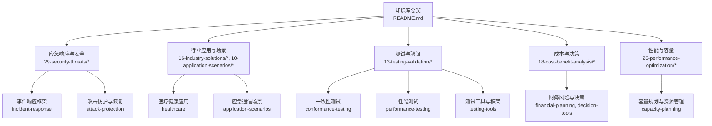
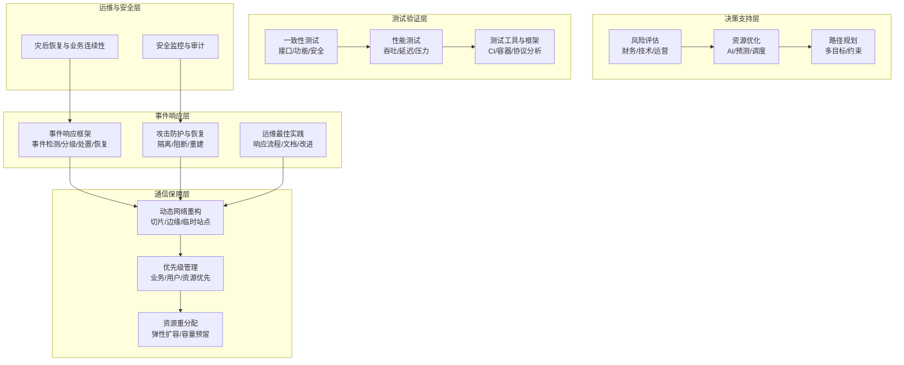
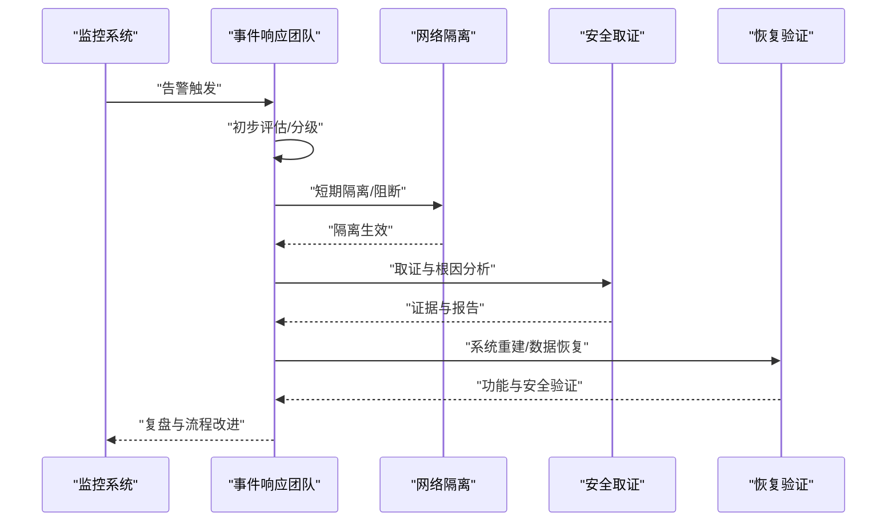
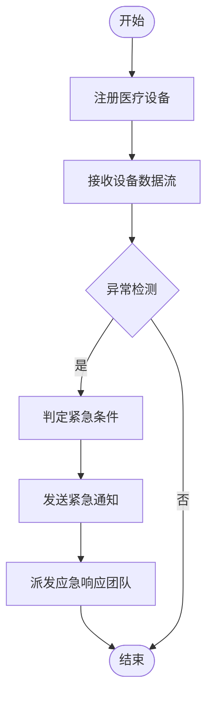
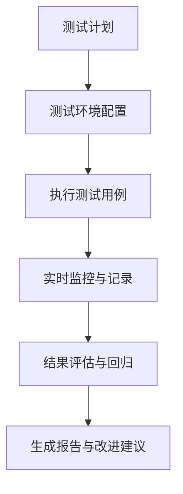
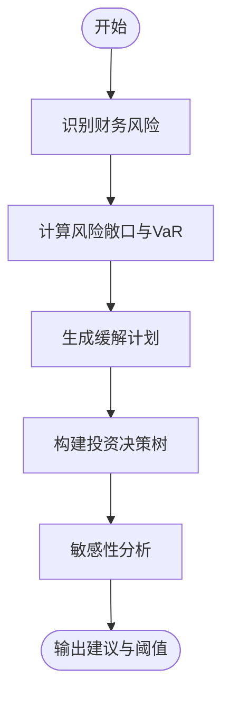
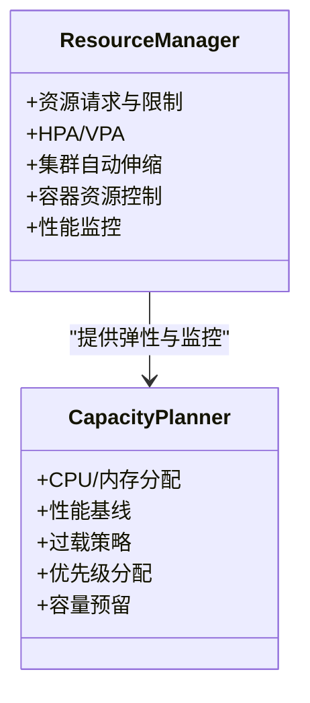
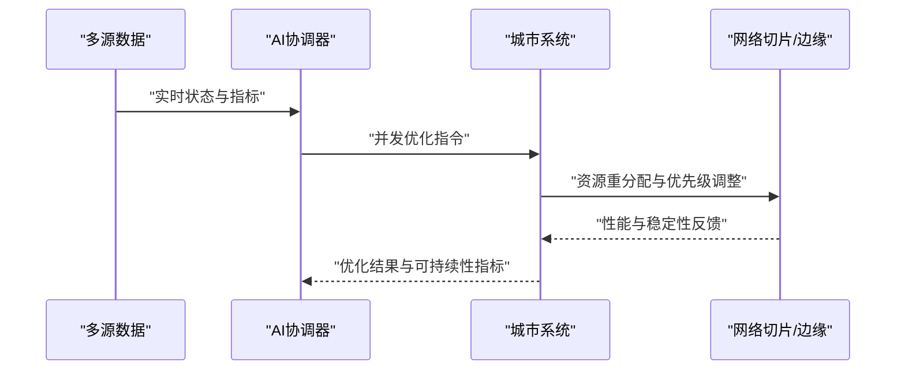
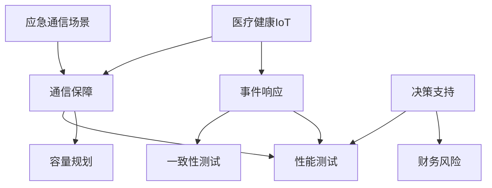

# 应急响应系统

<cite>
**本文引用的文件**
- [README.md](file://README.md)
- [o-ran-incident-response.md](file://29-security-threats/incident-response/o-ran-incident-response.md)
- [o-ran-incident-response-zh.md](file://29-security-threats/incident-response/o-ran-incident-response-zh.md)
- [o-ran-healthcare-solutions-zh.md](file://16-industry-solutions/healthcare/o-ran-healthcare-solutions-zh.md)
- [o-ran-healthcare-solutions.md](file://16-industry-solutions/healthcare/o-ran-healthcare-solutions.md)
- [o-ran-conformance-testing.md](file://13-testing-validation/conformance-testing/o-ran-conformance-testing.md)
- [testing-tools-frameworks.md](file://13-testing-validation/testing-tools/testing-tools-frameworks.md)
- [performance-testing.md](file://13-testing-validation/performance-testing/performance-testing.md)
- [performance-testing-zh.md](file://13-testing-validation/performance-testing/performance-testing-zh.md)
- [oran-financial-planning.md](file://18-cost-benefit-analysis/financial-planning/oran-financial-planning.md)
- [oran-financial-planning-zh.md](file://18-cost-benefit-analysis/financial-planning/oran-financial-planning-zh.md)
- [oran-decision-frameworks.md](file://18-cost-benefit-analysis/decision-tools/oran-decision-frameworks.md)
- [o-ran-capacity-planning.md](file://26-performance-optimization/capacity-planning/o-ran-capacity-planning.md)
- [o-ran-performance-testing.md](file://13-testing-validation/performance-testing/o-ran-performance-testing.md)
- [o-ran-performance-testing-zh.md](file://13-testing-validation/performance-testing/o-ran-performance-testing-zh.md)
- [o-ran-attack-protection.md](file://29-security-threats/attack-protection/o-ran-attack-protection.md)
- [o-ran-operations-best-practices.md](file://30-best-practices/operations-practices/o-ran-operations-best-practices.md)
- [readme.md](file://10-application-scenarios/readme.md)
- [emerging-applications-roadmap.md](file://15-future-development/emerging-applications/emerging-applications-roadmap.md)
</cite>

## 目录
1. [引言](#引言)
2. [项目结构](#项目结构)
3. [核心组件](#核心组件)
4. [架构总览](#架构总览)
5. [详细组件分析](#详细组件分析)
6. [依赖分析](#依赖分析)
7. [性能考量](#性能考量)
8. [故障排查指南](#故障排查指南)
9. [结论](#结论)
10. [附录](#附录)

## 引言
本技术文档面向应急响应系统，聚焦O-RAN在紧急情况下的通信保障机制，覆盖灾难预警、应急调度、救援通信、动态网络重构、优先级管理与资源重分配策略，并提供基于AI的应急决策支持（风险评估、资源优化、路径规划）。同时，文档整合多部门协调、跨区域通信保障与灾后恢复策略，给出应急演练方案、系统测试方法与性能评估指标，帮助构建高韧性、可快速恢复的应急通信体系。

## 项目结构
该知识库围绕O-RAN架构、接口标准、RIC与AI、测试验证、运维与安全、行业应用等多个维度组织内容，为应急响应系统提供理论基础与实践工具。关键目录与主题如下：
- 应急响应与安全：事件响应框架、攻击防护、最佳运维实践
- 行业应用：医疗健康、智慧城市建设等场景中的应急通信需求
- 测试与验证：一致性测试、性能测试、工具与框架
- 成本与决策：财务风险与投资决策框架
- 性能与容量：资源配额与弹性扩容策略
- 应用场景：应急通信、临时容量扩展、优先级策略

**图表来源**
- [README.md](file://README.md#L1-L472)

**章节来源**
- [README.md](file://README.md#L1-L472)

## 核心组件
- 事件响应与安全
  - 事件响应团队结构、流程、沟通协议、取证与指标
  - 攻击防护与恢复策略（隔离、阻断、重建）
  - 运维最佳实践（响应流程、文档与改进）
- 行业应用与场景
  - 医疗健康IoT应急联动（设备注册、异常检测、紧急触发）
  - 智慧城市与应急通信（跨部门协同、临时容量扩展、优先级策略）
- 测试与验证
  - 一致性测试（架构、接口、功能、性能、安全）
  - 性能测试（吞吐、延迟、压力测试）
  - 测试工具与框架（商业与开源、容器化、CI/CD）
- 成本与决策
  - 财务风险识别与VaR分析
  - 投资决策树与敏感性分析
- 性能与容量
  - 动态资源管理（K8s、容器、裸金属）
  - 容量预留与弹性扩容
- AI与未来应用
  - 智慧城市AI协同优化（交通、能源、公共安全）

**章节来源**
- [o-ran-incident-response.md](file://29-security-threats/incident-response/o-ran-incident-response.md#L1-L269)
- [o-ran-incident-response-zh.md](file://29-security-threats/incident-response/o-ran-incident-response-zh.md#L1-L269)
- [o-ran-attack-protection.md](file://29-security-threats/attack-protection/o-ran-attack-protection.md#L100-L145)
- [o-ran-operations-best-practices.md](file://30-best-practices/operations-practices/o-ran-operations-best-practices.md#L70-L98)
- [o-ran-healthcare-solutions-zh.md](file://16-industry-solutions/healthcare/o-ran-healthcare-solutions-zh.md#L52-L249)
- [o-ran-healthcare-solutions.md](file://16-industry-solutions/healthcare/o-ran-healthcare-solutions.md#L52-L249)
- [readme.md](file://10-application-scenarios/readme.md#L155-L183)
- [o-ran-conformance-testing.md](file://13-testing-validation/conformance-testing/o-ran-conformance-testing.md#L1-L67)
- [performance-testing.md](file://13-testing-validation/performance-testing/performance-testing.md#L58-L138)
- [performance-testing-zh.md](file://13-testing-validation/performance-testing/performance-testing-zh.md#L58-L138)
- [testing-tools-frameworks.md](file://13-testing-validation/testing-tools/testing-tools-frameworks.md#L1-L598)
- [oran-financial-planning.md](file://18-cost-benefit-analysis/financial-planning/oran-financial-planning.md#L558-L771)
- [oran-financial-planning-zh.md](file://18-cost-benefit-analysis/financial-planning/oran-financial-planning-zh.md#L558-L771)
- [oran-decision-frameworks.md](file://18-cost-benefit-analysis/decision-tools/oran-decision-frameworks.md#L55-L304)
- [o-ran-capacity-planning.md](file://26-performance-optimization/capacity-planning/o-ran-capacity-planning.md#L76-L144)
- [emerging-applications-roadmap.md](file://15-future-development/emerging-applications/emerging-applications-roadmap.md#L588-L877)

## 架构总览
应急响应系统以“事件驱动+AI协同+弹性资源”为核心，通过以下子系统协同工作：
- 事件响应层：事件检测、分级、处置、恢复与复盘
- 通信保障层：动态网络重构、优先级管理、资源重分配
- 决策支持层：风险评估、资源优化、路径规划
- 测试验证层：一致性、性能、工具与框架
- 运维与安全层：攻击防护、恢复与最佳实践

**图表来源**
- [o-ran-incident-response.md](file://29-security-threats/incident-response/o-ran-incident-response.md#L45-L105)
- [o-ran-attack-protection.md](file://29-security-threats/attack-protection/o-ran-attack-protection.md#L100-L145)
- [o-ran-operations-best-practices.md](file://30-best-practices/operations-practices/o-ran-operations-best-practices.md#L70-L98)
- [readme.md](file://10-application-scenarios/readme.md#L155-L183)
- [o-ran-conformance-testing.md](file://13-testing-validation/conformance-testing/o-ran-conformance-testing.md#L1-L67)
- [performance-testing.md](file://13-testing-validation/performance-testing/performance-testing.md#L58-L138)
- [testing-tools-frameworks.md](file://13-testing-validation/testing-tools/testing-tools-frameworks.md#L1-L598)
- [oran-financial-planning.md](file://18-cost-benefit-analysis/financial-planning/oran-financial-planning.md#L558-L771)
- [oran-decision-frameworks.md](file://18-cost-benefit-analysis/decision-tools/oran-decision-frameworks.md#L55-L304)

## 详细组件分析

### 事件响应与安全
- 团队结构与职责：事件指挥官、技术负责人、通信经理、法律顾问、取证专家；扩展支持团队分工明确
- 响应流程：准备、检测与分析、短期/长期隔离、恢复与复盘
- 沟通协议：内部与外部沟通渠道、模板与升级流程
- 取证与指标：证据收集、取证分析、响应指标（MTTD/MTTR/MTTC/MTTR、成功率、误报率、合规达成）

**图表来源**
- [o-ran-incident-response.md](file://29-security-threats/incident-response/o-ran-incident-response.md#L45-L105)
- [o-ran-incident-response-zh.md](file://29-security-threats/incident-response/o-ran-incident-response-zh.md#L45-L105)

**章节来源**
- [o-ran-incident-response.md](file://29-security-threats/incident-response/o-ran-incident-response.md#L1-L269)
- [o-ran-incident-response-zh.md](file://29-security-threats/incident-response/o-ran-incident-response-zh.md#L1-L269)

### 医疗健康IoT应急联动
- 设备注册与状态管理：设备ID、类型、患者绑定、电池/信号/最后传输时间
- 数据处理与异常检测：心率、血压、血氧异常阈值
- 紧急触发与通知：危及生命条件触发、通知接收方、响应团队派发
- 与应急响应流程衔接：自动触发、通知、派工、恢复验证

**图表来源**
- [o-ran-healthcare-solutions-zh.md](file://16-industry-solutions/healthcare/o-ran-healthcare-solutions-zh.md#L52-L249)
- [o-ran-healthcare-solutions.md](file://16-industry-solutions/healthcare/o-ran-healthcare-solutions.md#L52-L249)

**章节来源**
- [o-ran-healthcare-solutions-zh.md](file://16-industry-solutions/healthcare/o-ran-healthcare-solutions-zh.md#L52-L249)
- [o-ran-healthcare-solutions.md](file://16-industry-solutions/healthcare/o-ran-healthcare-solutions.md#L52-L249)

### 应急通信与动态网络重构
- 场景需求：多部门协同、广域覆盖、高容量、低功耗、24/7可用性
- 保障策略：抗毁设计、快速恢复、应急通信车/无人机基站、优先策略与资源预留
- 与RAN架构结合：宏站/微站/皮站/毫站、边缘计算、网络切片、异构网络

**图表来源**
- [readme.md](file://10-application-scenarios/readme.md#L155-L183)

**章节来源**
- [readme.md](file://10-application-scenarios/readme.md#L155-L183)

### 测试与验证体系
- 一致性测试：架构、接口（E2/A1/O1等）、功能、性能、安全
- 性能测试：持续吞吐、延迟画像、压力测试与稳定性评估
- 测试工具与框架：商业/开源、容器化、CI/CD、协议分析、监控与可视化

**图表来源**
- [o-ran-conformance-testing.md](file://13-testing-validation/conformance-testing/o-ran-conformance-testing.md#L1-L67)
- [performance-testing.md](file://13-testing-validation/performance-testing/performance-testing.md#L58-L138)
- [testing-tools-frameworks.md](file://13-testing-validation/testing-tools/testing-tools-frameworks.md#L1-L598)

**章节来源**
- [o-ran-conformance-testing.md](file://13-testing-validation/conformance-testing/o-ran-conformance-testing.md#L1-L67)
- [performance-testing.md](file://13-testing-validation/performance-testing/performance-testing.md#L58-L138)
- [performance-testing-zh.md](file://13-testing-validation/performance-testing/performance-testing-zh.md#L58-L138)
- [testing-tools-frameworks.md](file://13-testing-validation/testing-tools/testing-tools-frameworks.md#L1-L598)

### 成本与决策支持
- 财务风险：识别市场、技术、财务、运营风险，计算风险敞口与VaR，生成缓解计划
- 投资决策：技术选择（传统RAN/O-RAN/混合）的决策树与敏感性分析

**图表来源**
- [oran-financial-planning.md](file://18-cost-benefit-analysis/financial-planning/oran-financial-planning.md#L558-L771)
- [oran-decision-frameworks.md](file://18-cost-benefit-analysis/decision-tools/oran-decision-frameworks.md#L55-L304)

**章节来源**
- [oran-financial-planning.md](file://18-cost-benefit-analysis/financial-planning/oran-financial-planning.md#L558-L771)
- [oran-financial-planning-zh.md](file://18-cost-benefit-analysis/financial-planning/oran-financial-planning-zh.md#L558-L771)
- [oran-decision-frameworks.md](file://18-cost-benefit-analysis/decision-tools/oran-decision-frameworks.md#L55-L304)

### 性能与容量管理
- 动态资源管理：K8s资源请求/限制、HPA/VPA、集群自动伸缩、容器资源控制、cAdvisor/Prometheus
- 容量规划：CPU/内存分配、性能基线、过载策略、优先级分配、容量预留

**图表来源**
- [o-ran-capacity-planning.md](file://26-performance-optimization/capacity-planning/o-ran-capacity-planning.md#L76-L144)

**章节来源**
- [o-ran-capacity-planning.md](file://26-performance-optimization/capacity-planning/o-ran-capacity-planning.md#L76-L144)

### 基于AI的应急决策支持
- 智慧城市AI协同：交通、能源、公共交通、水资源、公共安全的并发优化
- 能耗与可持续性：碳排放、能耗、用水、废料的量化改善
- 与应急通信结合：在极端场景下对网络切片、边缘节点、带宽进行AI优化

**图表来源**
- [emerging-applications-roadmap.md](file://15-future-development/emerging-applications/emerging-applications-roadmap.md#L588-L877)

**章节来源**
- [emerging-applications-roadmap.md](file://15-future-development/emerging-applications/emerging-applications-roadmap.md#L588-L877)

## 依赖分析
- 事件响应与安全依赖于测试验证提供的基线与工具，确保处置流程可验证、可追溯
- 通信保障依赖容量与性能管理，保障在峰值与异常场景下的稳定性
- 决策支持依赖财务与测试数据，形成闭环的评估与优化
- 行业应用（如医疗健康）与应急通信场景相互印证，推动接口与协议的兼容性与鲁棒性

**图表来源**
- [o-ran-incident-response.md](file://29-security-threats/incident-response/o-ran-incident-response.md#L45-L105)
- [o-ran-conformance-testing.md](file://13-testing-validation/conformance-testing/o-ran-conformance-testing.md#L1-L67)
- [performance-testing.md](file://13-testing-validation/performance-testing/performance-testing.md#L58-L138)
- [o-ran-capacity-planning.md](file://26-performance-optimization/capacity-planning/o-ran-capacity-planning.md#L76-L144)
- [oran-financial-planning.md](file://18-cost-benefit-analysis/financial-planning/oran-financial-planning.md#L558-L771)
- [o-ran-healthcare-solutions-zh.md](file://16-industry-solutions/healthcare/o-ran-healthcare-solutions-zh.md#L52-L249)
- [readme.md](file://10-application-scenarios/readme.md#L155-L183)

**章节来源**
- [o-ran-incident-response.md](file://29-security-threats/incident-response/o-ran-incident-response.md#L45-L105)
- [o-ran-conformance-testing.md](file://13-testing-validation/conformance-testing/o-ran-conformance-testing.md#L1-L67)
- [performance-testing.md](file://13-testing-validation/performance-testing/performance-testing.md#L58-L138)
- [o-ran-capacity-planning.md](file://26-performance-optimization/capacity-planning/o-ran-capacity-planning.md#L76-L144)
- [oran-financial-planning.md](file://18-cost-benefit-analysis/financial-planning/oran-financial-planning.md#L558-L771)
- [o-ran-healthcare-solutions-zh.md](file://16-industry-solutions/healthcare/o-ran-healthcare-solutions-zh.md#L52-L249)
- [readme.md](file://10-application-scenarios/readme.md#L155-L183)

## 性能考量
- 性能测试方法论：持续吞吐、延迟画像、压力测试与稳定性评估
- 监控与可视化：Prometheus抓取、Grafana仪表盘、告警规则
- 资源弹性：K8s自动伸缩、容器资源控制、裸金属隔离与容量预留
- 一致性与回归：测试用例管理、自动化执行、结果对比与回归机制

**章节来源**
- [performance-testing.md](file://13-testing-validation/performance-testing/performance-testing.md#L58-L138)
- [performance-testing-zh.md](file://13-testing-validation/performance-testing/performance-testing-zh.md#L58-L138)
- [testing-tools-frameworks.md](file://13-testing-validation/testing-tools/testing-tools-frameworks.md#L481-L559)
- [o-ran-capacity-planning.md](file://26-performance-optimization/capacity-planning/o-ran-capacity-planning.md#L76-L144)
- [o-ran-conformance-testing.md](file://13-testing-validation/conformance-testing/o-ran-conformance-testing.md#L1-L67)

## 故障排查指南
- 事件响应流程：准备、检测与分析、短期/长期隔离、恢复与复盘
- 攻击防护与恢复：网络隔离、阻断、账户锁定、服务暂停、系统重建、数据恢复、服务验证
- 运维最佳实践：初始响应、问题诊断、测试验证、服务恢复、文档与改进
- 测试与验证：一致性测试、性能测试、工具与框架、CI/CD集成

**章节来源**
- [o-ran-incident-response.md](file://29-security-threats/incident-response/o-ran-incident-response.md#L45-L105)
- [o-ran-attack-protection.md](file://29-security-threats/attack-protection/o-ran-attack-protection.md#L100-L145)
- [o-ran-operations-best-practices.md](file://30-best-practices/operations-practices/o-ran-operations-best-practices.md#L70-L98)
- [o-ran-conformance-testing.md](file://13-testing-validation/conformance-testing/o-ran-conformance-testing.md#L1-L67)
- [performance-testing.md](file://13-testing-validation/performance-testing/performance-testing.md#L58-L138)
- [testing-tools-frameworks.md](file://13-testing-validation/testing-tools/testing-tools-frameworks.md#L1-L598)

## 结论
本应急响应系统以事件响应与安全为基础，结合动态网络重构、优先级管理与资源重分配策略，辅以AI驱动的决策支持与完善的测试验证体系，能够实现跨部门、跨区域的高效协同与快速恢复。通过财务与决策框架支撑，系统在保障通信韧性的同时，兼顾成本与效益，具备良好的可扩展性与可持续性。

## 附录
- 应急演练方案建议
  - 桌面推演：事件分类、响应流程、沟通模板
  - 实战演练：隔离/阻断、通知/派工、恢复/验证
  - 红蓝对抗：模拟攻击场景，检验处置与恢复能力
- 系统测试方法
  - 接口一致性测试（E2/A1/O1等）
  - 性能基准与回归测试
  - 容器化测试环境与CI/CD流水线
- 性能评估指标
  - 事件响应指标（MTTD/MTTR/MTTC/MTTR、成功率、误报率、合规达成）
  - 网络性能（吞吐、延迟、抖动、丢包）
  - 资源利用率与弹性（CPU/内存/带宽、扩缩容时延）

**章节来源**
- [o-ran-incident-response.md](file://29-security-threats/incident-response/o-ran-incident-response.md#L107-L137)
- [o-ran-conformance-testing.md](file://13-testing-validation/conformance-testing/o-ran-conformance-testing.md#L1-L67)
- [performance-testing.md](file://13-testing-validation/performance-testing/performance-testing.md#L58-L138)
- [testing-tools-frameworks.md](file://13-testing-validation/testing-tools/testing-tools-frameworks.md#L360-L418)