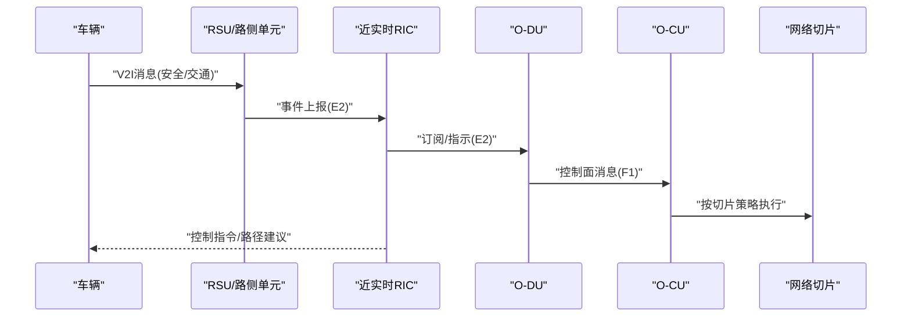
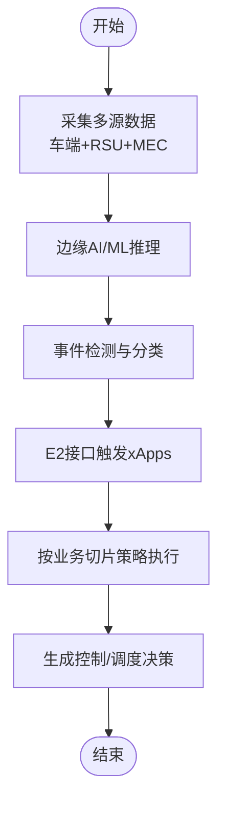
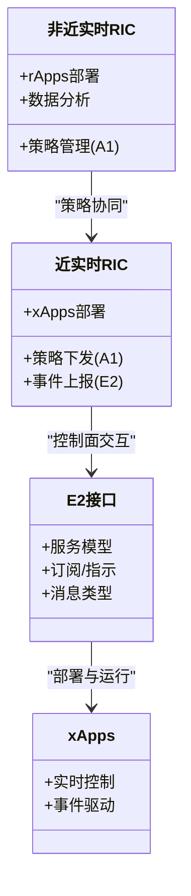
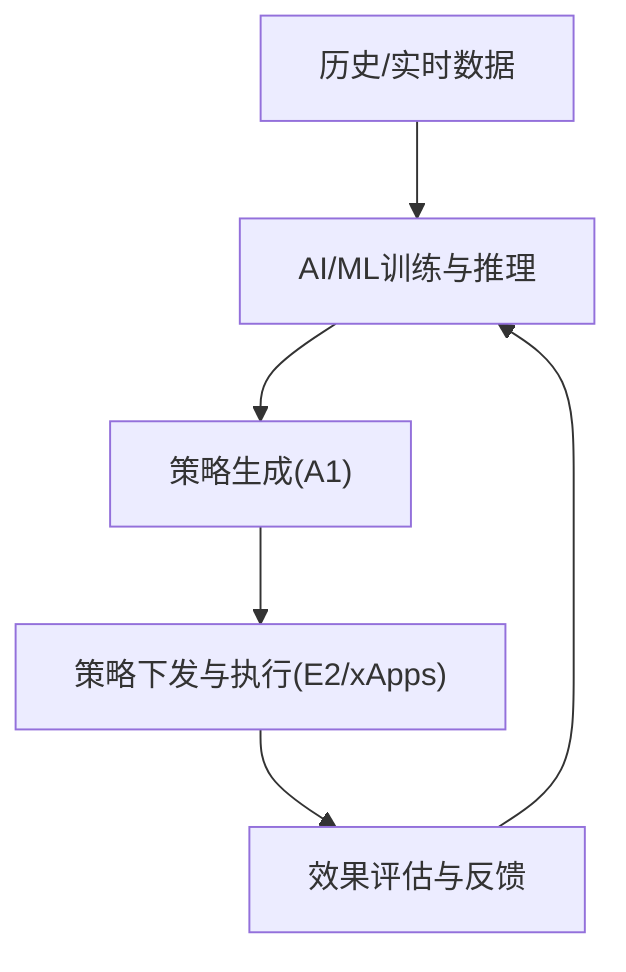
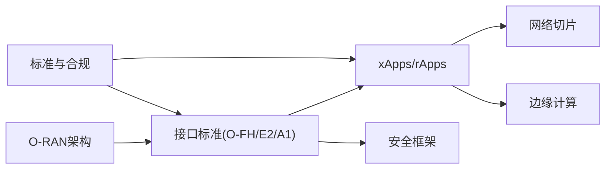

# 连接自动驾驶技术

<cite>
**本文引用的文件**
- [O-RAN专家知识库总览](file://README.md)
- [应用案例：O-RAN应用](file://10-application-scenarios/readme.md)
- [O-RAN架构基础](file://01-architecture-system/readme.md)
- [RIC高级技术](file://07-ric-development/readme.md)
- [接口标准：E2接口](file://03-interface-standards/e2-interface.md)
- [接口标准：O-FH接口](file://03-interface-standards/o-fh-interface.md)
- [标准合规：O-RAN标准与规范](file://09-standards-compliance/readme.md)
- [行业解决方案：交通运输](file://16-industry-solutions/transportation/o-ran-transportation-solutions.md)
</cite>

## 目录
1. [引言](#引言)
2. [项目结构](#项目结构)
3. [核心组件](#核心组件)
4. [架构总览](#架构总览)
5. [详细组件分析](#详细组件分析)
6. [依赖关系分析](#依赖关系分析)
7. [性能考虑](#性能考虑)
8. [故障排查指南](#故障排查指南)
9. [结论](#结论)
10. [附录](#附录)

## 引言
本文件面向连接自动驾驶技术的专业读者，系统梳理O-RAN在自动驾驶领域的应用前景与技术路径，重点覆盖V2X通信优化、实时路况感知、协同驾驶支持、交通流优化与应急响应等核心能力；并针对自动驾驶对通信网络提出的超低时延、高可靠与大规模连接等特殊要求，给出标准解读、网络切片、边缘计算与安全防护等工程化方案。同时，结合测试验证、产业生态与商业化路径，形成可落地的实施蓝图。

## 项目结构
该知识库围绕O-RAN架构、核心网元、接口标准、RIC与AI/ML、标准与合规、应用案例、部署与运维等维度组织内容，为自动驾驶场景提供系统化支撑。

```mermaid
graph TB
A["O-RAN专家知识库总览"] --> B["应用案例：O-RAN应用"]
A --> C["O-RAN架构基础"]
A --> D["接口标准：E2接口"]
A --> E["接口标准：O-FH接口"]
A --> F["标准合规：O-RAN标准与规范"]
A --> G["行业解决方案：交通运输"]
A --> H["RIC高级技术"]
B --> B1["5G服务与场景<br/>eMBB/URLLC/mMTC/网络切片/载波聚合"]
B --> B2["边缘计算与MEC<br/>边缘智能/内容分发/工业网关/业务连续性"]
B --> B3["工业互联网<br/>私有网络/确定性网络/OT系统融合/安全隔离"]
B --> B4["车联网与自动驾驶<br/>V2X/低时延/高可靠/覆盖与容量/自动驾驶支持"]
B --> B5["智慧城市与医疗<br/>城市级部署/应急通信/能源管理/远程医疗"]
C --> C1["架构演进/分层架构/功能分布/O-Cloud/弹性伸缩"]
C --> C2["核心网元：O-RU/O-DU/O-CU/CU-CP/CU-UP/O-RIC/SMO/O-CUCP/O-CUUP"]
C --> C3["接口体系：F1/O-FH/E2/A1/O1/O2/OAM"]
C --> C4["解耦选项：功能拆分/前传拆分/部署场景/性能与成本影响"]
C --> C5["联盟工作组：WG1-WG8"]
D --> D1["E2接口：SCTP/STREAMS服务化接口<br/>服务模型/消息类型/部署与优化/运维"]
E --> E1["O-FH接口：eCPRI/RoE<br/>用户/控制/同步平面/协议栈/流程/部署与运维"]
F --> F1["O-RAN联盟规范/ETSI/3GPP标准<br/>合规与认证/多厂商互操作/最佳实践"]
G --> G1["交通运输O-RAN解决方案<br/>V2X/低时延/高可靠/自动驾驶支持/基础设施部署/市场机会"]
H --> H1["RIC架构/近实时与非近实时/策略管理/应用开发(xApps/rApps)/AI/ML/能耗优化/安全"]
```



**图表来源**
- [O-RAN专家知识库总览](file://README.md#L1-L472)
- [应用案例：O-RAN应用](file://10-application-scenarios/readme.md#L1-L470)
- [O-RAN架构基础](file://01-architecture-system/readme.md#L1-L161)
- [接口标准：E2接口](file://03-interface-standards/e2-interface.md#L1-L337)
- [接口标准：O-FH接口](file://03-interface-standards/o-fh-interface.md#L1-L397)
- [标准合规：O-RAN标准与规范](file://09-standards-compliance/readme.md#L1-L371)
- [行业解决方案：交通运输](file://16-industry-solutions/transportation/o-ran-transportation-solutions.md#L1-L211)

**章节来源**
- [O-RAN专家知识库总览](file://README.md#L1-L472)
- [应用案例：O-RAN应用](file://10-application-scenarios/readme.md#L1-L470)

## 核心组件
- O-RAN参考架构与分层：服务层、控制层、管理层，O-Cloud基础设施，弹性伸缩能力。
- 核心网元：O-RU（射频处理）、O-DU（部分MAC/物理层）、O-CU（CU-CP/控制面、CU-UP/用户面）、O-RIC（近实时/非近实时控制器）、SMO（服务管理与编排）、O-CUCP/O-CUUP（跨厂商协调）。
- 接口体系：F1（CU-DU）、O-FH（前传，eCPRI/RoE）、E2（RIC与CU/DU）、A1（策略管理）、O1/O2/OAM（管理与编排）。
- RIC与AI/ML：近实时闭环控制（xApps）、非近实时策略下发（rApps）、异常检测、预测维护、自动优化、能耗优化、安全框架。
- 标准与合规：O-RAN联盟规范、ETSI标准、3GPP标准，多厂商互操作与认证流程。
- 应用场景：eMBB/URLLC/mMTC、MEC、工业互联网、车联网与自动驾驶、智慧城市与医疗。

**章节来源**
- [O-RAN架构基础](file://01-architecture-system/readme.md#L8-L59)
- [RIC高级技术](file://07-ric-development/readme.md#L1-L368)
- [标准合规：O-RAN标准与规范](file://09-standards-compliance/readme.md#L8-L135)
- [应用案例：O-RAN应用](file://10-application-scenarios/readme.md#L8-L117)

## 架构总览
自动驾驶对通信网络提出“超低时延、高可靠、大规模连接”三大要求。O-RAN通过：
- 边缘计算与MEC就近处理，缩短空口与核心网路径；
- 网络切片隔离关键业务（如安全切片），保障URLLC时延与可靠性；
- RIC近实时闭环控制与xApps/rApps实现动态资源调度与策略下发；
- O-FH前传接口承载高带宽、低抖动的数字基带数据，配合PTP/SyncE实现高精度同步；
- E2接口实现RIC与CU/DU的低延迟服务化通信，支撑毫秒级控制闭环。

```mermaid
graph TB
subgraph "车端"
V["车载终端/传感器"]
end
subgraph "接入与前传"
ODU["O-DU 数字基带处理"]
ORU["O-RU 射频前端"]
OFH["O-FH 前传(eCPRI/RoE)"]
end
subgraph "核心网与编排"
OCU["O-CU(CU-CP/CU-UP)"]
RIC["O-RIC(近实时/非近实时)"]
SMO["SMO 服务编排"]
end
subgraph "边缘与应用"
MEC["MEC 边缘节点"]
XAPP["xApps(rApps) 应用"]
ALGO["AI/ML 算法引擎"]
end
V --> ORU
ORU --> ODU
ODU --> OFH
OFH --> OCU
OCU <- --> RIC
RIC <- --> XAPP
XAPP --> MEC
MEC --> ALGO
SMO --> OCU
SMO --> RIC
```

**图表来源**
- [O-RAN架构基础](file://01-architecture-system/readme.md#L15-L26)
- [接口标准：O-FH接口](file://03-interface-standards/o-fh-interface.md#L61-L97)
- [接口标准：E2接口](file://03-interface-standards/e2-interface.md#L65-L73)
- [RIC高级技术](file://07-ric-development/readme.md#L8-L33)
- [应用案例：O-RAN应用](file://10-application-scenarios/readme.md#L118-L153)

## 详细组件分析

### V2X通信优化技术
- 通信模型：V2V/V2I/V2P/V2N，PC5直连与Uu蜂窝结合，消息类型覆盖安全、交通与服务信息。
- 时延与可靠：URLLC目标<1ms端到端，近实时闭环（近RT RIC）通过E2接口实现毫秒级控制面交互。
- 覆盖与容量：RSU部署密度与选址优化，支持高并发连接与抗干扰；mMTC支撑海量物联设备。
- 策略与切片：基于A1接口策略管理，为安全、娱乐、遥测、应急等业务划分网络切片，隔离资源与SLA。



**图表来源**
- [应用案例：O-RAN应用](file://10-application-scenarios/readme.md#L118-L153)
- [接口标准：E2接口](file://03-interface-standards/e2-interface.md#L79-L89)
- [标准合规：O-RAN标准与规范](file://09-standards-compliance/readme.md#L53-L76)

**章节来源**
- [应用案例：O-RAN应用](file://10-application-scenarios/readme.md#L118-L153)
- [标准合规：O-RAN标准与规范](file://09-standards-compliance/readme.md#L53-L76)

### 实时路况感知系统
- 数据来源：车端传感器（LiDAR/雷达/相机）与路侧RSU/MEC汇聚，结合边缘AI进行实时分析。
- 低时延处理：MEC就近部署，结合E2接口与xApps实现事件驱动的快速决策。
- 资源调度：基于A1策略与SMO编排，动态调整带宽、优先级与缓存策略，保障关键消息优先。



**图表来源**
- [应用案例：O-RAN应用](file://10-application-scenarios/readme.md#L45-L80)
- [接口标准：E2接口](file://03-interface-standards/e2-interface.md#L131-L147)
- [标准合规：O-RAN标准与规范](file://09-standards-compliance/readme.md#L110-L135)

**章节来源**
- [应用案例：O-RAN应用](file://10-application-scenarios/readme.md#L45-L80)
- [接口标准：E2接口](file://03-interface-standards/e2-interface.md#L131-L147)

### 协同驾驶支持机制
- 近实时闭环：近RT RIC通过E2接口与xApps实现毫秒级控制，保障紧急制动、自动变道等安全场景。
- 冗余与容错：多路径/多连接/多频段设计，故障快速检测与自动切换，自愈机制保障高可用。
- 跨厂商互操作：遵循O-RAN联盟与ETSI/3GPP标准，Plugfest互操作验证，确保跨域一致性。



**图表来源**
- [RIC高级技术](file://07-ric-development/readme.md#L8-L33)
- [接口标准：E2接口](file://03-interface-standards/e2-interface.md#L49-L62)

**章节来源**
- [RIC高级技术](file://07-ric-development/readme.md#L8-L33)
- [接口标准：E2接口](file://03-interface-standards/e2-interface.md#L49-L62)

### 交通流优化算法
- 机器学习与预测：基于历史与实时数据，训练拥堵预测、信号配时优化、路径推荐模型。
- 自动优化：闭环策略（rApps/xApps）结合A1/E2接口，动态调整信号、限速与引导策略。
- 能耗与绿色：智能休眠、动态功率控制与可再生能源集成，降低整体能耗。



**图表来源**
- [RIC高级技术](file://07-ric-development/readme.md#L99-L170)
- [标准合规：O-RAN标准与规范](file://09-standards-compliance/readme.md#L175-L192)

**章节来源**
- [RIC高级技术](file://07-ric-development/readme.md#L99-L170)
- [标准合规：O-RAN标准与规范](file://09-standards-compliance/readme.md#L175-L192)

### 应急响应系统
- 切片优先：应急切片预留带宽与优先级，保障救护车/消防车优先通行与远程指导。
- 快速恢复：多路径/多源同步，故障自动切换与快速恢复；临时站点与无人机基站快速部署。
- 跨部门协同：统一平台对接交通、公安、医疗等系统，实现联动指挥。

**章节来源**
- [应用案例：O-RAN应用](file://10-application-scenarios/readme.md#L155-L184)
- [标准合规：O-RAN标准与规范](file://09-standards-compliance/readme.md#L110-L135)

### 自动驾驶对通信网络的特殊要求
- 超低时延：<1ms端到端，近实时闭环控制，边缘与前传优化。
- 高可靠性：99.999%~99.9999%可用性，冗余与自愈。
- 大规模连接：支持每平方公里百万级设备接入与差异化QoS。

**章节来源**
- [应用案例：O-RAN应用](file://10-application-scenarios/read readme.md#L16-L29)
- [应用案例：O-RAN应用](file://10-application-scenarios/readme.md#L126-L139)

### V2X通信标准解读
- O-RAN与3GPP：基于3GPP NG-RAN与RAN智能控制器（RIC）能力，O-RAN扩展接口开放与智能化。
- ETSI标准：A1接口（REST/JSON/HTTPS）、O-FH（eCPRI/RoE）与FRIT（前传传输配置）。
- 多厂商互操作：Plugfest与一致性测试，确保跨厂商互通。

**章节来源**
- [标准合规：O-RAN标准与规范](file://09-standards-compliance/readme.md#L78-L108)
- [标准合规：O-RAN标准与规范](file://09-standards-compliance/readme.md#L46-L77)
- [标准合规：O-RAN标准与规范](file://09-standards-compliance/readme.md#L136-L161)

### 网络切片应用
- 切片类型：eMBB、URLLC、mMTC；针对自动驾驶的“安全切片”“遥测切片”“娱乐切片”。
- 编排与隔离：SMO负责生命周期管理，逻辑/物理隔离保障性能与安全。
- 策略与执行：A1策略下发至近实时RIC，E2接口承载控制面交互。

**章节来源**
- [应用案例：O-RAN应用](file://10-application-scenarios/readme.md#L30-L43)
- [标准合规：O-RAN标准与规范](file://09-standards-compliance/readme.md#L110-L135)

### 边缘计算部署
- MEC与O-DU/O-CU共址部署，降低空口与核心网时延。
- E2接口与MEC服务发现协同，实现边缘智能应用的动态资源调度。
- 缓存与预取策略，减少回传压力，提升用户体验。

**章节来源**
- [应用案例：O-RAN应用](file://10-application-scenarios/readme.md#L45-L80)
- [接口标准：E2接口](file://03-interface-standards/e2-interface.md#L49-L62)

### 网络安全与隐私
- 零信任与微分段、身份与访问管理、密钥管理、API网关与mTLS。
- AI驱动威胁检测与自动化响应，安全监控与审计。
- 端到端加密与合规检查，满足行业监管要求。

**章节来源**
- [RIC高级技术](file://07-ric-development/readme.md#L171-L196)
- [标准合规：O-RAN标准与规范](file://09-standards-compliance/readme.md#L33-L44)

## 依赖关系分析
- 架构依赖：O-RAN参考架构决定各网元职责与接口边界；O-Cloud提供弹性与自动化能力。
- 接口依赖：O-FH承载高带宽、低抖动的数字基带数据；E2实现近实时控制面交互；A1负责策略管理。
- 标准依赖：O-RAN联盟规范、ETSI与3GPP标准共同构成合规与互操作基础。
- 应用依赖：xApps/rApps依赖E2/A1接口与AI/ML能力；MEC依赖边缘资源与编排。



**图表来源**
- [O-RAN架构基础](file://01-architecture-system/readme.md#L27-L34)
- [接口标准：E2接口](file://03-interface-standards/e2-interface.md#L33-L48)
- [接口标准：O-FH接口](file://03-interface-standards/o-fh-interface.md#L61-L81)
- [标准合规：O-RAN标准与规范](file://09-standards-compliance/readme.md#L8-L45)

**章节来源**
- [O-RAN架构基础](file://01-architecture-system/readme.md#L27-L34)
- [接口标准：E2接口](file://03-interface-standards/e2-interface.md#L33-L48)
- [接口标准：O-FH接口](file://03-interface-standards/o-fh-interface.md#L61-L81)
- [标准合规：O-RAN标准与规范](file://09-standards-compliance/readme.md#L8-L45)

## 性能考虑
- 时延优化：边缘前置、优先调度、资源预留、空口参数优化；O-FH采用低延迟以太网与PTP/SyncE同步。
- 可靠性保障：多路径/多连接/多频段冗余，快速故障检测与自动切换，自愈机制。
- 资源利用：切片隔离与差异化QoS，AI预测性容量规划，动态资源调度。
- 安全与合规：零信任、端到端加密、审计与合规检查，满足行业监管。

**章节来源**
- [应用案例：O-RAN应用](file://10-application-scenarios/readme.md#L126-L153)
- [接口标准：O-FH接口](file://03-interface-standards/o-fh-interface.md#L117-L178)
- [接口标准：E2接口](file://03-interface-standards/e2-interface.md#L131-L147)
- [标准合规：O-RAN标准与规范](file://09-standards-compliance/readme.md#L175-L192)

## 故障排查指南
- E2接口：连接状态、消息吞吐、延迟与错误率监控；告警分级与关联分析；信令与日志分析定位；批量处理与缓存优化。
- O-FH接口：带宽利用率、延迟、误码率与RU状态监控；同步精度测试与源冗余验证；传输路径与链路聚合检查。
- 策略与切片：A1策略下发与冲突检测；SMO编排与资源回收；跨域互操作问题定位与修复。
- 安全事件：访问控制与认证审计、加密与完整性校验、威胁情报与自动化处置。

**章节来源**
- [接口标准：E2接口](file://03-interface-standards/e2-interface.md#L148-L201)
- [接口标准：O-FH接口](file://03-interface-standards/o-fh-interface.md#L199-L266)
- [标准合规：O-RAN标准与规范](file://09-standards-compliance/readme.md#L110-L161)

## 结论
O-RAN为自动驾驶提供开放、智能、可编排的通信底座：以E2接口实现近实时闭环控制，以O-FH保障高带宽与高精度同步，以网络切片与SMO实现差异化服务与资源隔离，以xApps/rApps与AI/ML实现动态优化与智能运维。结合标准合规与安全框架，可支撑从城市级智能交通到车路协同的规模化商用落地。

## 附录
- 交通运输O-RAN解决方案：V2X、低时延、高可靠、自动驾驶支持、基础设施部署与市场机会。
- 学习路径与最佳实践：基于知识库的阶段性学习与实验室项目，覆盖架构、接口、RIC、标准与应用。

**章节来源**
- [行业解决方案：交通运输](file://16-industry-solutions/transportation/o-ran-transportation-solutions.md#L1-L211)
- [O-RAN专家知识库总览](file://README.md#L323-L387)