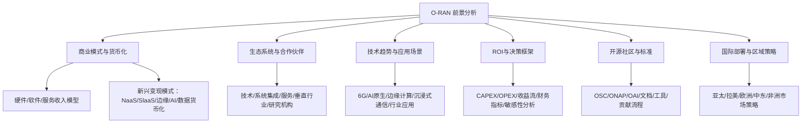
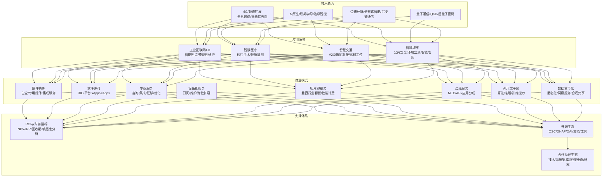
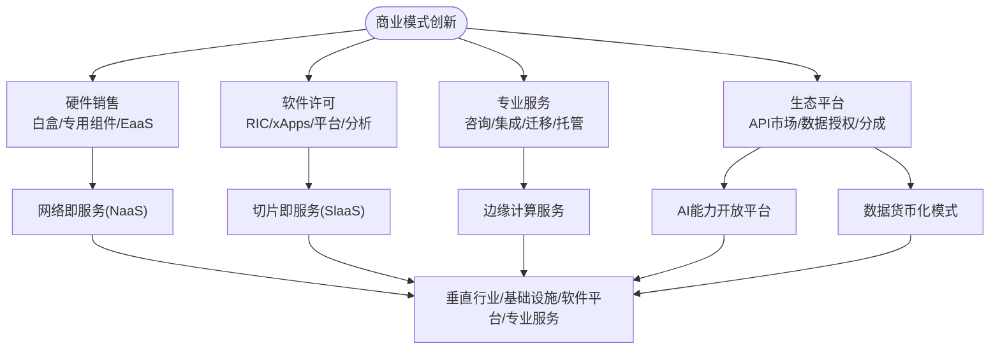
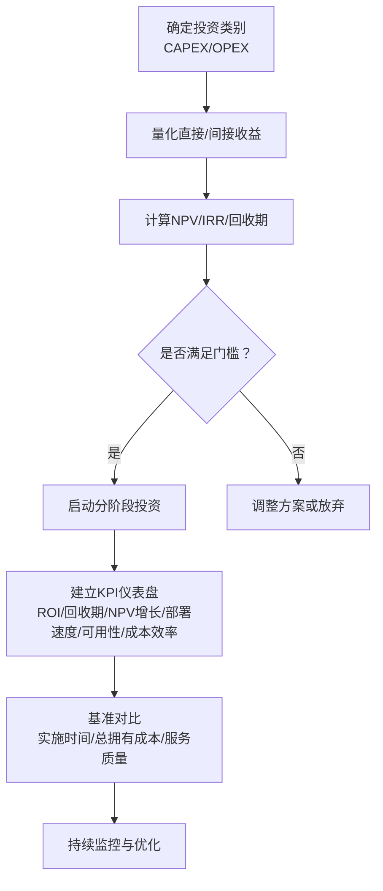
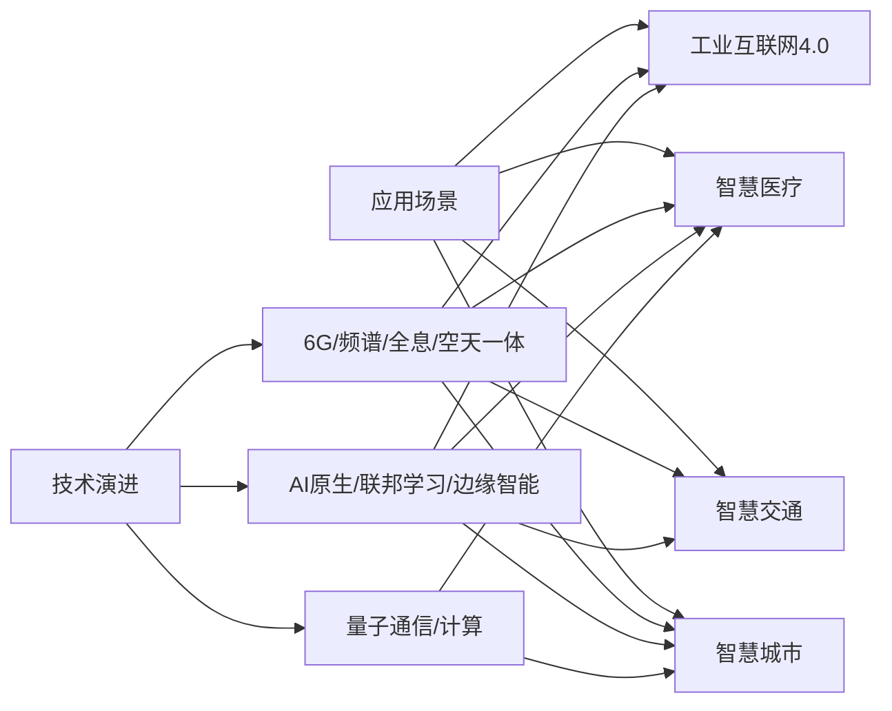
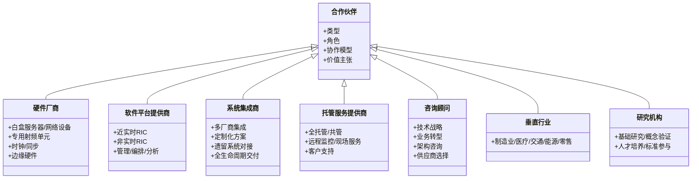
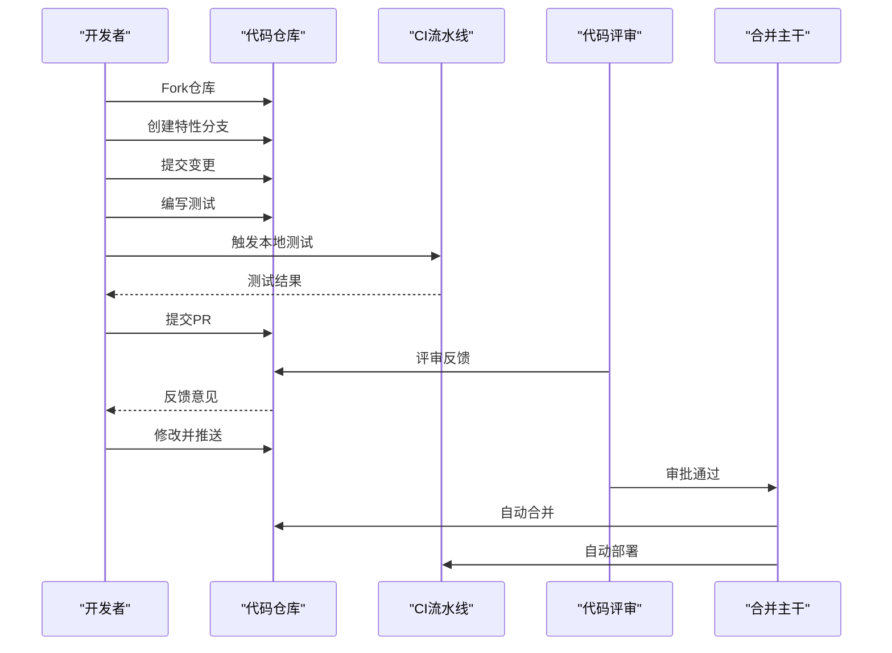
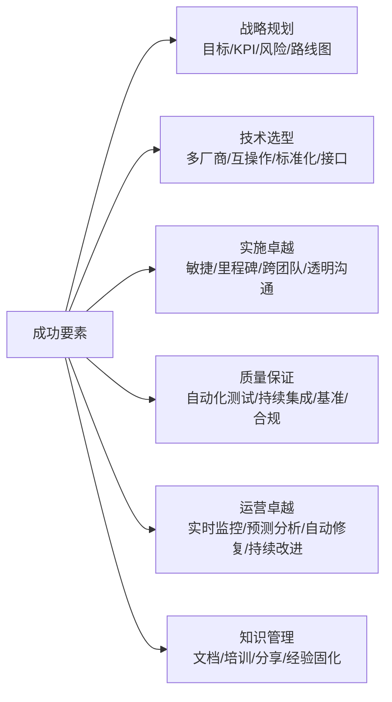
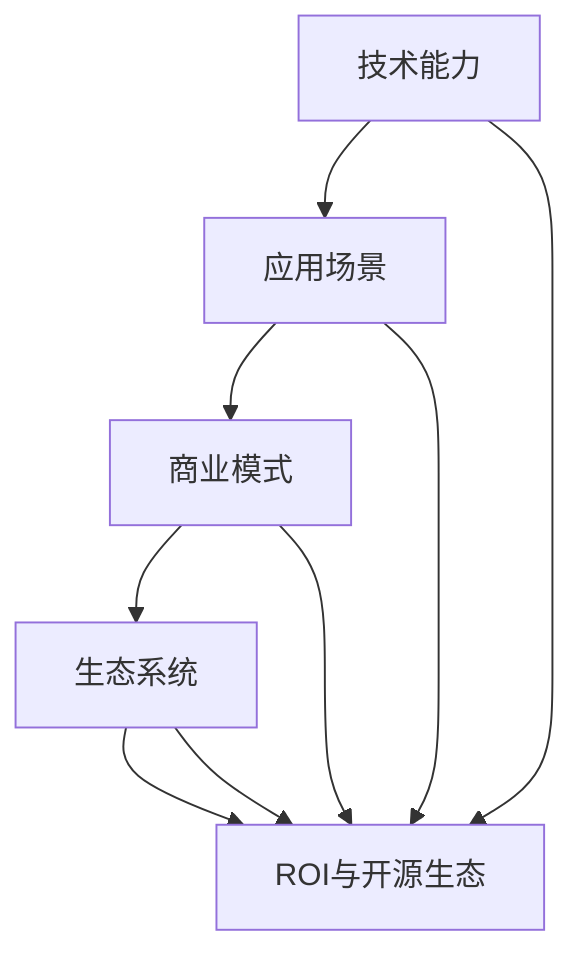

# 市场前景分析

<cite>
**本文引用的文件**
- [O-RAN 商业模式与货币化策略](file://20-ecosystem-partnership/business-models/o-ran-business-models.md)
- [O-RAN 生态系统战略框架](file://20-ecosystem-partnership/ecosystem-strategy/o-ran-ecosystem-strategy.md)
- [O-RAN 投资回报分析框架](file://18-cost-benefit-analysis/roi-analysis/o-ran-roi-analysis.md)
- [O-RAN 未来应用与新兴路线图](file://15-future-development/emerging-applications/emerging-applications-roadmap.md)
- [O-RAN 最佳实践案例集](file://21-case-studies/best-practices/o-ran-best-practice-cases.md)
- [O-RAN 开源社区资源指南](file://17-open-source-ecosystem/community-resources/open-source-community-guide.md)
- [O-RAN 技术发展趋势分析](file://15-future-development/technology-trends/technology-evolution-roadmap.md)
- [O-RAN 医疗健康解决方案](file://16-industry-solutions/healthcare/o-ran-healthcare-solutions.md)
- [O-RAN 合作伙伴类型与协作模型](file://20-ecosystem-partnership/partner-types/o-ran-partner-classification.md)
- [O-RAN 未来发展前景概览](file://15-future-development/readme.md)
- [O-RAN 长期发展战略](file://24-sustainable-development/long-term-planning/o-ran-long-term-strategy.md)
- [O-RAN 国际部署策略](file://23-international-deployment/regional-strategies/o-ran-regional-deployment-strategies.md)
</cite>

## 目录
1. [引言](#引言)
2. [项目结构](#项目结构)
3. [核心组件](#核心组件)
4. [架构总览](#架构总览)
5. [详细组件分析](#详细组件分析)
6. [依赖关系分析](#依赖关系分析)
7. [性能考量](#性能考量)
8. [故障排查指南](#故障排查指南)
9. [结论](#结论)
10. [附录](#附录)

## 引言
本文件面向O-RAN（开放无线接入网）市场前景，聚焦商业模式创新趋势、投资机会识别、竞争格局演变以及技术商业化进程中的机遇与挑战。通过对O-RAN生态系统的业务模型、合作伙伴分类、开源社区、典型应用与ROI评估进行系统梳理，为企业制定O-RAN相关战略提供可操作的洞察与建议。

## 项目结构
该仓库围绕O-RAN的架构、组件、接口标准、解耦选项、云化集成、工作组职责、RIC开发、部署实施、标准合规、应用场景、学术论文、入门资料、安全隐私、测试验证、运维管理、未来规划、行业解决方案、开源生态、成本效益分析、人才发展、生态合作、案例研究、工具平台、国际部署、可持续发展、法律法规、性能优化、故障诊断、监控告警、安全威胁、最佳实践等维度形成完整知识体系。

**图表来源**
- [O-RAN 商业模式与货币化策略](file://20-ecosystem-partnership/business-models/o-ran-business-models.md#L1-L299)
- [O-RAN 生态系统战略框架](file://20-ecosystem-partnership/ecosystem-strategy/o-ran-ecosystem-strategy.md#L1-L189)
- [O-RAN 未来应用与新兴路线图](file://15-future-development/emerging-applications/emerging-applications-roadmap.md#L1-L879)
- [O-RAN 投资回报分析框架](file://18-cost-benefit-analysis/roi-analysis/o-ran-roi-analysis.md#L1-L181)
- [O-RAN 开源社区资源指南](file://17-open-source-ecosystem/community-resources/open-source-community-guide.md#L1-L494)
- [O-RAN 国际部署策略](file://23-international-deployment/regional-strategies/o-ran-regional-deployment-strategies.md#L288-L327)

**章节来源**
- [O-RAN 未来发展前景概览](file://15-future-development/readme.md#L114-L151)

## 核心组件
- 商业模式与货币化：覆盖硬件销售、软件许可、专业服务、设备即服务、网络切片即服务、边缘计算服务、AI能力开放平台、数据货币化等多元收入来源与定价策略。
- 生态系统与合作伙伴：明确硬件厂商、软件平台提供商、系统集成商、托管服务商、咨询顾问、垂直行业解决方案、研究机构等角色与协作模型。
- 技术趋势与应用场景：从5G到6G演进、AI原生架构、量子通信、工业互联网、智慧城市、联网自动驾驶、医疗健康等场景。
- ROI与决策框架：提供CAPELLA/OPEX构成、直接/间接收益、NPV/IRR/回收期、敏感性分析、风险评估与分阶段投资建议。
- 开源社区与标准：O-RAN软件社区（OSC）、ONAP、OpenAirInterface（OAI）等项目与文档、开发环境、贡献流程、培训认证、测试床与沙盒。
- 国际部署与区域策略：重点区域市场特征、运营商与本土厂商、政策与标准参与、生态整合路径。

**章节来源**
- [O-RAN 商业模式与货币化策略](file://20-ecosystem-partnership/business-models/o-ran-business-models.md#L54-L299)
- [O-RAN 生态系统战略框架](file://20-ecosystem-partnership/ecosystem-strategy/o-ran-ecosystem-strategy.md#L6-L189)
- [O-RAN 未来应用与新兴路线图](file://15-future-development/emerging-applications/emerging-applications-roadmap.md#L1-L879)
- [O-RAN 投资回报分析框架](file://18-cost-benefit-analysis/roi-analysis/o-ran-roi-analysis.md#L1-L181)
- [O-RAN 开源社区资源指南](file://17-open-source-ecosystem/community-resources/open-source-community-guide.md#L1-L494)
- [O-RAN 国际部署策略](file://23-international-deployment/regional-strategies/o-ran-regional-deployment-strategies.md#L288-L327)

## 架构总览
下图展示O-RAN商业生态的关键要素及其交互关系：从技术能力（6G/AI/量子/边缘）到应用场景（工业/健康/交通/城市），再到商业模式（硬件/软件/服务/平台），最终通过ROI与开源生态支撑落地与规模化。

**图表来源**
- [O-RAN 商业模式与货币化策略](file://20-ecosystem-partnership/business-models/o-ran-business-models.md#L54-L299)
- [O-RAN 未来应用与新兴路线图](file://15-future-development/emerging-applications/emerging-applications-roadmap.md#L1-L879)
- [O-RAN 投资回报分析框架](file://18-cost-benefit-analysis/roi-analysis/o-ran-roi-analysis.md#L1-L181)
- [O-RAN 开源社区资源指南](file://17-open-source-ecosystem/community-resources/open-source-community-guide.md#L1-L494)

## 详细组件分析

### 商业模式与货币化策略
- 传统RAN局限：专有硬件锁定、重资本投入、线性收入流，限制竞争与创新灵活性。
- O-RAN优势：开放标准架构、多厂商互操作、灵活部署、多样化收入来源（硬件+软件+服务+平台生态）。
- 收入模型：
  - 硬件：白盒基础设施销售、设备即服务（EaaS）订阅。
  - 软件：RIC平台许可、xApps/rApps销售、平台与市场分成、分析服务。
  - 服务：咨询/集成/迁移/托管运营、培训与支持。
  - 平台生态：API市场、数据授权、合作伙伴分成。
- 新兴变现：
  - 网络切片即服务（SlaaS）：垂直行业套餐、动态资源池、性能计费、结果导向定价。
  - 边缘计算服务（MEC）：计算/存储/网络函数/开发者API，多方分成。
  - AI能力开放平台：推理/训练/算法即服务，按需计费。
  - 数据货币化：匿名化网络数据、洞察报告、合规共享。

**图表来源**
- [O-RAN 商业模式与货币化策略](file://20-ecosystem-partnership/business-models/o-ran-business-models.md#L56-L299)

**章节来源**
- [O-RAN 商业模式与货币化策略](file://20-ecosystem-partnership/business-models/o-ran-business-models.md#L6-L52)
- [O-RAN 商业模式与货币化策略](file://20-ecosystem-partnership/business-models/o-ran-business-models.md#L139-L299)

### 投资回报与财务决策框架
- 投资构成：硬件基础设施、软件许可、集成服务、培训认证、基础设施改造。
- 运营费用：人力、软件维护、硬件维护、能耗、管理工具。
- 直接收益：硬件成本节约、运营效率提升、快速部署带来收入、灵活性价值。
- 财务指标：NPV、IRR、回收期；敏感性矩阵（CAPEX/OPEX/收入变化影响）；蒙特卡洛模拟。
- 风险评估：技术风险、市场风险、实施风险、监管风险；缓解策略（试点、供应商评估、分阶段、合规跟踪）。
- 决策建议：分阶段投资（试点—扩展—全量）、合作伙伴选择（技术/服务/研究/联盟）。

**图表来源**
- [O-RAN 投资回报分析框架](file://18-cost-benefit-analysis/roi-analysis/o-ran-roi-analysis.md#L6-L181)

**章节来源**
- [O-RAN 投资回报分析框架](file://18-cost-benefit-analysis/roi-analysis/o-ran-roi-analysis.md#L8-L181)

### 技术趋势与应用场景
- 从5G到6G：Release 18/19/20及2027+的演进路线、太赫兹通信、全息通信、智能超表面、空天地一体化、语义通信。
- AI原生架构：自主网络管理、智能资源调度、预测性维护、自适应优化；融合联邦学习、边缘智能、强化学习、数字孪生。
- 量子通信：QKD、量子安全认证、后量子密码迁移、量子安全传输；量子计算在优化、资源分配、信号处理、机器学习中的应用。
- 边缘计算：分布式智能、认知边缘网络、沉浸式通信（空间音频/全息显示/触觉反馈/情境感知优化）。
- 行业应用：工业互联网4.0（智能制造/工业物联网/预测性维护/数字孪生工厂）、智慧医疗（远程手术/患者监测/紧急响应/健康数据）、智慧交通（V2X/协同驾驶/高精定位/实时决策）、智慧城市（公共安全/环境监测/智能电网/城市管理）。

**图表来源**
- [O-RAN 技术发展趋势分析](file://15-future-development/technology-trends/technology-evolution-roadmap.md#L1-L68)
- [O-RAN 未来应用与新兴路线图](file://15-future-development/emerging-applications/emerging-applications-roadmap.md#L1-L879)
- [O-RAN 医疗健康解决方案](file://16-industry-solutions/healthcare/o-ran-healthcare-solutions.md#L1-L484)

**章节来源**
- [O-RAN 技术发展趋势分析](file://15-future-development/technology-trends/technology-evolution-roadmap.md#L6-L68)
- [O-RAN 未来应用与新兴路线图](file://15-future-development/emerging-applications/emerging-applications-roadmap.md#L6-L879)
- [O-RAN 医疗健康解决方案](file://16-industry-solutions/healthcare/o-ran-healthcare-solutions.md#L6-L484)

### 生态系统与合作伙伴
- 合作伙伴类型与协作模型：
  - 技术解决方案伙伴：硬件厂商（白盒/专用/时钟同步/边缘硬件）、软件平台提供商（RIC/管理/编排/分析）、系统集成商（多厂商集成/定制/遗留对接/全生命周期交付）。
  - 服务与解决方案伙伴：托管服务提供商（全托管/共管/远程监控/故障维修）、咨询与顾问（技术战略/业务转型/架构/供应商选择）。
  - 垂直行业与研究机构：垂直解决方案（制造/医疗/交通/能源/零售）、研究与学术（基础研究/概念验证/人才培养/标准制定）。
- 成功要素：战略与运营对齐、治理结构（领导委员会/工作组/定期评审/升级程序）、沟通机制（高层简报/技术评审/项目周报/临时协作）、绩效度量（财务/运营/战略指标）。

**图表来源**
- [O-RAN 合作伙伴类型与协作模型](file://20-ecosystem-partnership/partner-types/o-ran-partner-classification.md#L6-L218)

**章节来源**
- [O-RAN 合作伙伴类型与协作模型](file://20-ecosystem-partnership/partner-types/o-ran-partner-classification.md#L6-L218)

### 开源社区与标准
- 主要社区与项目：O-RAN软件社区（OSC）、ONAP（网络自动化）、OpenAirInterface（OAI）。
- 文档与规范：O-RAN WG系列规范、OSC文档结构、安装/配置/故障排查指南。
- 开发环境与工具：系统要求、Docker环境、仓库克隆、开发工具安装、CI/CD流程。
- 贡献流程：分支/提交/测试/代码审查/合并/部署。
- 训练与认证：O-RAN Academy课程、外部在线平台、虚拟/物理测试床、云沙盒。
- 社区活动：Plugfests、Summit、工作组会议、Slack/Zoom协作。

**图表来源**
- [O-RAN 开源社区资源指南](file://17-open-source-ecosystem/community-resources/open-source-community-guide.md#L266-L313)

**章节来源**
- [O-RAN 开源社区资源指南](file://17-open-source-ecosystem/community-resources/open-source-community-guide.md#L1-L494)

### 典型应用与最佳实践
- 德国电信：分阶段部署（试点—区域—全国）、多厂商集成、自动化测试、性能监控，实现更快部署、更低运营成本、更高能效与可用性。
- 拉科伦特移动：端到端云原生网络、零接触配置、容器化/微服务/DevOps、AI驱动优化、边缘协调、弹性伸缩。
- Verizion：O-RAN+MEC企业级应用（制造/医疗/零售/交通），实现低时延、带宽效率提升、可靠性保障、传输成本降低。
- Vodafone农村覆盖：共享基础设施、简化硬件、集中管理、可再生能源、数字包容、经济与农业/医疗影响显著。

**图表来源**
- [O-RAN 最佳实践案例集](file://21-case-studies/best-practices/o-ran-best-practice-cases.md#L130-L177)

**章节来源**
- [O-RAN 最佳实践案例集](file://21-case-studies/best-practices/o-ran-best-practice-cases.md#L6-L210)

### 国际部署与区域策略
- 亚太市场（中国主导）：全球最大电信市场、政府驱动、标准影响力、垂直产业合作、智慧城市、工业互联网、数字化转型加速。
- 拉丁美洲：新兴市场潜力、基础设施建设、区域一体化、运营商合作。
- 欧洲：成熟市场、监管环境、绿色转型、5G优先、产业数字化。
- 中东/非洲：资源驱动、数字鸿沟缩小、移动优先、跨境合作。

**章节来源**
- [O-RAN 国际部署策略](file://23-international-deployment/regional-strategies/o-ran-regional-deployment-strategies.md#L288-L327)

## 依赖关系分析
- 技术能力依赖：6G/AI/量子/边缘技术为应用场景提供基础；AI原生与边缘智能提升垂直行业效率与体验。
- 应用场景依赖：工业/医疗/交通/城市四大垂直对网络能力提出差异化需求，推动SlaaS/MEC/AI开放平台/数据货币化等商业模式落地。
- 商业模式依赖：硬件/软件/服务/平台生态相互促进，ROI与开源生态为规模化提供支撑。
- 生态系统依赖：合作伙伴类型互补，开源社区提供标准与工具，国际部署策略决定市场进入路径。

**图表来源**
- [O-RAN 商业模式与货币化策略](file://20-ecosystem-partnership/business-models/o-ran-business-models.md#L54-L299)
- [O-RAN 未来应用与新兴路线图](file://15-future-development/emerging-applications/emerging-applications-roadmap.md#L1-L879)
- [O-RAN 投资回报分析框架](file://18-cost-benefit-analysis/roi-analysis/o-ran-roi-analysis.md#L1-L181)
- [O-RAN 开源社区资源指南](file://17-open-source-ecosystem/community-resources/open-source-community-guide.md#L1-L494)

## 性能考量
- 技术性能：低时延（亚毫秒级）、高可靠（99.9%以上）、大规模连接、能效优化、弹性伸缩。
- 运维性能：自动化测试与CI/CD、实时监控与告警、预测性维护、自动修复、持续优化。
- 商业性能：ROI（NPV/IRR/回收期）、成本控制（CAPEX/OPEX）、收入增长（订阅/平台分成/数据服务）、客户满意度（NPS/SLA达成率）。
- 生态性能：合作伙伴数量与质量、标准参与度、专利产出、市场份额增长、品牌关联度。

[本节为通用性能讨论，无需特定文件引用]

## 故障排查指南
- 开源社区支持：邮件列表/论坛、Slack/Zoom会议、工作群组、问题模板与跟踪。
- 开发环境与工具：系统要求检查、Docker环境、仓库克隆、开发工具安装、本地测试运行。
- 贡献流程：分支命名、提交规范、测试覆盖率、代码风格检查、评审反馈处理、合并与部署。
- 培训与认证：在线课程、实践沙盒、测试床使用、证书获取。

**章节来源**
- [O-RAN 开源社区资源指南](file://17-open-source-ecosystem/community-resources/open-source-community-guide.md#L217-L494)

## 结论
O-RAN正推动无线网络从专有封闭走向开放生态，带来商业模式创新与市场机会。通过硬件/软件/服务/平台的多元化收入来源，结合SlaaS、MEC、AI开放平台、数据货币化等新兴形态，O-RAN有望在工业互联网、智慧医疗、智慧交通、智慧城市等领域实现规模化商用。依托ROI分析与开源生态，配合分阶段投资与合作伙伴协同，可有效控制风险、提升效率并加速市场扩张。国际部署方面，亚太市场具备主导地位，拉美、欧洲、中东/非洲各有侧重，应结合区域特点制定差异化策略。

[本节为总结性内容，无需特定文件引用]

## 附录
- 关键术语：NaaS（网络即服务）、SlaaS（切片即服务）、MEC（多接入边缘计算）、xApps/rApps（应用）、RIC（近实时/非实时智能控制器）、6G（第六代移动通信）、AI原生（内生智能）、量子通信（QKD/后量子密码）。
- 参考文件索引：见“本文引用的文件”。

[本节为补充说明，无需特定文件引用]