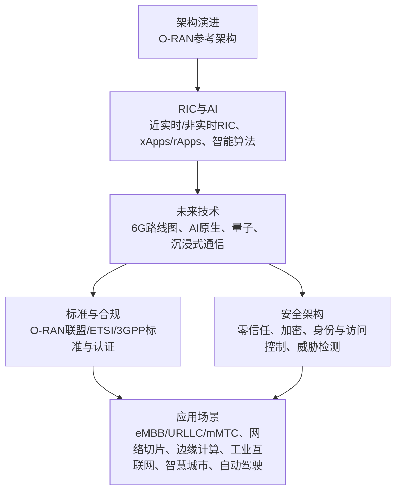
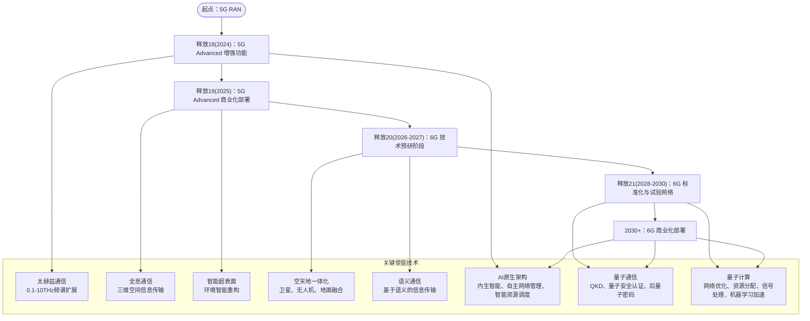
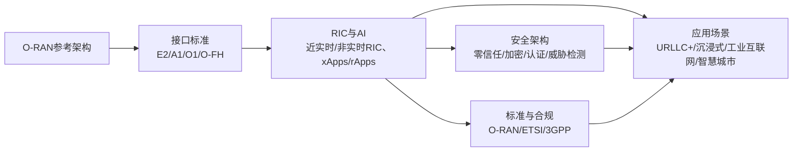

# 技术演进路线图

<cite>
**本文引用的文件**
- [O-RAN 技术演进路线图](file://15-future-development/technology-trends/technology-evolution-roadmap.md)
- [O-RAN Emerging Applications and Future Use Cases](file://15-future-development/emerging-applications/emerging-applications-roadmap.md)
- [O-RAN 架构系统概览](file://01-architecture-system/readme.md)
- [O-RAN 标准与规范](file://09-standards-compliance/readme.md)
- [O-RAN AI-RAN 融合](file://31-ai-ran-convergence/readme-zh.md)
- [O-RAN 安全架构参考](file://12-security-privacy/security-architecture/security-reference-architecture.md)
- [O-RAN 专家知识库总览](file://README.md)
- [NTT DoCoMo 6G研究网络案例](file://21-case-studies/innovation-cases/o-ran-innovation-cases.md)
- [O-RAN 专利汇总表](file://comprehensive-oran-patent-table.md)
- [O-RAN 应用场景概览](file://10-application-scenarios/readme.md)
</cite>

## 更新摘要
**所做更改**
- 扩展了2024-2030+详细技术演进路线图，从原有的67行增加到476行
- 新增5G-Advanced和6G发展时间线的详细内容
- 增加了AI-RAN融合阶段的深度分析
- 补充了边缘计算集成的具体实施方案
- 完善了网络切片优化的技术路径
- 增强了安全演进策略的技术细节
- 更新了太赫兹通信、卫星通信融合、全息通信等前沿技术的实现方案

## 目录
1. [引言](#引言)
2. [项目结构](#项目结构)
3. [核心组件](#核心组件)
4. [架构总览](#架构总览)
5. [详细组件分析](#详细组件分析)
6. [依赖关系分析](#依赖关系分析)
7. [性能考量](#性能考量)
8. [故障排查指南](#故障排查指南)
9. [结论](#结论)
10. [附录](#附录)

## 引言
本文件面向O-RAN技术演进路线图，聚焦从5G到6G的架构演进与前沿技术集成，系统梳理太赫兹通信、卫星通信融合、全息通信、AI原生架构、量子技术集成等关键方向，并结合O-RAN参考架构、RIC与AI、安全架构、标准体系与案例实践，形成可执行的路线图与实施建议。目标读者既包括技术决策者，也包括工程与运维人员，帮助在理解技术趋势的同时，制定可落地的部署与优化策略。

**更新** 本次更新基于最新的2024-2030+技术演进路线图，涵盖了5G-Advanced到6G的完整发展路径，以及AI-RAN融合、边缘计算集成、网络切片优化和安全演进策略的详细实施方案。

## 项目结构
本知识库围绕"架构—组件—接口—标准—安全—应用—未来"七大维度组织内容，形成从基础到前瞻的完整知识体系。与本路线图直接相关的关键模块如下：
- 架构演进：O-RAN从传统RAN向开放、智能、云原生的演进路径
- RIC与AI：近实时与非实时RIC、xApps/rApps、智能算法与安全
- 未来技术：6G路线图、AI原生架构、量子通信、沉浸式通信
- 标准与合规：O-RAN联盟、ETSI、3GPP标准及合规流程
- 安全架构：零信任、加密、身份与访问控制、威胁检测与响应
- 应用场景：5G eMBB/URLLC/mMTC、网络切片、边缘计算、工业互联网、智慧城市、自动驾驶等

**图表来源**
- [O-RAN 架构系统概览:18-36](file://01-architecture-system/readme.md#L18-L36)
- [O-RAN 标准与规范:18-45](file://09-standards-compliance/readme.md#L18-L45)
- [O-RAN 技术演进路线图:17-26](file://15-future-development/technology-trends/technology-evolution-roadmap.md#L17-L26)

章节来源
- [O-RAN 专家知识库总览:1-365](file://README.md#L1-L365)

## 核心组件
- 架构演进：从传统RAN的集中式、封闭生态，演进为O-RAN的开放接口、智能控制器（RIC）、云原生与功能解耦（CU/DU/RU分离、CU-CP/CU-UP分离、SMO）。
- RIC与AI：近实时RIC（毫秒级闭环）与非实时RIC（秒级到分钟级策略），配合xApps/rApps开发框架、E2/A1接口、机器学习与安全。
- 未来技术：6G预研（Release 18-20）、太赫兹通信、全息通信、智能超表面、空天地一体化、语义通信；AI原生架构（内生智能、自主网络管理、智能资源调度、预测性维护、自适应优化）；量子通信（QKD、量子安全认证、后量子密码迁移、量子安全传输）与量子计算（网络优化、资源分配、信号处理、机器学习加速）。
- 标准与合规：O-RAN联盟架构、接口、硬件、软件、安全、测试规范；ETSI TS 103 859/983/986/987与GS ORAN-005；3GPP 5G NR与NG-RAN架构、接口、RIC与性能测量；多厂商互操作与Plugfest；合规与认证流程。
- 安全架构：零信任模型、防御纵深、证书与密钥管理、mTLS、RBAC、SIEM集成、威胁检测与自动化响应、合规与审计。
- 应用场景：5G三大场景（eMBB/URLLC/mMTC）、网络切片、边缘计算、工业互联网、智慧城市、自动驾驶等。

**更新** 新增了AI-RAN融合的三个阶段（AI-for-RAN、AI-on-RAN、AI-with-RAN）以及NVIDIA ARC平台等关键技术组件的详细描述。

章节来源
- [O-RAN 架构系统概览:25-36](file://01-architecture-system/readme.md#L25-L36)
- [O-RAN 标准与规范:18-45](file://09-standards-compliance/readme.md#L18-L45)
- [O-RAN 技术演进路线图:114-135](file://15-future-development/technology-trends/technology-evolution-roadmap.md#L114-L135)

## 架构总览
下图展示从5G到6G的演进路径与关键使能技术，以及O-RAN在其中的角色定位与升级路径。

**图表来源**
- [O-RAN 技术演进路线图:27-37](file://15-future-development/technology-trends/technology-evolution-roadmap.md#L27-L37)

## 详细组件分析

### 从5G到6G的架构演进
- **5G Advanced阶段（2024-2025）**：释放18-19聚焦增强功能与商用部署，奠定6G预研基础。O-RAN规范从"技术可行"走向"商用就绪"，重点聚焦接口稳定性和互操作性。
- **6G预研阶段（2026-2027）**：释放20进入技术预研，启动6G标准研究，重点关注AI-Native空口、太赫兹RAN架构、语义通信集成等前沿技术。
- **6G标准化阶段（2028-2030）**：释放21完成6G第一版标准，实现AI-Native架构标准化，太赫兹通信商用化。
- **关键技术突破**：太赫兹通信（扩展频谱）、全息通信（沉浸式体验）、智能超表面（环境重构）、空天地一体化（广域覆盖）、语义通信（高效信息传输）。

**更新** 新增了详细的里程碑时间表和各阶段的具体技术特征。

章节来源
- [O-RAN 技术演进路线图:40-110](file://15-future-development/technology-trends/technology-evolution-roadmap.md#L40-L110)
- [O-RAN 技术演进路线图:144-164](file://15-future-development/technology-trends/technology-evolution-roadmap.md#L144-L164)

### O-RAN在6G网络中的角色定位与技术升级路径
- **角色定位**：O-RAN作为6G网络的基础设施，提供开放接口、智能控制与云原生弹性，支撑6G高频、海量连接、低时延、高可靠与沉浸式体验。
- **升级路径**：
  - **频段扩展**：支持sub-6GHz与太赫兹频段，结合O-FH与前传接口演进。
  - **智能化**：近实时RIC与非实时RIC协同，xApps/rApps实现自治优化。
  - **云原生**：容器化、微服务、自动化编排，适配6G网络切片与边缘智能。
  - **安全与合规**：零信任与加密体系，满足6G严苛的安全与隐私要求。

**更新** 增加了AI-RAN融合的三个阶段和具体的技术实现路径。

章节来源
- [O-RAN 架构系统概览:18-36](file://01-architecture-system/readme.md#L18-L36)
- [O-RAN 技术演进路线图:114-135](file://15-future-development/technology-trends/technology-evolution-roadmap.md#L114-L135)

### 太赫兹通信集成
- **技术现状**：太赫兹频段（0.1-10THz）提供超高带宽，适用于热点区域与室内场景。2028-2030年太赫兹通信技术将走向成熟。
- **集成要点**：O-RAN前传接口（O-FH）与RU/DU解耦，支持太赫兹收发器与光子集成，实现室温工作与低功耗。
- **应用前景**：与sub-6GHz O-RAN无缝融合，提升容量与速率，支撑全息通信与沉浸式应用。

**更新** 新增了太赫兹频段的详细规划和O-RAN挑战分析。

章节来源
- [O-RAN 技术演进路线图:231-249](file://15-future-development/technology-trends/technology-evolution-roadmap.md#L231-L249)
- [NTT DoCoMo 6G研究网络案例:196-209](file://21-case-studies/innovation-cases/o-ran-innovation-cases.md#L196-L209)

### 卫星通信融合
- **技术现状**：地球静止轨道（GEO）与低地球轨道（LEO）卫星提供广域覆盖。
- **融合路径**：动态地空切换、跨层协议栈、统一资源调度，保障端到端QoS。
- **应用前景**：全球无缝覆盖、灾难恢复、应急通信、边远地区网络延伸。

章节来源
- [O-RAN 技术演进路线图:19-19](file://15-future-development/technology-trends/technology-evolution-roadmap.md#L19-L19)
- [NTT DoCoMo 6G研究网络案例:204-209](file://21-case-studies/innovation-cases/o-ran-innovation-cases.md#L204-L209)

### 全息通信支持
- **技术现状**：沉浸式体验需要高分辨率、低延迟、高保真音视频与触觉反馈。
- **O-RAN支撑**：边缘计算与网络切片提供确定性转发，上下行协同与波束成形保障用户体验。
- **应用前景**：远程协作、虚拟/增强现实、远程医疗、沉浸式教育。

**更新** 新增了沉浸式通信平台的详细技术实现和应用场景。

章节来源
- [O-RAN 技术演进路线图:17-17](file://15-future-development/technology-trends/technology-evolution-roadmap.md#L17-L17)
- [O-RAN Emerging Applications and Future Use Cases:349-541](file://15-future-development/emerging-applications/emerging-applications-roadmap.md#L349-L541)

### 超可靠低时延通信（URLLC+）
- **5G URLLC**：端到端时延<1ms、可靠性99.999%，典型场景包括工业控制、远程手术、自动驾驶。
- **URLLC+**：面向6G的进一步增强，结合网络切片、确定性网络、边缘智能与AI自治优化，实现毫秒级时延与更高可靠性。
- **O-RAN支撑**：近实时RIC闭环、xApps/rApps自治、E2接口服务模型、A1策略管理、边缘AI推理优化。

**更新** 新增了URLLC+在医疗健康领域的具体应用案例和性能指标。

章节来源
- [O-RAN 应用场景概览:16-22](file://10-application-scenarios/readme.md#L16-L22)
- [O-RAN 技术演进路线图:165-186](file://15-future-development/technology-trends/technology-evolution-roadmap.md#L165-L186)

### AI原生架构
- **内生智能设计**：自主网络管理（自配置、自优化、自修复）、智能资源调度（基于AI的动态分配）、预测性维护（故障预测与预防）、自适应优化（实时性能调优）。
- **AI技术融合**：联邦学习（分布式训练）、边缘智能（边缘推理）、强化学习（网络优化决策）、数字孪生（实时映射与预测）。
- **O-RAN实现**：近实时RIC与非实时RIC协同，xApps/rApps开发框架，E2/A1接口，容器化与微服务，自动化编排与CI/CD。

**更新** 新增了AI-RAN三范式（AI-for-RAN、AI-on-RAN、AI-with-RAN）的详细分析和NVIDIA ARC平台的技术架构。

章节来源
- [O-RAN 技术演进路线图:211-230](file://15-future-development/technology-trends/technology-evolution-roadmap.md#L211-L230)
- [O-RAN 技术演进路线图:114-135](file://15-future-development/technology-trends/technology-evolution-roadmap.md#L114-L135)

### 量子技术集成
- **量子安全通信**：量子密钥分发（QKD）提供无条件安全的密钥协商；量子安全认证与后量子密码迁移（抗量子计算攻击）。
- **量子计算应用**：量子算法用于NP-hard问题求解、资源分配优化、信号处理加速、机器学习加速。
- **O-RAN集成**：量子-classical混合处理器、安全通信通道、密钥管理与密钥分发、抗量子密码迁移路径。

**更新** 新增了量子技术在O-RAN中的具体应用场景和技术挑战。

章节来源
- [O-RAN 技术演进路线图:311-321](file://15-future-development/technology-trends/technology-evolution-roadmap.md#L311-L321)
- [O-RAN 专利汇总表:111-114](file://comprehensive-oran-patent-table.md#L111-L114)

### 标准与合规
- **O-RAN联盟**：架构、接口、硬件、软件、安全、测试规范。
- **ETSI**：O-FH前传、A1接口、传输配置与安全架构。
- **3GPP**：5G NR与NG-RAN架构、接口、RIC与性能测量。
- **合规与认证**：多厂商互操作（Plugfest）、一致性测试、安全认证、持续合规监控。

**更新** 新增了详细的标准化时间线和各标准的演进路线图。

章节来源
- [O-RAN 标准与规范:18-45](file://09-standards-compliance/readme.md#L18-L45)
- [O-RAN 技术演进路线图:324-361](file://15-future-development/technology-trends/technology-evolution-roadmap.md#L324-L361)

### 安全架构
- **零信任模型**：持续认证、最小权限、微分段、域隔离。
- **防御纵深**：物理安全、网络安全、平台安全、应用安全、数据安全。
- **密钥与证书**：根CA/中间CA层次、组件证书签发与部署、密钥派生与加解密。
- **认证授权**：mTLS、OAuth 2.0/OIDC、RBAC策略。
- **威胁检测与响应**：SIEM集成、事件收集与关联分析、自动化告警与处置。

**更新** 新增了AI安全和量子安全的演进策略。

章节来源
- [O-RAN 安全架构参考:8-36](file://12-security-privacy/security-architecture/security-reference-architecture.md#L8-L36)
- [O-RAN 技术演进路线图:311-321](file://15-future-development/technology-trends/technology-evolution-roadmap.md#L311-L321)

### 应用场景与案例
- **5G三大场景**：eMBB（高带宽）、URLLC（低时延高可靠）、mMTC（海量连接）。
- **6G应用**：智能制造、工业互联网、智慧城市、联网自动驾驶、远程医疗、沉浸式通信。
- **案例**：NTT DoCoMo 6G研究网络，集成太赫兹通信与卫星-RAN融合，验证6G关键技术。

**更新** 新增了医疗健康、智慧城市等新兴应用场景的详细技术实现。

章节来源
- [O-RAN 应用场景概览:8-43](file://10-application-scenarios/readme.md#L8-L43)
- [O-RAN Emerging Applications and Future Use Cases:543-800](file://15-future-development/emerging-applications/emerging-applications-roadmap.md#L543-L800)

## 依赖关系分析
O-RAN在6G演进中的关键依赖关系如下：
- **架构依赖**：O-RAN参考架构为6G提供开放、智能、云原生底座。
- **接口依赖**：E2/A1/O1/O-FH接口定义了RIC、策略管理与前传的互通。
- **AI依赖**：近实时与非实时RIC协同，xApps/rApps实现自治优化。
- **安全依赖**：零信任与加密体系保障6G严苛的安全与隐私要求。
- **标准依赖**：O-RAN联盟、ETSI、3GPP标准确保互操作与合规。

**图表来源**
- [O-RAN 架构系统概览:18-36](file://01-architecture-system/readme.md#L18-L36)
- [O-RAN 标准与规范:18-45](file://09-standards-compliance/readme.md#L18-L45)
- [O-RAN 技术演进路线图:17-26](file://15-future-development/technology-trends/technology-evolution-roadmap.md#L17-L26)

## 性能考量
- **时延与可靠性**：URLLC+目标端到端<1ms、可靠性99.999%，结合边缘切片与自治优化。
- **能效**：绿色O-RAN与AI节能算法，结合智能休眠与负载感知。
- **可扩展性**：云原生与微服务，支持弹性扩容与故障自愈。
- **安全与隐私**：零信任与加密，满足6G严苛合规要求。

**更新** 新增了AI-RAN的性能优化目标和边缘计算的延迟要求。

章节来源
- [O-RAN 技术演进路线图:165-186](file://15-future-development/technology-trends/technology-evolution-roadmap.md#L165-L186)
- [O-RAN 安全架构参考:118-169](file://12-security-privacy/security-architecture/security-reference-architecture.md#L118-L169)

## 故障排查指南
- **安全事件**：使用SIEM集成框架收集与分析安全事件，识别异常与威胁，生成告警并自动处置。
- **接口问题**：检查E2/A1/O1/O-FH接口的mTLS、证书链与策略一致性。
- **AI应用**：监控xApps/rApps性能与模型准确性，建立回滚与重训机制。
- **标准合规**：定期进行一致性测试与互操作验证，确保多厂商兼容。

**更新** 新增了AI-RAN相关的故障排查方法和性能监控指标。

章节来源
- [O-RAN 安全架构参考:339-513](file://12-security-privacy/security-architecture/security-reference-architecture.md#L339-L513)
- [O-RAN 技术演进路线图:75-96](file://15-future-development/technology-trends/technology-evolution-roadmap.md#L75-L96)

## 结论
O-RAN为6G网络奠定了开放、智能、云原生的基础设施。面向6G，应重点推进太赫兹通信、卫星融合、全息通信、AI原生与量子技术集成，配套以零信任安全与标准合规体系，构建确定性、低时延、高可靠的未来网络。通过近实时与非实时RIC协同、xApps/rApps自治优化、边缘智能与数字孪生，O-RAN将持续演进以支撑垂直行业与新兴应用的规模化部署。

**更新** 基于最新的2024-2030+技术演进路线图，O-RAN将在2030年实现真正的AI-Native全自主网络，推动全球数字化转型进入新阶段。

## 附录
- **术语与缩略词**：参见知识库术语表与应用场景说明。
- **案例与专利**：参考创新案例与专利汇总，获取实践与知识产权线索。

**更新** 新增了详细的里程碑时间表和各阶段的技术特征描述。

章节来源
- [O-RAN 专家知识库总览:1-365](file://README.md#L1-L365)
- [NTT DoCoMo 6G研究网络案例:191-209](file://21-case-studies/innovation-cases/o-ran-innovation-cases.md#L191-L209)
- [O-RAN 专利汇总表:96-123](file://comprehensive-oran-patent-table.md#L96-L123)
- [O-RAN 技术演进路线图:27-37](file://15-future-development/technology-trends/technology-evolution-roadmap.md#L27-L37)