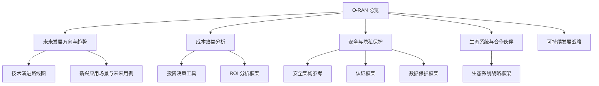
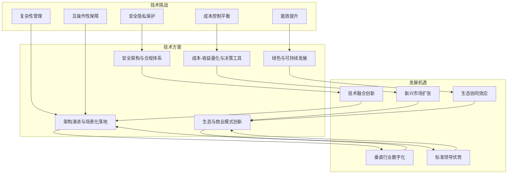
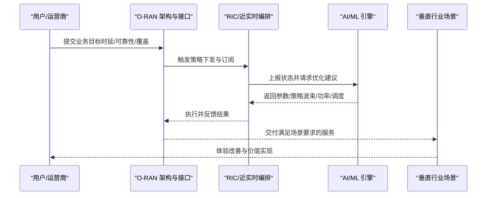
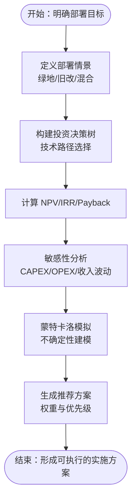
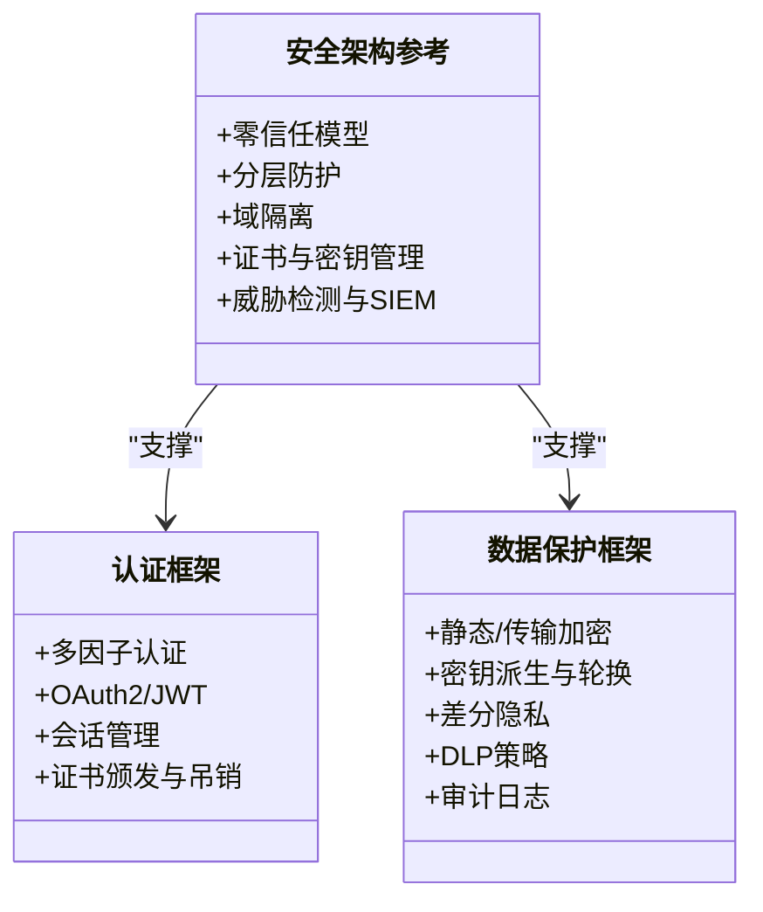
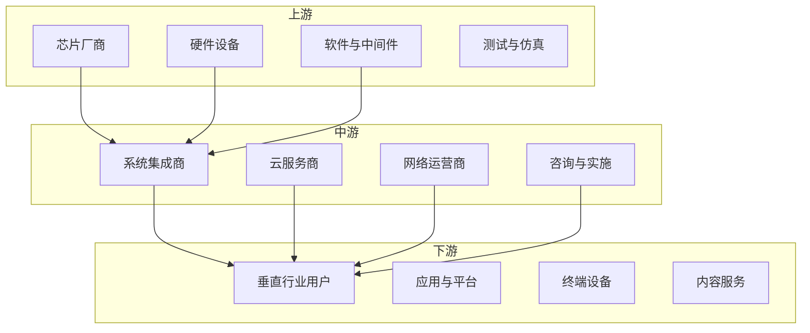

# 挑战与机遇

<cite>
**本文引用的文件**
- [O-RAN 未来发展方向与趋势](file://15-future-development/readme.md)
- [O-RAN 技术发展趋势分析](file://15-future-development/technology-trends/technology-evolution-roadmap.md)
- [O-RAN 新兴应用场景与未来用例](file://15-future-development/emerging-applications/emerging-applications-roadmap.md)
- [O-RAN 成本效益分析](file://18-cost-benefit-analysis/readme.md)
- [O-RAN 投资决策工具](file://18-cost-benefit-analysis/decision-tools/oran-decision-frameworks.md)
- [O-RAN 投资回报分析框架](file://18-cost-benefit-analysis/roi-analysis/o-ran-roi-analysis.md)
- [O-RAN 安全与隐私保护](file://12-security-privacy/readme.md)
- [O-RAN 安全架构参考](file://12-security-privacy/security-architecture/security-reference-architecture.md)
- [O-RAN 认证框架](file://12-security-privacy/authentication/authentication-framework.md)
- [O-RAN 数据保护框架](file://12-security-privacy/data-protection/data-protection-framework.md)
- [O-RAN 可持续发展战略](file://24-sustainable-development/readme.md)
- [O-RAN 生态系统与合作伙伴](file://20-ecosystem-partnership/readme.md)
- [O-RAN 生态系统战略框架](file://20-ecosystem-partnership/ecosystem-strategy/o-ran-ecosystem-strategy.md)
- [O-RAN 总览](file://README.md)
</cite>

## 目录
1. [引言](#引言)
2. [项目结构](#项目结构)
3. [核心组件](#核心组件)
4. [架构总览](#架构总览)
5. [详细组件分析](#详细组件分析)
6. [依赖分析](#依赖分析)
7. [性能考虑](#性能考虑)
8. [故障排查指南](#故障排查指南)
9. [结论](#结论)
10. [附录](#附录)

## 引言
本文件围绕 O-RAN 发展中的“挑战与机遇”进行系统化解析，聚焦以下维度：
- 技术挑战：复杂性管理、互操作性保障、安全隐私保护、能效提升、成本控制平衡
- 发展机遇：垂直行业数字化、新兴市场扩张、技术融合创新、标准领导优势、生态协同效应
- 挑战与机遇的辩证关系：如何以技术创新应对挑战，如何把握机遇推动发展
- 未来发展的战略建议与实施方案：为 O-RAN 技术的可持续发展提供可执行的指导

## 项目结构
该知识库以主题域划分，覆盖 O-RAN 全栈能力与实践，便于从架构、安全、成本、生态、可持续发展等多角度审视挑战与机遇。

图表来源
- [O-RAN 总览](file://README.md#L1-L472)
- [O-RAN 未来发展方向与趋势](file://15-future-development/readme.md#L1-L151)
- [O-RAN 技术发展趋势分析](file://15-future-development/technology-trends/technology-evolution-roadmap.md#L1-L68)
- [O-RAN 新兴应用场景与未来用例](file://15-future-development/emerging-applications/emerging-applications-roadmap.md#L1-L800)
- [O-RAN 成本效益分析](file://18-cost-benefit-analysis/readme.md#L1-L62)
- [O-RAN 投资决策工具](file://18-cost-benefit-analysis/decision-tools/oran-decision-frameworks.md#L1-L726)
- [O-RAN 投资回报分析框架](file://18-cost-benefit-analysis/roi-analysis/o-ran-roi-analysis.md#L1-L181)
- [O-RAN 安全与隐私保护](file://12-security-privacy/readme.md#L1-L67)
- [O-RAN 安全架构参考](file://12-security-privacy/security-architecture/security-reference-architecture.md#L1-L559)
- [O-RAN 认证框架](file://12-security-privacy/authentication/authentication-framework.md#L1-L208)
- [O-RAN 数据保护框架](file://12-security-privacy/data-protection/data-protection-framework.md#L1-L376)
- [O-RAN 生态系统与合作伙伴](file://20-ecosystem-partnership/readme.md#L1-L64)
- [O-RAN 生态系统战略框架](file://20-ecosystem-partnership/ecosystem-strategy/o-ran-ecosystem-strategy.md#L1-L189)

章节来源
- [O-RAN 总览](file://README.md#L1-L472)

## 核心组件
- 技术演进与场景：面向 6G 的架构演进、AI 原生、量子通信、沉浸式通信、工业 4.0、智慧城市、联网自动驾驶等
- 成本与收益：全生命周期成本（含 CAPEX/OPEX）、ROI 计算、敏感性分析、决策树与情景比较
- 安全与合规：零信任模型、分层防护、证书与密钥管理、身份认证、数据保护、威胁检测与合规审计
- 生态与合作：产业链示意、伙伴类型、业务模式创新、开放平台与开发者社区
- 可持续发展：绿色通信、碳足迹管理、循环与韧性设计、社会责任与长期规划

章节来源
- [O-RAN 未来发展方向与趋势](file://15-future-development/readme.md#L1-L151)
- [O-RAN 技术发展趋势分析](file://15-future-development/technology-trends/technology-evolution-roadmap.md#L1-L68)
- [O-RAN 新兴应用场景与未来用例](file://15-future-development/emerging-applications/emerging-applications-roadmap.md#L1-L800)
- [O-RAN 成本效益分析](file://18-cost-benefit-analysis/readme.md#L1-L62)
- [O-RAN 投资决策工具](file://18-cost-benefit-analysis/decision-tools/oran-decision-frameworks.md#L1-L726)
- [O-RAN 投资回报分析框架](file://18-cost-benefit-analysis/roi-analysis/o-ran-roi-analysis.md#L1-L181)
- [O-RAN 安全与隐私保护](file://12-security-privacy/readme.md#L1-L67)
- [O-RAN 安全架构参考](file://12-security-privacy/security-architecture/security-reference-architecture.md#L1-L559)
- [O-RAN 认证框架](file://12-security-privacy/authentication/authentication-framework.md#L1-L208)
- [O-RAN 数据保护框架](file://12-security-privacy/data-protection/data-protection-framework.md#L1-L376)
- [O-RAN 生态系统与合作伙伴](file://20-ecosystem-partnership/readme.md#L1-L64)
- [O-RAN 生态系统战略框架](file://20-ecosystem-partnership/ecosystem-strategy/o-ran-ecosystem-strategy.md#L1-L189)

## 架构总览
下图展示 O-RAN 在“技术挑战—发展机遇—解决方案—可持续发展”的闭环中如何协同演进：

## 详细组件分析

### 技术挑战与应对策略
- 复杂性管理
  - 挑战：多厂商、多接口、云原生与 RAN 的深度融合带来系统复杂度上升
  - 应对：采用模块化与分层架构、标准化接口（如 E2/A1/O1/O-FH）、容器化与微服务治理、自动化测试与 CI/CD
  - 参考：未来发展方向中的“AI 原生架构”“边缘智能”“数字孪生”等内生智能设计思路
- 互操作性保障
  - 挑战：多厂商设备互通、协议一致性、跨域协同
  - 应对：严格遵循 O-RAN/ETSI/3GPP 标准、Plugtest 与互操作性测试、统一的接口安全与认证机制
  - 参考：安全架构中的“零信任”“分层防护”“接口安全”“证书与密钥管理”
- 安全隐私保护
  - 挑战：端到端加密、身份认证、数据隐私、合规审计
  - 应对：零信任模型、多因子认证、端到端加密、密钥全生命周期管理、威胁建模与 SIEM 集成
  - 参考：认证框架、数据保护框架、安全架构参考
- 能效提升
  - 挑战：能耗与散热、设备待机与负载波动
  - 应对：智能休眠、动态功率调整、可再生能源集成、热设计优化、模块化与冗余设计
  - 参考：可持续发展战略中的“绿色通信技术”“碳足迹管理”
- 成本控制平衡
  - 挑战：初始投资高、运维成本压力、ROI 不确定性
  - 应对：全生命周期成本建模、敏感性分析、分阶段投资、供应商比选矩阵、风险量化与缓解
  - 参考：成本效益分析、投资决策工具、ROI 分析框架

章节来源
- [O-RAN 未来发展方向与趋势](file://15-future-development/readme.md#L137-L151)
- [O-RAN 安全架构参考](file://12-security-privacy/security-architecture/security-reference-architecture.md#L1-L559)
- [O-RAN 认证框架](file://12-security-privacy/authentication/authentication-framework.md#L1-L208)
- [O-RAN 数据保护框架](file://12-security-privacy/data-protection/data-protection-framework.md#L1-L376)
- [O-RAN 可持续发展战略](file://24-sustainable-development/readme.md#L1-L65)
- [O-RAN 成本效益分析](file://18-cost-benefit-analysis/readme.md#L1-L62)
- [O-RAN 投资决策工具](file://18-cost-benefit-analysis/decision-tools/oran-decision-frameworks.md#L1-L726)
- [O-RAN 投资回报分析框架](file://18-cost-benefit-analysis/roi-analysis/o-ran-roi-analysis.md#L1-L181)

### 发展机遇与实施路径
- 垂直行业数字化
  - 医疗健康、工业制造、智慧能源、交通物流等场景对低时延、高可靠、确定性网络提出新需求
  - 实施要点：网络切片、边缘智能、xApps/rApps 开发生态、数据隐私与合规
- 新兴市场扩张
  - 通过白盒化、云原生与开放标准降低部署门槛，快速复制成功经验
  - 实施要点：本地化适配、区域策略、供应链与合作伙伴网络
- 技术融合创新
  - AI/ML、量子通信、太赫兹、空天地一体化、沉浸式通信等前沿技术与 O-RAN 的结合
  - 实施要点：前瞻研究、标准参与、开源社区贡献、联合实验室
- 标准领导优势
  - 积极参与 O-RAN Alliance、ETSI、3GPP 等标准制定，构建技术话语权与专利护城河
  - 实施要点：标准贡献、测试验证、互操作性认证、合规报告
- 生态协同效应
  - 通过开放平台、开发者社区、渠道与技术伙伴，形成价值共创与共享
  - 实施要点：生态战略、开放 API、开发者工具链、联合营销与培训

章节来源
- [O-RAN 未来发展方向与趋势](file://15-future-development/readme.md#L114-L151)
- [O-RAN 新兴应用场景与未来用例](file://15-future-development/emerging-applications/emerging-applications-roadmap.md#L1-L800)
- [O-RAN 生态系统与合作伙伴](file://20-ecosystem-partnership/readme.md#L1-L64)
- [O-RAN 生态系统战略框架](file://20-ecosystem-partnership/ecosystem-strategy/o-ran-ecosystem-strategy.md#L1-L189)

### 技术演进与场景化落地（序列图）

图表来源
- [O-RAN 新兴应用场景与未来用例](file://15-future-development/emerging-applications/emerging-applications-roadmap.md#L1-L800)
- [O-RAN 安全架构参考](file://12-security-privacy/security-architecture/security-reference-architecture.md#L1-L559)

### 成本-收益与风险决策（流程图）

图表来源
- [O-RAN 投资决策工具](file://18-cost-benefit-analysis/decision-tools/oran-decision-frameworks.md#L1-L726)
- [O-RAN 投资回报分析框架](file://18-cost-benefit-analysis/roi-analysis/o-ran-roi-analysis.md#L1-L181)

### 安全与合规（类图）

图表来源
- [O-RAN 安全架构参考](file://12-security-privacy/security-architecture/security-reference-architecture.md#L1-L559)
- [O-RAN 认证框架](file://12-security-privacy/authentication/authentication-framework.md#L1-L208)
- [O-RAN 数据保护框架](file://12-security-privacy/data-protection/data-protection-framework.md#L1-L376)

### 生态系统与商业模式（概念图）

图表来源
- [O-RAN 生态系统与合作伙伴](file://20-ecosystem-partnership/readme.md#L1-L64)

## 依赖分析
- 技术依赖
  - 架构与接口标准（E2/A1/O1/O-FH）是实现互操作性的基础
  - AI/ML、边缘智能、数字孪生等内生能力决定网络自智化水平
  - 量子与后量子密码、QKD 等为未来安全提供技术储备
- 经济依赖
  - 成本建模与 ROI 是投资决策的关键输入；敏感性与风险模拟决定资金配置
- 安全依赖
  - 零信任与分层防护贯穿全栈；证书与密钥管理体系是接口与数据安全的基石
- 生态依赖
  - 开放标准与开源社区是规模化与创新的双轮；渠道与技术伙伴构成市场拓展与交付能力

章节来源
- [O-RAN 未来发展方向与趋势](file://15-future-development/readme.md#L1-L151)
- [O-RAN 技术发展趋势分析](file://15-future-development/technology-trends/technology-evolution-roadmap.md#L1-L68)
- [O-RAN 投资决策工具](file://18-cost-benefit-analysis/decision-tools/oran-decision-frameworks.md#L1-L726)
- [O-RAN 安全架构参考](file://12-security-privacy/security-architecture/security-reference-architecture.md#L1-L559)
- [O-RAN 生态系统与合作伙伴](file://20-ecosystem-partnership/readme.md#L1-L64)

## 性能考虑
- 网络性能：基于 AI 的波束/功率/调度优化、QoS 保障、边缘缓存与就近处理
- 运维效率：自动化测试与 CI/CD、可观测性与告警、容量与性能优化
- 能耗与散热：智能休眠、动态功率、可再生能源、模块化与冗余设计
- 安全开销：在保证零信任与加密的前提下，优化认证与密钥管理的性能影响

## 故障排查指南
- 安全事件：通过 SIEM 收集与关联分析，识别异常登录、未授权变更、网络异常等，触发告警与处置流程
- 性能退化：结合监控指标与根因分析，定位接口延迟、吞吐瓶颈、资源争用等问题
- 合规审计：建立审计日志与取证能力，确保事件可追溯、责任可认定、整改有闭环

章节来源
- [O-RAN 安全架构参考](file://12-security-privacy/security-architecture/security-reference-architecture.md#L340-L513)
- [O-RAN 数据保护框架](file://12-security-privacy/data-protection/data-protection-framework.md#L342-L376)

## 结论
O-RAN 的发展正处于技术演进与生态建设的关键期。面对复杂性、互操作性、安全隐私、能效与成本等多重挑战，应以“标准+架构+安全+生态+可持续”五位一体的系统工程为抓手，通过前瞻性的技术融合、严谨的成本-收益建模、稳健的安全与合规体系、开放的生态系统与商业模式，以及绿色低碳的长期规划，实现从“可部署”到“好运营”再到“可持续”的跨越。

## 附录
- 战略建议与实施方案（节选）
  - 技术层面：以“AI 原生+边缘智能+数字孪生”为核心抓手，推进 RIC 与 xApps/rApps 生态建设；同步开展量子与后量子密码研究，提前布局安全底座
  - 经济层面：建立全生命周期成本模型与 ROI 指标体系，分阶段滚动投资；引入敏感性与风险模拟，动态优化资源配置
  - 安全层面：落实零信任与分层防护，完善证书与密钥全生命周期管理，强化威胁检测与合规审计
  - 生态层面：以开放平台与开发者社区为抓手，构建“技术—渠道—客户”三位一体的生态体系；积极参与标准制定，提升行业影响力
  - 可持续层面：将绿色通信、碳足迹管理、循环设计纳入产品与流程设计，推动 ESG 与长期价值创造

章节来源
- [O-RAN 未来发展方向与趋势](file://15-future-development/readme.md#L1-L151)
- [O-RAN 投资决策工具](file://18-cost-benefit-analysis/decision-tools/oran-decision-frameworks.md#L1-L726)
- [O-RAN 安全架构参考](file://12-security-privacy/security-architecture/security-reference-architecture.md#L1-L559)
- [O-RAN 生态系统与合作伙伴](file://20-ecosystem-partnership/readme.md#L1-L64)
- [O-RAN 生态系统战略框架](file://20-ecosystem-partnership/ecosystem-strategy/o-ran-ecosystem-strategy.md#L1-L189)
- [O-RAN 可持续发展战略](file://24-sustainable-development/readme.md#L1-L65)