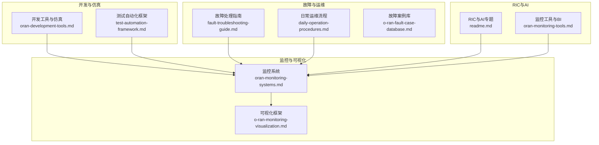
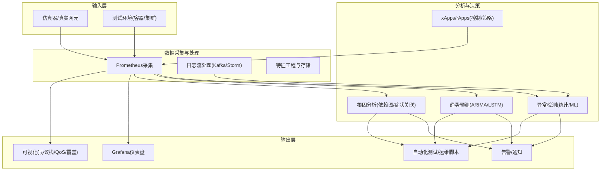
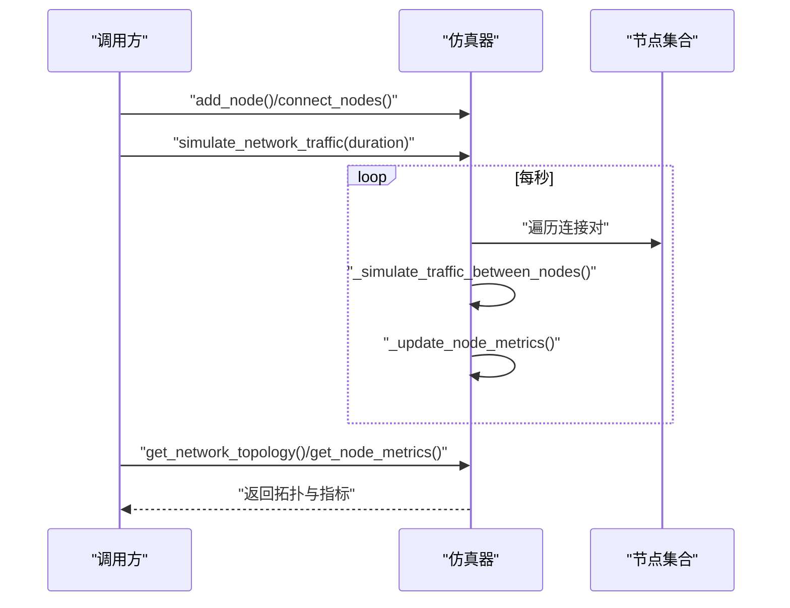
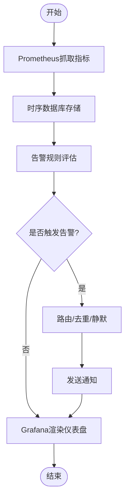
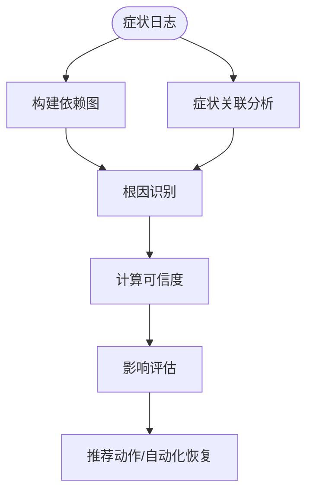
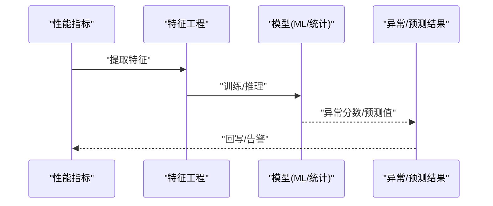
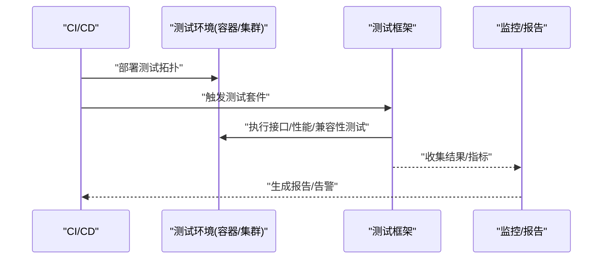
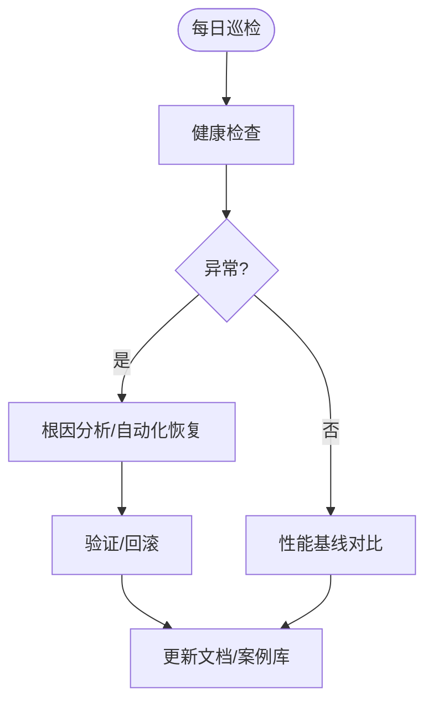
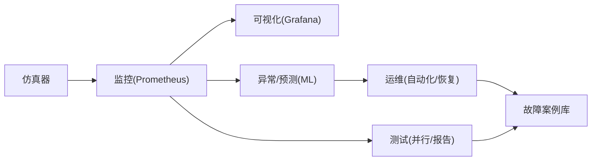

# 数字孪生技术

<cite>
**本文引用的文件**
- [README.md](file://README.md)
- [oran-development-tools.md](file://17-open-source-ecosystem/developer-tools/oran-development-tools.md)
- [oran-monitoring-systems.md](file://22-tool-platforms/monitoring-systems/o-ran-monitoring-systems.md)
- [fault-troubleshooting-guide.md](file://14-operations-management/fault-handling/fault-troubleshooting-guide.md)
- [o-ran-monitoring-visualization.md](file://28-monitoring-alerting/visualization/o-ran-monitoring-visualization.md)
- [test-automation-framework.md](file://13-testing-validation/automation-framework/test-automation-framework.md)
- [daily-operation-procedures.md](file://14-operations-management/daily-operations/daily-operation-procedures.md)
- [readme.md](file://07-ric-development/readme.md)
- [oran-monitoring-tools.md](file://28-monitoring-alerting/monitoring-tools/o-ran-monitoring-tools.md)
- [o-ran-development-toolkit.md](file://22-tool-platforms/development-tools/o-ran-development-toolkit.md)
- [interoperability-testing.md](file://13-testing-validation/interoperability/interoperability-testing.md)
- [o-ran-fault-case-database.md](file://27-troubleshooting-diagnosis/fault-library/o-ran-fault-case-database.md)
</cite>

## 目录
1. [引言](#引言)
2. [项目结构](#项目结构)
3. [核心组件](#核心组件)
4. [架构总览](#架构总览)
5. [详细组件分析](#详细组件分析)
6. [依赖关系分析](#依赖关系分析)
7. [性能考量](#性能考量)
8. [故障排查指南](#故障排查指南)
9. [结论](#结论)
10. [附录](#附录)

## 引言
本文件面向O-RAN数字孪生技术的应用与落地，系统梳理从“物理网络虚拟化”到“智能运维”的完整技术闭环：包括网络数字孪生的虚拟化建模与实时同步、仿真预测与异常检测、虚拟化测试环境与自动化流程、以及基于知识库与AI的智能运维助手与预测性分析。文档以仓库现有资料为基础，结合可视化、监控告警、测试验证与运维流程，形成可执行、可扩展、可演进的数字孪生方案。

## 项目结构
该知识库采用主题化目录组织，覆盖O-RAN全栈技术与实践，便于按需检索与组合使用。与数字孪生直接相关的内容主要分布在以下主题：
- 开发工具与仿真：提供容器化开发环境、网络仿真器、测试框架等
- 监控与可视化：提供指标采集、告警、仪表盘与可视化展示
- 故障处理与根因分析：提供根因分析框架、故障库与自动化恢复
- 测试与验证：提供自动化测试框架、容器编排与测试环境管理
- RIC与AI：提供xApps/rApps、机器学习与预测维护能力
- 日常运维：提供健康检查、变更管理、性能监控与告警

图示来源
- [oran-development-tools.md](file://17-open-source-ecosystem/developer-tools/oran-development-tools.md#L1-L994)
- [test-automation-framework.md](file://13-testing-validation/automation-framework/test-automation-framework.md#L1-L134)
- [oran-monitoring-systems.md](file://22-tool-platforms/monitoring-systems/o-ran-monitoring-systems.md#L1-L545)
- [o-ran-monitoring-visualization.md](file://28-monitoring-alerting/visualization/o-ran-monitoring-visualization.md#L1-L257)
- [fault-troubleshooting-guide.md](file://14-operations-management/fault-handling/fault-troubleshooting-guide.md#L1-L633)
- [daily-operation-procedures.md](file://14-operations-management/daily-operations/daily-operation-procedures.md#L1-L443)
- [readme.md](file://07-ric-development/readme.md#L1-L368)
- [oran-monitoring-tools.md](file://28-monitoring-alerting/monitoring-tools/o-ran-monitoring-tools.md#L1-L257)

章节来源
- [README.md](file://README.md#L1-L472)

## 核心组件
围绕数字孪生的关键能力，本节提炼出以下核心组件及其职责：
- 网络仿真与拓扑建模：通过仿真器构建虚拟网络拓扑，注入时序指标，支撑实时同步与可视化
- 实时监控与指标采集：Prometheus/Grafana体系，统一采集与展示关键KPI
- 可视化与仪表盘：支持协议栈、覆盖、QoS等多维可视化
- 故障诊断与根因分析：基于依赖图与症状关联的自动化根因定位
- 预测与异常检测：统计与ML模型驱动的异常检测与趋势预测
- 自动化测试与验证：容器化测试环境、并行执行、AI辅助测试选择
- 运维流程与知识库：健康检查、变更管理、告警与恢复流程、故障案例库

章节来源
- [oran-development-tools.md](file://17-open-source-ecosystem/developer-tools/oran-development-tools.md#L646-L797)
- [oran-monitoring-systems.md](file://22-tool-platforms/monitoring-systems/o-ran-monitoring-systems.md#L10-L131)
- [o-ran-monitoring-visualization.md](file://28-monitoring-alerting/visualization/o-ran-monitoring-visualization.md#L54-L193)
- [fault-troubleshooting-guide.md](file://14-operations-management/fault-handling/fault-troubleshooting-guide.md#L100-L180)
- [oran-monitoring-tools.md](file://28-monitoring-alerting/monitoring-tools/o-ran-monitoring-tools.md#L187-L228)
- [test-automation-framework.md](file://13-testing-validation/automation-framework/test-automation-framework.md#L1-L134)
- [daily-operation-procedures.md](file://14-operations-management/daily-operations/daily-operation-procedures.md#L6-L161)

## 架构总览
下图展示了数字孪生系统的端到端架构：以仿真器/真实网元为输入，经由监控采集与可视化呈现，结合故障诊断与预测分析，驱动自动化测试与运维流程闭环。

图示来源
- [oran-monitoring-systems.md](file://22-tool-platforms/monitoring-systems/o-ran-monitoring-systems.md#L10-L131)
- [oran-monitoring-tools.md](file://28-monitoring-alerting/monitoring-tools/o-ran-monitoring-tools.md#L187-L228)
- [readme.md](file://07-ric-development/readme.md#L99-L123)
- [o-ran-monitoring-visualization.md](file://28-monitoring-alerting/visualization/o-ran-monitoring-visualization.md#L54-L193)

## 详细组件分析

### 组件一：网络仿真与拓扑建模（数字孪生基础）
- 能力要点
  - 节点抽象与连接建模：支持RU/DU/CU/RIC等节点类型，动态建立连接关系
  - 实时流量仿真：随机生成链路延迟、丢包、吞吐等指标，更新节点度量
  - 拓扑与指标查询：提供当前拓扑快照与节点指标读取接口
- 关键流程
  - 初始化仿真器与节点
  - 建立节点间连接
  - 启动仿真循环，周期性更新指标
  - 导出拓扑与指标供可视化与分析使用

图示来源
- [oran-development-tools.md](file://17-open-source-ecosystem/developer-tools/oran-development-tools.md#L669-L759)

章节来源
- [oran-development-tools.md](file://17-open-source-ecosystem/developer-tools/oran-development-tools.md#L646-L797)

### 组件二：实时监控与可视化（数字孪生状态呈现）
- 能力要点
  - 指标采集：Prometheus抓取控制面/用户面/近实时RIC指标
  - 告警规则：基于阈值与时间窗的告警表达式
  - 可视化：Grafana仪表盘，包含网络性能、RAN组件健康、RIC性能等面板
  - 协议与QoS可视化：协议栈映射、消息流图、QoS与SLA展示
- 关键流程
  - 配置抓取目标与规则
  - 生成告警并路由至通知系统
  - 仪表盘渲染KPI与趋势图

图示来源
- [oran-monitoring-systems.md](file://22-tool-platforms/monitoring-systems/o-ran-monitoring-systems.md#L10-L131)
- [o-ran-monitoring-visualization.md](file://28-monitoring-alerting/visualization/o-ran-monitoring-visualization.md#L54-L193)

章节来源
- [oran-monitoring-systems.md](file://22-tool-platforms/monitoring-systems/o-ran-monitoring-systems.md#L1-L545)
- [o-ran-monitoring-visualization.md](file://28-monitoring-alerting/visualization/o-ran-monitoring-visualization.md#L1-L257)

### 组件三：故障诊断与根因分析（智能运维助手）
- 能力要点
  - 依赖图构建：SMO→RIC→CU→DU→RU的依赖关系
  - 症状关联：对症状日志进行模式聚类与频率统计
  - 根因评分：综合出现频次、时间聚集性与症状严重度计算可信度
  - 自动化恢复：针对常见故障的自动恢复脚本
- 关键流程
  - 收集症状日志
  - 构建依赖图与相关矩阵
  - 计算根因可信度并排序
  - 生成影响评估与建议动作

图示来源
- [fault-troubleshooting-guide.md](file://14-operations-management/fault-handling/fault-troubleshooting-guide.md#L100-L180)

章节来源
- [fault-troubleshooting-guide.md](file://14-operations-management/fault-handling/fault-troubleshooting-guide.md#L1-L633)
- [o-ran-fault-case-database.md](file://27-troubleshooting-diagnosis/fault-library/o-ran-fault-case-database.md#L116-L169)

### 组件四：预测与异常检测（预测性分析）
- 能力要点
  - 统计异常检测：控制图、Z-Score、EWMA、季节分解
  - 多变量分析：PCA、马氏距离、聚类、相关矩阵
  - 时间序列预测：ARIMA、Prophet、LSTM、集成方法
  - 预测维护：健康状态预测、剩余寿命估计、维护调度优化
- 关键流程
  - 特征提取与归一化
  - 模型训练与阈值设定
  - 实时预测与异常评分
  - 结果回传与仪表盘展示

图示来源
- [oran-monitoring-systems.md](file://22-tool-platforms/monitoring-systems/o-ran-monitoring-systems.md#L415-L485)
- [oran-monitoring-tools.md](file://28-monitoring-alerting/monitoring-tools/o-ran-monitoring-tools.md#L187-L228)
- [readme.md](file://07-ric-development/readme.md#L99-L123)

章节来源
- [oran-monitoring-systems.md](file://22-tool-platforms/monitoring-systems/o-ran-monitoring-systems.md#L415-L485)
- [oran-monitoring-tools.md](file://28-monitoring-alerting/monitoring-tools/o-ran-monitoring-tools.md#L187-L228)
- [readme.md](file://07-ric-development/readme.md#L99-L123)

### 组件五：虚拟化测试环境与自动化测试（仿真测试平台）
- 能力要点
  - 容器化测试环境：Docker/Kubernetes隔离与弹性
  - 测试框架：PyTest/Robot/JUnit，支持并行执行
  - AI辅助测试：智能用例选择、动态生成、自愈测试
  - 监控与报告：测试执行监控、趋势分析、覆盖率与资源消耗
- 关键流程
  - 环境编排与拓扑配置
  - 执行测试套件与收集结果
  - 分析失败模式与回归趋势
  - 生成报告与安全合规校验

图示来源
- [test-automation-framework.md](file://13-testing-validation/automation-framework/test-automation-framework.md#L1-L134)
- [interoperability-testing.md](file://13-testing-validation/interoperability/interoperability-testing.md#L227-L231)
- [o-ran-development-toolkit.md](file://22-tool-platforms/development-tools/o-ran-development-toolkit.md#L222-L257)

章节来源
- [test-automation-framework.md](file://13-testing-validation/automation-framework/test-automation-framework.md#L1-L134)
- [interoperability-testing.md](file://13-testing-validation/interoperability/interoperability-testing.md#L227-L231)
- [o-ran-development-toolkit.md](file://22-tool-platforms/development-tools/o-ran-development-toolkit.md#L222-L257)

### 组件六：日常运维与知识库（智能运维助手）
- 能力要点
  - 健康检查：组件可用性、接口连通性、错误率阈值
  - 配置管理：备份/恢复/变更流程、回滚策略
  - 告警与响应：分级响应、沟通协议、工单与复盘
  - 故障案例库：分类、根因、处置步骤与经验沉淀
- 关键流程
  - 每日巡检与基线对比
  - 变更前置校验与自动化验证
  - 故障发生时的根因定位与恢复
  - 维护后验证与文档更新

图示来源
- [daily-operation-procedures.md](file://14-operations-management/daily-operations/daily-operation-procedures.md#L6-L161)
- [fault-troubleshooting-guide.md](file://14-operations-management/fault-handling/fault-troubleshooting-guide.md#L283-L307)
- [o-ran-fault-case-database.md](file://27-troubleshooting-diagnosis/fault-library/o-ran-fault-case-database.md#L116-L169)

章节来源
- [daily-operation-procedures.md](file://14-operations-management/daily-operations/daily-operation-procedures.md#L1-L443)
- [o-ran-fault-case-database.md](file://27-troubleshooting-diagnosis/fault-library/o-ran-fault-case-database.md#L116-L169)

## 依赖关系分析
- 组件耦合
  - 仿真器与监控：仿真器输出作为监控源，监控结果反哺仿真与测试
  - 监控与可视化：Prometheus指标驱动Grafana面板
  - 故障诊断与运维：根因分析结果驱动自动化恢复与变更流程
  - 预测与测试：预测模型输出指导测试用例生成与回归分析
- 外部依赖
  - 容器与编排：Docker/Kubernetes/Helm
  - 监控与可视化：Prometheus/Grafana/Kafka/Storm
  - 机器学习：Scikit-learn/TensorFlow/ONNX
  - 接口与协议：E2/F1/O-FH/A1等标准接口

图示来源
- [oran-development-tools.md](file://17-open-source-ecosystem/developer-tools/oran-development-tools.md#L646-L797)
- [oran-monitoring-systems.md](file://22-tool-platforms/monitoring-systems/o-ran-monitoring-systems.md#L10-L131)
- [test-automation-framework.md](file://13-testing-validation/automation-framework/test-automation-framework.md#L1-L134)
- [daily-operation-procedures.md](file://14-operations-management/daily-operations/daily-operation-procedures.md#L6-L161)

## 性能考量
- 仿真性能
  - 降低仿真复杂度：按需连接、采样周期与指标维度控制
  - 并行化：多连接并发仿真、异步指标更新
- 监控与可视化
  - 抓取间隔与保留策略：平衡精度与存储成本
  - 仪表盘渲染优化：虚拟滚动、增量更新、缓存
- 机器学习
  - 特征工程与降维：PCA/聚类减少维度
  - 在线学习与增量训练：避免全量重训
- 测试与运维
  - 并行执行与资源调度：提高吞吐、降低等待
  - 回滚与灰度发布：降低变更风险

## 故障排查指南
- 快速定位
  - 依据症状日志构建依赖图，统计模式与频率
  - 计算根因可信度，优先处理高概率根因
- 常见问题
  - E2/F1/O-FH接口问题：连通性、证书、时延/丢包阈值
  - 同步问题：PTP时钟、硬件时间戳、网络优先级
  - 性能退化：资源瓶颈、队列/缓冲区、QoS配置
- 自动化恢复
  - 针对典型故障编写恢复脚本，纳入运维流程
  - 告警联动与工单系统对接，提升处置效率

章节来源
- [fault-troubleshooting-guide.md](file://14-operations-management/fault-handling/fault-troubleshooting-guide.md#L264-L537)
- [o-ran-fault-case-database.md](file://27-troubleshooting-diagnosis/fault-library/o-ran-fault-case-database.md#L116-L169)

## 结论
本文件基于仓库现有资料，构建了从“仿真建模—实时监控—可视化—故障诊断—预测分析—自动化测试—运维流程”的数字孪生闭环。通过容器化开发与测试、统一监控与可视化、基于ML的异常检测与预测、以及结构化的故障与运维流程，可有效支撑O-RAN网络的虚拟化、智能化与自动化运营。后续可在以下方向深化：仿真器与真实网元的混合仿真、跨域协同的统一拓扑建模、更丰富的AI算法与策略引擎、以及与标准接口的深度集成。

## 附录
- 相关最佳实践
  - 变更管理：标准化变更请求、影响评估、回滚预案
  - 健康检查：组件可用性、接口连通性、错误率阈值
  - 告警治理：去噪、相关性、分级与升级策略
  - 测试策略：冒烟/回归/性能/安全一体化

章节来源
- [daily-operation-procedures.md](file://14-operations-management/daily-operations/daily-operation-procedures.md#L163-L443)
- [oran-monitoring-systems.md](file://22-tool-platforms/monitoring-systems/o-ran-monitoring-systems.md#L355-L414)
- [test-automation-framework.md](file://13-testing-validation/automation-framework/test-automation-framework.md#L70-L134)