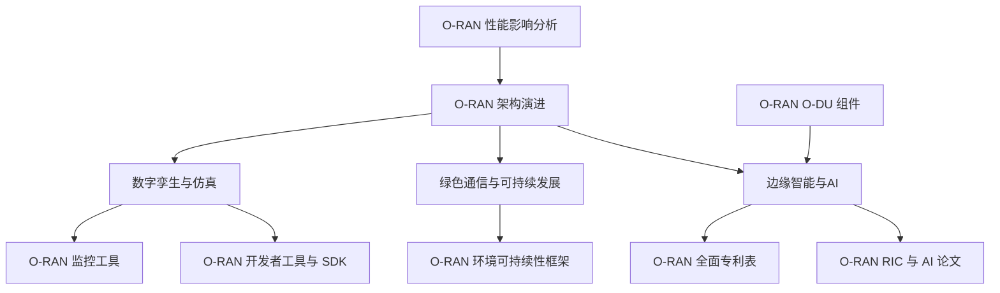
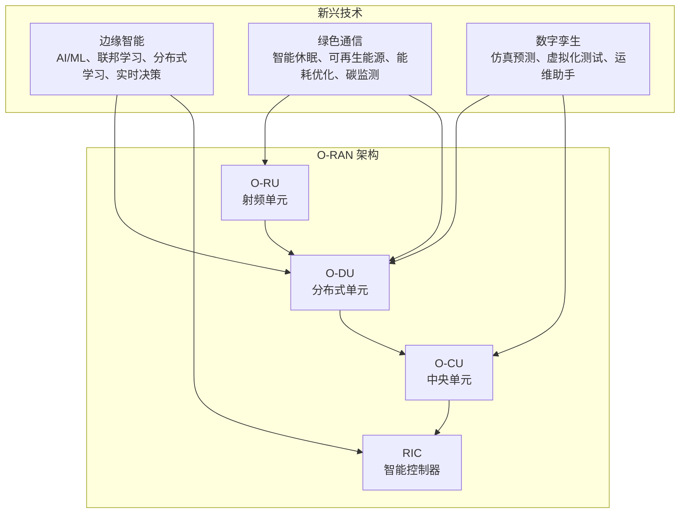
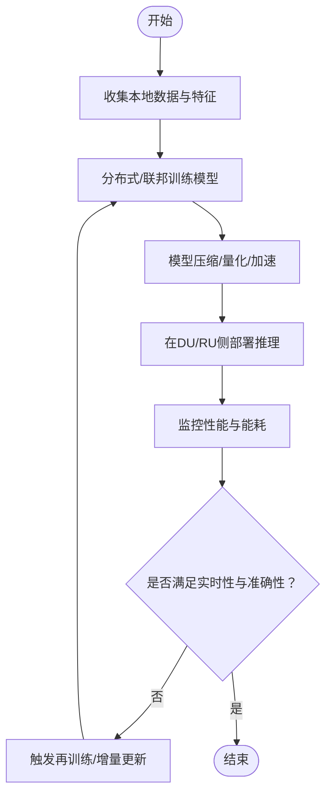
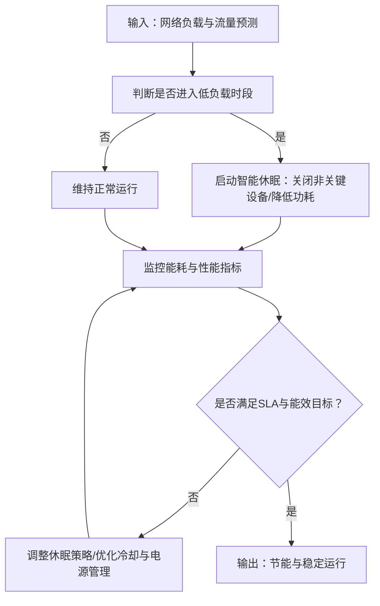
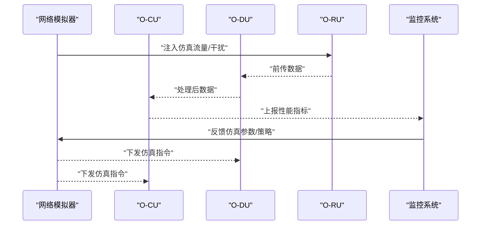
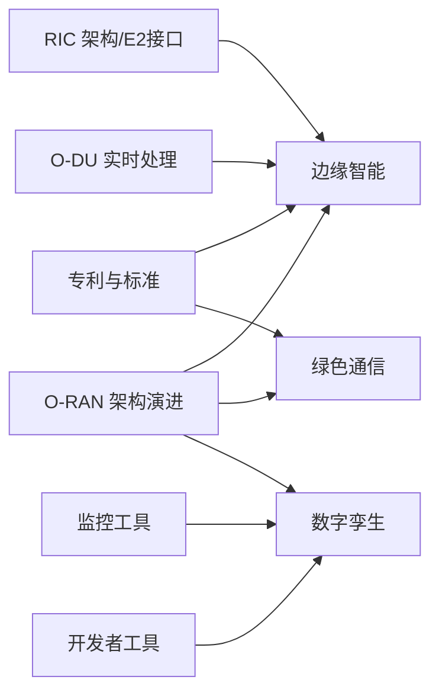

# 新兴技术趋势

<cite>
**本文引用的文件**
- [O-RAN 环境可持续性框架](file://24-sustainable-development/environmental-protection/o-ran-environmental-sustainability.md)
- [O-RAN RIC 与 AI 论文](file://11-academic-papers/ric-ai/readme.md)
- [O-RAN 架构演进](file://01-architecture-system/architecture-evolution.md)
- [O-RAN 开发者工具与 SDK](file://17-open-source-ecosystem/developer-tools/oran-development-tools-zh.md)
- [O-RAN 全面专利表](file://comprehensive-oran-patent-table.md)
- [O-RAN 监控工具](file://28-monitoring-alerting/monitoring-tools/o-ran-monitoring-tools-zh.md)
- [O-RAN O-DU 组件](file://02-core-components/o-du.md)
- [O-RAN 性能影响分析](file://04-disaggregation-options/performance-impact.md)
- [O-RAN 简明术语表](file://12-oran-for-dummies/glossary/simple-glossary.md)
- [O-RAN 全面术语表](file://comprehensive-oran-glossary.md)
</cite>

## 目录
1. [简介](#简介)
2. [项目结构](#项目结构)
3. [核心组件](#核心组件)
4. [架构总览](#架构总览)
5. [详细组件分析](#详细组件分析)
6. [依赖关系分析](#依赖关系分析)
7. [性能考虑](#性能考虑)
8. [故障排查指南](#故障排查指南)
9. [结论](#结论)
10. [附录](#附录)

## 简介
本文件聚焦于O-RAN的新兴技术趋势，围绕三大方向展开：边缘智能（边缘AI推理优化、联邦学习在RAN中的应用、边缘缓存策略、分布式机器学习、实时智能决策）、绿色通信（能耗优化算法、可再生能源集成、碳足迹监测、绿色基站设计、智能休眠机制）、以及数字孪生（网络数字孪生、实时仿真预测、虚拟化测试环境、智能运维助手、预测性分析）。我们将结合O-RAN架构演进与现有技术文档，系统梳理这些技术如何影响O-RAN架构，并提出可行的集成方案与实施建议。

## 项目结构
本仓库以主题域划分文档，便于检索与引用。与新兴技术趋势直接相关的知识域包括：
- 环境与可持续发展：绿色通信、能耗优化、碳足迹监测
- RIC与AI：边缘AI、联邦学习、分布式机器学习、实时智能决策
- 架构演进：云原生、虚拟化、边缘计算融合
- 开发工具与仿真：网络模拟器、监控工具、测试框架
- 核心组件：DU/CO/RIC等节点的软件架构与部署形态
- 专利与标准：前沿技术的专利布局与标准必要专利

图表来源
- [O-RAN 架构演进](file://01-architecture-system/architecture-evolution.md#L1-L183)
- [O-RAN RIC 与 AI 论文](file://11-academic-papers/ric-ai/readme.md#L1-L98)
- [O-RAN 环境可持续性框架](file://24-sustainable-development/environmental-protection/o-ran-environmental-sustainability.md#L1-L285)
- [O-RAN 开发者工具与 SDK](file://17-open-source-ecosystem/developer-tools/oran-development-tools-zh.md#L647-L798)
- [O-RAN 全面专利表](file://comprehensive-oran-patent-table.md#L1-L200)
- [O-RAN O-DU 组件](file://02-core-components/o-du.md#L111-L146)
- [O-RAN 性能影响分析](file://04-disaggregation-options/performance-impact.md#L223-L285)

章节来源
- [O-RAN 架构演进](file://01-architecture-system/architecture-evolution.md#L1-L183)
- [O-RAN RIC 与 AI 论文](file://11-academic-papers/ric-ai/readme.md#L1-L98)
- [O-RAN 环境可持续性框架](file://24-sustainable-development/environmental-protection/o-ran-environmental-sustainability.md#L1-L285)
- [O-RAN 开发者工具与 SDK](file://17-open-source-ecosystem/developer-tools/oran-development-tools-zh.md#L647-L798)
- [O-RAN 全面专利表](file://comprehensive-oran-patent-table.md#L1-L200)
- [O-RAN O-DU 组件](file://02-core-components/o-du.md#L111-L146)
- [O-RAN 性能影响分析](file://04-disaggregation-options/performance-impact.md#L223-L285)

## 核心组件
- 边缘智能与AI
  - RIC架构与xApps开发框架、近实时与非实时RIC协同、AI/ML在RAN优化中的应用、预测性分析与自愈能力
  - 分布式机器学习与联邦学习在RAN中的隐私保护与协同优化
  - 边缘AI推理优化、缓存策略与实时智能决策
- 绿色通信与可持续发展
  - 智能休眠机制、可再生能源集成、能耗优化算法、碳足迹监测与绿色基站设计
- 数字孪生与仿真
  - 网络数字孪生、实时仿真预测、虚拟化测试环境、智能运维助手、预测性分析

章节来源
- [O-RAN RIC 与 AI 论文](file://11-academic-papers/ric-ai/readme.md#L1-L98)
- [O-RAN 环境可持续性框架](file://24-sustainable-development/environmental-protection/o-ran-environmental-sustainability.md#L1-L285)
- [O-RAN 开发者工具与 SDK](file://17-open-source-ecosystem/developer-tools/oran-development-tools-zh.md#L647-L798)

## 架构总览
O-RAN通过开放接口、智能控制器（RIC）、云原生与虚拟化，实现了从集中式到分布式、从封闭到开放的演进。边缘智能与绿色通信两大趋势正深度融入O-RAN架构：
- 边缘智能：将AI/ML下沉至DU/RU与RIC，结合分布式机器学习与联邦学习，实现低延迟、高可靠的智能决策与优化
- 绿色通信：通过智能休眠、可再生能源与能耗优化算法，降低网络运营碳足迹，支撑可持续发展目标
- 数字孪生：以仿真与预测为核心，构建虚拟化测试环境，提升运维效率与网络可靠性

图表来源
- [O-RAN 架构演进](file://01-architecture-system/architecture-evolution.md#L41-L73)
- [O-RAN RIC 与 AI 论文](file://11-academic-papers/ric-ai/readme.md#L57-L70)
- [O-RAN 环境可持续性框架](file://24-sustainable-development/environmental-protection/o-ran-environmental-sustainability.md#L8-L50)
- [O-RAN 开发者工具与 SDK](file://17-open-source-ecosystem/developer-tools/oran-development-tools-zh.md#L647-L798)

## 详细组件分析

### 边缘智能：边缘AI推理优化、联邦学习、分布式机器学习与实时智能决策
- 边缘AI推理优化
  - 关键点：模型压缩、量化与硬件加速在DU/RU侧的应用，降低延迟与功耗
  - 参考：专利条目覆盖边缘AI推理优化技术
- 联邦学习在RAN中的应用
  - 关键点：跨站点分布式训练，保护本地数据隐私的同时实现全局模型优化
  - 参考：专利条目覆盖联邦学习网络优化框架
- 分布式机器学习
  - 关键点：在边缘节点间训练AI模型，提升鲁棒性与泛化能力
  - 参考：专利条目覆盖分布式机器学习框架
- 实时智能决策
  - 关键点：近实时RIC的毫秒级闭环控制与非实时RIC的策略管理协同
  - 参考：论文聚焦近实时与非实时RIC架构、xApps开发框架、预测性维护与强化学习优化

图表来源
- [O-RAN RIC 与 AI 论文](file://11-academic-papers/ric-ai/readme.md#L57-L70)
- [O-RAN 全面专利表](file://comprehensive-oran-patent-table.md#L82-L91)

章节来源
- [O-RAN RIC 与 AI 论文](file://11-academic-papers/ric-ai/readme.md#L1-L98)
- [O-RAN 全面专利表](file://comprehensive-oran-patent-table.md#L82-L91)

### 绿色通信：能耗优化、可再生能源集成、碳足迹监测与智能休眠
- 智能休眠机制
  - 关键点：基于流量模式与网络负载的动态休眠算法，降低空闲时段能耗
  - 参考：专利条目覆盖智能休眠机制
- 可再生能源集成
  - 关键点：太阳能、小型风能与储能系统与O-RAN基础设施的协同
  - 参考：专利条目覆盖可再生能源集成
- 能耗优化算法
  - 关键点：设备级与网络级的功率管理、冷却优化与资源协调
  - 参考：可持续性框架涵盖智能功率管理与能耗优化
- 碳足迹监测
  - 关键点：全生命周期碳排放追踪、目标设定与中和路径
  - 参考：可持续性框架涵盖碳足迹监测与净零路径

图表来源
- [O-RAN 环境可持续性框架](file://24-sustainable-development/environmental-protection/o-ran-environmental-sustainability.md#L8-L50)
- [O-RAN 全面专利表](file://comprehensive-oran-patent-table.md#L120-L129)

章节来源
- [O-RAN 环境可持续性框架](file://24-sustainable-development/environmental-protection/o-ran-environmental-sustainability.md#L1-L285)
- [O-RAN 全面专利表](file://comprehensive-oran-patent-table.md#L120-L135)

### 数字孪生：网络仿真、预测性分析与虚拟化测试
- 网络数字孪生与实时仿真
  - 关键点：构建与真实网络一致的虚拟副本，进行仿真与预测
  - 参考：开发者工具中的网络模拟器可用于拓扑与指标仿真
- 虚拟化测试环境
  - 关键点：容器化与微服务化支撑的测试与验证流水线
  - 参考：开发者工具涵盖容器化开发环境与测试框架
- 智能运维助手与预测性分析
  - 关键点：基于仿真与历史数据的故障预测与运维辅助
  - 参考：监控工具涵盖E2接口、前传/射频与网络性能指标

图表来源
- [O-RAN 开发者工具与 SDK](file://17-open-source-ecosystem/developer-tools/oran-development-tools-zh.md#L647-L798)
- [O-RAN 监控工具](file://28-monitoring-alerting/monitoring-tools/o-ran-monitoring-tools-zh.md#L81-L117)

章节来源
- [O-RAN 开发者工具与 SDK](file://17-open-source-ecosystem/developer-tools/oran-development-tools-zh.md#L647-L798)
- [O-RAN 监控工具](file://28-monitoring-alerting/monitoring-tools/o-ran-monitoring-tools-zh.md#L66-L117)

## 依赖关系分析
- 边缘智能依赖于：
  - RIC架构与E2接口（近实时闭环控制）
  - DU/RU的实时处理与虚拟化能力
  - 分布式/联邦学习框架与xApps开发环境
- 绿色通信依赖于：
  - 智能休眠与可再生能源系统
  - 设备级与网络级的能耗优化算法
  - 生命周期碳足迹监测与目标管理
- 数字孪生依赖于：
  - 网络仿真与虚拟化测试环境
  - 监控与遥测工具提供的指标
  - 容器化与微服务化支撑的运维流程

图表来源
- [O-RAN 架构演进](file://01-architecture-system/architecture-evolution.md#L41-L73)
- [O-RAN RIC 与 AI 论文](file://11-academic-papers/ric-ai/readme.md#L57-L70)
- [O-RAN 全面专利表](file://comprehensive-oran-patent-table.md#L1-L200)
- [O-RAN 监控工具](file://28-monitoring-alerting/monitoring-tools/o-ran-monitoring-tools-zh.md#L81-L117)
- [O-RAN 开发者工具与 SDK](file://17-open-source-ecosystem/developer-tools/oran-development-tools-zh.md#L647-L798)

章节来源
- [O-RAN 架构演进](file://01-architecture-system/architecture-evolution.md#L1-L183)
- [O-RAN RIC 与 AI 论文](file://11-academic-papers/ric-ai/readme.md#L1-L98)
- [O-RAN 全面专利表](file://comprehensive-oran-patent-table.md#L1-L200)
- [O-RAN 监控工具](file://28-monitoring-alerting/monitoring-tools/o-ran-monitoring-tools-zh.md#L66-L117)
- [O-RAN 开发者工具与 SDK](file://17-open-source-ecosystem/developer-tools/oran-development-tools-zh.md#L647-L798)

## 性能考虑
- 边缘智能
  - 低延迟与高可靠性：近实时RIC的毫秒级响应与分布式AI模型的确定性执行
  - 资源预留与负载均衡：在DU/RU侧为AI任务预留计算资源，避免与物理层处理冲突
- 绿色通信
  - 动态休眠与负载协同：跨站点的负载均衡与协作，避免局部过载
  - 能源存储与削峰填谷：电池与可再生能源的协同优化
- 数字孪生
  - 仿真精度与实时性：仿真与真实网络的一致性与延迟控制
  - 测试覆盖与回归：容器化与自动化测试保障变更质量

章节来源
- [O-RAN RIC 与 AI 论文](file://11-academic-papers/ric-ai/readme.md#L71-L84)
- [O-RAN 性能影响分析](file://04-disaggregation-options/performance-impact.md#L261-L285)
- [O-RAN O-DU 组件](file://02-core-components/o-du.md#L111-L146)

## 故障排查指南
- 监控与告警
  - E2接口监控：订阅管理、连接健康、错误率与策略执行
  - 前传/射频监控：FH传输指标、射频资源分配、波束成形性能与同步精度
  - 网络性能工具：iperf3、tc、Netperf、Wireshark等
- 仿真与验证
  - 使用网络模拟器进行流量注入与拓扑验证，定位异常路径与瓶颈
  - 结合监控指标回放与对比，验证仿真模型与真实网络一致性
- 运维流程
  - 建立基于容器化与微服务的自动化运维流程，支持快速回滚与扩缩容

章节来源
- [O-RAN 监控工具](file://28-monitoring-alerting/monitoring-tools/o-ran-monitoring-tools-zh.md#L66-L117)
- [O-RAN 开发者工具与 SDK](file://17-open-source-ecosystem/developer-tools/oran-development-tools-zh.md#L647-L798)

## 结论
边缘智能、绿色通信与数字孪生构成了O-RAN未来发展的三大驱动力。通过将AI/ML下沉至边缘、以智能休眠与可再生能源优化能耗、以仿真与预测提升运维效率，O-RAN能够在保持高性能与高可靠的同时，迈向更智能、更绿色、更可持续的未来。建议在架构层面强化RIC与DU/RU的协同，在标准与专利层面持续布局前沿技术，在运维层面建立仿真与监控闭环，以实现技术与业务的双重价值。

## 附录
- 术语与概念
  - 虚拟化、VNF、白盒、边缘计算、网络切片、RIC、xApps等
- 参考资料
  - O-RAN联盟架构规范、ETSI标准、3GPP RAN架构
  - 论文与专利清单，涵盖边缘AI、联邦学习、分布式机器学习、绿色通信与数字孪生

章节来源
- [O-RAN 简明术语表](file://12-oran-for-dummies/glossary/simple-glossary.md#L242-L293)
- [O-RAN 全面术语表](file://comprehensive-oran-glossary.md#L578-L597)
- [O-RAN RIC 与 AI 论文](file://11-academic-papers/ric-ai/readme.md#L94-L98)
- [O-RAN 全面专利表](file://comprehensive-oran-patent-table.md#L175-L192)