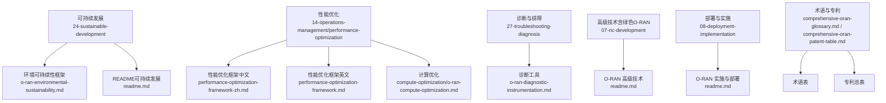
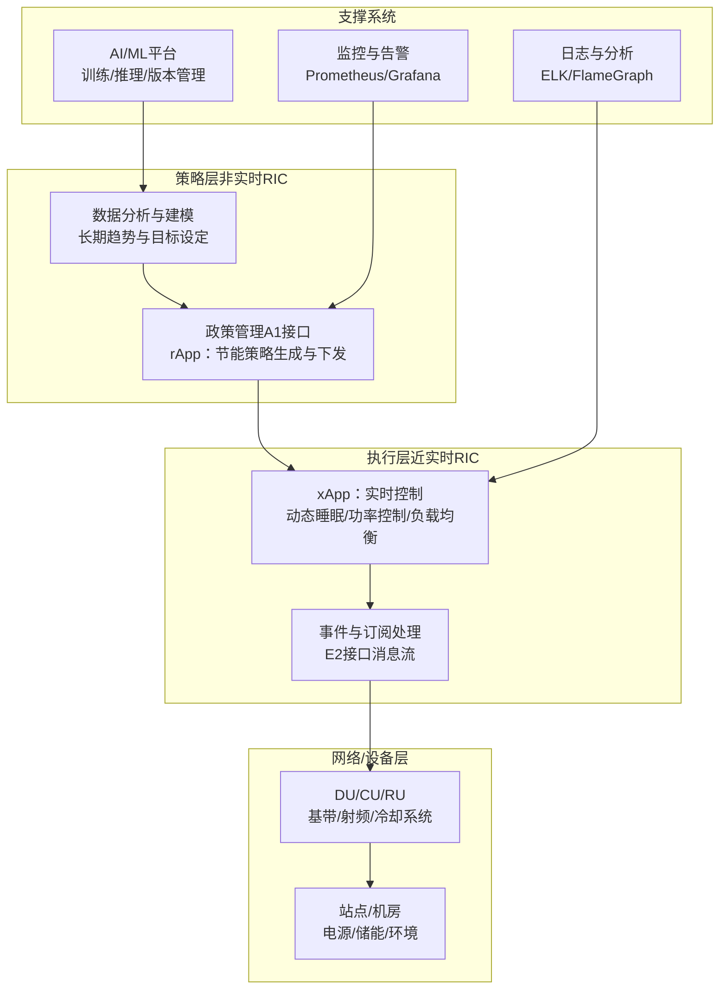
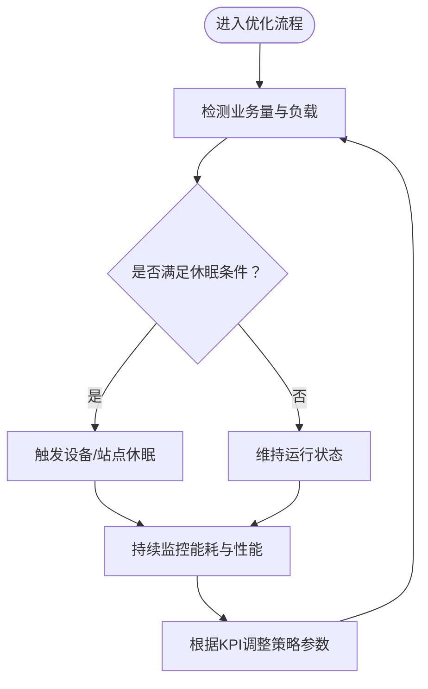
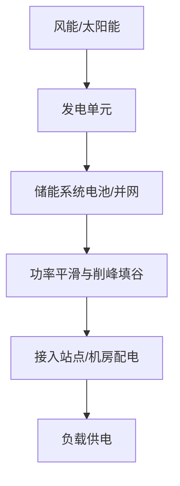
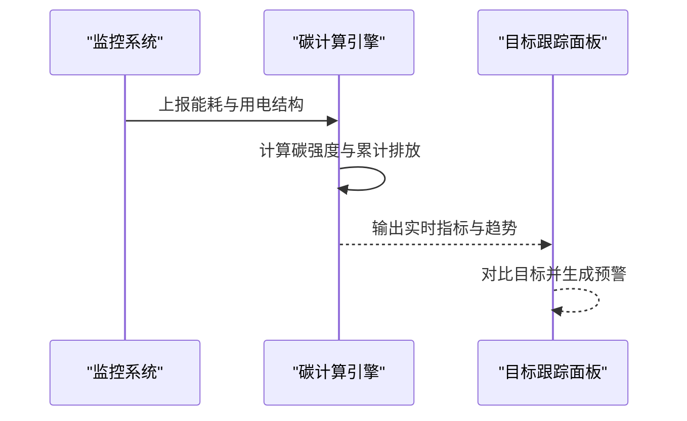
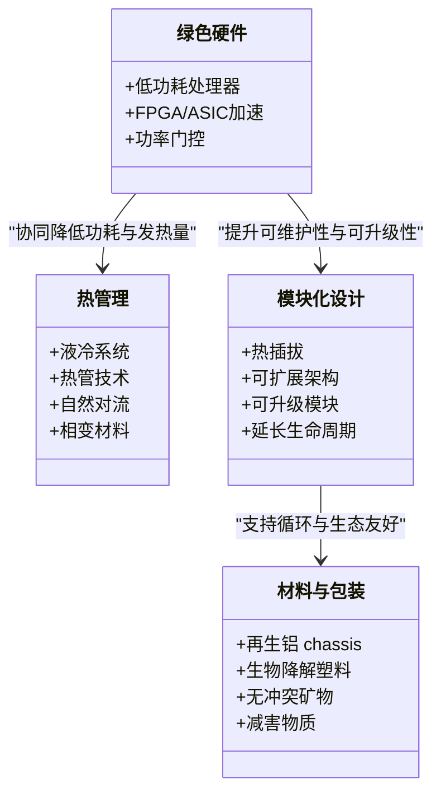
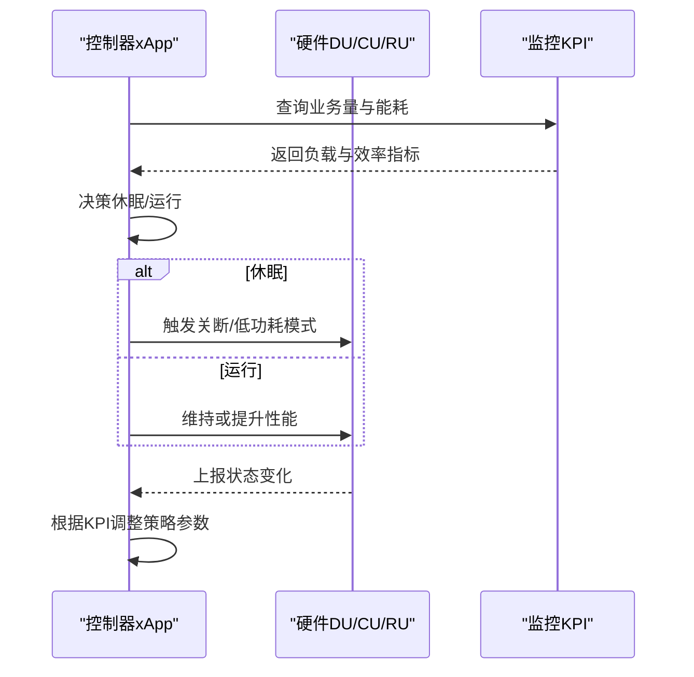

# 绿色通信技术

<cite>
**本文引用的文件**
- [README（可持续发展）](file://24-sustainable-development/readme.md)
- [环境可持续性框架](file://24-sustainable-development/environmental-protection/o-ran-environmental-sustainability.md)
- [O-RAN 性能优化框架（中文）](file://14-operations-management/performance-optimization/performance-optimization-framework-zh.md)
- [O-RAN 性能优化框架（英文）](file://14-operations-management/performance-optimization/performance-optimization-framework.md)
- [O-RAN 计算优化](file://26-performance-optimization/compute-optimization/o-ran-compute-optimization.md)
- [O-RAN 诊断工具](file://27-troubleshooting-diagnosis/diagnostic-tools/o-ran-diagnostic-instrumentation.md)
- [O-RAN 高级技术](file://07-ric-development/readme.md)
- [O-RAN 实施与部署](file://08-deployment-implementation/readme.md)
- [综合 O-RAN 术语表](file://comprehensive-oran-glossary.md)
- [专利总表](file://comprehensive-oran-patent-table.md)
</cite>

## 目录
1. [引言](#引言)
2. [项目结构](#项目结构)
3. [核心组件](#核心组件)
4. [架构总览](#架构总览)
5. [详细组件分析](#详细组件分析)
6. [依赖关系分析](#依赖关系分析)
7. [性能考量](#性能考量)
8. [故障排查指南](#故障排查指南)
9. [结论](#结论)
10. [附录](#附录)

## 引言
本文件面向O-RAN绿色通信技术，围绕能耗优化算法（动态功耗调节、负载感知节能、智能电源管理、能效优化策略）、可再生能源集成（太阳能/风能利用、储能系统、混合能源管理、平滑功率输出）、碳足迹监测（碳排放计算模型、环境影响评估、碳中和目标跟踪、可持续发展指标）、绿色基站设计（高效散热、环保材料、模块化、全生命周期评估）、以及智能休眠机制（基于业务量的休眠策略、唤醒延迟优化、睡眠状态管理、能效平衡）进行系统化技术分析。文档在保证技术深度的同时，力求以渐进方式呈现，兼顾非专业读者的理解需求。

## 项目结构
该仓库以主题域划分，绿色通信相关内容主要分布在“可持续发展”“性能优化”“运维与部署”“高级技术”等目录下。以下图示化展示与绿色通信相关的关键文件与主题分布：

**图表来源**
- [环境可持续性框架](file://24-sustainable-development/environmental-protection/o-ran-environmental-sustainability.md#L1-L285)
- [README（可持续发展）](file://24-sustainable-development/readme.md#L1-L65)
- [O-RAN 性能优化框架（中文）](file://14-operations-management/performance-optimization/performance-optimization-framework-zh.md#L1-L342)
- [O-RAN 性能优化框架（英文）](file://14-operations-management/performance-optimization/performance-optimization-framework.md#L1-L342)
- [O-RAN 计算优化](file://26-performance-optimization/compute-optimization/o-ran-compute-optimization.md#L61-L408)
- [O-RAN 诊断工具](file://27-troubleshooting-diagnosis/diagnostic-tools/o-ran-diagnostic-instrumentation.md#L6-L64)
- [O-RAN 高级技术](file://07-ric-development/readme.md#L1-L368)
- [O-RAN 实施与部署](file://08-deployment-implementation/readme.md#L1-L353)
- [综合 O-RAN 术语表](file://comprehensive-oran-glossary.md#L1-L200)
- [专利总表](file://comprehensive-oran-patent-table.md#L125-L136)

**章节来源**
- [README（可持续发展）](file://24-sustainable-development/readme.md#L1-L65)
- [环境可持续性框架](file://24-sustainable-development/environmental-protection/o-ran-environmental-sustainability.md#L1-L285)

## 核心组件
- 能耗优化与智能电源管理：覆盖动态睡眠机制、设备级节能、网络级协调、预测与机器学习优化。
- 可再生能源集成：太阳能/风能站点、混合微网、电池储能、削峰填谷与功率平滑。
- 碳足迹监测：实时能耗追踪、碳强度计算、排放因子数据库、目标设定与中和路径。
- 绿色硬件与设计：低功耗芯片/加速器、热管理创新、模块化与可升级、可持续材料。
- 生命周期评估与循环经济学：设计可拆卸、翻新认证、回收设施、零废运营。
- 智能休眠与能效平衡：基于业务量的站点/设备休眠、唤醒延迟优化、睡眠状态管理与多目标权衡。

**章节来源**
- [环境可持续性框架](file://24-sustainable-development/environmental-protection/o-ran-environmental-sustainability.md#L6-L50)
- [O-RAN 高级技术](file://07-ric-development/readme.md#L151-L169)

## 架构总览
绿色通信技术的系统架构由“策略层（非实时RIC）—执行层（近实时RIC）—网络/设备层”构成，结合AI/ML实现闭环优化。下图展示绿色O-RAN的总体交互关系与关键优化路径：

**图表来源**
- [O-RAN 高级技术](file://07-ric-development/readme.md#L1-L368)
- [O-RAN 实施与部署](file://08-deployment-implementation/readme.md#L94-L125)

## 详细组件分析

### 能耗优化与动态功耗调节
- 动态睡眠机制
  - 站点级：基于业务量的激活/休眠调度、预测性需求预测、机器学习优化。
  - 设备级：BBU智能关断、RF模块自适应功率控制、冷却系统优化。
  - 网络级：跨站点负载均衡、小区协作覆盖、集中资源管理。
- 能效优化策略
  - 计算层：NUMA感知亲和、进程优先级、内核调度器调优。
  - 网络层：巨帧、队列/分类、中断聚合、NUMA绑定。
  - 应用层：容器资源请求/限制、并发参数、健康探针。
- 监控与分析
  - CPU利用率、内存占用、上下文切换、系统中断、内核函数跟踪。
  - 文件系统与缓存、I/O调度器、NVMe优化、DMA与PCIe配置。

**图表来源**
- [环境可持续性框架](file://24-sustainable-development/environmental-protection/o-ran-environmental-sustainability.md#L10-L24)
- [O-RAN 性能优化框架（中文）](file://14-operations-management/performance-optimization/performance-optimization-framework-zh.md#L103-L234)
- [O-RAN 计算优化](file://26-performance-optimization/compute-optimization/o-ran-compute-optimization.md#L61-L408)

**章节来源**
- [环境可持续性框架](file://24-sustainable-development/environmental-protection/o-ran-environmental-sustainability.md#L10-L24)
- [O-RAN 性能优化框架（中文）](file://14-operations-management/performance-optimization/performance-optimization-framework-zh.md#L103-L234)
- [O-RAN 性能优化框架（英文）](file://14-operations-management/performance-optimization/performance-optimization-framework.md#L103-L234)
- [O-RAN 计算优化](file://26-performance-optimization/compute-optimization/o-ran-compute-optimization.md#L61-L408)

### 可再生能源集成与储能管理
- 太阳能/风能利用：屋顶安装、跟踪系统、微发电单元。
- 储能系统：锂电/并网存储、削峰填谷。
- 混合能源管理：风光互补、功率平滑输出。
- 电力质量与稳定性：峰值管理、电网互动、备用电源。

**图表来源**
- [环境可持续性框架](file://24-sustainable-development/environmental-protection/o-ran-environmental-sustainability.md#L24-L36)

**章节来源**
- [环境可持续性框架](file://24-sustainable-development/environmental-protection/o-ran-environmental-sustainability.md#L24-L36)

### 碳足迹监测与目标跟踪
- 实时排放追踪：能耗监控、碳强度计算、排放因子数据库。
- 目标设定：科学基础目标、年度减排承诺、进度看板。
- 中和路径：抵消计划、绿证、直接空气捕集投资。

**图表来源**
- [环境可持续性框架](file://24-sustainable-development/environmental-protection/o-ran-environmental-sustainability.md#L37-L49)

**章节来源**
- [环境可持续性框架](file://24-sustainable-development/environmental-protection/o-ran-environmental-sustainability.md#L37-L49)

### 绿色基站设计理念
- 低功耗硬件：ARM/FPGA/ASIC、功率门控。
- 热管理：液冷、热管、自然对流、相变材料。
- 模块化设计：热插拔、可扩展、可升级、延长寿命。
- 材料与包装：再生铝 chassis、生物降解塑料、无冲突矿物、减少有害物质。

**图表来源**
- [环境可持续性框架](file://24-sustainable-development/environmental-protection/o-ran-environmental-sustainability.md#L52-L75)

**章节来源**
- [环境可持续性框架](file://24-sustainable-development/environmental-protection/o-ran-environmental-sustainability.md#L52-L75)

### 智能休眠机制与能效平衡
- 业务量驱动的休眠：站点/设备按需启停、预测性调度、ML优化。
- 唤醒延迟优化：最小化业务恢复时间、预热策略、状态迁移。
- 睡眠状态管理：多级休眠、状态一致性、异常唤醒。
- 能效平衡：吞吐/延迟/能耗的多目标权衡、SLA保障。

**图表来源**
- [环境可持续性框架](file://24-sustainable-development/environmental-protection/o-ran-environmental-sustainability.md#L10-L24)
- [O-RAN 高级技术](file://07-ric-development/readme.md#L151-L169)

**章节来源**
- [环境可持续性框架](file://24-sustainable-development/environmental-protection/o-ran-environmental-sustainability.md#L10-L24)
- [O-RAN 高级技术](file://07-ric-development/readme.md#L151-L169)

## 依赖关系分析
- 策略层（A1/rApp）依赖数据分析与ML平台，输出节能政策。
- 执行层（E2/xApp）依赖近实时RIC平台，实时下发控制指令。
- 网络/设备层依赖电源与冷却系统、站点基础设施。
- 支撑系统（监控/日志/AI平台）贯穿全链路，提供可观测性与模型能力。

**图表来源**
- [O-RAN 高级技术](file://07-ric-development/readme.md#L1-L368)
- [O-RAN 实施与部署](file://08-deployment-implementation/readme.md#L94-L125)

**章节来源**
- [O-RAN 高级技术](file://07-ric-development/readme.md#L1-L368)
- [O-RAN 实施与部署](file://08-deployment-implementation/readme.md#L94-L125)

## 性能考量
- 计算层：NUMA拓扑感知、进程亲和、内核调度器参数调优，降低迁移成本与抖动。
- 网络层：巨帧、队列/分类、中断聚合、RSS与CPU亲和绑定，提升吞吐与降低延迟。
- 应用层：容器资源请求/限制、并发参数、健康探针，避免过载与资源争用。
- 文件系统与I/O：调度器选择、缓存与页缓存参数、直通I/O权衡，匹配业务特征。
- 诊断与观测：系统/进程/内核级工具链，定位瓶颈与异常。

**章节来源**
- [O-RAN 性能优化框架（中文）](file://14-operations-management/performance-optimization/performance-optimization-framework-zh.md#L1-L342)
- [O-RAN 性能优化框架（英文）](file://14-operations-management/performance-optimization/performance-optimization-framework.md#L1-L342)
- [O-RAN 计算优化](file://26-performance-optimization/compute-optimization/o-ran-compute-optimization.md#L61-L408)

## 故障排查指南
- 硬件诊断：CPU/内存/存储/电源测试、温度/风扇/UPS健康检查、物理安全核查。
- 网络诊断：网卡状态/Offload/MTU/中断聚合、RSS/队列/调度器、链路连通性。
- 环境监测：温度/湿度/冷却/功耗测量、设备功耗分解分析。
- 工具链：Wireshark/tcpdump、协议分析、日志分析、性能火焰图、内核函数跟踪。

**章节来源**
- [O-RAN 诊断工具](file://27-troubleshooting-diagnosis/diagnostic-tools/o-ran-diagnostic-instrumentation.md#L6-L64)

## 结论
通过策略层与执行层的协同、AI/ML的闭环优化、以及全栈性能与可观测性的支撑，O-RAN绿色通信技术可在保证服务质量的前提下显著降低能耗与碳排放。结合可再生能源与储能系统，实现站点与网络的低碳运行；通过生命周期评估与循环经济学实践，推动全行业向可持续发展转型。智能休眠与能效平衡技术则确保在动态业务场景下的稳定与高效。

## 附录
- 术语与专利索引
  - 术语：参考综合术语表中的相关条目，如“绿色O-RAN”“可再生能源集成”“碳足迹监测”等。
  - 专利：专利总表中包含“可再生能源集成”“碳足迹监测”等专利条目，可用于技术布局与合规参考。

**章节来源**
- [综合 O-RAN 术语表](file://comprehensive-oran-glossary.md#L1-L200)
- [专利总表](file://comprehensive-oran-patent-table.md#L125-L136)