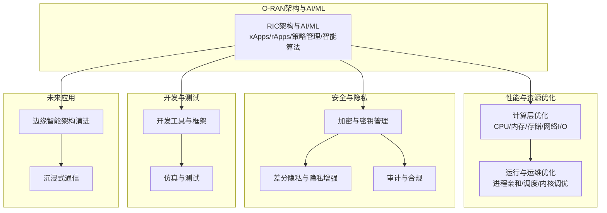
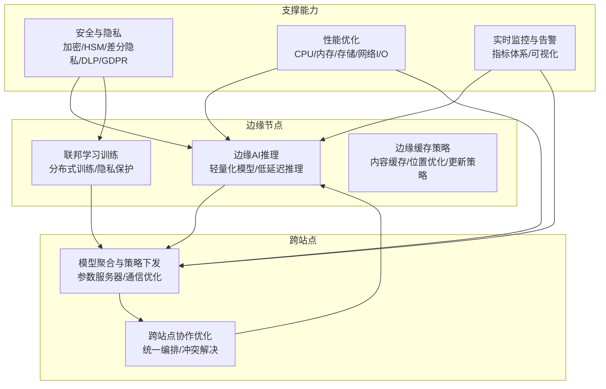
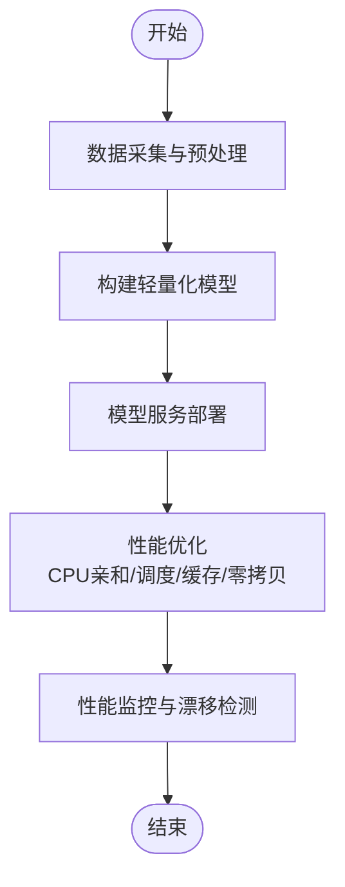
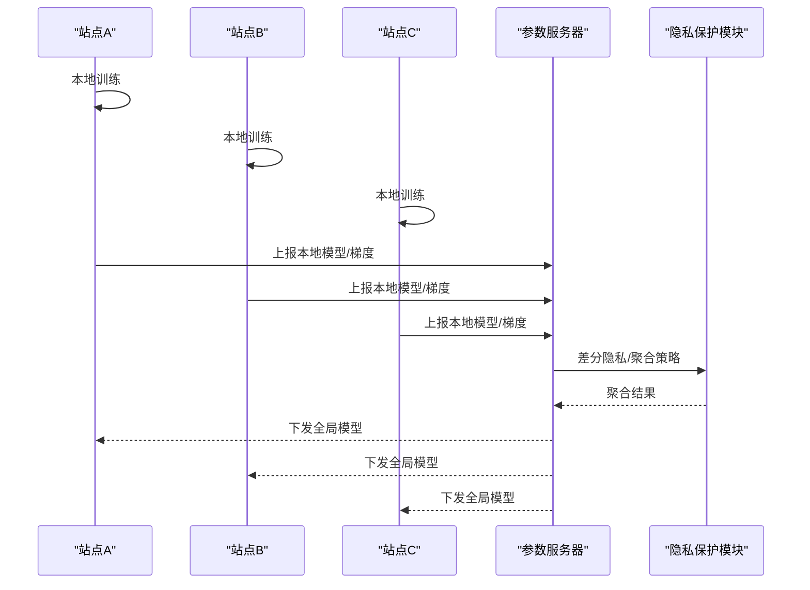
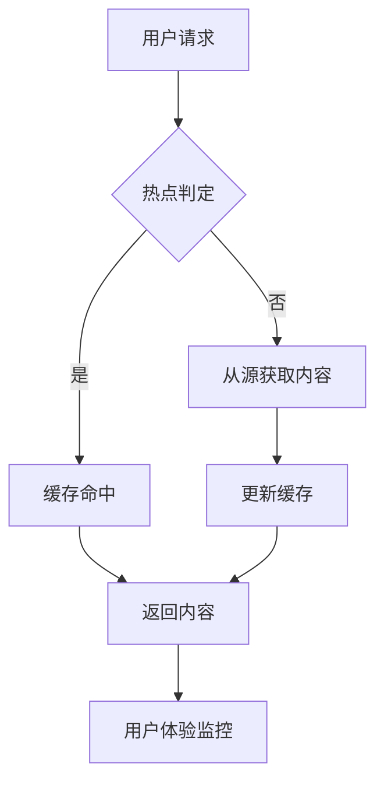
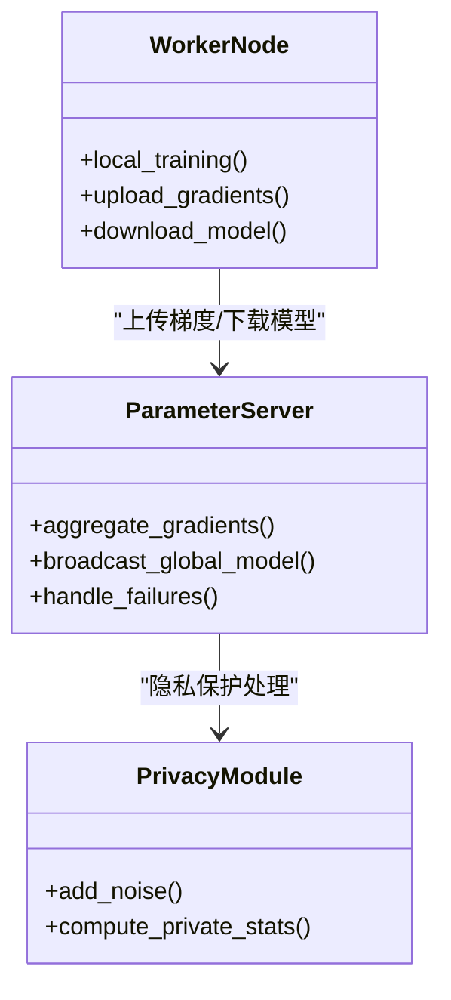
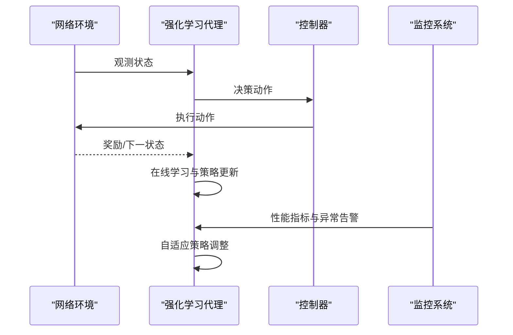
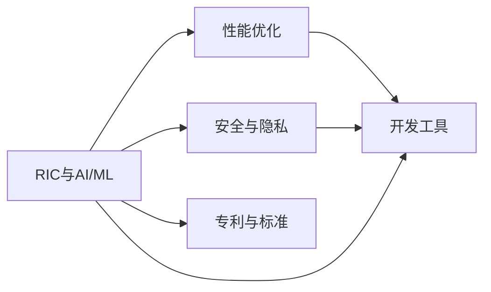

# 边缘智能技术

<cite>
**本文引用的文件**
- [README（O-RAN高级技术）](file://07-ric-development/readme.md)
- [O-RAN计算层优化](file://26-performance-optimization/compute-optimization/o-ran-compute-optimization.md)
- [O-RAN数据保护框架](file://12-security-privacy/data-protection/data-protection-framework.md)
- [O-RAN开发工具包](file://22-tool-platforms/development-tools/o-ran-development-toolkit.md)
- [O-RAN专利总表](file://comprehensive-oran-patent-table.md)
- [未来应用路线图（新兴应用）](file://15-future-development/emerging-applications/emerging-applications-roadmap.md)
- [性能优化框架（中文）](file://14-operations-management/performance-optimization/performance-optimization-framework-zh.md)
</cite>

## 目录
1. [简介](#简介)
2. [项目结构](#项目结构)
3. [核心组件](#核心组件)
4. [架构总览](#架构总览)
5. [详细组件分析](#详细组件分析)
6. [依赖关系分析](#依赖关系分析)
7. [性能考量](#性能考量)
8. [故障排查指南](#故障排查指南)
9. [结论](#结论)
10. [附录](#附录)

## 简介
本文件面向O-RAN边缘智能技术，围绕以下主题形成系统化技术文档：边缘AI推理优化（轻量化模型、低延迟推理、模型压缩）、联邦学习在无线接入网的应用（分布式训练、隐私保护、模型聚合、跨站点协作）、边缘缓存策略（内容缓存、缓存位置与更新、用户体验提升）、分布式机器学习架构（分布式训练框架、参数服务器、通信优化、容错）、以及实时智能决策制定（在线决策、自适应策略、实时监控与智能优化）。文档基于仓库现有资料进行归纳与可视化呈现，帮助读者快速理解并落地相关能力。

## 项目结构
本仓库包含O-RAN架构、接口标准、核心组件、安全与隐私、性能优化、开发工具、未来应用等多个维度的知识资产。与边缘智能直接相关的内容主要分布在：
- RIC与AI/ML：包含xApps/rApps、智能算法、策略管理、性能优化等
- 计算层优化：覆盖CPU/内存/存储/网络I/O的系统级优化
- 安全与隐私：加密、密钥管理、差分隐私、合规与审计
- 开发工具：容器化、仿真、测试、API与ML框架集成
- 未来应用：边缘智能架构演进、沉浸式通信、AI原生O-RAN

图表来源
- [README（O-RAN高级技术）](file://07-ric-development/readme.md#L1-L368)
- [O-RAN计算层优化](file://26-performance-optimization/compute-optimization/o-ran-compute-optimization.md#L1-L473)
- [O-RAN数据保护框架](file://12-security-privacy/data-protection/data-protection-framework.md#L1-L376)
- [O-RAN开发工具包](file://22-tool-platforms/development-tools/o-ran-development-toolkit.md#L1-L488)
- [未来应用路线图（新兴应用）](file://15-future-development/emerging-applications/emerging-applications-roadmap.md#L1-L800)

章节来源
- file://07-ric-development/readme.md#L1-L368
- file://26-performance-optimization/compute-optimization/o-ran-compute-optimization.md#L1-L473
- file://12-security-privacy/data-protection/data-protection-framework.md#L1-L376
- file://22-tool-platforms/development-tools/o-ran-development-toolkit.md#L1-L488
- file://15-future-development/emerging-applications/emerging-applications-roadmap.md#L1-L800

## 核心组件
- RIC与AI/ML：包含xApps/rApps开发、策略管理、智能算法（监督/无监督/强化学习/联邦学习）、异常检测、预测性维护、自动优化等
- 计算层优化：CPU调度策略、NUMA感知、缓存与TLB优化、内存池与垃圾回收、数据库与NoSQL优化、文件系统与I/O调度、零拷贝与内核旁路
- 安全与隐私：数据静止/传输加密、HSM密钥管理、差分隐私、DLP策略、GDPR合规、审计日志
- 开发与测试：IDE配置、Git工作流、静态分析、容器与Kubernetes、API设计与测试、ML框架集成（TensorFlow/Keras）
- 未来应用：边缘智能架构演进、AI原生O-RAN、沉浸式通信、智慧城市等

章节来源
- file://07-ric-development/readme.md#L99-L123
- file://26-performance-optimization/compute-optimization/o-ran-compute-optimization.md#L6-L167
- file://12-security-privacy/data-protection/data-protection-framework.md#L6-L376
- file://22-tool-platforms/development-tools/o-ran-development-toolkit.md#L6-L488
- file://15-future-development/emerging-applications/emerging-applications-roadmap.md#L284-L337

## 架构总览
下图展示边缘智能在O-RAN中的端到端架构：从边缘节点的AI推理与联邦学习，到跨站点的模型聚合与策略下发，再到安全与隐私保障、性能优化与监控。

图表来源
- [README（O-RAN高级技术）](file://07-ric-development/readme.md#L99-L123)
- [O-RAN计算层优化](file://26-performance-optimization/compute-optimization/o-ran-compute-optimization.md#L1-L473)
- [O-RAN数据保护框架](file://12-security-privacy/data-protection/data-protection-framework.md#L1-L376)
- [O-RAN开发工具包](file://22-tool-platforms/development-tools/o-ran-development-toolkit.md#L1-L488)
- [未来应用路线图（新兴应用）](file://15-future-development/emerging-applications/emerging-applications-roadmap.md#L284-L337)

## 详细组件分析

### 组件A：边缘AI推理优化（轻量化模型、低延迟推理、模型压缩）
- 轻量化模型与推理
  - 使用TensorFlow/Keras构建推理模型，结合特征工程与预处理，部署模型服务与性能监控
  - 结合缓存与内存优化，减少推理时延与资源占用
- 低延迟推理
  - CPU亲和性绑定、进程优先级、内核调度器调优，降低上下文切换与迁移成本
  - 内存与缓存优化（L1/L2/TLB/NUMA），提升数据局部性与命中率
  - 零拷贝与内核旁路（DPDK/AF_XDP/io_uring），减少系统调用与拷贝开销
- 模型压缩与硬件加速
  - 模型压缩、量化与硬件加速技术（见专利：边缘AI推理优化）

图表来源
- [O-RAN开发工具包](file://22-tool-platforms/development-tools/o-ran-development-toolkit.md#L368-L415)
- [O-RAN计算层优化](file://26-performance-optimization/compute-optimization/o-ran-compute-optimization.md#L6-L167)
- [O-RAN专利总表](file://comprehensive-oran-patent-table.md#L87-L91)

章节来源
- file://22-tool-platforms/development-tools/o-ran-development-toolkit.md#L368-L415
- file://26-performance-optimization/compute-optimization/o-ran-compute-optimization.md#L6-L167
- file://comprehensive-oran-patent-table.md#L87-L91

### 组件B：联邦学习在无线接入网中的应用
- 分布式训练与隐私保护
  - 联邦学习框架在多RAN节点间进行分布式训练，保护本地数据隐私
  - 差分隐私机制（拉普拉斯/高斯机制）在统计查询中添加噪声，满足差分隐私
- 模型聚合与跨站点协作
  - 参数服务器/聚合策略（加权平均/压缩梯度/差分隐私保证）
  - 跨站点策略冲突检测与自动/手动解决流程
- 实时性能与稳定性
  - 持续训练与模型版本管理、回滚与监控，避免极端决策与保留人工干预

图表来源
- [README（O-RAN高级技术）](file://07-ric-development/readme.md#L99-L105)
- [O-RAN数据保护框架](file://12-security-privacy/data-protection/data-protection-framework.md#L186-L249)
- [O-RAN专利总表](file://comprehensive-oran-patent-table.md#L82-L85)

章节来源
- file://07-ric-development/readme.md#L99-L105
- file://12-security-privacy/data-protection/data-protection-framework.md#L186-L249
- file://comprehensive-oran-patent-table.md#L82-L85

### 组件C：边缘缓存策略（内容缓存、缓存位置、更新策略、用户体验）
- 内容缓存与位置优化
  - 基于用户分布与热点内容的缓存位置选择，结合预测性缓存（预见性内容/服务预置）
- 缓存更新策略
  - 基于内容新鲜度、访问频率与网络状态的更新与淘汰策略
- 用户体验提升
  - 低延迟AR/VR/全息通信场景下的缓存与带宽动态分配、上下文感知优化

图表来源
- [未来应用路线图（新兴应用）](file://15-future-development/emerging-applications/emerging-applications-roadmap.md#L284-L337)
- [O-RAN开发工具包](file://22-tool-platforms/development-tools/o-ran-development-toolkit.md#L368-L415)

章节来源
- file://15-future-development/emerging-applications/emerging-applications-roadmap.md#L284-L337
- file://22-tool-platforms/development-tools/o-ran-development-toolkit.md#L368-L415

### 组件D：分布式机器学习架构（参数服务器、通信优化、容错）
- 分布式训练框架
  - 多节点分布式训练，参数服务器协调，梯度/模型聚合
- 通信优化
  - 压缩梯度、批量聚合、异步更新、带宽感知的动态分配
- 容错与一致性
  - 故障检测与恢复、重试与幂等、版本控制与回滚

图表来源
- [O-RAN专利总表](file://comprehensive-oran-patent-table.md#L163-L167)
- [O-RAN数据保护框架](file://12-security-privacy/data-protection/data-protection-framework.md#L186-L249)

章节来源
- file://comprehensive-oran-patent-table.md#L163-L167
- file://12-security-privacy/data-protection/data-protection-framework.md#L186-L249

### 组件E：实时智能决策制定（在线决策、自适应策略、监控与优化）
- 在线决策与自适应策略
  - 强化学习代理在资源分配、路由、功率控制等场景进行在线决策
  - 自适应探索与奖励函数，结合环境感知与用户上下文
- 实时性能监控与智能优化
  - 指标体系与可视化，异常检测与自动响应，持续优化与基线对比

图表来源
- [未来应用路线图（新兴应用）](file://15-future-development/emerging-applications/emerging-applications-roadmap.md#L61-L177)
- [README（O-RAN高级技术）](file://07-ric-development/readme.md#L118-L123)

章节来源
- file://15-future-development/emerging-applications/emerging-applications-roadmap.md#L61-L177
- file://07-ric-development/readme.md#L118-L123

## 依赖关系分析
- 组件耦合与内聚
  - RIC与AI/ML模块内聚度高，围绕xApps/rApps与策略管理形成闭环
  - 性能优化贯穿系统各层（CPU/内存/存储/网络），与AI/ML推理强耦合
  - 安全与隐私作为横切关注点，贯穿联邦学习、缓存与监控
- 外部依赖与集成
  - 开发工具链：容器、Kubernetes、API测试、仿真平台
  - 标准与规范：O-RAN、3GPP、ETSI、OpenAPI
  - 专利与标准必要专利：为技术布局与合规提供依据

图表来源
- [README（O-RAN高级技术）](file://07-ric-development/readme.md#L1-L368)
- [O-RAN开发工具包](file://22-tool-platforms/development-tools/o-ran-development-toolkit.md#L1-L488)
- [O-RAN专利总表](file://comprehensive-oran-patent-table.md#L1-L258)

章节来源
- file://07-ric-development/readme.md#L1-L368
- file://22-tool-platforms/development-tools/o-ran-development-toolkit.md#L1-L488
- file://comprehensive-oran-patent-table.md#L1-L258

## 性能考量
- CPU/内存/存储/网络I/O系统级优化
  - CPU调度策略（实时/轮转/默认）、NUMA感知、容器级CPU管理
  - 缓存与TLB优化、内存池与垃圾回收、数据库与NoSQL优化
  - 文件系统与I/O调度、零拷贝与内核旁路
- 运行时优化
  - 进程亲和性绑定、优先级设置、内核调度器调优
  - 网络中断合并与批处理、DMA引擎与PCIe配置
- 监控与分析
  - 系统级与进程级诊断工具、内核跟踪、性能基线与趋势分析

章节来源
- file://26-performance-optimization/compute-optimization/o-ran-compute-optimization.md#L6-L473
- file://14-operations-management/performance-optimization/performance-optimization-framework-zh.md#L103-L234

## 故障排查指南
- 安全与隐私
  - 加密与密钥管理：HSM集成、密钥派生与加密流程
  - 差分隐私：噪声添加与统计计算，隐私参数设置
  - DLP与合规：分类规则、端点保护、网络监控与审计
- 性能问题
  - CPU亲和性与调度：进程映射、优先级、内核调度器参数
  - I/O瓶颈：中断合并、RSS队列、DMA与PCIe配置
- 开发与测试
  - CI/CD流水线：代码质量检查、安全扫描、容器镜像构建
  - API测试与契约测试：Postman集合、Newman、消费者驱动契约

章节来源
- file://12-security-privacy/data-protection/data-protection-framework.md#L6-L376
- file://14-operations-management/performance-optimization/performance-optimization-framework-zh.md#L103-L234
- file://22-tool-platforms/development-tools/o-ran-development-toolkit.md#L417-L488

## 结论
本文件基于仓库现有资料，对O-RAN边缘智能技术进行了系统化梳理与可视化呈现。围绕边缘AI推理优化、联邦学习、边缘缓存、分布式机器学习与实时智能决策五大方向，给出了架构视图、关键流程与依赖关系，并提供了性能与安全方面的实践建议。建议在实际部署中结合具体场景，采用渐进式优化与持续监控，确保在低延迟、高可靠与隐私安全的前提下实现智能化升级。

## 附录
- 相关专利与标准
  - 边缘AI推理优化、联邦学习网络优化、分布式机器学习、实时智能决策等专利
  - 3GPP、ETSI、O-RAN联盟标准与SEPs布局

章节来源
- file://comprehensive-oran-patent-table.md#L75-L172