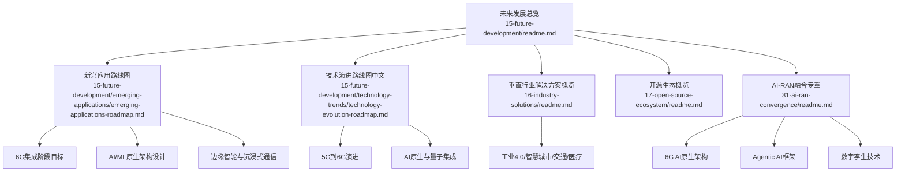
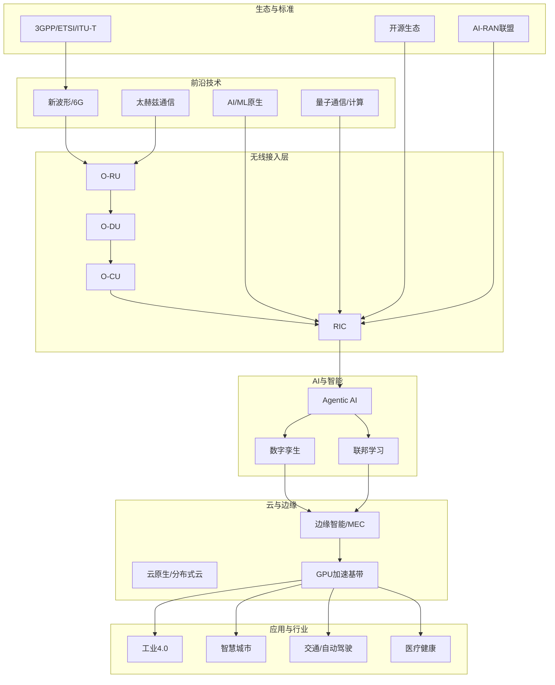
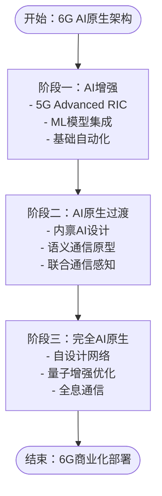
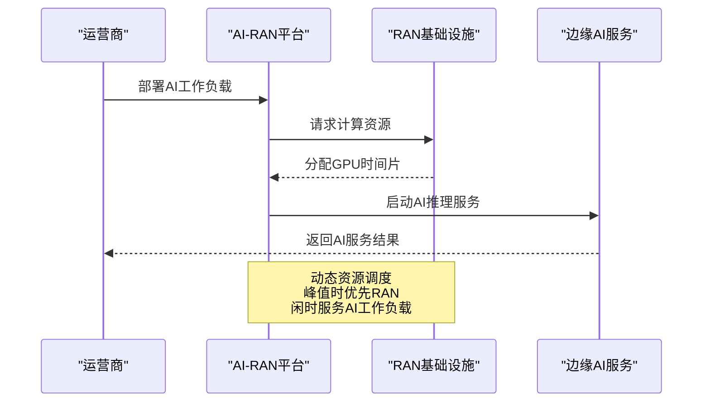
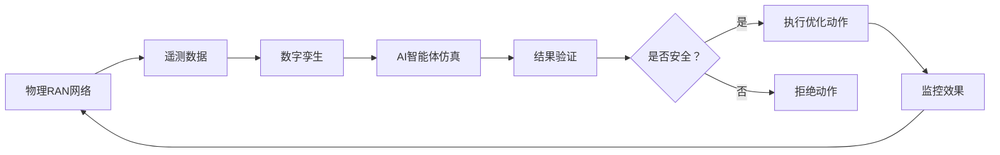
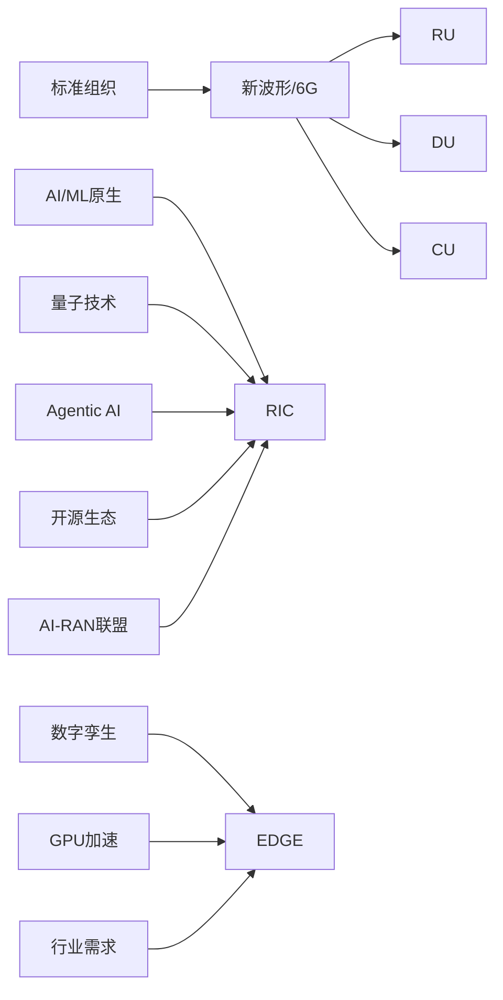

# 未来发展

<cite>
**本文引用的文件**
- [未来发展方向总览](file://15-future-development/readme.md)
- [新兴应用路线图](file://15-future-development/emerging-applications/emerging-applications-roadmap.md)
- [技术演进路线图（中文）](file://15-future-development/technology-trends/technology-evolution-roadmap.md)
- [垂直行业解决方案概览](file://16-industry-solutions/readme.md)
- [开源生态概览](file://17-open-source-ecosystem/readme.md)
- [6G AI原生架构](file://31-ai-ran-convergence/6g-ai-native/readme.md)
- [AI-RAN融合概览](file://31-ai-ran-convergence/readme.md)
- [RAN中的Agentic AI](file://31-ai-ran-convergence/agentic-ai/readme-zh.md)
- [RAN数字孪生](file://31-ai-ran-convergence/digital-twin/readme-zh.md)
</cite>

## 更新摘要
**所做更改**
- 新增6G AI原生架构路线图章节，详细阐述从AI增强到AI原生的演进路径
- 整合AI-RAN融合的三大范式：AI-for-RAN、AI-on-RAN、AI-with-RAN
- 更新新兴应用场景，重点突出Agentic AI和数字孪生在6G中的应用
- 强化边缘智能与沉浸式通信的技术实现细节
- 增加2026年AI-RAN产业里程碑和商业化进展
- 完善量子通信与计算在6G网络中的集成方案

## 目录
1. [引言](#引言)
2. [项目结构](#项目结构)
3. [核心组件](#核心组件)
4. [架构总览](#架构总览)
5. [详细组件分析](#详细组件分析)
6. [依赖关系分析](#依赖关系分析)
7. [性能考虑](#性能考虑)
8. [故障排查指南](#故障排查指南)
9. [结论](#结论)
10. [附录](#附录)

## 引言
本文件面向O-RAN面向未来的前瞻性内容，系统梳理从5G到6G的演进路径、AI原生架构、量子通信集成等前沿技术，深入分析6G集成路线图、AI/ML原生架构、沉浸式通信等变革性应用，并结合边缘智能、绿色通信、数字孪生等新兴技术的发展前景，覆盖工业4.0、智慧城市、联网自动驾驶等创新应用的未来展望。同时，总结研究前沿动态（新波形、网络智能化、架构创新），并分析市场前景与商业机会（商业模式创新、投资机会、竞争格局变化）。

**最新更新**：基于2026年AI-RAN融合的最新发展，重点整合了NVIDIA ARC平台、SoftBank商业化部署、O-RAN联盟71项技术规范更新等关键进展，以及Agentic AI框架和数字孪生技术在6G网络中的深度应用。

## 项目结构
围绕"未来发展"的主题，仓库中与之直接相关的知识域主要分布在以下目录：
- 未来发展方向总览：概述6G演进、AI原生、量子技术、边缘智能、绿色通信、数字孪生、新兴应用、研究前沿、标准进展、市场前景与挑战。
- 新兴应用路线图：以6G集成、AI/ML原生架构、边缘计算、沉浸式通信为主线，给出阶段性目标、技术要求与交付物。
- 技术演进路线图（中文）：聚焦从5G到6G的关键技术突破、AI原生架构、量子通信集成及典型应用场景。
- 垂直行业解决方案概览：覆盖制造、能源、交通、医疗、教育等行业的O-RAN应用与实施策略。
- 开源生态概览：汇总O-RAN相关开源平台、项目与开发者工具，支撑技术创新与生态建设。
- **新增**：AI-RAN融合专章：涵盖6G AI原生架构、Agentic AI、数字孪生、产业生态等最新发展。



**图表来源**
- [未来发展方向总览:1-242](file://15-future-development/readme.md#L1-L242)
- [新兴应用路线图:1-879](file://15-future-development/emerging-applications/emerging-applications-roadmap.md#L1-L879)
- [技术演进路线图（中文）:1-68](file://15-future-development/technology-trends/technology-evolution-roadmap.md#L1-L68)
- [AI-RAN融合概览:1-177](file://31-ai-ran-convergence/readme.md#L1-L177)

**章节来源**
- [未来发展方向总览:1-242](file://15-future-development/readme.md#L1-L242)
- [新兴应用路线图:1-879](file://15-future-development/emerging-applications/emerging-applications-roadmap.md#L1-L879)
- [技术演进路线图（中文）:1-68](file://15-future-development/technology-trends/technology-evolution-roadmap.md#L1-L68)
- [AI-RAN融合概览:1-177](file://31-ai-ran-convergence/readme.md#L1-L177)

## 核心组件
- **6G集成与新波形技术**：面向6G的频谱扩展（含太赫兹）、全息通信、智能超表面、空天地一体化、语义通信等。
- **AI/ML原生架构**：内生智能设计、自主网络管理、智能资源调度、预测性维护、自适应优化；融合联邦学习、边缘智能、强化学习、数字孪生。
- **Agentic AI框架**：多尺度智能体架构（战略层-战术层-反应层）、LLM驱动的网络自治、安全护栏机制、跨层级协调。
- **量子通信与计算**：量子密钥分发、量子安全认证、后量子密码迁移、量子增强的网络优化与信号处理。
- **边缘智能与沉浸式通信**：分布式智能架构、认知边缘网络、沉浸式体验（空间音频、全息显示、触觉反馈）与上下文感知优化。
- **数字孪生技术**：NVIDIA AODT平台、6G-TWIN框架、实时同步机制、AI模型训练环境、闭环优化控制。
- **绿色通信与数字孪生**：能耗优化、可再生能源集成、碳足迹监测、绿色基站设计、智能休眠机制；网络数字孪生、实时仿真与预测、虚拟化测试环境。
- **行业应用**：工业4.0（智能制造、工业物联网、预测性维护、数字孪生工厂）、智慧城市（智能交通、智慧能源、公共安全、环境监测）、联网自动驾驶（V2X、协同驾驶、高精定位、实时决策）。
- **研究前沿**：OTFS、IRS、大规模MIMO增强、毫米波突破、可见光通信、自主网络、零接触管理、智能频谱共享、动态切片、认知无线电、cell-free Massive MIMO、分布式云、区块链、去中心化身份、分布式存储。
- **标准化与生态**：3Gpp Release 18-20、O-RAN联盟未来规范、ETSI/IEEE/ITU-T参与、开源社区与产学研协作、国际科技转移路径。
- **市场与商业**：网络即服务（NaaS）、切片即服务（SlaaS）、边缘计算服务、AI能力开放平台、数据变现模型；投资机会与竞争格局演变。

**章节来源**
- [未来发展方向总览:1-242](file://15-future-development/readme.md#L1-L242)
- [新兴应用路线图:1-879](file://15-future-development/emerging-applications/emerging-applications-roadmap.md#L1-L879)
- [6G AI原生架构:1-298](file://31-ai-ran-convergence/6g-ai-native/readme.md#L1-L298)
- [AI-RAN融合概览:1-177](file://31-ai-ran-convergence/readme.md#L1-L177)

## 架构总览
下图展示O-RAN在未来网络中的演进架构：以软件定义、云原生、边缘智能为核心，向上对接6G新波形与量子安全，向下覆盖工业、城市、交通、医疗等垂直场景，并通过开源生态与标准化组织形成协同创新闭环。



**图表来源**
- [未来发展方向总览:1-242](file://15-future-development/readme.md#L1-L242)
- [AI-RAN融合概览:120-147](file://31-ai-ran-convergence/readme.md#L120-L147)
- [6G AI原生架构:200-207](file://31-ai-ran-convergence/6g-ai-native/readme.md#L200-L207)

## 详细组件分析

### 6G AI原生架构路线图

**更新**：基于2026年最新进展，6G AI原生架构已从概念验证进入商业化准备阶段。

#### 从AI增强到AI原生的演进路径

| 代际 | AI角色 | 架构特点 | 代表案例 |
|:---|:---|:---|:---|
| **4G** | 无AI | 手动优化 | 工程师调整参数 |
| **5G（早期）** | AI辅助 | ML模型附加到现有RAN | xApp使用DRL节能 |
| **5G-Advanced** | AI增强 | AI集成到RIC框架 | 智能体AI代理、多模型 |
| **6G** | **AI原生** | AI是RAN设计的内在组成部分 | 自设计、自愈合网络 |

#### 六大核心原则

1. **AI设计的物理层**：神经网络信道编码替代LDPC/Polar码、学习波形针对特定部署场景优化、AI生成调制方案实时适应信道条件、端到端自动编码器方法联合优化收发器。

2. **自组织智能**：零接触网络管理、自主修复、持续学习、联邦智能。

3. **语义通信**：超越香农信息论的语义级通信、AI编码数据含义而非比特、大幅带宽减少。

4. **全息波束赋形**：超大规模MIMO数千天线元件、AI实时控制每个元件、神经网络的三维波束模式塑造、亚毫秒移动用户波束适配。

5. **物理信息机器学习**：神经网络约束麦克斯韦方程、天线阵列物理约束的波束成形、监管和设备限制的功率控制。

6. **太赫兹AI**：140GHz通信的AI优化波束赋形、深度学习稀疏信道恢复、Transformer波束方向预测。



**图表来源**
- [6G AI原生架构:253-281](file://31-ai-ran-convergence/6g-ai-native/readme.md#L253-L281)

**章节来源**
- [6G AI原生架构:1-298](file://31-ai-ran-convergence/6g-ai-native/readme.md#L1-L298)
- [技术演进路线图（中文）:8-21](file://15-future-development/technology-trends/technology-evolution-roadmap.md#L8-L21)

### AI-RAN融合三大范式

**更新**：2026年AI-RAN融合已明确分为三个成熟度不同的范式，推动从研究向商业化的转变。

#### 三大范式对比

| 范式 | 定义 | 2026成熟度 | 关键示例 |
|:---|:---|:---|:---|
| **AI-for-RAN** | AI优化RAN功能（调度、波束赋形、移动性） | **生产部署** | xApp使用DRL节能 |
| **AI-on-RAN** | RAN基础设施托管第三方AI工作负载（边缘AI即服务） | **早期商业化** | NVIDIA ARC在站点运行推理 |
| **AI-with-RAN** | AI和RAN在同一GPU上动态共享计算资源 | **演示验证** | Nokia + NVIDIA MWC 2026现场演示 |

#### 2026年关键里程碑

- **NVIDIA ARC平台**：ARC-Compact 72W L4 GPU + Grace CPU用于站点部署、cuMAC GPU加速L2 MAC调度器、Aerial SDK CUDA基RAN软件栈、$1B投资Nokia开发AI-RAN。
- **SoftBank商业化**：全球首个AI-RAN商业部署计划，预计2026年推出。
- **O-RAN联盟规范**：71项新/更新技术规范，重点WG11安全、WG7 AI/ML框架。
- **产业投资**：NVIDIA $1B投资Nokia、LITEON DGX Spark兼容O-RAN、VIAVI数字孪生测试。



**图表来源**
- [AI-RAN融合概览:13-41](file://31-ai-ran-convergence/readme.md#L13-L41)
- [6G AI原生架构:195-205](file://31-ai-ran-convergence/6g-ai-native/readme.md#L195-L205)

**章节来源**
- [AI-RAN融合概览:1-177](file://31-ai-ran-convergence/readme.md#L1-L177)
- [6G AI原生架构:1-298](file://31-ai-ran-convergence/6g-ai-native/readme.md#L1-L298)

### Agentic AI框架

**更新**：多尺度Agentic AI框架代表了O-RAN网络智能的下一代演进，从预设规则转向LLM驱动的自主智能体。

#### 三层智能体架构

```
┌─────────────────────────────────────────────────────────────┐
│ 第1层：战略智能体（Non-RT RIC，>1s时间尺度）              │
│  • LLM驱动的推理和规划                                    │
│  • 长期策略生成                                          │
│  • 跨网络优化策略                                        │
│  • 意图翻译（自然语言 → 策略）                           │
├─────────────────────────────────────────────────────────────┤
│ 第2层：战术智能体（Near-RT RIC，10ms-1s时间尺度）        │
│  • 基于DRL/RL的实时决策                                  │
│  • 解释来自第1层的战略策略                               │
│  • 通过E2接口执行优化动作                                │
│  • 多智能体干扰管理协调                                  │
├─────────────────────────────────────────────────────────────┤
│ 第3层：反应智能体（分布式单元，<10ms）                    │
│  • 超低延迟信号处理                                      │
│  • 实时波束赋形和调度                                    │
│  • GPU加速基带（cuMAC）                                  │
│  • 安全护栏执行                                          │
└─────────────────────────────────────────────────────────────┘
```

#### 从xApps/rApps到自主智能体的演进

| 维度 | 传统xApp | Agentic AI智能体 |
|:---|:---|:---|
| **逻辑** | 预设规则 + ML模型 | LLM推理 + ML执行 |
| **适应性** | 固定行为集 | 生成新策略 |
| **范围** | 单一优化任务 | 多目标协调 |
| **交互** | 被动（响应事件） | 主动（预判问题） |
| **可解释性** | 基于日志 | 自然语言推理链 |

#### 安全护栏机制

四层安全防护确保电信领域Agentic AI的安全性：
1. **法规合规层**：FCC/CE规则执行、功率发射限制、紧急服务保障
2. **运营商策略层**：最大参数变化界限、最小覆盖要求、SLA违规预防
3. **数字孪生预验证层**：执行前仿真动作、检查预期结果、拒绝负面影响的动作
4. **硬编码安全限制层**：物理参数界限、每时间单位最大变化率、紧急停止/手动覆盖

**章节来源**
- [RAN中的Agentic AI:1-323](file://31-ai-ran-convergence/agentic-ai/readme-zh.md#L1-L323)
- [AI-RAN融合概览:61-67](file://31-ai-ran-convergence/readme.md#L61-L67)

### 数字孪生技术

**更新**：数字孪生已从静态仿真工具演变为AI-RAN控制循环中的积极参与者，支持闭环优化和AI智能体验证。

#### 数字孪生成熟度模型（2026）

| 等级 | 名称 | 能力 | 示例 |
|:---|:---|:---|:---|
| **L1** | 描述性 | 可视化当前状态 | 网络拓扑仪表板 |
| **L2** | 诊断性 | 识别问题 | 异常根因分析 |
| **L3** | 预测性 | 预测未来状态 | 流量预测、故障预测 |
| **L4** | 处方式 | 推荐动作 | AI智能体动作预验证 |
| **L5** | 自主性 | 自优化孪生 | 与物理网络闭环 |

#### NVIDIA AODT平台特性

- **城市级仿真**：复制整个城市RAN拓扑
- **站点特定数据**：使用真实地理/建筑数据进行精确RF建模
- **AI集成**：在孪生中训练和验证AI模型
- **实时同步**：物理和虚拟网络之间的双向数据流
- **多厂商**：建模来自不同厂商的异构RAN设备
- **开放API**：支持xApp/rApp/智能体测试的编程访问

#### 6G-TWIN框架标准化

IEEE标准协会2026年启动的6G-TWIN倡议旨在标准化未来网络的数字孪生方法：
- 标准化孪生接口用于多厂商互操作性
- 实时同步协议实现亚秒级孪生更新
- AI/ML集成标准用于基于孪生的优化
- 安全框架保护孪生数据和操作
- 可扩展性指南用于城市级和全国级孪生部署



**图表来源**
- [RAN数字孪生:87-108](file://31-ai-ran-convergence/digital-twin/readme-zh.md#L87-L108)

**章节来源**
- [RAN数字孪生:1-240](file://31-ai-ran-convergence/digital-twin/readme-zh.md#L1-L240)
- [AI-RAN融合概览:69-75](file://31-ai-ran-convergence/readme.md#L69-L75)

### 边缘智能与沉浸式通信

**更新**：边缘智能架构向连续计算织体和集体意识网络演进，沉浸式通信技术提供多模态体验。

#### 分布式智能架构演进

| 阶段 | 时间范围 | 特征 | 技术使能器 |
|:---|:---|:---|:---|
| **边缘云连续体** | 2025-2027 | 无缝计算织体、统一编排、自适应工作负载放置 | 增强MEC、边缘函数服务、边缘AI模型服务 |
| **认知边缘网络** | 2027-2030 | 自组织边缘集群、情境感知、预测性边缘缓存 | 群体智能边缘、数字孪生边缘网络、量子边缘处理 |
| **普遍智能** | 2030+ | 环境嵌入智能、集体意识网络、形态共振边缘 | 生物计算集成、意识感知接口、多维边缘处理 |

#### 沉浸式通信平台架构

```python
class ImmersiveCommunicationsPlatform:
    def __init__(self):
        self.spatial_audio_engine = SpatialAudioEngine()
        self.holographic_display_manager = HolographicDisplayManager()
        self.tactile_feedback_system = TactileFeedbackSystem()
        self.context_aware_optimizer = ContextAwareOptimizer()
    
    def create_immersive_session(self, session_config):
        # 创建沉浸式会话配置
        session = ImmersiveCommunicationSession(
            participants=session_config['participants'],
            environment_type=session_config['environment'],
            quality_level=session_config['quality'],
            latency_requirement=session_config['max_latency'],
            bandwidth_requirement=session_config['bandwidth']
        )
        
        # 配置各子系统
        self._configure_spatial_audio(session)
        self._configure_holographic_display(session)
        self._configure_tactile_feedback(session)
        self._optimize_for_context(session)
        
        return session
```

#### 关键技术特性

- **空间音频引擎**：3D音频渲染、头部跟踪、环境声学、个性化声音档案、自适应降噪
- **全息显示管理**：8K每眼分辨率、120Hz刷新率、12位色彩深度、110°视场角、亚毫米跟踪精度
- **触觉反馈系统**：1000点触觉分辨率、0.1-10N力反馈范围、温度模拟、纹理渲染、生物反馈
- **情境感知优化器**：网络条件评估、设备能力评估、用户偏好收集、环境因素分析

**章节来源**
- [新兴应用路线图:284-531](file://15-future-development/emerging-applications/emerging-applications-roadmap.md#L284-L531)

### 垂直行业应用

**更新**：垂直行业应用深度融合AI-RAN技术，推动数字化转型加速。

#### 医疗健康革命

| 阶段 | 应用领域 | 技术使能器 | 影响指标 |
|:---|:---|:---|:---|
| **精准医疗** | 基因组数据处理、个性化治疗规划、远程手术辅助 | URLLC、海量连接、边缘AI推理 | 诊断准确率提升40%、95%患者特异性疗法 |
| **数字孪生医疗** | 连续患者监测、预测性健康干预、虚拟临床试验 | 实时生物传感、AI健康预测、安全健康数据共享 | 早期疾病检测提升70%、住院再入院减少50% |
| **意识感知医疗** | 认知状态监测、情感智能医疗、集体健康智能 | 脑机接口、意识识别AI、集体学习医疗 | 心理健康干预有效性提升80%、人口健康优化30% |

#### 智慧城市进化

```python
class CognitiveSmartCity:
    async def optimize_city_operations(self):
        """使用AI协调优化所有城市运营"""
        optimization_results = {
            'timestamp': datetime.now().isoformat(),
            'city_id': self.city_id,
            'systems_optimized': [],
            'performance_improvements': {},
            'sustainability_gains': {}
        }
        
        # 并发优化多个系统
        tasks = [
            self._optimize_traffic_flow(),
            self._optimize_energy_grid(),
            self._optimize_public_transport(),
            self._optimize_water_management(),
            self._enhance_public_safety()
        ]
        
        results = await asyncio.gather(*tasks)
        
        for result in results:
            optimization_results['systems_optimized'].append(result['system'])
            optimization_results['performance_improvements'][result['system']] = result['improvement']
        
        return optimization_results
```

#### 联网自动驾驶

- **V2X通信优化**：车与万物互联的低延迟通信
- **协同驾驶**：多车协同、群体智能、编队行驶
- **高精度定位**：厘米级定位精度、室内外无缝切换
- **实时决策**：毫秒级响应决策、预测性碰撞避免

**章节来源**
- [未来发展方向总览:61-83](file://15-future-development/readme.md#L61-L83)
- [新兴应用路线图:533-800](file://15-future-development/emerging-applications/emerging-applications-roadmap.md#L533-L800)

### 研究前沿与标准进展

**更新**：研究前沿聚焦AI-RAN融合、量子通信集成、新波形技术等关键方向。

#### 研究前沿领域

- **新波形技术**：OTFS正交时频空间、IRS智能反射面、大规模MIMO增强、毫米波通信突破、可见光通信
- **网络智能化**：自主网络、零接触网络管理、智能频谱共享、动态网络切片、认知无线电技术
- **架构创新**：cell-free Massive MIMO、分布式云架构、区块链在网络管理中的应用、去中心化身份认证、分布式存储系统
- **AI-RAN融合**：Agentic AI框架、数字孪生技术、联邦学习、物理信息机器学习
- **量子通信集成**：量子密钥分发、量子安全认证、后量子密码迁移、量子增强网络优化

#### 标准化进展

| 组织 | 2026年重点 | 时间表 |
|:---|:---|:---|
| **3GPP** | Release 18-20规划、5G Advanced增强 | 2024-2026 |
| **O-RAN联盟** | 71项新技术规范、6G准备工作 | 2026-2030 |
| **IEEE** | 6G-TWIN框架、AI-RAN标准 | 2026-2028 |
| **ITU-T** | 6G愿景和需求定义 | 2025-2030 |

**章节来源**
- [未来发展方向总览:84-122](file://15-future-development/readme.md#L84-L122)
- [技术演进路线图（中文）:22-68](file://15-future-development/technology-trends/technology-evolution-roadmap.md#L22-L68)

### 市场前景与商业机会

**更新**：AI-RAN融合创造了新的商业模式和投资机会，推动产业格局重塑。

#### 商业模式创新

- **网络即服务（NaaS）**：按需网络容量和服务质量
- **切片即服务（SlaaS）**：定制化网络切片服务
- **边缘计算服务**：AI推理、数据处理、低延迟应用托管
- **AI能力开放平台**：AI模型训练、推理、管理服务
- **数据变现模型**：网络数据分析和洞察服务

#### 投资机会识别

| 领域 | 投资机会 | 市场规模 |
|:---|:---|:---|
| **新兴技术领域** | AI-RAN硬件、量子通信设备、太赫兹芯片 | 快速增长 |
| **垂直行业应用** | 工业4.0、智慧城市、医疗健康解决方案 | 万亿级市场 |
| **基础设施建设** | 边缘数据中心、光纤网络、卫星互联网 | 稳定增长 |
| **软件平台开发** | RIC平台、数字孪生、AI框架 | 高速增长 |
| **专业服务市场** | 咨询、集成、运维服务 | 持续增长 |

#### 竞争格局演变

- **传统厂商转型**：华为、爱立信、诺基亚向AI-RAN转型
- **新兴企业崛起**：NVIDIA、SoftBank、LITEON等AI-RAN领导者
- **生态构建**：开源社区、标准组织、产业联盟合作
- **并购整合趋势**：大型收购加速技术整合
- **市场份额预测**：AI-RAN市场预计2030年达到千亿美元规模

**章节来源**
- [未来发展方向总览:123-145](file://15-future-development/readme.md#L123-L145)

## 依赖关系分析
- **技术依赖**：6G新波形依赖RU/DU/CU/RIC的软硬件升级；AI原生依赖边缘AI推理与联邦学习；量子技术依赖QKD与后量子密码迁移；数字孪生依赖虚拟化与仿真平台。
- **生态依赖**：开源生态（ONRAN SC、RIC实现、CU/DU/RU接口）支撑快速迭代；标准化组织推动互操作与规范落地。
- **行业依赖**：垂直行业需求驱动网络切片、边缘节点部署、安全隔离与合规保障。
- **AI-RAN依赖**：GPU加速基带、边缘AI平台、数字孪生系统、Agentic AI框架相互依赖形成完整生态。



**图表来源**
- [未来发展方向总览:1-242](file://15-future-development/readme.md#L1-L242)
- [AI-RAN融合概览:120-147](file://31-ai-ran-convergence/readme.md#L120-L147)

**章节来源**
- [未来发展方向总览:1-242](file://15-future-development/readme.md#L1-L242)
- [AI-RAN融合概览:1-177](file://31-ai-ran-convergence/readme.md#L1-L177)

## 性能考虑
- **时延与可靠性**：6G URLLC+、边缘就近处理、确定性网络切片、零接触管理。
- **资源效率**：AI驱动的智能调度、动态频谱共享、绿色休眠、能耗优化算法。
- **可扩展性**：弹性伸缩、容器化与微服务、分布式云架构、多厂商互操作。
- **安全与隐私**：量子安全通信、后量子密码、端到端加密、最小权限与审计。
- **AI-RAN性能**：GPU资源动态分配、AI模型推理优化、数字孪生同步延迟、智能体协调效率。

## 故障排查指南
- **标准与合规**：对照3GPP/ETSI/ITU-T规范进行一致性与互操作性验证。
- **测试与验证**：利用开源测试工具链与CI/CD流水线进行自动化回归与性能基准测试。
- **运维与监控**：基于监控指标体系与可视化平台进行异常检测与根因分析。
- **安全事件**：遵循安全框架与威胁分析流程，实施应急响应与恢复演练。
- **AI-RAN故障**：数字孪生预验证、智能体行为审计、GPU资源监控、联邦学习收敛检查。

**章节来源**
- [开源生态概览:20-25](file://17-open-source-ecosystem/readme.md#L20-L25)

## 结论
O-RAN在未来网络中的角色将从"开放的前传/中传/回传"平台，演进为"AI原生、量子增强、边缘智能"的综合使能器。通过6G新波形、数字孪生、绿色通信与沉浸式体验等技术突破，结合工业4.0、智慧城市、交通与医疗等垂直场景的应用深化，O-RAN将持续推动网络智能化、生态协同化与价值多元化。

**2026年关键洞察**：AI-RAN融合已从概念验证进入商业化阶段，NVIDIA ARC平台、SoftBank商业部署、O-RAN联盟71项技术规范标志着这一转型的加速推进。Agentic AI框架和数字孪生技术为6G网络提供了强大的自治和优化能力，而量子通信集成则为网络安全提供了革命性的解决方案。

标准化与开源生态将成为技术快速迭代与产业繁荣的重要保障，而AI-RAN联盟、IEEE SA、3GPP等组织的协作将推动6G标准的制定和商业化部署。

## 附录
- **参考资料与术语**：可结合知识库中的架构、接口、组件与测试验证文档进一步深化理解。
- **路线图与里程碑**：以Release 18-20与各阶段目标为依据，制定分步实施与能力验证计划。
- **2026年关键事件**：
  - NVIDIA $1B投资Nokia（2025年10月）
  - O-RAN发布71项技术规范（2026年2月）
  - NVIDIA AODT平台发布（2026年2月）
  - MWC 2026 AI-RAN演示（2026年3月）
  - GTC 2026 ARC-Compact发布（2026年3月）
  - AI-RAN联盟从白皮书到验证（2026年4月）

**章节来源**
- [未来发展方向总览:207-242](file://15-future-development/readme.md#L207-L242)
- [AI-RAN融合概览:87-101](file://31-ai-ran-convergence/readme.md#L87-L101)