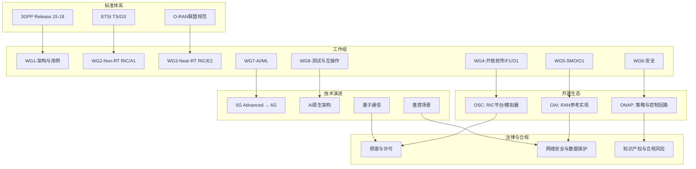
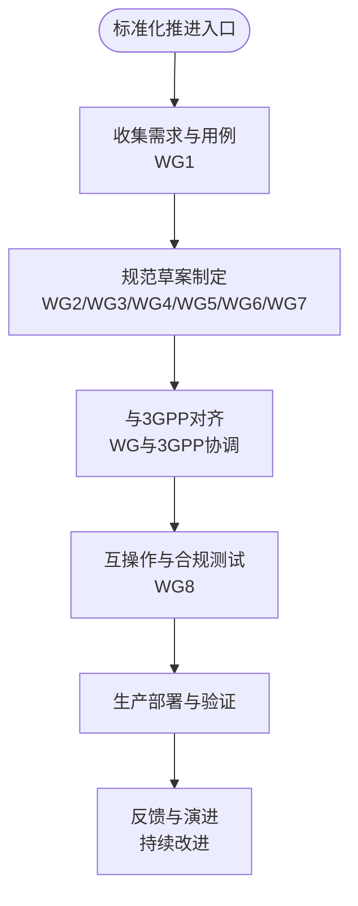
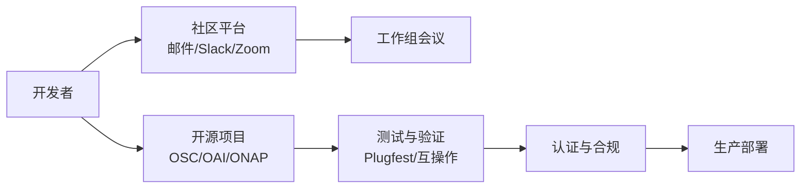
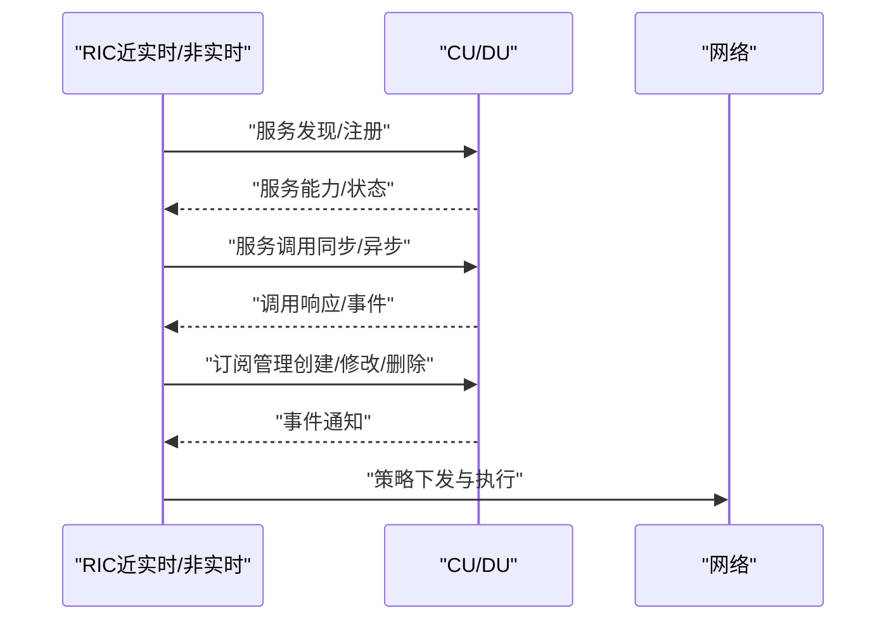
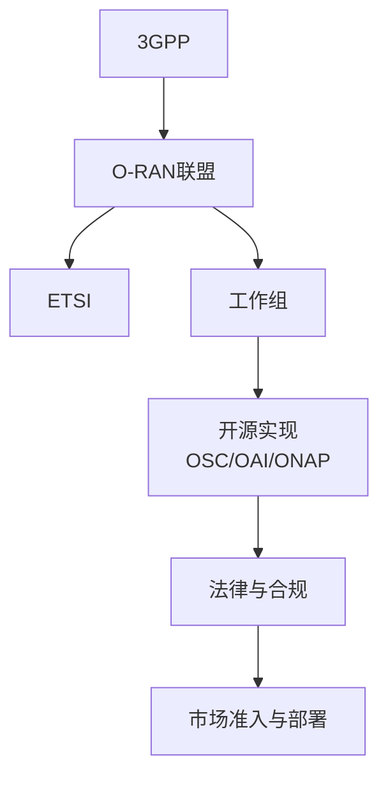

# 标准化进展

<cite>
**本文引用的文件**
- [O-RAN 标准与规范（中文）](file://09-standards-compliance/readme-zh.md)
- [O-RAN 联盟工作组详细职责（中文）](file://06-working-groups/wg-detailed-responsibilities.md)
- [O-RAN开源项目目录（中文）](file://17-open-source-ecosystem/oran-projects/oran-open-source-projects-zh.md)
- [O-RAN 开源社区资源指南（中文）](file://17-open-source-ecosystem/community-resources/open-source-community-guide-zh.md)
- [O-RAN 国际法律框架（英文）](file://25-legal-regulations/international-laws/o-ran-international-legal-framework.md)
- [O-RAN 技术演进路线图（中文）](file://15-future-development/technology-trends/technology-evolution-roadmap.md)
- [E2 接口（中文）](file://03-interface-standards/e2-interface.md)
- [O-RAN 长期发展规划（中文）](file://24-sustainable-development/long-term-planning/o-ran-long-term-strategy-zh.md)
- [O-RAN 生态系统与合作伙伴（中文）](file://20-ecosystem-partnership/readme.md)
- [O-RAN 生态系统战略框架（中文）](file://20-ecosystem-partnership/ecosystem-strategy/o-ran-ecosystem-strategy-zh.md)
</cite>

## 目录
1. [引言](#引言)
2. [项目结构](#项目结构)
3. [核心组件](#核心组件)
4. [架构总览](#架构总览)
5. [详细组件分析](#详细组件分析)
6. [依赖分析](#依赖分析)
7. [性能考虑](#性能考虑)
8. [故障排查指南](#故障排查指南)
9. [结论](#结论)
10. [附录](#附录)

## 引言
本文件围绕O-RAN标准化进展进行系统化行业分析，聚焦国际标准化动态（3GPP Release 18–20规划、O-RAN联盟未来规范、ETSI新标准开发、IEEE相关技术标准与ITU-T建议书）、产业联盟与开源生态（开源社区项目、产学研合作、跨行业标准协调、国际合作机制）、标准化对O-RAN技术发展的意义（技术统一、产业协同、市场准入），以及标准化进程中的技术挑战与协调机制。内容基于仓库内现有文件进行归纳与可视化呈现，帮助读者快速把握O-RAN标准化的现状、演进与实践路径。

## 项目结构
本仓库围绕O-RAN的“标准与合规”“工作组职责”“开源生态”“法律与国际框架”“技术演进”等多个维度形成知识体系，便于从多视角理解标准化推进与落地。

```mermaid
graph TB
A["标准化与合规"] --> A1["O-RAN联盟规范<br/>WG2/WG3/WG4/WG5/WG6/WG8"]
A --> A2["ETSI标准<br/>TS 103 859/983/986/987<br/>GS ORAN-005"]
A --> A3["3GPP标准<br/>Release 15-18<br/>NG-RAN接口与RIC"]
B["工作组与协作"] --> B1["WG1-用例与架构"]
B --> B2["WG2-Non-RT RIC/A1接口"]
B --> B3["WG3-Near-RT RIC/E2接口"]
B --> B4["WG4-开放前传/F1/O1接口"]
B --> B5["WG5-SMO/O1接口与编排"]
B --> B6["WG6-安全架构与测试"]
B --> B7["WG7-AI/ML框架"]
B --> B8["WG8-测试与互操作"]
C["开源生态"] --> C1["OSC项目与平台"]
C --> C2["OAI RAN实现"]
C --> C3["ONAP O-RAN集成"]
D["法律与国际框架"] --> D1["频谱许可与设备认证"]
D --> D2["网络安全与数据保护"]
D --> D3["知识产权与合规风险"]
E["技术演进与路线图"] --> E1["从5G到6G"]
E --> E2["AI原生架构"]
E --> E3["量子通信集成"]
E --> E4["新兴应用场景"]
```

**图表来源**
- [O-RAN 标准与规范（中文）](file://09-standards-compliance/readme-zh.md#L1-L371)
- [O-RAN 联盟工作组详细职责（中文）](file://06-working-groups/wg-detailed-responsibilities.md#L1-L607)
- [O-RAN开源项目目录（中文）](file://17-open-source-ecosystem/oran-projects/oran-open-source-projects-zh.md#L1-L716)
- [O-RAN 国际法律框架（英文）](file://25-legal-regulations/international-laws/o-ran-international-legal-framework.md#L1-L266)
- [O-RAN 技术演进路线图（中文）](file://15-future-development/technology-trends/technology-evolution-roadmap.md#L1-L68)

**章节来源**
- [O-RAN 标准与规范（中文）](file://09-standards-compliance/readme-zh.md#L1-L371)
- [O-RAN 联盟工作组详细职责（中文）](file://06-working-groups/wg-detailed-responsibilities.md#L1-L607)
- [O-RAN开源项目目录（中文）](file://17-open-source-ecosystem/oran-projects/oran-open-source-projects-zh.md#L1-L716)
- [O-RAN 国际法律框架（英文）](file://25-legal-regulations/international-laws/o-ran-international-legal-framework.md#L1-L266)
- [O-RAN 技术演进路线图（中文）](file://15-future-development/technology-trends/technology-evolution-roadmap.md#L1-L68)

## 核心组件
- 国际标准体系
  - 3GPP Release 15–18：定义5G NR与NG-RAN架构及接口（F1、E1、Xn、F1-U等），并纳入RIC相关规范与KPI测量。
  - ETSI标准：前传控制/用户/同步平面、A1接口通用与传输协议、前传传输配置文件、安全架构等。
  - O-RAN联盟规范：架构、接口（E2/A1/O1/O-FH/M-Plane）、硬件、软件、安全、测试等。
- 工作组分工与协作：WG1–WG8覆盖用例、架构、接口、安全、AI/ML、测试与互操作等，形成跨工作组协调机制与与3GPP的对齐。
- 开源生态：OSC（RIC平台、模拟器）、OAI（RAN参考实现）、ONAP（策略与控制回路集成）等项目支撑标准化落地与互操作验证。
- 法律与合规：频谱许可、设备认证、网络安全、数据保护、知识产权与跨境合规风险管控。
- 技术演进：从5G Advanced到6G预研，AI原生、量子通信、新兴垂直场景等。

**章节来源**
- [O-RAN 标准与规范（中文）](file://09-standards-compliance/readme-zh.md#L78-L108)
- [O-RAN 联盟工作组详细职责（中文）](file://06-working-groups/wg-detailed-responsibilities.md#L460-L489)
- [O-RAN开源项目目录（中文）](file://17-open-source-ecosystem/oran-projects/oran-open-source-projects-zh.md#L8-L145)
- [O-RAN 国际法律框架（英文）](file://25-legal-regulations/international-laws/o-ran-international-legal-framework.md#L8-L56)
- [O-RAN 技术演进路线图（中文）](file://15-future-development/technology-trends/technology-evolution-roadmap.md#L6-L13)

## 架构总览
下图展示O-RAN标准化的“标准—工作组—生态—法律—技术演进”的整体关系与互动路径。

**图表来源**
- [O-RAN 联盟工作组详细职责（中文）](file://06-working-groups/wg-detailed-responsibilities.md#L460-L489)
- [O-RAN 标准与规范（中文）](file://09-standards-compliance/readme-zh.md#L46-L108)
- [O-RAN开源项目目录（中文）](file://17-open-source-ecosystem/oran-projects/oran-open-source-projects-zh.md#L8-L145)
- [O-RAN 国际法律框架（英文）](file://25-legal-regulations/international-laws/o-ran-international-legal-framework.md#L58-L135)
- [O-RAN 技术演进路线图（中文）](file://15-future-development/technology-trends/technology-evolution-roadmap.md#L22-L49)

## 详细组件分析

### 国际标准化动态与组织职责
- 3GPP Release 18–20与5G Advanced：Release 18被定位为5G Advanced，面向增强功能与商用部署；Release 19–20进入6G预研与标准化阶段。NG-RAN接口（F1、E1、Xn、F1-U）与RIC相关规范构成O-RAN与3GPP的协同基础。
- ETSI标准：TS 103 859（前传平面）、TS 103 983/986（A1接口通用与传输）、TS 103 987（前传传输配置文件）、GS ORAN-005（安全架构）共同完善O-RAN前传与策略管理的技术细节。
- O-RAN联盟规范：覆盖架构、接口（E2/A1/O1/O-FH/M-Plane）、硬件、软件、安全、测试等，形成端到端的开放接口与互操作框架。
- 工作组协作：WG1定义用例与架构，WG2/WG3分别定义Non-RT与Near-RT RIC及A1/E2接口，WG4聚焦开放前传与F1/O1接口，WG5定义SMO与O1接口，WG6覆盖安全，WG7推动AI/ML，WG8负责测试与互操作。

**图表来源**
- [O-RAN 联盟工作组详细职责（中文）](file://06-working-groups/wg-detailed-responsibilities.md#L438-L459)

**章节来源**
- [O-RAN 标准与规范（中文）](file://09-standards-compliance/readme-zh.md#L78-L108)
- [O-RAN 联盟工作组详细职责（中文）](file://06-working-groups/wg-detailed-responsibilities.md#L460-L489)

### 产业联盟与开源生态
- 开源社区与项目
  - OSC：RIC平台（near-rt-ric/non-rt-ric/xApps/rApps）、模拟器与测试框架，支撑E2/A1接口与策略管理的实现与验证。
  - OAI：RAN参考实现（RU/DU/CU），支持多种拆分选项与eCPRI协议，便于与O-RAN规范对接。
  - ONAP：策略管理与控制回路集成，支撑O-RAN网络的自动化优化与编排。
- 开发者资源与协作平台：邮件列表、Slack、Zoom会议、Plugfest、Summit等，形成跨组织的协作与知识共享机制。
- 贡献流程与质量标准：复刻仓库→功能分支→测试→代码审查→CI/CD→合并部署，配套代码质量检查与文档模板。

**图表来源**
- [O-RAN 开源社区资源指南（中文）](file://17-open-source-ecosystem/community-resources/open-source-community-guide-zh.md#L217-L399)
- [O-RAN开源项目目录（中文）](file://17-open-source-ecosystem/oran-projects/oran-open-source-projects-zh.md#L8-L145)

**章节来源**
- [O-RAN 开源社区资源指南（中文）](file://17-open-source-ecosystem/community-resources/open-source-community-guide-zh.md#L1-L494)
- [O-RAN开源项目目录（中文）](file://17-open-source-ecosystem/oran-projects/oran-open-source-projects-zh.md#L1-L716)

### 标准化对O-RAN技术发展的重要意义
- 技术统一：通过WG4的开放前传接口（O-FH）、WG3/WG2的E2/A1接口，以及WG5的SMO/O1接口，实现跨厂商互操作与端到端一致的接口契约。
- 产业协同：WG8的测试与互操作、Plugfest活动、认证流程，推动多厂商协同与供应链整合。
- 市场准入：ETSI与3GPP的设备认证、O-RAN联盟的合规要求，为产品进入市场提供统一门槛与信任背书。

**章节来源**
- [O-RAN 标准与规范（中文）](file://09-standards-compliance/readme-zh.md#L110-L135)
- [O-RAN 联盟工作组详细职责（中文）](file://06-working-groups/wg-detailed-responsibilities.md#L367-L418)

### 标准化进程中的技术挑战与协调机制
- 技术挑战
  - 接口一致性与互操作：E2/A1/O1等接口在多厂商实现中存在差异，需通过WG8测试与Plugfest验证。
  - 实时性与可靠性：Near-RT RIC与E2接口对低延迟与高可靠提出更高要求。
  - 安全与合规：接口安全、数据保护、供应链安全与跨境合规带来复杂性。
- 协调机制
  - 工作组间协调：跨工作组技术协调、文档一致性、用例驱动。
  - 与3GPP对齐：技术联络、标准对齐、互补关系。
  - 开源验证：通过OSC/OAI/ONAP项目进行接口与功能验证，降低部署风险。

**章节来源**
- [O-RAN 联盟工作组详细职责（中文）](file://06-working-groups/wg-detailed-responsibilities.md#L419-L459)
- [O-RAN 标准与规范（中文）](file://09-standards-compliance/readme-zh.md#L136-L161)

### E2接口与A1接口的关键流程
- E2接口（Near-RT RIC与CU/DU）：基于SCTP/STREAMS的服务化接口，支持服务发现、调用、事件通知与订阅管理。
- A1接口（Non-RT RIC与策略管理）：RESTful API、JSON数据格式、HTTP/HTTPS传输、策略生命周期管理与安全要求。

**图表来源**
- [E2 接口（中文）](file://03-interface-standards/e2-interface.md#L1-L88)

**章节来源**
- [E2 接口（中文）](file://03-interface-standards/e2-interface.md#L1-L88)

### 技术演进与未来方向
- 从5G到6G：Release 18–19聚焦5G Advanced增强与商用，Release 20进入6G预研；6G准备包括太赫兹通信、智能超表面、空天地一体化、语义通信等。
- AI原生架构：自主网络管理、智能资源调度、预测性维护、自适应优化与联邦学习、边缘智能、强化学习、数字孪生。
- 量子通信：QKD、后量子密码迁移、量子安全传输与计算应用。
- 新兴场景：工业互联网4.0、智慧城市、联网自动驾驶等。

**章节来源**
- [O-RAN 技术演进路线图（中文）](file://15-future-development/technology-trends/technology-evolution-roadmap.md#L6-L68)
- [O-RAN 长期发展规划（中文）](file://24-sustainable-development/long-term-planning/o-ran-long-term-strategy-zh.md#L6-L56)

### 法律与合规框架
- 频谱与许可：国际协调（ITU）、国家许可、使用授权与干扰管理。
- 设备认证：CE/FCC/IC等认证与持续合规、软件更新审批。
- 网络安全与数据保护：基础设施保护、隐私框架、跨境数据传输、个人权利与安全保障。
- 知识产权：SEP（FRAND）、专利布局、版权与开源合规、技术转让协议。
- 跨境合规：多法域冲突、域外适用、协调机制与合规风险评估与应对。

**章节来源**
- [O-RAN 国际法律框架（英文）](file://25-legal-regulations/international-laws/o-ran-international-legal-framework.md#L6-L266)

### 生态系统与合作伙伴策略
- 产业生态：上游芯片与硬件、中游系统集成与云服务、下游垂直行业与应用。
- 合作伙伴类型：战略合作伙伴（技术/产业/学术/国际）、业务合作伙伴（渠道/技术/服务/投资）。
- 生态建设：开放合作原则（技术/市场/治理开放）、价值共创（专业化分工、共享收益、可持续发展）。

**章节来源**
- [O-RAN 生态系统与合作伙伴（中文）](file://20-ecosystem-partnership/readme.md#L1-L64)
- [O-RAN 生态系统战略框架（中文）](file://20-ecosystem-partnership/ecosystem-strategy/o-ran-ecosystem-strategy-zh.md#L1-L107)

## 依赖分析
- 标准依赖：O-RAN联盟规范与ETSI标准共同细化3GPP NG-RAN接口与RIC能力，形成“3GPP架构—O-RAN接口—ETSI实现”的闭环。
- 工作组依赖：WG1提供用例与架构输入，WG2/WG3定义RIC与接口，WG4/WG5定义前传与管理接口，WG6/WG7/WG8保障安全、AI/ML与测试互操作。
- 生态依赖：OSC/OAI/ONAP项目对标准实现与互操作验证起到关键支撑作用。
- 法律依赖：频谱许可、设备认证、网络安全与数据保护、知识产权与跨境合规贯穿部署全生命周期。

**图表来源**
- [O-RAN 联盟工作组详细职责（中文）](file://06-working-groups/wg-detailed-responsibilities.md#L460-L489)
- [O-RAN 标准与规范（中文）](file://09-standards-compliance/readme-zh.md#L46-L108)
- [O-RAN开源项目目录（中文）](file://17-open-source-ecosystem/oran-projects/oran-open-source-projects-zh.md#L8-L145)
- [O-RAN 国际法律框架（英文）](file://25-legal-regulations/international-laws/o-ran-international-legal-framework.md#L58-L135)

**章节来源**
- [O-RAN 联盟工作组详细职责（中文）](file://06-working-groups/wg-detailed-responsibilities.md#L460-L489)
- [O-RAN 标准与规范（中文）](file://09-standards-compliance/readme-zh.md#L46-L108)
- [O-RAN开源项目目录（中文）](file://17-open-source-ecosystem/oran-projects/oran-open-source-projects-zh.md#L8-L145)
- [O-RAN 国际法律框架（英文）](file://25-legal-regulations/international-laws/o-ran-international-legal-framework.md#L58-L135)

## 性能考虑
- 接口性能：E2接口对延迟与吞吐提出严格要求，需结合OSC/OAI/ONAP的基准测试与优化实践进行验证。
- 资源与效率：Near-RT RIC与xApp的资源占用与CPU/内存开销应纳入性能基线，确保实时性与稳定性。
- 自动化与可扩展：容器化与Kubernetes部署、高可用与水平扩展能力，提升运维效率与弹性。

**章节来源**
- [O-RAN开源项目目录（中文）](file://17-open-source-ecosystem/oran-projects/oran-open-source-projects-zh.md#L212-L407)

## 故障排查指南
- 接口一致性：通过WG8测试与Plugfest场景识别接口差异，结合OSC/OAI/ONAP的模拟器与测试工具定位问题。
- 安全与合规：依据WG6安全规范与ETSI安全架构，核查认证、授权、加密与审计流程。
- 法律与许可：对照频谱许可、设备认证与数据保护要求，建立合规清单与风险评估。

**章节来源**
- [O-RAN 标准与规范（中文）](file://09-standards-compliance/readme-zh.md#L136-L161)
- [O-RAN 联盟工作组详细职责（中文）](file://06-working-groups/wg-detailed-responsibilities.md#L367-L418)
- [O-RAN 国际法律框架（英文）](file://25-legal-regulations/international-laws/o-ran-international-legal-framework.md#L58-L135)

## 结论
O-RAN标准化以3GPP架构为基础，通过O-RAN联盟规范与ETSI标准细化接口与实现，辅以工作组协作、开源生态验证与法律合规保障，形成从技术到市场的完整闭环。面向未来，从5G Advanced到6G预研、AI原生与量子通信等前沿方向将持续推动标准演进与产业生态繁荣。标准化不仅是技术统一与市场准入的基石，更是跨行业、跨国界协同创新的关键抓手。

## 附录
- 关键术语
  - RIC：RAN Intelligent Controller（RAN智能控制器）
  - E2/A1/O1/O-FH：O-RAN关键接口
  - OSC：O-RAN软件社区
  - OAI：OpenAirInterface
  - ONAP：开放网络自动化平台
- 参考链接
  - O-RAN联盟官网与OSC社区
  - ETSI与3GPP标准页面
  - Plugfest与Summit活动