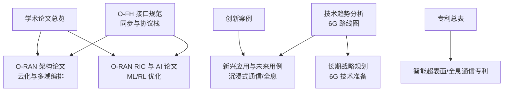
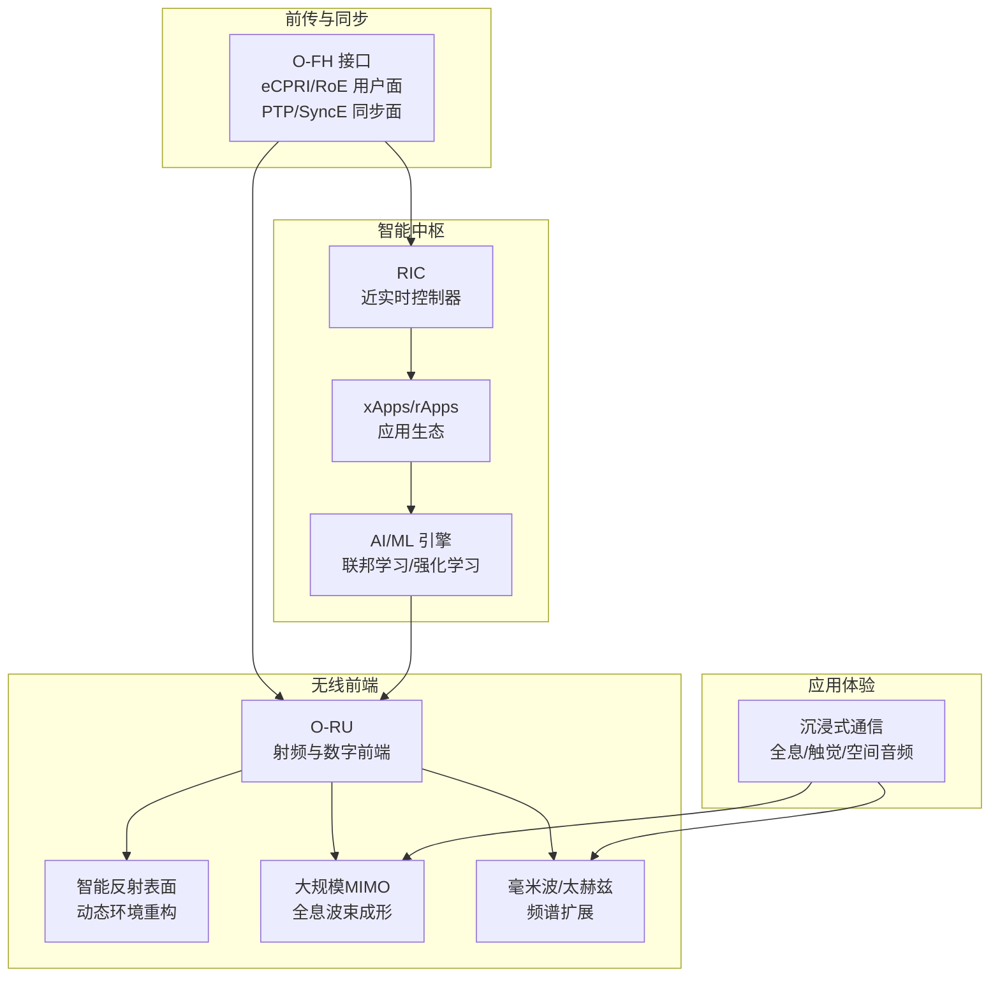
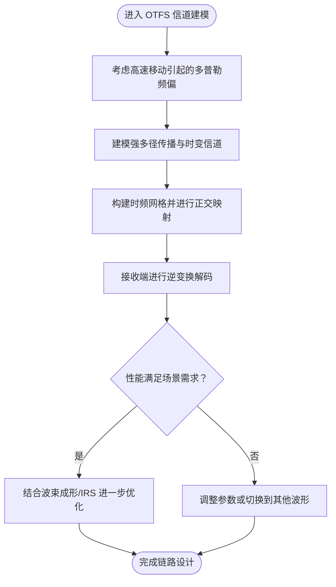
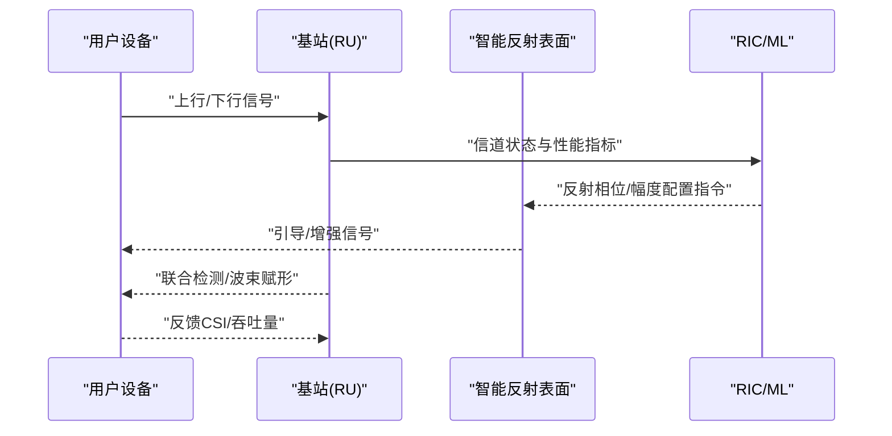
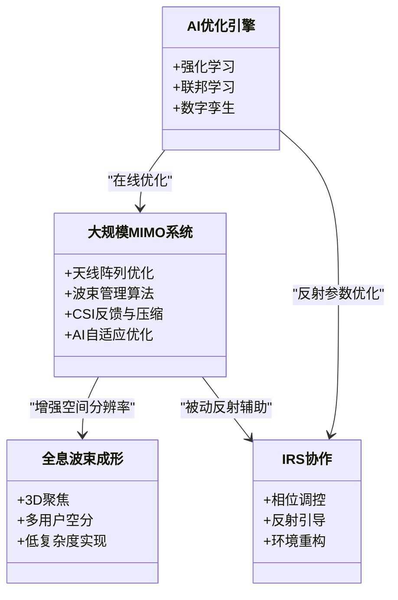
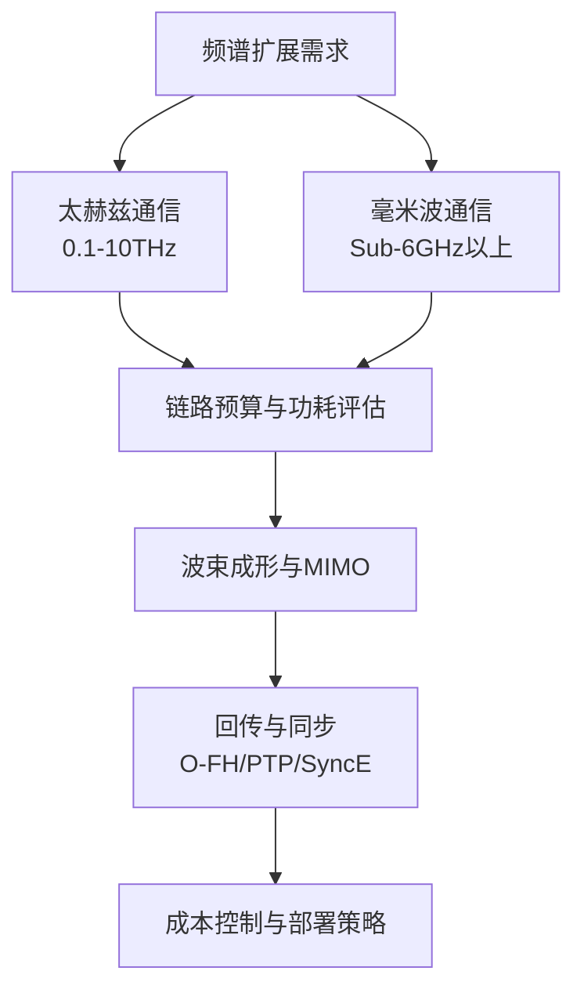
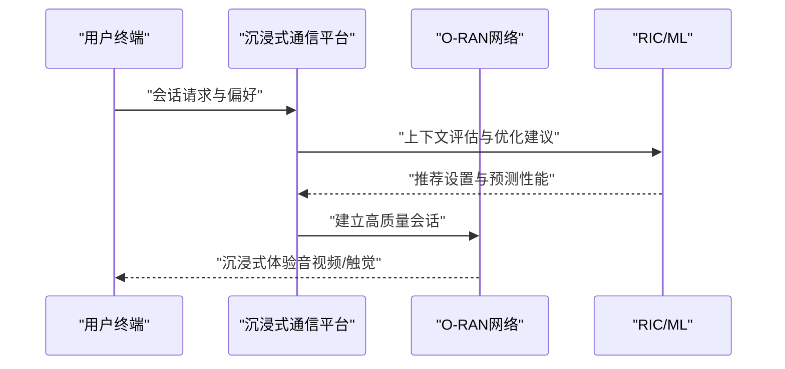
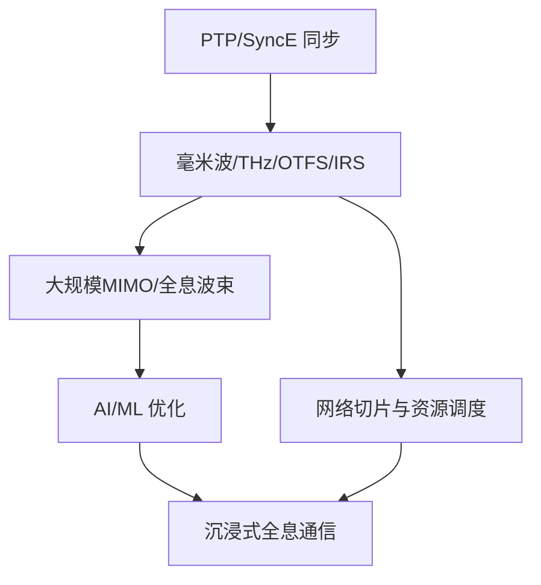
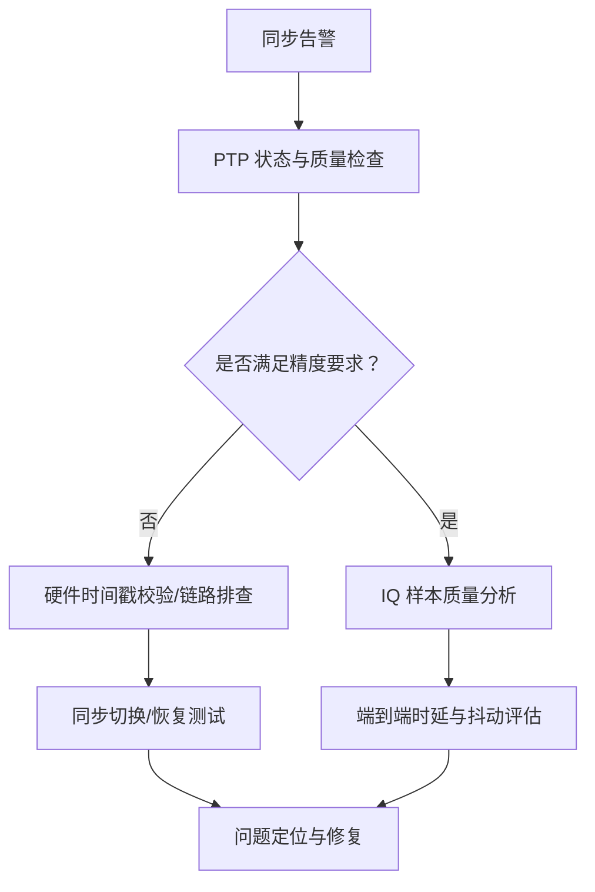

# 新波形技术前沿

<cite>
**本文引用的文件**
- [O-FH 接口规范](file://03-interface-standards/o-fh-interface.md)
- [O-RAN 故障排查指南（同步问题）](file://14-operations-management/fault-handling/fault-troubleshooting-guide.md)
- [O-RAN 技术发展趋势分析](file://15-future-development/technology-trends/technology-evolution-roadmap.md)
- [O-RAN 新兴应用与未来用例](file://15-future-development/emerging-applications/emerging-applications-roadmap.md)
- [O-RAN 学术论文总览](file://11-academic-papers/readme.md)
- [O-RAN 架构论文](file://11-academic-papers/architecture/readme.md)
- [O-RAN RIC 与 AI 论文](file://11-academic-papers/ric-ai/readme.md)
- [O-RAN 学术论文：应用方向](file://11-academic-papers/applications/readme.md)
- [O-RAN 专利总表](file://comprehensive-oran-patent-table.md)
- [O-RAN 长期战略规划](file://24-sustainable-development/long-term-planning/o-ran-long-term-strategy.md)
- [O-RAN 创新案例（中文）](file://21-case-studies/innovation-cases/o-ran-innovation-cases-zh.md)
- [O-RAN 创新案例（英文）](file://21-case-studies/innovation-cases/o-ran-innovation-cases.md)
- [O-RAN 国际部署：本地化策略](file://23-international-deployment/localization-adaptation/o-ran-localization-strategies.md)
- [O-RAN 行业解决方案：交通运输](file://16-industry-solutions/transportation/o-ran-transportation-solutions.md)
</cite>

## 目录
1. [引言](#引言)
2. [项目结构](#项目结构)
3. [核心组件](#核心组件)
4. [架构总览](#架构总览)
5. [详细组件分析](#详细组件分析)
6. [依赖关系分析](#依赖关系分析)
7. [性能考量](#性能考量)
8. [故障排查指南](#故障排查指南)
9. [结论](#结论)
10. [附录](#附录)

## 引言
本文件围绕“新波形技术前沿”主题，结合仓库内现有 O-RAN 标准、架构、AI/ML 融合、未来技术路线与专利布局等资料，系统梳理面向 6G 的关键通信技术方向：OTFS 正交时频空编码、智能反射表面（IRS）、大规模 MIMO（含全息波束成形）、毫米波与太赫兹通信、可见光通信（VLC）以及沉浸式全息通信等。文档旨在为技术选型、工程落地与商业化节奏提供可操作的参考。

## 项目结构
该知识库以主题域划分，涵盖标准接口、架构、AI/ML、学术论文、专利、长期规划与行业应用等维度。与“新波形技术前沿”直接相关的核心来源包括：
- 接口与同步：O-FH 接口规范与同步要求
- 未来技术：6G 技术路线、AI 原生架构、量子通信
- 应用与案例：沉浸式通信、工业互联网、智能交通等
- 专利与创新：智能超表面、全息通信等前沿技术专利

**图表来源**
- [O-FH 接口规范](file://03-interface-standards/o-fh-interface.md#L59-L93)
- [O-RAN 技术发展趋势分析](file://15-future-development/technology-trends/technology-evolution-roadmap.md#L1-L68)
- [O-RAN 新兴应用与未来用例](file://15-future-development/emerging-applications/emerging-applications-roadmap.md#L1-L59)
- [O-RAN 学术论文总览](file://11-academic-papers/readme.md#L1-L88)
- [O-RAN 架构论文](file://11-academic-papers/architecture/readme.md#L1-L84)
- [O-RAN RIC 与 AI 论文](file://11-academic-papers/ric-ai/readme.md#L1-L98)
- [O-RAN 创新案例（中文）](file://21-case-studies/innovation-cases/o-ran-innovation-cases-zh.md#L211-L279)
- [O-RAN 专利总表](file://comprehensive-oran-patent-table.md#L101-L109)

**章节来源**
- [O-FH 接口规范](file://03-interface-standards/o-fh-interface.md#L59-L93)
- [O-RAN 技术发展趋势分析](file://15-future-development/technology-trends/technology-evolution-roadmap.md#L1-L68)
- [O-RAN 新兴应用与未来用例](file://15-future-development/emerging-applications/emerging-applications-roadmap.md#L1-L59)
- [O-RAN 学术论文总览](file://11-academic-papers/readme.md#L1-L88)

## 核心组件
- 同步与前传接口：O-FH 接口通过 eCPRI/RoE 用户面与 PTP/SyncE 同步面，支撑高精度时间/频率同步与低延迟回传。
- AI/ML 原生架构：RIC 与 xApps 生态，结合联邦学习、强化学习与数字孪生，实现自配置、自优化与预测性维护。
- 6G 技术路线：太赫兹通信、智能超表面、全息波束成形、空天地一体化、语义通信等。
- 沉浸式通信平台：空间音频、全息显示、触觉反馈与上下文感知优化，支撑全息通信与触觉互联网。
- 专利与创新：智能超表面与全息通信相关专利，体现技术成熟度与知识产权布局。

**章节来源**
- [O-FH 接口规范](file://03-interface-standards/o-fh-interface.md#L59-L93)
- [O-RAN 技术发展趋势分析](file://15-future-development/technology-trends/technology-evolution-roadmap.md#L15-L21)
- [O-RAN 新兴应用与未来用例](file://15-future-development/emerging-applications/emerging-applications-roadmap.md#L339-L383)
- [O-RAN 专利总表](file://comprehensive-oran-patent-table.md#L101-L109)

## 架构总览
下图展示新波形技术在 O-RAN 体系中的位置与交互：前传接口提供高精度同步与数据承载；AI/ML 在 RIC 层实现自优化；6G 技术路线为波束成形、频谱扩展与通信模式创新提供方向；沉浸式通信平台则面向应用层体验提升。

**图表来源**
- [O-FH 接口规范](file://03-interface-standards/o-fh-interface.md#L59-L93)
- [O-RAN 技术发展趋势分析](file://15-future-development/technology-trends/technology-evolution-roadmap.md#L15-L21)
- [O-RAN 新兴应用与未来用例](file://15-future-development/emerging-applications/emerging-applications-roadmap.md#L339-L383)

## 详细组件分析

### OTFS 正交时频空编码：原理、优势与场景
- 原理要点
  - OTFS 将信息映射到时频域，利用多普勒-多普勒变换实现对高速移动与强多径环境的鲁棒性。
  - 通过时空域的正交性，降低载波间干扰与符号间干扰，提升在高相对速度与严重多径条件下的性能。
- 优势
  - 高速移动场景下的信道估计与均衡更稳定。
  - 强多径环境下保持较高频谱效率与可靠连接。
- 应用场景
  - 高速铁路、飞行器通信、无人机蜂窝回传等。
  - 结合 O-FH 接口的高精度同步，可在严格时延预算下实现 OTFS 的时频网格对齐。
- 与现有技术的耦合
  - 与大规模 MIMO、IRS 等波束管理/环境重构手段互补，形成“空-时-频”多维增强。

**章节来源**
- [O-FH 接口规范](file://03-interface-standards/o-fh-interface.md#L59-L93)
- [O-RAN 技术发展趋势分析](file://15-future-development/technology-trends/technology-evolution-roadmap.md#L15-L21)

### 智能反射表面（IRS）：工作机制、部署策略与覆盖增益
- 工作机制
  - IRS 通过大量低成本、低功耗的可重构反射单元，动态调控电磁波的相位/幅度，实现对无线环境的智能重构。
  - 与 RIS（可重构智能表面）概念一致，支持波束指向引导、空分复用增强与多径利用。
- 部署策略
  - 宏站/微站外立面贴附、建筑物内部隔断布置、隧道与地下空间辅助反射。
  - 与大规模 MIMO 结合，形成“主动+被动”的双通道波束管理。
- 对网络覆盖的改善
  - 提升边缘覆盖与穿透损耗补偿，降低小基站密度与功耗。
  - 在室内高密度场景显著改善信号均匀性与容量。
- 专利与成熟度
  - 专利覆盖动态无线环境重构与信号增强，表明技术已进入知识产权布局阶段。

**图表来源**
- [O-RAN 技术发展趋势分析](file://15-future-development/technology-trends/technology-evolution-roadmap.md#L15-L21)
- [O-RAN 专利总表](file://comprehensive-oran-patent-table.md#L101-L109)

**章节来源**
- [O-RAN 技术发展趋势分析](file://15-future-development/technology-trends/technology-evolution-roadmap.md#L15-L21)
- [O-RAN 专利总表](file://comprehensive-oran-patent-table.md#L101-L109)

### 大规模 MIMO 与全息波束成形：阵列优化、波束管理与算法创新
- 发展趋势
  - 天线元素数向数百/千级扩展，配合全息波束成形实现三维空间聚焦。
  - 与 IRS 协同，形成“主动辐射+被动反射”的复合波束。
- 关键技术
  - 低复杂度算法（如量化反馈、压缩感知 CSI 获取）。
  - 基于 AI 的在线波束优化与自适应调度。
- 应用价值
  - 显著提升容量与覆盖，降低小区间干扰。
  - 在毫米波/太赫兹频段，通过窄波束与高增益补偿路径损耗。

**图表来源**
- [O-RAN 技术发展趋势分析](file://15-future-development/technology-trends/technology-evolution-roadmap.md#L15-L21)
- [O-RAN 新兴应用与未来用例](file://15-future-development/emerging-applications/emerging-applications-roadmap.md#L339-L383)

**章节来源**
- [O-RAN 技术发展趋势分析](file://15-future-development/technology-trends/technology-evolution-roadmap.md#L15-L21)
- [O-RAN 新兴应用与未来用例](file://15-future-development/emerging-applications/emerging-applications-roadmap.md#L339-L383)

### 毫米波与太赫兹通信：频率扩展、功率效率与成本控制
- 技术突破
  - 频谱扩展至 0.1–10 THz，满足 6G 超高吞吐需求。
  - 室内高密度场景（如场馆、机场、工厂）通过毫米波实现万兆级用户体验。
- 功率效率与成本
  - 采用高增益波束成形与大规模 MIMO，降低路径损耗影响。
  - 集成化与异构回传（光纤/微波/无线）降低部署成本。
- 与 O-FH 的协同
  - 高精度同步保障毫米波/THz链路的相位对齐与时钟一致性。

**图表来源**
- [O-RAN 技术发展趋势分析](file://15-future-development/technology-trends/technology-evolution-roadmap.md#L15-L21)
- [O-FH 接口规范](file://03-interface-standards/o-fh-interface.md#L59-L93)

**章节来源**
- [O-RAN 技术发展趋势分析](file://15-future-development/technology-trends/technology-evolution-roadmap.md#L15-L21)
- [O-FH 接口规范](file://03-interface-standards/o-fh-interface.md#L59-L93)

### 可见光通信（VLC）：室内定位与高密度场景应用
- 技术潜力
  - 利用 LED 照明同时实现通信与照明，适合高密度室内场景（教室、会议室、展厅）。
  - 与 IMU/惯性导航结合，提供厘米级定位能力。
- 与 O-RAN 的协同
  - 与毫米波/IRS 协同，在室内形成“光-射频”混合接入，提升容量与覆盖均匀性。

**图表来源**
- [O-RAN 技术发展趋势分析](file://15-future-development/technology-trends/technology-evolution-roadmap.md#L15-L21)

**章节来源**
- [O-RAN 技术发展趋势分析](file://15-future-development/technology-trends/technology-evolution-roadmap.md#L15-L21)

### 沉浸式全息通信：空间音频、全息显示与触觉反馈
- 平台能力
  - 空间音频渲染、全息显示（8K/120Hz+）、触觉反馈与温度/纹理模拟。
  - 上下文感知优化，基于网络条件与设备能力动态调整质量。
- 与 6G 的关系
  - 全息通信作为 6G 代表性应用，推动带宽、时延与可靠性指标跃升。
- 与 O-RAN 的结合
  - AI/ML 优化端到端时延与抖动，保障沉浸式体验的 SLA。

**图表来源**
- [O-RAN 新兴应用与未来用例](file://15-future-development/emerging-applications/emerging-applications-roadmap.md#L339-L383)

**章节来源**
- [O-RAN 新兴应用与未来用例](file://15-future-development/emerging-applications/emerging-applications-roadmap.md#L339-L383)

## 依赖关系分析
- 同步依赖：O-FH 的 PTP/SyncE 同步质量直接影响毫米波/THz、大规模 MIMO 与 OTFS 的相位对齐与定时约束。
- AI 依赖：RIC/ML 对大规模 MIMO 波束优化、IRS 参数配置与沉浸式体验的动态适配至关重要。
- 频谱依赖：6G 频谱扩展（THz/VLC）与传统频段（Sub-6GHz）的协同部署需要灵活的网络切片与资源调度。
- 应用依赖：沉浸式通信对端到端时延、抖动与带宽提出严苛要求，需 O-RAN 与边缘计算协同保障。

**图表来源**
- [O-FH 接口规范](file://03-interface-standards/o-fh-interface.md#L59-L93)
- [O-RAN 技术发展趋势分析](file://15-future-development/technology-trends/technology-evolution-roadmap.md#L15-L21)
- [O-RAN 新兴应用与未来用例](file://15-future-development/emerging-applications/emerging-applications-roadmap.md#L339-L383)

**章节来源**
- [O-FH 接口规范](file://03-interface-standards/o-fh-interface.md#L59-L93)
- [O-RAN 技术发展趋势分析](file://15-future-development/technology-trends/technology-evolution-roadmap.md#L15-L21)
- [O-RAN 新兴应用与未来用例](file://15-future-development/emerging-applications/emerging-applications-roadmap.md#L339-L383)

## 性能考量
- 同步精度与稳定性：PTP 时间同步 <100ns、频率同步 <10ppb，保障毫米波/THz与大规模 MIMO 的相位一致性。
- 时延与抖动：沉浸式通信对端到端时延与抖动提出亚毫秒级要求，需结合边缘计算与 AI 优化。
- 容量与覆盖：通过 IRS、全息波束与多用户空分复用，实现高密度场景下的容量与覆盖平衡。
- 成本与能效：集成化与异构回传降低部署成本，AI 优化提升能效与资源利用率。

**章节来源**
- [O-FH 接口规范](file://03-interface-standards/o-fh-interface.md#L169-L177)
- [O-RAN 新兴应用与未来用例](file://15-future-development/emerging-applications/emerging-applications-roadmap.md#L339-L383)

## 故障排查指南
- 同步问题诊断
  - PTP 守护进程状态检查、PMCF/统计信息采集、硬件时间戳校验与 IQ 样本质量分析。
  - 时钟偏差与频率漂移监控，验证同步切换与恢复能力。
- 传输与回传
  - O-FH 用户面与控制面消息检查，确认 RU/DU 通信链路与同步消息传递正常。
- 端到端体验
  - 沉浸式通信场景下，关注端到端时延分布、抖动与丢包，结合 AI 优化策略进行参数调优。

**图表来源**
- [O-RAN 故障排查指南（同步问题）](file://14-operations-management/fault-handling/fault-troubleshooting-guide.md#L436-L489)

**章节来源**
- [O-RAN 故障排查指南（同步问题）](file://14-operations-management/fault-handling/fault-troubleshooting-guide.md#L436-L489)

## 结论
- OTFS、IRS、大规模 MIMO、毫米波/太赫兹与 VLC 等新波形技术构成 6G 无线接入的关键支柱。
- O-FH 同步与 AI/ML 优化为这些技术提供确定性时延与智能化运维保障。
- 沉浸式全息通信等应用推动端到端性能指标跃升，需系统性工程化落地。
- 专利布局与长期规划显示技术已进入成熟度提升与产业化的关键窗口期。

## 附录

### 技术成熟度与商业化时间表预测
- 2024–2025：5G Advanced 增强与商用部署，为 6G 技术预研奠定基础。
- 2026–2027：6G 技术预研与 O-RAN 扩展（6 GHz 以上频段、AI 原生架构）。
- 2027–2030：6G 标准化与试验网，毫米波/太赫兹、IRS、全息通信进入试点验证。
- 2030+：6G 商业化部署，沉浸式通信、空天地一体化全面落地。

**章节来源**
- [O-RAN 技术发展趋势分析](file://15-future-development/technology-trends/technology-evolution-roadmap.md#L8-L13)
- [O-RAN 长期战略规划](file://24-sustainable-development/long-term-planning/o-ran-long-term-strategy.md#L33-L56)

### 行业应用与部署策略
- 交通运输：智能交通信号、动态路径引导、紧急车辆优先、RSU 部署与车路协同。
- 智慧城市：智能交通、智慧能源、公共安全、环境监测。
- 工业互联网：智能制造、工业物联网、预测性维护、数字孪生工厂。
- 国际化本地化：分阶段市场评估、技术适配、试点验证与规模化推广。

**章节来源**
- [O-RAN 行业解决方案：交通运输](file://16-industry-solutions/transportation/o-ran-transportation-solutions.md#L38-L68)
- [O-RAN 创新案例（中文）](file://21-case-studies/innovation-cases/o-ran-innovation-cases-zh.md#L211-L279)
- [O-RAN 创新案例（英文）](file://21-case-studies/innovation-cases/o-ran-innovation-cases.md#L211-L264)
- [O-RAN 国际部署：本地化策略](file://23-international-deployment/localization-adaptation/o-ran-localization-strategies.md#L301-L374)