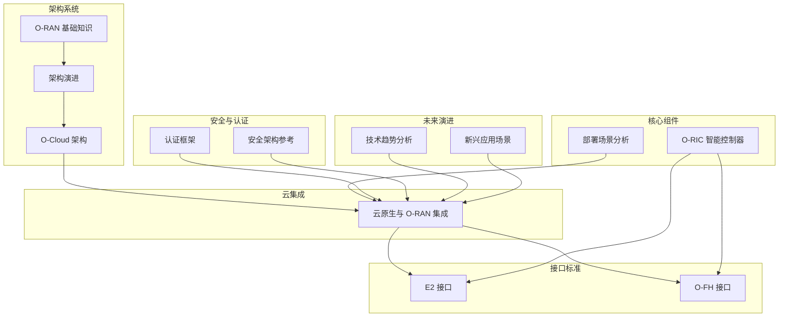
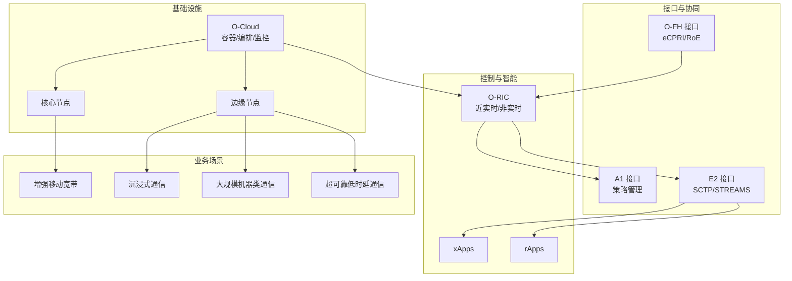
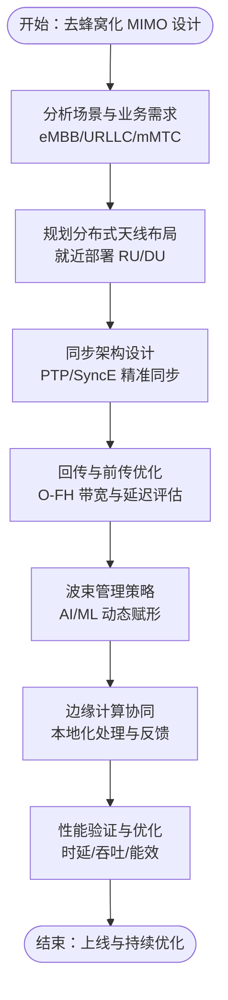
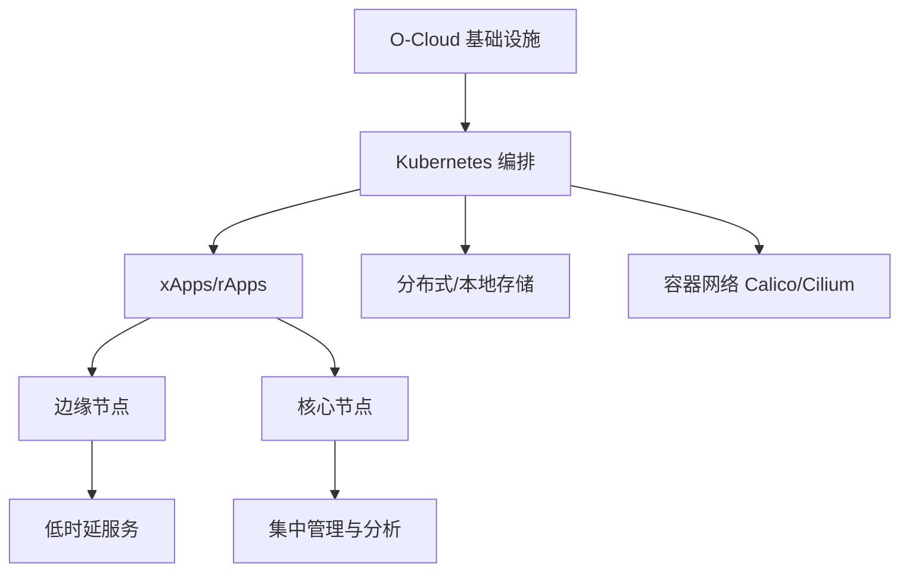
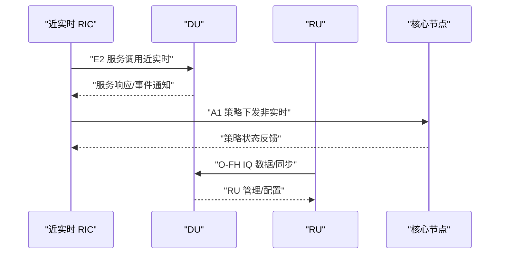
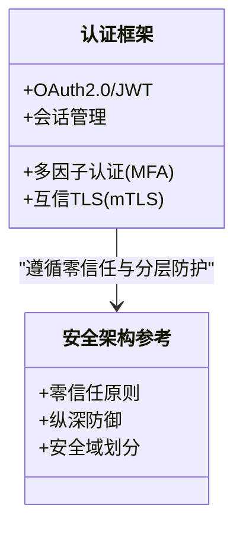
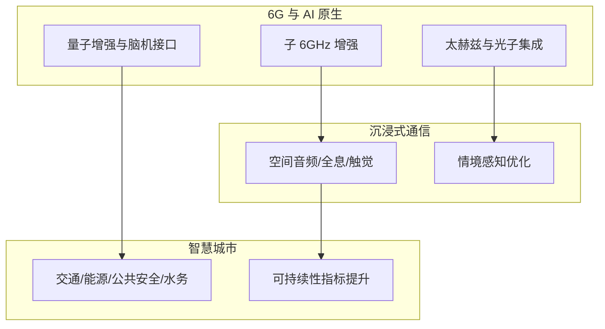
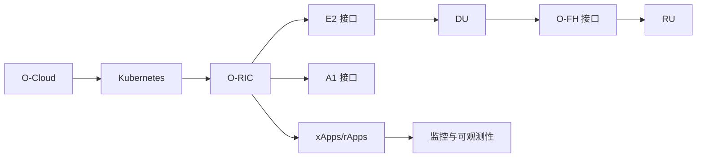

# 架构创新探索

<cite>
**本文引用的文件**
- [O-RAN 基础知识](file://01-architecture-system/readme.md)
- [O-RAN 架构演进](file://01-architecture-system/architecture-evolution.md)
- [O-Cloud 架构](file://01-architecture-system/o-cloud-architecture.md)
- [云原生架构与 O-RAN 集成](file://05-cloud-integration/cloud-native-architecture.md)
- [E2 接口](file://03-interface-standards/e2-interface.md)
- [O-FH 接口](file://03-interface-standards/o-fh-interface.md)
- [部署场景分析](file://04-disaggregation-options/deployment-scenarios.md)
- [O-RIC 智能控制器](file://02-core-components/o-ric.md)
- [O-RIC 发展与应用](file://07-ric-development/readme.md)
- [技术发展趋势分析](file://15-future-development/technology-trends/technology-evolution-roadmap.md)
- [新兴应用场景路线图](file://15-future-development/emerging-applications/emerging-applications-roadmap.md)
- [O-RAN 认证框架](file://12-security-privacy/authentication/authentication-framework.md)
- [O-RAN 安全架构参考](file://12-security-privacy/security-architecture/security-reference-architecture-zh.md)
- [架构设计最佳实践](file://30-best-practices/architecture-practices/architecture-design-best-practices-zh.md)
</cite>

## 目录
1. [引言](#引言)
2. [项目结构](#项目结构)
3. [核心组件](#核心组件)
4. [架构概览](#架构概览)
5. [详细组件分析](#详细组件分析)
6. [依赖分析](#依赖分析)
7. [性能考虑](#性能考虑)
8. [故障排查指南](#故障排查指南)
9. [结论](#结论)
10. [附录](#附录)

## 引言
本文件面向架构创新探索，围绕 O-RAN 无线接入网络的前沿技术与架构演进，系统梳理“去蜂窝大规模 MIMO”“分布式云与边缘协同”“智能控制与接口”“安全与身份”“未来场景与 6G 路线”等主题，形成可操作的架构分析与实践指引。内容既强调技术深度，也注重工程落地，帮助读者在云平台运维与网络架构实践中实现能力跃迁。

## 项目结构
本仓库以主题域组织 O-RAN 知识体系，涵盖架构、接口、云集成、安全、未来演进等维度。与本专题直接相关的知识域如下：
- 架构系统：O-RAN 基础、架构演进、O-Cloud 基础设施
- 接口标准：E2、A1、O-FH 等关键接口
- 云集成：云原生与 O-RAN 的融合
- 核心组件：O-RIC、DU、CU、RU 等
- 部署场景：集中式/分布式/混合部署
- 安全与认证：零信任、证书、会话与 OAuth
- 未来演进：6G、AI 原生、边缘智能、沉浸式通信

**图表来源**
- [O-RAN 基础知识](file://01-architecture-system/readme.md#L1-L161)
- [O-RAN 架构演进](file://01-architecture-system/architecture-evolution.md#L1-L183)
- [O-Cloud 架构](file://01-architecture-system/o-cloud-architecture.md#L1-L238)
- [云原生架构与 O-RAN 集成](file://05-cloud-integration/cloud-native-architecture.md#L1-L481)
- [E2 接口](file://03-interface-standards/e2-interface.md#L1-L337)
- [O-FH 接口](file://03-interface-standards/o-fh-interface.md#L1-L397)
- [O-RIC 智能控制器](file://02-core-components/o-ric.md#L1-L437)
- [部署场景分析](file://04-disaggregation-options/deployment-scenarios.md#L1-L563)
- [O-RAN 认证框架](file://12-security-privacy/authentication/authentication-framework.md#L1-L208)
- [O-RAN 安全架构参考](file://12-security-privacy/security-architecture/security-reference-architecture-zh.md#L1-L71)
- [技术发展趋势分析](file://15-future-development/technology-trends/technology-evolution-roadmap.md#L1-L68)
- [新兴应用场景路线图](file://15-future-development/emerging-applications/emerging-applications-roadmap.md#L1-L879)

**章节来源**
- [O-RAN 基础知识](file://01-architecture-system/readme.md#L1-L161)
- [O-RAN 架构演进](file://01-architecture-system/architecture-evolution.md#L1-L183)

## 核心组件
- O-RIC（近实时/非实时）：实现毫秒级控制闭环与秒级策略管理，支撑 xApps/rApps 的部署与运行。
- O-FH 接口：标准化前传接口，承载 DU 与 RU 之间的 IQ 数据与同步，支持 eCPRI/RoE。
- E2 接口：RIC 与 CU/DU 的服务化接口，基于 SCTP/STREAMS，支撑近实时控制。
- O-Cloud：云原生基础设施层，提供计算、存储、网络与编排能力，满足 O-RAN 的弹性与可靠性要求。
- 部署场景：集中式、分布式、混合部署，适配 eMBB/URLLC/mMTC 等业务与地理条件。

**章节来源**
- [O-RIC 智能控制器](file://02-core-components/o-ric.md#L1-L437)
- [O-FH 接口](file://03-interface-standards/o-fh-interface.md#L1-L397)
- [E2 接口](file://03-interface-standards/e2-interface.md#L1-L337)
- [O-Cloud 架构](file://01-architecture-system/o-cloud-architecture.md#L1-L238)
- [部署场景分析](file://04-disaggregation-options/deployment-scenarios.md#L1-L563)

## 架构概览
O-RAN 以“云原生 + 智能控制 + 开放接口”为核心特征，通过 O-Cloud 提供弹性基础设施，O-RIC 实现控制与策略闭环，E2/O-FH/A1 等接口实现跨层协同。面向未来，6G 与 AI 原生架构将进一步推动“分布式智能、沉浸式通信、认知服务”的演进。

**图表来源**
- [O-RIC 智能控制器](file://02-core-components/o-ric.md#L1-L437)
- [E2 接口](file://03-interface-standards/e2-interface.md#L1-L337)
- [O-FH 接口](file://03-interface-standards/o-fh-interface.md#L1-L397)
- [O-Cloud 架构](file://01-architecture-system/o-cloud-architecture.md#L1-L238)
- [新兴应用场景路线图](file://15-future-development/emerging-applications/emerging-applications-roadmap.md#L1-L879)

## 详细组件分析

### 无蜂窝大规模 MIMO 与去蜂窝化网络
- 设计理念
  - 去蜂窝化：弱化宏站主导的蜂窝拓扑，强调分布式、按需覆盖与多接入点协作。
  - 大规模 MIMO：通过海量天线阵列实现高阶波束赋形与空间复用，提升频谱与能量效率。
  - 分布式天线：将天线单元下沉至更接近用户的位置，降低前传时延与路径损耗。
- 关键技术
  - 波束管理：基于 AI 的动态波束跟踪、协作波束成形与干扰协调。
  - 同步与回传：O-FH 的高精度时间/频率同步，结合低延迟回传网络。
  - 云边协同：DU/RU 的功能解耦与就近处理，配合边缘计算节点实现本地化优化。
- 工程要点
  - 前传带宽与延迟：依据天线数、带宽与调制方式计算带宽需求，预留冗余。
  - 同步精度：纳秒级 PTP 同步与 SyncE 频率同步，保障大规模阵列的相位一致性。
  - 部署策略：URLLC 场景优先分布式部署，eMBB 场景可混合部署以平衡成本与性能。

**图表来源**
- [O-FH 接口](file://03-interface-standards/o-fh-interface.md#L1-L397)
- [部署场景分析](file://04-disaggregation-options/deployment-scenarios.md#L1-L563)
- [O-RIC 智能控制器](file://02-core-components/o-ric.md#L1-L437)

**章节来源**
- [O-FH 接口](file://03-interface-standards/o-fh-interface.md#L1-L397)
- [部署场景分析](file://04-disaggregation-options/deployment-scenarios.md#L1-L563)

### 分布式云架构与边缘计算协同
- O-Cloud 架构
  - 分层能力：计算/存储/网络/编排/管理，支持容器化与自动化。
  - 性能优化：NUMA 感知、SR-IOV/DPDK、本地/分布式存储、低延迟网络。
  - 可靠性：硬件/软件冗余、故障检测与恢复、灾备设计。
- 部署模式
  - 集中式：核心数据中心，适合管理效率与高容量。
  - 分布式：边缘节点，适合低时延与本地化服务。
  - 混合：核心与边缘协同，兼顾集中管理与边缘性能。
- 云原生集成
  - 容器与微服务：xApps/rApps 的容器化与编排。
  - 自动化：IaC、CI/CD、自动扩缩容与故障恢复。
  - 监控与可观测性：Prometheus/Grafana/Jaeger 的统一监控。

**图表来源**
- [O-Cloud 架构](file://01-architecture-system/o-cloud-architecture.md#L1-L238)
- [云原生架构与 O-RAN 集成](file://05-cloud-integration/cloud-native-architecture.md#L1-L481)

**章节来源**
- [O-Cloud 架构](file://01-architecture-system/o-cloud-architecture.md#L1-L238)
- [云原生架构与 O-RAN 集成](file://05-cloud-integration/cloud-native-architecture.md#L1-L481)

### 智能控制与接口：E2/A1/O-FH
- E2 接口（近实时）
  - 服务化架构：服务发现、调用、事件通知与订阅管理。
  - 协议栈：SCTP/STREAMS，支持多流与可靠性。
  - 部署：集中/分布式/混合，结合 QoS 与多路径。
- A1 接口（非实时）
  - 策略管理：策略创建、版本控制、分发、执行与回滚。
  - 场景：移动性、负载均衡、QoS、节能、干扰协调。
- O-FH 接口（前传）
  - 用户/控制/同步：IQ 数据、RU 管理、PTP/SyncE。
  - 传输：光纤/无线/混合，链路聚合与冗余。
- 协同机制
  - Near-RT RIC 与 Non-RT RIC 的策略与控制协同。
  - xApps/rApps 生命周期管理与安全隔离。

**图表来源**
- [E2 接口](file://03-interface-standards/e2-interface.md#L1-L337)
- [O-FH 接口](file://03-interface-standards/o-fh-interface.md#L1-L397)
- [O-RIC 智能控制器](file://02-core-components/o-ric.md#L1-L437)

**章节来源**
- [E2 接口](file://03-interface-standards/e2-interface.md#L1-L337)
- [O-FH 接口](file://03-interface-standards/o-fh-interface.md#L1-L397)
- [O-RIC 智能控制器](file://02-core-components/o-ric.md#L1-L437)

### 安全与身份认证：零信任与多因子
- 零信任安全模型
  - 永不信任、持续验证、最小权限、微分段。
  - 多层防护：物理/网络/平台/应用/数据。
- 认证与会话
  - 多因子认证（MFA）、OAuth 2.0/JWT、互信 TLS（mTLS）。
  - 会话管理：令牌生成、有效期与刷新、防重放。
- 接口安全
  - 证书颁发与轮换、访问控制、速率限制、API 安全。
- 运维与审计
  - 安全监控、异常检测、日志审计、合规报告。

**图表来源**
- [O-RAN 认证框架](file://12-security-privacy/authentication/authentication-framework.md#L1-L208)
- [O-RAN 安全架构参考](file://12-security-privacy/security-architecture/security-reference-architecture-zh.md#L1-L71)

**章节来源**
- [O-RAN 认证框架](file://12-security-privacy/authentication/authentication-framework.md#L1-L208)
- [O-RAN 安全架构参考](file://12-security-privacy/security-architecture/security-reference-architecture-zh.md#L1-L71)

### 未来场景与 6G 路线：AI 原生、沉浸式通信、智慧城市
- 6G 集成
  - 阶段化演进：子 6GHz 增强、太赫兹集成、超越无线。
  - AI/ML 原生：边缘 AI 加速、联邦学习、量子增强。
- 沉浸式通信
  - 空间音频、全息显示、触觉反馈、情境感知优化。
- 智慧城市
  - 交通、能源、公共安全、水资源的 AI 协同优化。
- 应用案例
  - 智能交通：信号控制、应急响应、用户体验提升。
  - 医疗健康：远程手术、数字孪生、认知健康。

**图表来源**
- [技术发展趋势分析](file://15-future-development/technology-trends/technology-evolution-roadmap.md#L1-L68)
- [新兴应用场景路线图](file://15-future-development/emerging-applications/emerging-applications-roadmap.md#L1-L879)

**章节来源**
- [技术发展趋势分析](file://15-future-development/technology-trends/technology-evolution-roadmap.md#L1-L68)
- [新兴应用场景路线图](file://15-future-development/emerging-applications/emerging-applications-roadmap.md#L1-L879)

## 依赖分析
- 组件耦合
  - O-RIC 与 E2/A1/O-FH 的紧密耦合，体现“控制-策略-接口”的闭环。
  - O-Cloud 为 xApps/rApps 提供运行与编排环境，依赖容器与监控体系。
- 外部依赖
  - 标准化接口（3GPP/O-RAN）与协议栈（SCTP/STREAMS/PTP/SyncE）。
  - 云原生生态（Kubernetes、Prometheus、Grafana、Jaeger）。
- 潜在风险
  - 接口兼容性与版本演进。
  - 同步精度与网络抖动对大规模 MIMO 的影响。
  - 安全边界与跨域访问控制。

**图表来源**
- [O-Cloud 架构](file://01-architecture-system/o-cloud-architecture.md#L1-L238)
- [云原生架构与 O-RAN 集成](file://05-cloud-integration/cloud-native-architecture.md#L1-L481)
- [O-RIC 智能控制器](file://02-core-components/o-ric.md#L1-L437)
- [E2 接口](file://03-interface-standards/e2-interface.md#L1-L337)
- [O-FH 接口](file://03-interface-standards/o-fh-interface.md#L1-L397)

**章节来源**
- [O-Cloud 架构](file://01-architecture-system/o-cloud-architecture.md#L1-L238)
- [云原生架构与 O-RAN 集成](file://05-cloud-integration/cloud-native-architecture.md#L1-L481)
- [O-RIC 智能控制器](file://02-core-components/o-ric.md#L1-L437)

## 性能考虑
- 时延敏感设计
  - 硬件加速：DPDK、SR-IOV、FPGA、智能网卡卸载。
  - 软件优化：内核 bypass、用户态协议栈、零拷贝、锁优化。
  - 架构优化：边缘部署、数据本地化、短路径、批处理与流水线。
- 资源效率
  - 计算：NUMA 感知、大页内存、CPU 亲和性、内存池。
  - 存储：分层存储、缓存预热、数据压缩、存储 QoS。
  - 网络：带宽动态分配、流量整形、QoS、网络切片。
- 监控与优化
  - 全面监控：指标、日志、追踪、告警聚合与可视化。
  - 智能分析：AI 驱动的异常检测、预测性分析、根因分析。

**章节来源**
- [架构设计最佳实践](file://30-best-practices/architecture-practices/architecture-design-best-practices-zh.md#L164-L254)

## 故障排查指南
- 接口与同步
  - E2：连接状态、消息吞吐、延迟、错误率；服务调用成功率/响应时间；告警分级与关联分析。
  - O-FH：连接/误码/延迟；RU 温度/功率/同步状态；同步精度与切换测试。
- RIC 与应用
  - Near-RT RIC：E2/A1 接口状态、xApps/rApps 运行状态、处理延迟；告警分级与自动处理。
  - Non-RT RIC：策略执行、数据分析与 ML 任务进度；配置变更验证与回滚。
- 安全与合规
  - 认证与授权：证书轮换、访问控制、加密与完整性；审计与合规报告。
  - 网络安全：分段、防火墙、渗透测试；设备与操作安全。

**章节来源**
- [E2 接口](file://03-interface-standards/e2-interface.md#L148-L337)
- [O-FH 接口](file://03-interface-standards/o-fh-interface.md#L199-L397)
- [O-RIC 智能控制器](file://02-core-components/o-ric.md#L214-L437)
- [O-RAN 认证框架](file://12-security-privacy/authentication/authentication-framework.md#L1-L208)

## 结论
面向未来的无线网络，O-RAN 以云原生为基石、以智能控制为引擎、以开放接口为纽带，正迈向“去蜂窝、分布式、AI 原生、沉浸式”的新范式。通过 O-Cloud 的弹性与可靠性、O-RIC 的实时与策略能力、E2/A1/O-FH 的协同与标准，以及零信任与多因子认证的安全底座，运营商可在 5G/6G 与垂直行业中实现更高的性能、更低的时延与更强的韧性。建议以“场景驱动、分层演进、云边协同、安全先行”的策略推进架构落地与持续优化。

## 附录
- 关键术语
  - O-RAN：开放无线接入网络
  - RIC：RAN 智能控制器
  - E2/A1/O-FH：关键接口
  - O-Cloud：云原生基础设施层
  - URLLC/eMBB/mMTC：典型业务场景
- 参考资料
  - O-RAN 联盟架构与接口规范
  - 3GPP RAN/NG-RAN 标准
  - ETSI O-RAN 标准库
  - 云原生与监控工具链