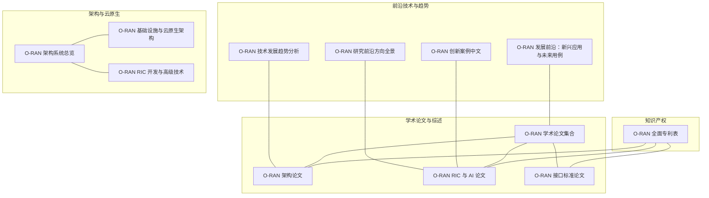
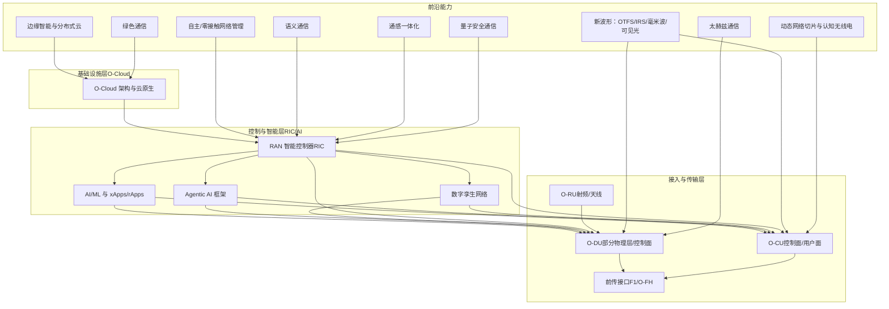
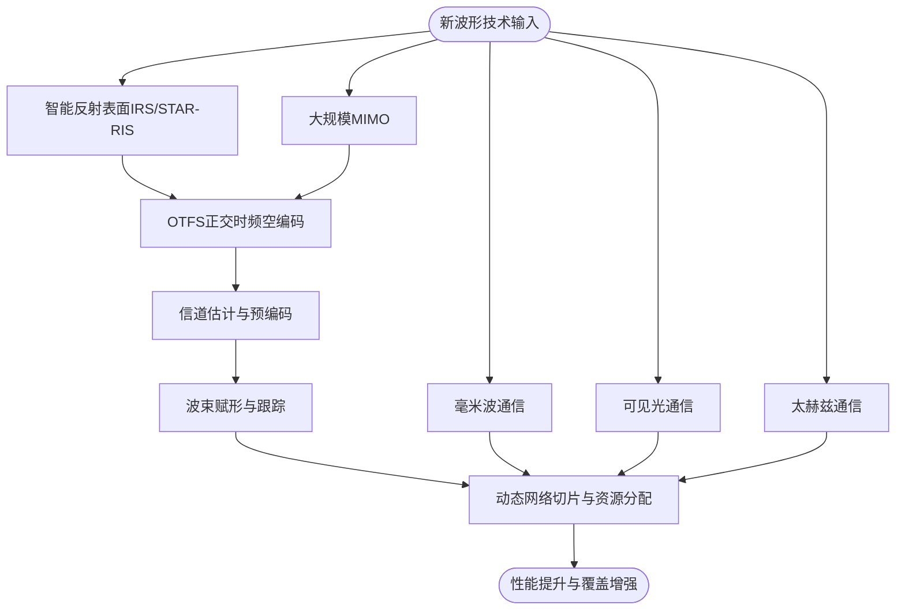
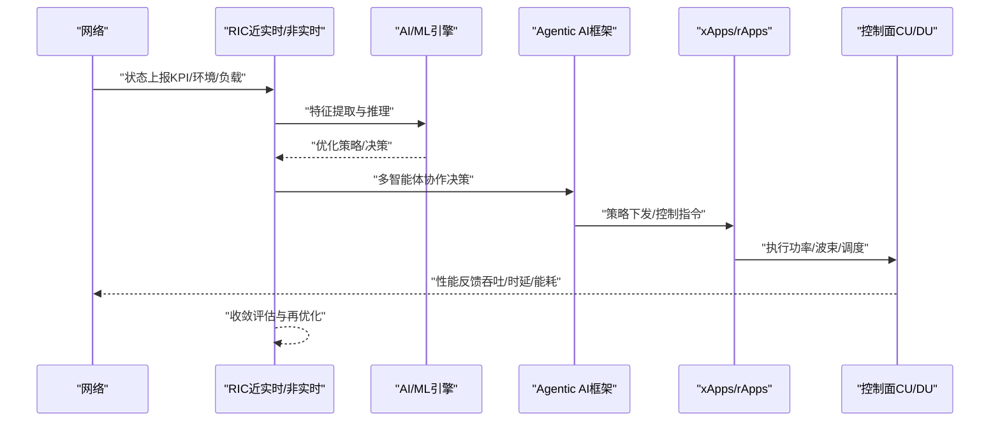
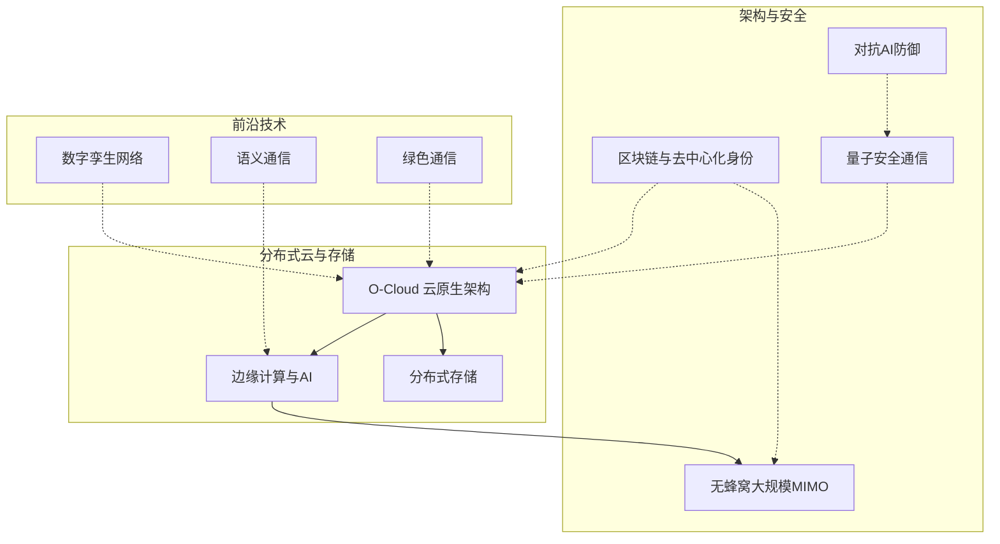
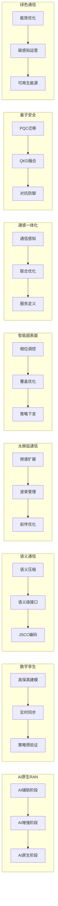
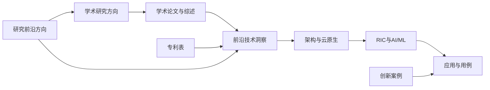

# 研究前沿动态

<cite>
**本文引用的文件**
- [O-RAN 发展前沿：新兴应用与未来用例](file://15-future-development/emerging-applications/emerging-applications-roadmap.md)
- [O-RAN 技术发展趋势分析](file://15-future-development/technology-trends/technology-evolution-roadmap.md)
- [O-RAN 研究前沿方向全景](file://15-future-development/research-frontiers/research-directions.md)
- [O-RAN 学术论文集合](file://11-academic-papers/readme.md)
- [O-RAN 架构论文](file://11-academic-papers/architecture/readme.md)
- [O-RAN RIC 与 AI 论文](file://11-academic-papers/ric-ai/readme.md)
- [O-RAN 接口标准论文](file://11-academic-papers/interfaces/readme.md)
- [O-RAN 全面专利表](file://comprehensive-oran-patent-table.md)
- [O-RAN 基础设施与云原生架构](file://01-architecture-system/o-cloud-architecture.md)
- [O-RAN 架构系统总览](file://01-architecture-system/readme.md)
- [O-RAN RIC 开发与高级技术](file://07-ric-development/readme.md)
- [O-RAN 创新案例（中文）](file://21-case-studies/innovation-cases/o-ran-innovation-cases-zh.md)
</cite>

## 更新摘要
**变更内容**
- 新增"研究前沿方向全景"章节，涵盖AI原生RAN、数字孪生、语义通信等十大前沿研究方向
- 扩展网络智能化部分，增加Agentic AI、大语言模型、联邦学习等最新技术
- 增强架构创新内容，补充量子通信、后量子密码、对抗AI安全等前沿领域
- 更新性能考虑，纳入碳感知网络运营和极致能效设计
- 完善故障排查指南，增加AI模型漂移、量子安全迁移等新场景

## 目录
1. [引言](#引言)
2. [项目结构](#项目结构)
3. [核心组件](#核心组件)
4. [架构总览](#架构总览)
5. [详细组件分析](#详细组件分析)
6. [依赖分析](#依赖分析)
7. [性能考虑](#性能考虑)
8. [故障排查指南](#故障排查指南)
9. [结论](#结论)
10. [附录](#附录)

## 引言
本文件面向O-RAN研究前沿动态，聚焦新波形技术（OTFS正交时频空编码、智能反射表面IRS、大规模MIMO增强、毫米波与可见光通信）、网络智能化（自主/零接触网络管理、智能频谱共享、动态网络切片、认知无线电），以及架构创新（无蜂窝大规模MIMO、分布式云架构、区块链与去中心化身份、分布式存储）。通过对仓库中"未来发展方向""学术论文""架构与云原生""RIC与AI""专利表"以及新增的"研究前沿方向全景"等资料的系统梳理，形成面向O-RAN技术演进的深度分析与可视化说明，帮助读者把握前沿研究对O-RAN技术发展的推动作用。

**更新** 新增了对AI原生RAN、数字孪生网络、语义通信、太赫兹通信、智能超表面、通感一体化、量子通信与RAN安全、绿色通信等十大前沿研究方向的系统性分析。

## 项目结构
本仓库围绕O-RAN的知识体系与实践路径，按主题域组织文档与案例，形成"基础—架构—接口—AI/ML—云原生—专利—案例—未来趋势"的知识谱系。下图给出与本分析直接相关的知识子集与交互关系。

**图表来源**
- [O-RAN 发展前沿：新兴应用与未来用例:1-879](file://15-future-development/emerging-applications/emerging-applications-roadmap.md#L1-L879)
- [O-RAN 技术发展趋势分析:1-68](file://15-future-development/technology-trends/technology-evolution-roadmap.md#L1-L68)
- [O-RAN 研究前沿方向全景:1-177](file://15-future-development/research-frontiers/research-directions.md#L1-L177)
- [O-RAN 学术论文集合:1-88](file://11-academic-papers/readme.md#L1-L88)
- [O-RAN 架构论文:1-84](file://11-academic-papers/architecture/readme.md#L1-L84)
- [O-RAN RIC 与 AI 论文:1-98](file://11-academic-papers/ric-ai/readme.md#L1-L98)
- [O-RAN 接口标准论文:1-98](file://11-academic-papers/interfaces/readme.md#L1-L98)
- [O-RAN 基础设施与云原生架构:1-62](file://01-architecture-system/o-cloud-architecture.md#L1-L62)
- [O-RAN 架构系统总览:1-161](file://01-architecture-system/readme.md#L1-L161)
- [O-RAN RIC 开发与高级技术:1-368](file://07-ric-development/readme.md#L1-L368)
- [O-RAN 全面专利表:1-258](file://comprehensive-oran-patent-table.md#L1-L258)
- [O-RAN 创新案例（中文）:211-279](file://21-case-studies/innovation-cases/o-ran-innovation-cases-zh.md#L211-L279)

**章节来源**
- [O-RAN 发展前沿：新兴应用与未来用例:1-879](file://15-future-development/emerging-applications/emerging-applications-roadmap.md#L1-L879)
- [O-RAN 技术发展趋势分析:1-68](file://15-future-development/technology-trends/technology-evolution-roadmap.md#L1-L68)
- [O-RAN 研究前沿方向全景:1-177](file://15-future-development/research-frontiers/research-directions.md#L1-L177)
- [O-RAN 学术论文集合:1-88](file://11-academic-papers/readme.md#L1-L88)
- [O-RAN 架构论文:1-84](file://11-academic-papers/architecture/readme.md#L1-L84)
- [O-RAN RIC 与 AI 论文:1-98](file://11-academic-papers/ric-ai/readme.md#L1-L98)
- [O-RAN 接口标准论文:1-98](file://11-academic-papers/interfaces/readme.md#L1-L98)
- [O-RAN 基础设施与云原生架构:1-62](file://01-architecture-system/o-cloud-architecture.md#L1-L62)
- [O-RAN 架构系统总览:1-161](file://01-architecture-system/readme.md#L1-L161)
- [O-RAN RIC 开发与高级技术:1-368](file://07-ric-development/readme.md#L1-L368)
- [O-RAN 全面专利表:1-258](file://comprehensive-oran-patent-table.md#L1-L258)
- [O-RAN 创新案例（中文）:211-279](file://21-case-studies/innovation-cases/o-ran-innovation-cases-zh.md#L211-L279)

## 核心组件
- **新波形与传播**：OTFS正交时频空编码、智能反射表面IRS、大规模MIMO增强、毫米波与可见光通信等前沿技术在6G及未来网络中扮演关键角色，支撑更高频谱效率、更强鲁棒性与更广覆盖。
- **网络智能化**：自主/零接触网络管理、智能频谱共享、动态网络切片、认知无线电等技术，依托AI/ML与RIC实现闭环优化与自适应控制。**更新** 新增Agentic AI框架、大语言模型驱动的网络意图转译、联邦学习等前沿技术。
- **架构创新**：无蜂窝大规模MIMO、分布式云架构、区块链与去中心化身份、分布式存储等，推动O-RAN向弹性、自治、可信的方向演进。**更新** 补充量子通信、后量子密码、对抗AI防御等安全前沿技术。
- **前沿研究方向**：**新增** AI原生RAN架构、数字孪生网络、语义通信、太赫兹通信、智能超表面、通感一体化、量子通信与RAN安全、绿色通信等十大研究方向。

上述能力在"发展前沿""技术趋势""研究前沿方向全景""学术论文""专利表"中均有体现，且与"架构系统""云原生""RIC开发"形成技术落地与工程化支撑。

**章节来源**
- [O-RAN 发展前沿：新兴应用与未来用例:1-879](file://15-future-development/emerging-applications/emerging-applications-roadmap.md#L1-L879)
- [O-RAN 技术发展趋势分析:1-68](file://15-future-development/technology-trends/technology-evolution-roadmap.md#L1-L68)
- [O-RAN 研究前沿方向全景:1-177](file://15-future-development/research-frontiers/research-directions.md#L1-L177)
- [O-RAN 全面专利表:1-258](file://comprehensive-oran-patent-table.md#L1-L258)
- [O-RAN 架构系统总览:1-161](file://01-architecture-system/readme.md#L1-L161)
- [O-RAN 基础设施与云原生架构:1-62](file://01-architecture-system/o-cloud-architecture.md#L1-L62)
- [O-RAN RIC 开发与高级技术:1-368](file://07-ric-development/readme.md#L1-L368)

## 架构总览
下图展示O-RAN架构与前沿技术的耦合关系：以云原生基础设施为底座，以RIC与AI/ML为神经中枢，向上承载新波形、智能频谱、动态切片等能力，向下对接RU/CU/DU等实体，形成"感知—决策—执行—反馈"的闭环。

**图表来源**
- [O-RAN 基础设施与云原生架构:1-62](file://01-architecture-system/o-cloud-architecture.md#L1-L62)
- [O-RAN 架构系统总览:1-161](file://01-architecture-system/readme.md#L1-L161)
- [O-RAN RIC 开发与高级技术:1-368](file://07-ric-development/readme.md#L1-L368)
- [O-RAN 发展前沿：新兴应用与未来用例:1-879](file://15-future-development/emerging-applications/emerging-applications-roadmap.md#L1-L879)
- [O-RAN 研究前沿方向全景:1-177](file://15-future-development/research-frontiers/research-directions.md#L1-L177)

## 详细组件分析

### 新波形技术：OTFS、IRS、大规模MIMO、毫米波与可见光通信
- OTFS正交时频空编码：面向高速移动与强多普勒场景的鲁棒性传输，提升时频稳定性和频谱效率，支撑6G高维信道建模与高移动性场景。
- 智能反射表面（IRS）：通过可编程电磁环境重构，实现波束整形、覆盖增强与干扰抑制，与大规模MIMO协同提升空间复用增益。**更新** STAR-RIS支持同时透射与反射的全空间覆盖。
- 大规模MIMO增强：结合通道估计、预编码与波束赋形优化，配合AI/ML实现自适应波束跟踪与干扰协调。
- 毫米波与可见光通信：扩展频谱资源与实现短距离高带宽、低功耗通信，支撑室内覆盖与高密度场景。**更新** 太赫兹通信提供数THz连续带宽，峰值速率可达Tbps量级。

**图表来源**
- [O-RAN 发展前沿：新兴应用与未来用例:1-879](file://15-future-development/emerging-applications/emerging-applications-roadmap.md#L1-L879)
- [O-RAN 技术发展趋势分析:1-68](file://15-future-development/technology-trends/technology-evolution-roadmap.md#L1-L68)
- [O-RAN 研究前沿方向全景:66-85](file://15-future-development/research-frontiers/research-directions.md#L66-L85)
- [O-RAN 全面专利表:94-123](file://comprehensive-oran-patent-table.md#L94-L123)

**章节来源**
- [O-RAN 发展前沿：新兴应用与未来用例:1-879](file://15-future-development/emerging-applications/emerging-applications-roadmap.md#L1-L879)
- [O-RAN 技术发展趋势分析:1-68](file://15-future-development/technology-trends/technology-evolution-roadmap.md#L1-L68)
- [O-RAN 研究前沿方向全景:66-85](file://15-future-development/research-frontiers/research-directions.md#L66-L85)
- [O-RAN 全面专利表:94-123](file://comprehensive-oran-patent-table.md#L94-L123)

### 网络智能化：自主/零接触管理、智能频谱共享、动态切片与认知无线电
- 自主/零接触网络管理：基于AI/ML的闭环优化，实现自配置、自优化、自修复；结合xApps/rApps在近实时与非实时RIC中落地。**更新** Agentic AI框架接管多维协作决策，LLM驱动的网络意图转译。
- 智能频谱共享：利用感知与预测模型，实现动态频谱接入与干扰规避，支撑异构网络共存。
- 动态网络切片：面向垂直行业差异化需求的端到端切片编排与SLA保障。
- 认知无线电：在未知环境下的感知、建模与自适应调整，提升资源利用率与抗干扰能力。
- **新增** 联邦学习用于跨运营商数据不出域的协作优化模型训练。

**图表来源**
- [O-RAN RIC 开发与高级技术:1-368](file://07-ric-development/readme.md#L1-L368)
- [O-RAN RIC 与 AI 论文:1-98](file://11-academic-papers/ric-ai/readme.md#L1-L98)
- [O-RAN 发展前沿：新兴应用与未来用例:61-282](file://15-future-development/emerging-applications/emerging-applications-roadmap.md#L61-L282)
- [O-RAN 研究前沿方向全景:7-27](file://15-future-development/research-frontiers/research-directions.md#L7-L27)

**章节来源**
- [O-RAN RIC 开发与高级技术:1-368](file://07-ric-development/readme.md#L1-L368)
- [O-RAN RIC 与 AI 论文:1-98](file://11-academic-papers/ric-ai/readme.md#L1-L98)
- [O-RAN 发展前沿：新兴应用与未来用例:61-282](file://15-future-development/emerging-applications/emerging-applications-roadmap.md#L61-L282)
- [O-RAN 研究前沿方向全景:7-27](file://15-future-development/research-frontiers/research-directions.md#L7-L27)

### 架构创新：无蜂窝大规模MIMO、分布式云、区块链与去中心化身份、分布式存储
- 无蜂窝大规模MIMO：以智能表面与分布式天线阵列实现无固定蜂窝拓扑的灵活覆盖与高容量传输。
- 分布式云架构：O-Cloud作为云原生基础设施，支撑弹性伸缩、自动化编排与可观测性，为AI/ML与边缘智能提供底座。
- 区块链与去中心化身份：在跨域编排、可信审计与身份治理方面提供透明、不可篡改与可验证的能力。
- 分布式存储：面向海量网络数据与AI训练样本的高可用、可扩展与低延迟存储体系。
- **新增** 量子通信与RAN安全：后量子密码迁移、量子密钥分发、对抗AI防御等安全前沿技术。

**图表来源**
- [O-RAN 基础设施与云原生架构:1-62](file://01-architecture-system/o-cloud-architecture.md#L1-L62)
- [O-RAN 架构系统总览:1-161](file://01-architecture-system/readme.md#L1-L161)
- [O-RAN 研究前沿方向全景:28-47](file://15-future-development/research-frontiers/research-directions.md#L28-L47)
- [O-RAN 全面专利表:149-153](file://comprehensive-oran-patent-table.md#L149-L153)

**章节来源**
- [O-RAN 基础设施与云原生架构:1-62](file://01-architecture-system/o-cloud-architecture.md#L1-L62)
- [O-RAN 架构系统总览:1-161](file://01-architecture-system/readme.md#L1-L161)
- [O-RAN 研究前沿方向全景:28-47](file://15-future-development/research-frontiers/research-directions.md#L28-L47)
- [O-RAN 全面专利表:149-153](file://comprehensive-oran-patent-table.md#L149-L153)

### 前沿研究方向：AI原生RAN、数字孪生、语义通信等十大方向
**新增** 基于最新研究前沿方向文档，系统梳理以下十大前沿研究方向：

#### 1. AI原生RAN架构
- **范式转变**：从AI辅助到AI增强的Agentic AI框架，再到AI原生的网络协议栈重新设计
- **关键研究问题**：AI原生空口、面向强化学习的协议栈重设计、可解释AI的可信度保证
- **代表性方向**：Multi-Scale Agentic AI、WirelessGPT/TeleLLM、联邦学习用于RAN

#### 2. 数字孪生网络
- **研究目标**：构建无线网络的高保真数字镜像，支持"先仿真后部署"的工程范式
- **核心挑战**：高保真建模、低延迟同步、可扩展性、数据对齐
- **产业进展**：NVIDIA AODT、6G-TWIN框架、O-RAN WG6仿真增强

#### 3. 语义通信
- **范式突破**：从比特传输到语义信息传输，引入"任务成功率"作为新性能指标
- **在RAN中的切入点**：语义压缩的无线资源利用、语义级RIC接口、联合信源信道编码
- **6G标准化动向**：3GPP Release 20预研课题、O-RAN与语义通信的结合点

#### 4. 太赫兹通信
- **频谱前景**：0.1-10 THz频段可提供数THz连续带宽，峰值速率可达Tbps量级
- **O-RAN相关研究**：快速波束训练/跟踪、动态切换、前传带宽需求、解聚策略
- **关键机构**：NYU WIRELESS中心、日本Beyond 5G推进同盟、欧盟6G-ANNA项目

#### 5. 智能超表面（RIS/STAR-RIS）
- **技术原理**：可编程超材料表面，通过改变单元相位实现电磁波反射/折射方向的智能调控
- **与O-RAN的结合**：RIS辅助小区覆盖优化、RIS辅助前传链路、RIS配置作为A1 Policy新策略类型
- **研究挑战**：信道估计、硬件约束、标准化空白

#### 6. 通感一体化（ISAC）
- **概念**：同一信号/设备同时具备通信与雷达感知功能
- **与O-RAN的集成**：ISAC数据作为E2 Service Model新服务、Near-RT RIC执行联合资源优化
- **进展**：3GPP Release 19立项、O-RAN联盟WG3讨论、中国6G白皮书明确优先研究方向

#### 7. 量子通信与RAN安全
- **后量子密码迁移**：NIST已标准化三类PQC算法，O-RAN接口的PQC迁移影响评估
- **量子密钥分发**：基于光纤QKD的前传/中传加密、基于量子随机数的RAN初始密钥生成
- **对抗AI安全**：对AI驱动的RIC进行对抗样本攻击、防御策略、O-RAN WG11安全威胁模型更新

#### 8. 绿色通信与极限能效
- **研究目标**：6G每bit能耗较5G降低10-100倍，"碳感知网络运营"
- **关键方向**：大规模MIMO休眠算法、功放效率极限、风/光可再生驱动的站点设计
- **在RIC中的实践**：xApp节能应用、业界实测节能效果

#### 9. 开放研究资源与社区
- **O-RAN联盟**：开放研究提案、O-RAN研究社区
- **OSC**：O-RAN Software Community开源代码库
- **学术会议**：IEEE ICC/Globecom O-RAN Workshop、ACM MobiCom、NSDI
- **数据集**：O-RAN数据仓库、ArXiv O-RAN标签

#### 10. 与其他章节的关联
- 研究论文追踪、AI-RAN落地与技术平台、安全与对抗防御、标准化进展、技术发展趋势

**图表来源**
- [O-RAN 研究前沿方向全景:7-169](file://15-future-development/research-frontiers/research-directions.md#L7-L169)

**章节来源**
- [O-RAN 研究前沿方向全景:7-169](file://15-future-development/research-frontiers/research-directions.md#L7-L169)

## 依赖分析
- **技术依赖**：新波形（OTFS/IRS/MIMO）依赖大规模MIMO与信道建模能力；网络智能化依赖AI/ML与RIC；架构创新依赖云原生与边缘计算。
- **文档依赖**：学术论文为技术洞察提供理论基础；专利表为技术边界与竞争态势提供参考；架构与云原生文档为工程落地提供方法论；RIC开发文档为应用编排提供范式。
- **案例依赖**：创新案例展示了XR、脑机接口、遥感数据等前沿应用对O-RAN能力的牵引。
- **新增依赖**：研究前沿方向文档为前沿技术研究提供系统性指导，连接学术研究与实际应用。

**图表来源**
- [O-RAN 学术论文集合:1-88](file://11-academic-papers/readme.md#L1-L88)
- [O-RAN 架构论文:1-84](file://11-academic-papers/architecture/readme.md#L1-L84)
- [O-RAN RIC 与 AI 论文:1-98](file://11-academic-papers/ric-ai/readme.md#L1-L98)
- [O-RAN 接口标准论文:1-98](file://11-academic-papers/interfaces/readme.md#L1-L98)
- [O-RAN 全面专利表:1-258](file://comprehensive-oran-patent-table.md#L1-L258)
- [O-RAN 创新案例（中文）:211-279](file://21-case-studies/innovation-cases/o-ran-innovation-cases-zh.md#L211-L279)
- [O-RAN 研究前沿方向全景:162-177](file://15-future-development/research-frontiers/research-directions.md#L162-L177)

**章节来源**
- [O-RAN 学术论文集合:1-88](file://11-academic-papers/readme.md#L1-L88)
- [O-RAN 全面专利表:1-258](file://comprehensive-oran-patent-table.md#L1-L258)
- [O-RAN 创新案例（中文）:211-279](file://21-case-studies/innovation-cases/o-ran-innovation-cases-zh.md#L211-L279)
- [O-RAN 研究前沿方向全景:162-177](file://15-future-development/research-frontiers/research-directions.md#L162-L177)

## 性能考虑
- **实时性与可靠性**：近实时RIC与关键控制面需满足毫秒级响应与高可用性；容器化与网络优化（SR-IOV/DPDK）是保障性能的关键。
- **可观测性与可运维**：统一监控、分布式追踪与智能告警，支撑闭环优化与故障自愈。
- **能耗与绿色**：智能休眠、可再生能源集成与碳足迹监测，实现可持续网络运营。**更新** 引入"碳感知网络运营"理念，将碳排放指标纳入RIC资源调度目标。
- **安全性**：**新增** 后量子密码迁移的性能影响评估（ML-KEM密钥交换导致3-8ms延迟增量）、量子密钥分发的集成方案、对抗AI攻击的防御机制。

**章节来源**
- [O-RAN 基础设施与云原生架构:123-176](file://01-architecture-system/o-cloud-architecture.md#L123-L176)
- [O-RAN 全面专利表:118-134](file://comprehensive-oran-patent-table.md#L118-L134)
- [O-RAN 研究前沿方向全景:127-161](file://15-future-development/research-frontiers/research-directions.md#L127-L161)

## 故障排查指南
- **接口与协议**：优先检查E2/A1/O1等接口的连通性、消息格式与服务模型一致性。
- **AI/ML模型**：关注模型漂移、推理延迟与异常检测误报率，建立重训练与回滚机制。**更新** 增加对Agentic AI框架和多智能体协作的故障诊断。
- **安全与合规**：启用零信任、mTLS与API网关防护，定期进行漏洞扫描与合规审计。**更新** 增加后量子密码迁移的兼容性测试、量子安全通信的集成验证。
- **云原生与弹性**：核查容器资源配额、HPA/VPA与Pod健康探针，确保自动扩缩容与故障转移生效。
- **数字孪生**：**新增** 数字孪生网络的同步延迟监控、高保真建模的准确性验证、what-if分析的可靠性评估。
- **语义通信**：**新增** 语义压缩的效率评估、语义级接口的兼容性测试、联合信源信道编码的性能调优。

**章节来源**
- [O-RAN 接口标准论文:57-98](file://11-academic-papers/interfaces/readme.md#L57-L98)
- [O-RAN RIC 开发与高级技术:171-196](file://07-ric-development/readme.md#L171-L196)
- [O-RAN 基础设施与云原生架构:151-176](file://01-architecture-system/o-cloud-architecture.md#L151-L176)
- [O-RAN 研究前沿方向全景:28-47](file://15-future-development/research-frontiers/research-directions.md#L28-L47)

## 结论
新波形、网络智能化与架构创新共同构成O-RAN向6G与未来网络演进的三大支柱。**更新** 随着AI原生RAN、数字孪生、语义通信、太赫兹通信、智能超表面、通感一体化、量子通信与RAN安全、绿色通信等十大前沿研究方向的快速发展，O-RAN技术生态正在经历从"AI辅助"向"AI原生"的范式转变。学术论文提供理论基础，专利表刻画技术边界，架构与云原生奠定工程能力，RIC与AI/ML打通从感知到决策再到执行的闭环。通过系统化整合这些资源，O-RAN能够在高频谱效率、强鲁棒性、低时延与高自治性等方面取得突破，支撑XR、脑机接口、智慧城市等前沿应用。

## 附录
- **术语与参考**：O-RAN参考架构、RIC、xApps/rApps、E2/A1/O1接口、O-Cloud、边缘AI、联邦学习、量子通信、Agentic AI、数字孪生、语义通信、太赫兹通信、智能超表面、通感一体化、后量子密码等。
- **学习路径建议**：从架构与云原生入手，结合RIC开发与AI/ML实践，再回到专利与案例验证，形成"理论—工程—验证"的闭环。**更新** 建议重点关注研究前沿方向文档，了解最新的学术热点与产业趋势。
- **研究资源**：**新增** O-RAN联盟开放研究提案、OSC开源社区、ArXiv O-RAN标签数据集、学术会议工作坊等研究资源链接。