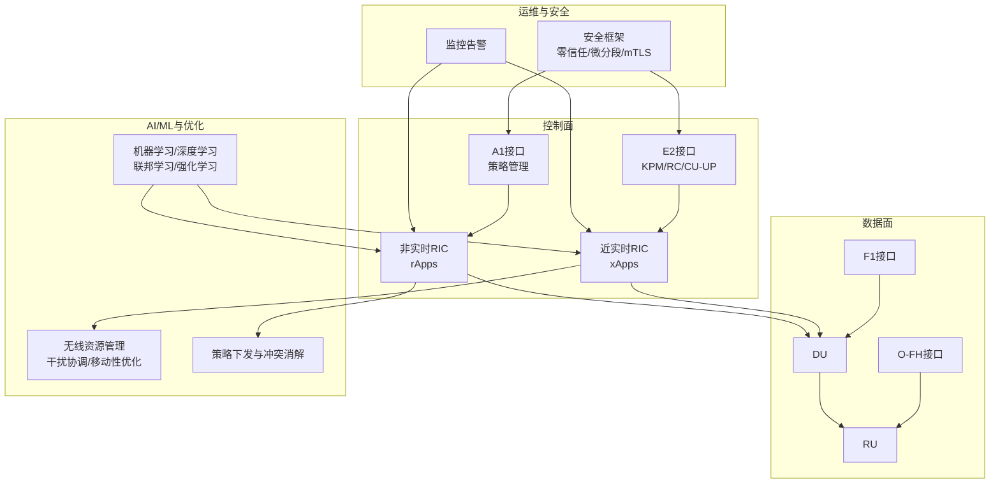
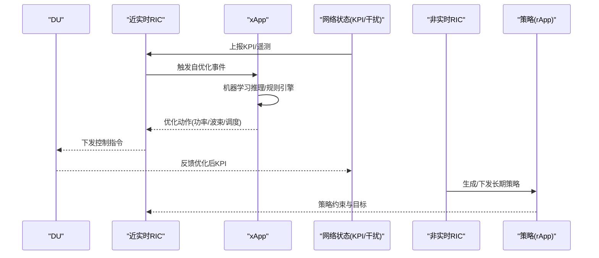
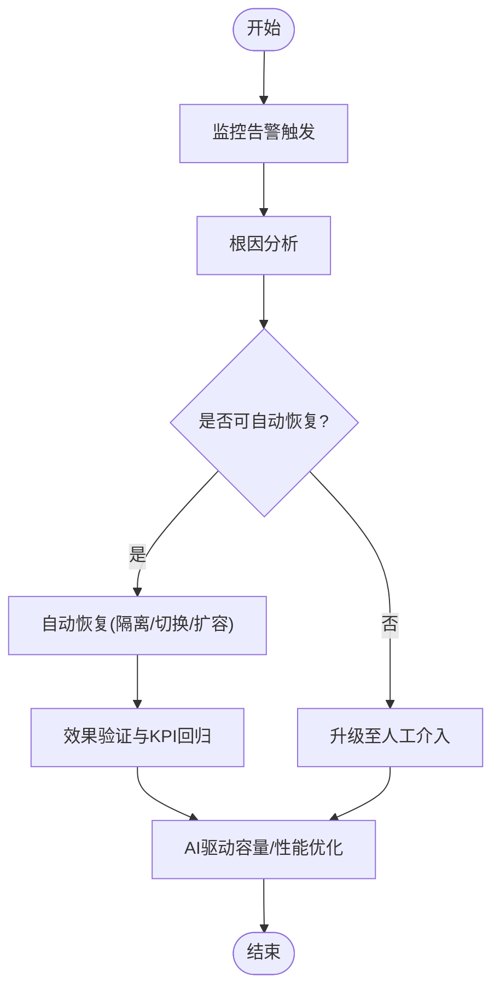
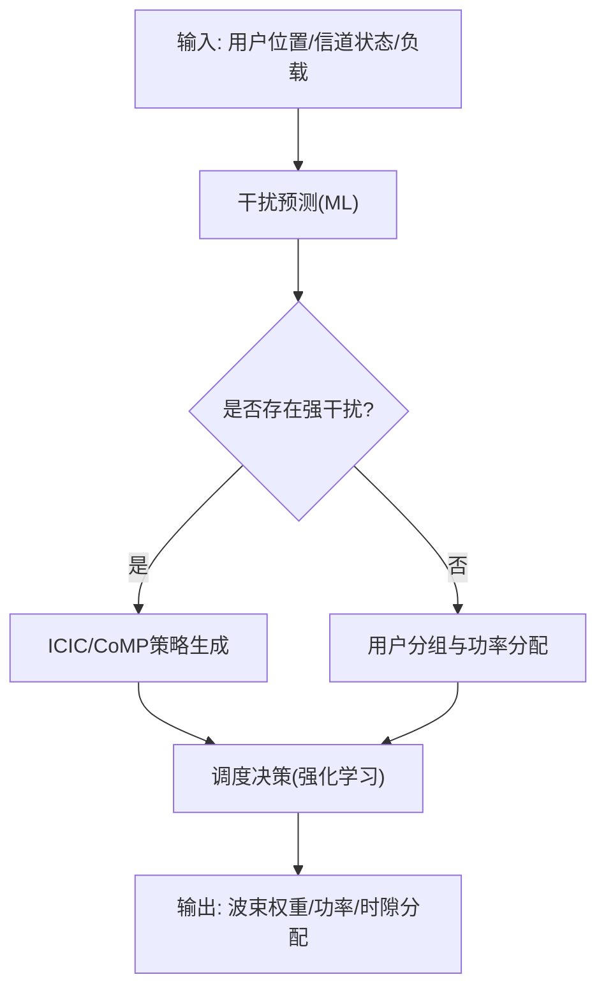
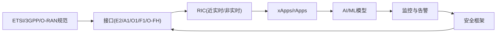

# 网络智能化创新

<cite>
**本文引用的文件**
- [README.md](file://README.md)
- [O-RAN高级技术（中文）](file://07-ric-development/readme-zh.md)
- [O-RAN高级技术（英文）](file://07-ric-development/readme.md)
- [O-RAN运维管理（中文）](file://14-operations-management/readme-zh.md)
- [O-RAN性能优化与调优（中文）](file://26-performance-optimization/readme-zh.md)
- [O-RAN创新案例（中文）](file://21-case-studies/innovation-cases/o-ran-innovation-cases-zh.md)
- [AI/ML原生O-RAN应用路线图（中文）](file://15-future-development/emerging-applications/emerging-applications-roadmap.md)
- [O-RAN网络安全框架（中文）](file://12-security-privacy/network-security/network-security-framework-zh.md)
- [O-RAN国际部署：本地化策略（中文）](file://23-international-deployment/localization-adaptation/o-ran-localization-strategies.md)
- [O-RAN国际部署：区域策略（中文）](file://23-international-deployment/regional-strategies/o-ran-regional-deployment-strategies.md)
- [O-RAN专利总表（节选）](file://comprehensive-oran-patent-table.md)
- [O-RAN RIC与AI论文索引（中文）](file://11-academic-papers/ric-ai/readme.md)
</cite>

## 目录
1. [简介](#简介)
2. [项目结构](#项目结构)
3. [核心组件](#核心组件)
4. [架构总览](#架构总览)
5. [详细组件分析](#详细组件分析)
6. [依赖分析](#依赖分析)
7. [性能考量](#性能考量)
8. [故障排查指南](#故障排查指南)
9. [结论](#结论)
10. [附录](#附录)

## 简介
本文件面向“网络智能化创新”的目标，围绕O-RAN体系下的自主网络、零接触运维、智能频谱共享、动态网络切片与认知无线电等关键技术，结合仓库中的权威技术文档与案例实践，提供系统化的技术洞察与实施路径。内容既覆盖架构与接口层面，也深入到智能算法、安全与国际化落地策略，帮助读者形成从理论到工程实践的完整认知。

## 项目结构
该知识库采用模块化组织方式，围绕O-RAN架构、核心网元、接口标准、解耦选项、云平台融合、工作小组、RIC与AI、部署实施、标准合规、应用场景、测试验证、运维管理、未来方向、产业生态、成本效益、人才发展、生态系统合作、案例研究、工具平台、国际部署、可持续发展、法律法规、性能优化、故障诊断、监控告警、安全威胁、最佳实践等维度展开。整体结构清晰、层次分明，适合按阶段学习与工程落地。

```mermaid
graph TB
A["知识库概览<br/>README.md"] --> B["架构与系统<br/>01-architecture-system/*"]
A --> C["核心网元<br/>02-core-components/*"]
A --> D["接口标准<br/>03-interface-standards/*"]
A --> E["解耦选项<br/>04-disaggregation-options/*"]
A --> F["云平台融合<br/>05-cloud-integration/*"]
A --> G["工作小组<br/>06-working-groups/*"]
A --> H["RIC与AI<br/>07-ric-development/*"]
A --> I["部署实施<br/>08-deployment-implementation/*"]
A --> J["标准合规<br/>09-standards-compliance/*"]
A --> K["应用场景<br/>10-application-scenarios/*"]
A --> L["学术论文<br/>11-academic-papers/*"]
A --> M["安全与隐私<br/>12-security-privacy/*"]
A --> N["测试与验证<br/>13-testing-validation/*"]
A --> O["运维管理<br/>14-operations-management/*"]
A --> P["未来发展方向<br/>15-future-development/*"]
A --> Q["产业解决方案<br/>16-industry-solutions/*"]
A --> R["开源生态<br/>17-open-source-ecosystem/*"]
A --> S["成本效益分析<br/>18-cost-benefit-analysis/*"]
A --> T["人才培养<br/>19-talent-development/*"]
A --> U["生态系统合作<br/>20-ecosystem-partnership/*"]
A --> V["案例研究<br/>21-case-studies/*"]
A --> W["工具与平台<br/>22-tool-platforms/*"]
A --> X["国际部署<br/>23-international-deployment/*"]
A --> Y["可持续发展<br/>24-sustainable-development/*"]
A --> Z["法律法规<br/>25-legal-regulations/*"]
A --> AA["性能优化<br/>26-performance-optimization/*"]
A --> BB["故障诊断<br/>27-troubleshooting-diagnosis/*"]
A --> CC["监控告警<br/>28-monitoring-alerting/*"]
A --> DD["安全威胁<br/>29-security-threats/*"]
A --> EE["最佳实践<br/>30-best-practices/*"]
```

**图表来源**
- [README.md](file://README.md#L6-L54)

**章节来源**
- [README.md](file://README.md#L6-L54)

## 核心组件
- RIC与AI：近实时RIC（Near-RT RIC）与非实时RIC（Non-RT RIC）协同，支撑xApps/rApps的闭环控制与策略管理，结合机器学习实现资源分配、干扰协调、移动性优化与能效优化。
- 接口标准：E2（KPM/RC/CU-UP）、A1（策略管理）、O1/O2/OAM等接口的实现要点与性能优化策略。
- 运维与自动化：监控告警、故障处理、容量规划、自动化部署与无人值守运维。
- 国际化与本地化：频谱与监管适配、区域部署策略、技术成熟度与成本考量。

**章节来源**
- [O-RAN高级技术（中文）](file://07-ric-development/readme-zh.md#L8-L33)
- [O-RAN高级技术（英文）](file://07-ric-development/readme.md#L8-L33)
- [O-RAN运维管理（中文）](file://14-operations-management/readme-zh.md#L6-L35)
- [O-RAN性能优化与调优（中文）](file://26-performance-optimization/readme-zh.md#L6-L25)

## 架构总览
下图展示了O-RAN智能化的关键构件与交互关系，强调从近实时控制到非实时策略、从接口协议到AI/ML算法、再到运维与安全的闭环。

**图表来源**
- [O-RAN高级技术（中文）](file://07-ric-development/readme-zh.md#L8-L33)
- [O-RAN高级技术（英文）](file://07-ric-development/readme.md#L8-L33)
- [O-RAN运维管理（中文）](file://14-operations-management/readme-zh.md#L15-L21)
- [O-RAN网络安全框架（中文）](file://12-security-privacy/network-security/network-security-framework-zh.md#L8-L40)

## 详细组件分析

### 自组织网络、自动配置与自适应优化
- 自组织网络（SON）能力可通过xApps在近实时RIC上实现，涵盖自动小区规划、参数自优化、负载均衡与干扰管理，形成“无人干预”的自愈闭环。
- 自动配置与自适应优化依托A1策略与Non-RT RIC的长期分析能力，结合机器学习模型对KPI进行预测与策略生成，实现动态参数调整与资源再平衡。
- 案例参考：创新案例中展示了Orange的自组织网络实践，包含自动配置与自愈能力的具体场景。

**图表来源**
- [O-RAN高级技术（中文）](file://07-ric-development/readme-zh.md#L60-L78)
- [O-RAN创新案例（中文）](file://21-case-studies/innovation-cases/o-ran-innovation-cases-zh.md#L34-L52)

**章节来源**
- [O-RAN创新案例（中文）](file://21-case-studies/innovation-cases/o-ran-innovation-cases-zh.md#L34-L52)
- [O-RAN高级技术（中文）](file://07-ric-development/readme-zh.md#L125-L149)

### 零接触网络管理：无人值守部署、自动故障恢复与智能运维决策
- 无人值守部署：结合自动化部署与CI/CD流水线、基础设施即代码（IaC），实现O-RAN组件的自动化安装、配置与升级。
- 自动故障恢复：建立监控告警与根因分析体系，结合xApps/rApps的自愈能力，实现故障检测、隔离与恢复。
- 智能运维决策：基于AI/ML的容量规划与性能优化，形成闭环反馈，持续改进网络质量与成本效率。

**图表来源**
- [O-RAN运维管理（中文）](file://14-operations-management/readme-zh.md#L22-L27)
- [O-RAN性能优化与调优（中文）](file://26-performance-optimization/readme-zh.md#L28-L34)

**章节来源**
- [O-RAN运维管理（中文）](file://14-operations-management/readme-zh.md#L22-L35)
- [O-RAN性能优化与调优（中文）](file://26-performance-optimization/readme-zh.md#L28-L40)

### 智能频谱共享：动态频谱分配、干扰协调与多用户调度优化
- 动态频谱分配与共享：结合区域频谱规划与DSS（动态频谱共享）策略，实现不同频段的协同利用与共存。
- 干扰协调：基于学习的干扰预测与ICIC/ICIC、CoMP等技术，降低小区间干扰。
- 多用户调度优化：利用强化学习/联邦学习进行用户分组、功率分配与调度策略优化，提升吞吐量与公平性。

**图表来源**
- [O-RAN高级技术（中文）](file://07-ric-development/readme-zh.md#L125-L149)
- [O-RAN国际部署：本地化策略（中文）](file://23-international-deployment/localization-adaptation/o-ran-localization-strategies.md#L10-L50)

**章节来源**
- [O-RAN高级技术（中文）](file://07-ric-development/readme-zh.md#L125-L149)
- [O-RAN国际部署：本地化策略（中文）](file://23-international-deployment/localization-adaptation/o-ran-localization-strategies.md#L10-L50)

### 动态网络切片：切片编排、资源隔离与性能保障
- 切片编排：基于A1策略与Non-RT RIC的长周期分析，实现跨域资源的统一编排与切片生命周期管理。
- 资源隔离：通过QoS策略、带宽配额与优先级调度，保障不同切片的服务质量。
- 性能保障：结合监控与AI预测，动态调整切片资源，确保SLA达成。

**章节来源**
- [O-RAN高级技术（英文）](file://07-ric-development/readme.md#L79-L98)
- [O-RAN性能优化与调优（中文）](file://26-performance-optimization/readme-zh.md#L6-L13)

### 认知无线电与智能接入：感知机制、频谱感知与接入策略
- 环境监测与频谱感知：结合区域频谱规划与本地化适配，实现对频谱占用与干扰的动态感知。
- 智能接入策略：基于AI/ML的用户画像与场景建模，实现自适应调制编码、功率控制与接入许可。
- 专利与前沿：仓库收录了智能超表面（IRS）等前沿技术专利，体现动态无线环境重构与信号增强的技术方向。

**章节来源**
- [O-RAN国际部署：本地化策略（中文）](file://23-international-deployment/localization-adaptation/o-ran-localization-strategies.md#L10-L50)
- [O-RAN专利总表（节选）](file://comprehensive-oran-patent-table.md#L101-L109)

### 智能化程度评估与部署成熟度分析
- 智能化评估维度：可从“自组织能力”“自动配置/优化”“自愈与无人值守”“AI/ML应用广度与深度”“安全与合规自动化”等方面进行量化评估。
- 成熟度模型：结合技术成熟度（设备/标准/运维经验/风险）与成本考量（初始投资/运维/能耗/TCO），制定分阶段部署策略（试点—扩展—全网—自动化创新）。

**章节来源**
- [O-RAN高级技术（中文）](file://07-ric-development/readme-zh.md#L197-L207)
- [O-RAN国际部署：区域策略（中文）](file://23-international-deployment/regional-strategies/o-ran-regional-deployment-strategies.md#L6-L62)
- [O-RAN国际部署：本地化策略（中文）](file://23-international-deployment/localization-adaptation/o-ran-localization-strategies.md#L417-L435)

## 依赖分析
- 组件耦合与协作：近实时RIC与非实时RIC在策略与控制之间形成互补；AI/ML贯穿控制与策略两端；监控与安全贯穿全链路。
- 外部依赖：ETSI/3GPP标准、O-RAN联盟规范、开源平台（Open RIC/SD-RIC、ONNX/TensorFlow/PyTorch、Prometheus/Grafana/Jaeger）。
- 潜在风险：接口互操作性、模型泛化与鲁棒性、安全威胁检测与响应自动化、区域监管差异带来的部署复杂性。

**图表来源**
- [O-RAN高级技术（英文）](file://07-ric-development/readme.md#L27-L33)
- [O-RAN网络安全框架（中文）](file://12-security-privacy/network-security/network-security-framework-zh.md#L8-L40)

**章节来源**
- [O-RAN高级技术（英文）](file://07-ric-development/readme.md#L27-L33)
- [O-RAN网络安全框架（中文）](file://12-security-privacy/network-security/network-security-framework-zh.md#L8-L40)

## 性能考量
- 网络层：频谱效率、干扰管理、QoS参数、负载均衡。
- 计算层：CPU/内存/存储/网络I/O优化，容器与微服务调优。
- 应用层：xApps/rApps性能与算法优化、接口协议优化、服务网格调优。
- 工具链：系统监控、网络分析、性能剖析、日志分析与可视化。

**章节来源**
- [O-RAN性能优化与调优（中文）](file://26-performance-optimization/readme-zh.md#L6-L25)
- [O-RAN运维管理（中文）](file://14-operations-management/readme-zh.md#L36-L58)

## 故障排查指南
- 快速定位：结合监控告警、根因分析工具与日志分析，定位软硬件/网络/接口/策略层面的问题。
- 应急响应：建立分级告警与升级流程，确保故障在可控时间内恢复。
- 知识库建设：沉淀故障案例与修复经验，形成可复用的知识资产。

**章节来源**
- [O-RAN运维管理（中文）](file://14-operations-management/readme-zh.md#L22-L28)

## 结论
通过将O-RAN架构、接口协议、AI/ML算法、安全与运维体系整合，可以实现从“自组织、自动配置、自适应优化”到“零接触运维、智能频谱共享、动态网络切片与认知无线电”的全栈智能化路径。结合区域化与本地化策略、成熟度与成本分析，以及持续的性能优化与故障治理，可稳步推进网络智能化创新落地。

## 附录
- 学术与论文：收录了RIC与AI相关论文索引，便于深入理解算法与应用现状。
- 未来方向：AI/ML原生O-RAN架构与6G融合路线，提供前瞻性技术蓝图。

**章节来源**
- [O-RAN RIC与AI论文索引（中文）](file://11-academic-papers/ric-ai/readme.md#L1-L34)
- [AI/ML原生O-RAN应用路线图（中文）](file://15-future-development/emerging-applications/emerging-applications-roadmap.md#L61-L282)