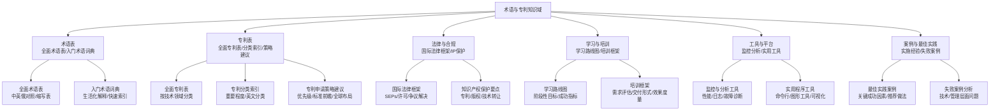
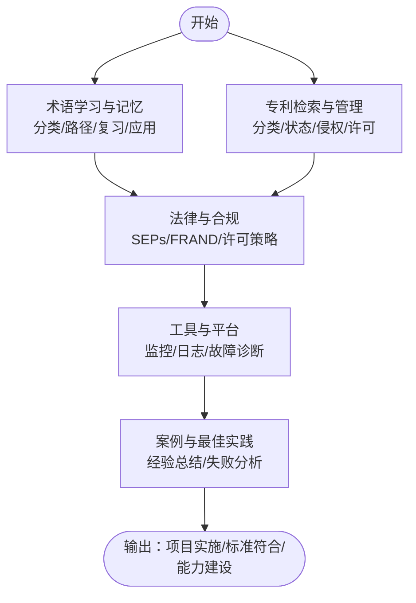
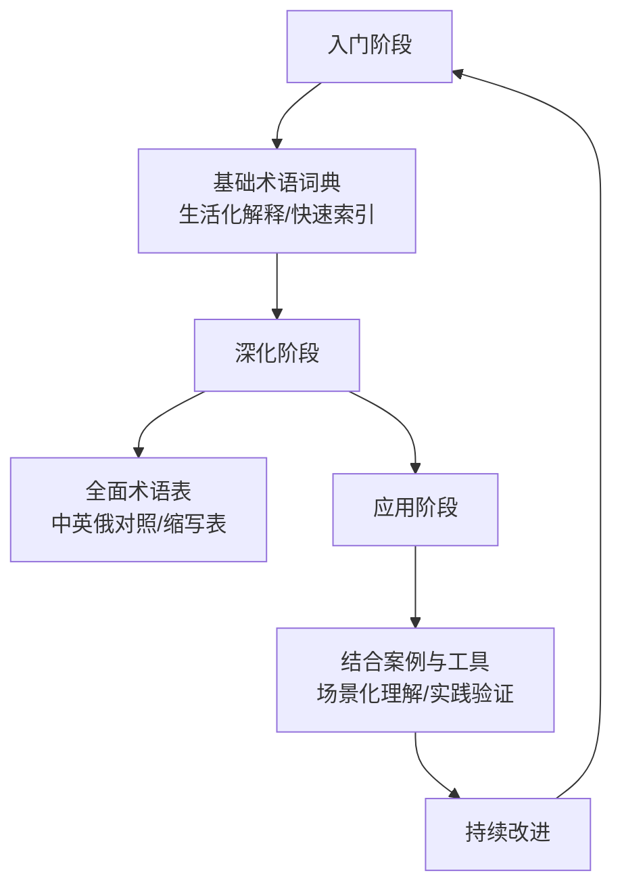
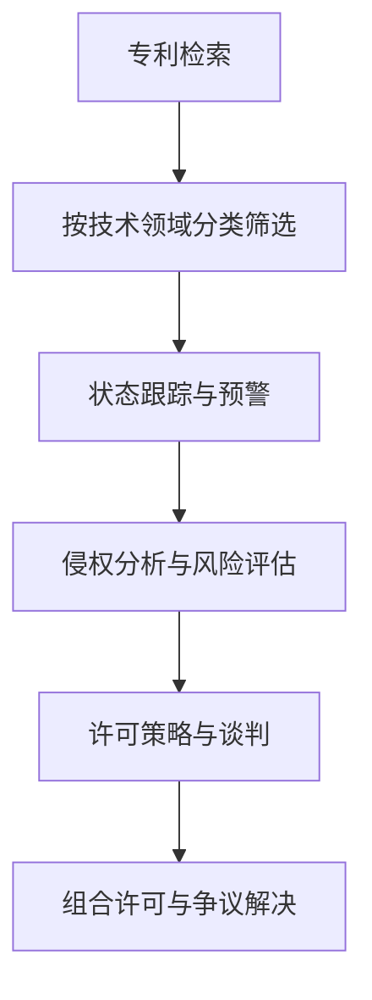
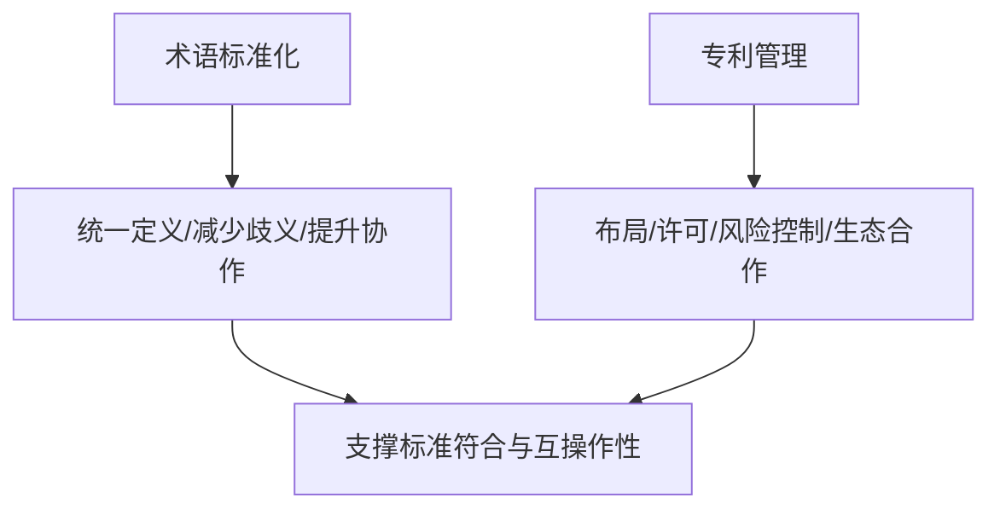
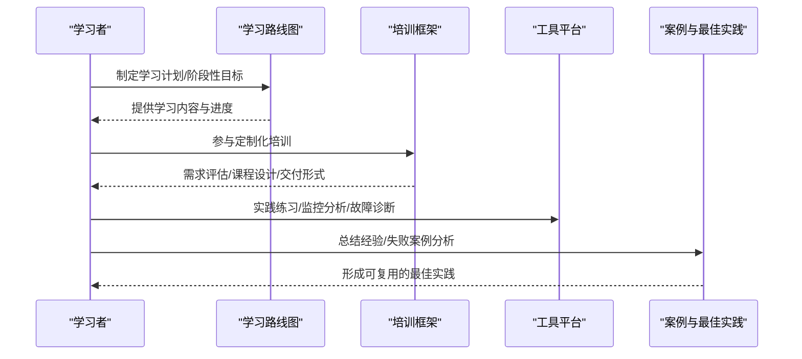
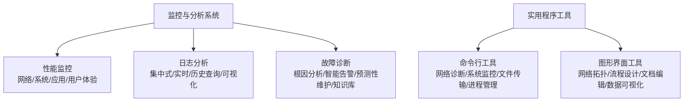
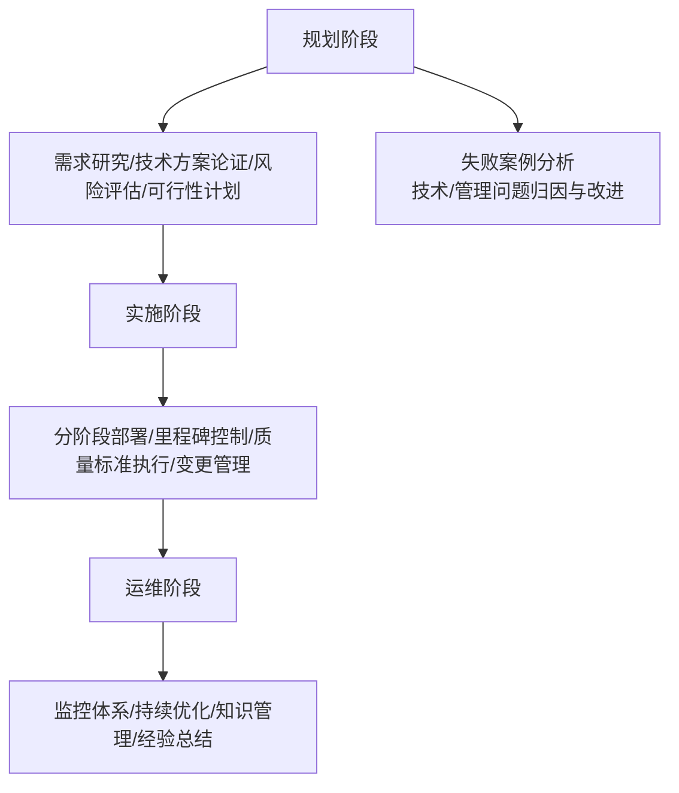
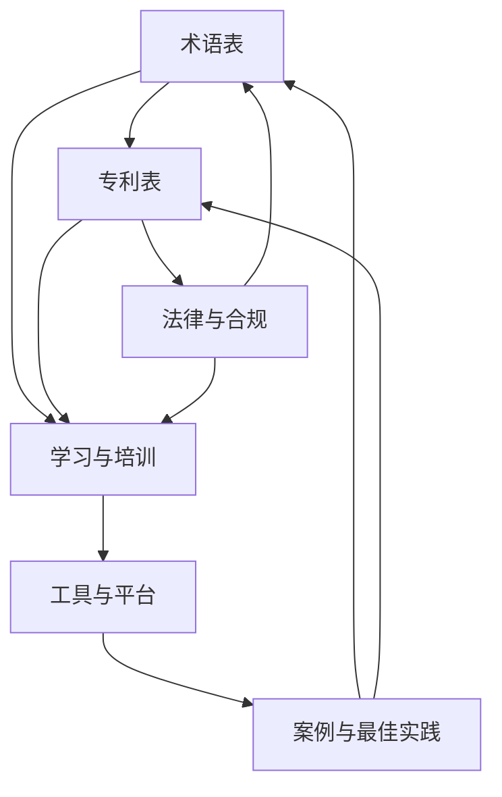

# 术语表与专利

<cite>
**本文档引用的文件**
- [comprehensive-oran-glossary.md](file://comprehensive-oran-glossary.md)
- [comprehensive-oran-patent-table.md](file://comprehensive-oran-patent-table.md)
- [README.md](file://README.md)
- [simple-glossary.md](file://12-oran-for-dummies/glossary/simple-glossary.md)
- [readme.md](file://12-oran-for-dummies/readme.md)
- [o-ran-international-legal-framework.md](file://25-legal-regulations/international-laws/o-ran-international-legal-framework.md)
- [o-ran-learning-roadmaps.md](file://19-talent-development/learning-paths/o-ran-learning-roadmaps.md)
- [o-ran-training-framework.md](file://19-talent-development/training-programs/o-ran-training-framework.md)
- [o-ran-monitoring-tools.md](file://28-monitoring-alerting/monitoring-tools/o-ran-monitoring-tools.md)
- [o-ran-monitoring-tools.md](file://26-performance-optimization/monitoring-tools/o-ran-monitoring-tools.md)
- [readme.md](file://22-tool-platforms/readme.md)
- [readme-zh.md](file://22-tool-platforms/readme-zh.md)
- [o-ran-best-practice-cases.md](file://21-case-studies/best-practices/o-ran-best-practice-cases.md)
- [readme.md](file://21-case-studies/readme.md)
</cite>

## 目录
1. [简介](#简介)
2. [项目结构](#项目结构)
3. [核心组件](#核心组件)
4. [架构总览](#架构总览)
5. [详细组件分析](#详细组件分析)
6. [依赖关系分析](#依赖关系分析)
7. [性能考量](#性能考量)
8. [故障排查指南](#故障排查指南)
9. [结论](#结论)
10. [附录](#附录)

## 简介
本文件面向希望系统掌握 O-RAN 专业术语与专利知识的专业读者，围绕“术语表”与“专利”两大主题，提供权威、实用、可操作的知识体系与工作方法。内容覆盖：
- O-RAN 术语的定义、解释与使用方法，形成中英俄三语对照的术语表与缩写对照表；
- O-RAN 相关专利的分类、检索与管理方法，包括标准必要专利（SEPs）、技术布局与许可策略；
- 术语学习与记忆方法，包括术语分类、学习路径、复习方法与实际应用技巧；
- 专利研究工具与资源，包括专利数据库使用、专利分析方法、技术趋势分析与竞争情报收集；
- 术语标准化与专利管理的重要性，帮助建立专业的 O-RAN 知识体系与知识产权意识。

## 项目结构
本仓库是一个面向 O-RAN 专家的知识库，围绕“术语—标准—架构—接口—实施—测试—运维—未来—法律—工具—案例—学习”等维度构建。其中与“术语表与专利”直接相关的核心内容分布如下：
- 术语表：全面术语表、入门级术语词典
- 专利表：全面专利表、专利分类索引与申请策略建议
- 法律与合规：国际法律框架与知识产权保护要点
- 学习与培训：学习路线图与企业培训框架
- 工具与平台：监控与分析工具、实用程序工具
- 案例与最佳实践：实施经验总结与失败案例分析

**章节来源**
- file://README.md#L6-L70
- file://README.md#L186-L196

## 核心组件
- 全面术语表：提供 200+ 核心概念的中英俄三语对照，按字母排序，便于快速查找与学习；包含缩写对照表与更新日期。
- 入门术语词典：以“生活化比喻+重要程度”帮助初学者快速理解 O-RAN 关键术语。
- 全面专利表：按技术领域分类，覆盖核心架构、接口标准、网络功能虚拟化、AI/ML、6G 前沿、绿色通信、网络安全、边缘计算、SEPs、垂直行业应用、开源生态等；提供专利分类索引与申请策略建议。
- 国际法律框架：系统梳理 O-RAN 知识产权保护框架，包括 SEPs 的 FRAND 承诺、许可费率确定、组合许可披露、争议解决机制等。
- 学习与培训：提供从基础到高级的系统化学习路径与企业定制化培训框架，含阶段性目标、成功指标与效果度量。
- 工具与平台：涵盖性能监控、日志分析、故障诊断与实用程序工具，支撑 O-RAN 实践落地。
- 案例与最佳实践：总结典型部署经验、关键成功因素与失败教训，指导后续项目实施。

**章节来源**
- file://comprehensive-oran-glossary.md#L1-L656
- file://12-oran-for-dummies/glossary/simple-glossary.md#L1-L293
- file://comprehensive-oran-patent-table.md#L1-L258
- file://25-legal-regulations/international-laws/o-ran-international-legal-framework.md#L110-L135
- file://19-talent-development/learning-paths/o-ran-learning-roadmaps.md#L269-L297
- file://19-talent-development/training-programs/o-ran-training-framework.md#L249-L306
- file://22-tool-platforms/readme.md#L46-L69
- file://22-tool-platforms/readme-zh.md#L46-L78
- file://21-case-studies/best-practices/o-ran-best-practice-cases.md#L179-L208
- file://21-case-studies/readme.md#L1-L74

## 架构总览
术语与专利知识体系的“输入—处理—输出”流程如下：
- 输入：术语表与专利表作为知识输入；法律框架提供合规与许可依据；工具平台提供实践支撑；案例与最佳实践提供经验借鉴。
- 处理：通过术语学习方法与专利检索/管理方法，形成可复用的知识资产与决策依据。
- 输出：指导 O-RAN 项目实施、标准符合、知识产权布局与许可谈判、人才培养与能力建设。

## 详细组件分析

### 组件A：术语学习与记忆方法
- 术语分类：按技术领域与重要程度分级，便于优先掌握核心概念。
- 学习路径：从入门词典到全面术语表，逐步深入；结合案例与工具加深理解。
- 复习方法：定期回顾缩写表与快速索引，强化记忆；通过实际应用场景巩固。
- 实际应用技巧：将术语与日常场景类比，提升理解与迁移能力。

**章节来源**
- file://12-oran-for-dummies/glossary/simple-glossary.md#L1-L293
- file://comprehensive-oran-glossary.md#L1-L656
- file://12-oran-for-dummies/readme.md#L57-L84

### 组件B：专利检索与管理方法
- 专利分类：按技术领域（核心架构、接口标准、网络虚拟化、AI/ML、6G 前沿、绿色通信、网络安全、边缘计算、SEPs、垂直应用、开源生态）进行归类，便于技术布局与风险识别。
- 专利状态跟踪：结合专利数据库与分类索引，持续跟踪关键专利的公开、授权、维持与无效宣告状态。
- 专利侵权分析：基于接口协议、架构组件与应用场景，进行技术特征比对与侵权风险评估。
- 专利许可管理：遵循 SEPs 的 FRAND 承诺，制定许可策略、费率协商与组合许可方案，完善争议解决机制。

**章节来源**
- file://comprehensive-oran-patent-table.md#L13-L258
- file://25-legal-regulations/international-laws/o-ran-international-legal-framework.md#L110-L135

### 组件C：术语标准化与专利管理的重要性
- 术语标准化：统一术语定义与使用，降低沟通成本，提升跨团队协作效率，支撑标准符合与互操作性。
- 专利管理：通过系统化的专利布局与许可策略，保障技术创新成果，规避侵权风险，推动生态合作与商业化落地。

**章节来源**
- file://comprehensive-oran-glossary.md#L1-L656
- file://comprehensive-oran-patent-table.md#L13-L258

### 组件D：学习路径与培训框架
- 学习路径：明确阶段性目标、学习内容与时间安排，结合成功指标与长期影响测量，确保学习成效。
- 培训框架：从需求评估到课程设计、交付形式、效果度量与持续优化，形成闭环。

**章节来源**
- file://19-talent-development/learning-paths/o-ran-learning-roadmaps.md#L269-L297
- file://19-talent-development/training-programs/o-ran-training-framework.md#L249-L306

### 组件E：工具与平台
- 监控与分析：性能监控、日志分析、故障诊断与智能告警，支撑 O-RAN 运维与优化。
- 实用程序：命令行工具、图形界面工具与数据可视化工具，提升工程效率。

**章节来源**
- file://28-monitoring-alerting/monitoring-tools/o-ran-monitoring-tools.md#L136-L186
- file://26-performance-optimization/monitoring-tools/o-ran-monitoring-tools.md#L1-L4
- file://22-tool-platforms/readme.md#L46-L69
- file://22-tool-platforms/readme-zh.md#L46-L78

### 组件F：案例与最佳实践
- 成功关键因素矩阵与推荐做法：从规划、实施到运维各阶段的关键要素与行动建议。
- 失败案例分析：技术与管理层面的问题归因与改进建议。

**章节来源**
- file://21-case-studies/best-practices/o-ran-best-practice-cases.md#L179-L208
- file://21-case-studies/readme.md#L1-L74

## 依赖关系分析
术语与专利知识体系内部的依赖关系如下：
- 术语表为专利检索与法律合规提供基础语言与概念支撑；
- 专利表为技术布局与许可谈判提供事实依据；
- 法律框架为专利管理提供制度保障；
- 学习与培训框架为人员能力建设提供路径；
- 工具与平台为实践落地提供支撑；
- 案例与最佳实践为项目实施提供经验借鉴。

**章节来源**
- file://comprehensive-oran-glossary.md#L1-L656
- file://comprehensive-oran-patent-table.md#L13-L258
- file://25-legal-regulations/international-laws/o-ran-international-legal-framework.md#L110-L135
- file://19-talent-development/learning-paths/o-ran-learning-roadmaps.md#L269-L297
- file://19-talent-development/training-programs/o-ran-training-framework.md#L249-L306
- file://22-tool-platforms/readme.md#L46-L69
- file://21-case-studies/best-practices/o-ran-best-practice-cases.md#L179-L208

## 性能考量
- 术语学习效率：通过生活化类比与分级重要度，提高记忆与迁移能力，缩短学习周期。
- 专利检索效率：按技术领域分类与关键词检索相结合，提升检索命中率与覆盖率。
- 专利管理效率：建立专利状态跟踪与预警机制，结合 SEPs 的 FRAND 承诺，优化许可谈判与组合许可策略。
- 工具使用效率：统一监控与分析工具栈，标准化日志与指标采集，提升故障定位与性能优化效率。

## 故障排查指南
- 术语理解偏差：回到术语表与入门词典，核对定义与类比，确认上下文一致性。
- 专利侵权风险：进行技术特征比对与现有技术检索，评估侵权概率与应对策略。
- 实践问题定位：利用监控与日志分析工具进行根因分析，结合知识库与案例经验制定修复方案。
- 许可争议处理：依据国际法律框架与 SEPs 的 FRAND 承诺，启动组合许可披露与争议解决程序。

**章节来源**
- file://28-monitoring-alerting/monitoring-tools/o-ran-monitoring-tools.md#L136-L186
- file://21-case-studies/best-practices/o-ran-best-practice-cases.md#L179-L208
- file://25-legal-regulations/international-laws/o-ran-international-legal-framework.md#L110-L135

## 结论
通过系统化的术语表与专利表建设，辅以学习路径、法律合规、工具平台与案例实践，可以有效提升 O-RAN 专业能力与知识产权管理水平。建议：
- 将术语标准化纳入团队知识管理流程，统一术语使用口径；
- 建立专利分类索引与状态跟踪机制，持续进行技术布局与许可策略优化；
- 结合学习与培训框架，构建组织级 O-RAN 能力体系；
- 依托监控与分析工具，提升运维效率与问题处置能力；
- 以案例与最佳实践为鉴，持续改进项目实施与风险管理。

## 附录
- 术语学习与记忆方法：生活化类比、分级重要度、定期复习与场景化应用。
- 专利研究工具与资源：专利数据库、分类索引、状态跟踪、侵权分析与许可策略。
- 术语标准化与专利管理的重要性：统一语言、降低沟通成本、支撑标准符合与生态合作。
- 学习路径与培训框架：阶段性目标、成功指标、定制化培训与效果度量。
- 工具与平台：监控分析与实用程序工具清单与使用建议。
- 案例与最佳实践：关键成功因素与失败案例分析。

**章节来源**
- file://12-oran-for-dummies/glossary/simple-glossary.md#L1-L293
- file://comprehensive-oran-glossary.md#L1-L656
- file://comprehensive-oran-patent-table.md#L13-L258
- file://25-legal-regulations/international-laws/o-ran-international-legal-framework.md#L110-L135
- file://19-talent-development/learning-paths/o-ran-learning-roadmaps.md#L269-L297
- file://19-talent-development/training-programs/o-ran-training-framework.md#L249-L306
- file://22-tool-platforms/readme.md#L46-L69
- file://22-tool-platforms/readme-zh.md#L46-L78
- file://21-case-studies/best-practices/o-ran-best-practice-cases.md#L179-L208
- file://21-case-studies/readme.md#L1-L74